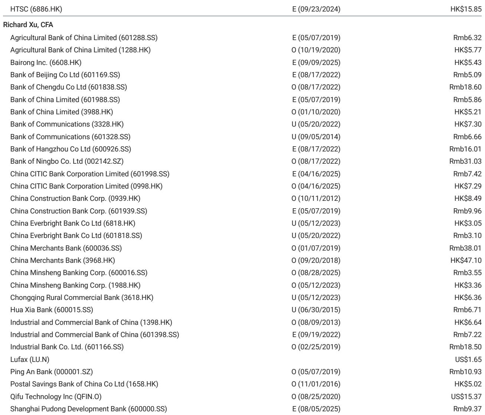
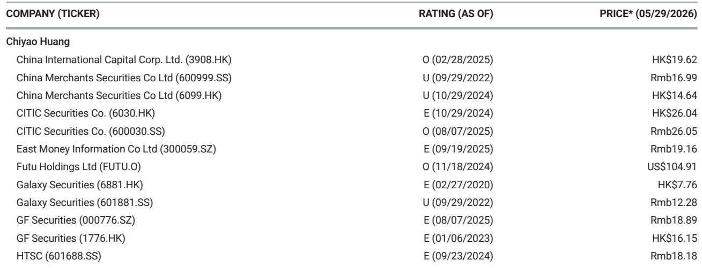
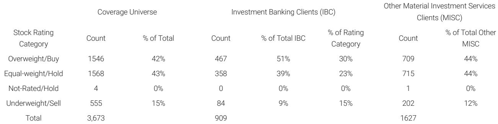

# The Market Is Overreacting to Hong Kong Cross-Border Financial Flow Tightening — Here Is Why the Real Story Is Different

Investors have been bracing for the worst. Recent regulatory signals from Hong Kong’s Securities and Futures Commission and the Monetary Authority have triggered a wave of concern that Beijing is preparing to clamp down on financial flows into Hong Kong, threatening the city’s role as China’s primary offshore capital hub. The narrative is compelling: a tightening of cross-border investment accounts, a crackdown on retail trading channels, and an implicit message that the era of easy capital movement is ending. But this narrative is fundamentally wrong. The regulatory adjustments now underway are not a broad-based tightening of cross-border financial flows. They are a surgical cleanup of fraudulent investment accounts, not a structural attack on the legitimate capital account liberalization that has defined China’s financial integration for the past decade.

Why does this distinction matter now? Because the market is pricing in a risk that does not exist. If investors treat this as a systemic shift, they will misallocate capital, overestimate regulatory risk in Hong Kong-listed financials, and miss the more important story: the gradual, managed expansion of official cross-border investment programs that is actually accelerating. The real question is not whether China is closing the door to Hong Kong. It is how investors should position themselves for the next phase of controlled liberalization.

The timing of this regulatory adjustment is also telling. It comes at a moment when China is experiencing healthy foreign exchange inflows, the renminbi is appreciating, and the People’s Bank of China is actively withdrawing onshore liquidity to manage the resulting money supply expansion. This is not the environment in which a government imposes capital controls. Tightening cross-border flows when you have surplus inflows is like closing the floodgates when the reservoir is already full. The logic does not hold.

## The Regulatory Focus Is on Fraudulent Accounts, Not Legitimate Investment Channels

The most important distinction that the market has failed to grasp is between the crackdown on fraudulent investment accounts and any broader restriction on normal bank accounts, insurance sales channels, or legitimate cross-border investment. The latest circular from the Hong Kong SFC makes this explicit: open investment accounts for mainland customers are still permitted, provided that additional compliance requirements are met. This is not a ban. It is a tightening of the compliance framework.

What is actually being targeted? Accounts that were used for unauthorized trading, money laundering, or circumventing existing regulatory structures. These are the accounts that operate in the grey zone between Hong Kong’s open financial system and China’s capital controls. The regulators are cleaning up the edges, not shrinking the core.

For investors, the implication is straightforward. The large, regulated financial institutions that serve mainland clients through proper channels — banks, licensed brokers, and insurance companies — face minimal disruption. Their compliance infrastructure is already built to handle the additional requirements. The pain will be concentrated among smaller players, particularly those that relied on grey-market account opening practices to attract mainland clients. These are the names that will see portfolio trimming from mainland investors who fear they can no longer place trades from onshore.

But here is the critical nuance: even this impact is likely to be temporary and contained. The reason lies in the second-order effect of the regulatory cleanup.

## Small-Cap Liquidity Will Be the Most Visible Casualty, but the Mechanism Is Self-Correcting

The immediate market impact will be felt most acutely in smaller-cap Hong Kong stocks. This is not because regulators are targeting small caps. It is because mainland investors, anticipating that their trading channels may become restricted, will preemptively trim their positions in less liquid names. When a large cohort of investors simultaneously reduces exposure in a low-liquidity environment, the price impact is disproportionate.

This is a classic coordination problem. Each individual investor acts rationally to reduce risk, but collectively they create the very price decline they feared. The stocks that suffer most are those with thin trading volumes, narrow analyst coverage, and limited institutional ownership — precisely the names that were most dependent on retail mainland flows.

But this mechanism is self-correcting for two reasons. First, the selling pressure is driven by anticipation, not by actual account closures. Once investors realize that legitimate accounts remain operational, the panic selling should subside. Second, and more importantly, the official channels for cross-border investment are expanding simultaneously. The Stock Connect, Bond Connect, Wealth Connect, and QDII programs are all being broadened to absorb the demand that was previously served by grey-market channels.

This is the strategic logic that the market is missing. The regulators are not reducing the total volume of cross-border investment. They are redirecting it from unregulated channels into regulated ones. The total pie is not shrinking. It is being reorganized.

## The Macro Environment Makes Broad-Based Tightening Unnecessary and Counterproductive

To understand why a broad-based tightening is unlikely, one must look at the macro backdrop. China is currently experiencing healthy foreign exchange inflows. The renminbi has been appreciating, reflecting improved confidence in the Chinese economy and a weaker US dollar cycle. In this environment, the PBOC has actually been withdrawing onshore liquidity to manage the increased money inflows, not adding more restrictions.

Think about what it would mean for the PBOC to impose capital controls during a period of appreciation and surplus inflows. It would signal a lack of confidence in the currency regime, undermine the internationalization of the renminbi, and contradict the entire policy direction of the past decade. China has been systematically opening its capital account — cautiously, incrementally, but unmistakably. To reverse course now would be to abandon a strategic priority that is central to the country’s long-term financial ambitions.

The regulatory adjustment in Hong Kong should be read in this context. It is not a response to capital flight. It is not a response to balance of payments pressure. It is a response to specific compliance failures in the retail brokerage sector. The macro environment is actually supportive of further liberalization, not retrenchment.

This is why the report’s view is that any potential tightening of cross-border flows is unnecessary. The data supports this. The policy direction supports this. The only thing that does not support it is the market’s fear narrative.

## What the Report Does Not Fully Answer: The Political Economy of Regulatory Timing

For all its analytical rigor, the report leaves one critical question unresolved: why now? If the regulatory adjustment is as narrow and contained as the analysis suggests, why did the authorities choose this specific moment to act? The report points to compliance failures, but compliance failures are not new. They have existed for years. Something must have changed to trigger the enforcement action.

One possible explanation lies in the political calendar. The Chinese government has been conducting a broader financial sector cleanup, targeting everything from property developer debt to local government financing vehicles. The Hong Kong brokerage sector may simply be the next item on the list. But this explanation is unsatisfying because it does not explain the timing specificity.

Another possibility is that the regulators are acting preemptively. They may have detected a buildup of risk in the grey-market brokerage channels that, left unaddressed, could have led to a more serious crisis. By cleaning up the accounts now, while the macro environment is benign, they reduce the risk of a disorderly adjustment later. This is the prudent regulator’s playbook: fix the roof while the sun is shining.

But there is a third possibility that the report does not explore: the regulatory adjustment may be a signal to Hong Kong’s financial establishment. The message may be that Hong Kong’s status as an offshore center depends on its ability to enforce compliance standards that are consistent with mainland regulations. If Hong Kong wants to retain its role as the primary channel for Chinese capital outflows, it must demonstrate that it can police its own markets. The regulatory adjustment is as much about institutional alignment as it is about investor protection.

Investors who want the full picture need to understand which of these explanations is most accurate. The answer will determine whether this is a one-time event or the beginning of a more sustained enforcement cycle.

## A Decision Framework for Investors: How to Navigate the Regulatory Uncertainty

Given the ambiguity, investors need a structured approach to assess their exposure. The following framework is designed to help distinguish between companies that are genuinely at risk and those that are merely caught in the market’s overreaction.

First, assess the client acquisition channel. Companies that onboard mainland clients through fully licensed, regulated channels — with proper KYC and AML procedures — face minimal regulatory risk. Companies that relied on third-party introducers, unlicensed agents, or grey-market account opening practices face material compliance risk. The distinction is not between large and small firms. It is between compliant and non-compliant operations.

Second, evaluate the revenue concentration in small-cap trading. If a brokerage or financial platform generates a significant portion of its revenue from trading in low-liquidity Hong Kong small caps, it will face a double hit: reduced trading volumes from mainland clients who are trimming positions, and lower commission income from the stocks that are most affected. Companies with diversified revenue streams across large caps, ETFs, and international markets are better insulated.

Third, consider the balance sheet exposure to client margin lending. If mainland clients are forced to reduce their positions, margin loans backed by Hong Kong small-cap collateral will come under pressure. Firms with high loan-to-value ratios and concentrated collateral in the most affected names face the greatest risk of credit losses.

Fourth, monitor the expansion of official channels. The Wealth Connect program is being broadened, QDII quotas are increasing, and the Stock Connect is being enhanced. Companies that are positioned to capture the redirected flows through these official channels will benefit from the regulatory cleanup. They are the winners in this reallocation.

Fifth, watch the regulatory dialogue between the Hong Kong SFC and the China Securities Regulatory Commission. The report suggests that the two regulators are aligned. If this alignment continues, the enforcement will remain focused on fraud and compliance failures. If the dialogue shifts toward broader capital flow restrictions, the risk profile changes entirely.

## The Strategic Opportunity: Why This Is Not a Time to Exit Hong Kong Financials

The market’s fear is understandable but misplaced. The regulatory adjustment in Hong Kong is a surgical cleanup, not a strategic retreat. It is happening at a time when the macro environment supports further liberalization, not retrenchment. And it is being accompanied by an expansion of the official channels that will ultimately absorb the demand that was previously served by grey-market operators.

For investors who can distinguish between the signal and the noise, this creates an opportunity. The stocks that are being sold off indiscriminately include many that are well-positioned for the next phase of controlled liberalization. The regulatory cleanup will ultimately strengthen Hong Kong’s role as China’s offshore financial center by reducing the risk of a disorderly crisis in the grey-market sector.

The unanswered questions remain, and they are important. Investors need to understand the political economy of the regulatory timing, the potential for enforcement to broaden, and the pace at which official channels will expand to fill the gap. But these are questions of degree, not of direction. The direction is clear: China is not closing the door to Hong Kong. It is installing a better lock.

Join the community to read the full report and review the original charts.

*This article is for learning and discussion only and does not constitute investment advice.*

Personal reading notes and learning share only. Not investment advice.

