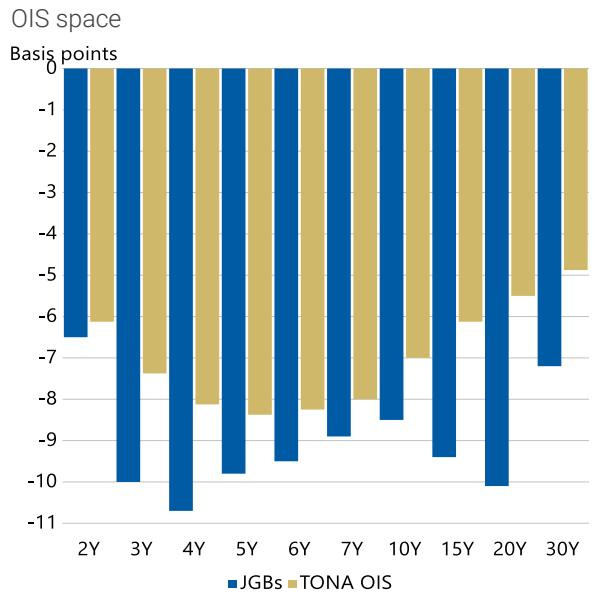
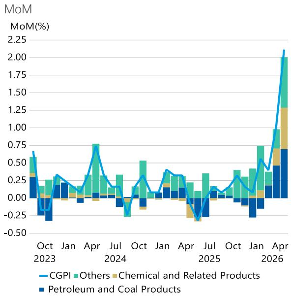
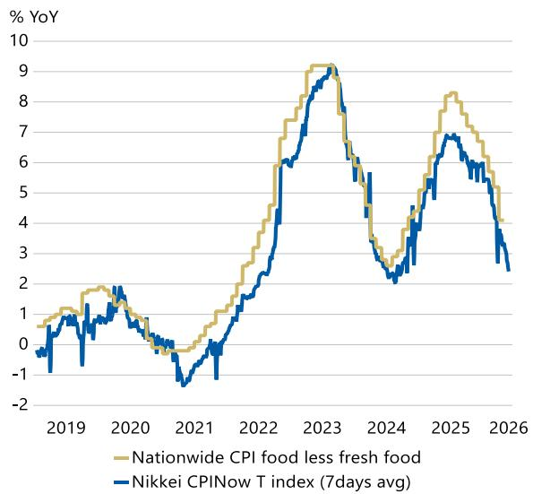
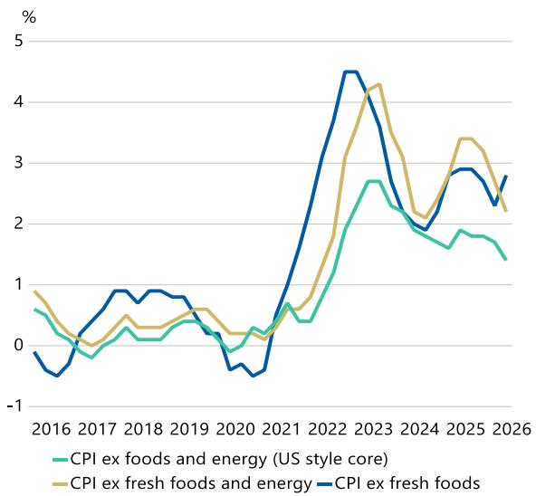
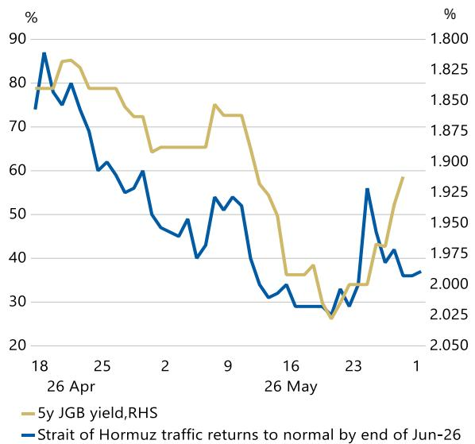
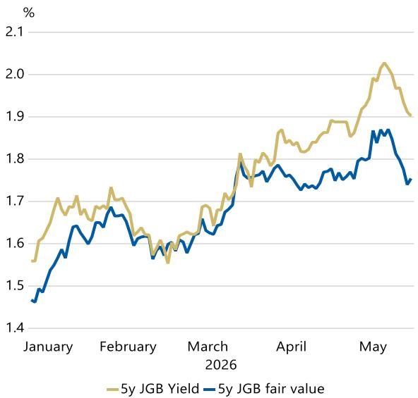

# Japan Rates Strategy | Japan

# Downward Repricing of the Inflation Risk Premium

We argue that the recent outperformance of the belly reflects a downward repricing of excessive inflation risk premium as the market increasingly focuses on "real" economic data. While the Middle East situation remains fluid, we see scope for a further belly-led rally under both "de-escalation" and "escalation" scenarios.

# Key Takeaways

Earlier market concerns centered on the BoJ potentially falling “behind the curve,” particularly after the strong April CGPI print. Rising JGBi breakevens also reinforced fears for a second-round effect.   
However, actual consumer inflation data (excluding temporary factors) have been softer. April nationwide CPI showed slowing in core-core and “US-style” core inflation, despite energy-driven headline pressure.   
The recent resilience of the belly suggests markets are shifting focus from "forward looking" inflation overshoot risk to "real" economic data.   
We see further rally potential in the belly as it still prices in ample inflation risk premium, and we maintain a 5y JGB outright long position.   
In contrast, we see the super-long sector remaining vulnerable to fiscal expansion concerns, including potential “bridging bonds” and relief spending.

Please add me to your distribution list.

MS MUFG SECURITIES CO., LTD.+

# Koichi Sugisaki

Strategist

Koichi.Sugisaki@morganstanleymufg.com

+81 3 6836-8428

# Hiromu Uezato

Strategist

Hiromu.Uezato@morganstanleymufg.com

+81 3 6836-8431

text_image

Japan Summit 2026

MS does and seeks to do business with companies covered in MS. As a result, investors should be aware that the firm may have a conflict of interest that could affect the objectivity of MS. Investors should consider MS as only a single factor in making their investment decision.

# For analyst certification and other important disclosures, refer to the Disclosure Section, located at the end of this report.

+= Analysts employed by non-U.S. affiliates are not registered with FINRA, may not be associated persons of the member and may not be subject to FINRA restrictions on communications with a subject company, public appearances and trading securities held by a research analyst account.

# Interest Rate Strategy

# Japan | Downward Repricing of the Inflation Risk Premium

MS MUFG SECURITIES CO., LTD.

Koichi Sugisaki

koichi.sugisaki@morganstanleymufg.com +81 3 6836-8428

Hiromu Uezato

hiromu.uezato@morganstanleymufg.com +81 3 6836-8431

# Downward repricing of the inflation risk premium

The belly sector of the JGB yield curve outperformed markedly this week (see Exhibit 1). As we discussed in "Switching to Outright Long on the Belly", an excessive inflation risk premium appeared to have been priced into the belly zone amid market concerns about the risk of the BoJ falling "behind the curve".

However, our discussions with clients this week have left us with the impression that many are starting to feel that the BoJ's terminal policy rate level might very well end up being lower than is currently priced in.

A big upside surprise in the BoJ's corporate goods price index (CGPI) for April—with prices climbing particularly sharply for “petroleum and coal products” and “chemicals and related products”—seemingly fueled expectations that a continuing lack of progress in Middle East peace negotiations could trigger a significant inflation overshoot and thereby force the central bank’s hand on additional rate hikes (see Exhibit 2).

Exhibit 1: Weekly change in yield in both JGB and   

bar

| Maturity | JGBs | TONA OIS |
| -------- | ---- | -------- |
| 2Y       | -6.5 | -6.0     |
| 3Y       | -10.0| -7.5     |
| 4Y       | -11.0| -8.0     |
| 5Y       | -9.5 | -8.5     |
| 6Y       | -9.0 | -8.0     |
| 7Y       | -8.5 | -8.0     |
| 10Y      | -8.0 | -7.0     |
| 15Y      | -9.0 | -6.0     |
| 20Y      | -10.0| -5.5     |
| 30Y      | -7.0 | -5.0     |

Source: MS, Bloomberg

Exhibit 2: Japan Corporate Goods price Index   

bar_stacked

| Month | CGPI (%) | Others (%) | Chemical and Related Products (%) | Petroleum and Coal Products (%) |
|---|---|---|---|---|
| Oct 2023 | 0.7 | 0.55 | 0.15 | 0.3 |
| Jan 2024 | 0.35 | 0.25 | 0.05 | 0.2 |
| Apr 2024 | 0.3 | 0.75 | 0.05 | -0.1 |
| Jul 2024 | 0.15 | 0.35 | 0.05 | -0.15 |
| Oct 2024 | -0.25 | -0.15 | -0.1 | -0.1 |
| Jan 2025 | 0.4 | 0.55 | 0.05 | 0.1 |
| Apr 2025 | 0.35 | 0.2 | -0.15 | -0.1 |
| Jul 2025 | -0.3 | 0.35 | -0.1 | -0.1 |
| Oct 2025 | 0.15 | 0.4 | -0.1 | -0.1 |
| Jan 2026 | 0.35 | 0.75 | 0.1 | -0.15 |
| Apr 2026 | 2.1 | 2.0 | 1.3 | 0.7 |

Source: BoJ, MS

JGBi breakevens have meanwhile continued to strengthen, which may also have given market participants cause to contemplate a scenario in which increasingly aggressive corporate pricing behavior starts to feed through to the prices faced by consumers. With BoJ officials having moreover acknowledged such a possibility, the net upshot appears to have been an acceleration in positioning premised on “behind the curve” risk.

Consumer price trends have however been telling a different story. The Nikkei CPINow index points to continuing disinflation even in May (as we discussed in "Switching to Outright Long on the Belly") (see Exhibit 3), and the slightly less timely Tokyo CPI data for May have subsequently painted a similar picture.

Moreover, while the nationwide CPI numbers for April did show a quickening of year-on-year inflation for the BoJ's core gauge excluding fresh food and institutional factors (reflecting the recent surge in energy prices), core-core inflation (excluding energy as well as fresh food) and "US-style" core inflation (excluding all food and energy) meanwhile slowed in a manner consistent with the CPINow trajectory (see Exhibit 4).

Exhibit 3: Nikkei CPI T Index (y/y) vs. Nationwide CPI food less fresh food   

line

| Year | Nationwide CPI food less fresh food | Nikkei CPINow T index (7days avg) |
|------|----------------------------------------|------------------------------------|
| 2019 | ~0.5                                   | ~0.0                               |
| 2020 | ~1.8                                   | ~1.5                               |
| 2021 | ~-0.5                                  | ~-1.5                              |
| 2022 | ~4.0                                   | ~3.0                               |
| 2023 | ~9.0                                   | ~9.0                               |
| 2024 | ~3.0                                   | ~2.5                               |
| 2025 | ~8.0                                   | ~7.0                               |
| 2026 | ~3.0                                   | ~2.5                               |

Source: Nowcast, MS

Exhibit 4: Nationwide CPI inflation excluding special factors   

line

| Year | CPI ex foods and energy (US style core) | CPI ex fresh foods and energy | CPI ex fresh foods |
|------|------------------------------------------|----------------------------------|--------------------|
| 2016 | 0.5                                      | 0.8                              | -0.5               |
| 2017 | 0.2                                      | 0.3                              | 0.9                |
| 2018 | 0.4                                      | 0.5                              | 0.8                |
| 2019 | 0.3                                      | 0.6                              | 0.7                |
| 2020 | -0.1                                     | 0.2                              | -0.5               |
| 2021 | 0.6                                      | 0.7                              | 1.5                |
| 2022 | 1.5                                      | 2.0                              | 3.5                |
| 2023 | 2.7                                      | 4.3                              | 4.5                |
| 2024 | 1.8                                      | 2.0                              | 2.5                |
| 2025 | 1.7                                      | 3.4                              | 2.9                |
| 2026 | 1.4                                      | 2.3                              | 2.7                |

Source: BoJ, MS

Teikoku Databank's May survey (only Japanese is available) of 195 major food manufacturers points to the number of June price hikes being well down from 2025 and moreover shows “higher ingredient and raw material costs” having taken over from other justifications for raising prices (such as “higher labor costs”) by comparison with the start of this year.

This change in stance could quite conceivably be attributable to firms fearing a backlash from consumers if price hikes go beyond what can be readily explained in terms of higher ingredient costs.

To summarize: whereas markets initially adopted a forward-looking perspective in worrying about the potential for the Middle East conflict to trigger excessive inflation, they since appear to have started to dial back their assessments of inflation overshoot risk after seeing further slowdowns in actual inflation measurements.

BoJ Governor Kazuo Ueda's opening remarks to an international conference on May 27 may have also served as a catalyst as he used the examples of previous oil shocks to explain that “initial conditions matter enormously” (with regard to, for example, wages and price expectations) when it comes to eventual inflationary impact.

Ueda's prepared text did concede that "the recent episode became more persistent than the oil price surge of the mid-2000s", but then immediately added that "Still, Japan has not experienced an early 1970s-style wage-price spiral. Medium- to long-term inflation expectations have shifted only modestly upward from a long entrenched near-zero level to a range of 1.5–2+%, depending on the measure".

This assessment might very well have helped to alleviate what appeared to be somewhat excessive concerns about upside inflation risk.

# Middle East situation remains in a constant state of flux

As of early this week there were hopes that the US and Iran might be getting closer to reaching an agreement on a memorandum for a permanent ceasefire. However, tensions remain elevated, with renewed incidents this week, and with Polymarket showing a decline from close to 50% to around 30% in the perceived probability of Strait of Hormuz traffic returning to normal by the end of June (see Exhibit 5).

While optimism around a potential MoU has been fueled by press reports that U.S. and Iranian negotiators have reached an agreement on a 60-day MoU, the situation still remains uncertain with no official announcement from either side at the time of writing.

The belly zone of the curve has previously tended to underperform when inflation concerns were fueled by escalations of Middle East tensions, but the differing reaction seen over the past couple of days is strongly suggestive of markets no longer being quite so concerned about the risk of an inflation overshoot (see Exhibit 5).

We as yet see ample potential for a further rally in the belly zone as markets seemingly start to focus more on how a protracted Middle East conflict might impact the real economy, and as such suggest sticking with previously recommended 5y JGB outright longs (see Exhibit 6).

Exhibit 5: Polymarket: probability of Strait of Hormuz traffic returning to normal versus 5y JGB yield   

line

| Date       | 5y JGB yield,RHS | Strait of Hormuz traffic returns to normal by end of Jun-26 |
| ---------- | ---------------- | --------------------------------------------------------------- |
| 18 Apr     | 80               | 1.800                                                           |
| 26 May     | 35               | 2.000                                                           |

Source: Polymarket, MS, Bloomberg

Exhibit 6: 5y JGB fair value versus actual yield level   

line

| Month    | 5y JGB Yield | 5y JGB fair value |
| -------- | ------------ | ----------------- |
| January  | 1.55         | 1.45              |
| February | 1.70         | 1.65              |
| March    | 1.65         | 1.60              |
| April    | 1.85         | 1.75              |
| May      | 2.05         | 1.85              |

Source: MS, Bloomberg

Continuing instability does however appear likely further out the curve, with markets seemingly worried that an extended blockade of the Strait of Hormuz could ultimately cause the Takaichi administration to spend even more on fiscal “relief” measures.

Moreover, some media agencies have reported that the government plans to lay out a framework in its forthcoming “Basic Policy on Economic and Fiscal Management and Reform” for using so-called “bridging bonds” to fund a portion of promised spending on growth strategy measures and “crisis management investment”.

Such bonds would be categorized separately from special deficit-financing bonds and—like “Children Special Bonds”, “GX Economy Transition Bonds”, and “Semiconductors and AI Bonds”—issued with guarantees on specific means to pay for redemption.

The government is more specifically saying that the bonds will be repaid using future returns on “growth investments”. Issuance might thus be considered fiscally “neutral” at least from an accounting perspective inasmuch as it should not cause either the debt-to-GDP ratio or the primary balance to deteriorate.

However, the net upshot will still be an increase in supply of bonds. Given current market conditions we would expect the MoF to focus primarily on issuance of T-bills and retail JGBs that should have only limited impact in terms of supply of interest rate risk to the secondary market.

There is however still uncertainty as to whether future “growth investment” returns will be sufficient to cover redemption obligations, and we accordingly see risk of a further selloff in the super-long sector if offshore investors lack confidence in the debt repayment plan and effectively view the proposed bridging bonds as being no different from special deficit-financing bonds.

In the aforementioned “Basic Policy on Economic and Fiscal Management and Reform”, the government also plans to reflect the National Council on Social Security’s interim assessment of plans for a refundable tax credit scheme and a consumption tax cut.

As we discussed in "Switching to Outright Long on the Belly", while the government has proposed permanent funding sources for such measures it is, at least as of now, yet to identify what those sources might be.

We would thus not be at all surprised if the 10y+ portion of the JGB market were to see another sharp selloff (reminiscent of mid-May) due to the overseas investors who are currently shouldering most of the burden of absorbing super-long JGB issuance becoming increasingly concerned about fiscal expansion pressures.

The 30y sector in particular looks especially likely to lag behind the belly zone under a “declining yields” scenario given that valuation-sensitive investors already appear to have quite significant exposure, for which reason we also suggest sticking with 30y JGB ASW short positions.

Trade Idea: Maintain 5y JGB outright

Trade Idea: Maintain Short 30y JGB ASW

Trade Idea: Maintain receive July MPM OIS

# Valuation Methodology and Risks

Below, you will find a list of our current trade ideas, entry levels, entry dates, rationales, and risks.

Exhibit 7: Trade ideas: Valuation methodology and risks 

<table><tr><td colspan="5">Interest Rate Strategy</td></tr><tr><td>TRADE</td><td>ENTRY LEVEL</td><td>ENTRY DATE</td><td>RATIONALE</td><td>RISKS</td></tr><tr><td>Receive July BoJ MPM OIS</td><td>97.1bp</td><td>5/15/2026</td><td>While it is not our economists&#x27; base case, if the Strait of Hormuz remains effectively closed beyond July, our economists see the risk of the BoJ maintaining the status quo for longer as the signs of supply disruption emerge.</td><td>Risk to the trade include consecutive BoJ rate hikes on June and July MPM.</td></tr><tr><td>Short 30y JGB ASW</td><td>57.3bp</td><td>5/15/2026</td><td>We expect renewed fiscal concern to make offshore investors reluctant to buy long-end JGBs, thereby leading to the cheapening of ASW.</td><td>Risk to the trade include strong demand for long-end JGB ASW to persist on the back of its attractive carry profile.</td></tr><tr><td>Buy 5y JGB outright</td><td>1.858%</td><td>4/10/2026</td><td>We think the belly of the curve already prices in enough inflation risk premium. Shifting either &quot;de-escalation&quot; or &quot;Effective closure&quot; scenario should lead to a lower inflation term premium.</td><td>The main risk to this trade is that soaring energy prices cause medium- to long-term inflation expectations to strengthen yet further.</td></tr></table>

Source: MS

Important note regarding economic sanctions. This report references jurisdiction(s) or person(s) which may be the subject of economic sanctions. Readers are solely responsible for ensuring that their investment activities are carried out in compliance with applicable laws.

Global Macro Strategy Team 

<table><tr><td rowspan="5">MS &amp; CO. LLC</td><td>Matthew Hornbach, CMT Matthew.Hornbach@morganstanley.com</td><td>Global Head of Macro Strategy</td><td>+1 212 761-1837</td></tr><tr><td>Martin Tobias, CFA, CMT</td><td>US Rates Strategist</td><td>+1 212 761-6076</td></tr><tr><td>Shaun Zhou</td><td>US Rates Strategist</td><td>+1 212 761-3348</td></tr><tr><td>Aryaman Singh</td><td>US Rates Strategist</td><td>+1 212 761-1993</td></tr><tr><td>Eli Carter</td><td>US Rates Strategist</td><td>+1 212 761-4703</td></tr><tr><td rowspan="6">MS &amp; CO. LLC</td><td>Andrew Watrous</td><td>G10 FX Strategist</td><td>+1 212 761-5287</td></tr><tr><td>Molly Nickolin</td><td>G10 FX Strategist</td><td>+1 212 761-3592</td></tr><tr><td>Simon Waever Simon.Waever@morganstanley.com</td><td>Head of EM Sovereign Credit and Latin America Fixed Income Strategy</td><td>+1 212 296-8101</td></tr><tr><td>Ioana Zamfir</td><td>Head of Latin America Macro Strategy</td><td>+1 212 761-4012</td></tr><tr><td>Emma Cerda</td><td>Latin America Sovereign Credit</td><td>+1 212 761-2344</td></tr><tr><td>Sofia Palacios</td><td>Latin America Macro Strategist</td><td>+1 212 761-0428</td></tr><tr><td rowspan="7">MS &amp; CO. INTERNATIONAL PLC</td><td>James K. Lord James.Lord@morganstanley.com</td><td>Global Head of FXEM Strategy</td><td>+44 20 7677-3254</td></tr><tr><td>Gianluca Salford Luca.Salford@morganstanley.com</td><td>Head of European Rates Strategy</td><td>+44 20 7677-1337</td></tr><tr><td>Maria Chiara Russo</td><td>Euro Area Rates Strategist</td><td>+44 20 7425-3499</td></tr><tr><td>Fabio Bassanin, CFA</td><td>UK Rates Strategist</td><td>+44 20 7425-1869</td></tr><tr><td>David S. Adams, CFA David.S.Adams@morganstanley.com</td><td>Head of G10 FX Strategy</td><td>+44 20 7425-3518</td></tr><tr><td rowspan="2">Neville Mandimika Arnav Gupta</td><td>CEEMEA Sovereign Credit Strategist</td><td>+44 20 7425-2509</td></tr><tr><td>CEEMEA Rates Strategist</td><td>+44 20 7677-0382</td></tr><tr><td>MS ASIA LIMITED+</td><td>Gek Teng Khoo</td><td>AXJ Macro Strategist</td><td>+852 3963-0303</td></tr><tr><td>MS INDIA COMPANY PRIVATE LIMITED</td><td>Nimish Prabhune</td><td>AXJ Macro Strategist</td><td>+91 22 6996-1862</td></tr><tr><td rowspan="2">MS MUFG SECURITIES CO., LTD.</td><td>Koichi Sugisaki Koichi.Sugisaki@morganstanleymufg.com</td><td>Head of Japan Macro Strategy</td><td>+81 3 6836-8428</td></tr><tr><td>Hiromu Uezato</td><td>Japan Macro Strategist</td><td>+81 3 6836-8431</td></tr></table>

# Disclosure Section

The information and opinions in MS were prepared by MS MUFG Securities Co., Ltd. and its affiliates (collectively, "MS").

For important disclosures, stock price charts and equity rating histories regarding companies that are the subject of this report, please see the MS Disclosure Website at www.morganstanley.com/eqr/disclosures/webapp/generalresearch, or contact your investment representative or MS at 1585 Broadway, (Attention: Research Management), New York, NY, 10036 USA.

For valuation methodology and risks associated with any recommendation, rating or price target referenced in this research report, please contact the Client Support Team as follows: US/Canada +1 800 303-2495; Hong Kong +852 2848-5999; Latin America +1 718 754-5444 (U.S.); London +44 (0)20-7425-8169; Singapore +65 6834-6860; Sydney +61 (0)2-9770-1505; Tokyo +81 (0)3-6836-9000. Alternatively you may contact your investment representative or MS at 1585 Broadway, (Attention: Research Management), New York, NY 10036 USA.

# Analyst Certification

The following analysts hereby certify that their views about the companies and their securities discussed in this report are accurately expressed and that they have not received and will not receive direct or indirect compensation in exchange for expressing specific recommendations or views in this report: Koichi Sugisaki; Hiromu Uezato.

# Global Research Conflict Management Policy

MS has been published in accordance with our conflict management policy, which is available at www.morganstanley.com/institutional/research/conflictpolicies. A Portuguese version of the policy can be found at www.morganstanley.com.br

# Important Regulatory Disclosures on Subject Companies

In the next 3 months, MS expects to receive or intends to seek compensation for investment banking services from Japan.

Within the last 12 months, MS has provided or is providing investment banking services to, or has an investment banking client relationship with, the following company: Japan. The equity research analysts or strategists principally responsible for the preparation of MS have received compensation based upon various factors, including quality of research, investor client feedback, stock picking, competitive factors, firm revenues and overall investment banking revenues. Equity Research analysts' or strategists' compensation is not linked to investment banking or capital markets transactions performed by MS or the profitability or revenues of particular trading desks.

MS and its affiliates do business that relates to companies/instruments covered in MS, including market making, providing liquidity, fund management, commercial banking, extension of credit, investment services and investment banking. MS sells to and buys from customers the securities/instruments of companies covered in MS on a principal basis. MS may have a position in the debt of the Company or instruments discussed in this report. MS trades or may trade as principal in the debt securities (or in related derivatives) that are the subject of the debt research report.

Certain disclosures listed above are also for compliance with applicable regulations in non-US jurisdictions.

# STOCK RATINGS

MS uses a relative rating system using terms such as Overweight, Equal-weight, Not-Rated or Underweight (see definitions below). MS does not assign ratings of Buy, Hold or Sell to the stocks we cover. Overweight, Equal-weight, Not-Rated and Underweight are not the equivalent of buy, hold and sell. Investors should carefully read the definitions of all ratings used in MS. In addition, since MS contains more complete information concerning the analyst's views, investors should carefully read MS, in its entirety, and not infer the contents from the rating alone. In any case, ratings (or research) should not be used or relied upon as investment advice. An investor's decision to buy or sell a stock should depend on individual circumstances (such as the investor's existing holdings) and other considerations.

# Global Stock Ratings Distribution

(as of April 30, 2026)

The Stock Ratings described below apply to MS's Fundamental Equity Research and do not apply to Debt Research produced by the Firm.

For disclosure purposes only (in accordance with FINRA requirements), we include the category headings of Buy, Hold, and Sell alongside our ratings of Overweight, Equal-weight, Not-Rated and Underweight. MS does not assign ratings of Buy, Hold or Sell to the stocks we cover. Overweight, Equal-weight, Not-Rated and Underweight are not the equivalent of buy, hold, and sell but represent recommended relative weightings (see definitions below). To satisfy regulatory requirements, we correspond Overweight, our most positive stock rating, with a buy recommendation; we correspond Equal-weight and Not-Rated to hold and Underweight to sell recommendations, respectively.

<table><tr><td></td><td colspan="2">Coverage Universe</td><td colspan="3">Investment Banking Clients (IBC)</td><td colspan="2">Other Material Investment ServicesClients (MISC)</td></tr><tr><td>Stock RatingCategory</td><td>Count</td><td>% of Total</td><td>Count</td><td>% of Total IBC</td><td>% of RatingCategory</td><td>Count</td><td>% of Total OtherMISC</td></tr><tr><td>Overweight/Buy</td><td>1546</td><td>42%</td><td>467</td><td>51%</td><td>30%</td><td>709</td><td>44%</td></tr><tr><td>Equal-weight/Hold</td><td>1568</td><td>43%</td><td>358</td><td>39%</td><td>23%</td><td>715</td><td>44%</td></tr><tr><td>Not-Rated/Hold</td><td>4</td><td>0%</td><td>0</td><td>0%</td><td>0%</td><td>1</td><td>0%</td></tr><tr><td>Underweight/Sell</td><td>555</td><td>15%</td><td>84</td><td>9%</td><td>15%</td><td>202</td><td>12%</td></tr><tr><td>Total</td><td>3,673</td><td></td><td>909</td><td></td><td></td><td>1627</td><td></td></tr></table>

Data include common stock and ADRs currently assigned ratings. Investment Banking Clients are companies from whom MS received investment banking compensation in the last 12 months. Due to rounding off of decimals, the percentages provided in the "% of total" column may not add up to exactly 100 percent.

# Analyst Stock Ratings

Overweight (O). The stock's total return is expected to exceed the average total return of the analyst's industry (or industry team's) coverage universe, on a risk-adjusted basis, over the next 12-18 months.

Equal-weight (E). The stock's total return is expected to be in line with the average total return of the analyst's industry (or industry team's) coverage universe, on a risk-adjusted basis, over

the next 12-18 months.

Not-Rated (NR). Currently the analyst does not have adequate conviction about the stock's total return relative to the average total return of the analyst's industry (or industry team's) coverage universe, on a risk-adjusted basis, over the next 12-18 months.

Underweight (U). The stock's total return is expected to be below the average total return of the analyst's industry (or industry team's) coverage universe, on a risk-adjusted basis, over the next 12-18 months.

Unless otherwise specified, the time frame for price targets included in MS is 12 to 18 months.

# Analyst Industry Views

Attractive (A): The analyst expects the performance of his or her industry coverage universe over the next 12-18 months to be attractive vs. the relevant broad market benchmark, as indicated below.

In-Line (I): The analyst expects the performance of his or her industry coverage universe over the next 12-18 months to be in line with the relevant broad market benchmark, as indicated below. Cautious (C): The analyst views the performance of his or her industry coverage universe over the next 12-18 months with caution vs. the relevant broad market benchmark, as indicated below. Benchmarks for each region are as follows: North America - S&P 500; Latin America - relevant MSCI country index or MSCI Latin America Index; Europe - MSCI Europe; Japan - TOPIX; Asia - relevant MSCI country index or MSCI sub-regional index or MSCI AC Asia Pacific ex Japan Index.

# Important Disclosures for MS Smith Barney LLC Customers

Important disclosures regarding any material conflict of interest that can reasonably be expected to have influenced MS Smith Barney LLC's choice of a third-party research provider or the subject company of a third-party research report, are available on the MS Wealth Management disclosure website at www.morganstanley.com/online/researchdisclosures. For MS specific disclosures, you may refer to https://www.morganstanley.com/eqr/disclosures/webapp/generalresearch.

Each MS report is reviewed and approved on behalf of MS Smith Barney LLC. This review and approval is conducted by the same person who reviews the research report on behalf of MS. This could create a conflict of interest.

# Other Important Disclosures

MS policy is to update research reports as and when the Research Analyst and Research Management deem appropriate, based on developments with the issuer, the sector, or the market that may have a material impact on the research views or opinions stated therein. In addition, certain Research publications are intended to be updated on a regular periodic basis (weekly/monthly/quarterly/annual) and will ordinarily be updated with that frequency, unless the Research Analyst and Research Management determine that a different publication schedule is appropriate based on current conditions.

MS is not acting as a municipal advisor and the opinions or views contained herein are not intended to be, and do not constitute, advice within the meaning of Section 975 of the Dodd-Frank Wall Street Reform and Consumer Protection Act.

MS produces an equity research product called a "Tactical Idea." Views contained in a "Tactical Idea" on a particular stock may be contrary to the recommendations or views expressed in research on the same stock. This may be the result of differing time horizons, methodologies, market events, or other factors. For all research available on a particular stock, please contact your sales representative or go to Matrix at http://www.morganstanley.com/matrix.

MS is provided to our clients through our proprietary research portal on Matrix and also distributed electronically by MS to clients. Certain, but not all, MS products are also made available to clients through third-party vendors or redistributed to clients through alternate electronic means as a convenience. For access to all available MS, please contact your sales representative or go to Matrix at http://www.morganstanley.com/matrix.

Any access and/or use of MS is subject to MS's Terms of Use (http://www.morganstanley.com/terms.html). By accessing and/or using MS, you are indicating that you have read and agree to be bound by our Terms of Use (http://www.morganstanley.com/terms.html). In addition you consent to MS processing your personal data and using cookies in accordance with our Privacy Policy and our Global Cookies Policy (http://www.morganstanley.com/privacy\_pledge.html), including for the purposes of setting your preferences and to collect readership data so that we can deliver better and more personalized service and products to you. To find out more information about how MS processes personal data, how we use cookies and how to reject cookies see our Privacy Policy and our Global Cookies Policy (http://www.morganstanley.com/privacy\_pledge.html). Please use the provided link to review the Terms and Conditions and Most Important Terms and Conditions for MS India Company Private Limited (https://www.morganstanley.com/assets/pdfs/about-us-global-offices/india/Terms\_and\_conditions.pdf) and the following link to review the audit report (https://ny.matrix.ms.com/eqr/research/webapp/researchdocs/MSICPL\_Morgan\_Stanley\_Research\_Audit\_Report.pdf).

If you do not agree to our Terms of Use and/or if you do not wish to provide your consent to MS processing your personal data or using cookies please do not access our research. MS does not provide individually tailored investment advice. MS has been prepared without regard to the circumstances and objectives of those who receive it. MS recommends that investors independently evaluate particular investments and strategies, and encourages investors to seek the advice of a financial adviser. The appropriateness of an investment or strategy will depend on an investor's circumstances and objectives. The securities, instruments, or strategies discussed in MS may not be suitable for all investors, and certain investors may not be eligible to purchase or participate in some or all of them. MS is not an offer to buy or sell or the solicitation of an offer to buy or sell any security/instrument or to participate in any particular trading strategy. The value of and income from your investments may vary because of changes in interest rates, foreign exchange rates, default rates, prepayment rates, securities/instruments prices, market indexes, operational or financial conditions of companies or other factors. There may be time limitations on the exercise of options or other rights in securities/instruments transactions. Past performance is not necessarily a guide to future performance. Estimates of future performance are based on assumptions that may not be realized. If provided, and unless otherwise stated, the closing price on the cover page is that of the primary exchange for the subject company's securities/instruments.

The fixed income research analysts, strategists or economists principally responsible for the preparation of MS have received compensation based upon various factors, including quality, accuracy and value of research, firm profitability or revenues (which include fixed income trading and capital markets profitability or revenues), client feedback and competitive factors. Fixed Income Research analysts', strategists' or economists' compensation is not linked to investment banking or capital markets transactions performed by MS or the profitability or revenues of particular trading desks.

The "Important Regulatory Disclosures on Subject Companies" section in MS lists all companies mentioned where MS owns 1% or more of a class of common equity securities of the companies. For all other companies mentioned in MS, MS may have an investment of less than 1% in securities/instruments or derivatives of securities/instruments of companies and may trade them in ways different from those discussed in MS. Employees of MS not involved in the preparation of MS may have investments in securities/instruments or derivatives of securities/instruments of companies mentioned and may trade them in ways different from those discussed in MS. Derivatives may be issued by MS or associated persons.

With the exception of information regarding MS, MS is based on public information. MS makes every effort to use reliable, comprehensive information, but we make no representation that it is accurate or complete. We have no obligation to tell you when opinions or information in MS change apart from when we intend to discontinue equity research coverage of a subject company. Facts and views presented in MS have not been reviewed by, and may not reflect information known to, professionals in other MS business areas, including investment banking personnel.

MS personnel may participate in company events such as site visits and are generally prohibited from accepting payment by the company of associated expenses unless pre-approved by authorized members of Research management.

MS may make investment decisions that are inconsistent with the recommendations or views in this report.

To our readers based in Taiwan or trading in Taiwan securities/instruments: Information on securities/instruments that trade in Taiwan is distributed by MS Taiwan Limited ("MSTL"). Such information is for your reference only. The reader should independently evaluate the investment risks and is solely responsible for their investment decisions. MS may not be distributed to the public media or quoted or used by the public media without the express written consent of MS. Any non-customer reader within the scope of Article 7-1 of the Taiwan Stock Exchange Recommendation Regulations accessing and/or receiving MS is not permitted to provide MS to any third party (including but not limited to related parties, affiliated companies and any other third parties) or engage in any activities regarding MS which may create or give the appearance of creating a conflict of interest. Information on securities/instruments that do not trade in Taiwan is for informational purposes only and is not to be construed as a recommendation or a solicitation to trade in such securities/instruments. MSTL may not execute transactions for clients in these securities/instruments.

MS is not incorporated under PRC law and the research in relation to this report is conducted outside the PRC. MS does not constitute an offer to sell or the solicitation of an offer to buy any securities in the PRC. PRC investors shall have the relevant qualifications to invest in such securities and shall be responsible for obtaining all relevant approvals, licenses, verifications and/or registrations from the relevant governmental authorities themselves. Neither this report nor any part of it is intended as, or shall constitute, provision of any consultancy or advisory service of securities investment as defined under PRC law. Such information is provided for your reference only.

MS is disseminated in Brazil by MS C.T.V.M. S.A. located at Av. Brigadeiro Faria Lima, 3600, 6th floor, São Paulo - SP, Brazil; and is regulated by the Comissão de Valores Mobiliários; in Mexico by MS México, Casa de Bolsa, S.A. de C.V which is regulated by Comision Nacional Bancaria y de Valores. Paseo de los Tamarindos 90, Torre 1, Col. Bosques de las Lomas Floor 29, 05120 Mexico City; in Japan by MS MUFG Securities Co., Ltd. and, for Commodities related research reports only, MS Capital Group Japan Co., Ltd; in Hong Kong by MS Asia Limited (which accepts responsibility for its contents) and by MS Bank Asia Limited; in Singapore by MS Asia (Singapore) Pte. (Registration number 199206298Z) and/or MS Asia (Singapore) Securities Pte Ltd (Registration number 200008434H), regulated by the Monetary Authority of Singapore (which accepts legal responsibility for its contents and should be contacted with respect to any matters arising from, or in connection with, MS) and by MS Bank Asia Limited, Singapore Branch (Registration number T14FC0118); in Australia to "wholesale clients" within the meaning of the Australian Corporations Act by MS Australia Limited A.B.N. 67 003 734 576, holder of Australian financial services license No. 233742, which accepts responsibility for its contents; in Australia to "wholesale clients" and "retail clients" within the meaning of the Australian Corporations Act by MS Wealth Management Australia Pty Ltd (A.B.N. 19 009 145 555, holder of Australian financial services license No. 240813, which accepts responsibility for its contents; in Korea by MS & Co International plc, Seoul Branch; in India by MS India Company Private Limited having Corporate Identification No (CIN) U22990MH1998PTC115305, regulated by the Securities and Exchange Board of India ("SEBI") and holder of licenses as a Research Analyst (SEBI Registration No. INH000001105); Stock Broker (SEBI Stock Broker Registration No. INZ000244438), Merchant Banker (SEBI Registration No. INM000011203), and depository participant with National Securities Depository Limited (SEBI Registration No. IN-DP-NSDL-567-2021) having registered office at Altimus, Level 39 & 40, Pandurang Budhkar Marg, Worli, Mumbai 400018, India; Telephone no. +91-22-61181000; Compliance Officer Details: Mr. Tejarshi Hardas, Tel. No.: +91-22-61181000 or Email: tejarshi.hardas@morganstanley.com; Grievance officer details: Mr. Tejarshi Hardas, Tel. No.: +91-22-61181000 or Email: msic-compliance@morganstanley.com. MS India Company Private Limited (MSICPL) may use AI tools in providing research services. All recommendations contained herein are made by the duly qualified research analysts; in Canada by MS Canada Limited; in Germany and the European Economic Area where required by MS Europe S.E., authorised and regulated by Bundesanstalt fuer Finanzdienstleistungsaufsicht (BaFin) under the reference number 149169; in the US by MS & Co. LLC, which accepts responsibility for its contents. MS & Co. International plc, authorized by the Prudential Regulation Authority and regulated by the Financial Conduct Authority and the Prudential Regulation Authority, disseminates in the UK research that it has prepared, and research which has been prepared by any of its affiliates, only to persons who (i) are investment professionals falling within Article 19(5) of the Financial Services and Markets Act 2000 (Financial Promotion) Order 2005 (as amended, the "Order"); (ii) are persons who are high net worth entities falling within Article 49(2)(a) to (d) of the Order; or (iii) are persons to whom an invitation or inducement to engage in investment activity (within the meaning of section 21 of the Financial Services and Markets Act 2000, as amended) may otherwise lawfully be communicated or caused to be communicated. RMB MS Proprietary Limited is a member of the JSE Limited and A2X (Pty) Ltd. RMB MS Proprietary Limited is a joint venture owned equally by MS International Holdings Inc. and RMB Investment Advisory (Proprietary) Limited, which is wholly owned by FirstRand Limited. The information in MS is being disseminated by MS Saudi Arabia, regulated by the Capital Market Authority in the Kingdom of Saudi Arabia, and is directed at Sophisticated investors only.

The information in MS is being communicated by MS & Co. International plc (DIFC Branch), regulated by the Dubai Financial Services Authority (the DFSA) or by MS & Co. International plc (ADGM Branch), regulated by the Financial Services Regulatory Authority Abu Dhabi (the FSRA), and is directed at Professional Clients only, as defined by the DFSA or the FSRA, respectively. The financial products or financial services to which this research relates will only be made available to a customer who we are satisfied meets the regulatory criteria of a Professional Client. A distribution of the different MS Research ratings or recommendations, in percentage terms for Investments in each sector covered, is available upon request from your sales representative.

The information in MS is being communicated by MS & Co. International plc (QFC Branch), regulated by the Qatar Financial Centre Regulatory Authority (the QFCRA), and is directed at business customers and market counterparties only and is not intended for Retail Customers as defined by the QFCRA.

As required by the Capital Markets Board of Turkey, investment information, comments and recommendations stated here, are not within the scope of investment advisory activity. Investment advisory service is provided exclusively to persons based on their risk and income preferences by the authorized firms. Comments and recommendations stated here are general in nature. These opinions may not fit to your financial status, risk and return preferences. For this reason, to make an investment decision by relying solely to this information stated here may not bring about outcomes that fit your expectations.

The trademarks and service marks contained in MS are the property of their respective owners. Third-party data providers make no warranties or representations relating to the accuracy, completeness, or timeliness of the data they provide and shall not have liability for any damages relating to such data. The Global Industry Classification Standard (GICS) was developed by and is the exclusive property of MSCI and S&P.

MS, or any portion thereof may not be reprinted, sold or redistributed without the written consent of MS.

Indicators and trackers referenced in MS may not be used as, or treated as, a benchmark under Regulation EU 2016/1011, or any other similar framework.

The issuers and/or fixed income products recommended or discussed in certain fixed income research reports may not be continuously followed. Accordingly, investors should regard those fixed income research reports as providing stand-alone analysis and should not expect continuing analysis or additional reports relating to such issuers and/or individual fixed income products.

MS may hold, from time to time, material financial and commercial interests regarding the company subject to the Research report.

Registration granted by SEBI and certification from the National Institute of Securities Markets (NISM) in no way guarantee performance of the intermediary or provide any assurance of returns to investors. Investment in securities market are subject to market risks. Read all the related documents carefully before investing.

The following authors are Fixed Income Research Analysts/Strategists and are not opining on or expressing recommendations on equity securities: Koichi Sugisaki; Hiromu Uezato.

© 2026 MS