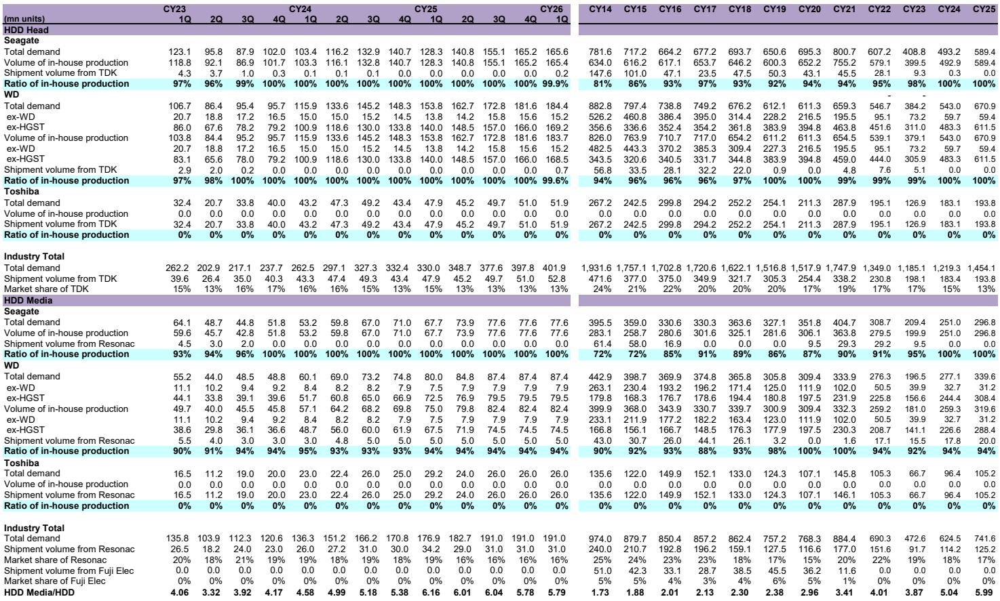
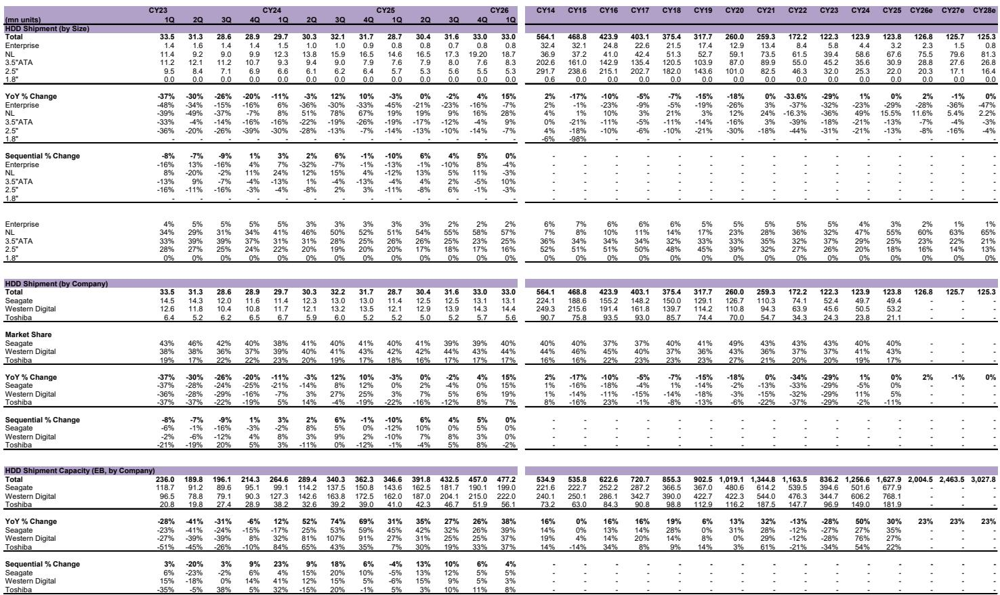
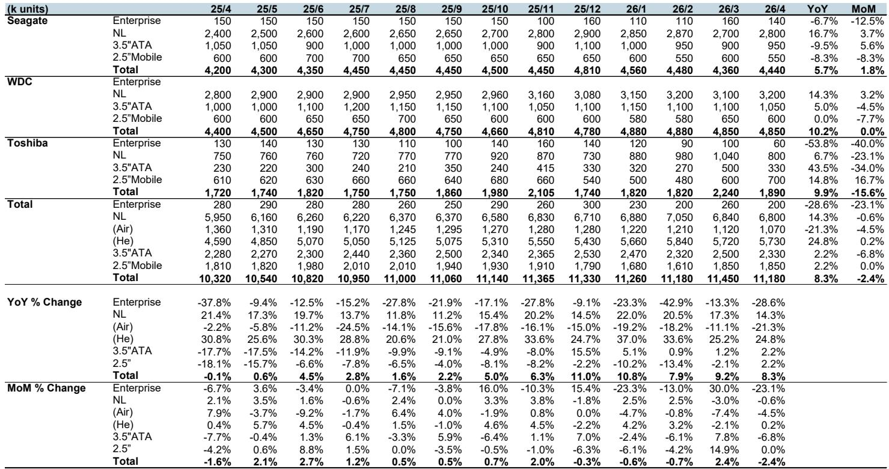

# 数据中心存储的真正拐点，不在SSD对HDD的替代，而在供应链的再分配

市场对存储产业的讨论，长期集中在两个叙事上：一是AI算力爆发带来的企业级SSD需求激增，二是传统HDD被SSD不可逆转地替代。这两个叙事都正确，但都不完整。某外资投行最新发布的日本电子元器件月度追踪报告，提供了一组值得重新审视的信号。2026年4月的数据显示，数据中心用NL HDD出货容量同比增长14.3%，企业级SSD出货容量同比暴增116.7%。两个数字都在增长，但真正值得关注的不是增速本身，而是增速背后的结构性变化——供应链正在被重新分配，而这种分配将决定未来两年哪些公司能真正捕获价值。

这份报告的核心判断是：数据中心存储市场的下一个增长阶段，不再是简单的容量扩张，而是供给侧的再定价。当HDD和SSD都在向更高容量产品迁移时，单位出货量的增速将显著慢于容量增速，这意味着上游零部件供应商的议价能力正在发生根本性转移。那些能够率先将规模优势转化为技术溢价的公司，将在新一轮周期中占据主动。

## 1. 数据中心存储正在从“二选一”走向“三层共存”，这对上游供应链意味着完全不同的竞争逻辑

市场习惯将HDD和SSD视为对立选项，但TSR的预测数据揭示了一个更复杂的图景。报告显示，TSR将2026年数据中心用企业级SSD出货容量预测上调至476.1EB，同比增长81.3%；同时将2026年NL HDD出货容量预测上调至1,844EB，同比增长30.3%。两个市场都在高速增长，且增速都在加速——一个月前，TSR对2026年SSD的预测还是425.3EB（+62.0%），对NL HDD的预测还是2,004.5EB（+23.1%）。

这组数据意味着什么？数据中心存储正在形成“SSD+HDD+磁带”的三层架构。SSD负责热数据、高频访问的工作负载，HDD负责温数据和冷数据的低成本存储，磁带则用于归档。三个市场不是零和博弈，而是共同受益于数据总量的指数级增长。对于上游零部件供应商来说，这意味着他们不需要在技术路线之间做生死抉择，而是可以在多个增长曲线上同时布局。

但这也带来了新的挑战。当三个市场都在增长时，供应商的产能分配、技术投资和客户关系管理就变得更加复杂。那些能够同时服务HDD和SSD产业链的公司，将获得比单一赛道玩家更稳定的增长曲线。这一点在后续的供应链数据中会看得更清楚。

## 2. HDD出货量的真正驱动力不是单位数量的恢复，而是单盘容量的跃迁

报告中的一组数据值得深入解读。2026年4月，整体HDD生产量为1,118万单位，同比增长8.3%，但环比下降2.4%。NL HDD生产量为680万单位，同比增长14.3%，环比微降0.6%。从单位数量看，增长确实在发生，但远谈不上爆发。

真正有意义的增长在容量端。TSR预测2026年整体HDD出货容量将达2,058.2EB，同比增长26.4%，较一个月前预测的2,004.5EB（+23.1%）明显上调。这意味着容量增速（26.4%）显著快于单位增速（4.2%）。背后的驱动力是氦气填充技术的大规模应用。2026年4月，氦气NL HDD的生产量为573万单位，同比增长24.8%，而空气填充NL HDD的生产量只有107万单位，同比下降21.3%。氦气盘占比已超过84%，且仍在快速上升。

这一趋势对上游零部件供应商的含义是：单盘价值量在提升。氦气盘需要更精密的磁头、更高的良率控制和更复杂的密封工艺，这直接推高了每个HDD的零部件采购金额。对于TDK这样的磁头供应商来说，即使HDD单位出货量增速只有个位数，其收入增速也可能达到两位数，前提是它能够切入更高价值的产品组合。

## 3. TDK的HDD磁头出货正在经历一个被市场低估的转折点，其规模增长路径比表面数据更陡峭

报告中最具投资含义的数据点之一，是TDK对Seagate和Western Digital的磁头出货情况。2026年第一季度，TDK向Seagate出货的磁头仅为20万单位，占TDK总出货量5,280万单位的0.4%，占Seagate磁头总使用量1.656亿单位的0.1%。向WDC的出货量为70万单位，占TDK出货量的1.3%，占WDC使用量的0.4%。

这些数字看起来微不足道，但TSR预计第二季度将出现急剧增长。更重要的是，TDK管理层已经给出指引，预计F3/27年度HDD磁头出货量将同比增长40%，从F3/26年度的1.987亿单位增至2.7818亿单位。

这个增长路径意味着什么？TDK正在从一家主要服务Toshiba的磁头供应商，转变为同时服务三大HDD厂商的全面供应商。考虑到Seagate和WDC合计占据全球HDD市场约80%的份额，TDK的市场可触达空间正在急剧扩大。如果TDK能够维持其在Toshiba供应链中的份额，同时在Seagate和WDC的份额从当前的0.1%-0.4%提升至个位数甚至更高，其收入弹性将远超市场预期。

这里仍需验证的关键问题是：TDK的产能扩张能否跟上客户需求的节奏？报告提到TDK预计F3/27出货量增长40%，但未详细说明产能扩建的具体计划。这可能是未来几个季度需要持续跟踪的核心变量。

## 4. 非企业级SSD市场的疲软揭示了一个被忽略的结构性风险——NAND涨价正在抑制消费端需求

与企业级SSD的强劲增长形成鲜明对比的是，非企业级SSD市场正在经历明显的需求萎缩。2026年4月，PC用SSD出货量为1,743万单位，同比下降0.4%；Add-on SSD出货量为356万单位，同比下降11.0%；游戏用SSD出货量为160万单位，同比大幅下降20.0%。

报告明确指出，部分原因是NAND闪存价格上涨。这意味着什么？在消费电子市场，SSD的价格弹性远高于企业级市场。当NAND涨价时，OEM厂商和终端用户会倾向于推迟采购或降低容量配置，而企业级客户由于AI训练和推理工作负载的刚性需求，对价格的敏感度要低得多。

这一分化对存储产业链的启示是：未来的利润分配将更加向企业级产品倾斜。那些主要依赖消费级SSD出货量的公司，将面临量价双重压力；而那些能够将产能转向企业级SSD的公司，则有望享受量价齐升的周期。对于投资者来说，需要仔细区分一家存储公司的收入结构中，企业级和消费级的占比，这可能是决定其未来两年盈利能力的最重要变量。

## 5. 报告尚未完全回答的关键问题：当上游产能扩张遇上需求周期，供给过剩的风险何时会重新浮现？

尽管当前的数据非常强劲，但报告中有一个值得警惕的信号。TSR对2026年企业级SSD出货容量的预测在一个月内从425.3EB上调至476.1EB，上调幅度达12%。同样，对NL HDD出货容量的预测也从2,004.5EB上调至2,058.2EB。这种快速上调本身是积极的，但也意味着市场预期正在迅速升温。

问题在于，上游产能的扩张需要18-24个月的周期。如果所有供应商都基于当前的需求预期进行产能投资，而需求增速在某个时间点出现放缓，那么供给过剩的风险就会重新浮现。2017-2019年的NAND周期已经证明，当供给增速超过需求增速时，价格可以在12个月内腰斩。

报告没有详细讨论这个风险，因为它是一份月度追踪报告，而不是周期研判报告。但对于读者来说，理解这一点至关重要。当前的高增长阶段，恰恰可能是下一轮下行周期的起点。关键的时间点可能在2027年下半年，届时当前规划的产能将集中释放，而AI资本开支的增速是否还能维持，仍是一个未知数。

## 6. 一个实用的观察框架：从“容量增速”和“单位增速”的剪刀差判断供应链价值分配

基于以上分析，我们可以提炼出一个简洁的观察框架。在数据中心存储产业链中，价值分配的方向取决于两个指标的相对变化：一是总容量增速，二是总单位增速。当容量增速显著快于单位增速时，意味着高容量产品占比提升，上游零部件供应商的单盘价值量上升，这是有利于供应链的格局。反之，如果单位增速与容量增速趋同，说明产品组合没有明显升级，价格竞争将成为主导。

当前，NL HDD的容量增速（26.4%）是单位增速（4.2%）的6倍以上，企业级SSD的容量增速（81.3%）是单位增速（26.6%）的3倍左右。这两个剪刀差都处于历史高位，说明供应链正在享受产品升级带来的溢价。如果未来剪刀差收窄，就需要警惕利润被压缩的风险。

读者可以用这个框架去追踪每个季度的数据变化。当剪刀差开始趋势性收窄时，就是重新评估上游供应商投资逻辑的时点。

---

以上讨论的，只是这份报告中最值得关注的几个结构性判断。报告中还有大量关于不同厂商、不同产品线的月度出货数据、产能利用率变化以及更细致的容量预测，这些数据对于判断具体公司的短期业绩拐点至关重要。但由于篇幅限制，我们无法在这里一一展开。

如果你对TDK的磁头出货量能否如期增长、Seagate和WDC的产能规划细节、或者企业级SSD的单价走势有更深入的兴趣，欢迎加入我们的知识星球微信群。在那里，我们会定期分享完整的研报原文、原始数据图表，以及对这些未解问题的持续跟踪讨论。报告中的很多关键假设，比如TDK的产能扩张节奏、NAND价格对消费级SSD需求的压制程度，都需要后续数据来验证。这些动态更新，正是微信群可以提供的价值。

Personal reading notes and learning share only. Not investment advice.

