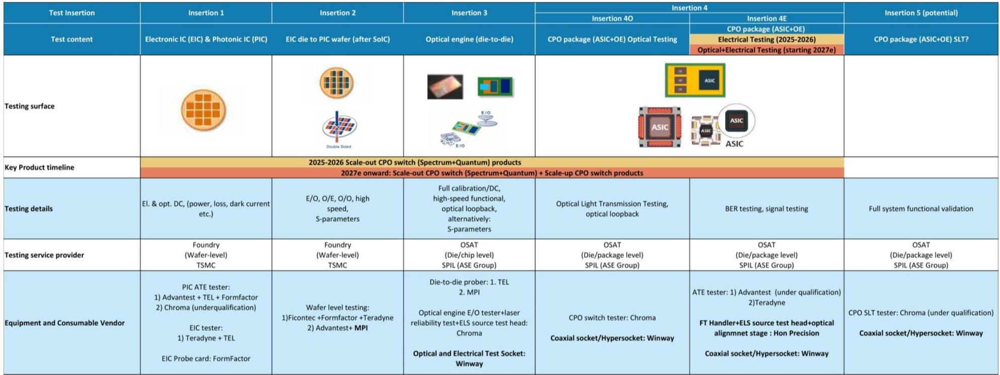
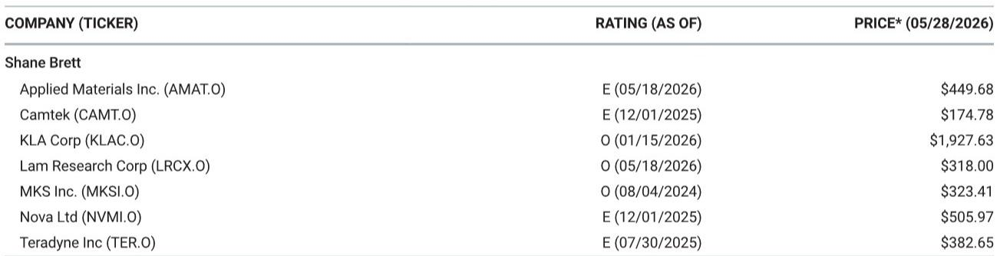

# The Foundry and Test Equipment Landscape Is Shifting Faster Than the Market Appreciates

The semiconductor capital equipment narrative has long been dominated by a single question: who will challenge TSMC? But the real story emerging from recent Taiwan-based analysis is more nuanced and strategically consequential. The foundry competitive dynamic is not a two-player game between TSMC and Intel, nor is it a settled matter that test equipment demand is simply a function of GPU volume growth. The evidence suggests that the breadth of foundry spending is broadening in ways that will reshape equipment demand profiles over the next three to five years, and that test equipment—particularly for networking and co-packaged optics—represents a more complex, less predictable opportunity than many investors currently assume.

The central argument here is that the semiconductor capital equipment thesis must be rebuilt around three underappreciated forces: the genuine resurgence of non-TSMC foundry alternatives, the structural bottleneck in test capacity that is decoupling from simple GPU unit growth, and the emergence of co-packaged optics as a test equipment wild card that could redefine competitive positions. Each of these forces carries second-order implications for equipment vendors, supply chain participants, and investors that extend well beyond the current consensus view.

This is not a story about a single company or a single product cycle. It is a story about how the semiconductor manufacturing ecosystem is fragmenting and re-converging simultaneously, creating pockets of demand that are both more diverse and more difficult to forecast than the industry has seen in a decade. The implications for capital equipment investors are profound, but they require a willingness to look beyond the headline numbers and engage with the operational realities of foundry customer acquisition, test time scaling, and optical-electrical integration.

---

## Intel’s Foundry Ambitions Remain a Work in Progress, but Its EMIB Business Is Already Reshaping the Advanced Packaging Equipment Landscape

The most common framing of Intel’s semiconductor strategy focuses on its foundry aspirations: can Intel become a credible third option alongside TSMC and Samsung? The evidence from recent field work suggests that this question, while important, may be the wrong one to ask. The more immediate and commercially significant development is the traction Intel is gaining with its Embedded Multi-die Interconnect Bridge technology, which is outpacing its foundry customer acquisition by a wide margin.

The contrast is striking. On the foundry side, Intel’s customer list remains thin. Apple appears to be the only high-profile committed customer, with A-series chips slated for high-volume manufacturing in 2029. There are potential orders from NVIDIA for gaming chips and from Tesla for AI6 chips before TeraFab comes online, but these remain speculative rather than contractual. The 18A yield is hovering around 50 percent, which is a meaningful improvement from earlier stages but still far from the levels required to attract high-volume, cost-sensitive customers. Customer interest is high, but customer acquisition remains a work in progress.

EMIB tells a completely different story. Demand from MediaTek, from Trainium, and from other customers seeking an alternative to TSMC’s advanced packaging offerings is extremely strong. This is not a niche opportunity. EMIB addresses a genuine pain point in the semiconductor ecosystem: the growing need for heterogeneous integration that does not rely exclusively on TSMC’s CoWoS or InFO technologies. For customers who want supply chain diversity in packaging—or who need a technology that can be scaled across multiple foundry sources—EMIB is becoming a compelling option.

The strategic implication is that Intel’s near-term equipment demand profile is being driven more by packaging than by traditional front-end foundry. This has consequences for the types of equipment that will see incremental demand. Advanced packaging tools, test handlers, and interconnect verification systems are likely to benefit from EMIB’s growth before Intel’s foundry business generates meaningful front-end equipment orders. Investors who are waiting for a foundry-driven Intel capex cycle may be waiting longer than they expect, while missing the packaging-driven demand that is already materializing.

---

## Samsung’s Foundry Business Is Alive, but Its U.S. Customer Shift Creates a Capacity Mismatch That Will Define Its Equipment Demand Trajectory

Samsung’s foundry business has been written off by many market participants as a distant third player, perpetually struggling to match TSMC’s process technology cadence and yield consistency. The recent evidence suggests this dismissal is premature. Samsung is seeing strong customer inquiries, and Google is likely to use Samsung for CPUs in 2028 high-volume manufacturing. This is not a trivial win; it represents a strategic endorsement from one of the most sophisticated chip designers in the world.

However, the challenge for Samsung is structural rather than technological. Almost all U.S. customers want to shift their manufacturing toward Samsung’s Taylor, Texas facility, where capacity is still in development. This creates a temporal mismatch between customer demand and available capacity that will define Samsung’s capital equipment spending for the next several years. The company will need to accelerate its Taylor ramp to capture the customer interest it is generating, but doing so requires front-loading equipment orders in a way that carries execution risk.

The equipment demand implications are twofold. First, Samsung’s near-term spending will be disproportionately weighted toward building out Taylor’s capacity, which means equipment orders for that facility will be lumpy and potentially concentrated in specific tool categories. Second, the customer shift toward Taylor creates a geographic rebalancing of equipment demand that has implications for regional supply chains, logistics, and aftermarket service networks. Equipment vendors with strong U.S. service infrastructure may have an advantage over those whose support networks are concentrated in Asia.

The broader point is that Samsung’s foundry business is not dead, but its revival is contingent on execution at Taylor. The equipment demand signal from Samsung is real, but it is not linear. Investors need to track Taylor’s capacity milestones as closely as they track Samsung’s process technology roadmaps.

---

## Test Equipment Demand Is Structurally Underappreciated Because It Is No Longer a Simple Function of GPU Volume

The conventional wisdom about test equipment demand is that it scales with GPU unit volumes: more chips means more testing, which means more testers. This framework is becoming dangerously incomplete. The evidence from recent field work suggests that test equipment demand is being driven by at least three independent vectors that are only loosely correlated with GPU volumes.

First, test time per GPU is increasing significantly. The final test time for a Blackwell GPU is approximately 850 seconds. For Rubin, that figure rises to approximately 1,200 seconds. This is not a marginal increase; it is a 40 percent expansion in test time per unit, which translates into a proportional increase in tester demand even if unit volumes remain flat. The physics of advanced node testing—more transistors, more interconnects, more thermal and power constraints—means that test time will continue to grow as a function of process complexity.

Second, Teradyne is testing a majority of NVIDIA applications outside of GPU final test, including Mellanox networking chips, RTX graphics, Vera CPUs, and LPU inference accelerators. This diversification means that Teradyne’s exposure to NVIDIA is far broader than the GPU final test narrative suggests. Even if Teradyne does not gain incremental share in NVIDIA AI GPU final test, the company is likely to remain extremely busy servicing Mellanox-related testing demand alone. The networking test opportunity is structurally underappreciated because it is not captured in the GPU-centric models that dominate investor thinking.

Third, the test equipment market is experiencing a supply-demand imbalance that is not easily resolved. Demand continues to outpace supply across multiple test insertion points, and the bottleneck is not simply a function of capacity but of technical capability. Testing advanced packaging, co-packaged optics, and high-speed interconnects requires equipment that is more specialized and harder to scale than traditional memory or logic testers.

The so-what for investors is that test equipment companies may be less exposed to GPU volume risk than the market assumes, and more exposed to the secular trends of test time expansion, application diversification, and technical specialization. The bear case for test equipment hinges on a GPU volume slowdown; the bull case hinges on the recognition that test demand is becoming structurally decoupled from GPU volumes.

---

## Co-Packaged Optics Testing Remains the Most Fluid and Potentially Consequential Variable in the Test Equipment Thesis

If there is one area where the current analysis raises more questions than it answers, it is co-packaged optics testing. The situation remains more fluid than definitive, and the competitive outcomes are far from settled. This is not a criticism of the available research; it is a reflection of the genuine uncertainty that surrounds a technology that is still in its early commercialization phase.

The test insertion framework for CPO is complex. There are at least five potential insertion points, each with different test content, test surface requirements, and equipment vendor dynamics. Insertions 1 and 2 fall under TSMC’s jurisdiction, with Insertion 1 (electronic IC and photonic IC testing) led by Advantest and Insertion 2 (die-to-wafer testing after SoIC) skewing toward Teradyne. However, given the difficulty of Insertion 2, the outcomes appear more open than settled. Insertion 4 for NVIDIA applications appears to sit with Teradyne, while Advantest is approaching AMD and Amazon. The test times for CPO remain uncertain, making clear 2027 demand signals more speculative than definitive.

This fluidity creates both risk and opportunity. The risk is that the market is pricing CPO test equipment demand based on assumptions that may not hold as the technology matures. The opportunity is that the eventual winners in CPO testing could see a step-change in addressable market that is not yet reflected in current valuations. The key open questions are: which insertion points will become the highest-volume test steps? Will the equipment vendors who dominate Insertions 1 and 2 also capture Insertions 3 through 5? And how will the test time uncertainty resolve as CPO moves from qualification to high-volume production?

These questions cannot be answered definitively with current data, but they are the questions that will determine whether CPO testing is a niche opportunity or a transformative one. Investors who are serious about understanding the test equipment landscape need to engage with these uncertainties rather than dismissing them as noise.

---

## A Decision Framework for Navigating the Foundry and Test Equipment Opportunity

The analysis above suggests that the semiconductor capital equipment thesis requires a more granular decision framework than the industry-standard approach of tracking TSMC capex and GPU unit volumes. The following framework is designed to help investors and strategists identify the most consequential variables and the inflection points that will determine outcomes.

The first dimension is foundry diversification. The key question is not whether TSMC will lose share, but whether Intel and Samsung will gain enough traction to create incremental equipment demand that is not dependent on TSMC’s capex cycle. The signals to watch are: Intel’s EMIB order book growth versus its foundry customer wins, Samsung’s Taylor capacity milestones, and the yield trajectories at 18A and 2nm-class nodes. If Intel’s packaging business continues to outpace its foundry business, the equipment demand profile will favor packaging and test over front-end lithography and etch. If Samsung’s Taylor ramp accelerates, the demand will be concentrated in front-end tools for that facility.

The second dimension is test time scaling. The key question is whether test time per GPU will continue to rise as a function of node complexity, or whether architectural innovations will compress test times. The signals to watch are: Rubin and Feynman test time specifications, the evolution of GPU final test versus chip probing test times, and the adoption of multi-site testing capabilities. If test times continue to rise at the rate implied by the Blackwell-to-Rubin transition, the test equipment market will need to grow faster than unit volumes, creating a structural tailwind for test equipment vendors.

The third dimension is CPO test insertion resolution. The key question is which insertion points become the high-volume standard and which equipment vendors capture those positions. The signals to watch are: the finalization of test insertion responsibilities for Insertions 2 and 4, the qualification status of Advantest and Teradyne at each insertion point, and the test time specifications that emerge from CPO qualification runs. If Insertion 2 becomes the dominant test step and Teradyne captures that position, the CPO opportunity is significantly larger than current estimates. If Insertions 1 and 4 dominate and Advantest captures them, the competitive dynamics shift in the opposite direction.

The fourth dimension is geographic rebalancing. The key question is whether the shift of foundry capacity toward the United States creates a durable advantage for equipment vendors with strong domestic service networks. The signals to watch are: the pace of Taylor’s capacity build-out, Intel’s U.S. fab construction timelines, and the equipment vendor service infrastructure investments in the U.S. market. If U.S. capacity build-out accelerates, equipment vendors with local service teams will have a logistical and cost advantage over those who must fly technicians from Asia.

---

## The Questions That Remain Open and Why the Full Report Matters

The analysis above synthesizes the most important signals from recent field work, but it also reveals several questions that cannot be answered with available data. How will the CPO test time uncertainty resolve, and what will that mean for 2027 equipment demand? Will Intel’s EMIB momentum translate into a broader packaging equipment ecosystem, or will it remain a single-company phenomenon? Can Samsung execute its Taylor ramp fast enough to capture the customer interest it is generating, or will execution delays push demand to alternative sources? And perhaps most importantly, is the test equipment market entering a multi-year structural upcycle driven by test time expansion and application diversification, or is the current strength a cyclical peak that will revert as GPU volumes normalize?

These are not academic questions. They are the questions that will separate the investors who capture the next phase of semiconductor equipment growth from those who miss it. The full report contains the detailed charts, test insertion maps, and competitive analysis that provide the foundation for answering these questions. It also includes the specific data points on test times, equipment vendor shares, and customer commitments that are essential for building a defensible investment thesis.

Join the community to read the full report and review the original charts.

*This article is for learning and discussion only and does not constitute investment advice.*

Personal reading notes and learning share only. Not investment advice.

