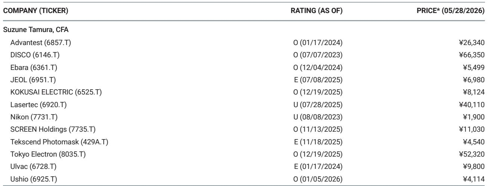
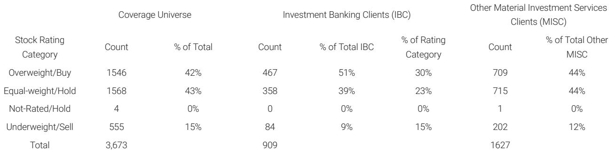

# 掩模版市场的信号：当成熟芯片需求放缓，真正的分化才刚刚开始

半导体设备行业的投资者习惯盯着先进制程的资本开支曲线，却往往忽略了产业链中一个关键环节发出的早期预警信号。某外资投行最新发布的日本半导体设备行业研报，以一家美国掩模版厂商的最新季度业绩为切入点，揭示了一个正在发生的结构性变化：低端芯片的tape-out需求正在延迟，而这一变化对产业链的影响，远比表面上的季度营收miss更为深远。

这份研报的核心判断是：掩模版市场正在经历一次需求结构的再平衡。开发用掩模版需求走弱，量产用掩模版需求维持韧性，但真正值得关注的不是短期波动，而是这一信号对Tekscend等日本掩模版厂商以及整个半导体设备产业链的长期含义。

## 1. 掩模版厂商的业绩miss背后，是低端芯片设计活动的实质性放缓

Photronics在2月到4月这一季度的营收为2.1亿美元，低于此前2.12亿至2.20亿美元的指引区间。更值得关注的是，下一季度的营收指引进一步走弱至2.07亿美元，环比继续下滑。这不是一次性的季节性波动，而是连续两个季度的走弱。

根据管理层的解释，核心原因有三：晶圆代工厂产能利用率提高后，剩余产能减少，导致代工厂优先安排现有产品的量产而非新芯片的设计导入；存储芯片价格上涨和供应紧张，推迟了新的消费电子产品发布；地缘政治风险则进一步抑制了亚洲地区开发用掩模版的需求。

这三个因素共同指向一个结论：低端消费类芯片的设计活动正在放缓。影响最明显的地区是中国和台湾，这正是全球低端芯片设计最活跃的区域。对于掩模版行业而言，开发用掩模版需求与量产用掩模版需求之间存在一种此消彼长的关系——当产能紧张时，代工厂自然优先保证量产，新项目的tape-out就会被推迟。

这一信号的含义是：低端芯片的库存调整可能已经从晶圆制造端传导至设计端，而掩模版作为芯片设计到制造之间的“第一道门槛”，其需求变化往往领先于设备订单一个到两个季度。

## 2. Tekscend尚未受到冲击，但风险敞口正在累积，关键在于客户结构的差异

研报明确指出，Photronics的业绩趋势对Tekscend具有参照意义。Tekscend是日本唯一的掩模版独立供应商，也是全球少数几家能够提供先进制程掩模版的企业之一。在Photronics业绩公布后，市场自然会追问：Tekscend是否会面临同样的需求压力？

从截至1月到3月的业绩来看，Tekscend尚未出现类似趋势。该公司当季业绩得到了先进节点需求增长以及中国特定客户需求的支撑。这并不意味着Tekscend可以免疫，而是说明其需求结构存在差异化优势。

核心差异在于两点：一是制程节点。Tekscend在先进制程掩模版领域具有更强的竞争力，而先进制程的设计活动受低端消费电子波动的影响较小。二是客户结构。Tekscend在中国的特定客户需求仍在增长，这些客户可能集中在非消费电子领域，或是正在加速国产化替代的企业。

但这里存在一个尚未完全验证的判断：Photronics的疲软是周期性的还是结构性的？如果是周期性的，Tekscend只是滞后一个季度左右；如果是结构性的，则意味着全球芯片设计活动正在经历一次区域和制程的再分配，Tekscend能否持续受益于中国客户的需求增长，取决于这些客户的真实需求和地缘政治政策的后续演变。

## 3. “产能利用率上升反而抑制设备需求”这一反直觉逻辑，正在重塑短周期的投资框架

掩模版市场的变化揭示了一个容易被忽视的产业链传导机制：晶圆代工厂产能利用率上升，短期反而可能抑制对某些设备的需求。

逻辑链条如下：代工厂产能利用率提高，意味着可用产能减少。在产能紧张的情况下，代工厂倾向于优先安排已有产品的量产，而不是导入新的设计。新设计导入减少，意味着开发用掩模版需求下降，同时也意味着对某些与新产品导入相关的设备需求可能暂时走弱。

这一机制对半导体设备投资框架的含义是：不能简单地将“产能利用率高”等同于“设备需求好”。在周期的某些阶段，产能利用率高反而意味着下游客户正在消化已有产能，新产能扩张的紧迫性下降。只有当产能利用率持续高企并接近瓶颈时，设备需求才会迎来新一轮上行。

对于日本半导体设备厂商而言，这一逻辑的启示是：短期来看，消费电子芯片的tape-out放缓可能拖累部分设备订单；但中期来看，一旦代工厂产能利用率持续高企，先进制程的扩产需求将重新成为设备订单的主要驱动力。关键在于判断当前处于周期的哪一阶段。

## 4. 报告尚未完全回答的关键问题：中国客户需求的可持续性

研报提到Tekscend受益于中国特定客户的需求增长，但并未深入拆解这部分需求的构成。这是整份报告中最值得追问的未解问题。

中国客户对掩模版的需求增长，可能来自三个不同的驱动力：一是国产替代进程中，国内芯片设计公司加速tape-out，需要掩模版供应商支持；二是部分国际芯片设计公司为了规避地缘政治风险，将设计活动转移至中国境内的代工厂；三是中国在成熟制程领域的产能扩张仍在持续，带动了相应的掩模版需求。

这三个驱动力对应的可持续性截然不同。如果是第一种，则需求相对稳定，且随着国产化率提升，对日本掩模版厂商的依赖度可能反而下降。如果是第二种，则需求受地缘政治政策变化的冲击最大。如果是第三种，则与全球半导体周期的关联度较高，周期性波动会更为明显。

报告没有进一步区分这三种情况，这也意味着投资者需要自行判断Tekscend中国业务的质量。如果中国客户需求主要是由“一次性国产替代”推动的，那么Tekscend的业绩韧性可能被高估；如果是由“持续的设计活动增长”推动的，则其业绩支撑更为坚实。

## 5. 对投资者的观察框架：从掩模版需求变化中捕捉半导体周期的拐点信号

基于这份研报的逻辑，可以构建一个三层次的观察框架，用于跟踪半导体设备周期的拐点。

第一层：跟踪掩模版厂商的tape-out数据。tape-out数量是芯片设计活动的直接指标，领先于设备订单。如果Photronics和Tekscend的开发用掩模版需求连续两个季度走弱，意味着设计活动正在收缩，未来设备订单可能承压。

第二层：区分需求变化的来源。需要判断tape-out放缓是来自消费电子、工业、汽车还是其他领域。不同领域的周期性特征不同，对设备需求的传导路径也不同。消费电子领域的放缓可能只是库存调整，而工业和汽车领域的放缓则可能意味更深层次的需求走弱。

第三层：关注产能利用率与设备订单的“滞后关系”。当产能利用率从高位开始回落时，设备订单通常还会维持一个到两个季度的惯性；当产能利用率从低位开始回升时，设备订单的复苏往往滞后一个到两个季度。理解这一滞后关系，有助于避免在周期拐点处做出相反方向的判断。

对于关注日本半导体设备板块的投资者而言，Tekscend的下一季报将是检验上述逻辑的关键节点。如果Tekscend的业绩也出现类似Photronics的趋势，则意味着低端芯片设计放缓的影响已经扩散至日本供应商；如果Tekscend能够维持增长，则其客户结构和制程优势将得到进一步验证。

掩模版市场的信号从来不是孤立的。它是半导体产业链中最接近设计端的一环，也是最早感知需求变化的传感器之一。当这个传感器开始发出信号时，聪明的投资者已经在思考：这究竟是一次短暂的风吹草动，还是风暴来临前的序曲？

这份研报的价值，不仅在于它揭示了Tekscend与Photronics之间的业绩分化，更在于它提供了一个观察半导体周期的独特视角。对于希望深入理解这一逻辑链的读者，完整报告中还包含了更多关于日本半导体设备厂商的估值比较、订单能见度分析以及各细分赛道的竞争格局拆解。

欢迎来星球微信群里继续讨论，我们将结合完整报告的数据和图表，进一步拆解掩模版市场变化对各设备子行业的差异化影响。

Personal reading notes and learning share only. Not investment advice.

