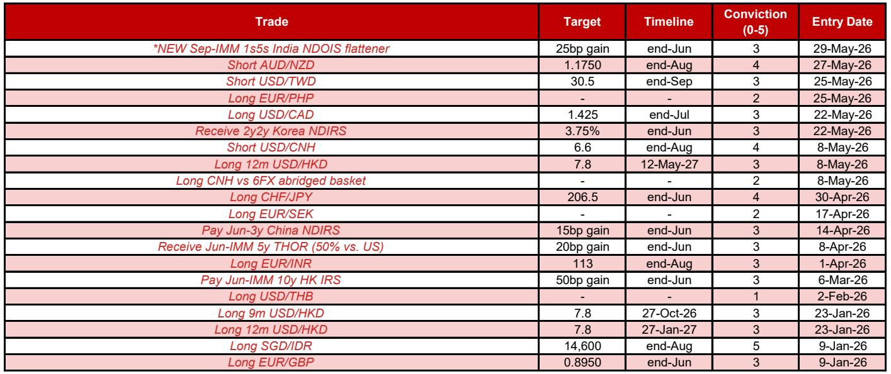
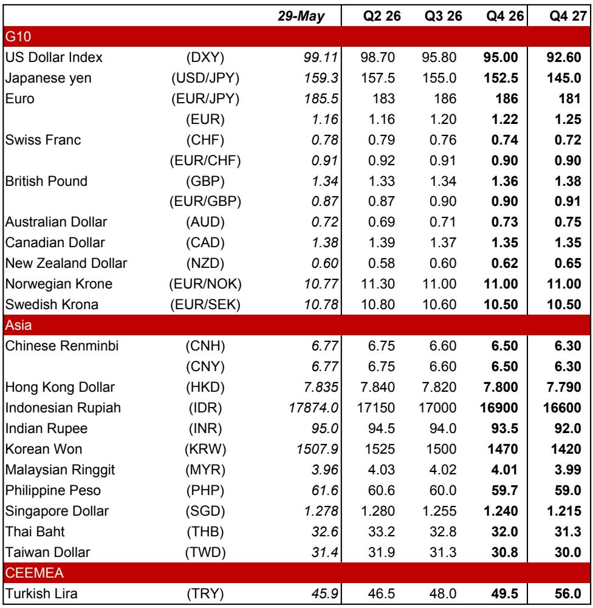
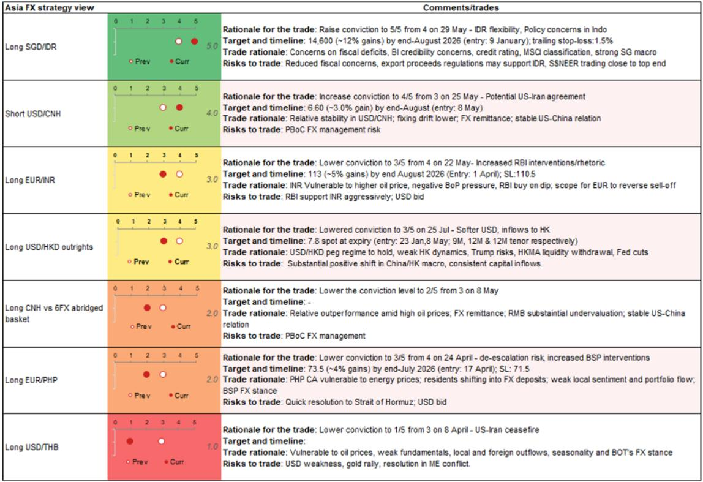

# The Market Is Betting on a Macro Pivot, But Local Fault Lines Will Determine Which Currencies Actually Deliver

The global macro outlook is undergoing a subtle but significant shift. A potential de-escalation of the US-Iran conflict, combined with a US labor market that may be softening more than consensus expects, is creating the conditions for a weaker US dollar and a broader rotation into risk assets. This is not a speculative call; it is a structural inference drawn from the configuration of current positioning, policy expectations, and geopolitical signals. Yet the most important insight from a detailed global investment bank report on foreign exchange and rates strategy is this: the trade is not uniform. The global macro tailwind will not lift all currencies equally. In fact, the most compelling opportunities lie not in betting on a single directional move in the dollar, but in identifying which regional economies have the domestic resilience to amplify the global tailwind, and which have local vulnerabilities that will override it.

The report's central argument is that the improving external backdrop—driven by a likely US-Iran ceasefire, falling oil prices, and a potentially soft US nonfarm payrolls print—should weaken the dollar and support emerging market currencies. But the strategy team's highest-conviction trade is not a simple long emerging market basket. It is a long Singapore dollar versus Indonesian rupiah position, raised to maximum conviction. This is a telling choice. It reveals that the real analytical work is not in forecasting the macro pivot, but in dissecting which economies can withstand or even benefit from that pivot, and which are structurally impaired regardless of the external environment. The report provides a granular, country-by-country framework for making that distinction. The following sections unpack the logic, expose the unresolved questions, and translate the analysis into a decision-making tool for serious allocators.

## The Global Macro Tailwind Is Real, But Its Magnitude Depends on a Narrow Set of Data Points

The case for a weaker dollar rests on three interrelated developments, each with a specific catalyst in the near term. First, the US-Iran conflict appears to be moving toward a negotiated settlement. Despite some mixed signals in recent weeks, the report notes that a tentative deal to extend the ceasefire by 60 days, reopen the Strait of Hormuz, and establish a framework for broader nuclear talks has been reported. If finalized, this would likely push Brent crude oil prices lower, reduce US Treasury yields, and remove a key source of geopolitical risk premium from the dollar. The second catalyst is the US May nonfarm payrolls report, due on 5 June. The consensus estimate of 93,000 new jobs is already relatively low by historical standards, but the report argues that a print significantly below that level—say, 100,000 below consensus—would trigger a disproportionately large dollar selloff. The reasoning is that softer labor market data, combined with progress on US-Iran, would strengthen the hand of dovish Federal Reserve members ahead of the June FOMC meeting.

The third factor is inflation. Euro area CPI for May, due on 2 June, is expected to rise and effectively lock in a 25 basis point rate hike from the European Central Bank on 11 June. Similarly, inflation data across Asia—particularly in Korea and Taiwan—are expected to support further rate hike expectations. This creates a diverging policy trajectory: the Fed may be nearing the end of its tightening cycle, while central banks in Europe and parts of Asia are still raising rates. That divergence is typically dollar-negative.

The report's analytical contribution is not merely to list these factors, but to rank their relative importance. The US-Iran dynamic is treated as the primary driver, with the labor market serving as the near-term trigger and inflation data as the structural amplifier. The implication is that the dollar's direction over the next several weeks hinges on a narrow set of binary outcomes: will the US-Iran deal hold, and will payrolls miss low? Investors who want to position for this scenario must accept that the window of opportunity is tight and the risks of reversal are real. The report itself acknowledges that the US-Iran situation remains fluid, with Iran's state media denying that a final agreement has been reached and Trump yet to sign off. This is not a risk-free trade; it is a calculated bet on a specific sequence of events.

## The Most Profitable Trades Are Not in the Dollar Itself, But in Pairs Where Local Fundamentals Create Asymmetric Outcomes

If the global macro thesis were the whole story, the obvious trade would be a short dollar position against a basket of liquid currencies. But the report's top-conviction trades tell a different story. The highest-conviction position is a long Singapore dollar versus Indonesian rupiah, with a conviction level of 5 out of 5. This is not a trade on the dollar; it is a trade on the relative strength of two Asian economies facing the same external environment but with vastly different domestic dynamics.

The case for the Indonesian rupiah underperformance is unusually comprehensive and, for that reason, compelling. The report identifies seven distinct local headwinds, each of which would be sufficient on its own to weigh on the currency. Together, they create a structural vulnerability that no improvement in the global backdrop can fully offset. First, there are signs that Bank Indonesia is tolerating greater exchange rate flexibility, allowing the rupiah to depreciate even as oil prices fall. This may help preserve foreign exchange reserves, but it also removes a key support for the currency. Second, President Prabowo's plan to centralize exports of natural resources through a state holding company has drawn sharp criticism from the private sector and economists, raising the risk of foreign divestment. Third, tighter rules requiring exporters to place a large share of proceeds in state-owned banks, effective from 1 June, create uncertainty about trade flows and foreign direct investment. Fourth, there is a real risk of a sovereign rating downgrade from S&P, which has already flagged concerns about resource centralization. Fifth, Indonesia's fiscal deficit for April was the widest in 12 years, and parliament is discussing changes to the State Finance Law that could further undermine fiscal credibility. Sixth, foreign portfolio outflows are being driven by the deletion of Indonesian stocks from MSCI and FTSE Russell indices, with potential additional outflows from a reassessment of foreign inclusion factors. Seventh, seasonal dividend payments to foreign investors in June will add to current account pressure.

Against this backdrop, the Singapore dollar offers a near-perfect counterpoint. Singapore's economy is resilient, with Q1 GDP growth revised up sharply to 6.0% year-on-year and industrial production surprising to the upside. Inflationary pressures are rising, and the Monetary Authority of Singapore is expected to tighten its exchange rate policy again in July. The report's logic is clear: Singapore has the domestic strength to amplify the global tailwind, while Indonesia has the domestic fragility to resist it. The trade is not about which central bank will act more aggressively; it is about which economy will attract capital and which will repel it.

## The China Renminbi Trade Is a Bet on Asymmetric Sensitivity and Structural Undervaluation, Not Just on a Weaker Dollar

The report maintains a short USD/CNH position with a conviction level of 4 out of 5, targeting 6.60 by end-August. This is a more nuanced trade than it appears. The report's analysis shows that USD/CNH is asymmetrically sensitive to dollar moves: when the dollar weakens, the renminbi strengthens significantly more than it weakens when the dollar strengthens. Since the start of the Iran war, the dollar has risen 1.5% on a trade-weighted basis, yet USD/CNH has actually fallen 1.4%. The sensitivity of USD/CNH to upward dollar moves is only about 24%, while its sensitivity to downward dollar moves is about 54%. This asymmetry means that even a modest dollar decline could produce a substantial renminbi appreciation.

The report also highlights structural factors that support the renminbi. The daily USD/CNY fixing continues to drift lower, reaching levels not seen since early 2023. Onshore corporates are likely to continue repatriating dollar holdings due to strong export growth and expectations of renminbi appreciation. The constructive backdrop for US-China relations and China's AI boom, exemplified by Huawei's announcement of advanced chip production plans, may attract capital inflows. Finally, the report's own FX valuation models show the renminbi is undervalued by an average of 9.7%, with its productivity-adjusted real effective exchange rate undervalued by nearly 20%.

The strategic implication is that the renminbi trade is not merely a dollar-negative bet; it is a bet on a structural repricing of China's currency that has been delayed by geopolitical tensions but may now be unleashed by a combination of policy signals, capital flows, and valuation mean-reversion. The report's conviction level of 4 out of 5 suggests a high degree of confidence, but the trade is not without risks. A breakdown in US-Iran talks or a surprisingly strong US payrolls report could delay the move. The key question for investors is whether they have the patience to wait for the asymmetry to play out.

## The Report Leaves One Critical Question Unanswered: What Happens If the US-Iran Deal Fails?

For all its analytical rigor, the report does not fully explore the scenario in which the US-Iran de-escalation stalls or reverses. The report acknowledges that there are still risks: Trump has not signed off on the tentative deal, Iran's state media has denied that a final agreement has been reached, and there have been defensive strikes by the US against Iranian military targets. But the report's trade recommendations are predicated on the assumption that the bias is toward further de-escalation. What if that assumption is wrong?

In a scenario where US-Iran tensions escalate again, the entire trade framework would need to be reassessed. The dollar would likely strengthen, oil prices would rise, and risk assets would sell off. The short USD/CNH trade would be particularly vulnerable, given the renminbi's asymmetric sensitivity to dollar moves. The long SGD/IDR trade might hold up better, given Indonesia's structural vulnerabilities, but even that trade would face headwinds if global risk appetite collapses. The report does not provide a clear contingency plan for this scenario, nor does it specify the conditions under which the conviction levels would be reduced.

This is not a criticism of the report; it is a recognition that all strategic analysis involves making assumptions about the most likely path. But for investors who want to use this framework, the unresolved question is critical. The report's highest-conviction trades are all conditional on a benign global macro outcome. Investors need to decide for themselves what probability they assign to that outcome, and how they will adjust if the probability changes.

## A Decision Framework for Investors: How to Use This Analysis Without Overfitting to the Base Case

The report's value lies not in its specific trade recommendations, but in the analytical framework it provides for assessing currency opportunities in a shifting macro environment. Investors can apply this framework to their own portfolios by asking four questions.

First, what is your view on the US-Iran situation? If you believe a deal is likely, then the global macro tailwind is real and you should be positioned for a weaker dollar and stronger Asian currencies. If you are more skeptical, then you should reduce conviction on dollar-negative trades and focus on pairs where the local story is strong enough to withstand a reversal.

Second, which currencies have domestic resilience? The report's analysis of Singapore versus Indonesia is a masterclass in identifying which economies can amplify a global tailwind and which will resist it. Investors should apply the same logic to other pairs. Which countries have strong growth, credible central banks, and stable capital flows? Which have fiscal vulnerabilities, political uncertainty, or structural outflows? The answer will determine which trades have asymmetric upside.

Third, what is your time horizon? The report's trades are calibrated to specific catalysts in June and August. The long SGD/IDR trade targets end-August; the short USD/CNH trade also targets end-August. This is a short-term tactical horizon, not a long-term strategic allocation. Investors who cannot monitor positions closely or who have longer time horizons may need to adjust.

Fourth, how will you manage the tail risk? The report does not explicitly address position sizing or stop-loss levels, but the conviction scale provides a useful heuristic. A conviction level of 5 out of 5 means the team is fully positioned; a level of 3 out of 5 means they are only one-third of the way to their desired size. Investors should calibrate their own position sizes to their conviction and risk tolerance, and they should have a clear plan for what to do if the base case does not materialize.

The report's most important contribution is to demonstrate that the global macro pivot, while real, is not a sufficient condition for profitable trading. The real edge comes from understanding local dynamics and identifying which currencies will benefit and which will suffer. Investors who can make that distinction will find opportunities that are invisible to those who simply trade the dollar.

Join the community to read the full report and review the original charts.

*This article is for learning and discussion only and does not constitute investment advice.*

Personal reading notes and learning share only. Not investment advice.

