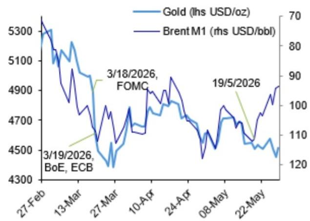
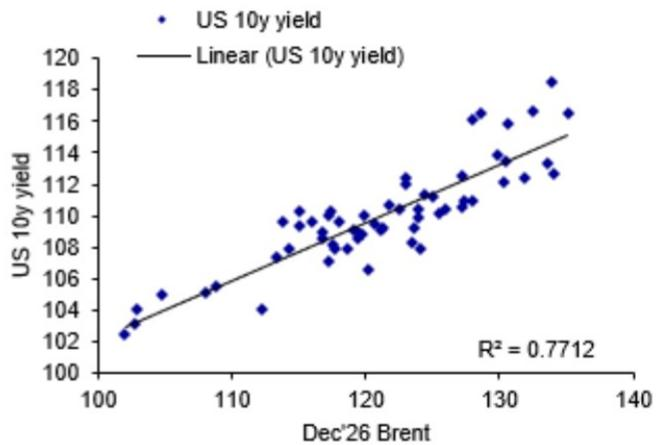
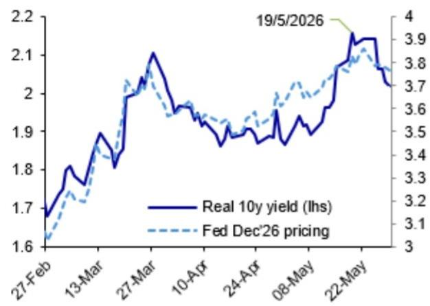
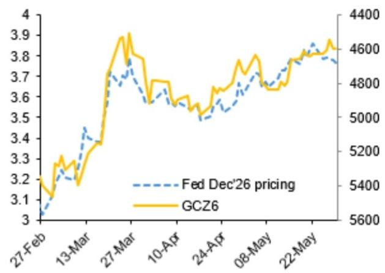
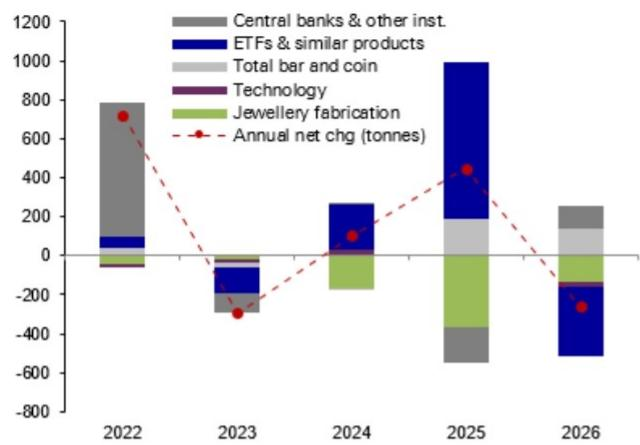
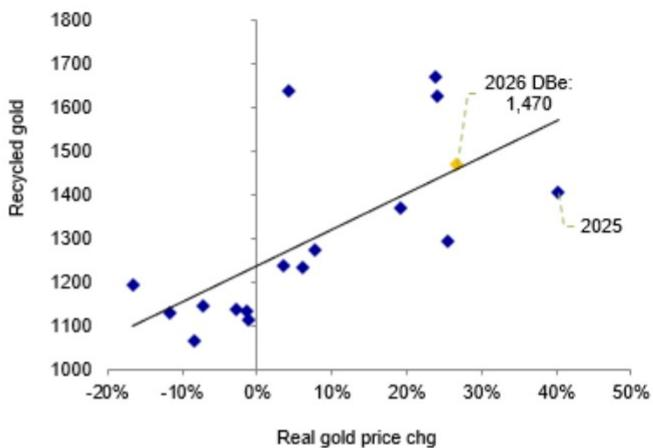

# Commodities Precious Blog

# Gold has a new problem

Gold prices have diverged from oil trends due to concerns of persistent inflation driven by a more varied set of causes, and rising real interest rates. The occurrence of bond market weakness has been a global phenomenon with key events in Japan and the UK. Watchpoints going forward will include global inflation data and upcoming Federal Reserve meetings.   
We think it would be a mistake to link gold too tightly with an extrapolation of further real rates repricing (48 bps so far this year). In 2022, we experienced a much sharper real-rate repricing of 270 bps which was effectively neutralized by a 716 tonne swing in official gold demand (H2'22 vs H2'21).   
All indications are that incoming Fed Chair Warsh may attempt to steer the center of FOMC opinion from the “somewhat hawkish” characterization seen in mid-May (Link). While the effectiveness of this remains to be seen, it could meaningfully change the pace of ETF gold investment without necessarily changing our team’s view of a Fed on an “indefinite hold near neutral.”   
Central bank and bar & coin demand were both stronger than expected in Q1, but ETF demand is down by $78\%$ versus last year's quarterly run-rate. We see upside risk to ETF demand in the balance of the year, and note that overall demand weakness in 2023 was still associated with an increase in gold prices. One bearish risk is the upside to recycled gold supply as capacity bottlenecks ease.

# Inflation and bond markets constrain gold

Gold has diverged from its negative oil correlation in the last 10 days as Brent front month dropped below USD 100/bbl (Figure 1). This has sustained a short term downtrend from the USD 4,700/oz level around mid May, and reflected in -1.6 mm troy oz selling visible in ETFs (-0.4 mm troy oz) and futures (-1.2 mm troy oz).

The most relevant macro frame for gold continues to be the risk of higher inflation, a hawkish monetary policy reaction, and the attendant rise in real interest rates. Put simply, gold's new problem lies in the combination of more persistent inflation and responsible monetary policy-making. That suggests that a breakdown in either one could tilt the macro picture for gold, suggesting gold sensitivity to policy communications and inflation data going forward.

Date 29 May 2026

Michael Hsueh
Research Analyst
+65-6423-7510

Figure 1: Gold diverging from oil   

line

| Date       | Gold (lhs USD/oz) | Brent M1 (rhs USD/bbl) |
| ---------- | ----------------- | ---------------------- |
| 3/19/2026  | -                 | -                      |
| 3/18/2026  | -                 | -                      |
| 19/5/2026  | -                 | -                      |

Source: Bloomberg Finance LP, DB

Figure 2: 10y US Treasury nominal yield more closely related to Dec'26 Brent than front month (where coefficient of determination is 0.51)   

scatter

| Dec'26 Brent | US 10y yield |
| ------------ | ------------ |
| 100          | 102          |
| 105          | 104          |
| 110          | 106          |
| 115          | 108          |
| 120          | 110          |
| 125          | 112          |
| 130          | 114          |
| 135          | 116          |
| 140          | 118          |

Source: Bloomberg Finance LP, DB

Two simple charts illustrate this. First, US 10y nominal and real rates have been more closely related to deferred crude futures (e.g., Dec'26) than front month (Figure 2), with the deferred crude futures $\mathsf{R}^2$ being $77\%$ and the front month $\mathsf{R}^2$ being $51\%$ . That suggests the market is more attuned to the possibility of a longer period of higher energy prices than the short term picture. Second, 10y real yields have been linked to hawkish Fed re-pricing (Figure 3), which provides the transmission channel into financial fair value for gold that takes the 10y real yield as an input (Link).

Figure 3: 10y real rates have followed Dec Fed pricing   

line

| Date       | Real 10y yield (lhs) | Fed Dec'26 pricing |
| ---------- | -------------------- | ------------------ |
| 19/5/2026  | 2.2                  | 3.9                |

Source: Bloomberg Finance LP, DB

Figure 4: Gold Dec'26 and Fed Dec'26   

line

| Date     | Fed Dec'26 pricing | GCZ6  |
| -------- | ------------------ | ----- |
| 27-Feb   | 3.0                | 3.2   |
| 13-Mar   | 3.4                | 3.4   |
| 27-Mar   | 3.8                | 4.4   |
| 10-Apr   | 3.6                | 4.8   |
| 24-Apr   | 3.5                | 4.8   |
| 08-May   | 3.7                | 4.8   |
| 22-May   | 3.8                | 4.6   |

Source: Bloomberg Finance LP, DB

# Bond market sell-off is a global phenomenon

The sell-off in bond markets since the upside break of $4.5\%$ on 10y UST was important enough to rank as a point of discussion at the meeting of G-7 finance ministers in Paris (18-19 May). According to Japan's finance minister Katayama, there has been a compounding effect amongst the three major markets of the US, UK and Japan $^{1}$ which facilitated weekly moves of 21 bps, 24 bps and 23 bps respectively in that week. This reflects the fact that these are global bond market moves, not exclusively borne of any one country's idiosyncrasies.

From the Japanese side, bond market concerns centered on the need for a supplementary budget, including government subsidies for energy, following "repeated denials that an extra budget was necessary". $^{2}$ Significant moderating influences came from a strong 20yr JGB auction (19-May), Prime Minister Takaichi's indication that with the extra budget, Japan does not "necessarily need to issue a large amount of government bonds," (20-May) $^{3}$ and the announcement from the CEO that Japan Post Bank would continue to rebuild its JGB holdings, depending on "the relative appeal of other assets." $^{4}$

From the UK side, recent difficulty for the Gilt market dates from the early May local elections seeing Labour party losses, the possibility of a leadership challenge for Prime Minister Starmer, and that a new leader may introduce fiscal easing and higher debt issuance. $^{5}$ This narrative was extended by data showing April's UK government deficit was larger than expected. $^{6}$

From the US side, our Rates strategists express concern that “a string of shocks have left real rates too low to return inflation to 2%” (Link), while staying short 10y UST and seeing upside to their yield forecast (Link). They remain short UST 10y with upside risk to their 4.65% target, and would not be surprised by a 10y term premium of 135 bps, implying risk of 10y UST at 5% (Link).

Our US Econ team observes that for the Fed, the “balance of risks appears to have shifted toward inflation persistence” (Link). Upside inflation drivers are wider than oil prices alone, including measures of trend inflation, an elevated output gap, AI demand in some goods categories, PPI pipeline inflation, and shorter-run inflation expectations (Link). Our team’s relative CPI forecasts indicate greater upside for the US short-end (Link), implying that the lack of market pricing for Fed hikes may be at risk of turning higher rather than lower.

# What to watch for: Potential Warsh positives

The near-term difficulty for gold may be that as the US-Iran war draws to a close and the Strait of Hormuz gradually sees an increasing rate of commercial traffic, sources of inflation that outlive the conflict may keep real rates elevated. However, we think it would be a mistake to link gold too tightly with an extrapolation of further real rates repricing (48 bps so far this year). In 2022, we experienced a much sharper real-rate repricing of 270 bps which was effectively neutralized by a 716 tonne swing in official gold demand (H2'22 vs H2'21).

If the above macro framing is correct, then important watchpoints going forward will include global inflation data with emphasis on the US, and the first Fed meeting chaired by Kevin Warsh (17-18 June). If Warsh is able to visibly steer the center of Committee opinion from the “somewhat hawkish” characterization in mid-May (Link), then this could prove gold-positive. This could move rates pricing without necessarily any change in our team’s view of a Fed on “indefinite hold near neutral” (Link). That could in turn meaningfully change the pace of ETF gold investment which has flagged from 2025 (see below).

Last November, Warsh indicated in his WSJ op-ed that the Fed should discard its forecast of stagflation, that AI will be a significant disinflationary force owing to its positive impact on productivity, and that a reduced Fed balance sheet can be accompanied by lower policy rates. $^{7}$ To some extent the Fed's forecast of stagflation has already changed, with the Fed's SEP on growth higher by 40-60 bps over the 2026-27 timeframe, although it is also higher on PCE by 10 bps (Mar'26 vs Sep'25 SEP).

Conditional on a US-Iran peace deal, our US Econ team believes Warsh will reinforce the inclination to “look-through” near-term core inflation pressures (Link). That would defy both market pricing (58% chance of Fed hike by Dec), evidence that AI is inflationary in some categories (Link), and evidence that layoffs are not associated with AI adoption rates and US firms are not using AI as a substitute for employment but rather to “supplement or enhance” employees (Link).

An inclination to look through near term inflation would contrast with the Fed officials dissenting from the easing bias in the April statement, St Louis Fed President Musalem who cautioned that Fed policy is below neutral, and that the US is unlikely to be in a high productivity growth period. $^{8}$ It would also contrast with ECB April minutes indicating that "it had become increasingly unlikely that a 'looking through' approach without any monetary policy action would be appropriate." $^{9}$

# Gold demand shaping up to be weaker year on year

From a gold supply-demand perspective, central bank demand surpassed our estimates in Q1 based on China other investment demand (Link). We also note that Q1 bar & coin demand is $+38\%$ above last year's run-rate. This supports an important piece of the narrative where we see inelastic demand stealing supply away from elastic sources of demand (Link). However, the contraction in ETF demand year on year is the most significant change in this dynamic. Despite offsetting strength in central bank and bar & coin demand in the first quarter, we would still likely need to see some resumption of ETF demand (62 tonnes in Q1) in order to realise our full year assumption around 450 tonnes (Figure 5). This does not necessarily equate to lower year-on-year gold prices, however, as the similarly weak year of 2023 still saw gold prices rise modestly.

Among supply developments, we think the pace of recycled gold is likely to be the most important swing factor, since it can respond more quickly than mined production. The factors weighing on recycled supply in recent years have been extrapolative price expectations, and a relative lack of household financial stress as compared to the peak 4 consecutive years of gold recycling following the global financial crisis in 2009-2012. Modestly higher recycling volume in Q1 could accelerate over the balance of the year as bottlenecks in refining and recycling capacity ease over time, according to the World Gold Council, while distress selling may be driven by weaker domestic currencies in some markets. That would suggest upside risk to our recycled gold supply assumption of 1,470 tonnes versus 366 tonnes estimated in the first quarter (Figure 6).

Figure 5: Gold demand weaker in key categories   

bar

| Year | Central banks & other inst. | ETFs & similar products | Total bar and coin | Technology | Jewellery fabrication | Annual net chg (tonnes) |
|------|-----------------------------|--------------------------|--------------------|------------|------------------------|-------------------------|
| 2022 | 800                         | 50                       | -100               | -50        | -50                    | 700                     |
| 2023 | -100                        | -100                     | -100               | -100       | -100                   | -300                    |
| 2024 | 0                           | 250                      | -150               | 0          | -150                   | 100                     |
| 2025 | -400                        | 750                      | 150                | 100        | 350                    | 450                     |
| 2026 | 250                         | -450                     | 150                | -150       | 250                    | -300                    |

Source: World Gold Council, DB

Figure 6: Recycled gold in Q1 of 366 tonnes supports full year assumption   

scatter

| Real gold price chg | Recycled gold |
| ------------------- | ------------- |
| -10%                | 1150          |
| -5%                 | 1180          |
| 0%                  | 1120          |
| 5%                  | 1250          |
| 10%                 | 1280          |
| 20%                 | 1380          |
| 25%                 | 1650          |
| 30%                 | 1480          |
| 40%                 | 1400          |
| 45%                 | 1470          |

Source: World Gold Council, DB

# Appendix 1

# Analyst Certification

The views expressed in this report accurately reflect the personal views of the undersigned lead analyst(s). In addition, the undersigned lead analyst(s) has not and will not receive any compensation for providing a specific recommendation or view in this report. Michael Hsueh.

# Important Disclosures

Prices are current as of the end of the previous trading session unless otherwise indicated and are sourced from local exchanges via Reuters, Bloomberg and other vendors. Other information is sourced from DB, subject companies, and other sources. For further information regarding disclosures relevant to DB, please visit our global disclosure look-up page on our website at

https://research.db.com/Research/Disclosures/FICCDisclosures. Aside from within this report, important risk and conflict disclosures can also be found at https://research.db.com/Research/Disclosures/Disclaimer. Investors are strongly encouraged to review this information before investing.

# Additional Information

The information and opinions in this report were prepared by DB AG or one of its affiliates (collectively 'DB'). Though the information herein is believed to be reliable and has been obtained from public sources believed to be reliable, DB makes no representation as to its accuracy or completeness. Hyperlinks to third-party websites in this report are provided for reader convenience only. DB neither endorses the content nor is responsible for the accuracy or security controls of those websites.

If you use the services of DB in connection with a purchase or sale of a security that is discussed in this report, or is included or discussed in another communication (oral or written) from a DB analyst, DB may act as principal for its own account or as agent for another person.

DB may consider this report in deciding to trade as principal. It may also engage in transactions, for its own account or with customers, in a manner inconsistent with the views taken in this research report. Others within DB, including strategists, sales staff and other analysts, may take views that are inconsistent with those taken in this research report. DB issues a variety of research products, including fundamental analysis, equity-linked analysis, quantitative analysis and trade ideas. Recommendations contained in one type of communication may differ from recommendations contained in others, whether as a result of differing time horizons, methodologies, perspectives or otherwise. DB and/or its affiliates may also be holding debt or equity securities of the issuers it writes on. Analysts are paid in part based on the profitability of DB AG and its affiliates, which includes investment banking, trading and principal trading revenues.

Opinions, estimates and projections constitute the current judgment of the author as of the date of this report. They do not necessarily reflect the opinions of DB and are subject to change without notice. DB provides liquidity for buyers and sellers of securities issued by the companies it covers. DB analysts sometimes have shorter-term trade ideas that may be inconsistent with DB's existing longer-term ratings. Some trade ideas for equities are listed as Catalyst Calls on the Research Website (https://research.db.com/Research/), and can be found on the general coverage list and also on the covered company's page. A Catalyst Call represents a high-conviction belief by an analyst that a stock will outperform or underperform the market and/or a specified sector over a time frame of no less than two weeks and no more than three months. In addition to Catalyst Calls, analysts may occasionally discuss with our clients, and with DB salespersons and traders, trading strategies or ideas that reference catalysts or events that may have a near-term or medium-term impact on the market price of the securities discussed in this report, which impact may be directionally counter to the analysts' current 12-month view of total return or investment return as described herein. DB has no obligation to update, modify or amend this report or to otherwise notify a recipient thereof if an opinion, forecast or estimate changes or becomes inaccurate. Coverage and the frequency of changes in market conditions and in both general and company-specific economic prospects make it difficult to update research at defined intervals. Updates are at the sole discretion of the coverage analyst or of the Research Department Management, and the majority of reports are published at irregular intervals. This report is provided for informational purposes only and does not take into account the particular investment objectives, financial situations, or needs of individual clients. It is not an offer or a solicitation of an offer to buy or sell any financial instruments or to participate in any particular trading strategy. Target prices are inherently imprecise and a product of the analyst's judgment. The financial instruments discussed in this report may not be suitable for all investors, and investors must make their own informed investment decisions. Prices and availability of financial instruments are subject to change without notice, and investment transactions can lead to losses as a result of price fluctuations and other factors. If a financial instrument is denominated in a currency other than an investor's currency, a change in exchange rates may adversely affect the investment. Past performance is not necessarily indicative of future results. Performance calculations exclude transaction costs, unless otherwise indicated. Unless otherwise indicated, prices are current as of the end of the previous trading session and are sourced from local exchanges via Reuters, Bloomberg and other vendors. Data is also sourced from DB, subject companies, and other parties. Artificial intelligence tools may be used in the preparation of this material, including but not limited to assist in fact-finding, data analysis, pattern recognition, content drafting and editorial corrections pertaining to research material.

The DB Department is independent of other business divisions of the Bank. Details regarding our organizational arrangements and information barriers we have to prevent and avoid conflicts of interest with respect to our research are available on our website (https://research.db.com/Research/) under Disclaimer.

Macroeconomic fluctuations often account for most of the risks associated with exposures to instruments that promise to pay fixed or variable interest rates. For an investor who is long fixed-rate instruments (thus receiving these cash flows), increases in interest rates naturally lift the discount factors applied to the expected cash flows and thus cause a loss. The longer the maturity of a certain cash flow and the higher the move in the discount factor, the higher will be the loss. Upside surprises in inflation, fiscal funding needs, and FX depreciation rates are among the most common adverse macroeconomic shocks to receivers. But counterparty exposure, issuer creditworthiness, client segmentation, regulation (including changes in assets holding limits for different types of investors), changes in tax policies, currency convertibility (which may constrain currency conversion, repatriation of profits and/or liquidation of positions), and settlement issues related to local clearing houses are also important risk factors. The sensitivity of fixed-income instruments to macroeconomic shocks may be mitigated by indexing the contracted cash flows to inflation, to FX depreciation, or to specified interest rates - these are common in emerging markets. The index fixings may - by construction - lag or mis-measure the actual move in the underlying variables they are intended to track. The choice of the proper fixing (or metric) is particularly important in swaps markets, where floating coupon rates (i.e., coupons indexed to a typically short-dated interest rate reference index) are exchanged for fixed coupons. Funding in a currency that differs from the currency in which coupons are denominated carries FX risk. Options on swaps (swaptions) the risks typical to options in addition to the risks related to rates movements.

Derivative transactions involve numerous risks including market, counterparty default and illiquidity risk. The appropriateness of these products for use by investors depends on the investors' own circumstances, including their tax position, their regulatory environment and the nature of their other assets and liabilities; as such, investors should take expert legal and financial advice before entering into any transaction similar to or inspired by the contents of this publication. The risk of loss in futures trading and options, foreign or domestic, can be substantial. As a result of the high degree of leverage obtainable in futures and options trading, losses may be incurred that are greater than the amount of funds initially deposited - up to theoretically unlimited losses. Trading in options involves risk and is not suitable for all investors. Prior to buying or selling an option, investors must review the 'Characteristics and Risks of Standardized Options", at https://www.theocc.com/company-information/documents-and-archives/options-disclosure-document. If you are unable to access the website, please contact your DB representative for a copy of this important document.

Participants in foreign exchange transactions may incur risks arising from several factors, including the following: (i) exchange rates can be volatile and are subject to large fluctuations; (ii) the value of currencies may be affected by numerous market factors, including world and national economic, political and regulatory events, events in equity and debt markets and changes in interest rates; and (iii) currencies may be subject to devaluation or government-imposed exchange controls, which could affect the value of the currency. Investors in securities such as ADRs, whose values are affected by the currency of an underlying security, effectively assume currency risk.

Unless governing law provides otherwise, all transactions should be executed through the DB entity in the investor's home jurisdiction. Aside from within this report, important conflict disclosures can also be found at https://research.db.com/Research/ on each company's research page or under the 'Disclosures' tab. Investors are strongly encouraged to review this information before investing.

DB (which includes DB AG, its branches and affiliated companies) is not acting as a financial adviser, consultant or fiduciary to you or any of your agents (collectively, "You" or "Your") with respect to any information provided in this report. DB does not provide investment, legal, tax or accounting advice, DB is not acting as your impartial adviser, and does not express any opinion or recommendation whatsoever as to any strategies, products or any other information presented in the materials. Information contained herein is being provided solely on the basis that the recipient will make an independent assessment of the merits of any investment decision, and it does not constitute a recommendation of, or express an opinion on, any product or service or any trading strategy.

The information presented is general in nature and is not directed to retirement accounts or any specific person or account type, and is therefore provided to You on the express basis that it is not advice, and You may not rely upon it in making Your decision. The information we provide is being directed only to persons we believe to be financially sophisticated, who are capable of evaluating investment risks independently, both in general and with regard to particular transactions and investment strategies, and who understand that DB has financial interests in the offering of its products and services. If this is not the case, or if You are an IRA or other retail investor receiving this directly from us, we ask that you inform us immediately.

In July 2018, DB revised its rating system for short term ideas whereby the branding has been changed to Catalyst Calls ("CC") from SOLAR ideas; the rating categories for Catalyst Calls originated in the Americas region have been made consistent with the categories used by Analysts globally; and the effective time period for CCs has been reduced from a maximum of 180 days to 90 days.

United States: Approved and/or distributed by DB Securities Incorporated, a member of FINRA and SIPC. Analysts located outside of the United States are employed by non-US affiliates and are not registered/qualified as research analysts with FINRA.

European Economic Area (exc. United Kingdom): Approved and/or distributed by DB AG, a joint stock corporation with limited liability incorporated in the Federal Republic of Germany with its principal office in Frankfurt am Main. DB AG is authorized under German Banking Law and is subject to supervision by the European Central Bank and by BaFin, Germany's Federal Financial Supervisory Authority.

United Kingdom: Approved and/or distributed by DB AG acting through its London Branch at 21 Moorfields, London EC2Y 9DB. DB AG in the United Kingdom is authorised by the Prudential Regulation Authority and is subject to limited regulation by the Prudential Regulation Authority and Financial Conduct Authority. Details about the extent of our authorisation and regulation are available on request.

Hong Kong SAR: Distributed by DB AG, Hong Kong Branch, except for any research content relating to futures contracts within the meaning of the Hong Kong Securities and Futures Ordinance Cap. 571. Research reports on such futures contracts are not intended for access by persons who are located, incorporated, constituted or resident in Hong Kong. The author(s) of a research report may not be licensed to carry on regulated activities in Hong Kong, and if not licensed, do not hold themselves out as being able to do so. The provisions set out above in the 'Additional Information' section shall apply to the fullest extent permissible by local laws and regulations, including without limitation the Code of Conduct for Persons Licensed or Registered with the Securities and Futures Commission. This report is intended for distribution only to 'professional investors' as defined in Part 1 of Schedule of the SFO. This document must not be acted or relied on by persons who are not professional investors. Any investment or investment activity to which this document relates is only available to professional investors and will be engaged only with professional investors.

India: Prepared by Deutsche Equities India Private Limited (DEIPL) having CIN: U65990MH2002PTC137431 and registered office at 14th Floor, The Capital, C-70, G Block, Bandra Kurla Complex, Mumbai (India) 400051. Tel: +91 22 7180 4444. It is registered by the Securities and Exchange Board of India (SEBI) as a Stock broker bearing registration no.: INZ000252437; Merchant Banker bearing SEBI Registration no.: INM000010833 and Research Analyst bearing SEBI Registration no.: INH000001741. DEIPL's Compliance / Grievance officer is Ms. Rashmi Poddar (Tel: +91 22 7180 4929 email ID: complaints.deipl@db.com). Registration granted by SEBI and certification from NISM in no way guarantee performance of DEIPL or provide any assurance of returns to investors. Investment in securities market are subject to market risks. Read all the related documents carefully before investing. DEIPL may have received administrative warnings from the SEBI for breaches of Indian regulations. DB and/or its affiliate(s) may have debt holdings or positions in the subject company. With regard to information on associates, please refer to the "Shareholdings" section in the Annual Report at: https://www.db.com/ir/en/annual-reports.htm. For latest India research audit report, refer https://country.db.com/india/deutsche-equities-india/index?language\_id=1.

Japan: Approved and/or distributed by Deutsche Securities Inc.(DSI). Registration number - Registered as a financial instruments dealer by the Head of the Kanto Local Finance Bureau (Kinsho) No. 117. Member of associations: JSDA,

Type II Financial Instruments Firms Association and The Financial Futures Association of Japan. Commissions and risks involved in stock transactions - for stock transactions, we charge stock commissions and consumption tax by multiplying the transaction amount by the commission rate agreed with each customer. Stock transactions can lead to losses as a result of share price fluctuations and other factors. Transactions in foreign stocks can lead to additional losses stemming from foreign exchange fluctuations. We may also charge commissions and fees for certain categories of investment advice, products and services. Recommended investment strategies, products and services carry the risk of losses to principal and other losses as a result of changes in market and/or economic trends, and/or fluctuations in market value. Before deciding on the purchase of financial products and/or services, customers should carefully read the relevant disclosures, prospectuses and other documentation. 'Moody's', 'Standard Poor's', and 'Fitch' mentioned in this report are not registered credit rating agencies in Japan unless Japan or 'Nippon' is specifically designated in the name of the entity. Reports on Japanese listed companies not written by analysts of DSI are written by DB Group's analysts with the coverage companies specified by DSI. Some of the foreign securities stated on this report are not disclosed according to the Financial Instruments and Exchange Law of Japan. Target prices set by DB's equity analysts are based on a 12-month forecast period.

Korea: Distributed by Deutsche Securities Korea Co.

South Africa: DB AG Johannesburg is incorporated in the Federal Republic of Germany (Branch Register Number in South Africa: 1998/003298/10).

Singapore: This report is issued by DB AG, Singapore Branch (One Raffles Quay #18-00 South Tower Singapore 048583, 65 6423 8001), which may be contacted in respect of any matters arising from, or in connection with, this report. Where this report is issued or promulgated by DB in Singapore to a person who is not an accredited investor, expert investor or institutional investor (as defined in the applicable Singapore laws and regulations), they accept legal responsibility to such person for its contents.

Taiwan: Information on securities/investments that trade in Taiwan is for your reference only. Readers should independently evaluate investment risks and are solely responsible for their investment decisions. DB may not be distributed to the Taiwan public media or quoted or used by the Taiwan public media without written consent. Information on securities/instruments that do not trade in Taiwan is for informational purposes only and is not to be construed as a recommendation to trade in such securities/instruments.

Qatar: DB AG in the Qatar Financial Centre (registered no. 00032) is regulated by the Qatar Financial Centre Regulatory Authority. DB AG - QFC Branch may undertake only the financial services activities that fall within the scope of its existing QFCRA license. Its principal place of business in the QFC: Qatar Financial Centre, Tower, West Bay, Level 5, PO Box 14928, Doha, Qatar. This information has been distributed by DB AG. Related financial products or services are only available only to Business Customers, as defined by the Qatar Financial Centre Regulatory Authority.

Russia: The information, interpretation and opinions submitted herein are not in the context of, and do not constitute, any appraisal or evaluation activity requiring a license in the Russian Federation.

Kingdom of Saudi Arabia: Deutsche Securities Saudi Arabia (DSSA) is a closed joint stock company authorized by the Capital Market Authority of the Kingdom of Saudi Arabia with a license number (No. 37-07073) to conduct the following business activities: Dealing, Arranging, Advising, and Custody activities. DSSA registered office is Faisaliah Tower, 17th Floor, King Fahad Road - Al Olaya District Riyadh, Kingdom of Saudi Arabia P.O. Box 301806.

United Arab Emirates: DB AG in the Dubai International Financial Centre (registered no. 00045) is regulated by the Dubai Financial Services Authority. DB AG - DIFC Branch may only undertake the financial services activities that fall within the scope of its existing DFSA license. Principal place of business in the DIFC: Dubai International Financial Centre, The Gate Village, Building 5, PO Box 504902, Dubai, U.A.E. This information has been distributed by DB AG. Related financial products or services are available only to Professional Clients, as defined by the Dubai Financial Services Authority.

Australia and New Zealand: This research is intended only for 'wholesale clients' within the meaning of the Australian Corporations Act and New Zealand Financial Advisors Act, respectively. Please refer to Australia-specific research disclosures and related information at https://www.dbresearch.com/PROD/RPS\_EN-

PROD/PROD0000000000521304.xhtml . Where research refers to any particular financial product recipients of the research should consider any product disclosure statement, prospectus or other applicable disclosure document before making any decision about whether to acquire the product. In preparing this report, the primary analyst or an individual who assisted in the preparation of this report has likely been in contact with the company that is the subject of this research for confirmation/clarification of data, facts, statements, permission to use company-sourced material in the report, and/or site-visit attendance. Without prior approval from Research Management, analysts may not accept from current or potential Banking clients the costs of travel, accommodations, or other expenses incurred by analysts attending site visits, conferences, social events, and the like. Similarly, without prior approval from Research Management and Anti-Bribery and Corruption ("ABC") team, analysts may not accept perks or other items of value for their personal use from issuers they cover.

Additional information relative to securities, other financial products or issuers discussed in this report is available upon request. This report may not be reproduced, distributed or published without DB's prior written consent.

Backtested, hypothetical or simulated performance results have inherent limitations. Unlike an actual performance record based on trading actual client portfolios, simulated results are achieved by means of the retroactive application of a backtested model itself designed with the benefit of hindsight. Taking into account historical events the backtesting of performance also differs from actual account performance because an actual investment strategy may be adjusted any time, for any reason, including a response to material, economic or market factors. The backtested performance includes hypothetical results that do not reflect the reinvestment of dividends and other earnings or the deduction of advisory fees, brokerage or other commissions, and any other expenses that a client would have paid or actually paid. No representation is made that any trading strategy or account will or is likely to achieve profits or losses similar to those shown. Alternative modeling techniques or assumptions might produce significantly different results and prove to be more appropriate. Past hypothetical backtest results are neither an indicator nor guarantee of future returns. Actual results will vary, perhaps materially, from the analysis.

The method for computing individual E,S,G and composite ESG scores set forth herein is a novel method developed by the Research department within DB AG, computed using a systematic approach without human intervention. Different data providers, market sectors and geographies approach ESG analysis and incorporate the findings in a variety of ways. As such, the ESG scores referred to herein may differ from equivalent ratings developed and implemented by other ESG data providers in the market and may also differ from equivalent ratings developed and implemented by other divisions within the DB Group. Such ESG scores also differ from other ratings and rankings that have historically been applied in research reports published by DB AG. Further, such ESG scores do not represent a formal or official view of DB AG.

It should be noted that the decision to incorporate ESG factors into any investment strategy may inhibit the ability to participate in certain investment opportunities that otherwise would be consistent with your investment objective and other principal investment strategies. The returns on a portfolio consisting primarily of sustainable investments may be lower or higher than portfolios where ESG factors, exclusions, or other sustainability issues are not considered, and the investment opportunities available to such portfolios may differ. Companies may not necessarily meet high performance standards on all aspects of ESG or sustainable investing issues; there is also no guarantee that any company will meet expectations in connection with corporate responsibility, sustainability, and/or impact performance.

Copyright © 2026 DB AG

David Folkerts-Landau   
Group Chief Economist and Global Head of Research 

<table><tr><td>Pam Finelli
Global Chief Operating Officer Research</td><td>Steve Pollard
Global Head of Company Research and Sales</td><td>Jim Reid
Global Head of Macro and Thematic Research</td><td>Tim Rokossa
Head of Germany Research</td></tr><tr><td>Gerry Gallagher
Head of European Company Research</td><td>Matthew Barnard
Head of Americas Company Research</td><td>Peter Milliken
Head of APAC Company Research</td><td>Debbie Jones
Global Head of Sustainability and Data Innovation, Research</td></tr><tr><td>Sameer Goel
Global Head of EM &amp; APAC Research</td><td>Francis Yared
Global Head of Rates Research</td><td>George Saravelos
Global Head of FX Research</td><td>Peter Hooper
Vice-Chair of Research</td></tr></table>

International Production Locations 

<table><tr><td>DB AG</td><td>DB AG</td><td>DB AG</td><td>Deutsche Securities Inc.</td></tr><tr><td>DB Place</td><td>Equity Research</td><td>Filiale Hongkong</td><td>1-3-1 Azabudai</td></tr><tr><td>Level 16</td><td>Mainzer Landstrasse 11-17</td><td>International Commerce Centre</td><td>Azabudai Hills Mori JP Tower</td></tr><tr><td>Corner of Hunter &amp; Phillip Streets</td><td>60329 Frankfurt am Main Germany</td><td>1 Austin Road West, Kowloon,</td><td>Minato-ku, Tokyo 106-0041</td></tr><tr><td>Sydney, NSW 2000 Australia</td><td>Tel: (49) 69 910 00</td><td>Hong Kong</td><td>Japan</td></tr><tr><td>Tel: (61) 2 8258 1234</td><td></td><td>Tel: (852) 2203 8888</td><td>Tel: (81) 3 6730 1000</td></tr><tr><td>DB AG</td><td>DB Securities Inc.</td><td>DB AG</td><td></td></tr><tr><td>21 Moorfields London EC2Y 9DB United Kingdom Tel: (44) 20 7545 8000</td><td>The DB Center 1 Columbus Circle New York, NY 10019 Tel: (1) 212 250 2500</td><td>Filiale Singapur One Raffles Quay, South Tower Singapore 048583 Tel: (65) 6423 8001</td><td></td></tr></table>