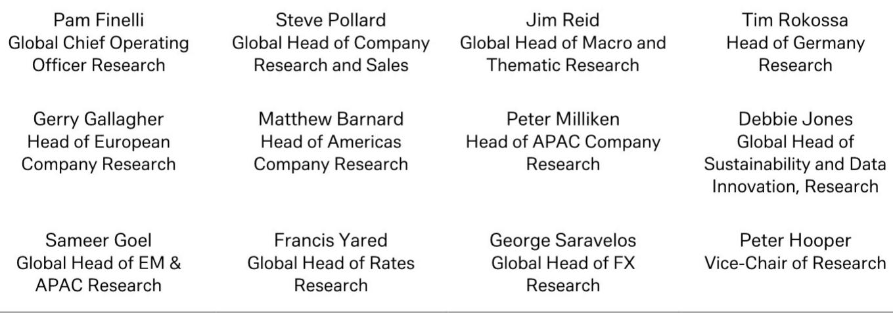

# 黄金的真正问题不在利率，而在官方需求的结构性对冲能力正在衰减

黄金近期从每盎司4700美元附近持续回落，与原油价格走势出现明显背离。市场习惯性地将矛头指向实际利率的重新定价——今年以来十年期美债实际收益率已上行48个基点。但这份来自某外资投行的研报揭示了一个更值得警惕的判断：真正约束黄金的，并非利率本身，而是过去两年支撑金价的核心力量——官方部门需求——正在从“对冲利率冲击的缓冲垫”转变为“自身也需要被重新定价的不确定项”。理解这一转变，比预测下一次美联储会议的结果更重要。

报告的核心洞察在于，2022年黄金曾经历270个基点的实际利率飙升，但金价并未崩盘，原因在于同期官方黄金需求出现了716吨的剧烈摆动，有效中和了利率的冲击。然而当前，这一对冲机制正在发生结构性变化：央行购金虽在2026年第一季度超预期，但ETF需求同比萎缩78%。这意味着，黄金价格对利率的敏感度正在回归，而利率本身正被一组更复杂、更持久的通胀因子所支撑。

以下五个层次，将逐一拆解这份报告所揭示的核心逻辑，以及那些尚未被市场充分定价的风险与机会。

## 1. 债券市场的全球性抛售正在重塑黄金的宏观定价框架

报告中一个容易被忽略的细节是，近期债券市场的抛售并非美国独有的现象。在日本、英国和美国三大市场，十年期国债收益率在单周内分别上行21、24和23个基点，这一联动性促使G-7财长会议将其列为正式议题。日本方面，市场对补充预算和能源补贴的担忧导致JGB承压；英国方面，地方选举后政治不确定性上升，市场开始定价潜在的财政宽松与更高债务发行；美国方面，某投行利率策略团队直言，实际利率仍然过低，不足以将通胀拉回2%的目标，甚至不排除十年期美债收益率升至5%的可能性。

这三股力量叠加的结果是，全球债券市场正在经历一场“无锚”的重定价。对于黄金而言，这意味着其传统的宏观对冲逻辑——即黄金与利率负相关——正在被重新激活，但这一次的利率上行并非源于经济增长强劲，而是源于通胀的“粘性”和“广泛性”。报告指出，通胀的上行驱动因素远不止油价，还包括趋势通胀指标、产出缺口、人工智能对部分商品的需求拉动、PPI管道通胀以及短期通胀预期的上升。这种“多源通胀”格局使得美联储的政策回旋余地大幅收窄，黄金因此失去了过去两年最重要的支撑——市场对“利率终将回落”的信仰。

## 2. 市场低估了官方黄金需求的结构性脆弱性

报告中最具张力的部分，是对黄金需求侧“非对称”格局的分析。一方面，2026年第一季度央行购金和金币金条需求均超预期，前者受益于中国等其他投资需求的拉动，后者同比高出38%。这支撑了报告团队提出的“非弹性需求正在从弹性需求中夺取供应”的叙事。但另一方面，ETF需求同比暴跌78%，仅录得62吨，而全年假设需要约450吨的ETF需求才能支撑当前价格。

这里的关键问题在于：央行购金能否继续充当“利率对冲器”？2022年的经验表明，716吨的官方需求摆动足以消化270个基点的利率冲击。但当前，央行购金的节奏和规模是否可持续？报告并未给出明确答案，而是留下了关键的伏笔：第一季度央行购金超预期，但全年预测却显示2026年净需求可能下降300吨。这意味着，市场对官方需求的“信仰”可能正在面临考验。如果央行购金节奏放缓，而ETF需求又未能如期恢复，黄金将失去最重要的边际买家。

## 3. 美联储新主席的政策信号可能是改变黄金定价的关键变量

报告用相当篇幅讨论了即将于6月17-18日召开的美联储会议，这将是新任主席Kevin Warsh首次主持的议息会议。如果Warsh能够成功引导委员会意见从5月中旬的“略微鹰派”向更中性甚至偏鸽方向移动，那么这将对黄金构成显著利好。

报告回溯了Warsh去年11月在《华尔街日报》发表的专栏文章，其中他主张美联储应摒弃对滞胀的预测，认为人工智能将通过提升生产率成为重要的通缩力量，并且缩减资产负债表可以伴随更低的政策利率。这一立场与当前市场的定价形成鲜明对比——市场目前定价12月加息概率为58%，且美联储内部已有官员公开反对“看穿”短期通胀压力。

如果Warsh能够像报告推测的那样，在美伊和平协议达成的背景下强化“看穿”短期通胀的倾向，那么即使美联储的实际政策立场并未改变（仍处于“接近中性的无限期暂停”），市场对利率的定价也可能出现显著调整，从而改变ETF资金流入的节奏。但这一判断的成立需要一个关键前提：Warsh的说服力能否超越当前通胀数据的“粘性”？报告对此保持了审慎，指出这一假设仍需验证。

## 4. 回收金供应的上行风险是黄金多头最容易被忽视的“隐形杀手”

在供应侧，报告明确指出，回收金供应的节奏可能是最重要的波动因素，因为它比矿产金更能快速响应价格变化。过去几年，回收金供应受到“外推式价格预期”和家庭财务压力相对较低的抑制。但2026年第一季度回收金量已经温和上升，随着精炼和回收产能瓶颈逐步缓解，全年回收金供应存在上行风险。

报告给出的假设是全年1,470吨，而第一季度已实现366吨。如果回收金加速释放，尤其是在一些本币疲软的市场出现恐慌性抛售，那么黄金将面临来自供应侧的额外压力。这一因素在当前的市场讨论中几乎被完全忽略，但它恰恰是黄金在2023年价格虽未下跌但涨幅有限的重要原因之一。当需求侧的结构性支撑开始松动，供应侧的弹性就可能成为压垮金价的最后一根稻草。

## 5. 报告尚未完全回答的关键问题：ETF需求恢复的“催化剂”究竟是什么？

这是整份报告最引人深思的留白。报告团队认为ETF需求存在上行风险，并指出2023年需求同样疲弱，但金价仍然温和上涨。然而，2023年的上涨背景是市场对美联储转向的强烈预期，而当前的市场环境恰恰相反——通胀更持久、利率更高、美联储官员更鹰派。那么，驱动ETF需求恢复的催化剂究竟是什么？

报告给出了一个可能的路径：如果Warsh成功引导市场预期转向鸽派，那么ETF投资节奏可能“显著改变”。但这一路径高度依赖于一个尚未发生的事件，且其概率并不高。另一个潜在催化剂是全球通胀数据的意外下行，但这同样是一个不确定的假设。报告没有讨论的是，如果ETF需求无法恢复，而央行购金又出现边际放缓，黄金的定价逻辑是否会发生根本性转变？这个问题，或许正是读者在阅读完整报告后需要自行判断的核心。

---

以上五个层次的拆解，每一层都指向同一个结论：黄金当前面临的问题，不是简单的“利率上行导致估值承压”，而是过去两年支撑其价格的“官方需求缓冲垫”正在被侵蚀，而新的支撑力量——无论是ETF需求恢复还是美联储政策转向——都尚未得到确认。这组判断的成立，需要读者进一步审视报告中关于黄金供需平衡表的详细数据、不同场景下的价格敏感性分析，以及报告团队对2026年全年黄金均价的最新预测。

这些内容，在完整报告中以更详尽的图表和情景分析呈现。欢迎加入我们的知识星球微信群，与更多产业决策者和专业投资者一起，围绕这些尚未完全解答的关键问题展开深入讨论。

Personal reading notes and learning share only. Not investment advice.

