EUROPE WEEKLY KICKSTART

Deal Momentum Builds, Europe Stays Cautious

Global M&A momentum remains robust. Our Global Financials Team forecasts c.18% growth in global M&A volumes over the next 12 months. So far the recovery has been skewed towards mega-deals, as evidenced by a stronger rebound in aggregate deal value than in transaction count (Exhibit 1).

The H2 2026 pipeline is underpinned by structural supply from corporates. Portfolio simplification is accelerating, with divestitures supporting earnings visibility and capital reallocation towards strategic priorities, including AI. Survey data shows a record share of UK CFOs citing asset disposals as a top priority (Exhibit 3). In parallel, private equity faces increasing pressure to return capital, reinforcing reliance on M&A exits amid a still-fragile IPO backdrop (outside the US). With European IPO activity near historical lows, well-capitalised strategies are well positioned to capture assets at attractive valuations. Key risks include geopolitical uncertainty keeping rates elevated and concerns around private credit, which we view as overstated. European balance sheets remain resilient, with net debt to EBITDA below historical averages across corporates, financials and households.

European M&A remains subdued (Exhibit 2). The recovery is lagging global trends, with Europe's share of global M&A declining to less than one-third of total activity, whether as acquirer, target or both.

Activity is increasingly driven by cross-border flows. In Europe, when deals occur, they are predominantly led by foreign buyers (Exhibit 4), reflecting valuation support and differentiated exposure. International acquirers are targeting European assets to capture discounts and access specific factor profiles, including Value and HALO segments, relative to the US.

Domestic buyers remain sidelined, reflecting weak local risk appetite. European corporates show limited acquisition appetite, consistent with equity flows where international inflows only offset persistent domestic outflows. This divergence extends to primary markets, with IPO activity still depressed in Europe. Survey data indicates that the share of CFOs prioritising expansion via acquisitions is near cycle lows, as focus shifts to cost discipline. Beneath the surface, take-private activity has moderated and sponsor activity, while recovering, is largely driven by exits rather than new deployment, as reflected in the Equity Research Sponsor Activity Barometer.

Guillaume Jaisson

+44(20)7552-3000

guillaume.jaisson@gs.com

GS International

Peter Oppenheimer

+44(20)7552-5782

peter.oppenheimer@gs.com

GS International

Sharon Bell

+44(20)7552-1341

sharon.bell@gs.com

GS International

Giovanni Ferrannini

+44(20)7051-2589

giovanni.ferrannini@gs.com

GS International

Discounted SMIDs and identified targets offer an exposure to an M&A upcycle (Exhibit 5). Our Tactical Research Team has rebalanced the European M&A target basket (GSTRACQN), comprising stocks with at least a 15% probability of acquisition. The basket targets both cyclical deal acceleration and structural consolidation, and trades at a material discount to the broader market (Exhibit 6).

Valuation dispersion reinforces the case for mid-market deal activity. SMIDs screen as potentially the most compelling targets given strategic fit and valuation dislocation, with STOXX Small caps trading on 13.5x P/E and at one of the deepest discounts to large caps on record (Exhibit 7). A broadening of M&A beyond mega-deals would act as a key catalyst, supported by improving bid intensity and rising strategic interest.

Broader beneficiaries are not pricing a sustained M&A upcycle, highlighting persistent scepticism in Europe. Investment Banking (GSSBBKIB), Holdings (GSSBHOLD) and Alternative Asset Managers (GSSBALTM) have underperformed year-to-date, down 4%, 5% and 15% respectively, signalling muted expectations for fee growth and capital deployment. This aligns with market leadership concentrated in select themes, with GSSBALTM among the weakest performers in 2026 alongside rate-sensitive sectors such as UK homebuilders, oil-sensitive segments such as airlines, and non-HALO exposures such as software.

Higher index targets. We roll forward and raise our STOXX Europe 600 targets to 640, 645 and 660 over 3, 6 and 12 months, implying 6% price return and 9% total return over the next 12 months (Exhibit 9), driven by the mechanical roll-forward since our Outlook and continued resilience in European EPS despite the war in the Middle East. We recently upgraded our EPS forecasts, supported by stronger nominal growth, AI-related capex lifting earnings in Technology, Utilities and Industrials, and higher energy prices boosting the Energy sector. With consensus revisions also turning more positive, year-to-date performance has been fully driven by EPS growth, while multiples modestly derated (Exhibit 8). However, similar upgrades across other regions limit relative upside, and we remain Underweight Europe, expecting weaker relative returns driven by soft domestic macro dynamics and more limited exposure to structural AI tailwinds.

Exhibit 1: Mega-deals dominate the M&A recovery   
12m rolling sum of M&A deals globally   
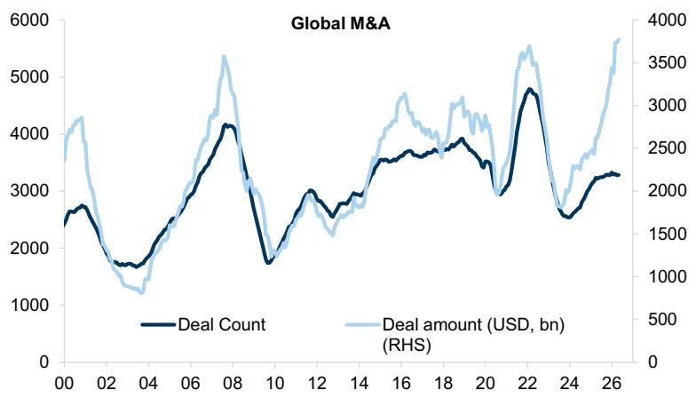

line

| Year | Deal Count | Deal amount (USD, bn) |
|------|------------|------------------------|
| 00   | ~2500      | ~3500                  |
| 02   | ~1800      | ~4000                  |
| 04   | ~1700      | ~1200                  |
| 06   | ~2500      | ~3500                  |
| 08   | ~4000      | ~5500                  |
| 10   | ~1800      | ~2000                  |
| 12   | ~2800      | ~2500                  |
| 14   | ~3500      | ~3000                  |
| 16   | ~3700      | ~3500                  |
| 18   | ~3800      | ~3200                  |
| 20   | ~3500      | ~3000                  |
| 22   | ~4800      | ~3500                  |
| 24   | ~2500      | ~2500                  |
| 26   | ~3200      | ~3800                  |

Source: Bloomberg, GS Global Investment Research

Exhibit 2: European M&A remains subdued   
12m rolling sum of M&A deals in Europe   
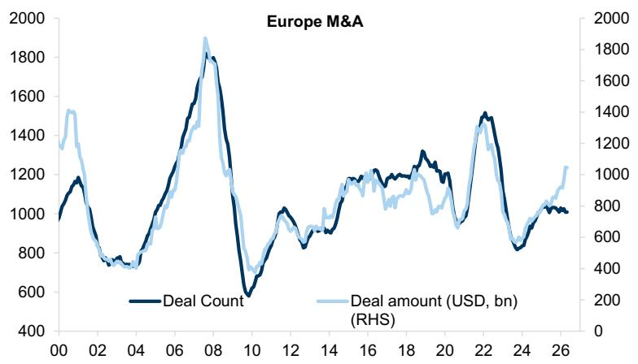

line

| Year | Deal Count | Deal amount (USD, bn) |
|------|------------|------------------------|
| 00   | 1000       | 1300                   |
| 02   | 1200       | 1500                   |
| 04   | 700        | 750                    |
| 06   | 1000       | 1200                   |
| 08   | 1800       | 1900                   |
| 10   | 600        | 700                    |
| 12   | 1000       | 900                    |
| 14   | 900        | 1000                   |
| 16   | 1200       | 1100                   |
| 18   | 1300       | 1200                   |
| 20   | 1200       | 1100                   |
| 22   | 1500       | 1400                   |
| 24   | 800        | 900                    |
| 26   | 1000       | 1200                   |

M&A deals involving an European target, and European acquirer, or both   
Source: Bloomberg, GS Global Investment Research

Exhibit 3: Asset disposals rise to a record strategic priority   
UK CFO Survey: Share of respondents prioritising asset disposals over the next 12 months (%)   
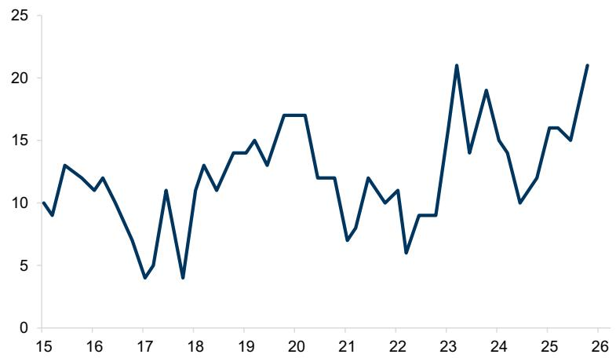

line

| x  | y    |
|----|------|
| 15 | 10   |
| 16 | 12   |
| 17 | 4    |
| 18 | 11   |
| 19 | 14   |
| 20 | 17   |
| 21 | 7    |
| 22 | 6    |
| 23 | 21   |
| 24 | 14   |
| 25 | 16   |
| 26 | 21   |

Source: Haver Analytics, GS Global Investment Research

Exhibit 4: Activity is increasingly driven by cross-border flows   
12m rolling sum of M&A deals in Europe   
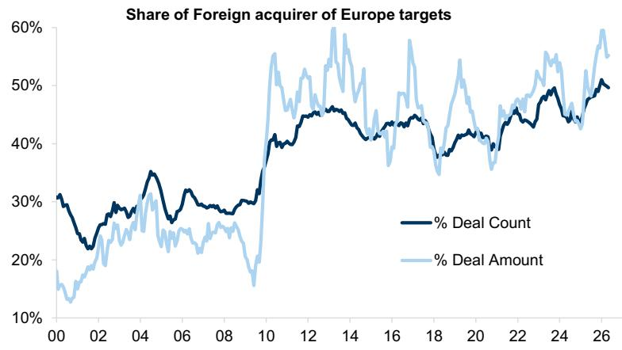

line

| Year | % Deal Count | % Deal Amount |
|------|--------------|---------------|
| 00   | 30%          | 15%           |
| 02   | 25%          | 20%           |
| 04   | 35%          | 25%           |
| 06   | 30%          | 25%           |
| 08   | 30%          | 25%           |
| 10   | 40%          | 55%           |
| 12   | 45%          | 50%           |
| 14   | 45%          | 60%           |
| 16   | 45%          | 50%           |
| 18   | 40%          | 35%           |
| 20   | 45%          | 45%           |
| 22   | 50%          | 50%           |
| 24   | 45%          | 55%           |
| 26   | 50%          | 60%           |

Source: Bloomberg, GS Global Investment Research

# Exhibit 5: Small caps tend to be correlated with our European M&A Candidates basket

Price performance of GS M&A Candidates Basket (GSTRACQN) vs. STOXX 600 and Small vs. Large caps (y/y chg, %).

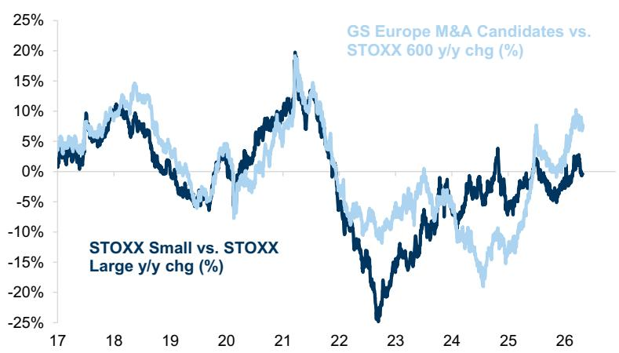

line

| Year | STOXX Small vs. STOXX Large y/y chg (%) |
|------|----------------------------------------|
| 17   | ~5%                                    |
| 18   | ~10%                                   |
| 19   | ~-5%                                   |
| 20   | ~0%                                    |
| 21   | ~20%                                   |
| 22   | ~-10%                                  |
| 23   | ~-25%                                  |
| 24   | ~-10%                                  |
| 25   | ~-5%                                   |
| 26   | ~10%                                   |

Source: FactSet, STOXX, GS Global Investment Research

# Exhibit 6: The M&A Candidates basket (GSTRACQN) trades at a heavy discount to the market

GSTRACQN vs. SXXP

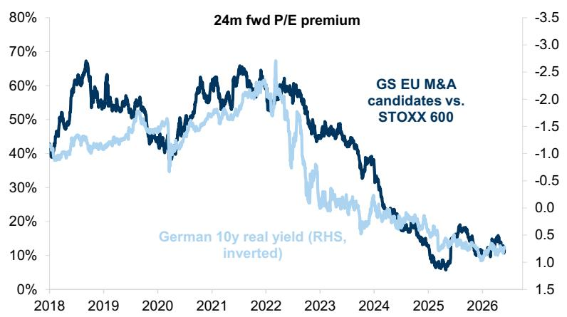

line

| Year | German 10y real yield (RHS, inverted) | GS EU M&A candidates vs. STOXX 600 |
|------|----------------------------------------|-------------------------------------|
| 2018 | ~40%                                   | ~-1.5                               |
| 2019 | ~50%                                   | ~-1.0                               |
| 2020 | ~45%                                   | ~-0.5                               |
| 2021 | ~55%                                   | ~-1.0                               |
| 2022 | ~65%                                   | ~-1.5                               |
| 2023 | ~30%                                   | ~-2.0                               |
| 2024 | ~15%                                   | ~-2.5                               |
| 2025 | ~5%                                    | ~-3.0                               |
| 2026 | ~10%                                   | ~-3.5                               |

Source: Bloomberg, GS Global Investment Research

# Exhibit 7: STOXX Small are close to the deepest discount historically against STOXX Large

12m fwd P/E from Small caps vs. Large caps (premium/discount)

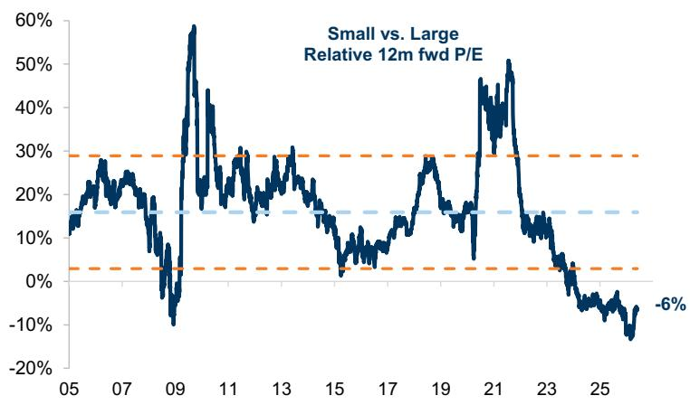

line

| Year | Relative 12m fwd P/E |
|------|------------------------|
| 2025 | -6%                    |

Source: Datastream, STOXX, GS Global Investment Research

# Exhibit 8: Year-to-date performance has been fully driven by EPS growth

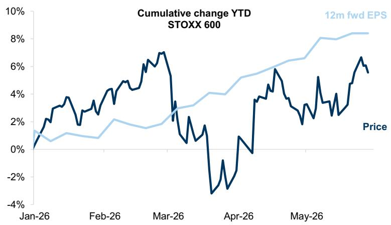

line

| Date   | Price | 12m fwd EPS |
|--------|-------|-------------|
| Jan-26 | 0%    | 1%          |
| Feb-26 | ~3%   | ~2%         |
| Mar-26 | ~7%   | ~3%         |
| Apr-26 | ~-3%  | ~4%         |
| May-26 | ~6%   | ~8%         |

Source: Datastream, GS Global Investment Research

Exhibit 9: We roll forward and raise our price targets 

<table><tr><td colspan="7">European Indices Forecasts</td></tr><tr><td></td><td colspan="2">STOXX 600</td><td colspan="2">SX5E</td><td colspan="2">FTSE 100</td></tr><tr><td>Price level</td><td>New</td><td>Old</td><td>New</td><td>Old</td><td>New</td><td>Old</td></tr><tr><td>3 months</td><td>640</td><td>605</td><td>6200</td><td>5800</td><td>10600</td><td>10500</td></tr><tr><td>6 months</td><td>645</td><td>615</td><td>6300</td><td>5900</td><td>10800</td><td>10600</td></tr><tr><td>12 months</td><td>660</td><td>625</td><td>6400</td><td>6000</td><td>11000</td><td>10800</td></tr><tr><td></td><td colspan="2">STOXX 600</td><td colspan="2">SX5E</td><td colspan="2">FTSE 100</td></tr><tr><td>Price Return (%)</td><td>New</td><td>Old</td><td>New</td><td>Old</td><td>New</td><td>Old</td></tr><tr><td>3 months</td><td>2.4</td><td>-3.2</td><td>2.4</td><td>-4.2</td><td>1.7</td><td>0.7</td></tr><tr><td>6 months</td><td>3.2</td><td>-1.6</td><td>4.0</td><td>-2.6</td><td>3.6</td><td>1.7</td></tr><tr><td>12 months</td><td>5.6</td><td>0.0</td><td>5.7</td><td>-0.9</td><td>5.5</td><td>3.6</td></tr><tr><td>Total Return 12m (%)</td><td>8.9</td><td></td><td>8.8</td><td></td><td>9.0</td><td></td></tr></table>

Source: GS Global Investment Research

# Snapshot of Global Performance Across Assets - Total Returns (€)

Exhibit 10: Cross-asset performance   
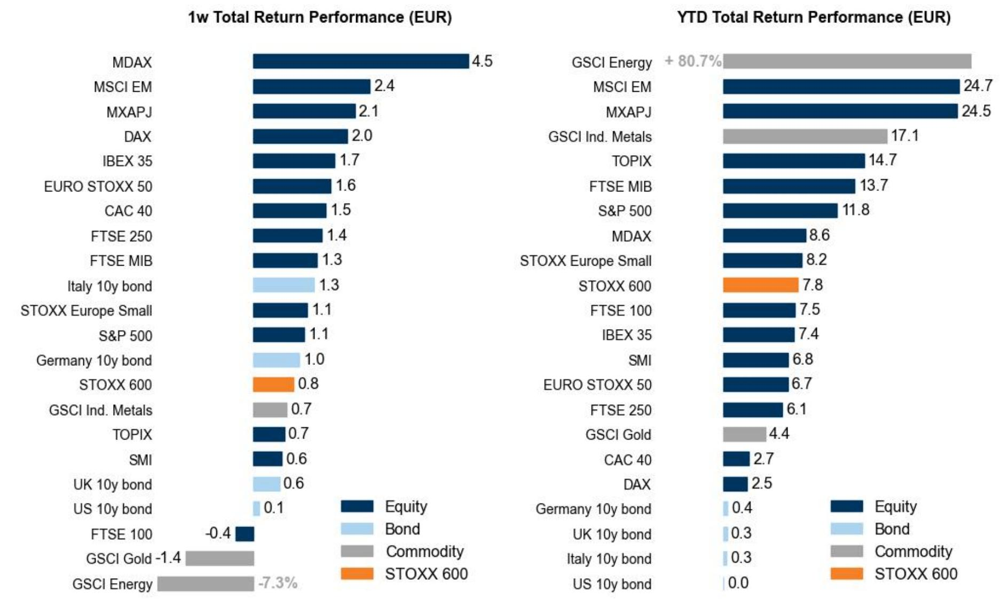  
Source: Bloomberg, Datastream, STOXX, GS Global Investment Research

# Global Strategy Views: Indices and Asset Classes

Exhibit 11: GS forecasts across assets 

<table><tr><td rowspan="2">28 May 2026</td><td rowspan="2">Current</td><td colspan="3">Forecast</td><td rowspan="2">Up/Downside to 12m TP (%)</td></tr><tr><td>3m</td><td>6m</td><td>12m</td></tr><tr><td colspan="6">Equities</td></tr><tr><td>STOXX Europe 600 (€)</td><td>625</td><td>640</td><td>645</td><td>660</td><td>5.6</td></tr><tr><td>Eurostoxx 50 (€)</td><td>6055</td><td>6200</td><td>6300</td><td>6400</td><td>5.7</td></tr><tr><td>FTSE 100 (£)</td><td>10426</td><td>10600</td><td>10800</td><td>11000</td><td>5.5</td></tr><tr><td>S&amp;P 500 ($)</td><td>7564</td><td>7600</td><td>8000</td><td>8300</td><td>9.7</td></tr><tr><td>MSCI Asia-Pacific Ex-Japan ($)</td><td>885</td><td>900</td><td>940</td><td>990</td><td>11.8</td></tr><tr><td>Topix (¥)</td><td>3902</td><td>3800</td><td>4000</td><td>4200</td><td>7.6</td></tr><tr><td colspan="6">10Y Rate (%)</td></tr><tr><td>US</td><td>4.5</td><td>4.2</td><td>4.1</td><td>4.1</td><td>-35 bp</td></tr><tr><td>Euro Area (Germany)</td><td>2.9</td><td>2.9</td><td>3.0</td><td>3.0</td><td>7 bp</td></tr><tr><td>UK</td><td>4.8</td><td>4.6</td><td>4.4</td><td>4.3</td><td>-48 bp</td></tr><tr><td>Japan</td><td>2.7</td><td>2.5</td><td>2.5</td><td>2.4</td><td>-25 bp</td></tr><tr><td colspan="6">Currencies</td></tr><tr><td>€/$</td><td>1.16</td><td>1.14</td><td>1.18</td><td>1.20</td><td>3.0</td></tr><tr><td>£/$</td><td>1.34</td><td>1.33</td><td>1.34</td><td>1.33</td><td>-0.8</td></tr><tr><td>$/¥</td><td>159</td><td>160</td><td>158</td><td>155</td><td>-2.7</td></tr><tr><td colspan="6">Commodities</td></tr><tr><td>Brent Crude Oil ($/bbl)</td><td>93.7</td><td>94.0</td><td>91.0</td><td>86.0</td><td>-8.2</td></tr><tr><td>NYMEX Nat. Gas ($/mmBtu)</td><td>3.0</td><td>3.5</td><td>3.5</td><td>3.5</td><td>15.1</td></tr><tr><td>Gold ($/troy oz)</td><td>4471</td><td>4805</td><td>4990</td><td>5445</td><td>21.8</td></tr><tr><td>LME Copper ($/mt)</td><td>13656</td><td>12635</td><td>12535</td><td>12265</td><td>-10.2</td></tr></table>

Source: Bloomberg, Datastream, STOXX, GS Global Investment Research

Exhibit 12: Valuation metrics across regions 

<table><tr><td>28 May 2026</td><td>P/E12m fwd (X)</td><td>EV / EBITDALast 12m (X)</td><td>FCF YieldLast 12m (%)</td><td>Div Yield12m fwd (%)</td><td>P/BLast 12m (X)</td><td>ROELast 12m (%)</td></tr><tr><td>STOXX Europe 600</td><td>14.5</td><td>9.5</td><td>4.5</td><td>3.3</td><td>2.3</td><td>13.8</td></tr><tr><td>EuroStoxx 50</td><td>15.0</td><td>10.9</td><td>4.1</td><td>3.1</td><td>2.4</td><td>14.4</td></tr><tr><td>FTSE 100</td><td>12.4</td><td>8.2</td><td>5.5</td><td>3.5</td><td>2.2</td><td>15.9</td></tr><tr><td>S&amp;P 500</td><td>21.1</td><td>16.6</td><td>3.1</td><td>1.4</td><td>5.2</td><td>21.6</td></tr><tr><td>MSCI Asia Pacific ex-Japan</td><td>13.1</td><td>12.0</td><td>3.7</td><td>2.2</td><td>2.4</td><td>14.1</td></tr><tr><td>Topix</td><td>16.6</td><td>12.2</td><td>4.5</td><td>2.2</td><td>1.8</td><td>9.6</td></tr></table>

Source: FactSet, I/B/E/S, STOXX, Datastream, GS Global Investment Research

# Earnings Expectations and Revisions

Exhibit 13: Expected earnings growth and revisions by sector (%)   
Local currency 

<table><tr><td></td><td colspan="3">EPS Growth</td><td colspan="2">EPS Revisions (1-month)</td><td colspan="2">EPS Revisions (YTD)</td></tr><tr><td>Sector</td><td>2026E</td><td>2027E</td><td>CAGR 26/27</td><td>2026E</td><td>2027E</td><td>2026E</td><td>2027E</td></tr><tr><td>Autos and Parts</td><td>49.9</td><td>25.9</td><td>37.4</td><td>NM</td><td>(1.4)</td><td>NM</td><td>(12.8)</td></tr><tr><td>Basic Resources</td><td>50.4</td><td>10.3</td><td>28.8</td><td>2.6</td><td>2.1</td><td>17.9</td><td>16.2</td></tr><tr><td>Energy</td><td>68.5</td><td>(9.0)</td><td>23.9</td><td>4.0</td><td>1.0</td><td>54.6</td><td>22.8</td></tr><tr><td>Technology</td><td>20.8</td><td>22.3</td><td>21.6</td><td>0.9</td><td>1.2</td><td>8.2</td><td>11.2</td></tr><tr><td>Industrials</td><td>15.2</td><td>16.0</td><td>15.6</td><td>(0.4)</td><td>0.6</td><td>(1.5)</td><td>(0.3)</td></tr><tr><td>Consumer Prods and Srvs</td><td>12.7</td><td>15.7</td><td>14.2</td><td>(0.7)</td><td>(1.0)</td><td>(6.0)</td><td>(5.6)</td></tr><tr><td>STOXX 600 ex Fin. &amp; RE</td><td>18.4</td><td>9.5</td><td>13.9</td><td>0.9</td><td>0.4</td><td>4.7</td><td>1.9</td></tr><tr><td>Construction and Mat.</td><td>14.2</td><td>13.2</td><td>13.7</td><td>0.2</td><td>0.3</td><td>(3.4)</td><td>(1.3)</td></tr><tr><td>STOXX 600</td><td>14.5</td><td>9.9</td><td>12.2</td><td>0.9</td><td>0.5</td><td>4.2</td><td>2.3</td></tr><tr><td>Chemicals</td><td>18.8</td><td>5.0</td><td>11.7</td><td>1.6</td><td>(0.2)</td><td>2.2</td><td>(4.4)</td></tr><tr><td>Banks</td><td>10.0</td><td>13.1</td><td>11.5</td><td>1.6</td><td>1.2</td><td>3.9</td><td>5.4</td></tr><tr><td>STOXX 600 ex Commod.</td><td>9.5</td><td>12.1</td><td>10.8</td><td>0.4</td><td>0.4</td><td>(0.0)</td><td>0.4</td></tr><tr><td>Telecoms</td><td>9.9</td><td>11.1</td><td>10.5</td><td>1.6</td><td>0.9</td><td>(0.7)</td><td>(1.0)</td></tr><tr><td>Retailers</td><td>9.3</td><td>10.0</td><td>9.6</td><td>(0.1)</td><td>(0.5)</td><td>0.5</td><td>0.5</td></tr><tr><td>Utilities</td><td>8.6</td><td>7.8</td><td>8.2</td><td>0.4</td><td>0.3</td><td>1.6</td><td>1.9</td></tr><tr><td>Insurance</td><td>6.8</td><td>7.8</td><td>7.3</td><td>0.3</td><td>0.1</td><td>0.8</td><td>0.9</td></tr><tr><td>Health Care</td><td>4.4</td><td>9.9</td><td>7.1</td><td>1.0</td><td>0.3</td><td>(2.0)</td><td>(2.2)</td></tr><tr><td>Travel and Leisure</td><td>(4.4)</td><td>18.8</td><td>6.5</td><td>(5.5)</td><td>(3.7)</td><td>(15.8)</td><td>(10.6)</td></tr><tr><td>Pers Care, D&amp;G Stores</td><td>4.1</td><td>7.6</td><td>5.9</td><td>(0.0)</td><td>(0.1)</td><td>(4.0)</td><td>(4.3)</td></tr><tr><td>Food, Bev. and Tobacco</td><td>2.7</td><td>8.3</td><td>5.4</td><td>0.4</td><td>0.4</td><td>(1.3)</td><td>(1.5)</td></tr><tr><td>Media</td><td>0.5</td><td>9.8</td><td>5.1</td><td>(0.8)</td><td>0.3</td><td>(3.7)</td><td>(2.5)</td></tr><tr><td>Financial Services</td><td>1.8</td><td>5.5</td><td>3.6</td><td>(0.7)</td><td>0.7</td><td>5.2</td><td>(3.9)</td></tr><tr><td>Real Estate</td><td>0.6</td><td>4.3</td><td>2.4</td><td>(1.7)</td><td>(1.6)</td><td>(2.5)</td><td>(2.3)</td></tr><tr><td colspan="8">GS Top-down</td></tr><tr><td>STOXX 600</td><td>10</td><td>5</td><td>7</td><td>-</td><td>-</td><td>-</td><td>-</td></tr></table>

Source: FactSet, STOXX, GS Global Investment Research

Exhibit 14: STOXX Europe 600 EPS revisions & earnings sentiment   
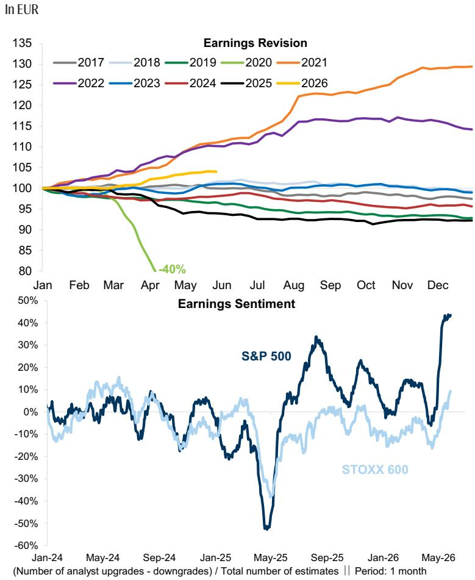  
Source: FactSet, STOXX, GS Global Investment Research

# STOXX Europe 600 Supersectors

# Exhibit 15: Our recommendations

STOXX Europe 600; sub-sectors in light blue

Sector and Supersector Recommendations 

<table><tr><td>Overweight</td><td>Neutral</td><td>Underweight</td></tr><tr><td>Banks (SX7P)</td><td>Healthcare (SXDP)</td><td>Autos and Parts (SXAP)</td></tr><tr><td>Construction &amp; Materials (SXOP)</td><td>Basic Resources (SXPP)</td><td>Chemicals (SX4P)</td></tr><tr><td>Food, Bev. &amp; Tob (S600FOP)</td><td>Energy (S600ENP)</td><td>Consum. P&amp;S (S600CPP)</td></tr><tr><td>Pers. Care &amp; Grocery (S600PDP)</td><td>Financial Svs (SXFP)</td><td>Media (SXMP)</td></tr><tr><td>Retailers (SXRP)</td><td>Industrial G&amp;S (SXNP)</td><td>Insurance P&amp;C (GSSBPCIN)</td></tr><tr><td>Technology (SX8P)</td><td>Insurance (SXIP)</td><td>Steel (GSSBSTEL)</td></tr><tr><td>Telecoms (SXKP)</td><td>Real Estate (SX86P)</td><td></td></tr><tr><td>Aerospace (GSSBCIVA)</td><td>Travel and Leisure (SXTP)</td><td></td></tr><tr><td>Defense (GSSBDEFE)</td><td>Utilities (SX6P)</td><td></td></tr><tr><td>Renewables (GSSBRNEW)</td><td></td><td></td></tr></table>

# Trade Recommendations

Capital Intensive (GSSTCAPI) vs. Capital Light (GSSTCAPL)

Fiscal Infrastructure (GSSTFISC)

High Labour Cost (GSSTHLAB) vs. SXXE ex Financials

Source: GS Global Investment Research

# Exhibit 17: 3-month sector performance

Total Return (€)

3m Total Return Performance   
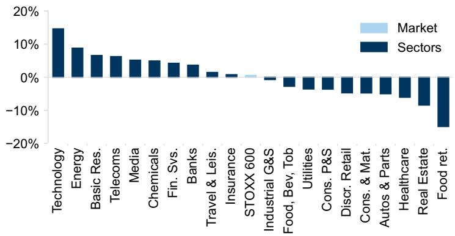

bar

| Sector | Value (%) |
| :--- | :--- |
| Technology | 15.0 |
| Energy | 9.0 |
| Basic Res. | 7.0 |
| Telecoms | 6.5 |
| Media | 5.5 |
| Chemicals | 5.0 |
| Fin. Sys. | 4.5 |
| Banks | 3.5 |
| Travel & Leis. | 2.0 |
| Insurance | 1.0 |
| STOXX 600 | 0.5 |
| Industrial G&S | -1.0 |
| Food, Bev, Tob | -2.0 |
| Utilities | -2.5 |
| Cons. P&S | -3.0 |
| Discr. Retail | -3.5 |
| Cons. & Mat. | -4.0 |
| Autos & Parts | -4.5 |
| Healthcare | -5.0 |
| Real Estate | -8.0 |
| Food ret. | -15.0 |

Source: Datastream, STOXX, GS Global Investment Research

# Exhibit 16: 1-week sector performance

Total Return (€)

1w Total Return Performance   
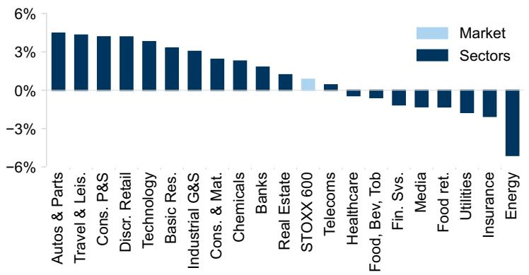

bar

| Sector | Value (%) |
| :--- | :--- |
| Autos & Parts | 5.0 |
| Travel & Leis. | 4.8 |
| Cons. P&S | 4.7 |
| Discr. Retail | 4.6 |
| Technology | 3.8 |
| Basic Res. | 3.2 |
| Industrial G&S | 3.1 |
| Cons. & Mat. | 2.7 |
| Chemicals | 2.6 |
| Banks | 2.4 |
| Real Estate | 1.9 |
| STOXX 600 | 1.5 |
| Telecoms | 0.8 |
| Healthcare | -0.5 |
| Food, Bev, Tob | -0.7 |
| Fin. Svs. | -1.0 |
| Media | -1.2 |
| Food ret. | -1.3 |
| Utilities | -1.8 |
| Insurance | -2.5 |
| Energy | -5.5 |

Source: Datastream, STOXX, GS Global Investment Research

# Exhibit 18: YTD sector performance

Total Return (€)

YTD Total Return Performance   
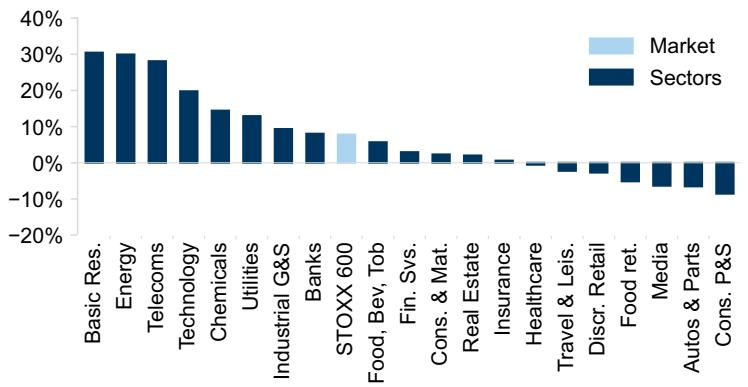

bar

| Sector | Value (%) |
| :--- | :--- |
| Basic Res. | 31 |
| Energy | 30 |
| Telecoms | 29 |
| Technology | 20 |
| Chemicals | 15 |
| Utilities | 14 |
| Industrial G&S | 10 |
| Banks | 9 |
| STOXX 600 | 8 |
| Food, Bev, Tob | 6 |
| Fin. Sys. | 3 |
| Cons. & Mat. | 2 |
| Real Estate | 2 |
| Insurance | 1 |
| Healthcare | -1 |
| Travel & Leis. | -2 |
| Discr. Retail | -3 |
| Food ret. | -4 |
| Media | -5 |
| Autos & Parts | -6 |
| Cons. P&S | -8 |

Source: Datastream, STOXX, GS Global Investment Research

# Style Performance

Exhibit 19: Cyclicals vs. Defensives   
Cyclicals = Equal Weighted: Industrials, Financials and Cons Discretionary. Defensives = Equal Weighted: Utilities, Health Care, Com Services, Cons Staples   
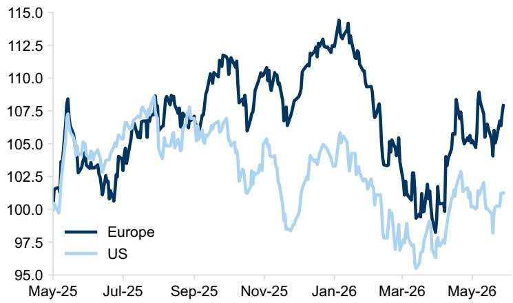

line

| Date   | Europe | US    |
|--------|--------|-------|
| May-25 | 108.0  | 100.0 |
| Jul-25 | 107.0  | 105.0 |
| Sep-25 | 109.0  | 106.0 |
| Nov-25 | 110.0  | 105.0 |
| Jan-26 | 114.0  | 106.0 |
| Mar-26 | 105.0  | 98.0  |
| May-26 | 108.0  | 102.0 |

Source: FactSet, GS Global Investment Research

Exhibit 20: Value vs. Growth price performance   
MSCI indices   
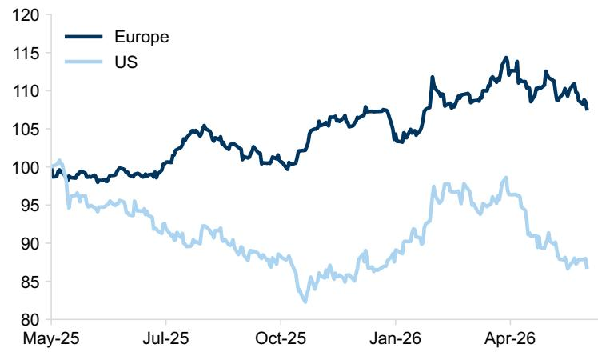

line

| Date   | Europe | US   |
|--------|--------|------|
| May-25 | 99     | 100  |
| Jul-25 | 105    | 95   |
| Oct-25 | 100    | 85   |
| Jan-26 | 108    | 90   |
| Apr-26 | 115    | 98   |

Source: Bloomberg, STOXX, GS Global Investment Research

Exhibit 21: Small-cap vs. Large-cap price performance   
US: Russell 2000 vs. SPX; Europe: STOXX Small vs. STOXX Europe Large   
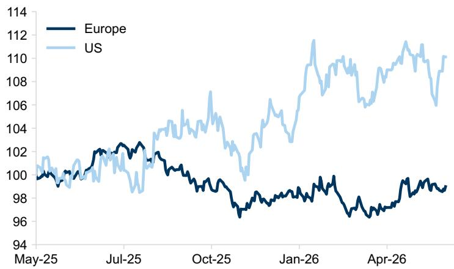

line

| Date   | Europe | US    |
|--------|--------|-------|
| May-25 | 100.0  | 101.0 |
| Jul-25 | 102.0  | 103.0 |
| Oct-25 | 98.0   | 107.0 |
| Jan-26 | 96.0   | 112.0 |
| Apr-26 | 98.0   | 110.0 |

Source: Bloomberg, STOXX, GS Global Investment Research

Exhibit 22: Momentum vs. Market   
MSCI indices   
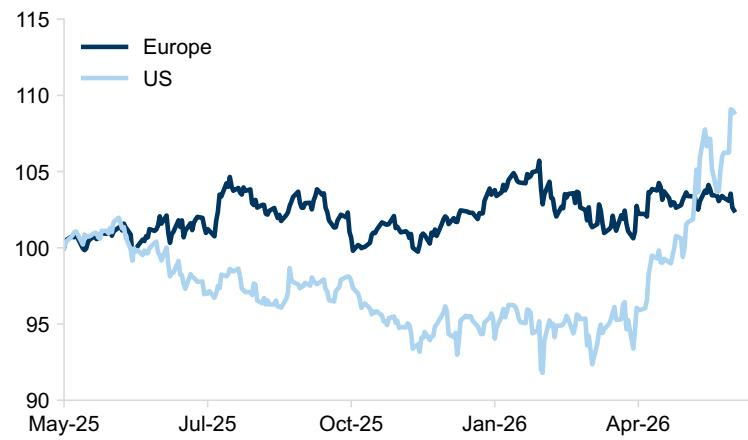

line

| Date   | Europe | US   |
|--------|--------|------|
| May-25 | 100    | 100  |
| Jul-25 | 104    | 98   |
| Oct-25 | 100    | 95   |
| Jan-26 | 105    | 93   |
| Apr-26 | 103    | 108  |

Source: Bloomberg, STOXX, GS Global Investment Research

# Thematic Baskets – Price performance

Exhibit 23: Thematic basket relative performance   
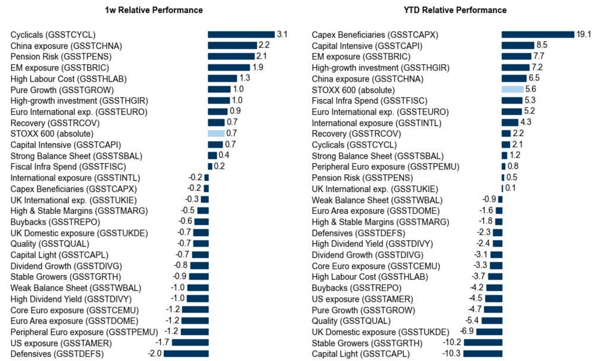  
Source: Bloomberg, STOXX, GS Global Investment Research

# Sub-Sector Performance

Exhibit 24: 1-week sub-sector price performance   
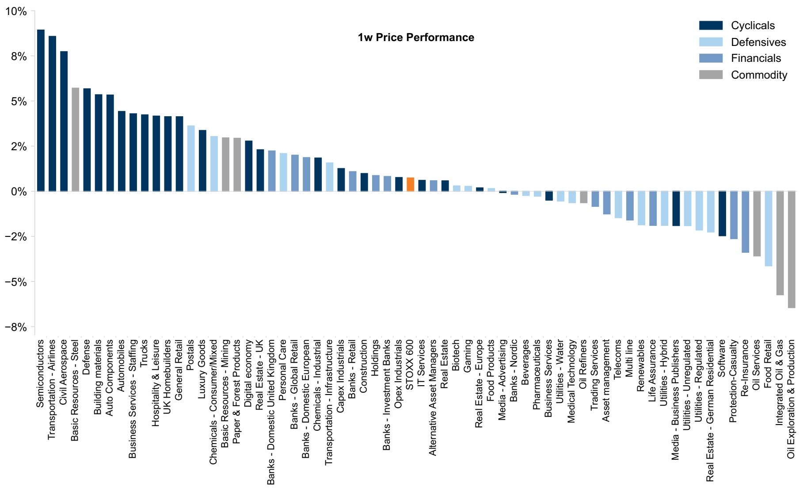

bar

1w Price Performance
| Sector | Performance (%) |
| :--- | :--- |
| Semiconductors | 9.2 |
| Transportation - Airlines | 8.9 |
| Civil Aerospace | 8.2 |
| Basic Resources - Steel | 6.5 |
| Defense | 6.4 |
| Building materials | 5.6 |
| Auto Components | 5.5 |
| Automobiles | 4.3 |
| Business Services - Staffing | 4.0 |
| Trucks | 3.8 |
| Hospitality & Leisure | 3.7 |
| UK Homebuilders | 3.6 |
| General Retail | 3.5 |
| Postals | 2.8 |
| Luxury Goods | 2.6 |
| Chemicals - Consumer/Mixed | 2.3 |
| Basic Resources - Mining | 2.3 |
| Paper & Forest Products | 2.3 |
| Digital economy | 2.2 |
| Real Estate - UK | 1.9 |
| Banks - Domestic United Kingdom | 1.8 |
| Personal Care | 1.7 |
| Banks - Global Retail | 1.7 |
| Banks - Domestic European | 1.6 |
| Chemicals - Industrial | 1.6 |
| Transportation - Infrastructure | 1.4 |
| Capex Industrials | 1.1 |
| Banks - Retail | 0.9 |
| Construction | 0.8 |
| Holdings | 0.7 |
| Banks - Investment Banks | 0.7 |
| Opex Industrials | 0.6 |
| STOXX 600 | 0.6 |
| IT Services | 0.5 |
| Alternative Asset Managers | 0.5 |
| Real Estate | 0.5 |
| Biotech | 0.3 |
| Gaming | 0.2 |
| Real Estate - Europe | 0.1 |
| Food Products | 0.1 |
| Media - Advertising | -0.1 |
| Banks - Nordic | -0.2 |
| Beverages | -0.3 |
| Pharmaceuticals | -0.4 |
| Business Services | -0.5 |
| Utilities - Water | -0.6 |
| Medical Technology | -0.7 |
| Oil Refiners | -0.8 |
| Trading Services | -1.0 |
| Asset management | -1.2 |
| Telecoms | -1.4 |
| Multi line | -1.6 |
| Renewables | -1.7 |
| Life Assurance | -1.8 |
| Utilities - Hybrid | -1.9 |
| Media - Business Publishers | -2.0 |
| Utilities - Unregulated | -2.1 |
| Utilities - Regulated | -2.2 |
| Real Estate - German Residential | -2.3 |
| Software | -2.4 |
| Protection-Casualty | -2.5 |
| Re-Insurance | -2.6 |
| Oil Services | -2.7 |
| Food Retail | -2.8 |
| Integrated Oil & Gas | -6.5 |
| Oil Exploration & Production | -7.5 |

Source: Bloomberg, GS Global Investment Research

Exhibit 25: YTD Sub-sector price performance   
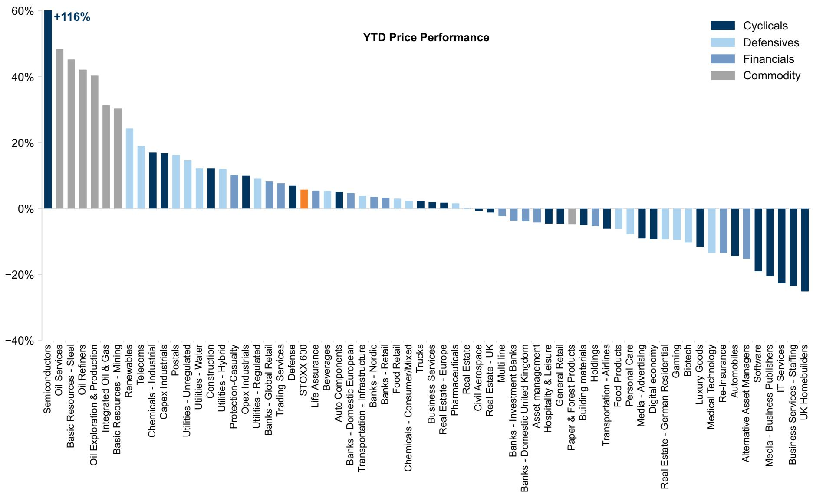

bar

YTD Price Performance
| Sector | Performance (%) |
| :--- | :--- |
| Semiconductors | 60.5 |
| Oil Services | 48.2 |
| Basic Resources - Steel | 45.1 |
| Oil Refiners | 42.3 |
| Oil Exploration & Production | 40.7 |
| Integrated Oil & Gas | 31.5 |
| Basic Resources - Mining | 30.2 |
| Renewables | 24.1 |
| Telecoms | 19.2 |
| Chemicals - Industrial | 17.3 |
| Capex Industrials | 16.8 |
| Postals | 16.5 |
| Utilities - Unregulated | 14.7 |
| Utilities - Water | 12.4 |
| Construction | 12.1 |
| Utilities - Hybrid | 11.9 |
| Protection-Casualty | 10.3 |
| Opex Industrials | 9.8 |
| Utilities - Regulated | 8.9 |
| Banks - Global Retail | 8.2 |
| Trading Services | 7.6 |
| Defense | 6.8 |
| STOXX 600 | 5.5 |
| Life Assurance | 5.0 |
| Beverages | 4.9 |
| Auto Components | 4.7 |
| Banks - Domestic European | 4.3 |
| Transportation - Infrastructure | 3.8 |
| Banks - Nordic | 3.5 |
| Banks - Retail | 3.2 |
| Food Retail | 2.9 |
| Chemicals - Consumer/Mixed | 2.6 |
| Trucks | 2.3 |
| Business Services | 2.0 |
| Real Estate - Europe | 1.7 |
| Pharmaceuticals | 1.4 |
| Real Estate | 0.8 |
| Civil Aerospace | -0.5 |
| Real Estate - UK | -0.7 |
| Multi line | -1.2 |
| Banks - Investment Banks | -1.5 |
| Banks - Domestic United Kingdom | -1.8 |
| Asset management | -2.0 |
| Hospitality & Leisure | -2.3 |
| General Retail | -2.6 |
| Paper & Forest Products | -2.9 |
| Building materials | -3.2 |
| Holdings | -3.5 |
| Transportation - Airlines | -3.8 |
| Food Products | -4.1 |
| Personal Care | -4.4 |
| Media - Advertising | -4.7 |
| Digital economy | -5.0 |
| Real Estate - German Residential | -5.3 |
| Gaming | -5.6 |
| Biotech | -5.9 |
| Luxury Goods | -6.2 |
| Medical Technology | -6.5 |
| Re-Insurance | -6.8 |
| Automobiles | -7.1 |
| Alternative Asset Managers | -7.4 |
| Software | -7.7 |
| Media - Business Publishers | -8.0 |
| IT Services | -8.3 |
| Business Services - Staffing | -8.6 |
| UK Homebuilders | -8.9 |

Source: Bloomberg, GS Global Investment Research

# Thematic Baskets

Exhibit 26: International Exposure Baskets   
Relative performance vs. SXXP (EUR)   
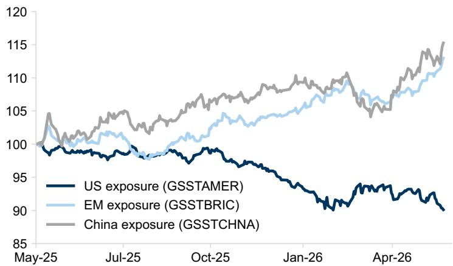

line

| Date   | US exposure (GSSTAMER) | EM exposure (GSSTBRIC) | China exposure (GSSTCHNA) |
|--------|------------------------|------------------------|---------------------------|
| May-25 | ~99                    | ~100                   | ~100                      |
| Jul-25 | ~98                    | ~101                   | ~104                      |
| Oct-25 | ~97                    | ~103                   | ~107                      |
| Jan-26 | ~94                    | ~106                   | ~109                      |
| Apr-26 | ~90                    | ~110                   | ~115                      |

Source: Bloomberg, STOXX, GS Global Investment Research

Exhibit 27: Domestic Exposure Baskets   
Relative performance vs. SXXP (EUR)   
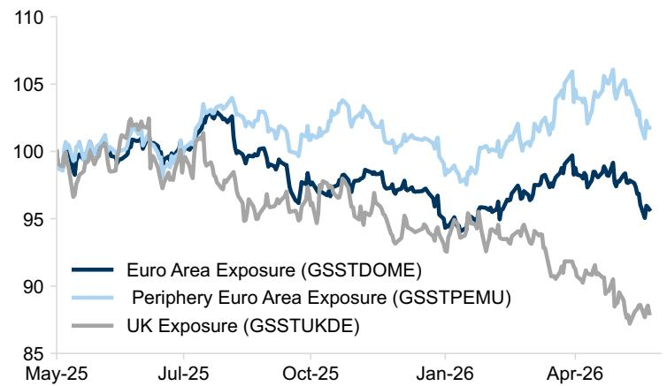

line

| Date   | Euro Area Exposure (GSSTDOME) | Periphery Euro Area Exposure (GSSTPEMU) | UK Exposure (GSSTUKDE) |
|--------|-------------------------------|----------------------------------------|------------------------|
| May-25 | ~100                          | ~100                                   | ~99                    |
| Jul-25 | ~103                          | ~104                                   | ~102                   |
| Oct-25 | ~98                           | ~103                                   | ~97                    |
| Jan-26 | ~95                           | ~101                                   | ~94                    |
| Apr-26 | ~96                           | ~106                                   | ~90                    |
| Final  | ~95                           | ~102                                   | ~88                    |

Source: Bloomberg, STOXX, GS Global Investment Research

Exhibit 28: Shareholder Return Baskets   
Relative performance vs. SXXP (EUR)   
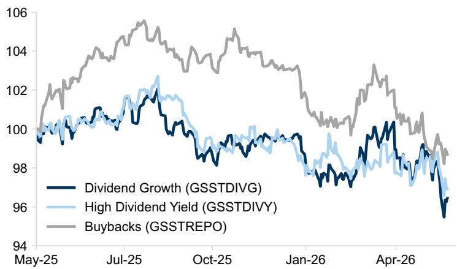

line

| Date   | Dividend Growth (GSSTDIVG) | High Dividend Yield (GSSTDIVY) | Buybacks (GSSTREPO) |
|--------|-----------------------------|----------------------------------|----------------------|
| May-25 | ~100                        | ~100                             | ~100                 |
| Jul-25 | ~101                        | ~102                             | ~105                 |
| Oct-25 | ~99                         | ~100                             | ~103                 |
| Jan-26 | ~98                         | ~98                              | ~100                 |
| Apr-26 | ~96                         | ~97                              | ~99                  |

Source: Bloomberg, STOXX, GS Global Investment Research

Exhibit 29: Fundamental Thematic Baskets   
Relative performance vs. SXXP (EUR)   
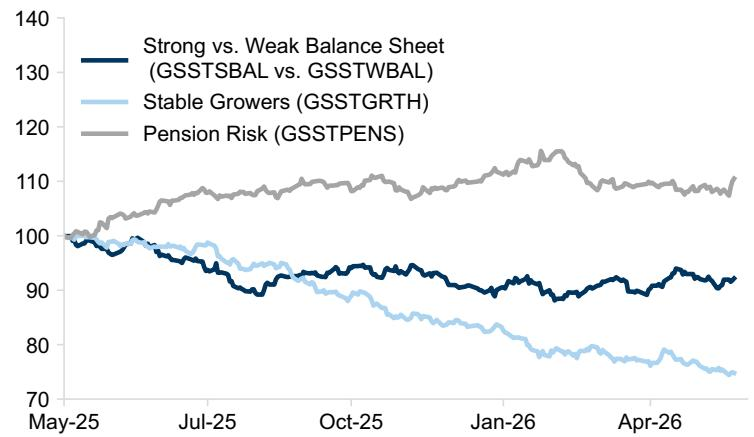

line

| Date   | Strong vs. Weak Balance Sheet | Stable Growers | Pension Risk |
|--------|-------------------------------|----------------|--------------|
| May-25 | 100                           | 100            | 100          |
| Jul-25 | 95                            | 98             | 108          |
| Oct-25 | 92                            | 90             | 110          |
| Jan-26 | 90                            | 85             | 115          |
| Apr-26 | 93                            | 78             | 110          |

Source: Bloomberg, STOXX, GS Global Investment Research

# Thematic Basket Valuation

# Strategy in Style

> For more on our basket methodology, please click here   
> Our baskets and constituents can be accessed via Bloomberg using the ticker followed by <Index> (e.g. <GSSTGRTH Index><Go> or MEMB <Go>)

Exhibit 30: GS Thematic basket valuation metrics 

<table><tr><td rowspan="2">Baskets28 May, 2026</td><td rowspan="2">Bloomberg Ticker</td><td colspan="3">Relative Total Return</td><td colspan="2">EPS Growth</td><td colspan="2">Sales Growth</td><td colspan="4">EPS Momentum</td><td rowspan="2">P/E</td><td rowspan="2">EV/ EBITDA</td><td rowspan="2">Cash Flow Yield</td><td rowspan="2">Dividend Yield</td><td rowspan="2">Price / Book</td></tr><tr><td>1w (%)</td><td>1m (%)</td><td>YTD (%)</td><td>2025E - 2026E (%)</td><td>2026E - 2027E (%)</td><td>2025E - 2026E (%)</td><td>2026E - 2027E (%)</td><td>1m change 2026 (%)</td><td>2027 (%)</td><td>YTD change 2026 (%)</td><td>2027 (%)</td></tr><tr><td colspan="18">Macro Baskets</td></tr><tr><td>Defensives</td><td>GSSTDEFS</td><td>-2.1</td><td>-3.9</td><td>-2.1</td><td>6.7</td><td>7.5</td><td>2.7</td><td>4.0</td><td>0.8</td><td>0.2</td><td>0.2</td><td>-1.0</td><td>14.9</td><td>10.5</td><td>6.0</td><td>3.9</td><td>1.9</td></tr><tr><td>Cyclicals</td><td>GSSTCYCL</td><td>3.2</td><td>4.0</td><td>1.7</td><td>19.7</td><td>16.8</td><td>3.8</td><td>3.0</td><td>0.9</td><td>-0.1</td><td>-4.1</td><td>-4.9</td><td>12.9</td><td>20.0</td><td>4.3</td><td>3.2</td><td>1.3</td></tr><tr><td>Capex Beneficiaries</td><td>GSSTCAPX</td><td>-0.1</td><td>2.7</td><td>18.6</td><td>31.9</td><td>7.2</td><td>5.4</td><td>1.1</td><td>4.2</td><td>2.2</td><td>17.7</td><td>7.9</td><td>16.3</td><td>12.2</td><td>4.1</td><td>2.8</td><td>2.0</td></tr><tr><td>Fiscal Infrastructure Spending</td><td>GSSTFISC</td><td>0.1</td><td>-1.2</td><td>5.1</td><td>25.0</td><td>18.5</td><td>2.3</td><td>5.7</td><td>1.6</td><td>0.7</td><td>-0.2</td><td>-0.2</td><td>19.3</td><td>11.3</td><td>3.6</td><td>2.6</td><td>2.5</td></tr><tr><td colspan="18">Fundamental Baskets</td></tr><tr><td>Recovery</td><td>GSSTRCOV</td><td>1.0</td><td>1.6</td><td>2.4</td><td>17.2</td><td>15.6</td><td>2.5</td><td>3.0</td><td>0.5</td><td>0.4</td><td>-4.2</td><td>-4.6</td><td>10.9</td><td>6.8</td><td>9.0</td><td>3.9</td><td>1.1</td></tr><tr><td>Pension Risk</td><td>GSSTPENS</td><td>2.1</td><td>2.0</td><td>0.2</td><td>24.7</td><td>28.0</td><td>1.9</td><td>3.0</td><td>-1.9</td><td>-1.2</td><td>-12.0</td><td>-7.0</td><td>11.2</td><td>6.4</td><td>7.2</td><td>3.8</td><td>1.1</td></tr><tr><td>Pure Growth</td><td>GSSTGROW</td><td>1.0</td><td>1.3</td><td>-5.8</td><td>22.0</td><td>19.9</td><td>11.1</td><td>10.8</td><td>-0.4</td><td>-0.4</td><td>-3.3</td><td>-3.6</td><td>21.7</td><td>16.0</td><td>4.7</td><td>1.8</td><td>4.9</td></tr><tr><td>Stable Growers</td><td>GSSTGRTH</td><td>-0.8</td><td>-2.8</td><td>-10.8</td><td>6.8</td><td>11.1</td><td>6.5</td><td>7.0</td><td>-0.1</td><td>-0.1</td><td>-1.9</td><td>-2.5</td><td>17.9</td><td>12.9</td><td>5.2</td><td>2.4</td><td>3.7</td></tr><tr><td>High &amp; Stable Margins</td><td>GSSTMARG</td><td>-0.5</td><td>-0.3</td><td>-2.2</td><td>10.3</td><td>7.8</td><td>3.9</td><td>4.1</td><td>1.1</td><td>0.2</td><td>3.7</td><td>1.5</td><td>17.9</td><td>13.8</td><td>4.5</td><td>2.9</td><td>3.4</td></tr><tr><td>Quality</td><td>GSSTQUAL</td><td>-0.6</td><td>-1.4</td><td>-5.3</td><td>8.0</td><td>7.9</td><td>4.9</td><td>3.7</td><td>0.9</td><td>0.4</td><td>3.9</td><td>1.9</td><td>16.2</td><td>12.7</td><td>4.7</td><td>3.4</td><td>3.3</td></tr><tr><td>Strong Balance Sheet</td><td>GSSTSBAL</td><td>0.3</td><td>0.0</td><td>0.6</td><td>9.8</td><td>9.8</td><td>5.8</td><td>4.6</td><td>1.9</td><td>1.2</td><td>5.2</td><td>3.1</td><td>20.4</td><td>14.9</td><td>4.4</td><td>2.1</td><td>3.1</td></tr><tr><td>Weak Balance Sheet</td><td>GSSTWBAL</td><td>-0.6</td><td>0.9</td><td>-1.3</td><td>25.4</td><td>13.2</td><td>0.7</td><td>3.7</td><td>-0.6</td><td>0.1</td><td>-4.1</td><td>-3.5</td><td>11.7</td><td>8.4</td><td>9.0</td><td>3.5</td><td>1.6</td></tr><tr><td>EU High Labour Cost</td><td>GSSTHLAB</td><td>1.4</td><td>1.0</td><td>-3.6</td><td>12.1</td><td>18.7</td><td>1.5</td><td>3.8</td><td>0.0</td><td>0.0</td><td>-6.4</td><td>-3.8</td><td>13.0</td><td>7.3</td><td>9.0</td><td>3.2</td><td>1.4</td></tr><tr><td>Capital Intensive</td><td>GSSTCAPI</td><td>0.6</td><td>1.0</td><td>7.9</td><td>24.7</td><td>7.6</td><td>5.4</td><td>2.0</td><td>1.6</td><td>0.7</td><td>10.1</td><td>4.4</td><td>14.7</td><td>13.8</td><td>4.7</td><td>3.2</td><td>1.6</td></tr><tr><td>Capital Light</td><td>GSSTCAPL</td><td>-0.6</td><td>-1.7</td><td>-10.7</td><td>8.1</td><td>11.5</td><td>2.6</td><td>3.9</td><td>0.0</td><td>-0.2</td><td>-2.7</td><td>-2.4</td><td>15.9</td><td>12.1</td><td>7.2</td><td>2.9</td><td>2.8</td></tr><tr><td colspan="18">Shareholder Return Baskets</td></tr><tr><td>High Dividend Yield</td><td>GSSTDIVY</td><td>-0.5</td><td>-0.3</td><td>-1.8</td><td>12.6</td><td>7.4</td><td>3.8</td><td>2.1</td><td>0.7</td><td>0.1</td><td>4.0</td><td>0.8</td><td>11.3</td><td>8.7</td><td>7.2</td><td>4.9</td><td>1.8</td></tr><tr><td>Dividend growth</td><td>GSSTDIVG</td><td>-0.6</td><td>-0.6</td><td>-2.4</td><td>24.8</td><td>5.9</td><td>6.2</td><td>1.7</td><td>0.7</td><td>0.3</td><td>4.5</td><td>0.3</td><td>10.5</td><td>8.7</td><td>8.4</td><td>4.3</td><td>1.8</td></tr><tr><td>Buybacks</td><td>GSSTREPO</td><td>-0.5</td><td>-1.2</td><td>-3.6</td><td>21.0</td><td>10.7</td><td>4.8</td><td>0.1</td><td>1.1</td><td>0.4</td><td>1.1</td><td>-0.9</td><td>11.9</td><td>11.3</td><td>7.6</td><td>3.6</td><td>1.4</td></tr><tr><td>High Growth Investment Ratio</td><td>GSSTHGIR</td><td>1.0</td><td>3.4</td><td>6.0</td><td>13.6</td><td>17.2</td><td>7.1</td><td>7.2</td><td>0.6</td><td>-0.1</td><td>1.0</td><td>0.4</td><td>19.3</td><td>14.0</td><td>2.9</td><td>2.1</td><td>3.0</td></tr><tr><td colspan="18">International Baskets</td></tr><tr><td>International Exposure</td><td>GSSTINTL</td><td>-0.2</td><td>0.9</td><td>4.0</td><td>11.5</td><td>7.8</td><td>6.5</td><td>3.2</td><td>1.2</td><td>1.0</td><td>6.5</td><td>3.0</td><td>14.5</td><td>15.4</td><td>5.7</td><td>2.9</td><td>2.3</td></tr><tr><td>Euro International Exposure</td><td>GSSTEURO</td><td>0.8</td><td>2.1</td><td>4.8</td><td>13.1</td><td>12.8</td><td>4.3</td><td>5.0</td><td>0.9</td><td>1.0</td><td>-0.5</td><td>0.2</td><td>14.9</td><td>14.9</td><td>4.9</td><td>2.9</td><td>2.2</td></tr><tr><td>UK International Exposure</td><td>GSSTUKIE</td><td>-0.3</td><td>-0.8</td><td>-0.6</td><td>17.4</td><td>8.7</td><td>8.3</td><td>1.5</td><td>0.9</td><td>0.3</td><td>6.2</td><td>2.0</td><td>14.6</td><td>9.4</td><td>6.9</td><td>2.9</td><td>2.5</td></tr><tr><td>US Exposure</td><td>GSSTAMER</td><td>-1.5</td><td>-3.1</td><td>-4.7</td><td>9.9</td><td>10.7</td><td>4.5</td><td>4.1</td><td>0.4</td><td>-0.2</td><td>-0.8</td><td>-4.0</td><td>14.8</td><td>10.9</td><td>5.6</td><td>2.9</td><td>2.3</td></tr><tr><td>China Exposure</td><td>GSSTCHNA</td><td>2.2</td><td>4.8</td><td>5.9</td><td>18.0</td><td>19.1</td><td>1.5</td><td>3.7</td><td>0.3</td><td>0.0</td><td>-1.3</td><td>-0.2</td><td>17.9</td><td>17.3</td><td>4.8</td><td>2.5</td><td>1.6</td></tr><tr><td>EM Exposure</td><td>GSSTBRIC</td><td>1.8</td><td>5.1</td><td>7.3</td><td>24.8</td><td>10.8</td><td>4.7</td><td>3.0</td><td>1.0</td><td>0.6</td><td>7.1</td><td>3.1</td><td>16.1</td><td>14.0</td><td>5.9</td><td>2.8</td><td>1.8</td></tr><tr><td colspan="18">Domestic Baskets</td></tr><tr><td>Domestic Eurozone</td><td>GSSTDOME</td><td>-0.8</td><td>-2.5</td><td>-1.0</td><td>8.6</td><td>8.9</td><td>3.7</td><td>1.9</td><td>0.4</td><td>0.4</td><td>-0.1</td><td>0.0</td><td>12.5</td><td>10.4</td><td>5.7</td><td>4.8</td><td>1.5</td></tr><tr><td>Core Eurozone</td><td>GSSTCEMU</td><td>-0.5</td><td>-3.0</td><td>-4.6</td><td>7.6</td><td>11.5</td><td>2.3</td><td>3.7</td><td>-0.3</td><td>0.0</td><td>-2.6</td><td>-1.1</td><td>12.5</td><td>11.0</td><td>7.0</td><td>4.7</td><td>1.3</td></tr><tr><td>Periphery Eurozone</td><td>GSSTPEMU</td><td>-1.4</td><td>-2.6</td><td>1.4</td><td>10.0</td><td>5.2</td><td>7.5</td><td>-2.9</td><td>1.4</td><td>0.9</td><td>3.6</td><td>1.6</td><td>12.6</td><td>9.6</td><td>4.0</td><td>5.0</td><td>1.8</td></tr><tr><td>UK Domestic Exposure</td><td>GSSTUKDE</td><td>-0.7</td><td>-3.4</td><td>-7.3</td><td>3.8</td><td>7.5</td><td>2.3</td><td>3.1</td><td>-0.8</td><td>-0.9</td><td>-2.5</td><td>-3.7</td><td>12.3</td><td>8.3</td><td>4.1</td><td>4.6</td><td>1.6</td></tr><tr><td>STOXX Europe 600</td><td>SXXP</td><td>0.8</td><td>3.9</td><td>7.8</td><td>14.5</td><td>9.9</td><td>5.8</td><td>3.0</td><td>0.9</td><td>0.5</td><td>4.2</td><td>2.3</td><td>14.5</td><td>8.8</td><td>4.5</td><td>3.3</td><td>2.3</td></tr></table>

Source: FactSet, STOXX, GS Global Investment Research

# Europe Sector Valuation

Exhibit 31: Sector valuation 

<table><tr><td rowspan="3">SectorsMay 28, 2026</td><td rowspan="3">STOXX600Wgt</td><td colspan="3">Total Return</td><td colspan="2">EPS Growth</td><td colspan="2">GSEPS Growth</td><td colspan="2">EPS Momentum</td><td colspan="2">Sales Growth</td><td rowspan="3">Expd.ROE2026</td><td rowspan="3">P/EMult.NTM</td><td rowspan="3">EV /EBITDANTM</td><td rowspan="3">CashFlowYieldLTM</td><td rowspan="3">DivYldNTM</td><td rowspan="3">Price /BookValueLTM</td><td rowspan="3">NetDebt /Equity(%)</td></tr><tr><td rowspan="2">1 wk(%)</td><td rowspan="2">1 mo(%)</td><td rowspan="2">YTD(%)</td><td rowspan="2">2025E-2026E(%)</td><td rowspan="2">2026E-2027E(%)</td><td rowspan="2">2025E-2026E(%)</td><td rowspan="2">2026E-2027E(%)</td><td colspan="2">One monthchange</td><td rowspan="2">2025E-2026E(%)</td><td rowspan="2">2026E-2027E(%)</td></tr><tr><td>2026</td><td>2027</td></tr><tr><td>Automobiles and Parts</td><td>1.8</td><td>4.5</td><td>5.3</td><td>(6.5)</td><td>49.9</td><td>25.9</td><td>55.3</td><td>29.9</td><td>(0.7)</td><td>(1.4)</td><td>1.0</td><td>2.9</td><td>4.8</td><td>8.2</td><td>6.0</td><td>6.2</td><td>4.5</td><td>0.4</td><td>87</td></tr><tr><td>Banks</td><td>13.4</td><td>1.8</td><td>4.7</td><td>8.0</td><td>10.0</td><td>13.1</td><td>12.4</td><td>15.0</td><td>1.6</td><td>1.2</td><td>NM</td><td>NM</td><td>13.9</td><td>9.7</td><td>NM</td><td>NM</td><td>5.3</td><td>1.4</td><td>NM</td></tr><tr><td>Basic Resources</td><td>3.1</td><td>3.3</td><td>10.6</td><td>30.5</td><td>50.4</td><td>10.3</td><td>46.0</td><td>5.2</td><td>2.6</td><td>2.1</td><td>12.1</td><td>(0.1)</td><td>12.4</td><td>14.7</td><td>6.5</td><td>3.1</td><td>3.0</td><td>1.9</td><td>30</td></tr><tr><td>Chemicals</td><td>2.1</td><td>2.3</td><td>4.4</td><td>14.4</td><td>18.8</td><td>5.0</td><td>31.9</td><td>(1.6)</td><td>1.6</td><td>(0.2)</td><td>4.1</td><td>1.8</td><td>10.9</td><td>19.0</td><td>9.3</td><td>4.0</td><td>3.2</td><td>2.1</td><td>40</td></tr><tr><td>Construction and Materials</td><td>3.1</td><td>2.4</td><td>0.9</td><td>2.3</td><td>14.2</td><td>13.2</td><td>7.4</td><td>10.3</td><td>0.2</td><td>0.3</td><td>3.8</td><td>5.6</td><td>14.5</td><td>16.9</td><td>9.0</td><td>5.9</td><td>2.8</td><td>2.6</td><td>53</td></tr><tr><td>Consumer Products and Services</td><td>5.0</td><td>4.2</td><td>8.3</td><td>(8.5)</td><td>12.7</td><td>15.7</td><td>12.3</td><td>15.3</td><td>(0.7)</td><td>(1.0)</td><td>3.8</td><td>6.4</td><td>14.0</td><td>22.6</td><td>13.1</td><td>3.2</td><td>2.3</td><td>3.4</td><td>43</td></tr><tr><td>Energy</td><td>6.3</td><td>(5.1)</td><td>(4.1)</td><td>29.9</td><td>68.5</td><td>(9.0)</td><td>67.1</td><td>(11.4)</td><td>4.0</td><td>1.0</td><td>16.2</td><td>(6.3)</td><td>20.3</td><td>10.1</td><td>4.4</td><td>7.6</td><td>3.9</td><td>2.0</td><td>35</td></tr><tr><td>Financial Services</td><td>4.3</td><td>(1.1)</td><td>2.2</td><td>2.9</td><td>1.8</td><td>5.5</td><td>1.7</td><td>5.6</td><td>(0.7)</td><td>0.7</td><td>NM</td><td>NM</td><td>12.3</td><td>12.7</td><td>NM</td><td>NM</td><td>3.0</td><td>1.5</td><td>NM</td></tr><tr><td>Food Beverage and Tobacco</td><td>5.1</td><td>(0.6)</td><td>4.3</td><td>5.7</td><td>2.7</td><td>8.3</td><td>2.2</td><td>7.7</td><td>0.4</td><td>0.4</td><td>1.6</td><td>3.4</td><td>17.6</td><td>15.1</td><td>10.2</td><td>5.6</td><td>3.8</td><td>2.8</td><td>80</td></tr><tr><td>Health Care</td><td>13.2</td><td>(0.4)</td><td>2.6</td><td>(0.5)</td><td>4.4</td><td>9.9</td><td>4.4</td><td>8.4</td><td>1.0</td><td>0.3</td><td>3.6</td><td>5.8</td><td>21.2</td><td>15.5</td><td>10.4</td><td>5.2</td><td>2.6</td><td>3.4</td><td>45</td></tr><tr><td>Industrial Goods and Services</td><td>15.2</td><td>3.0</td><td>4.8</td><td>9.3</td><td>15.2</td><td>16.0</td><td>12.6</td><td>18.5</td><td>(0.4)</td><td>0.6</td><td>5.7</td><td>6.8</td><td>17.6</td><td>21.8</td><td>12.0</td><td>4.1</td><td>2.1</td><td>4.3</td><td>40</td></tr><tr><td>Insurance</td><td>5.3</td><td>(2.0)</td><td>(0.2)</td><td>0.6</td><td>6.8</td><td>7.8</td><td>5.1</td><td>8.0</td><td>0.3</td><td>0.1</td><td>NM</td><td>NM</td><td>18.7</td><td>11.2</td><td>NM</td><td>NM</td><td>5.4</td><td>2.2</td><td>NM</td></tr><tr><td>Media</td><td>0.5</td><td>(1.3)</td><td>2.9</td><td>(6.3)</td><td>0.5</td><td>9.8</td><td>1.0</td><td>10.5</td><td>(0.8)</td><td>0.3</td><td>1.7</td><td>5.1</td><td>16.3</td><td>12.8</td><td>9.0</td><td>7.7</td><td>3.6</td><td>2.2</td><td>14</td></tr><tr><td>Personal Care Drug and Grocery Stores</td><td>2.1</td><td>(1.3)</td><td>(2.1)</td><td>(5.1)</td><td>4.1</td><td>7.6</td><td>3.4</td><td>6.9</td><td>(0.0)</td><td>(0.1)</td><td>2.7</td><td>3.1</td><td>21.6</td><td>13.9</td><td>7.9</td><td>7.9</td><td>3.9</td><td>3.1</td><td>91</td></tr><tr><td>Real Estate</td><td>1.1</td><td>1.2</td><td>0.4</td><td>2.0</td><td>0.6</td><td>4.3</td><td>0.8</td><td>3.8</td><td>(1.7)</td><td>(1.6)</td><td>NM</td><td>NM</td><td>5.7</td><td>14.7</td><td>NM</td><td>NM</td><td>4.7</td><td>0.9</td><td>NM</td></tr><tr><td>Retail</td><td>0.9</td><td>4.2</td><td>4.6</td><td>(2.7)</td><td>9.3</td><td>10.0</td><td>6.8</td><td>10.2</td><td>(0.1)</td><td>(0.5)</td><td>4.6</td><td>5.1</td><td>22.6</td><td>17.3</td><td>9.9</td><td>5.3</td><td>3.3</td><td>4.1</td><td>55</td></tr><tr><td>Technology</td><td>9.1</td><td>3.8</td><td>14.4</td><td>19.8</td><td>20.8</td><td>22.3</td><td>26.2</td><td>24.7</td><td>0.9</td><td>1.2</td><td>11.5</td><td>11.6</td><td>23.8</td><td>25.6</td><td>18.9</td><td>2.6</td><td>1.1</td><td>7.1</td><td>5</td></tr><tr><td>Telecommunications</td><td>3.1</td><td>0.4</td><td>9.7</td><td>28.1</td><td>9.9</td><td>11.1</td><td>16.7</td><td>16.4</td><td>1.6</td><td>0.9</td><td>3.1</td><td>3.8</td><td>11.7</td><td>17.7</td><td>6.6</td><td>7.3</td><td>3.6</td><td>2.2</td><td>140</td></tr><tr><td>Travel and Leisure</td><td>0.8</td><td>4.3</td><td>9.5</td><td>(2.2)</td><td>(4.4)</td><td>18.8</td><td>(3.2)</td><td>13.5</td><td>(5.5)</td><td>(3.7)</td><td>3.6</td><td>4.7</td><td>18.1</td><td>NM</td><td>5.5</td><td>7.3</td><td>2.8</td><td>2.4</td><td>93</td></tr><tr><td>Utilities</td><td>4.4</td><td>(1.7)</td><td>(3.8)</td><td>12.9</td><td>8.6</td><td>7.8</td><td>6.9</td><td>8.9</td><td>0.4</td><td>0.3</td><td>2.1</td><td>3.7</td><td>14.3</td><td>15.2</td><td>8.5</td><td>(2.4)</td><td>4.1</td><td>2.3</td><td>125</td></tr><tr><td>Stoxx 600</td><td></td><td>0.8</td><td>3.9</td><td>7.8</td><td>14.5</td><td>9.9</td><td>15.1</td><td>10.0</td><td>0.9</td><td>0.5</td><td>5.8</td><td>3.0</td><td>15.1</td><td>14.5</td><td>8.8</td><td>4.5</td><td>3.3</td><td>2.3</td><td>61</td></tr><tr><td>Stoxx 600 ex Financials &amp; RE</td><td></td><td>1.0</td><td>4.2</td><td>8.6</td><td>18.4</td><td>9.5</td><td>18.7</td><td>9.0</td><td>0.9</td><td>0.4</td><td>5.8</td><td>3.0</td><td>15.9</td><td>16.5</td><td>8.8</td><td>4.5</td><td>2.8</td><td>2.8</td><td>61</td></tr><tr><td>Stoxx 600 (median)</td><td></td><td>0.6</td><td>2.8</td><td>5.0</td><td>7.9</td><td>10.9</td><td>8.5</td><td>11.3</td><td>0.3</td><td>0.2</td><td>4.1</td><td>4.9</td><td>16.0</td><td>14.5</td><td>8.9</td><td>5.4</td><td>3.2</td><td>2.3</td><td>44</td></tr><tr><td>EuroStoxx 50</td><td>34.0</td><td>1.6</td><td>5.0</td><td>6.7</td><td>15.2</td><td>11.9</td><td>16.4</td><td>12.8</td><td>0.9</td><td>0.5</td><td>4.4</td><td>4.6</td><td>15.1</td><td>15.0</td><td>9.9</td><td>4.1</td><td>3.1</td><td>2.4</td><td>65</td></tr><tr><td>Stoxx Large</td><td>82.5</td><td>0.9</td><td>4.0</td><td>7.7</td><td>14.6</td><td>10.0</td><td>15.6</td><td>10.0</td><td>1.0</td><td>0.6</td><td>6.6</td><td>2.8</td><td>15.9</td><td>14.5</td><td>9.1</td><td>4.4</td><td>3.3</td><td>2.4</td><td>62</td></tr><tr><td>Stoxx Mid</td><td>12.1</td><td>0.5</td><td>3.1</td><td>8.3</td><td>16.2</td><td>7.8</td><td>14.5</td><td>8.0</td><td>1.0</td><td>0.3</td><td>4.1</td><td>3.3</td><td>12.7</td><td>14.7</td><td>7.9</td><td>4.5</td><td>3.5</td><td>1.9</td><td>59</td></tr><tr><td>Stoxx Small</td><td>4.9</td><td>1.1</td><td>4.9</td><td>8.2</td><td>9.9</td><td>13.3</td><td>9.1</td><td>14.2</td><td>(0.7)</td><td>0.7</td><td>3.7</td><td>3.8</td><td>11.5</td><td>13.5</td><td>7.2</td><td>5.3</td><td>3.7</td><td>1.7</td><td>64</td></tr></table>

Source: FactSet, STOXX, GS Global Investment Research

# European Indices Valuation

Exhibit 32: European indices valuation 

<table><tr><td rowspan="3" colspan="2">Country Indices</td><td rowspan="3">Price</td><td rowspan="2" colspan="3">Total Return</td><td rowspan="3" colspan="2">EPS Growth</td><td rowspan="3">2025E-2026E(%)</td><td rowspan="3">2026E-2027E(%)</td><td rowspan="3">2025E-2026E(%)</td><td rowspan="3">2026E-2027E(%)</td><td colspan="2">GS EPS Growth</td><td colspan="2">EPS Momentum</td><td colspan="2">Sales Growth</td><td>Expd. ROE</td><td>P/E Mult.</td><td>EV / EBITDA</td><td>Cash Flow Yield</td><td>Div Yld</td><td>Price / Book Value</td><td>Net Debt / Equity</td></tr><tr><td rowspan="2" colspan="2">One month change</td><td rowspan="2">2025E-2026E(%)</td><td rowspan="2">2026E-2027E(%)</td><td rowspan="2">2026</td><td rowspan="2">NTM</td><td rowspan="2">NTM</td><td rowspan="2">LTM</td><td rowspan="2">NTM</td><td rowspan="2">LTM</td><td rowspan="2">LTM</td><td rowspan="2">(%)</td><td></td></tr><tr><td>1 wk(%)</td><td>1 mo(%)</td><td>YTD(%)</td><td></td></tr><tr><td>STOXX Europe 600</td><td>Europe</td><td>625</td><td>0.8</td><td>3.9</td><td>7.8</td><td>14.5</td><td>9.9</td><td>15.1</td><td>10.0</td><td>0.9</td><td>0.5</td><td>5.8</td><td>3.0</td><td>15.1</td><td>14.5</td><td>8.8</td><td>4.5</td><td>3.3</td><td>2.3</td><td>61</td><td></td><td></td><td></td><td></td></tr><tr><td>EuroStoxx 50</td><td>Euro Area</td><td>6055</td><td>1.6</td><td>5.0</td><td>6.7</td><td>15.2</td><td>11.9</td><td>16.4</td><td>12.8</td><td>0.9</td><td>0.5</td><td>4.4</td><td>4.6</td><td>15.1</td><td>15.0</td><td>9.9</td><td>4.1</td><td>3.1</td><td>2.4</td><td>65</td><td></td><td></td><td></td><td></td></tr><tr><td>FTSE 100</td><td>UK</td><td>10426</td><td>(0.1)</td><td>1.4</td><td>6.7</td><td>19.6</td><td>7.2</td><td>19.3</td><td>7.3</td><td>0.5</td><td>0.4</td><td>10.6</td><td>(1.0)</td><td>14.5</td><td>12.4</td><td>7.5</td><td>5.5</td><td>3.5</td><td>2.2</td><td>68</td><td></td><td></td><td></td><td></td></tr><tr><td>FTSE 250</td><td>UK</td><td>23325</td><td>1.7</td><td>4.5</td><td>5.4</td><td>13.4</td><td>12.4</td><td>14.1</td><td>12.5</td><td>(2.0)</td><td>(1.1)</td><td>4.4</td><td>3.0</td><td>9.8</td><td>12.1</td><td>5.7</td><td>7.6</td><td>4.4</td><td>1.3</td><td>61</td><td></td><td></td><td></td><td></td></tr><tr><td>DAX 40</td><td>Germany</td><td>25092</td><td>2.0</td><td>4.5</td><td>2.5</td><td>13.4</td><td>15.5</td><td>13.3</td><td>18.0</td><td>0.3</td><td>0.3</td><td>3.0</td><td>5.2</td><td>10.1</td><td>14.6</td><td>7.8</td><td>5.1</td><td>3.0</td><td>1.6</td><td>78</td><td></td><td></td><td></td><td></td></tr><tr><td>MDAX 50</td><td>Germany</td><td>33240</td><td>4.5</td><td>10.6</td><td>8.6</td><td>37.3</td><td>32.0</td><td>27.2</td><td>29.3</td><td>(5.3)</td><td>0.1</td><td>4.9</td><td>5.5</td><td>7.3</td><td>16.2</td><td>7.0</td><td>2.9</td><td>2.3</td><td>1.6</td><td>45</td><td></td><td></td><td></td><td></td></tr><tr><td>CAC 40</td><td>France</td><td>8189</td><td>1.5</td><td>2.8</td><td>2.7</td><td>19.7</td><td>10.2</td><td>21.6</td><td>9.8</td><td>0.6</td><td>0.0</td><td>4.7</td><td>4.4</td><td>14.5</td><td>14.3</td><td>9.0</td><td>3.6</td><td>3.3</td><td>2.2</td><td>46</td><td></td><td></td><td></td><td></td></tr><tr><td>SMI 20</td><td>Switzerland</td><td>13505</td><td>0.5</td><td>3.0</td><td>4.8</td><td>7.5</td><td>10.7</td><td>5.4</td><td>10.3</td><td>0.4</td><td>0.0</td><td>2.5</td><td>4.8</td><td>22.7</td><td>17.4</td><td>12.6</td><td>4.7</td><td>3.1</td><td>4.2</td><td>58</td><td></td><td></td><td></td><td></td></tr><tr><td>MIB 40</td><td>Italy</td><td>49825</td><td>1.3</td><td>5.3</td><td>13.7</td><td>13.0</td><td>11.6</td><td>17.9</td><td>12.8</td><td>1.2</td><td>0.7</td><td>6.2</td><td>3.2</td><td>14.7</td><td>12.2</td><td>7.0</td><td>1.7</td><td>4.9</td><td>1.9</td><td>80</td><td></td><td></td><td></td><td></td></tr><tr><td>IBEX 35</td><td>Spain</td><td>18279</td><td>1.7</td><td>3.3</td><td>7.4</td><td>12.3</td><td>12.2</td><td>23.6</td><td>14.8</td><td>1.8</td><td>1.4</td><td>6.8</td><td>2.1</td><td>14.8</td><td>12.9</td><td>8.7</td><td>2.5</td><td>3.9</td><td>2.1</td><td>85</td><td></td><td></td><td></td><td></td></tr><tr><td>AEX 25</td><td>Netherlands</td><td>1037</td><td>0.4</td><td>4.4</td><td>10.7</td><td>16.9</td><td>17.1</td><td>16.7</td><td>19.3</td><td>0.6</td><td>0.8</td><td>11.7</td><td>(0.3)</td><td>11.3</td><td>19.3</td><td>9.1</td><td>5.3</td><td>2.1</td><td>2.5</td><td>32</td><td></td><td></td><td></td><td></td></tr><tr><td>OMX Stockholm 30</td><td>Sweden</td><td>3124</td><td>0.3</td><td>2.7</td><td>10.7</td><td>4.0</td><td>3.7</td><td>6.3</td><td>1.9</td><td>(0.7)</td><td>(0.2)</td><td>3.8</td><td>6.4</td><td>14.9</td><td>16.0</td><td>11.2</td><td>4.0</td><td>2.9</td><td>2.4</td><td>40</td><td></td><td></td><td></td><td></td></tr><tr><td>OMX Copenhagen 20</td><td>Denmark</td><td>1538</td><td>0.2</td><td>4.2</td><td>(2.1)</td><td>(5.5)</td><td>5.3</td><td>10.5</td><td>(1.9)</td><td>2.2</td><td>0.1</td><td>2.9</td><td>3.1</td><td>12.9</td><td>16.3</td><td>7.8</td><td>3.8</td><td>2.9</td><td>2.2</td><td>24</td><td></td><td></td><td></td><td></td></tr><tr><td>OBX Oslo 25</td><td>Norway</td><td>1960</td><td>(2.1)</td><td>1.3</td><td>22.7</td><td>50.9</td><td>(6.4)</td><td>55.6</td><td>(7.1)</td><td>4.5</td><td>1.2</td><td>13.3</td><td>(6.8)</td><td>15.6</td><td>11.8</td><td>3.6</td><td>4.1</td><td>5.1</td><td>2.2</td><td>47</td><td></td><td></td><td></td><td></td></tr></table>

Source: FactSet, STOXX, GS Global Investment Research

# Long-Term Valuation – Europe

Exhibit 33: STOXX Europe 600 12m fwd P/E   
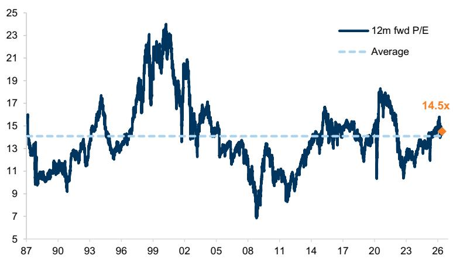

line

| Year | 12m fwd P/E |
|------|-------------|
| 26   | 14.5x       |

Source: Datastream, I/B/E/S, STOXX, GS Global Investment Research

Exhibit 35: Global valuation range   
12m fwd P/E multiple. Data since 2000   
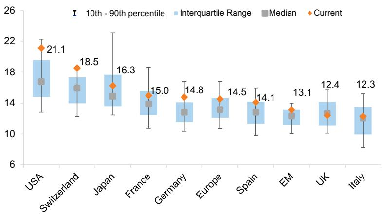

bar

| Country     | 10th - 90th percentile | Interquartile Range (Lower) | Interquartile Range (Upper) | Median | Current |
| ----------- | ------------------------ | ---------------------------- | ---------------------------- | ------ | ------- |
| USA         | 18.5                     | 14.0                         | 21.1                         | 17.0   | 21.1    |
| Switzerland | 18.5                     | 14.0                         | 21.1                         | 17.0   | 18.5    |
| Japan       | 18.5                     | 14.0                         | 21.1                         | 17.0   | 18.5    |
| France      | 18.5                     | 14.0                         | 21.1                         | 17.0   | 18.5    |
| Germany     | 18.5                     | 14.0                         | 21.1                         | 17.0   | 18.5    |
| Europe      | 18.5                     | 14.0                         | 21.1                         | 17.0   | 18.5    |
| Spain       | 18.5                     | 14.0                         | 21.1                         | 17.0   | 18.5    |
| EM          | 18.5                     | 14.0                         | 21.1                         | 17.0   | 18.5    |
| UK          | 18.5                     | 14.0                         | 21.1                         | 17.0   | 18.5    |
| Italy       | 18.5                     | 14.0                         | 21.1                         | 17.0   | 18.5    |

Source: Datastream, Worldscope, GS Global Investment Research

Exhibit 34: European valuation levels and historical percentiles   
Europe STOXX 600. Percentile since 2000 

<table><tr><td></td><td>Metrics</td><td>Current Level</td><td>Historical Percentile*</td><td>Median</td></tr><tr><td rowspan="7">Equity (SXXP)</td><td>NTM EV / Sales</td><td>2.0</td><td>93%</td><td rowspan="7">86%</td></tr><tr><td>NTM EV / EBITDA</td><td>8.8</td><td>86%</td></tr><tr><td>NTM Price / Book</td><td>2.2</td><td>91%</td></tr><tr><td>NTM P/E</td><td>14.5</td><td>71%</td></tr><tr><td>NTM Free cash flow yield</td><td>5.0</td><td>87%</td></tr><tr><td>Cyclically Adjusted P/E</td><td>19.3</td><td>76%</td></tr><tr><td>ERP (%)</td><td>3.9</td><td>76%</td></tr><tr><td rowspan="2">Rates</td><td>Germany 10-y Bond Yield</td><td>2.9%</td><td>42%</td><td rowspan="6">56%</td></tr><tr><td>UK 10-y Bond Yield</td><td>4.8%</td><td>16%</td></tr><tr><td rowspan="4">Credit</td><td>High Yield YTM</td><td>5.8%</td><td>62%</td></tr><tr><td>Investment Grade YTM</td><td>3.5%</td><td>49%</td></tr><tr><td>High Yield spread</td><td>272bp</td><td>65%</td></tr><tr><td>Investment Grade spread</td><td>91bp</td><td>80%</td></tr></table>

\*High percentile = High valuation   
Source: Datastream, FactSet, Haver Analytics, GS Global Investment Research

Exhibit 36: Market implied ERP   
Pan-Europe   
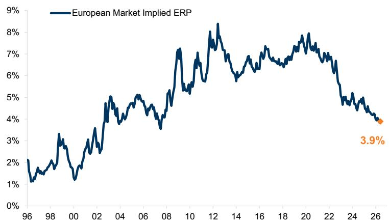

line

| Year | European Market Implied ERP |
| ---- | --------------------------- |
| 2026 | 3.9%                        |

Source: GS Global Investment Research

# Style Performance

Exhibit 37: Europe STOXX 600 and Europe Composite PMI   
Europe STOXX 600 (Y/Y % Chg) and Europe Composite PMI (RHS)   
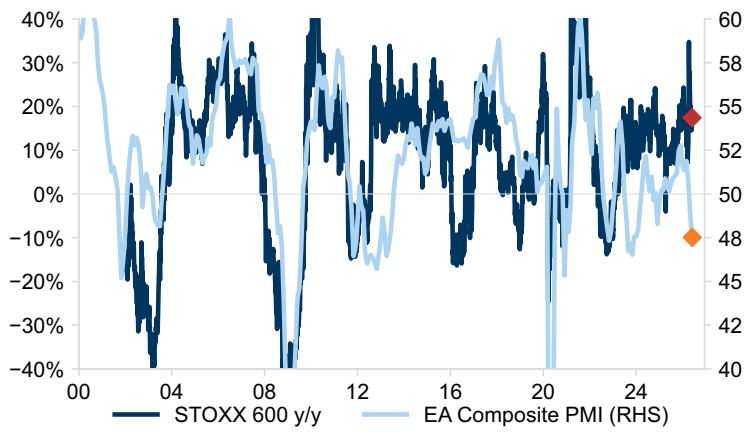

line

| Year | STOXX 600 y/y | EA Composite PMI (RHS) |
|------|---------------|------------------------|
| 25   | 55%           | 48                     |

Source: Bloomberg, Datastream, STOXX, GS Global Investment Research

Exhibit 38: Cyclicals vs. Defensives and Europe Composite PMI   
Europe Cyclicals vs. Defensives (Y/Y % Chg) and Europe Composite PMI (RHS)   
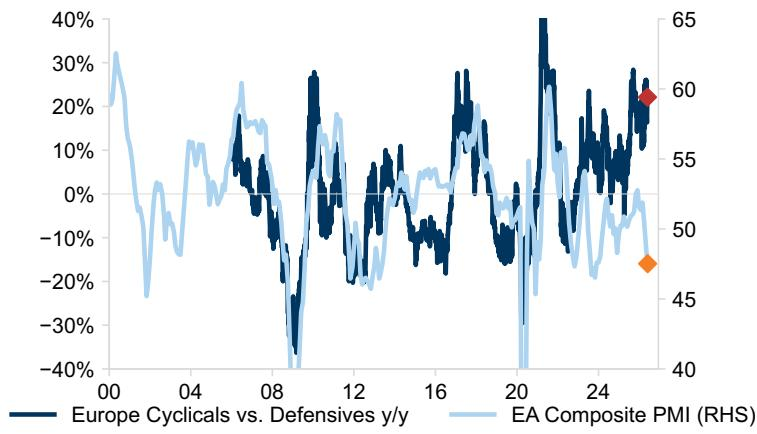

line

| Year | Europe Cyclicals vs. Defensives y/y | EA Composite PMI (RHS) |
|------|-------------------------------------|------------------------|
| 25   | 60%                                 | 47                     |

Source: Bloomberg, Datastream, GS Global Investment Research

Exhibit 39: MSCI Europe Value vs. Growth and US 10y Bond Yield   
MSCI Europe Value vs. Growth (Y/Y % Chg) and US 10y Bond Yield (Y/Y Chg, RHS)   
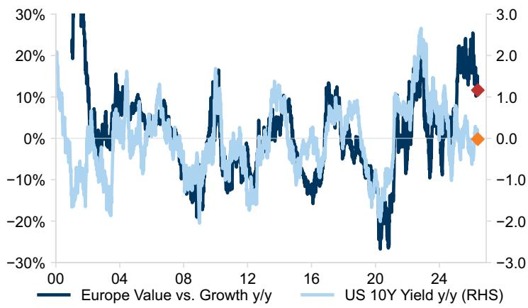

line

| Year | Europe Value vs. Growth y/y | US 10Y Yield y/y (RHS) |
|------|-----------------------------|------------------------|
| 25   | ~25%                        | 1.0                    |

Source: Bloomberg, Datastream, GS Global Investment Research

Exhibit 40: Europe STOXX Small vs. Large and EUR/USD   
Europe STOXX Small vs. Europe STOXX Large (Y/Y % Chg) and EUR/USD (Y/Y % Chg, RHS)   
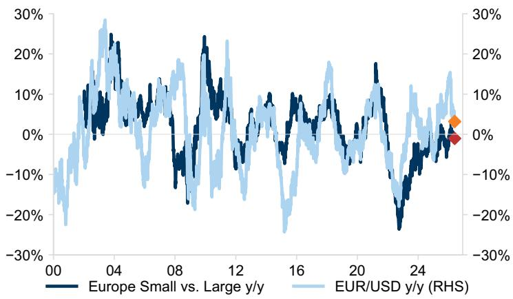

line

| Year | Europe Small vs. Large y/y | EUR/USD y/y (RHS) |
|------|-----------------------------|-------------------|
| 2025 | -5%                         | 5%                |

Source: Bloomberg, Datastream, STOXX, GS Global Investment Research

# Flows from Global Investors into European Funds

Exhibit 41: 1-month rolling flows from Global investors into European equities   
Weekly fund flows (EPFR Country Flows Database)   
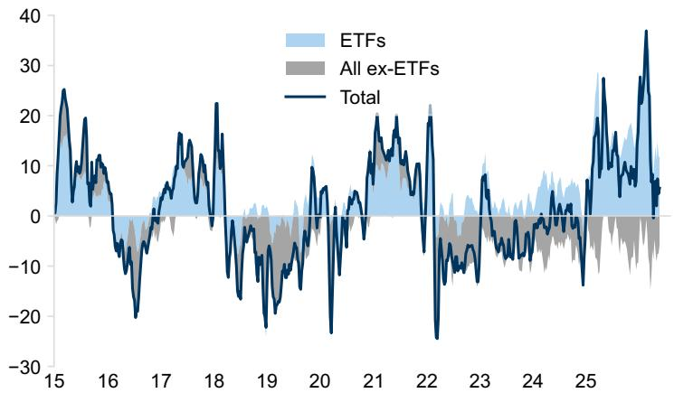

line

| Year | ETFs | All ex-ETFs | Total |
|------|------|-------------|-------|
| 15   | 25   | 10          | 25    |
| 16   | 10   | 5           | 10    |
| 17   | 5    | 0           | 5     |
| 18   | 20   | 5           | 20    |
| 19   | 0    | -5          | 0     |
| 20   | 5    | -10         | 5     |
| 21   | 10   | -5          | 10    |
| 22   | 20   | -10         | 20    |
| 23   | 5    | -5          | 5     |
| 24   | 10   | -10         | 10    |
| 25   | 25   | -5          | 25    |

Source: EPFR, Haver Analytics, GS Global Investment Research

Exhibit 42: Calendarised flows from Global investors into European equities   
Weekly fund flows (EPFR Country Flows Database)   
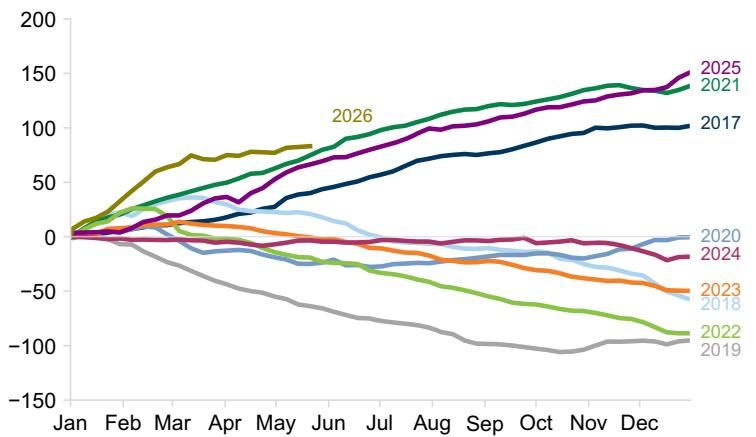

line

| Month | 2017 | 2018 | 2019 | 2020 | 2021 | 2022 | 2023 | 2024 | 2025 |
|-------|------|------|------|------|------|------|------|------|------|
| Jan   | 0    | 0    | 0    | 0    | 0    | 0    | 0    | 0    | 0    |
| Feb   | ~10  | ~5   | ~-10  | ~5   | ~10  | ~5   | ~5   | ~5   | ~10  |
| Mar   | ~30  | ~15  | ~-30  | ~15  | ~30  | ~15  | ~15  | ~15  | ~30  |
| Apr   | ~40  | ~25  | ~-50  | ~25  | ~45  | ~25  | ~25  | ~25  | ~45  |
| May   | ~50  | ~35  | ~-70  | ~35  | ~60  | ~35  | ~35  | ~35  | ~60  |
| Jun   | ~60  | ~45  | ~-90  | ~45  | ~75  | ~45  | ~45  | ~45  | ~75  |
| Jul   | ~70  | ~55  | ~-110 | ~55  | ~90  | ~55  | ~55  | ~55  | ~90  |
| Aug   | ~80  | ~65  | ~-130 | ~65  | ~105 | ~65  | ~65  | ~65  | ~105 |
| Sep   | ~90  | ~75  | ~-140 | ~75  | ~120 | ~75  | ~75  | ~75  | ~120 |
| Oct   | ~100 | ~85  | ~-145 | ~85  | ~135 | ~85  | ~85  | ~85  | ~135 |
| Nov   | ~110 | ~95  | ~-145 | ~95  | ~145 | ~95  | ~95  | ~95  | ~145 |
| Dec   | ~120 | ~100 | ~-145 | ~100 | ~140 | ~100 | ~100 | ~100 | ~140 |
| Jan   | ~130 | ~105 | ~-145 | ~105 | ~135 | ~105 | ~105 | ~105 | ~135 |
| Feb   | ~140 | ~110 | ~-145 | ~110 | ~130 | ~110 | ~110 | ~110 | ~130 |
| Mar   | ~150 | ~115 | ~-145 | ~115 | ~125 | ~115 | ~115 | ~115 | ~125 |
| Apr   | ~160 | ~120 | ~-145 | ~120 | ~120 | ~120 | ~120 | ~120 | ~120 |
| May   | ~170 | ~125 | ~-145 | ~125 | ~115 | ~125 | ~125 | ~125 | ~115 |
| Jun   | ~180 | ~130 | ~-145 | ~130 | ~110 | ~130 | ~130 | ~130 | ~110 |
| Jul   | ~190 | ~135 | >-145| >135 | >105| >135 | >135 | >135 | >105 |
| Aug   | ~200 | >-140| >-145| >140| >100| >-140| >-140| >-140| >-100|
| Sep   | >-200| >-145| >-145| >-40| >95  | >-95 | >-95 | >-95 | >-95 |
| Oct   | >-300| >-145| >-145| >-45| >90  | >-90 | >-90 | >-90 | >-90 |
| Nov   | >-350| >-145| >-145| >-45| >85  | >-85 | >-85 | >-85 | >-85 |
| Dec   | >-350| >-145| >-145| >-45| >85  | >-85 | >-85 | >-85 | >-85 |
The chart includes multiple lines representing different years (e.g., '2026' for '2026') and the same label 'Year' for 'Year' (e.g., '2026'). The y-axis is labeled with scientific notation and mathematical notations.

Source: EPFR, Haver Analytics, GS Global Investment Research

Exhibit 43: Flows into developed Europe equity from Foreign and Domestic Investors   
1-month rolling sum of weekly fund flows (EPFR Country Flows Database)   
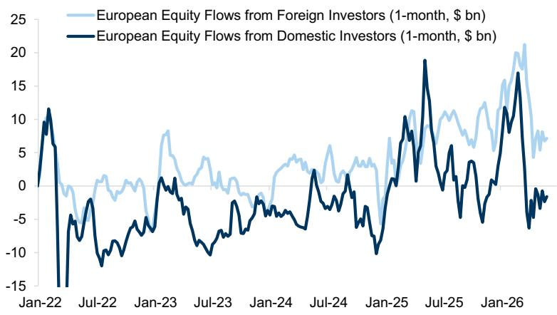

line

| Date   | European Equity Flows from Foreign Investors ($ bn) | European Equity Flows from Domestic Investors ($ bn) |
|--------|------------------------------------------------------|-----------------------------------------------------|
| Jan-22 | 0                                                    | 12                                                  |
| Jul-22 | -5                                                   | -15                                                 |
| Jan-23 | 8                                                    | -10                                                 |
| Jul-23 | 4                                                    | -8                                                  |
| Jan-24 | 6                                                    | -5                                                  |
| Jul-24 | 7                                                    | -3                                                  |
| Jan-25 | 10                                                   | -10                                                 |
| Jul-25 | 12                                                   | 19                                                  |
| Jan-26 | 21                                                   | 17                                                  |

Source: EPFR, GS Global Investment Research

Exhibit 44: Ownership of Euro area equities   

area_stacked

| Category | Percentage (%) |
| :--- | :--- |
| Rest of the World | 15 |
| US | 35 |
| Insurance corporations and pension funds | 3 |
| Households | 13 |
| Monetary financial institutions | 3 |
| Non-financial corporations | 18 |
| Foreign | 50 |
| Domestic | 50 |

Source: ECB, US Treasury, IMF, Haver Analytics, GS Global Investment Research

# Volatility, Skew, Dispersion and Correlations

Exhibit 45: Implied volatility (3-month ATM)   
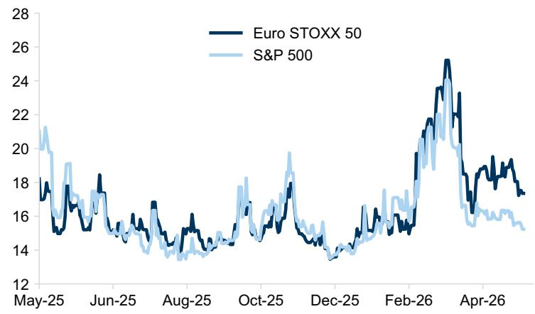

line

| Date   | Euro STOXX 50 | S&P 500 |
|--------|---------------|---------|
| May-25 | 17.5          | 21.0    |
| Jun-25 | 18.0          | 19.0    |
| Aug-25 | 14.5          | 14.0    |
| Oct-25 | 17.0          | 18.0    |
| Dec-25 | 13.5          | 14.0    |
| Feb-26 | 20.0          | 21.0    |
| Apr-26 | 18.0          | 16.0    |

Source: STOXX, GS Global Investment Research

Exhibit 46: Normalised skew (3-month, 25 delta)   
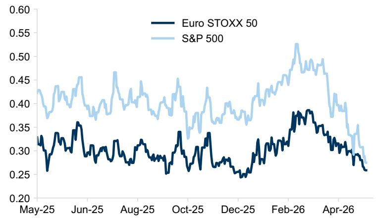

line

| Date   | Euro STOXX 50 | S&P 500 |
|--------|---------------|---------|
| May-25 | 0.33          | 0.43    |
| Jun-25 | 0.36          | 0.46    |
| Aug-25 | 0.31          | 0.44    |
| Oct-25 | 0.34          | 0.45    |
| Dec-25 | 0.28          | 0.37    |
| Feb-26 | 0.39          | 0.53    |
| Apr-26 | 0.26          | 0.35    |

Source: STOXX, GS Global Investment Research   
6-month average of monthly return dispersion

Exhibit 47: STOXX Europe 600 return dispersion

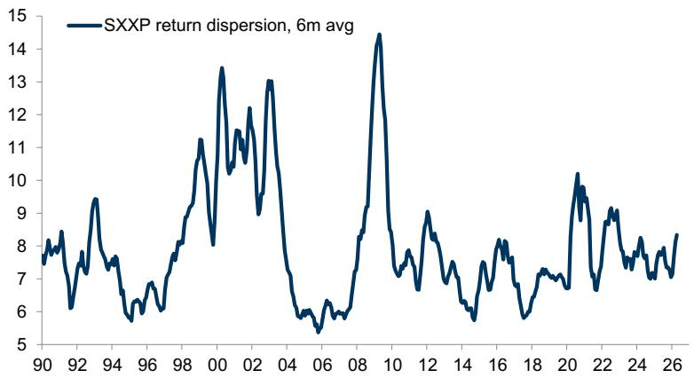

line

| Year | SXXP return dispersion, 6m avg |
| ---- | ------------------------------ |
| 90   | 7.5                            |
| 91   | 7.8                            |
| 92   | 8.0                            |
| 93   | 8.5                            |
| 94   | 9.0                            |
| 95   | 8.5                            |
| 96   | 7.0                            |
| 97   | 6.5                            |
| 98   | 7.5                            |
| 99   | 8.5                            |
| 00   | 11.0                           |
| 01   | 13.0                           |
| 02   | 12.0                           |
| 03   | 13.0                           |
| 04   | 11.0                           |
| 05   | 6.0                            |
| 06   | 5.5                            |
| 07   | 6.0                            |
| 08   | 8.0                            |
| 09   | 14.5                           |
| 10   | 7.0                            |
| 11   | 8.0                            |
| 12   | 9.0                            |
| 13   | 8.5                            |
| 14   | 7.5                            |
| 15   | 7.0                            |
| 16   | 8.0                            |
| 17   | 7.5                            |
| 18   | 6.5                            |
| 19   | 7.0                            |
| 20   | 10.0                           |
| 21   | 9.5                            |
| 22   | 8.5                            |
| 23   | 9.0                            |
| 24   | 8.0                            |
| 25   | 7.5                            |
| 26   | 8.0                            |

Source: Datastream, STOXX, GS Global Investment Research

Exhibit 48: 1-month average pairwise correlation   
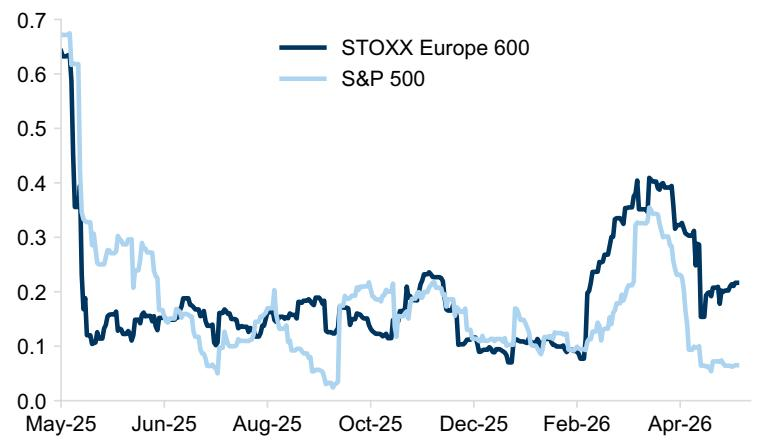

line

| Date   | STOXX Europe 600 | S&P 500 |
|--------|------------------|---------|
| May-25 | 0.65             | 0.68    |
| Jun-25 | 0.15             | 0.30    |
| Aug-25 | 0.18             | 0.15    |
| Oct-25 | 0.20             | 0.22    |
| Dec-25 | 0.12             | 0.15    |
| Feb-26 | 0.35             | 0.30    |
| Apr-26 | 0.40             | 0.35    |

Source: STOXX, GS Global Investment Research

# Europe Indices Sales Exposure

Exhibit 49: Sales exposure across indices 

<table><tr><td>Index</td><td>Region</td><td>Domestic</td><td>Europe</td><td>North America</td><td>Asia - Pacific</td><td>Emerging Markets</td><td>Others</td></tr><tr><td>STOXX Europe 600</td><td>Europe</td><td>-</td><td>42%</td><td>24%</td><td>19%</td><td>15%</td><td>0%</td></tr><tr><td>EuroStoxx 50</td><td>Euro Area</td><td>-</td><td>39%</td><td>21%</td><td>22%</td><td>18%</td><td>0%</td></tr><tr><td>FTSE 100</td><td>UK</td><td>24%</td><td>14%</td><td>28%</td><td>23%</td><td>11%</td><td>0%</td></tr><tr><td>FTSE 250</td><td>UK</td><td>56%</td><td>13%</td><td>14%</td><td>8%</td><td>10%</td><td>0%</td></tr><tr><td>DAX</td><td>Germany</td><td>20%</td><td>25%</td><td>25%</td><td>16%</td><td>14%</td><td>0%</td></tr><tr><td>MDAX</td><td>Germany</td><td>32%</td><td>24%</td><td>17%</td><td>14%</td><td>14%</td><td>0%</td></tr><tr><td>CAC</td><td>France</td><td>16%</td><td>24%</td><td>25%</td><td>19%</td><td>16%</td><td>0%</td></tr><tr><td>SMI</td><td>Switzerland</td><td>6%</td><td>23%</td><td>36%</td><td>19%</td><td>15%</td><td>0%</td></tr><tr><td>MIB</td><td>Italy</td><td>51%</td><td>23%</td><td>8%</td><td>6%</td><td>12%</td><td>0%</td></tr><tr><td>IBEX</td><td>Spain</td><td>32%</td><td>24%</td><td>12%</td><td>5%</td><td>27%</td><td>0%</td></tr><tr><td>AEX</td><td>Netherlands</td><td>9%</td><td>17%</td><td>22%</td><td>38%</td><td>15%</td><td>0%</td></tr><tr><td>MSCI Nordic countries</td><td>Scandinavia</td><td>24%</td><td>22%</td><td>28%</td><td>14%</td><td>13%</td><td>0%</td></tr><tr><td></td><td colspan="2">Sector</td><td>Europe</td><td>North America</td><td>Asia - Pacific</td><td>Emerging Markets</td><td>Others</td></tr><tr><td rowspan="20">STOXX Europe 600</td><td colspan="2"></td><td>42%</td><td>24%</td><td>19%</td><td>15%</td><td>0%</td></tr><tr><td colspan="2">Auto &amp; Parts</td><td>40%</td><td>25%</td><td>19%</td><td>14%</td><td>1%</td></tr><tr><td colspan="2">Banks</td><td>68%</td><td>6%</td><td>10%</td><td>17%</td><td>0%</td></tr><tr><td colspan="2">Basic Resources</td><td>24%</td><td>14%</td><td>47%</td><td>15%</td><td>0%</td></tr><tr><td colspan="2">Chemicals</td><td>31%</td><td>28%</td><td>21%</td><td>20%</td><td>0%</td></tr><tr><td colspan="2">Construction &amp; Mat.</td><td>48%</td><td>27%</td><td>10%</td><td>16%</td><td>0%</td></tr><tr><td colspan="2">Financial Services</td><td>54%</td><td>26%</td><td>9%</td><td>8%</td><td>2%</td></tr><tr><td colspan="2">Food, Bev. &amp; Tobacco</td><td>28%</td><td>30%</td><td>17%</td><td>26%</td><td>0%</td></tr><tr><td colspan="2">Health Care</td><td>24%</td><td>45%</td><td>18%</td><td>13%</td><td>0%</td></tr><tr><td colspan="2">Industrial Gds &amp; Svs</td><td>36%</td><td>28%</td><td>19%</td><td>16%</td><td>0%</td></tr><tr><td colspan="2">Insurance</td><td>57%</td><td>19%</td><td>13%</td><td>11%</td><td>0%</td></tr><tr><td colspan="2">Media</td><td>31%</td><td>48%</td><td>12%</td><td>9%</td><td>0%</td></tr><tr><td colspan="2">Energy</td><td>44%</td><td>18%</td><td>17%</td><td>21%</td><td>0%</td></tr><tr><td colspan="2">Pers. Care, Drug &amp; Groc.</td><td>40%</td><td>22%</td><td>19%</td><td>19%</td><td>0%</td></tr><tr><td colspan="2">Real Estate</td><td>95%</td><td>2%</td><td>0%</td><td>3%</td><td>0%</td></tr><tr><td colspan="2">Retail</td><td>69%</td><td>10%</td><td>8%</td><td>13%</td><td>0%</td></tr><tr><td colspan="2">Technology</td><td>20%</td><td>22%</td><td>48%</td><td>10%</td><td>0%</td></tr><tr><td colspan="2">Telecommunications</td><td>59%</td><td>25%</td><td>5%</td><td>11%</td><td>0%</td></tr><tr><td colspan="2">Travel &amp; Leisure</td><td>62%</td><td>19%</td><td>8%</td><td>11%</td><td>0%</td></tr><tr><td colspan="2">Utilities</td><td>74%</td><td>13%</td><td>1%</td><td>12%</td><td>0%</td></tr></table>

For more details, see our Portfolio Passport   
Source: STOXX, GS Global Investment Research

# European Indices Sector Weights

Exhibit 50: Sector weights 

<table><tr><td>Sector Breakdown</td><td>STOXX 600</td><td>Euro Stoxx 50</td><td>STOXX Small</td><td>STOXX Mid</td><td>STOXX Large</td><td>FTSE 100</td><td>FTSE 250</td><td>DAX</td><td>MDAX</td><td>CAC</td><td>SMI</td><td>MIB</td><td>IBEX</td><td>AEX</td><td>OBX Oslo</td><td>OMX Stockholm</td><td>OMX Copenhagen</td></tr><tr><td>Automobiles and Parts</td><td>1.8</td><td>3.7</td><td>1.7</td><td>2.1</td><td>1.8</td><td>0.0</td><td>0.1</td><td>7.1</td><td>8.8</td><td>2.2</td><td>0.0</td><td>10.0</td><td>0.0</td><td>0.0</td><td>0.0</td><td>0.0</td><td>0.0</td></tr><tr><td>Banks</td><td>13.4</td><td>16.2</td><td>8.8</td><td>5.8</td><td>14.8</td><td>16.9</td><td>2.9</td><td>4.4</td><td>0.0</td><td>8.3</td><td>0.0</td><td>34.0</td><td>42.0</td><td>6.7</td><td>12.8</td><td>11.9</td><td>8.4</td></tr><tr><td>Basic Resources</td><td>3.1</td><td>0.0</td><td>4.6</td><td>3.2</td><td>3.0</td><td>10.4</td><td>2.6</td><td>0.0</td><td>4.2</td><td>1.5</td><td>0.0</td><td>0.0</td><td>6.2</td><td>1.9</td><td>7.7</td><td>2.7</td><td>0.0</td></tr><tr><td>Chemicals</td><td>2.1</td><td>3.5</td><td>3.8</td><td>2.9</td><td>1.9</td><td>0.2</td><td>1.7</td><td>4.9</td><td>7.7</td><td>6.0</td><td>1.4</td><td>0.0</td><td>0.0</td><td>1.1</td><td>4.3</td><td>0.0</td><td>0.0</td></tr><tr><td>Construction and Materials</td><td>3.1</td><td>2.2</td><td>4.8</td><td>4.9</td><td>2.8</td><td>0.0</td><td>4.3</td><td>1.3</td><td>6.3</td><td>6.4</td><td>6.8</td><td>0.0</td><td>5.6</td><td>0.0</td><td>0.9</td><td>4.4</td><td>2.2</td></tr><tr><td>Consumer Products and Services</td><td>5.0</td><td>7.0</td><td>4.7</td><td>4.0</td><td>5.2</td><td>2.5</td><td>2.8</td><td>1.6</td><td>7.5</td><td>16.4</td><td>11.3</td><td>1.5</td><td>0.0</td><td>0.0</td><td>0.0</td><td>0.0</td><td>1.5</td></tr><tr><td>Energy</td><td>6.3</td><td>7.5</td><td>4.4</td><td>5.9</td><td>6.5</td><td>10.9</td><td>2.0</td><td>6.9</td><td>2.9</td><td>8.9</td><td>0.0</td><td>8.2</td><td>3.5</td><td>14.9</td><td>29.3</td><td>0.0</td><td>5.1</td></tr><tr><td>Financial Services</td><td>4.3</td><td>1.0</td><td>11.5</td><td>5.1</td><td>3.7</td><td>5.2</td><td>42.7</td><td>2.5</td><td>2.8</td><td>0.6</td><td>9.4</td><td>3.7</td><td>0.0</td><td>1.2</td><td>0.0</td><td>14.2</td><td>0.0</td></tr><tr><td>Food, Beverage and Tobacco</td><td>5.1</td><td>3.0</td><td>4.0</td><td>5.4</td><td>5.1</td><td>6.5</td><td>3.3</td><td>0.0</td><td>0.0</td><td>2.8</td><td>13.2</td><td>0.7</td><td>0.0</td><td>3.1</td><td>11.9</td><td>0.0</td><td>3.8</td></tr><tr><td>Health Care</td><td>13.2</td><td>4.9</td><td>5.4</td><td>6.2</td><td>2.0</td><td>14.0</td><td>2.2</td><td>7.3</td><td>6.4</td><td>8.1</td><td>37.3</td><td>1.3</td><td>0.9</td><td>1.1</td><td>0.0</td><td>23.9</td><td>53.7</td></tr><tr><td>Industrial Goods and Services</td><td>15.2</td><td>15.9</td><td>16.2</td><td>21.2</td><td>14.3</td><td>10.8</td><td>11.0</td><td>25.5</td><td>20.4</td><td>23.9</td><td>8.9</td><td>11.8</td><td>0.2</td><td>3.3</td><td>14.4</td><td>33.3</td><td>21.1</td></tr><tr><td>Insurance</td><td>5.3</td><td>5.9</td><td>1.9</td><td>6.9</td><td>5.2</td><td>3.5</td><td>0.7</td><td>11.7</td><td>3.4</td><td>3.7</td><td>9.5</td><td>6.6</td><td>0.5</td><td>2.6</td><td>8.2</td><td>0.0</td><td>1.6</td></tr><tr><td>Media</td><td>0.5</td><td>0.0</td><td>1.9</td><td>0.4</td><td>0.4</td><td>0.7</td><td>2.3</td><td>0.0</td><td>3.2</td><td>0.9</td><td>0.0</td><td>0.0</td><td>0.0</td><td>1.5</td><td>0.0</td><td>0.0</td><td>0.0</td></tr><tr><td>Personal Care, Drug and Grocery Stores</td><td>2.1</td><td>0.7</td><td>1.4</td><td>3.1</td><td>2.0</td><td>6.6</td><td>1.2</td><td>0.5</td><td>0.4</td><td>0.5</td><td>0.0</td><td>0.0</td><td>0.0</td><td>9.5</td><td>0.0</td><td>1.4</td><td>0.0</td></tr><tr><td>Real Estate</td><td>1.1</td><td>0.0</td><td>7.5</td><td>4.8</td><td>0.2</td><td>1.1</td><td>7.1</td><td>0.9</td><td>6.5</td><td>0.6</td><td>0.0</td><td>0.0</td><td>1.4</td><td>0.3</td><td>0.0</td><td>0.0</td><td>0.0</td></tr><tr><td>Retail</td><td>0.9</td><td>1.4</td><td>1.8</td><td>1.8</td><td>0.7</td><td>1.0</td><td>3.5</td><td>0.3</td><td>1.4</td><td>0.0</td><td>0.0</td><td>0.0</td><td>7.5</td><td>0.0</td><td>0.0</td><td>0.8</td><td>0.0</td></tr><tr><td>Technology</td><td>9.1</td><td>20.5</td><td>6.8</td><td>2.4</td><td>10.2</td><td>2.2</td><td>3.4</td><td>15.5</td><td>8.6</td><td>3.6</td><td>1.0</td><td>5.6</td><td>3.5</td><td>51.8</td><td>4.1</td><td>1.6</td><td>0.0</td></tr><tr><td>Telecommunications</td><td>3.1</td><td>2.2</td><td>2.5</td><td>2.9</td><td>3.1</td><td>1.6</td><td>1.1</td><td>5.4</td><td>2.9</td><td>1.7</td><td>1.2</td><td>2.0</td><td>5.2</td><td>1.1</td><td>5.6</td><td>5.0</td><td>0.0</td></tr><tr><td>Travel and Leisure</td><td>0.8</td><td>0.0</td><td>2.2</td><td>3.1</td><td>0.4</td><td>1.4</td><td>3.2</td><td>0.0</td><td>6.4</td><td>0.5</td><td>0.0</td><td>0.0</td><td>2.8</td><td>0.0</td><td>0.8</td><td>0.7</td><td>0.0</td></tr><tr><td>Utilities</td><td>4.4</td><td>4.4</td><td>3.5</td><td>8.0</td><td>4.0</td><td>4.7</td><td>2.1</td><td>4.2</td><td>0.0</td><td>3.5</td><td>0.0</td><td>14.4</td><td>20.6</td><td>0.0</td><td>0.0</td><td>0.0</td><td>2.5</td></tr></table>

Source: FactSet, STOXX, GS Global Investment Research

# Sector Correlations

Exhibit 51: Europe sectors: cross-asset correlations   
5y correlation of w/w relative returns 

<table><tr><td rowspan="2"></td><td colspan="3">Equity</td><td colspan="6">Bonds</td><td>FX</td><td colspan="2">Credit</td><td colspan="2">Commodities</td><td colspan="2">Risk</td></tr><tr><td>Global Cyclicals vs. Defensives</td><td>Global Value vs. Growth</td><td>EM vs. DM</td><td>US nominal yield</td><td>US real yield</td><td>Breakeven inflation</td><td>Yield Curve (US 10y-2y)</td><td>German 10y BY</td><td>BTP-Bund spread</td><td>USDEUR</td><td>EUR IG spread</td><td>EUR HY spread</td><td>Brent</td><td>Copper</td><td>VIX</td><td>Risk Appetite Indicator</td></tr><tr><td>Banks</td><td>0.51</td><td>0.43</td><td>0.03</td><td>0.38</td><td>0.24</td><td>0.22</td><td>0.09</td><td>0.36</td><td>-0.23</td><td>-0.13</td><td>-0.32</td><td>-0.28</td><td>0.13</td><td>0.14</td><td>-0.18</td><td>0.41</td></tr><tr><td>Automobiles and Parts</td><td>0.51</td><td>0.12</td><td>0.03</td><td>0.18</td><td>0.03</td><td>0.23</td><td>0.00</td><td>0.15</td><td>-0.22</td><td>-0.19</td><td>-0.35</td><td>-0.39</td><td>0.10</td><td>0.12</td><td>-0.23</td><td>0.36</td></tr><tr><td>Insurance</td><td>0.32</td><td>0.44</td><td>-0.03</td><td>0.15</td><td>-0.01</td><td>0.25</td><td>-0.04</td><td>0.10</td><td>-0.28</td><td>-0.11</td><td>-0.32</td><td>-0.38</td><td>0.12</td><td>0.06</td><td>-0.22</td><td>0.28</td></tr><tr><td>Industrial Goods and Services</td><td>0.46</td><td>-0.16</td><td>-0.20</td><td>-0.08</td><td>-0.23</td><td>0.23</td><td>-0.06</td><td>-0.13</td><td>-0.25</td><td>-0.31</td><td>-0.38</td><td>-0.42</td><td>0.09</td><td>0.22</td><td>-0.27</td><td>0.32</td></tr><tr><td>Basic Resources</td><td>0.39</td><td>0.18</td><td>0.27</td><td>0.10</td><td>-0.08</td><td>0.30</td><td>0.06</td><td>0.10</td><td>-0.08</td><td>-0.16</td><td>-0.14</td><td>-0.16</td><td>0.33</td><td>0.61</td><td>-0.10</td><td>0.23</td></tr><tr><td>Energy</td><td>0.34</td><td>0.43</td><td>0.10</td><td>0.23</td><td>-0.03</td><td>0.42</td><td>0.05</td><td>0.21</td><td>-0.16</td><td>0.07</td><td>-0.11</td><td>-0.19</td><td>0.48</td><td>0.16</td><td>-0.18</td><td>0.26</td></tr><tr><td>Construction and Materials</td><td>0.38</td><td>0.09</td><td>-0.19</td><td>-0.12</td><td>-0.28</td><td>0.24</td><td>-0.01</td><td>-0.14</td><td>-0.29</td><td>-0.26</td><td>-0.33</td><td>-0.40</td><td>0.10</td><td>0.18</td><td>-0.29</td><td>0.28</td></tr><tr><td>Travel and Leisure</td><td>0.44</td><td>0.04</td><td>-0.12</td><td>0.05</td><td>-0.13</td><td>0.27</td><td>-0.03</td><td>-0.03</td><td>-0.25</td><td>-0.23</td><td>-0.41</td><td>-0.47</td><td>0.13</td><td>0.21</td><td>-0.35</td><td>0.42</td></tr><tr><td>Financial Services</td><td>0.32</td><td>-0.19</td><td>-0.16</td><td>-0.18</td><td>-0.30</td><td>0.18</td><td>-0.17</td><td>-0.22</td><td>-0.24</td><td>-0.33</td><td>-0.38</td><td>-0.44</td><td>0.10</td><td>0.21</td><td>-0.35</td><td>0.34</td></tr><tr><td>Consumer Products and Services</td><td>0.21</td><td>-0.27</td><td>0.04</td><td>-0.14</td><td>-0.15</td><td>0.01</td><td>-0.02</td><td>-0.11</td><td>-0.15</td><td>-0.24</td><td>-0.11</td><td>-0.12</td><td>-0.10</td><td>0.18</td><td>-0.11</td><td>0.15</td></tr><tr><td>Technology</td><td>0.30</td><td>-0.65</td><td>-0.06</td><td>-0.18</td><td>-0.20</td><td>0.01</td><td>-0.08</td><td>-0.19</td><td>-0.15</td><td>-0.23</td><td>-0.11</td><td>-0.16</td><td>0.03</td><td>0.19</td><td>-0.20</td><td>0.21</td></tr><tr><td>Chemicals</td><td>-0.12</td><td>0.01</td><td>-0.06</td><td>-0.02</td><td>0.07</td><td>-0.14</td><td>0.12</td><td>0.02</td><td>0.11</td><td>0.05</td><td>0.10</td><td>0.16</td><td>-0.06</td><td>-0.01</td><td>0.16</td><td>-0.16</td></tr><tr><td>Retailers</td><td>0.09</td><td>-0.13</td><td>-0.06</td><td>-0.13</td><td>-0.07</td><td>-0.10</td><td>0.03</td><td>-0.09</td><td>-0.03</td><td>-0.18</td><td>-0.05</td><td>-0.01</td><td>-0.10</td><td>0.03</td><td>-0.03</td><td>0.06</td></tr><tr><td>Media</td><td>-0.08</td><td>-0.06</td><td>-0.18</td><td>0.03</td><td>0.03</td><td>-0.01</td><td>0.03</td><td>-0.10</td><td>0.11</td><td>0.06</td><td>-0.07</td><td>-0.09</td><td>-0.04</td><td>-0.14</td><td>0.00</td><td>-0.07</td></tr><tr><td>Real Estate</td><td>-0.01</td><td>-0.01</td><td>-0.10</td><td>-0.44</td><td>-0.44</td><td>-0.01</td><td>-0.15</td><td>-0.45</td><td>-0.17</td><td>-0.27</td><td>-0.18</td><td>-0.18</td><td>-0.01</td><td>0.09</td><td>-0.05</td><td>-0.10</td></tr><tr><td>Telecommunications</td><td>-0.38</td><td>0.20</td><td>0.01</td><td>0.02</td><td>0.15</td><td>-0.20</td><td>0.11</td><td>0.05</td><td>0.07</td><td>0.28</td><td>0.37</td><td>0.41</td><td>-0.11</td><td>-0.31</td><td>0.22</td><td>-0.28</td></tr><tr><td>Utilities</td><td>-0.48</td><td>0.11</td><td>-0.11</td><td>-0.25</td><td>-0.15</td><td>-0.16</td><td>0.00</td><td>-0.25</td><td>0.04</td><td>0.01</td><td>0.16</td><td>0.20</td><td>-0.19</td><td>-0.19</td><td>0.18</td><td>-0.38</td></tr><tr><td>Personal Care, Drug and Grocery Stores</td><td>-0.64</td><td>-0.07</td><td>0.10</td><td>-0.08</td><td>0.18</td><td>-0.41</td><td>0.06</td><td>-0.04</td><td>0.38</td><td>0.29</td><td>0.49</td><td>0.54</td><td>-0.37</td><td>-0.41</td><td>0.45</td><td>-0.56</td></tr><tr><td>Food, Beverage and Tobacco</td><td>-0.67</td><td>0.04</td><td>0.09</td><td>-0.06</td><td>0.17</td><td>-0.36</td><td>0.06</td><td>-0.04</td><td>0.38</td><td>0.34</td><td>0.45</td><td>0.49</td><td>-0.26</td><td>-0.37</td><td>0.42</td><td>-0.56</td></tr><tr><td>Health Care</td><td>-0.74</td><td>-0.15</td><td>0.03</td><td>-0.13</td><td>0.11</td><td>-0.37</td><td>-0.03</td><td>-0.08</td><td>0.39</td><td>0.33</td><td>0.47</td><td>0.50</td><td>-0.26</td><td>-0.35</td><td>0.33</td><td>-0.49</td></tr></table>

Source: Bloomberg, GS Global Investment Research

# Economics

Exhibit 52: Real GDP forecasts 

<table><tr><td colspan="6">Real GDP Growth</td></tr><tr><td rowspan="2">Percent Change yoy</td><td>2025</td><td colspan="2">2026</td><td colspan="2">2027</td></tr><tr><td>GS</td><td>GS</td><td>Cons*</td><td>GS</td><td>Cons*</td></tr><tr><td>USA</td><td>2.1</td><td>2.1</td><td>2.1</td><td>2.1</td><td>2.0</td></tr><tr><td>Japan</td><td>1.1</td><td>0.5</td><td>0.6</td><td>1.0</td><td>0.8</td></tr><tr><td>Euro area</td><td>1.5</td><td>0.7</td><td>0.8</td><td>0.9</td><td>1.3</td></tr><tr><td>Germany</td><td>0.3</td><td>0.7</td><td>0.6</td><td>1.0</td><td>1.2</td></tr><tr><td>France</td><td>0.9</td><td>0.6</td><td>0.7</td><td>0.6</td><td>0.9</td></tr><tr><td>Italy</td><td>0.7</td><td>0.5</td><td>0.5</td><td>0.5</td><td>0.7</td></tr><tr><td>Spain</td><td>2.8</td><td>2.1</td><td>2.2</td><td>1.5</td><td>1.8</td></tr><tr><td>UK</td><td>1.4</td><td>1.2</td><td>0.8</td><td>1.3</td><td>1.1</td></tr><tr><td>China</td><td>5.0</td><td>4.7</td><td>4.6</td><td>4.7</td><td>4.4</td></tr><tr><td>Developed Markets</td><td>1.8</td><td>1.5</td><td>1.9</td><td>1.7</td><td>1.5</td></tr><tr><td>Emerging Markets</td><td>4.2</td><td>3.7</td><td>4.0</td><td>4.0</td><td>3.9</td></tr><tr><td>World</td><td>2.8</td><td>2.4</td><td>2.8</td><td>2.7</td><td>2.6</td></tr></table>

\* Bloomberg country and GS aggregate consensus   
Source: Consensus Economics, Bloomberg, GS Global Investment Research

Exhibit 54: Macro-data Assessment Platform (MAP)   
Economic surprise. GS Proprietary Index   
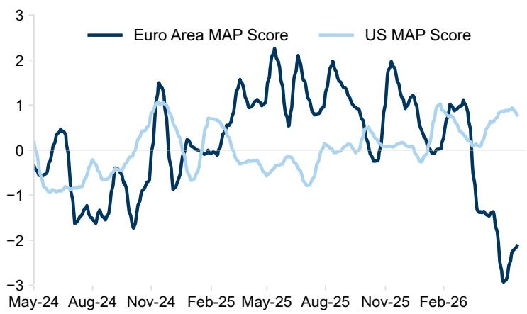

line

| Date    | Euro Area MAP Score | US MAP Score |
|---------|---------------------|--------------|
| May-24  | -0.5                | 0.1          |
| Aug-24  | -1.8                | -0.7         |
| Nov-24  | 1.5                 | 1.0          |
| Feb-25  | 0.2                 | 0.6          |
| May-25  | 2.3                 | -0.2         |
| Aug-25  | 1.9                 | 0.1          |
| Nov-25  | 2.0                 | 0.3          |
| Feb-26  | -1.5                | 0.8          |
| Apr-26  | -3.0                | 1.0          |

Source: GS Global Investment Research

Exhibit 53: Current Activity Index (CAI)   
GS Proprietary Index   
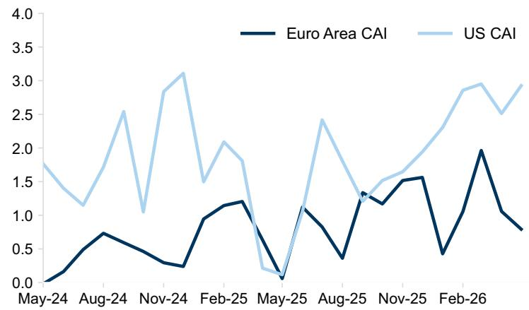

line

| Date    | Euro Area CAI | US CAI |
|---------|---------------|--------|
| May-24  | 0.0           | 1.8    |
| Aug-24  | 0.7           | 1.2    |
| Nov-24  | 0.3           | 3.1    |
| Feb-25  | 1.2           | 2.1    |
| May-25  | 0.1           | 0.1    |
| Aug-25  | 1.3           | 2.5    |
| Nov-25  | 1.6           | 1.7    |
| Feb-26  | 2.0           | 3.0    |

Source: GS Global Investment Research

Exhibit 55: GS Financial Conditions Index (GSFCI)   
GS Proprietary Index   
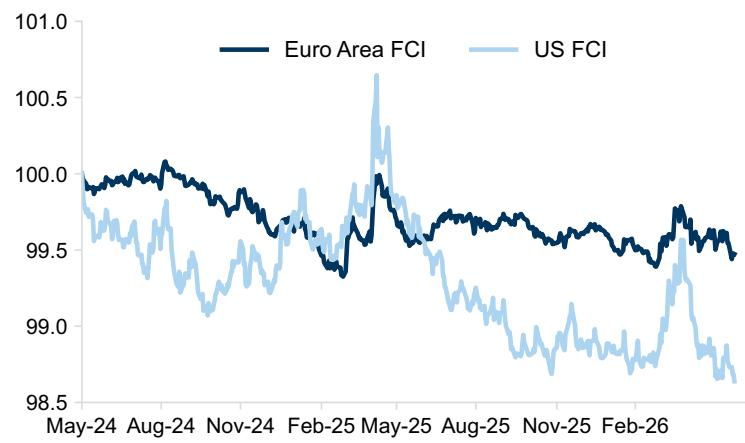

line

| Date    | Euro Area FCI | US FCI |
|---------|---------------|--------|
| May-24  | ~100.0        | ~99.8  |
| Aug-24  | ~100.0        | ~99.7  |
| Nov-24  | ~99.8         | ~99.5  |
| Feb-25  | ~99.5         | ~99.3  |
| May-25  | ~100.0        | ~100.7 |
| Aug-25  | ~99.8         | ~99.5  |
| Nov-25  | ~99.7         | ~99.2  |
| Feb-26  | ~99.5         | ~98.8  |

Source: GS Global Investment Research

# Appendix

Exhibit 56: We roll forward and upgrade our long-term price targets for STOXX 600   
STOXX 600 price forecast 

<table><tr><td></td><td>New</td><td>Old</td></tr><tr><td>2026</td><td>650</td><td>625</td></tr><tr><td>2027</td><td>670</td><td>650</td></tr><tr><td>2028</td><td>690</td><td>670</td></tr><tr><td>2029</td><td>710</td><td>690</td></tr><tr><td>2030</td><td>730</td><td>710</td></tr><tr><td>2031</td><td>750</td><td>730</td></tr><tr><td>2032</td><td>775</td><td>760</td></tr><tr><td>2033</td><td>800</td><td>790</td></tr><tr><td>2034</td><td>825</td><td>825</td></tr><tr><td>2035</td><td>855</td><td>855</td></tr></table>

Source: GS Global Investment Research

# Disclosure Appendix

# Reg AC

We, Guillaume Jaisson, Peter Oppenheimer, Sharon Bell and Giovanni Ferrannini, hereby certify that all of the views expressed in this report accurately reflect our personal views, which have not been influenced by considerations of the firm's business or client relationships.

Unless otherwise stated, the individuals listed on the cover page of this report are analysts in GS' Global Investment Research division.

Contributing Authors: Guillaume Jaisson GS International, Peter Oppenheimer GS International, Sharon Bell GS International, Giovanni Ferrannini GS International.

Unless otherwise stated, the individuals listed in the Contributing Authors disclosure of this report are analysts in GS' Global Investment Research division.

# Disclosures

# MSCI disclosure

All MSCI data used in this report is the exclusive property of MSCI, Inc. (MSCI). Without prior written permission of MSCI, this information and any other MSCI intellectual property may not be reproduced or redisseminated in any form and may not be used to create any financial instruments or products or any indices. This information is provided on an “as is” basis, and the user of this information assumes the entire risk of any use made of this information. Neither MSCI, any of its affiliates nor any third party involved in, or related to, computing or compiling the data makes any express or implied warranties or representations with respect to this information (or the results to be obtained by the use thereof), and MSCI, its affiliates and any such third party hereby expressly disclaim all warranties of originality, accuracy, completeness, merchantability or fitness for a particular purpose with respect to any of this information. Without limiting any of the foregoing, in no event shall MSCI, any of its affiliates or any third party involved in, or related to, computing or compiling the data have any liability for any direct, indirect, special, punitive, consequential or any other damages (including lost profits) even if notified of the possibility of such damages. MSCI and the MSCI indexes are service marks of MSCI and its affiliates. The Global Industry Classification Standard (GICS) were developed by and is the exclusive property of MSCI and Standard & Poor’s. GICS is a service mark of MSCI and S&P and has been licensed for use by The GS Group.

# Equity basket disclosure

The ability to trade the basket(s) discussed in this research will depend upon market conditions, including liquidity and borrow constraints at the time of trade.

# Marquee disclosure

Marquee is a product of GS FICC and Equities. Any Marquee content linked in this report is not necessarily representative of GS Research views. If you need access to Marquee, please contact your GS salesperson or email the Marquee team at gs-marquee-sales@gs.com.

# Regulatory disclosures

# Disclosures required by United States laws and regulations

See company-specific regulatory disclosures above for any of the following disclosures required as to companies referred to in this report: manager or co-manager in a pending transaction; 1% or other ownership; compensation for certain services; types of client relationships; managed/co-managed public offerings in prior periods; directorships; for equity securities, market making and/or specialist role. GS trades or may trade as a principal in debt securities (or in related derivatives) of issuers discussed in this report.

The following are additional required disclosures: Ownership and material conflicts of interest: GS policy prohibits its analysts, professionals reporting to analysts and members of their households from owning securities of any company in the analyst's area of coverage. Analyst compensation: Analysts are paid in part based on the profitability of GS, which includes investment banking revenues. Analyst as officer or director: GS policy generally prohibits its analysts, persons reporting to analysts or members of their households from serving as an officer, director or advisor of any company in the analyst's area of coverage. Non-U.S. Analysts: Non-U.S. analysts may not be associated persons of GS & Co. LLC and therefore may not be subject to FINRA Rule 2241 or FINRA Rule 2242 restrictions on communications with a subject company, public appearances and trading in securities covered by the analysts.

# Additional disclosures required under the laws and regulations of jurisdictions other than the United States

The following disclosures are those required by the jurisdiction indicated, except to the extent already made above pursuant to United States laws and regulations. Australia: GS Australia Pty Ltd and its affiliates are not authorised deposit-taking institutions (as that term is defined in the Banking Act 1959 (Cth)) in Australia and do not provide banking services, nor carry on a banking business, in Australia. This research, and any access to it, is intended only for “wholesale clients” within the meaning of the Australian Corporations Act, unless otherwise agreed by GS. In producing research reports, members of Global Investment Research of GS Australia may attend site visits and other meetings hosted by the companies and other entities which are the subject of its research reports. In some instances the costs of such site visits or meetings may be met in part or in whole by the issuers concerned if GS Australia considers it is appropriate and reasonable in the specific circumstances relating to the site visit or meeting. To the extent that the contents of this document contains any financial product advice, it is general advice only and has been prepared by GS without taking into account a client’s objectives, financial situation or needs. A client should, before acting on any such advice, consider the appropriateness of the advice having regard to the client’s own objectives, financial situation and needs. A copy of certain GS Australia and New Zealand disclosure of interests and a copy of GS’ Australian Sell-Side Research Independence Policy Statement are available at: https://www.goldmansachs.com/disclosures/australia-new-zealand/index.html. Brazil: Disclosure information in relation to CVM Resolution n. 20 is available at https://www.gs.com/worldwide/brazil/area/gir/index.html. Where applicable, the Brazil-registered analyst primarily responsible for the content of this research report, as defined in Article 20 of CVM Resolution n. 20, is the first author named at the beginning of this report, unless indicated otherwise at the end of the text. Canada: This information is being provided to you for information purposes only and is not, and under no circumstances should be construed as, an advertisement, offering or solicitation by GS & Co. LLC for purchasers of securities in Canada to trade in any Canadian security. GS & Co. LLC is not registered as a dealer in any jurisdiction in Canada under applicable Canadian securities laws and generally is not permitted to trade in Canadian securities and may be prohibited from selling certain securities and products in certain jurisdictions in Canada. If you wish to trade in any Canadian securities or other products in Canada please contact GS Canada Inc., an affiliate of The GS Group Inc., or another registered Canadian dealer. Hong Kong: Further information on the securities of covered companies referred to in this research may be obtained on request from GS (Asia) L.L.C. India: Further information on the subject company or companies referred to in this research may be obtained from GS (India) Securities Private Limited, Research Analyst - SEBI Registration Number INH000001493, 10th Floor, Ascent-Worli, Sudam Kalu Ahire Marg, Worli, Mumbai-400 025, India, Corporate Identity Number U74140MH2006FTC160634, Phone +91 22 6616 9000, Fax +91 22 6616 9001. GS may beneficially own 1% or more of the securities (as such term is defined in clause 2 (h) the Indian Securities Contracts (Regulation) Act, 1956) of the subject company or companies referred to in this research report. Investment in securities market are subject to market risks. Read all the related documents carefully before investing. Registration granted by SEBI and certification from NISM in no way guarantee performance of the intermediary or provide any assurance of returns to investors. GS (India) Securities Private Limited compliance officer and investor grievance contact details can be found at:

https://www.goldmansachs.com/worldwide/india/documents/Grievance-Redressal-and-Escalation-Matrix.pdf, and a copy of the annual audit compliance report can be found at this link: https://publishing.gs.com/content/site/india-annual-compliance-report.html. Japan: See below. Korea: This research, and any access to it, is intended only for “professional investors” within the meaning of the Financial Services and Capital Markets Act, unless otherwise agreed by GS. Further information on the subject company or companies referred to in this research may be obtained from GS (Asia) L.L.C., Seoul Branch. New Zealand: GS New Zealand Limited and its affiliates are neither “registered banks” nor “deposit takers” (as defined in the Reserve Bank of New Zealand Act 1989) in New Zealand. This research, and any access to it, is intended for “wholesale clients” (as defined in the Financial Advisers Act 2008) unless otherwise agreed by GS. A copy of certain GS Australia and New Zealand disclosure of interests is available at: https://www.goldmansachs.com/disclosures/australia-new-zealand/index.html. Russia: Research reports distributed in the Russian Federation are not advertising as defined in the Russian legislation, but are information and analysis not having product promotion as their main purpose and do not provide appraisal within the meaning of the Russian legislation on appraisal activity. Research reports do not constitute a personalized investment recommendation as defined in Russian laws and regulations, are not addressed to a specific client, and are prepared without analyzing the financial circumstances, investment profiles or risk profiles of clients. GS assumes no responsibility for any investment decisions that may be taken by a client or any other person based on this research report. Singapore: GS (Singapore) Pte. (Company Number: 198602165W), which is regulated by the Monetary Authority of Singapore, accepts legal responsibility for this research, and should be contacted with respect to any matters arising from, or in connection with, this research. Taiwan: This material is for reference only and must not be reprinted without permission. Investors should carefully consider their own investment risk. Investment results are the responsibility of the individual investor. United Kingdom: Persons who would be categorized as retail clients in the United Kingdom, as such term is defined in the rules of the Financial Conduct Authority, should read this research in conjunction with prior GS on the covered companies referred to herein and should refer to the risk warnings that have been sent to them by GS International. A copy of these risks warnings, and a glossary of certain financial terms used in this report, are available from GS International on request.

European Union and United Kingdom: Disclosure information in relation to Article 6 (2) of the European Commission Delegated Regulation (EU) (2016/958) supplementing Regulation (EU) No 596/2014 of the European Parliament and of the Council (including as that Delegated Regulation is implemented into United Kingdom domestic law and regulation following the United Kingdom's departure from the European Union and the European Economic Area) with regard to regulatory technical standards for the technical arrangements for objective presentation of investment recommendations or other information recommending or suggesting an investment strategy and for disclosure of particular interests or indications of conflicts of interest is available at https://www.gs.com/disclosures/europeanpolicy.html which states the European Policy for Managing Conflicts of Interest in Connection with Investment Research.

Japan: GS Japan Co., Ltd. is a Financial Instrument Dealer registered with the Kanto Financial Bureau under registration number Kinsho 69, and a member of Japan Securities Dealers Association, Financial Futures Association of Japan Type II Financial Instruments Firms Association, and Investment Management Association of Japan. Sales and purchase of equities are subject to commission pre-determined with clients plus consumption tax. See company-specific disclosures as to any applicable disclosures required by Japanese stock exchanges, the Japanese Securities Dealers Association or the Japanese Securities Finance Company.

# Global product; distributing entities

GS Global Investment Research produces and distributes research products for clients of GS on a global basis. Analysts based in GS offices around the world produce research on industries and companies, and research on macroeconomics, currencies, commodities and portfolio strategy. This research is disseminated in Australia by GS Australia Pty Ltd (ABN 21 006 797 897); in Brazil by GS do Brasil Corretora de Títulos e Valores Mobiliários S.A.; Public Communication Channel GS Brazil: 0800 727 5764 and / or contatogoldmanbrasil@gs.com. Available Weekdays (except holidays), from 9am to 6pm. Canal de Comunicação com o Público GS Brasil: 0800 727 5764 e/ou contatogoldmanbrasil@gs.com. Horário de funcionamento: segunda-feira à sexta-feira (exceto feriados), das 9h às 18h; in Canada by GS & Co. LLC; in Hong Kong by GS (Asia) L.L.C.; in India by GS (India) Securities Private Ltd.; in Japan by GS Japan Co., Ltd.; in the Republic of Korea by GS (Asia) L.L.C., Seoul Branch; in New Zealand by GS New Zealand Limited; in Russia by OOO GS; in Singapore by GS (Singapore) Pte. (Company Number: 198602165W); and in the United States of America by GS & Co. LLC. GS International has approved this research in connection with its distribution in the United Kingdom.

GS International (“GSI”), authorised by the Prudential Regulation Authority (“PRA”) and regulated by the Financial Conduct Authority (“FCA”) and the PRA, has approved this research in connection with its distribution in the United Kingdom.

European Economic Area: GS Bank Europe SE (“GSBE”) is a credit institution incorporated in Germany and, within the Single Supervisory Mechanism, subject to direct prudential supervision by the European Central Bank and in other respects supervised by German Federal Financial Supervisory Authority (Bundesanstalt für Finanzdienstleistungsaufsicht, BaFin) and Deutsche Bundesbank and disseminates research within the European Economic Area.

# General disclosures

This research is for our clients only. Other than disclosures relating to GS, this research is based on current public information that we consider reliable, but we do not represent it is accurate or complete, and it should not be relied on as such. The information, opinions, estimates and forecasts contained herein are as of the date hereof and are subject to change without prior notification. We seek to update our research as appropriate, but various regulations may prevent us from doing so. Other than certain industry reports published on a periodic basis, the large majority of reports are published at

irregular intervals as appropriate in the analyst's judgment.

GS conducts a global full-service, integrated investment banking, investment management, and brokerage business. We have investment banking and other business relationships with a substantial percentage of the companies covered by Global Investment Research. GS & Co. LLC, the United States broker dealer, is a member of SIPC (https://www.sipc.org).

Our salespeople, traders, and other professionals may provide oral or written market commentary or trading strategies to our clients and principal trading desks that reflect opinions that are contrary to the opinions expressed in this research. Our asset management area, principal trading desks and investing businesses may make investment decisions that are inconsistent with the recommendations or views expressed in this research.

We and our affiliates, officers, directors, and employees will from time to time have long or short positions in, act as principal in, and buy or sell, the securities or derivatives, if any, referred to in this research, unless otherwise prohibited by regulation or GS policy.

The views attributed to third party presenters at GS arranged conferences, including individuals from other parts of GS, do not necessarily reflect those of Global Investment Research and are not an official view of GS.

Any third party referenced herein, including any salespeople, traders and other professionals or members of their household, may have positions in the products mentioned that are inconsistent with the views expressed by analysts named in this report.

This research is focused on investment themes across markets, industries and sectors. It does not attempt to distinguish between the prospects or performance of, or provide analysis of, individual companies within any industry or sector we describe.

Any trading recommendation in this research relating to an equity or credit security or securities within an industry or sector is reflective of the investment theme being discussed and is not a recommendation of any such security in isolation.

This research is not an offer to sell or the solicitation of an offer to buy any security in any jurisdiction where such an offer or solicitation would be illegal. It does not constitute a personal recommendation or take into account the particular investment objectives, financial situations, or needs of individual clients. Clients should consider whether any advice or recommendation in this research is suitable for their particular circumstances and, if appropriate, seek professional advice, including tax advice. The price and value of investments referred to in this research and the income from them may fluctuate. Past performance is not a guide to future performance, future returns are not guaranteed, and a loss of original capital may occur. Fluctuations in exchange rates could have adverse effects on the value or price of, or income derived from, certain investments.

Certain transactions, including those involving futures, options, and other derivatives, give rise to substantial risk and are not suitable for all investors. Investors should review current options and futures disclosure documents which are available from GS sales representatives or at https://www.theocc.com/about/publications/character-risks.jsp and https://www.goldmansachs.com/disclosures/cftc\_fcm\_disclosures. Transaction costs may be significant in option strategies calling for multiple purchase and sales of options such as spreads. Supporting documentation will be supplied upon request.

Differing Levels of Service provided by Global Investment Research: The level and types of services provided to you by GS Global Investment Research may vary as compared to that provided to internal and other external clients of GS, depending on various factors including your individual preferences as to the frequency and manner of receiving communication, your risk profile and investment focus and perspective (e.g., marketwide, sector specific, long term, short term), the size and scope of your overall client relationship with GS, and legal and regulatory constraints. As an example, certain clients may request to receive notifications when research on specific securities is published, and certain clients may request that specific data underlying analysts' fundamental analysis available on our internal client websites be delivered to them electronically through data feeds or otherwise. No change to an analyst's fundamental research views (e.g., ratings, price targets, or material changes to earnings estimates for equity securities), will be communicated to any client prior to inclusion of such information in a research report broadly disseminated through electronic publication to our internal client websites or through other means, as necessary, to all clients who are entitled to receive such reports.

All research reports are disseminated and available to all clients simultaneously through electronic publication to our internal client websites. Not all research content is redistributed to our clients or available to third-party aggregators, nor is GS responsible for the redistribution of our research by third party aggregators. For research, models or other data related to one or more securities, markets or asset classes (including related services) that may be available to you, please contact your GS representative or go to https://research.gs.com.

Disclosure information is also available at https://www.gs.com/research/hedge.html or from Research Compliance, 200 West Street, New York, NY 10282.

# © 2026 GS.

You are permitted to store, display, analyze, modify, reformat, and print the information made available to you via this service only for your own use. You may not resell or reverse engineer this information to calculate or develop any index for disclosure and/or marketing or create any other derivative works or commercial product(s), data or offering(s) without the express written consent of GS. You are not permitted to publish, transmit, or otherwise reproduce this information, in whole or in part, in any format to any third party without the express written consent of GS. This foregoing restriction includes, without limitation, using, extracting, downloading or retrieving this information, in whole or in part, to train or finetune a machine learning or artificial intelligence system, or to provide or reproduce this information, in whole or in part, as a prompt or input to any such system.