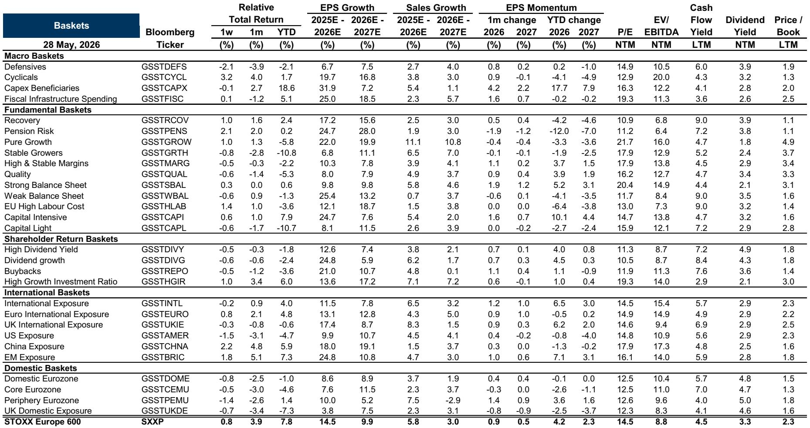
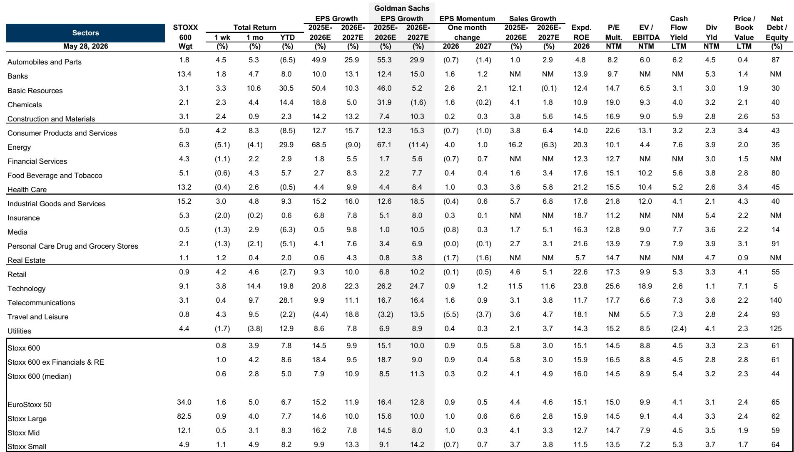

# Europe’s M&A Paradox: A Global Boom That Leaves Domestic Buyers on the Sidelines

The global mergers and acquisitions market is accelerating at a pace not seen in years, with aggregate deal volumes forecast to grow by approximately 18% over the next twelve months. Yet beneath this headline strength lies a striking divergence: Europe is being left behind. While mega-deals dominate the global recovery and cross-border acquirers increasingly target European assets at attractive valuations, domestic European corporates remain conspicuously absent from the deal table. This is not simply a cyclical lag. It reflects a structural shift in capital allocation priorities, risk appetite, and strategic focus that has profound implications for investors.

The controlling insight is this: the M&A recovery is real, but its benefits are not evenly distributed. The most compelling opportunities in Europe today are not in the broad market indices, but in a narrow set of names that the market is systematically undervaluing. The report we examine identifies a basket of European M&A targets trading at a material discount to the broader market, alongside small-cap stocks at near-record valuation dislocations. For investors willing to look past the aggregate caution, there is a coherent strategy to capture the next phase of the cycle.

The stakes are high. European equities have delivered year-to-date performance driven entirely by earnings growth, with multiples actually contracting. Meanwhile, sectors that would benefit most from a sustained M&A upcycle—investment banking, holdings companies, and alternative asset managers—have underperformed significantly. The market is pricing in persistent scepticism. The question is whether that scepticism is justified, or whether it creates the very conditions for a contrarian opportunity.

## The Global M&A Engine Is Running, But Europe Is Not in the Driver’s Seat

The recovery in global M&A is unambiguous. The twelve-month rolling sum of deal value has rebounded sharply, driven disproportionately by mega-deals that have pushed aggregate transaction volumes higher even as deal counts remain below prior peaks. This pattern is characteristic of a recovery led by large strategic transactions rather than broad-based corporate appetite. The structural supply is there: portfolio simplification is accelerating, with a record share of UK CFOs now citing asset disposals as a top priority. Private equity faces mounting pressure to return capital to limited partners, and with the IPO market outside the United States remaining fragile, M&A exits are the primary channel.

Europe, however, is not participating proportionally. The region’s share of global M&A has declined to less than one-third of total activity, whether measured by acquirer, target, or both. This is not a function of weak balance sheets—European corporate leverage remains below historical averages. It is a function of weak domestic risk appetite. European corporates are not buying. Survey data shows the share of CFOs prioritising expansion via acquisitions is near cycle lows. The focus has shifted to cost discipline, cash preservation, and operational efficiency.

The result is a market where foreign buyers are stepping in where locals will not. Cross-border flows now dominate European M&A activity, with international acquirers targeting European assets to capture valuation discounts and access specific factor exposures that are less available in the US market. This dynamic creates a two-tier market: one where global capital sees opportunity, and another where domestic capital sees risk.

## Why European Corporates Are Staying on the Sidelines, and What That Means for the Cycle

The reluctance of European corporates to engage in M&A is not a temporary mood swing. It reflects a deeper reassessment of strategic priorities that has been building for several years. The post-pandemic environment, combined with geopolitical uncertainty, elevated interest rates, and the disruptive force of artificial intelligence, has pushed management teams toward defence rather than offence. Capital allocation is being redirected toward internal investment, particularly in AI-related capex, and toward shareholder returns through dividends and buybacks.

This is visible in the equity market as well. European equity flows show that international inflows have only partially offset persistent domestic outflows. The same caution that keeps corporate balance sheets on the sidelines also keeps domestic institutional investors underweight risk assets. The IPO market remains depressed, take-private activity has moderated, and sponsor activity, while recovering, is largely driven by exits rather than new deployment.

The strategic implication is clear: the M&A cycle in Europe will not be driven by domestic corporates rediscovering their appetite for deals. It will be driven by foreign acquirers, by private equity forced to exit, and by the slow but inevitable consolidation of fragmented industries. This is a different kind of cycle—one where the sellers are motivated and the buyers are selective, and where the most attractive targets are those that are overlooked by the local market.

## The M&A Target Basket Is Trading at a Discount That Reflects Scepticism, Not Fundamentals

The report constructs a European M&A target basket comprising stocks with at least a 15% probability of acquisition. This basket trades at a material discount to the broader STOXX 600 index. The discount is not a function of poor fundamentals. It reflects the market’s scepticism that the M&A cycle will broaden beyond mega-deals. Investors are pricing in the status quo: continued caution, continued dominance of large transactions, and continued absence of domestic buyers.

This creates a disconnect. The structural conditions for a broadening of M&A activity are in place. Portfolio simplification is accelerating. Private equity needs exits. Valuation dispersion is extreme, particularly in the small- and mid-cap segment. STOXX Small Caps trade at 13.5 times forward price-to-earnings, at one of the deepest discounts to large caps on record. Historically, such dislocations have preceded waves of mid-market deal activity.

The basket is therefore not a bet on a specific deal. It is a bet on a regime shift: a bet that the conditions for a broader M&A cycle will eventually overcome the inertia of corporate caution. The discount at which the basket trades is the market’s expression of doubt. The opportunity lies in whether that doubt is excessive.

## Small Caps Are the Most Compelling M&A Targets, But They Require a Catalyst That Has Not Yet Arrived

The valuation dislocation in European small caps is one of the most striking features of the current market. The discount of small caps to large caps is near historical extremes. This is not simply a function of sector composition or earnings weakness. It reflects a structural rotation away from segments of the market that are perceived as riskier, less liquid, and more exposed to domestic economic headwinds.

From an M&A perspective, however, this dislocation is precisely what makes small caps attractive targets. Strategic acquirers and private equity buyers can acquire growth and market position at valuations that are deeply discounted relative to larger peers. The strategic fit is often compelling: smaller companies in fragmented industries offer consolidation opportunities, niche technology exposure, or access to customer bases that are difficult to replicate organically.

The missing ingredient is a catalyst that shifts the focus from the macro risks to the micro opportunities. That catalyst could come from a stabilisation of interest rates, a reduction in geopolitical uncertainty, or simply a demonstration effect from a few high-profile deals that reset expectations. The report signals that bid intensity is improving and strategic interest is rising, but the market has not yet responded. The small-cap discount will likely persist until the data on deal activity shifts meaningfully.

## What the Report Does Not Fully Answer: The Timing Problem and the Risk of a False Start

For all its analytical rigour, the report leaves one critical question unresolved: when does the cycle broaden? The structural conditions are in place, but structural conditions can persist for longer than investors expect. The market is pricing in caution, and so far, the data supports that caution. European M&A remains subdued. Domestic buyers remain on the sidelines. The sponsor activity barometer shows recovery, but it is recovery from a very low base.

The risk is that the M&A cycle remains concentrated in mega-deals, that cross-border flows plateau, and that the small-cap discount becomes a value trap rather than an opportunity. The report acknowledges that European equities are expected to deliver only modest returns over the next twelve months, and that the region remains underweight relative to other markets. The M&A thesis is compelling, but it is contingent on a shift in behaviour that has not yet materialised.

Investors must therefore grapple with a timing problem. The basket of M&A targets is cheap. The small-cap discount is extreme. The structural drivers are in place. But the market will not reward patience indefinitely. The question is whether the next twelve months bring the catalyst, or whether the scepticism proves to be well-founded.

## A Decision Framework for Investors: How to Position for a European M&A Upcycle

For investors considering how to act on this analysis, the framework is straightforward but requires disciplined execution. The first step is to distinguish between the market’s aggregate view and the specific pockets of opportunity. The broad European equity market is unlikely to deliver outsized returns. The report’s 12-month price target for the STOXX 600 implies only a 6% price return. This is not a market for beta exposure.

The second step is to focus on the segments where the M&A cycle would have the most asymmetric impact. The M&A target basket is one expression of this. Small caps are another. Both trade at valuations that already discount significant caution. If the cycle broadens, the upside is substantial. If it does not, the downside is limited by already-low valuations and the structural support from earnings growth and capital returns.

The third step is to monitor the leading indicators that would signal a shift. These include the pace of divestiture announcements, the volume of sponsor exits, the trajectory of bid intensity, and the behaviour of the sectors that would benefit most from a deal cycle—investment banking, holdings, and alternative asset managers. These sectors have underperformed year-to-date, which means they are priced for disappointment. Any improvement in the data would likely trigger a re-rating.

The final step is to recognise that the M&A opportunity in Europe is not a trade on macro optimism. It is a trade on micro dislocations that the market is systematically undervaluing. The scepticism is real, but it is also priced in. The opportunity lies in the gap between what the market expects and what the structural conditions make possible.

Join the community to read the full report and review the original charts.

*This article is for learning and discussion only and does not constitute investment advice.*

Personal reading notes and learning share only. Not investment advice.

