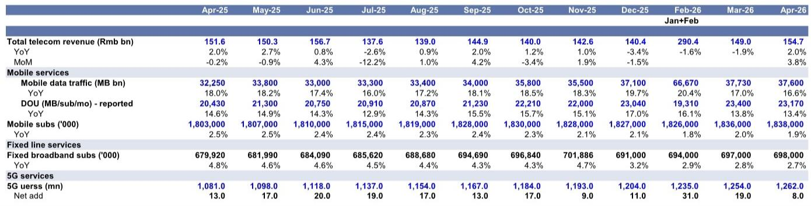
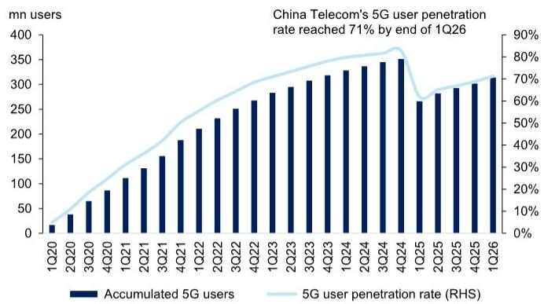

# 三大运营商正式开卖AI“Token”：ARPU的下一轮增长，比市场预期的更早到来

市场对运营商估值的核心分歧，正在从“5G投资何时见底”转向“AI变现能否真正贡献收入”。某外资投行最新发布的研报提供了一个关键信号：中国移动、中国联通、中国电信已相继推出面向个人和企业客户的AI Token计费方案，从按流量包月到按Token用量计费，定价体系已初步成型。这份报告真正值得关注的判断是，运营商的AI变现并非停留在概念层面，而是已经开始进入定价、签约、渗透的实质性阶段，其节奏可能比多数投资者的预期快一到两个季度。

对于持有或关注电信板块的投资者来说，当前需要回答的核心问题不是“AI能不能赚钱”，而是“这一轮定价权之争，谁会拿到最大的份额”。

## 1. 三大运营商的AI Token定价已经落地，不是试点，是正式商用

报告数据显示，中国移动、中国联通、中国电信均已发布明确的AI Token计费方案，且定价层级清晰。

中国移动的方案是基础单价加套餐包：每40万Token收费1元，同时提供从5.99元到24.99元不等的Token套餐包。中国联通则区分个人版和企业版，个人版每月15元起，企业版每月198元起，并附带编码计划等增值服务。中国电信的定价最为细化，个人版从9.9元到49.9元三档，企业版从39.9元到299.9元三档，每档对应明确的Token用量上限。

这意味着什么？AI服务不再是运营商年报里的“探索方向”，而是已经进入计费系统、可以规模化销售的标准化产品。从定价结构看，运营商明显在模仿云计算领域的“基础费+按量计费”模式，这与过去语音、流量时代的简单包月制有本质区别。Token计费的核心优势在于，它让运营商能够直接受益于用户AI使用量的增长，而不是靠固定套餐的提价来提升ARPU。

## 2. 定价只是第一步，真正的变量在于运营商能否把“管道”升级为“平台”

Token计费方案本身并不稀缺，任何云服务商都可以做。运营商真正的护城河，在于两个维度：一站式解决方案和安全可信。

报告明确提到，该外资投行看好运营商AI Token计划的理由之一，是其“一站式解决方案”和“安全性”优势。这与运营商在政企市场的传统定位高度一致。对于企业客户而言，AI部署涉及算力、网络、数据安全、合规等多个环节，运营商拥有端到端的服务能力，而云厂商往往只能提供其中的算力和模型层。在企业级AI采购决策中，“安全”和“合规”正在成为比“模型能力”更优先的考量因素，这正是运营商相对于互联网AI公司的结构性优势。

但这里有一个需要验证的关键问题：运营商能否真正建立起AI应用的生态，而不仅仅是卖Token的通道。如果企业客户只是把运营商的AI Token当作一个算力入口，而没有形成应用层面的粘性，那么运营商的定价权将很快被稀释。报告没有完全展开这一层，但这是决定长期估值逻辑的核心。

## 3. 5G基站建设仍在减速，但AI Token的推出恰好对冲了资本开支下行的压力

研报提供了最新的5G基站建设数据：2026年4月新增5G基站5.1万站，同比增长16%，但累计来看，2026年前4个月新增17.1万站，低于2025年同期的18.8万站。该外资投行预计2026年全年新增5G宏基站54万站，较2025年的58.8万站继续下降8%。

基站建设减速意味着运营商的资本开支高峰期已经过去，折旧压力正在减轻。但同时也意味着，传统移动业务的增量空间正在收窄——5G用户渗透率已经很高，中国移动和中国联通截至2026年一季度末的5G用户渗透率分别达到66%和71%。在没有AI Token的情况下，运营商的ARPU增长将越来越依赖存量用户的升档和增值服务。

AI Token的出现，恰好填补了这个缺口。它本质上是一种新的计费维度，不依赖于用户数量的增长，而是依赖于用户使用AI的频率和深度。对于运营商而言，这是一个比传统流量更具弹性的收入来源。报告虽然没有直接给出ARPU提升的量化测算，但从定价结构看，即使只有10%的5G用户每月多花10元购买AI Token套餐，对运营商的年收入贡献也是百亿级别的。

## 4. 供应链数据揭示了一个被低估的信号：海外需求正在接力国内下行

除了AI Token，这份报告的另一个重要信息来自供应链。4月份基站出口量同比下降9%，但出口金额同比增长3%，说明单价在提升。光纤光缆出口量同比增长9%，出口金额更是暴增287%。PCB净出口额同比增长40%。

这些数据合在一起揭示了一个趋势：国内5G建设放缓的同时，海外电信设备需求正在快速回升。光纤光缆出口金额的暴增尤其值得关注，它可能意味着海外运营商正在加速光纤到户和骨干网升级，而这部分需求与AI带来的数据中心互联需求是高度相关的。

对于投资者而言，这意味着电信板块的投资逻辑正在从“国内5G周期”切换到“全球AI基础设施周期”。运营商的AI Token变现是内需逻辑，而供应链的出口数据是外需逻辑，两者叠加形成的共振，可能比任何一个单一变量都更具持续性。

## 5. 报告尚未完全回答的关键问题：Token定价能否真正转化为ARPU增长

尽管定价方案已经明确，但报告并没有给出AI Token用户的渗透率数据，也没有估算其对运营商ARPU的实际拉动幅度。这是目前信息链条中最关键的缺口。

从逻辑上看，Token定价能否成功取决于三个条件：第一，用户是否愿意为AI功能付费；第二，运营商的AI应用是否足够丰富以支撑用户持续使用；第三，企业客户是否会因为安全和一站式服务优势而选择运营商而非云厂商。前两个条件目前处于早期验证阶段，第三个条件则取决于运营商在政企市场的执行力和生态建设能力。

此外，Token定价的竞争格局也需要关注。如果云厂商也推出类似的Token产品，并且价格更低或应用生态更丰富，运营商的定价权将受到挑战。报告提到运营商的一站式解决方案和安全优势，但在实际采购中，企业客户是否愿意为此支付溢价，仍是一个需要市场验证的问题。

## 6. 投资者需要建立的新观察框架：从“资本开支周期”转向“AI变现效率”

基于上述分析，跟踪运营商投资价值的方法论需要调整。过去几年，市场关注的核心指标是5G基站建设节奏、资本开支指引、用户净增数量。这些指标仍然重要，但对于判断未来6-12个月的股价走势，其权重正在下降。

新的观察框架应该包括：AI Token用户的月度净增量、Token套餐的付费转化率、企业客户签约数量、以及运营商在AI应用商店的开发者活跃度。这些指标比传统的电信数据更能反映运营商在新业务上的变现能力。

同时，供应链的出口数据需要持续跟踪。光纤光缆、PCB、CCL的出口金额和单价变化，是全球AI基础设施投资活跃度的先行指标。如果海外需求持续强劲，即使国内5G建设继续减速，相关公司的业绩也有支撑。

文末

AI Token的推出意味着运营商正在从一个“卖连接”的商业模式，转向“卖计算+卖连接”的新模式。这个转变的估值含义，远不止是ARPU提升几个百分点那么简单。但Token定价能否跑通、用户粘性如何、竞争格局是否会恶化，这些问题都需要更长时间的数据来验证。

如果你想看到完整的Token定价表、各运营商套餐细节对比、以及该外资投行对2026年全年基站建设的详细预测，欢迎来星球微信群里继续讨论。我们将基于原始报告数据，持续跟踪AI Token的渗透率变化和供应链出口趋势，帮你在这个关键转折期保持信息优势。

Personal reading notes and learning share only. Not investment advice.

