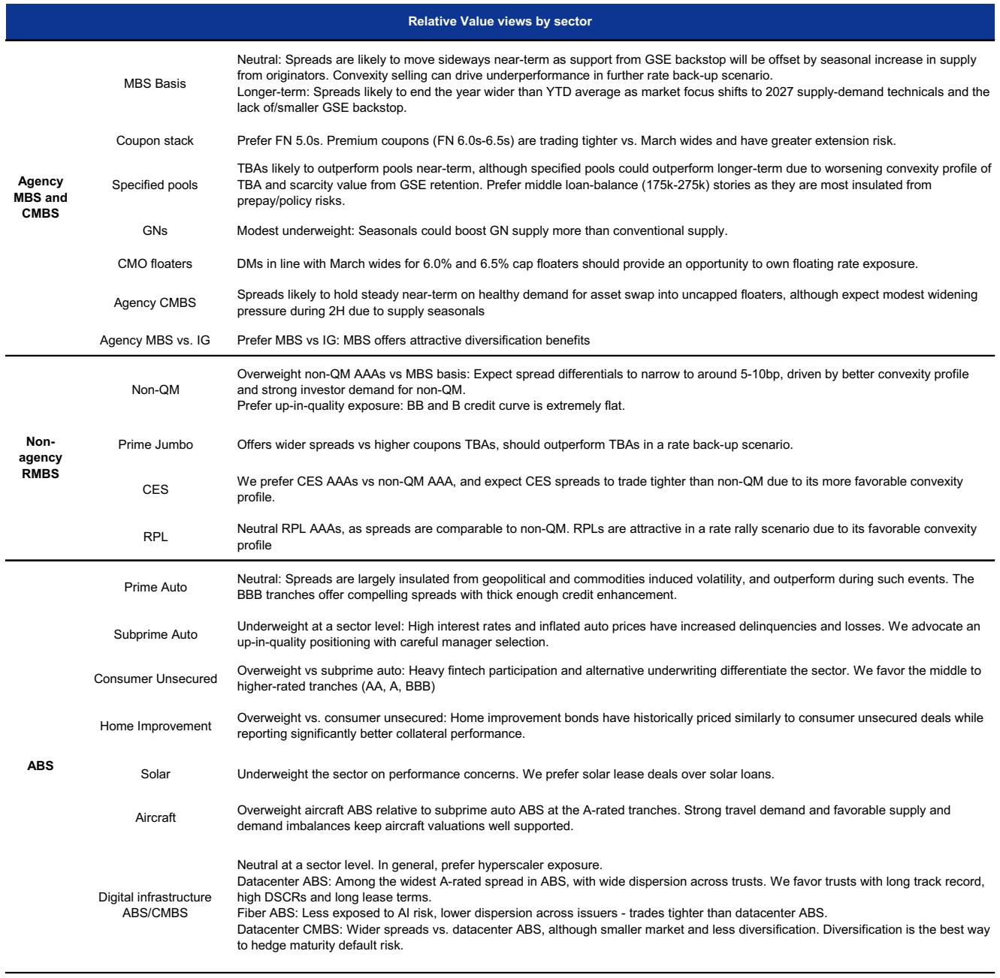
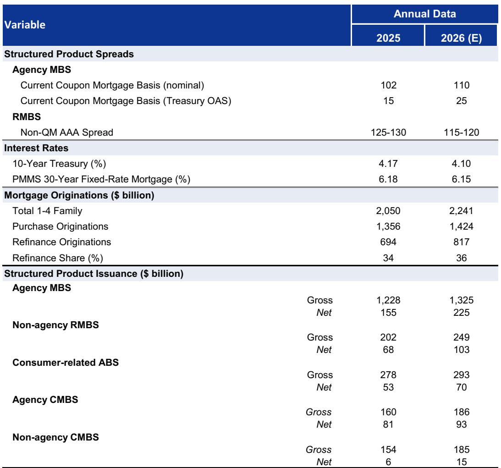
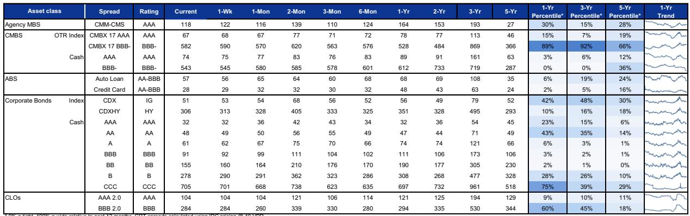

# The Mortgage Market Is Sending Two Contradictory Signals About Consumer Health—And Only One Can Be Right

The structured products market is currently priced for a world that does not yet exist. In agency mortgage-backed securities, a relative value trade has emerged that rewards investors who bet on a shift in refinancing behavior and loan composition. In prime jumbo RMBS, outperformance has been driven by a simple, mechanical reduction in prepayment risk as mortgage rates back up. And in consumer ABS, delinquency data remains stubbornly benign despite a collapse in consumer sentiment that would normally foreshadow trouble. These three asset classes are telling different stories about the same economy. The question for serious investors is not which story is correct, but rather which one will break first.

The answer matters because the structured products market is not a passive mirror of economic conditions. It is a forward-pricing mechanism that embeds assumptions about borrower behavior, monetary policy, and the distribution of financial stress across income groups. When those assumptions diverge as sharply as they do today, the market is effectively offering a set of conditional trades. The investor who can identify which conditional scenario is most likely to materialize stands to capture significant alpha. The investor who simply averages across the three narratives will end up with a portfolio that is hedged against nothing.

What makes the current moment particularly interesting is that the divergence is not random. It follows a logic that is visible in the data, but only if one knows where to look. The key is understanding how the composition of mortgage issuance changes with rate levels, how the structure of the prime jumbo market interacts with refinancing incentives, and how consumer credit performance is being masked by a compositional shift in the borrower base. Each of these dynamics points to a specific vulnerability that the market has not yet fully priced.

The remainder of this article unpacks these dynamics in detail. It will argue that the agency MBS swap trade is the cleanest expression of the market's current mispricing, that the prime jumbo RMBS outperformance is likely to persist but for reasons that are more fragile than they appear, and that consumer ABS is the asset class most vulnerable to a sudden repricing. It will then identify the critical question that the original report leaves unanswered, offer a decision framework for investors, and conclude with an invitation to access the full dataset and charts that underpin this analysis.

## The GN II/FN 4.5s Swap Has Benefited from a Temporary Compositional Tailwind That Is About to Reverse

The most actionable trade in the agency MBS market today is a pair trade that shorts the GN II/FN 4.5s swap against owning the GN II/FN 4.0s swap. This recommendation is not based on a directional view of interest rates. It is based on a structural analysis of the loan composition embedded in each coupon and the relative size of the deliverable float.

The GN II/FN 4.5s swap has appreciated sharply in recent months, moving from negative territory to around six ticks. The conventional explanation for this move is that mortgage rates declined, which increased the share of refinance loans in the GN II 4.5s pool relative to the FN 4.5s pool. Because refinance loans have steeper weighted average loan age (WALA) ramps than purchase loans, the GN II 4.5s TBA began trading to a shorter effective duration than the FN 4.5s TBA. This duration differential drove the swap price higher.

This explanation is correct as far as it goes, but it is backward-looking. The critical point is that the conditions that drove the swap higher are now reversing. Mortgage rates have backed up, and the spring and summer months typically bring a seasonal increase in purchase loan issuance. As the composition of GN II 4.5s issuance shifts back toward purchase loans, the WALA ramp flattens, and the duration differential that favored the GN II 4.5s should disappear. When that happens, the swap should come under pressure.

There is a second, more structural reason to expect downside. The size of the deliverable float for GN II 4.5s from the 2025-2026 vintage is significantly larger than the comparable float for FN 4.5s, after excluding specified pools and CMO-locked balances. In the 4.0 coupon, by contrast, the float sizes are much more comparable. This means that any shift in demand or supply dynamics will have a disproportionate impact on the 4.5s swap. The larger float acts as a weight that will pull the swap lower once the compositional tailwind fades.

The implication is clear. The market has priced the GN II/FN 4.5s swap based on a temporary condition. Investors who own this swap are essentially long a bet that refinancing activity will remain elevated relative to purchase activity. That bet is likely to lose money in the coming months. The cleaner trade is to own the GN II/FN 4.0s swap, where the float dynamics are more balanced and the compositional risk is lower.

## Prime Jumbo RMBS Outperformance Is Rational but Vulnerable to a Regime Change in Mortgage Rates

The prime jumbo RMBS market has delivered a different kind of story. Here, the outperformance of super-senior pass-throughs relative to same-coupon FN TBAs is not a function of compositional shifts. It is a straightforward consequence of the back-up in mortgage rates, which has reduced prepayment risk and therefore increased the relative value of these securities.

The data supports this interpretation. The OAS differential between prime jumbo SSNR PT 5.5s and FN 5.5s TBA has tightened to around 20 basis points, a level last seen in late 2025. This tightening is consistent with the historically observed relationship between the collateral's rate incentive and the OAS differential. In other words, the market is correctly pricing the reduction in prepayment risk. There is no obvious mispricing here.

The forward question is whether this outperformance can continue. The answer depends on the trajectory of mortgage rates and the gross weighted average coupon (GWAC) of future prime jumbo deals. If mortgage rates hold steady at current levels, the GWAC of new issuance will begin to rise as older, lower-coupon loans roll off and are replaced by higher-coupon collateral. This will bring the collateral closer to being at-the-money on refinancing, which should compress the OAS differential further.

There is a catch, however. The execution arbitrage—the difference between the deal price and the fair value estimate based on the closest-to-par FN TBA—has been declining. This means that the pricing advantage of prime jumbo deals relative to agency TBAs is shrinking. If rates remain steady, this trend should continue, and the OAS differential could tighten to levels that no longer compensate investors for the incremental credit and liquidity risk of prime jumbo collateral.

The strategic implication is that prime jumbo RMBS is a tactical hold, not a strategic allocation. The outperformance is rational and may persist for another quarter or two, but the risk-reward is becoming less attractive as the arb narrows. Investors who want exposure to this sector should focus on deals with higher GWACs and shorter effective durations, as these will benefit most from the tightening dynamic.

## Consumer ABS Delinquencies Are Low, but the Data Is Masking a Dangerous Divergence in Borrower Quality

The consumer ABS market presents the most puzzling picture. Consumer sentiment, as measured by the University of Michigan index, has collapsed to a record low, driven by high gasoline prices and rising inflation. Yet consumer ABS delinquencies remain remarkably insulated, tracking seasonal norms. The conventional interpretation is that the labor market is providing a buffer that sentiment data does not capture.

This interpretation is too simplistic. The Philadelphia Fed's LIFE survey data reveals a widening gap in financial security between higher-income and lower-income households. Higher-income households report significant improvements in their ability to make ends meet, while lower-income segments remain pressured. This divergence is not captured in aggregate delinquency data because the composition of the ABS market has shifted toward prime borrowers.

The critical question is whether this divergence can persist. The threshold for energy-price-driven credit deterioration remains high, as the original report notes. But the risk is not that energy prices cause a uniform deterioration across all borrowers. The risk is that the lower-income segment, which is already under pressure, reaches a tipping point where delinquencies spike, and that this spike is amplified by the fact that the prime segment has already been fully priced.

The market is not pricing this risk. Consumer ABS spreads remain tight, and the structure of most deals provides significant credit enhancement to senior tranches. But the divergence in borrower quality means that the tails are fatter than the normal distribution would suggest. A scenario in which lower-income delinquencies rise sharply while higher-income performance remains stable would produce a much larger loss on mezzanine and subordinate tranches than the market currently expects.

## The Report Leaves One Critical Question Unanswered: What Happens When the Divergence Converges?

The original report is thorough in its analysis of each asset class, but it does not fully address the question of how these three narratives interact. The agency MBS trade depends on a shift in loan composition. The prime jumbo RMBS trade depends on a steady rate environment. The consumer ABS trade depends on the persistence of the labor market buffer. Each of these conditions is plausible in isolation, but they cannot all hold simultaneously.

What happens if mortgage rates rise further? The agency MBS trade benefits from the compositional shift, but prime jumbo RMBS would lose its prepayment risk buffer, and consumer ABS would face additional pressure from higher borrowing costs. What happens if rates decline? The agency MBS trade reverses, prime jumbo RMBS sees a spike in prepayments, and consumer ABS gets a temporary reprieve. What happens if the labor market weakens? Consumer ABS delinquencies rise, but the agency MBS and prime jumbo RMBS markets would benefit from lower rates.

The unanswered question is which of these scenarios is most likely. The report provides the building blocks for an answer but does not synthesize them into a single view. This is not a criticism—it is an acknowledgment that the market itself is uncertain. The investor who can resolve this uncertainty will have a significant edge.

## A Decision Framework for Navigating the Three-Signal Market

For investors who want to act on this analysis, the following framework offers a systematic way to allocate capital across the three asset classes.

First, identify the regime. The most important variable is the trajectory of mortgage rates. If rates are expected to rise, the agency MBS swap trade is the highest-conviction idea, and consumer ABS should be underweight. If rates are expected to fall, the agency MBS trade should be reversed, and prime jumbo RMBS should be reduced. If rates are expected to remain stable, prime jumbo RMBS offers the best risk-reward.

Second, stress-test the consumer ABS thesis. The divergence in borrower quality means that aggregate delinquency data is misleading. Investors should decompose consumer ABS exposure by borrower income and credit score, and focus on deals with a higher concentration of prime borrowers. The mezzanine tranches of deals with significant lower-income exposure are the most vulnerable.

Third, monitor the float dynamics in agency MBS. The GN II/FN 4.5s swap is the most sensitive to changes in issuance composition and float size. Investors who want a cleaner expression of the trade should consider using TBA futures or swaps to isolate the coupon-specific risk.

Fourth, be prepared to reverse the prime jumbo RMBS trade. The outperformance has been driven by a mechanical factor that is likely to persist for another quarter. But the execution arb is narrowing, and any unexpected move in rates could trigger a sharp reversal. This is a trade that requires active management.

## Join the Community to Read the Full Report and Review the Original Charts

The analysis above is based on a detailed research report that includes 12 exhibits showing the exact data points, OAS calculations, float sizes, and issuance trends that underpin these conclusions. The original charts reveal nuances that cannot be fully captured in text—the precise timing of the duration shift in the GN II/FN 4.5s swap, the polynomial best-fit for the OAS differential in prime jumbo RMBS, and the month-by-month breakdown of consumer ABS delinquency trends by borrower segment.

Join the community to read the full report and review the original charts. The data will allow you to verify the analysis, test alternative scenarios, and build your own conviction on which of the three signals is most likely to break first. The market is offering a rare opportunity to capture alpha from a structural divergence. The investor who understands the mechanics behind the divergence will be the one who profits from its resolution.

*This article is for learning and discussion only and does not constitute investment advice.*

Personal reading notes and learning share only. Not investment advice.

