# THE WORLD CUP AND ECONOMICS

# World Cup 2026: Predictions, Probabilities, and Paths to Victory

We present a model for predicting the outcome of the 2026 World Cup in the US, Canada and Mexico from June 11 to July 19. It is similar to our model for prior World Cups but extended along several dimensions.   
Historical performance data for each team—most importantly the Elo rating system originally devised to rank chess players—is the main determinant of the number of goals scored. But even for a given Elo rating, we show that scoring talent and team momentum matter, as well as several mentality and geographical factors.   
We then simulate a set of probabilities that a particular team will reach a particular round, up to winning the World Cup. We also provide a modal forecast for how the tournament will unfold. After each day of play, we will re-run the model using updated performance data in order to generate new probabilities and a new modal forecast.   
The model says that Spain has a 26% probability of winning the trophy, followed by France at 19%, Argentina at 14%, Brazil at 8% and England at 5%. Spain is predicted to win because it has the highest Elo ranking, supported by scoring talent and good momentum into the competition. Argentina is penalised by the “winner’s slump”, i.e. the statistical underperformance of reigning champions in the following World Cup; France suffers from likely facing top-ranked Spain in the semifinals; and England underperforms its Elo rating given historical tournament disappointment, geographical headwinds (likely facing Mexico in high-altitude Mexico City), and a slightly unlucky draw.   
How much faith should we have in these predictions? Our projections are not far from bookmakers' odds—except for a lower winning probability for England—and our model would have performed quite well at previous World Cups (for example, when measured with the goal difference). That said, the model's statistical power remains limited—not a surprise given football's inherent unpredictability.

# Jan Hatzius

+1(212)902-0394 | jan.hatzius@gs.com

GS & Co. LLC

# Giovanni Pierdomenico

+44(20)7051-6807

giovanni.pierdomenico@gs.com

GS International

# Sven Jari Stehn

+44(20)7774-8061 | jari.stehn@gs.com

GS International

# World Cup 2026: Predictions, Probabilities, and Paths to Victory

# "Football is the most important of the least important things in life" – Arrigo Sacchi, Italian former football manager

With two weeks to go, we introduce our statistical model for predicting the outcome of the 2026 World Cup. We proceed as follows.

# Our Statistical Model to Predict the Outcome of the World Cup

First, we estimate a regression model to predict the number of goals scored by a particular team (“team i”) against a particular opponent (“team j”) using the entire history of mandatory international matches since 1978 (a total of just under 20,000 matches). Following the literature on predicting football matches, we assume that the number of goals scored by team i is described by a so-called “Poisson” distribution (Exhibit 1).

Exhibit 1: The Number of Goals Score by a Football Team Broadly Follows a Poisson Distribution   
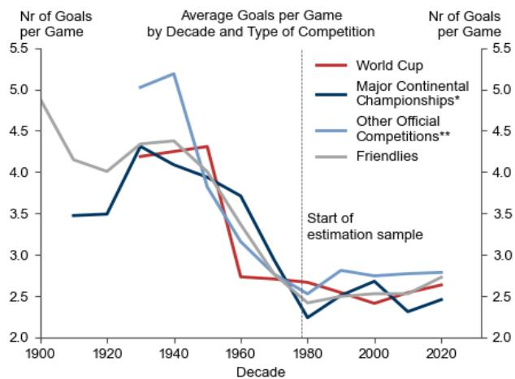

line

| Decade | World Cup | Major Continental Championships* | Other Official Competitions** | Friendlies |
| ------ | --------- | --------------------------------- | ------------------------------ | ---------- |
| 1900   | 4.9       | 3.5                               | 4.9                            | 4.9        |
| 1920   | 4.2       | 3.5                               | 5.0                            | 4.1        |
| 1940   | 4.3       | 4.3                               | 5.2                            | 4.4        |
| 1960   | 2.7       | 3.7                               | 3.2                            | 3.0        |
| 1980   | 2.6       | 2.3                               | 2.5                            | 2.5        |
| 2000   | 2.5       | 2.7                               | 2.8                            | 2.6        |
| 2020   | 2.6       | 2.5                               | 2.8                            | 2.7        |

\*Major Continental Championships include European and South American championships. \*\*Other official competitions include other continental championships and all qualifiers. Note: WC 1940s are interpolated.

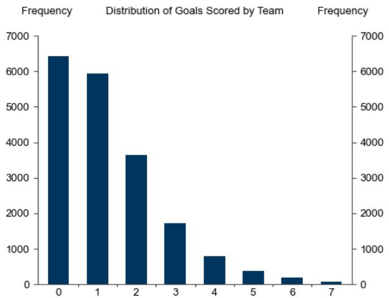

bar

| Team | Frequency |
| ---- | --------- |
| 0    | 6500      |
| 1    | 6000      |
| 2    | 3700      |
| 3    | 1800      |
| 4    | 900       |
| 5    | 400       |
| 6    | 200       |
| 7    | 100       |

Sample: Mandatory international games since 1978.   
Source: eloratings.net, GS Global Investment Research

The main determinant of the number of goals scored is the difference in team performance as reflected in Elo ratings prior to the match. The Elo system was originally devised to rank chess players. It is a composite measure of national football team success that evolves depending on a team's results and the strength of its opponents. The Elo system ranks Spain first, followed by Argentina and France, and thus differs slightly from the FIFA men's world rankings (Exhibit 2).

Exhibit 2: Elo vs FIFA/Coca-Cola Rankings   
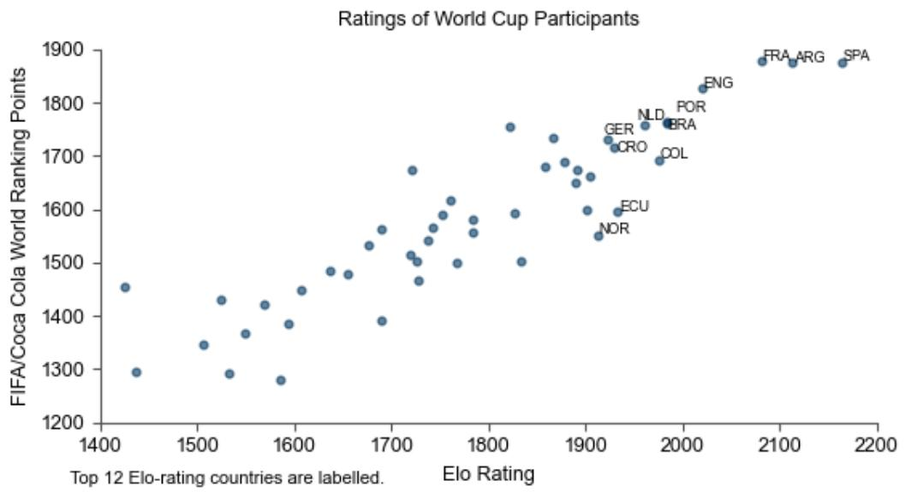

scatter

| Label | Elo Rating | FIFA/Coca Cola World Ranking Points |
|-------|------------|-------------------------------------|
| FRA-ARG | ~2100 | ~1880 |
| SPA | ~2170 | ~1870 |
| ENG | ~2030 | ~1830 |
| POR | ~2000 | ~1760 |
| NLD | ~1970 | ~1760 |
| BRA | ~1990 | ~1760 |
| GER | ~1930 | ~1730 |
| CRO | ~1920 | ~1720 |
| COL | ~1980 | ~1700 |
| ECU | ~1940 | ~1600 |
| NOR | ~1910 | ~1550 |
| Top 12 Elo-rating countries are labelled. | — | — |

Source: eloratings.net, FIFA, GS Global Investment Research

We then expand the model with several other explanatory variables:

■ Scoring talent: we gather data on top goal scorers in national leagues and international competitions for clubs and find that these matter for the number of goals scored by the team in a World Cup $^{1}$ .   
■ Momentum: we measure team momentum by including the number of goals scored by team i in the last 10 competitive matches, and the number of goals conceded by team j in the last 5 competitive matches.   
■ Mentality: we find that reigning world champions typically underperform (while teams at their first World Cup usually outperform) and that it is more difficult to score against European teams (all else equal). Furthermore, major footballing nations generally get a World Cup boost, with the notable exception of England.   
- Geography: we confirm a familiar “home effect” for games that are played at home. We also find that the number of goals scored is reduced: by the distance between the country’s capital and location of the game; when a low-altitude country plays in a high-altitude stadium (which is relevant for games played in Mexico in the upcoming World Cup); and by the absolute temperature difference between the average temperature of a country and the temperature of the venue in the month of the game.

Exhibit 3: Goal-Scoring Potential Matters; Some Signs of a “Winner’s Slump” Effect After Winning the World Cup   
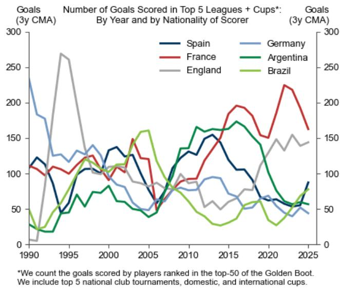

line

| Year | Spain | France | Germany | Argentina | England | Brazil |
|------|-------|--------|---------|-----------|---------|--------|
| 1990 | 120   | 110    | 230     | 30        | 10      | 40     |
| 1995 | 50    | 100    | 130     | 60        | 270     | 120    |
| 2000 | 130   | 120    | 110     | 80        | 110     | 110    |
| 2005 | 120   | 150    | 50      | 40        | 80      | 160    |
| 2010 | 130   | 90     | 80      | 160       | 100     | 60     |
| 2015 | 150   | 190    | 90      | 170       | 70      | 30     |
| 2020 | 70    | 150    | 60      | 140       | 150     | 30     |
| 2025 | 90    | 160    | 40      | 60        | 140     | 80     |

<table><tr><td>World Cup</td><td>Winner</td><td>Outcome in the Following World Cup</td></tr><tr><td>1978</td><td>Argentina</td><td>2nd Round</td></tr><tr><td>1982</td><td>Italy</td><td>Round of 16</td></tr><tr><td>1986</td><td>Argentina</td><td>2nd Place</td></tr><tr><td>1990</td><td>Germany</td><td>Quarter Finals</td></tr><tr><td>1994</td><td>Brazil</td><td>2nd Place</td></tr><tr><td>1998</td><td>France</td><td>Group Stage</td></tr><tr><td>2002</td><td>Brazil</td><td>Quarter Finals</td></tr><tr><td>2006</td><td>Italy</td><td>Group Stage</td></tr><tr><td>2010</td><td>Spain</td><td>Group Stage</td></tr><tr><td>2014</td><td>Germany</td><td>Group Stage</td></tr><tr><td>2018</td><td>France</td><td>2nd Place</td></tr><tr><td>2022</td><td>Argentina</td><td>TBC</td></tr></table>

Source: Transfermarkt, FIFA, GS Global Investment Research

Exhibit 4 summarises the marginal effect of some of the key variables in our model on the predicted number of goals scored in a World Cup game.

Exhibit 4: What Matters in Our Model   
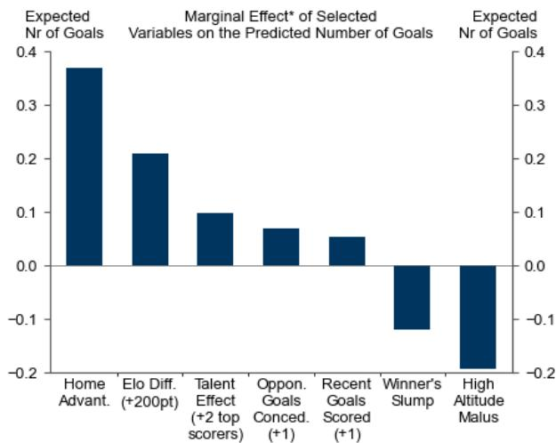

bar

| Variable | Expected Nr of Goals |
| --- | --- |
| Home Advant. | 0.38 |
| Elo Diff. (+200pt) | 0.21 |
| Talent Effect (+2 top scorers) | 0.10 |
| Oppon. Goals Conced. (+1) | 0.07 |
| Recent Goals Scored (+1) | 0.05 |
| Winner's Slump | -0.12 |
| High Altitude Malus | -0.18 |

\*Evaluated at average values.

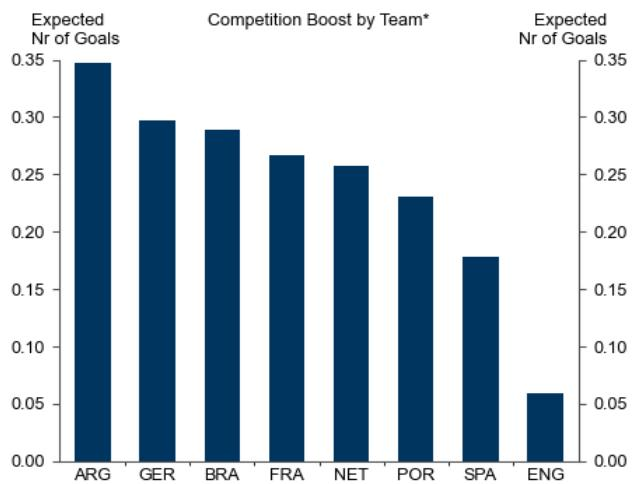

bar

| Team | Expected Nr of Goals |
| ---- | ------------------- |
| ARG  | 0.35                |
| GER  | 0.30                |
| BRA  | 0.29                |
| FRA  | 0.27                |
| NET  | 0.26                |
| POR  | 0.23                |
| SPA  | 0.18                |
| ENG  | 0.06                |

\*Boost for big teams when they play in the WC, evaluated at average values.   
Source: GS Global Investment Research

Second, we apply this regression-based model to the upcoming World Cup. This entails simulating the group-stage games and the resulting bracket of the knock-out stage up to the final held on July 19 in New York. Our model updates Elo ratings and momentum variables recursively over the course of the tournament, according to model-based or, later, actual scores. We apply official FIFA rules for the tie-breakers in the group stage and account for all 495 possible pairings in the round of 32, which will depend on which third-placed teams qualify for the knock-out stage. We use the rounded prediction of the goals scored to determine the outcome of each match during the group stage and

the unrounded prediction to pick the winner in the knockout stage $^{2}$ .

The model thus generates the single most likely prediction for each of the 104 games in the World Cup up to the final. We can also leverage the Poisson distribution underlying our model to run a Monte Carlo simulation with 50,000 draws, which yields a set of probabilities that a particular team wins the tournament or reaches a particular stage of the tournament. In each of the simulations, the outcome of a game is given by a random draw (as opposed to the most likely) from the team- and game-specific Poisson distribution of goals scored $^{3}$ .

# A Summary of the Predictions

Exhibit 5 and Exhibit 6 show the most likely development of the tournament according to our model.

We expect major teams and all three hosts to advance from the expanded 48-team group stage to the round of 32. Groups D and G are expected to be the tightest ones, with our model unable to clearly differentiate (on a rounded basis) between the teams on the basis of the statistical factors considered. Exhibit 12 in the Appendix shows the predicted standings at the group stage.

We expect the round of 32 to offer a few interesting games, including the US vs. Iran and a clásico Argentina vs. Uruguay. That said, the first “big matches” should be featured in the round of 16, with Germany projected to be eliminated by France. England vs. Brazil and Argentina vs. Portugal (which could be the last match-up between Lionel Messi and Cristiano Ronaldo) should be the most exciting quarter-finals, with the Seleção and the Selección advancing to the next stage. The Netherlands and the tournament surprise Türkiye are also expected to end their run in the quarter-finals.

The model projects semi-finals of France vs. Spain, and Brazil vs. Argentina, with la Roja and la Albiceleste (reigning continental champions respectively in Europe and South America) facing off in a Finalissima. We expect Spain to win its second World Cup on July 19, with Messi (who turns 39 during the tournament) passing on the torch to Lamine Yamal (who will celebrate his $19^{\text{th}}$ birthday just a few days before the New York final). Our prediction aligns with the historical pattern that the World Cup almost always comes back to Europe after having been won by a South American team (with the only exception being the consecutive Brazilian wins in 1958 and 1962).

# Exhibit 5: Most Likely Predicted Group Stage Results

FIFA World Cup 2026 - Group Stage: Prediction as of 29 May 2026

Played (final score) Predicted score

<table><tr><td colspan="5">Group A Mexico | South Korea | Czechia | South Africa</td></tr><tr><td>MD</td><td>Date</td><td>Team 1</td><td>Score</td><td>Team 2</td></tr><tr><td>1</td><td>11-Jun</td><td>Mexico</td><td>2-0</td><td>South Africa</td></tr><tr><td>1</td><td>11-Jun</td><td>South Korea</td><td>1-1</td><td>Czechia</td></tr><tr><td>2</td><td>18-Jun</td><td>Czechia</td><td>1-1</td><td>South Africa</td></tr><tr><td>2</td><td>18-Jun</td><td>Mexico</td><td>2-1</td><td>South Korea</td></tr><tr><td>3</td><td>24-Jun</td><td>Czechia</td><td>1-2</td><td>Mexico</td></tr><tr><td>3</td><td>24-Jun</td><td>South Africa</td><td>1-1</td><td>South Korea</td></tr></table>

<table><tr><td colspan="5">Group B Canada | Qatar | Switzerland | Bosnia and H.</td></tr><tr><td>MD</td><td>Date</td><td>Team 1</td><td>Score</td><td>Team 2</td></tr><tr><td>1</td><td>12-Jun</td><td>Canada</td><td>2-1</td><td>Bosnia and H.</td></tr><tr><td>1</td><td>13-Jun</td><td>Qatar</td><td>0-2</td><td>Switzerland</td></tr><tr><td>2</td><td>18-Jun</td><td>Switzerland</td><td>1-1</td><td>Bosnia and H.</td></tr><tr><td>2</td><td>18-Jun</td><td>Canada</td><td>2-1</td><td>Qatar</td></tr><tr><td>3</td><td>24-Jun</td><td>Switzerland</td><td>1-1</td><td>Canada</td></tr><tr><td>3</td><td>24-Jun</td><td>Bosnia and H.</td><td>1-1</td><td>Qatar</td></tr></table>

<table><tr><td colspan="5">Group C Brazil | Haiti | Scotland | Morocco</td></tr><tr><td>MD</td><td>Date</td><td>Team 1</td><td>Score</td><td>Team 2</td></tr><tr><td>1</td><td>13-Jun</td><td>Brazil</td><td>2-1</td><td>Morocco</td></tr><tr><td>1</td><td>13-Jun</td><td>Haiti</td><td>1-1</td><td>Scotland</td></tr><tr><td>2</td><td>19-Jun</td><td>Scotland</td><td>1-1</td><td>Morocco</td></tr><tr><td>2</td><td>19-Jun</td><td>Brazil</td><td>2-1</td><td>Haiti</td></tr><tr><td>3</td><td>24-Jun</td><td>Scotland</td><td>1-2</td><td>Brazil</td></tr><tr><td>3</td><td>24-Jun</td><td>Morocco</td><td>1-1</td><td>Haiti</td></tr></table>

<table><tr><td colspan="5">Group D USA | Australia | Turkiye | Paraguay</td></tr><tr><td>MD</td><td>Date</td><td>Team 1</td><td>Score</td><td>Team 2</td></tr><tr><td>1</td><td>12-Jun</td><td>USA</td><td>1-1</td><td>Paraguay</td></tr><tr><td>1</td><td>13-Jun</td><td>Australia</td><td>1-1</td><td>Turkiye</td></tr><tr><td>2</td><td>19-Jun</td><td>USA</td><td>1-1</td><td>Australia</td></tr><tr><td>2</td><td>19-Jun</td><td>Turkiye</td><td>1-1</td><td>Paraguay</td></tr><tr><td>3</td><td>25-Jun</td><td>Turkiye</td><td>1-1</td><td>USA</td></tr><tr><td>3</td><td>25-Jun</td><td>Paraguay</td><td>1-1</td><td>Australia</td></tr></table>

<table><tr><td colspan="5">Group E Germany | Ivory Coast | Ecuador | Curacao</td></tr><tr><td>MD</td><td>Date</td><td>Team 1</td><td>Score</td><td>Team 2</td></tr><tr><td>1</td><td>14-Jun</td><td>Germany</td><td>2-1</td><td>Curacao</td></tr><tr><td>1</td><td>14-Jun</td><td>Ivory Coast</td><td>1-1</td><td>Ecuador</td></tr><tr><td>2</td><td>20-Jun</td><td>Germany</td><td>2-1</td><td>Ivory Coast</td></tr><tr><td>2</td><td>20-Jun</td><td>Ecuador</td><td>2-1</td><td>Curacao</td></tr><tr><td>3</td><td>25-Jun</td><td>Curacao</td><td>1-1</td><td>Ivory Coast</td></tr><tr><td>3</td><td>25-Jun</td><td>Ecuador</td><td>1-2</td><td>Germany</td></tr></table>

<table><tr><td colspan="5">Group F Netherlands | Sweden | Tunisia | Japan</td></tr><tr><td>MD</td><td>Date</td><td>Team 1</td><td>Score</td><td>Team 2</td></tr><tr><td>1</td><td>14-Jun</td><td>Netherlands</td><td>1-1</td><td>Japan</td></tr><tr><td>1</td><td>14-Jun</td><td>Sweden</td><td>1-1</td><td>Tunisia</td></tr><tr><td>2</td><td>20-Jun</td><td>Netherlands</td><td>2-1</td><td>Sweden</td></tr><tr><td>2</td><td>20-Jun</td><td>Tunisia</td><td>1-1</td><td>Japan</td></tr><tr><td>3</td><td>25-Jun</td><td>Japan</td><td>1-1</td><td>Sweden</td></tr><tr><td>3</td><td>25-Jun</td><td>Tunisia</td><td>1-2</td><td>Netherlands</td></tr></table>

<table><tr><td colspan="5">Group G Belgium | Iran | New Zealand | Egypt</td></tr><tr><td>MD</td><td>Date</td><td>Team 1</td><td>Score</td><td>Team 2</td></tr><tr><td>1</td><td>15-Jun</td><td>Belgium</td><td>1-1</td><td>Egypt</td></tr><tr><td>1</td><td>15-Jun</td><td>Iran</td><td>1-1</td><td>New Zealand</td></tr><tr><td>2</td><td>21-Jun</td><td>Belgium</td><td>1-1</td><td>Iran</td></tr><tr><td>2</td><td>21-Jun</td><td>New Zealand</td><td>1-1</td><td>Egypt</td></tr><tr><td>3</td><td>26-Jun</td><td>Egypt</td><td>1-1</td><td>Iran</td></tr><tr><td>3</td><td>26-Jun</td><td>New Zealand</td><td>1-1</td><td>Belgium</td></tr></table>

<table><tr><td colspan="5">Group H Spain | Saudi Arabia | Uruguay | Cape Verde</td></tr><tr><td>MD</td><td>Date</td><td>Team 1</td><td>Score</td><td>Team 2</td></tr><tr><td>1</td><td>15-Jun</td><td>Spain</td><td>3-0</td><td>Cape Verde</td></tr><tr><td>1</td><td>15-Jun</td><td>Saudi Arabia</td><td>1-1</td><td>Uruguay</td></tr><tr><td>2</td><td>21-Jun</td><td>Spain</td><td>3-0</td><td>Saudi Arabia</td></tr><tr><td>2</td><td>21-Jun</td><td>Uruguay</td><td>1-1</td><td>Cape Verde</td></tr><tr><td>3</td><td>26-Jun</td><td>Uruguay</td><td>0-2</td><td>Spain</td></tr><tr><td>3</td><td>26-Jun</td><td>Cape Verde</td><td>1-1</td><td>Saudi Arabia</td></tr></table>

<table><tr><td colspan="2">Group I</td><td colspan="3">France | Iraq | Norway | Senegal</td></tr><tr><td>MD</td><td>Date</td><td>Team 1</td><td>Score</td><td>Team 2</td></tr><tr><td>1</td><td>16-Jun</td><td>France</td><td>2-1</td><td>Senegal</td></tr><tr><td>1</td><td>16-Jun</td><td>Iraq</td><td>1-2</td><td>Norway</td></tr><tr><td>2</td><td>22-Jun</td><td>France</td><td>3-0</td><td>Iraq</td></tr><tr><td>2</td><td>22-Jun</td><td>Norway</td><td>1-1</td><td>Senegal</td></tr><tr><td>3</td><td>26-Jun</td><td>Norway</td><td>1-2</td><td>France</td></tr><tr><td>3</td><td>26-Jun</td><td>Senegal</td><td>2-1</td><td>Iraq</td></tr></table>

<table><tr><td colspan="2">Group J</td><td colspan="3">Argentina | Austria | Jordan | Algeria</td></tr><tr><td>MD</td><td>Date</td><td>Team 1</td><td>Score</td><td>Team 2</td></tr><tr><td>1</td><td>16-Jun</td><td>Argentina</td><td>2-1</td><td>Algeria</td></tr><tr><td>1</td><td>16-Jun</td><td>Austria</td><td>1-1</td><td>Jordan</td></tr><tr><td>2</td><td>22-Jun</td><td>Argentina</td><td>2-1</td><td>Austria</td></tr><tr><td>2</td><td>22-Jun</td><td>Jordan</td><td>1-1</td><td>Algeria</td></tr><tr><td>3</td><td>27-Jun</td><td>Algeria</td><td>1-1</td><td>Austria</td></tr><tr><td>3</td><td>27-Jun</td><td>Jordan</td><td>1-2</td><td>Argentina</td></tr></table>

<table><tr><td colspan="5">Group K Portugal | Uzbekistan | Colombia | DR Congo</td></tr><tr><td>MD</td><td>Date</td><td>Team 1</td><td>Score</td><td>Team 2</td></tr><tr><td>1</td><td>17-Jun</td><td>Portugal</td><td>2-1</td><td>DR Congo</td></tr><tr><td>1</td><td>17-Jun</td><td>Uzbekistan</td><td>1-1</td><td>Colombia</td></tr><tr><td>2</td><td>23-Jun</td><td>Portugal</td><td>2-1</td><td>Uzbekistan</td></tr><tr><td>2</td><td>23-Jun</td><td>Colombia</td><td>2-1</td><td>DR Congo</td></tr><tr><td>3</td><td>27-Jun</td><td>Colombia</td><td>1-1</td><td>Portugal</td></tr><tr><td>3</td><td>27-Jun</td><td>DR Congo</td><td>1-1</td><td>Uzbekistan</td></tr></table>

<table><tr><td colspan="2">Group L</td><td colspan="3">England | Ghana | Panama | Croatia</td></tr><tr><td>MD</td><td>Date</td><td>Team 1</td><td>Score</td><td>Team 2</td></tr><tr><td>1</td><td>17-Jun</td><td>England</td><td>1-1</td><td>Croatia</td></tr><tr><td>1</td><td>17-Jun</td><td>Ghana</td><td>1-1</td><td>Panama</td></tr><tr><td>2</td><td>23-Jun</td><td>England</td><td>2-1</td><td>Ghana</td></tr><tr><td>2</td><td>23-Jun</td><td>Panama</td><td>1-2</td><td>Croatia</td></tr><tr><td>3</td><td>27-Jun</td><td>Panama</td><td>1-2</td><td>England</td></tr><tr><td>3</td><td>27-Jun</td><td>Croatia</td><td>2-1</td><td>Ghana</td></tr></table>

Source: GS Global Investment Research

# Exhibit 6: The Road to the Final

FIFA World Cup 2026 - Knock-Out Stage: GS Prediction as of 29 May 2026

Predicted unrounded goals shown next to each team. Winner in bold.

  
Source: GS Global Investment Research

The probabilities resulting from our Monte Carlo simulation are shown in Exhibit 7. The model says that Spain has a 26% probability of winning the trophy, followed by France at 19%, Argentina at 14%, Brazil at 8% and England and the Netherlands around 5%.

Exhibit 7: Probabilities of Advancement in the 2026 World Cup 

<table><tr><td colspan="13">Model-Implied Probabilities of Advancing in the 2026 World Cup (as of 29 May 2026)</td><td></td></tr><tr><td>Team</td><td>R32</td><td>R16</td><td>QF</td><td>SF</td><td>Final</td><td>Winner</td><td>Team</td><td>R32</td><td>R16</td><td>QF</td><td>SF</td><td>Final</td><td>Winner</td></tr><tr><td>Spain</td><td>99.1</td><td>80.6</td><td>65.1</td><td>55.3</td><td>37.5</td><td>25.7</td><td>Uzbekistan</td><td>54.5</td><td>18.9</td><td>6.2</td><td>2.0</td><td>0.6</td><td>0.2</td></tr><tr><td>France</td><td>96.2</td><td>82.4</td><td>61.9</td><td>47.0</td><td>28.9</td><td>18.9</td><td>Australia</td><td>59.4</td><td>28.1</td><td>9.9</td><td>2.6</td><td>0.8</td><td>0.2</td></tr><tr><td>Argentina</td><td>96.5</td><td>70.0</td><td>57.3</td><td>42.4</td><td>27.1</td><td>14.3</td><td>Czechia</td><td>68.7</td><td>32.5</td><td>10.0</td><td>2.3</td><td>0.7</td><td>0.2</td></tr><tr><td>Brazil</td><td>96.1</td><td>66.9</td><td>45.3</td><td>28.4</td><td>15.9</td><td>7.6</td><td>Scotland</td><td>64.3</td><td>18.6</td><td>7.2</td><td>2.0</td><td>0.6</td><td>0.1</td></tr><tr><td>Netherlands</td><td>94.3</td><td>61.6</td><td>45.9</td><td>22.7</td><td>11.0</td><td>5.2</td><td>Algeria</td><td>50.3</td><td>13.7</td><td>5.0</td><td>1.5</td><td>0.4</td><td>0.1</td></tr><tr><td>England</td><td>94.1</td><td>65.9</td><td>37.7</td><td>22.2</td><td>11.5</td><td>5.0</td><td>Iran</td><td>71.6</td><td>30.3</td><td>9.7</td><td>2.2</td><td>0.5</td><td>0.1</td></tr><tr><td>Portugal</td><td>90.2</td><td>61.4</td><td>37.9</td><td>21.0</td><td>11.0</td><td>4.8</td><td>Panama</td><td>58.0</td><td>17.9</td><td>5.3</td><td>1.6</td><td>0.4</td><td>0.1</td></tr><tr><td>Germany</td><td>95.0</td><td>67.0</td><td>32.1</td><td>19.9</td><td>9.5</td><td>4.5</td><td>Jordan</td><td>47.9</td><td>13.7</td><td>5.2</td><td>1.7</td><td>0.4</td><td>0.1</td></tr><tr><td>Colombia</td><td>87.4</td><td>51.5</td><td>26.7</td><td>13.2</td><td>5.9</td><td>2.2</td><td>South Korea</td><td>71.2</td><td>34.5</td><td>10.6</td><td>2.0</td><td>0.5</td><td>0.1</td></tr><tr><td>Croatia</td><td>87.4</td><td>49.1</td><td>22.5</td><td>11.3</td><td>4.9</td><td>1.7</td><td>Egypt</td><td>60.7</td><td>22.0</td><td>6.2</td><td>1.4</td><td>0.3</td><td>0.1</td></tr><tr><td>Norway</td><td>78.0</td><td>47.4</td><td>23.7</td><td>11.8</td><td>4.8</td><td>1.6</td><td>Sweden</td><td>54.2</td><td>13.0</td><td>5.0</td><td>1.4</td><td>0.4</td><td>0.1</td></tr><tr><td>Mexico</td><td>95.6</td><td>68.0</td><td>33.3</td><td>10.2</td><td>3.4</td><td>0.8</td><td>Ivory Coast</td><td>54.8</td><td>14.9</td><td>3.3</td><td>0.9</td><td>0.2</td><td>0.0</td></tr><tr><td>Senegal</td><td>70.4</td><td>37.5</td><td>16.8</td><td>7.3</td><td>2.6</td><td>0.8</td><td>DR Congo</td><td>34.9</td><td>8.7</td><td>2.1</td><td>0.6</td><td>0.1</td><td>0.0</td></tr><tr><td>Ecuador</td><td>84.6</td><td>42.1</td><td>15.3</td><td>6.8</td><td>2.3</td><td>0.8</td><td>Bosnia and Herz.</td><td>63.2</td><td>22.7</td><td>6.2</td><td>1.1</td><td>0.2</td><td>0.0</td></tr><tr><td>Belgium</td><td>86.3</td><td>51.6</td><td>23.9</td><td>6.8</td><td>2.3</td><td>0.7</td><td>Cape Verde</td><td>42.2</td><td>7.9</td><td>2.3</td><td>0.6</td><td>0.1</td><td>0.0</td></tr><tr><td>Switzerland</td><td>88.9</td><td>54.2</td><td>21.8</td><td>6.7</td><td>2.2</td><td>0.7</td><td>New Zealand</td><td>52.9</td><td>17.2</td><td>4.3</td><td>0.8</td><td>0.2</td><td>0.0</td></tr><tr><td>Turkiye</td><td>77.3</td><td>45.9</td><td>21.8</td><td>6.8</td><td>2.2</td><td>0.6</td><td>Tunisia</td><td>39.0</td><td>7.4</td><td>2.3</td><td>0.6</td><td>0.1</td><td>0.0</td></tr><tr><td>United States</td><td>69.5</td><td>38.9</td><td>17.1</td><td>5.4</td><td>1.7</td><td>0.5</td><td>Haiti</td><td>29.4</td><td>5.4</td><td>1.3</td><td>0.3</td><td>0.1</td><td>0.0</td></tr><tr><td>Japan</td><td>78.9</td><td>30.7</td><td>16.0</td><td>5.6</td><td>1.8</td><td>0.5</td><td>Iraq</td><td>22.0</td><td>5.7</td><td>1.4</td><td>0.3</td><td>0.1</td><td>0.0</td></tr><tr><td>Austria</td><td>69.4</td><td>23.9</td><td>11.2</td><td>4.7</td><td>1.6</td><td>0.4</td><td>Saudi Arabia</td><td>35.0</td><td>5.5</td><td>1.4</td><td>0.2</td><td>0.0</td><td>0.0</td></tr><tr><td>Uruguay</td><td>79.9</td><td>26.5</td><td>12.9</td><td>5.3</td><td>1.7</td><td>0.4</td><td>South Africa</td><td>31.8</td><td>8.7</td><td>1.6</td><td>0.2</td><td>0.0</td><td>0.0</td></tr><tr><td>Paraguay</td><td>67.0</td><td>35.4</td><td>13.9</td><td>4.1</td><td>1.2</td><td>0.3</td><td>Curacao</td><td>31.5</td><td>6.1</td><td>1.0</td><td>0.2</td><td>0.0</td><td>0.0</td></tr><tr><td>Morocco</td><td>76.1</td><td>26.9</td><td>11.9</td><td>3.7</td><td>1.1</td><td>0.3</td><td>Ghana</td><td>26.4</td><td>5.1</td><td>1.0</td><td>0.2</td><td>0.0</td><td>0.0</td></tr><tr><td>Canada</td><td>90.7</td><td>50.4</td><td>18.4</td><td>4.7</td><td>1.2</td><td>0.3</td><td>Qatar</td><td>27.5</td><td>5.5</td><td>0.9</td><td>0.1</td><td>0.0</td><td>0.0</td></tr></table>

Source: GS Global Investment Research

Exhibit 8 provides more insight into the results by breaking down the probabilities of winning for the top four teams in a “waterfall chart” format. Our key predictions are:

Spain is supported by its top Elo rating (52 points more than Argentina and 84 points above France) and scoring talent.   
Argentina is supported by a strong competition boost and the second-highest Elo rating but affected negatively by the winner's slump, as reigning World Cup winners consistently underperform (the only recent exception is France 2018-22).   
France boasts elite scoring talent but suffers from likely facing Spain earlier than Argentina (already in the semi-finals).   
England faces the twin obstacles of historical underperformance at World Cups and the likelihood of facing Mexico in hot and high-altitude Mexico City, which results in a net-drag from geographical factors on the Three Lions' chances.   
Germany is the only top team with no contribution from offensive talent. This is because relative to others they have fewer big scorers.

Exhibit 8: Breaking Down the Winning Probability   
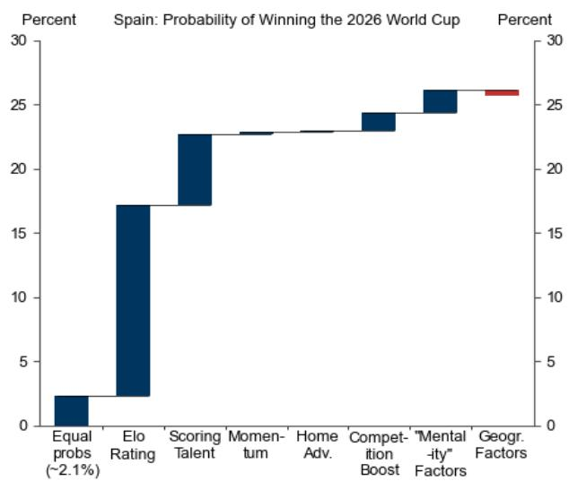

bar

Spain: Probability of Winning the 2026 World Cup
| Factor | Percent (%) |
| :--- | :--- |
| Equal probs (~2.1%) | 2 |
| Elo Rating | 17 |
| Scoring Talent | 23 |
| Momentum | 23 |
| Home Adv. | 23 |
| Competition Boost | 24 |
| "Mental-ity" Factors | 26 |
| Geogr. Factors | 26 |

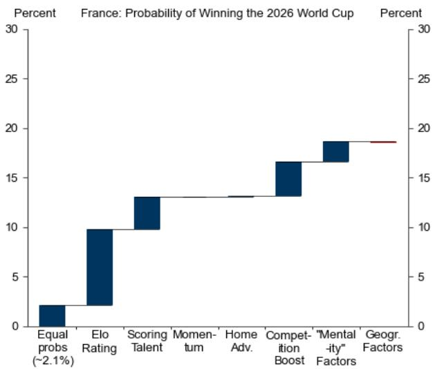

bar

France: Probability of Winning the 2026 World Cup
| Factor | Percent (%) |
| :--- | :--- |
| Equal probs (~2.1%) | 2 |
| Elo Rating | 10 |
| Scoring Talent | 13 |
| Momentum | 13 |
| Home Adv. | 13 |
| Competition Boost | 17 |
| "Mental -ity" Factors | 19 |
| Geogr. Factors | 19 |

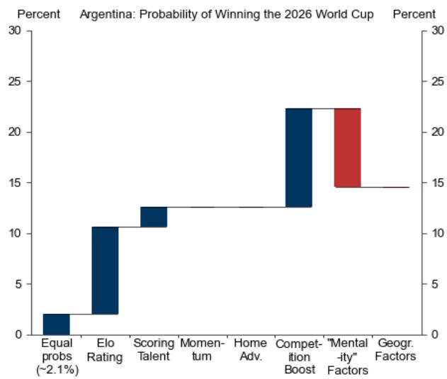

bar

Argentina: Probability of Winning the 2026 World Cup
| Factor | Percent (%) |
| :--- | :--- |
| Equal probs (~2.1%) | 2 |
| Elo Rating | 11 |
| Scoring Talent | 13 |
| Momentum | 13 |
| Home Adv. | 13 |
| Competition Boost | 22 |
| "Mental-ity" Factors | 22 |
| Geogr. Factors | 15 |

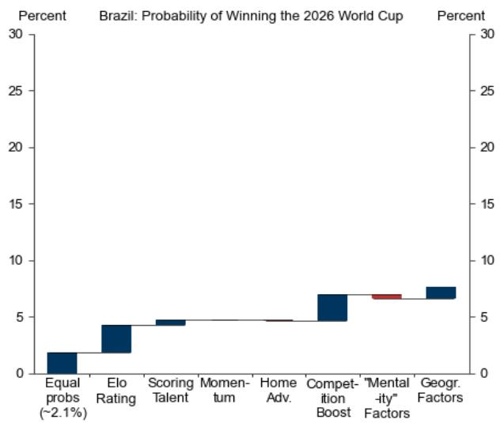

bar

| Factor               | Percent |
| -------------------- | ------- |
| Equal probs (~2.1%)   | 2       |
| Elo Rating           | 4       |
| Scoring Talent       | 5       |
| Momentum             | 5       |
| Home Adv.            | 5       |
| Competition Boost    | 7       |
| "Mental-ity" Factors | 7       |
| Geogr. Factors      | 8       |

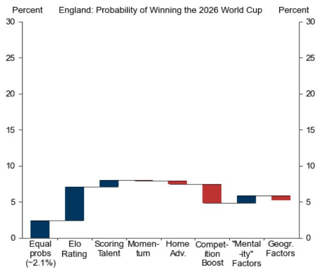

bar

| Factor               | Percent |
| -------------------- | ------- |
| Equal probs (~2.1%)   | 2       |
| Elo Rating           | 7       |
| Scoring Talent       | 8       |
| Momentum             | 8       |
| Home Adv.            | 8       |
| Competition Boost    | 7       |
| "Mental-ity Factors" | 5       |
| Geogr. Factors      | 5       |

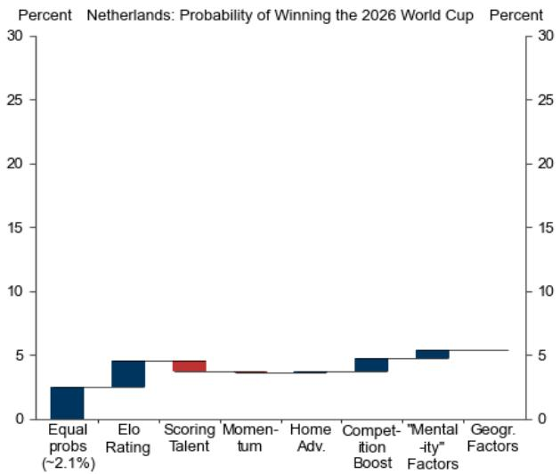

bar

Percent
Netherlands: Probability of Winning the 2026 World Cup
| Factor | Percent (%) |
| :--- | :--- |
| Equal probs (~2.1%) | 2.5 |
| Elo Rating | 4.5 |
| Scoring Talent | 4.0 |
| Momentum | 3.8 |
| Home Adv. | 3.9 |
| Competition Boost | 4.7 |
| "Mental-ity" Factors | 5.3 |
| Geogr. Factors | 5.4 |

Source: elorating.net, GS Global Investment Research

An important (and highly debated) factor in all major football tournaments is the draw. We leverage our model to see how the draw affects the probabilities of reaching the final by re-running simulations in a scenario where groups are randomised (conditional on seeding, Exhibit 9). Our analysis suggests that Germany was the least lucky team in the draw as they are predicted to face France in the round of 16. Argentina was, according to our model, the luckiest as they are likely to face top-ranked Spain only in the final.

Exhibit 9: The Luck of the Draw   
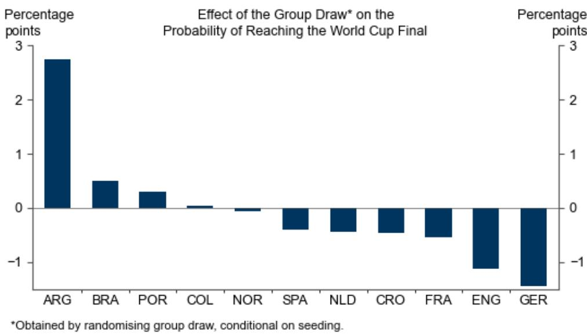

bar

| Country | Percentage points |
| ------- | ----------------- |
| ARG     | 2.8               |
| BRA     | 0.5               |
| POR     | 0.3               |
| COL     | 0.1               |
| NOR     | -0.1              |
| SPA     | -0.4              |
| NLD     | -0.5              |
| CRO     | -0.6              |
| FRA     | -0.7              |
| ENG     | -1.2              |
| GER     | -1.6              |

We randomise group composition, conditional on having in all groups one team from each pot.

Source: GS Global Investment Research

We can also compare our probabilities to the market (Exhibit 10). We are overweight Spain and Argentina and underweight England and Portugal.

While our expanded model accounts for a larger set of factors than our previous attempts, it remains largely blind to the non-attacking talent (e.g. the depth of the French and Portuguese midfield and wings or the role of good keepers in a penalty shootout), health (will Lamine Yamal's recent injury weigh on his performance in the World Cup?), individual momentum (will the many French players at PSG benefit from their deep run in the Champions League? Will Messi and Ronaldo be competitive after a few years away from top European football?), or managerial experience (an Ancelotti effect for Brazil?). Furthermore, our model treats the number of goals scored by each team involved in a game as independent distributions, which leads to several predicted draws.

Exhibit 10: Comparing Our Model Probabilities to the Market   
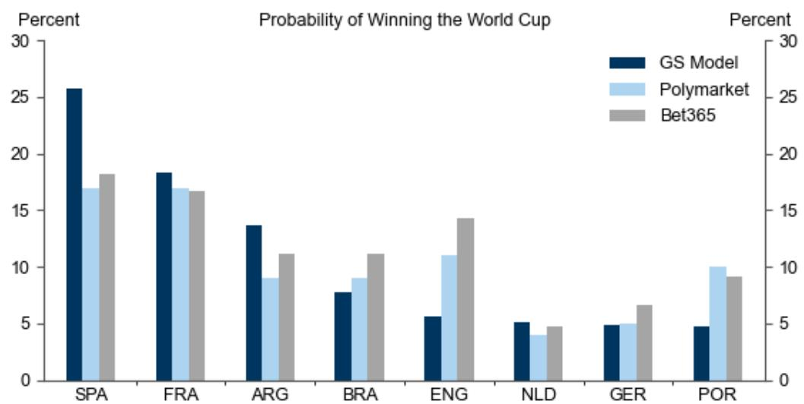

bar

Probability of Winning the World Cup
| Sport | GS Model (%) | Polymarket (%) | Bet365 (%) |
| :--- | :--- | :--- | :--- |
| SPA | 25.8 | 17.0 | 18.2 |
| FRA | 18.4 | 17.0 | 16.7 |
| ARG | 13.8 | 9.1 | 11.2 |
| BRA | 7.9 | 9.0 | 11.2 |
| ENG | 5.6 | 11.0 | 14.4 |
| NLD | 5.1 | 3.9 | 4.8 |
| GER | 4.9 | 5.0 | 6.7 |
| POR | 4.8 | 10.0 | 9.2 |

Note: Data retrieved on May 29.   
Source: GS Global Investment Research, Polymarket, Bet365

Another useful check is to evaluate what our model would have suggested ahead of the 2022 World Cup. The predicted winning probabilities ahead of the start of the tournament would have been Brazil (24% chances of winning), followed by Argentina (21%) and France (19%). This broadly mirrored the bookmakers' implied odds of Brazil (18%), Argentina (13%), and France (12%).

We can also look at the correlation between actual and predicted goal difference historically, which is ultimately what our model is trained to predict. The correlation of our model is $49\%$ across all World Cup games since 1978, $43\%$ in 2018, and $45\%$ in 2022. While the correlation remains modest—given football's inherent unpredictability—the model improved over previous frameworks (Exhibit 11).

Exhibit 11: Assessing Our Model's Past Performance   
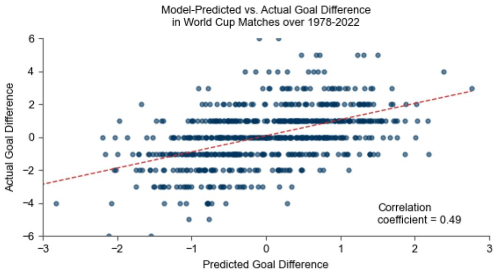

scatter

| Predicted Goal Difference | Actual Goal Difference |
| ------------------------- | ---------------------- |
| -3.0                      | -4.0                   |
| -2.5                      | -2.0                   |
| -2.0                      | 0.0                    |
| -1.5                      | 2.0                    |
| -1.0                      | 0.0                    |
| -0.5                      | 4.0                    |
| 0.0                       | 6.0                    |
| 0.5                       | 4.0                    |
| 1.0                       | 5.0                    |
| 1.5                       | 4.0                    |
| 2.0                       | 2.0                    |
| 2.5                       | 4.0                    |
| 3.0                       | 3.0                    |

Source: GS Global Investment Research

Throughout the tournament, in a short comment after each match day, we will be commenting on how the incoming results compare to our predictions, preview the games of the following day, and update the most-likely and probabilistic predictions of our model.

# Jan Hatzius

Giovanni Pierdomenico

Sven Jari Stehn

# Appendix: The Group Stage Standings

We leverage official FIFA rules to tie breaks and rank the 3rd-placed teams, with the top 8 advancing to the round of 32. In the event our model is unable to distinguish between teams using FIFA rules (e.g. in a group with predicted draws in all games on a rounded basis, given we don't model red and yellow cards), we rely on the predicted unrounded goal difference.

# Exhibit 12: The Predicted Group Standings

FIFA World Cup 2026 - Final Group Standings (Prediction as of 29 May 2026)   
  
Qualified (1st / 2nd)

  
Qualified as best-3rd

  
Eliminated

<table><tr><td colspan="7">Group A</td></tr><tr><td>Pos</td><td>Team</td><td>GF</td><td>GA</td><td>GD</td><td>Pts</td><td>Q</td></tr><tr><td>1</td><td>Mexico</td><td>6</td><td>2</td><td>+4</td><td>9</td><td>Top-2</td></tr><tr><td>2</td><td>South Korea</td><td>3</td><td>4</td><td>-1</td><td>2</td><td>Top-2</td></tr><tr><td>3</td><td>Czechia</td><td>3</td><td>4</td><td>-1</td><td>2</td><td>Best-3rd</td></tr><tr><td>4</td><td>South Africa</td><td>2</td><td>4</td><td>-2</td><td>2</td><td>Out</td></tr></table>

<table><tr><td colspan="7">Group B</td></tr><tr><td>Pos</td><td>Team</td><td>GF</td><td>GA</td><td>GD</td><td>Pts</td><td>Q</td></tr><tr><td>1</td><td>Canada</td><td>5</td><td>3</td><td>+2</td><td>7</td><td>Top-2</td></tr><tr><td>2</td><td>Switzerland</td><td>4</td><td>2</td><td>+2</td><td>5</td><td>Top-2</td></tr><tr><td>3</td><td>Bosnia and H.</td><td>3</td><td>4</td><td>-1</td><td>2</td><td>Best-3rd</td></tr><tr><td>4</td><td>Qatar</td><td>2</td><td>5</td><td>-3</td><td>1</td><td>Out</td></tr></table>

<table><tr><td colspan="7">Group C</td></tr><tr><td>Pos</td><td>Team</td><td>GF</td><td>GA</td><td>GD</td><td>Pts</td><td>Q</td></tr><tr><td>1</td><td>Brazil</td><td>6</td><td>3</td><td>+3</td><td>9</td><td>Top-2</td></tr><tr><td>2</td><td>Morocco</td><td>3</td><td>4</td><td>-1</td><td>2</td><td>Top-2</td></tr><tr><td>3</td><td>Scotland</td><td>3</td><td>4</td><td>-1</td><td>2</td><td>Best-3rd</td></tr><tr><td>4</td><td>Haiti</td><td>3</td><td>4</td><td>-1</td><td>2</td><td>Out</td></tr></table>

<table><tr><td colspan="7">Group D</td></tr><tr><td>Pos</td><td>Team</td><td>GF</td><td>GA</td><td>GD</td><td>Pts</td><td>Q</td></tr><tr><td>1</td><td>Turkiye</td><td>3</td><td>3</td><td>+0</td><td>3</td><td>Top-2</td></tr><tr><td>2</td><td>USA</td><td>3</td><td>3</td><td>+0</td><td>3</td><td>Top-2</td></tr><tr><td>3</td><td>Paraguay</td><td>3</td><td>3</td><td>+0</td><td>3</td><td>Best-3rd</td></tr><tr><td>4</td><td>Australia</td><td>3</td><td>3</td><td>+0</td><td>3</td><td>Out</td></tr></table>

<table><tr><td colspan="8">Group E</td></tr><tr><td>Pos</td><td>Team</td><td></td><td>GF</td><td>GA</td><td>GD</td><td>Pts</td><td>Q</td></tr><tr><td>1</td><td>Germany</td><td></td><td>6</td><td>3</td><td>+3</td><td>9</td><td>Top-2</td></tr><tr><td>2</td><td>Ecuador</td><td></td><td>4</td><td>4</td><td>+0</td><td>4</td><td>Top-2</td></tr><tr><td>3</td><td>Ivory Coast</td><td></td><td>3</td><td>4</td><td>-1</td><td>2</td><td>Out</td></tr><tr><td>4</td><td>Curacao</td><td></td><td>3</td><td>5</td><td>-2</td><td>1</td><td>Out</td></tr></table>

<table><tr><td colspan="7">Group F</td></tr><tr><td>Pos</td><td>Team</td><td>GF</td><td>GA</td><td>GD</td><td>Pts</td><td>Q</td></tr><tr><td>1</td><td>Netherlands</td><td>5</td><td>3</td><td>+2</td><td>7</td><td>Top-2</td></tr><tr><td>2</td><td>Japan</td><td>3</td><td>3</td><td>+0</td><td>3</td><td>Top-2</td></tr><tr><td>3</td><td>Sweden</td><td>3</td><td>4</td><td>-1</td><td>2</td><td>Best-3rd</td></tr><tr><td>4</td><td>Tunisia</td><td>3</td><td>4</td><td>-1</td><td>2</td><td>Out</td></tr></table>

<table><tr><td colspan="7">Group G</td></tr><tr><td>Pos</td><td>Team</td><td>GF</td><td>GA</td><td>GD</td><td>Pts</td><td>Q</td></tr><tr><td>1</td><td>Belgium</td><td>3</td><td>3</td><td>+0</td><td>3</td><td>Top-2</td></tr><tr><td>2</td><td>Iran</td><td>3</td><td>3</td><td>+0</td><td>3</td><td>Top-2</td></tr><tr><td>3</td><td>Egypt</td><td>3</td><td>3</td><td>+0</td><td>3</td><td>Best-3rd</td></tr><tr><td>4</td><td>New Zealand</td><td>3</td><td>3</td><td>+0</td><td>3</td><td>Out</td></tr></table>

<table><tr><td colspan="7">Group H</td></tr><tr><td>Pos</td><td>Team</td><td>GF</td><td>GA</td><td>GD</td><td>Pts</td><td>Q</td></tr><tr><td>1</td><td>Spain</td><td>8</td><td>0</td><td>+8</td><td>9</td><td>Top-2</td></tr><tr><td>2</td><td>Uruguay</td><td>2</td><td>4</td><td>-2</td><td>2</td><td>Top-2</td></tr><tr><td>3</td><td>Cape Verde</td><td>2</td><td>5</td><td>-3</td><td>2</td><td>Out</td></tr><tr><td>4</td><td>Saudi Arabia</td><td>2</td><td>5</td><td>-3</td><td>2</td><td>Out</td></tr></table>

<table><tr><td colspan="7">Group I</td></tr><tr><td>Pos</td><td>Team</td><td>GF</td><td>GA</td><td>GD</td><td>Pts</td><td>Q</td></tr><tr><td>1</td><td>France</td><td>7</td><td>2</td><td>+5</td><td>9</td><td>Top-2</td></tr><tr><td>2</td><td>Norway</td><td>4</td><td>4</td><td>+0</td><td>4</td><td>Top-2</td></tr><tr><td>3</td><td>Senegal</td><td>4</td><td>4</td><td>+0</td><td>4</td><td>Best-3rd</td></tr><tr><td>4</td><td>Iraq</td><td>2</td><td>7</td><td>-5</td><td>0</td><td>Out</td></tr></table>

<table><tr><td colspan="7">Group J</td></tr><tr><td>Pos</td><td>Team</td><td>GF</td><td>GA</td><td>GD</td><td>Pts</td><td>Q</td></tr><tr><td>1</td><td>Argentina</td><td>6</td><td>3</td><td>+3</td><td>9</td><td>Top-2</td></tr><tr><td>2</td><td>Austria</td><td>3</td><td>4</td><td>-1</td><td>2</td><td>Top-2</td></tr><tr><td>3</td><td>Algeria</td><td>3</td><td>4</td><td>-1</td><td>2</td><td>Out</td></tr><tr><td>4</td><td>Jordan</td><td>3</td><td>4</td><td>-1</td><td>2</td><td>Out</td></tr></table>

<table><tr><td colspan="7">Group K</td></tr><tr><td>Pos</td><td>Team</td><td>GF</td><td>GA</td><td>GD</td><td>Pts</td><td>Q</td></tr><tr><td>1</td><td>Portugal</td><td>5</td><td>3</td><td>+2</td><td>7</td><td>Top-2</td></tr><tr><td>2</td><td>Colombia</td><td>4</td><td>3</td><td>+1</td><td>5</td><td>Top-2</td></tr><tr><td>3</td><td>Uzbekistan</td><td>3</td><td>4</td><td>-1</td><td>2</td><td>Best-3rd</td></tr><tr><td>4</td><td>DR Congo</td><td>3</td><td>5</td><td>-2</td><td>1</td><td>Out</td></tr></table>

<table><tr><td colspan="7">Group L</td></tr><tr><td>Pos</td><td>Team</td><td>GF</td><td>GA</td><td>GD</td><td>Pts</td><td>Q</td></tr><tr><td>1</td><td>England</td><td>5</td><td>3</td><td>+2</td><td>7</td><td>Top-2</td></tr><tr><td>2</td><td>Croatia</td><td>5</td><td>3</td><td>+2</td><td>7</td><td>Top-2</td></tr><tr><td>3</td><td>Panama</td><td>3</td><td>5</td><td>-2</td><td>1</td><td>Out</td></tr><tr><td>4</td><td>Ghana</td><td>3</td><td>5</td><td>-2</td><td>1</td><td>Out</td></tr></table>

Source: GS Global Investment Research

# Disclosure Appendix

# Reg AC

We, Jan Hatzius, Giovanni Pierdomenico and Sven Jari Stehn, hereby certify that all of the views expressed in this report accurately reflect our personal views, which have not been influenced by considerations of the firm's business or client relationships.

Unless otherwise stated, the individuals listed on the cover page of this report are analysts in GS' Global Investment Research division.

Contributing Authors: Jan Hatzius GS & Co. LLC, Giovanni Pierdomenico GS International, Sven Jari Stehn GS International.

Unless otherwise stated, the individuals listed in the Contributing Authors disclosure of this report are analysts in GS' Global Investment Research division.

# Disclosures

# Regulatory disclosures

# Disclosures required by United States laws and regulations

See company-specific regulatory disclosures above for any of the following disclosures required as to companies referred to in this report: manager or co-manager in a pending transaction; 1% or other ownership; compensation for certain services; types of client relationships; managed/co-managed public offerings in prior periods; directorships; for equity securities, market making and/or specialist role. GS trades or may trade as a principal in debt securities (or in related derivatives) of issuers discussed in this report.

The following are additional required disclosures: Ownership and material conflicts of interest: GS policy prohibits its analysts, professionals reporting to analysts and members of their households from owning securities of any company in the analyst's area of coverage. Analyst compensation: Analysts are paid in part based on the profitability of GS, which includes investment banking revenues. Analyst as officer or director: GS policy generally prohibits its analysts, persons reporting to analysts or members of their households from serving as an officer, director or advisor of any company in the analyst's area of coverage. Non-U.S. Analysts: Non-U.S. analysts may not be associated persons of GS & Co. LLC and therefore may not be subject to FINRA Rule 2241 or FINRA Rule 2242 restrictions on communications with a subject company, public appearances and trading in securities covered by the analysts.

# Additional disclosures required under the laws and regulations of jurisdictions other than the United States

The following disclosures are those required by the jurisdiction indicated, except to the extent already made above pursuant to United States laws and regulations. Australia: GS Australia Pty Ltd and its affiliates are not authorised deposit-taking institutions (as that term is defined in the Banking Act 1959 (Cth)) in Australia and do not provide banking services, nor carry on a banking business, in Australia. This research, and any access to it, is intended only for “wholesale clients” within the meaning of the Australian Corporations Act, unless otherwise agreed by GS. In producing research reports, members of Global Investment Research of GS Australia may attend site visits and other meetings hosted by the companies and other entities which are the subject of its research reports. In some instances the costs of such site visits or meetings may be met in part or in whole by the issuers concerned if GS Australia considers it is appropriate and reasonable in the specific circumstances relating to the site visit or meeting. To the extent that the contents of this document contains any financial product advice, it is general advice only and has been prepared by GS without taking into account a client’s objectives, financial situation or needs. A client should, before acting on any such advice, consider the appropriateness of the advice having regard to the client’s own objectives, financial situation and needs. A copy of certain GS Australia and New Zealand disclosure of interests and a copy of GS’ Australian Sell-Side Research Independence Policy Statement are available at: https://www.goldmansachs.com/disclosures/australia-new-zealand/index.html. Brazil: Disclosure information in relation to CVM Resolution n. 20 is available at https://www.gs.com/worldwide/brazil/area/gir/index.html. Where applicable, the Brazil-registered analyst primarily responsible for the content of this research report, as defined in Article 20 of CVM Resolution n. 20, is the first author named at the beginning of this report, unless indicated otherwise at the end of the text. Canada: This information is being provided to you for information purposes only and is not, and under no circumstances should be construed as, an advertisement, offering or solicitation by GS & Co. LLC for purchasers of securities in Canada to trade in any Canadian security. GS & Co. LLC is not registered as a dealer in any jurisdiction in Canada under applicable Canadian securities laws and generally is not permitted to trade in Canadian securities and may be prohibited from selling certain securities and products in certain jurisdictions in Canada. If you wish to trade in any Canadian securities or other products in Canada please contact GS Canada Inc., an affiliate of The GS Group Inc., or another registered Canadian dealer. Hong Kong: Further information on the securities of covered companies referred to in this research may be obtained on request from GS (Asia) L.L.C. India: Further information on the subject company or companies referred to in this research may be obtained from GS (India) Securities Private Limited, Research Analyst - SEBI Registration Number INH000001493, 10th Floor, Ascent-Worli, Sudam Kalu Ahire Marg, Worli, Mumbai-400 025, India, Corporate Identity Number U74140MH2006FTC160634, Phone +91 22 6616 9000, Fax +91 22 6616 9001. GS may beneficially own 1% or more of the securities (as such term is defined in clause 2 (h) the Indian Securities Contracts (Regulation) Act, 1956) of the subject company or companies referred to in this research report. Investment in securities market are subject to market risks. Read all the related documents carefully before investing. Registration granted by SEBI and certification from NISM in no way guarantee performance of the intermediary or provide any assurance of returns to investors. GS (India) Securities Private Limited compliance officer and investor grievance contact details can be found at: https://www.goldmansachs.com/worldwide/india/documents/Grievance-Redressal-and-Escalation-Matrix.pdf, and a copy of the annual audit compliance report can be found at this link: https://publishing.gs.com/content/site/india-annual-compliance-report.html. Japan: See below. Korea: This research, and any access to it, is intended only for “professional investors” within the meaning of the Financial Services and Capital Markets Act, unless otherwise agreed by GS. Further information on the subject company or companies referred to in this research may be obtained from GS (Asia) L.L.C., Seoul Branch. New Zealand: GS New Zealand Limited and its affiliates are neither “registered banks” nor “deposit takers” (as defined in the Reserve Bank of New Zealand Act 1989) in New Zealand. This research, and any access to it, is intended for “wholesale clients” (as defined in the Financial Advisers Act 2008) unless otherwise agreed by GS. A copy of certain GS Australia and New Zealand disclosure of interests is available at: https://www.goldmansachs.com/disclosures/australia-new-zealand/index.html. Russia: Research reports distributed in the Russian Federation are not advertising as defined in the Russian legislation, but are information and analysis not having product promotion as their main purpose and do not provide appraisal within the meaning of the Russian legislation on appraisal activity. Research reports do not constitute a personalized investment recommendation as defined in Russian laws and regulations, are not addressed to a specific client, and are prepared without analyzing the financial circumstances, investment profiles or risk profiles of clients. GS assumes no responsibility for any investment decisions that may be taken by a client or any other person based on this research report. Singapore: GS (Singapore) Pte. (Company Number: 198602165W), which is regulated by the Monetary Authority of Singapore, accepts legal responsibility for this research, and should be contacted with respect to any matters arising from, or in connection with, this research. Taiwan: This material is for reference only and must not be reprinted without permission. Investors should carefully consider their own investment risk. Investment results are the responsibility of the individual investor. United Kingdom: Persons who would be categorized as retail clients in the United Kingdom, as such term is

defined in the rules of the Financial Conduct Authority, should read this research in conjunction with prior GS on the covered companies referred to herein and should refer to the risk warnings that have been sent to them by GS International. A copy of these risks warnings, and a glossary of certain financial terms used in this report, are available from GS International on request.

European Union and United Kingdom: Disclosure information in relation to Article 6 (2) of the European Commission Delegated Regulation (EU) (2016/958) supplementing Regulation (EU) No 596/2014 of the European Parliament and of the Council (including as that Delegated Regulation is implemented into United Kingdom domestic law and regulation following the United Kingdom's departure from the European Union and the European Economic Area) with regard to regulatory technical standards for the technical arrangements for objective presentation of investment recommendations or other information recommending or suggesting an investment strategy and for disclosure of particular interests or indications of conflicts of interest is available at https://www.gs.com/disclosures/europeanpolicy.html which states the European Policy for Managing Conflicts of Interest in Connection with Investment Research.

Japan: GS Japan Co., Ltd. is a Financial Instrument Dealer registered with the Kanto Financial Bureau under registration number Kinsho 69, and a member of Japan Securities Dealers Association, Financial Futures Association of Japan Type II Financial Instruments Firms Association, and Investment Management Association of Japan. Sales and purchase of equities are subject to commission pre-determined with clients plus consumption tax. See company-specific disclosures as to any applicable disclosures required by Japanese stock exchanges, the Japanese Securities Dealers Association or the Japanese Securities Finance Company.

# Global product; distributing entities

GS Global Investment Research produces and distributes research products for clients of GS on a global basis. Analysts based in GS offices around the world produce research on industries and companies, and research on macroeconomics, currencies, commodities and portfolio strategy. This research is disseminated in Australia by GS Australia Pty Ltd (ABN 21 006 797 897); in Brazil by GS do Brasil Corretora de Títulos e Valores Mobiliários S.A.; Public Communication Channel GS Brazil: 0800 727 5764 and / or contatogoldmanbrasil@gs.com. Available Weekdays (except holidays), from 9am to 6pm. Canal de Comunicação com o Público GS Brasil: 0800 727 5764 e/ou contatogoldmanbrasil@gs.com. Horário de funcionamento: segunda-feira à sexta-feira (exceto feriados), das 9h às 18h; in Canada by GS & Co. LLC; in Hong Kong by GS (Asia) L.L.C.; in India by GS (India) Securities Private Ltd.; in Japan by GS Japan Co., Ltd.; in the Republic of Korea by GS (Asia) L.L.C., Seoul Branch; in New Zealand by GS New Zealand Limited; in Russia by OOO GS; in Singapore by GS (Singapore) Pte. (Company Number: 198602165W); and in the United States of America by GS & Co. LLC. GS International has approved this research in connection with its distribution in the United Kingdom.

GS International (“GSI”), authorised by the Prudential Regulation Authority (“PRA”) and regulated by the Financial Conduct Authority (“FCA”) and the PRA, has approved this research in connection with its distribution in the United Kingdom.

European Economic Area: GS Bank Europe SE (“GSBE”) is a credit institution incorporated in Germany and, within the Single Supervisory Mechanism, subject to direct prudential supervision by the European Central Bank and in other respects supervised by German Federal Financial Supervisory Authority (Bundesanstalt für Finanzdienstleistungsaufsicht, BaFin) and Deutsche Bundesbank and disseminates research within the European Economic Area.

# General disclosures

This research is for our clients only. Other than disclosures relating to GS, this research is based on current public information that we consider reliable, but we do not represent it is accurate or complete, and it should not be relied on as such. The information, opinions, estimates and forecasts contained herein are as of the date hereof and are subject to change without prior notification. We seek to update our research as appropriate, but various regulations may prevent us from doing so. Other than certain industry reports published on a periodic basis, the large majority of reports are published at irregular intervals as appropriate in the analyst's judgment.

GS conducts a global full-service, integrated investment banking, investment management, and brokerage business. We have investment banking and other business relationships with a substantial percentage of the companies covered by Global Investment Research. GS & Co. LLC, the United States broker dealer, is a member of SIPC (https://www.sipc.org).

Our salespeople, traders, and other professionals may provide oral or written market commentary or trading strategies to our clients and principal trading desks that reflect opinions that are contrary to the opinions expressed in this research. Our asset management area, principal trading desks and investing businesses may make investment decisions that are inconsistent with the recommendations or views expressed in this research.

We and our affiliates, officers, directors, and employees will from time to time have long or short positions in, act as principal in, and buy or sell, the securities or derivatives, if any, referred to in this research, unless otherwise prohibited by regulation or GS policy.

The views attributed to third party presenters at GS arranged conferences, including individuals from other parts of GS, do not necessarily reflect those of Global Investment Research and are not an official view of GS.

Any third party referenced herein, including any salespeople, traders and other professionals or members of their household, may have positions in the products mentioned that are inconsistent with the views expressed by analysts named in this report.

This research is focused on investment themes across markets, industries and sectors. It does not attempt to distinguish between the prospects or performance of, or provide analysis of, individual companies within any industry or sector we describe.

Any trading recommendation in this research relating to an equity or credit security or securities within an industry or sector is reflective of the investment theme being discussed and is not a recommendation of any such security in isolation.

This research is not an offer to sell or the solicitation of an offer to buy any security in any jurisdiction where such an offer or solicitation would be illegal. It does not constitute a personal recommendation or take into account the particular investment objectives, financial situations, or needs of individual clients. Clients should consider whether any advice or recommendation in this research is suitable for their particular circumstances and, if appropriate, seek professional advice, including tax advice. The price and value of investments referred to in this research and the income from them may fluctuate. Past performance is not a guide to future performance, future returns are not guaranteed, and a loss of original capital may occur. Fluctuations in exchange rates could have adverse effects on the value or price of, or income derived from, certain investments.

Certain transactions, including those involving futures, options, and other derivatives, give rise to substantial risk and are not suitable for all investors. Investors should review current options and futures disclosure documents which are available from GS sales representatives or at https://www.theocc.com/about/publications/character-risks.jsp and https://www.goldmansachs.com/disclosures/cftc\_fcm\_disclosures. Transaction costs may be significant in option strategies calling for multiple purchase and sales of options such as spreads. Supporting documentation will be supplied upon request.

Differing Levels of Service provided by Global Investment Research: The level and types of services provided to you by GS Global Investment Research may vary as compared to that provided to internal and other external clients of GS, depending on various factors including your individual preferences as to the frequency and manner of receiving communication, your risk profile and investment focus and perspective (e.g., marketwide, sector specific, long term, short term), the size and scope of your overall client relationship with GS, and legal and regulatory constraints. As an example, certain clients may request to receive notifications when research on specific securities is published, and certain clients may request that specific data underlying analysts' fundamental analysis available on our internal client websites be delivered to them electronically through data feeds or otherwise. No change to an analyst's fundamental research views (e.g., ratings, price targets, or material changes to earnings estimates for equity securities), will be communicated to any client prior to inclusion of such information in a research report broadly disseminated through electronic publication to our internal client websites or through other means, as necessary, to all clients who are entitled to receive such reports.

All research reports are disseminated and available to all clients simultaneously through electronic publication to our internal client websites. Not all research content is redistributed to our clients or available to third-party aggregators, nor is GS responsible for the redistribution of our research by third party aggregators. For research, models or other data related to one or more securities, markets or asset classes (including related services) that may be available to you, please contact your GS representative or go to https://research.gs.com.

Disclosure information is also available at https://www.gs.com/research/hedge.html or from Research Compliance, 200 West Street, New York, NY 10282.

# © 2026 GS.

You are permitted to store, display, analyze, modify, reformat, and print the information made available to you via this service only for your own use. You may not resell or reverse engineer this information to calculate or develop any index for disclosure and/or marketing or create any other derivative works or commercial product(s), data or offering(s) without the express written consent of GS. You are not permitted to publish, transmit, or otherwise reproduce this information, in whole or in part, in any format to any third party without the express written consent of GS. This foregoing restriction includes, without limitation, using, extracting, downloading or retrieving this information, in whole or in part, to train or finetune a machine learning or artificial intelligence system, or to provide or reproduce this information, in whole or in part, as a prompt or input to any such system.