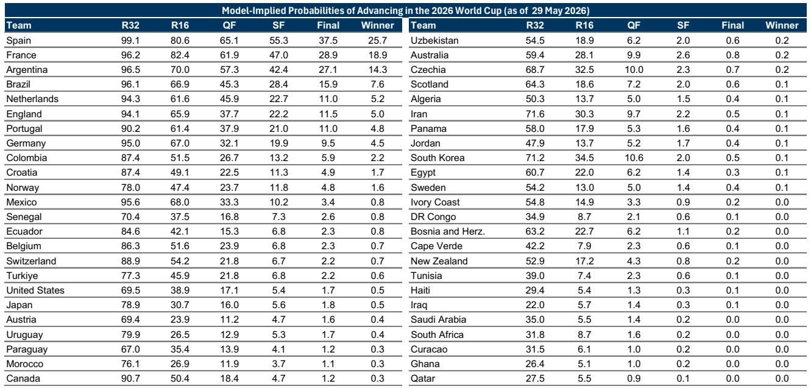
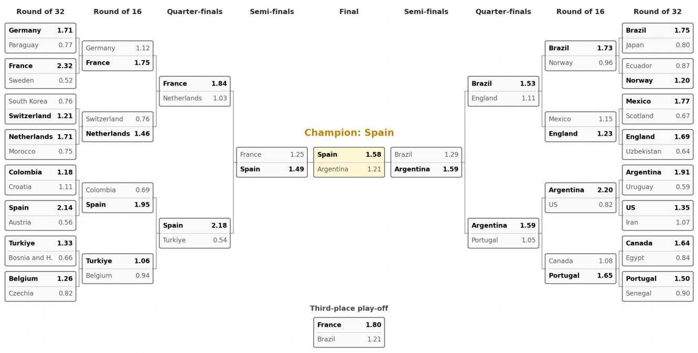

# Spain Is the Model’s Favorite, But the Real Question Is Whether Statistical Prediction Can Survive Football’s Chaos

The 2026 World Cup, hosted across the United States, Canada, and Mexico, represents more than a sporting event. It is a natural experiment in the limits of quantitative prediction under extreme uncertainty. A global investment bank’s statistical model, built on nearly 20,000 international matches since 1978, assigns Spain a 26% probability of lifting the trophy. France follows at 19%, Argentina at 14%, Brazil at 8%, and England at 5%. These numbers are precise. They are also fragile. The model’s own authors acknowledge that football’s inherent unpredictability limits statistical power. This tension—between rigorous methodology and the sport’s stubborn randomness—is the central analytical challenge for anyone trying to make sense of the tournament before a single ball is kicked.

The model is not a simple Elo ranking extrapolation. It incorporates scoring talent, team momentum, mentality effects, and geographical variables. It penalizes reigning champions for a statistically observed “winner’s slump.” It adjusts for altitude, temperature, and travel distance. It simulates 50,000 Monte Carlo draws to generate probabilities for each of the 104 matches. The result is a sophisticated machine that produces a clear modal forecast: Spain beats Argentina in the final, with Messi passing the torch to Lamine Yamal. But the model’s real value is not in the prediction itself. It is in what the prediction reveals about the structure of competitive advantage in international football—and about the blind spots that even the best models cannot see.

The argument of this article is straightforward: the model’s probabilistic framework is analytically superior to intuition or narrative, but its practical utility depends on understanding where it is strongest and where it is most likely to fail. For investors, strategists, and decision-makers who use probabilistic thinking in their own work, the World Cup model offers a case study in how to communicate uncertainty, how to weight multiple factors, and how to avoid the trap of false precision. The tournament will test the model. But the model also tests us: can we hold a probability judgment without mistaking it for certainty?

## The Model’s Edge Is Not in the Winner Prediction—It Is in the Weighting of Structural Factors

The core insight of the model is not that Spain is likely to win. It is that the determinants of match outcomes can be weighted with empirical precision. The Elo rating difference of 200 points adds 0.21 expected goals. Home advantage adds 0.38. Having two additional top scorers in the squad adds 0.10. The winner’s slump subtracts 0.12. Playing at high altitude subtracts 0.18. These are not arbitrary coefficients. They are derived from decades of match data. The model tells us that geography and psychology matter more than conventional wisdom admits, and that talent alone is insufficient without momentum.

This matters because most public discussion of World Cup outcomes relies on narrative—team spirit, star power, historical legacy. The model forces a different conversation. Argentina, the reigning champion, is penalized by the winner’s slump, a statistically robust phenomenon that has seen 7 of the last 12 champions fail to reach the final in the subsequent tournament. England underperforms its Elo rating because of historical tournament disappointment, a geographical headwind (likely facing Mexico in high-altitude Mexico City), and an unlucky draw. These are not opinions. They are patterns extracted from data.

For a strategic audience, the lesson is clear: competitive advantage is rarely a single factor. It is a weighted combination of many factors, some of which are invisible to the casual observer. The model’s contribution is to make those weights explicit and testable. Whether Spain actually wins is almost secondary. The framework itself is the product.

## The “Winner’s Slump” and the Geography Penalty Are the Model’s Most Counterintuitive and Powerful Variables

Two variables in the model stand out for their explanatory power and their divergence from public narrative. The first is the winner’s slump. Reigning champions underperform in the following World Cup by a statistically significant margin. This is not a curse or a conspiracy. It is a structural pattern: champions face heightened expectations, squad turnover, and often a loss of tactical surprise. Teams that win the World Cup become the team to beat, and opponents prepare specifically for them. Argentina’s 14% probability reflects this penalty. Without it, the model would likely rank them higher.

The second variable is geography. The model captures not just home advantage but also altitude, temperature difference, and travel distance. Mexico’s high-altitude stadiums reduce expected goals for low-altitude teams. England, which will likely face Mexico in Mexico City, suffers a measurable disadvantage. The model quantifies what fans intuit but cannot prove: that playing in unfamiliar conditions is not just uncomfortable—it is costly in expected goals.

These variables matter because they are difficult to hedge. A team cannot change its altitude profile or its champion status. They are structural constraints that shape the tournament bracket before a single match is played. For anyone trying to forecast the tournament, ignoring these factors is a mistake. The model’s willingness to penalize Argentina and England is a feature, not a bug.

## The Model’s Statistical Power Is Limited—And That Is the Most Honest Thing About It

The model’s authors are candid about its limitations. They note that the statistical power remains limited, which is “not a surprise given football’s inherent unpredictability.” This honesty is rare in quantitative research, where the temptation is to overstate confidence. The model explains a meaningful portion of match outcomes, but a large residual remains unexplained. Randomness—a deflected shot, a refereeing decision, a moment of individual brilliance—still dominates.

This has two implications. First, the model’s probabilities should be interpreted as conditional expectations, not as precise forecasts. A 26% probability for Spain means that if the tournament were played 100 times under identical conditions, Spain would win roughly 26 of them. That is a useful benchmark, but it also means Spain would lose 74 times out of 100. The most likely outcome is still unlikely in absolute terms.

Second, the model’s limitations create opportunities for alternative scenarios that the data cannot capture. What if a key player is injured? What if a team finds tactical innovation during the tournament? What if the bracket produces unexpected matchups that the model’s historical data does not cover? These are not flaws in the model. They are inherent features of the domain. The model is a tool for structuring uncertainty, not eliminating it.

## What the Report Does Not Fully Answer: How Momentum Shifts During the Tournament

The model updates Elo ratings and momentum variables recursively after each match. This is a sophisticated approach that allows the model to learn from the tournament as it unfolds. But the report does not fully explore how momentum effects compound over the course of a short, high-stakes competition. A team that wins its group with dominant performances may enter the knockout stage with significantly different momentum than a team that scrapes through. The model captures this mechanically, but the interaction between momentum, confidence, and opponent quality is not fully decomposed.

An open question is whether the model’s recursive updating is sufficient to capture the nonlinear dynamics of tournament football. In a league season, momentum regresses to the mean. In a World Cup, momentum can snowball. A single upset can reshape the entire bracket. The model’s Monte Carlo simulation captures this probabilistically, but the report does not provide a sensitivity analysis of how much momentum effects drive the variance in outcomes. This is a natural area for further research, and it is one reason why readers who want to understand the model’s full behavior should examine the original charts and simulation outputs.

## A Decision Framework for Readers: How to Use the Model Without Being Misled by It

For readers who want to apply the model’s insights without falling into the trap of false precision, a simple decision framework is useful. First, distinguish between structural factors and random factors. The model’s variables—Elo ratings, home advantage, altitude, winner’s slump—are structural. They change slowly and can be assessed before the tournament. Random factors—injuries, refereeing, weather on match day—are unpredictable. The model accounts for them through the Poisson distribution, but they cannot be forecasted individually.

Second, use the model’s probabilities as a baseline, not a conclusion. If your own analysis suggests that a team is significantly over- or under-valued by the model, you should examine whether the model has missed a factor that you consider important. The model is transparent about its variables, so you can test your priors against its coefficients.

Third, pay attention to the model’s modal forecast, but do not anchor to it. The most likely path to victory is Spain beating Argentina in the final. But the probability of that exact path is low. The model’s real value is in the distribution of outcomes, not the single most likely one. If you are making a decision that depends on the tournament outcome—whether it is a betting strategy, a business contingency plan, or simply a conversation with colleagues—you should consider the full range of probabilities, not just the point estimate.

Finally, update your view as the tournament progresses. The model will be re-run after each day of play. This is not a sign of weakness. It is the correct Bayesian approach. The model is a living tool, not a static prediction. Readers who engage with it dynamically will get far more value than those who treat it as a one-time forecast.

## Join the Community to Read the Full Report and Review the Original Charts

The model’s full power is visible only in the original charts and exhibits. The Elo versus FIFA rankings scatter plot reveals how different rating systems produce different hierarchies. The marginal effects bar chart shows exactly how much each variable contributes to expected goals. The group stage predictions and knockout bracket provide a game-by-game roadmap. These materials are too detailed to reproduce in full here, but they are essential for anyone who wants to understand the model’s logic rather than just its conclusions. Join the community to read the full report and review the original charts.

*This article is for learning and discussion only and does not constitute investment advice.*

Personal reading notes and learning share only. Not investment advice.

