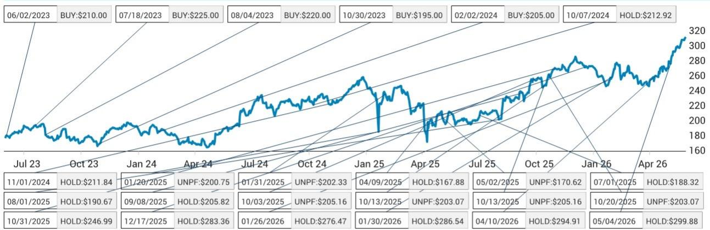
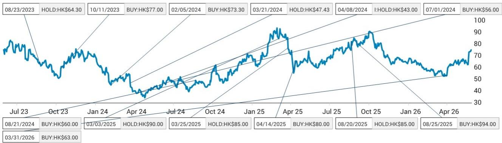
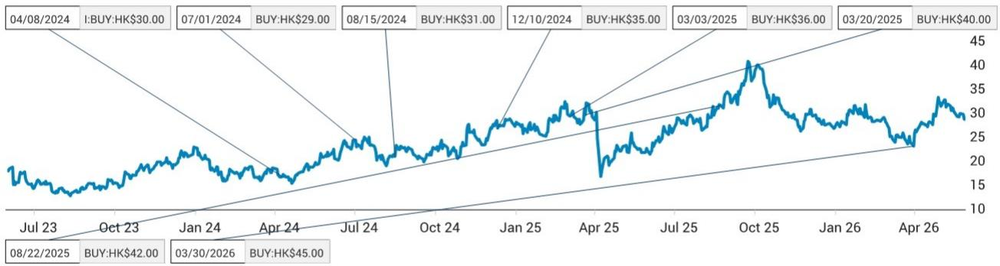

# 苹果拥抱COB封装，市场低估了供应链的“双赢”格局

2026年5月29日，舜宇光学股价单日飙升14%。市场将其解读为“舜宇即将打入苹果摄像头模组供应链”的单一利好。但某外资投行最新发布的研报揭示了一个更值得关注的判断：苹果正在系统性切换摄像头模组封装工艺，从沿用多年的FC（倒装芯片）转向COB（板上芯片）。这一变化不会导致现有供应商被替代，反而会催生一个“双赢”格局——舜宇有机会切入苹果，而高伟电子不仅不会受损，反而可能在COB/FC双重技术领先下巩固并扩大份额。

市场真正低估的不是舜宇能否进入苹果，而是COB工艺切换对整条供应链竞争格局的重新定义。

## 1. 苹果的封装技术路线切换，比想象中更加确定

研报通过渠道调研确认，苹果正在规划将COB封装方案逐步引入多个产品线。这不是实验室阶段的探索，而是有明确时间表的供应链部署。

具体路径是：苹果可能先在即将推出的可穿戴设备上采用COB方案——包括TWS和配备摄像头的AI眼镜。这些产品出货量相对较小，适合作为供应链磨合的试验场。随后，在2028年前后，COB方案可能被引入iPhone的潜望式摄像头和超广角摄像头。

这一判断的关键支撑在于COB技术在微型化方面的持续演进。过去几年，COB在缩小模组体积、降低Z轴高度方面取得了实质性突破，使其终于具备了替代FC方案的技术成熟度。而苹果在过去数十年间，对大多数产品一直坚持FC方案，此次转向意味着其内部对COB的评估已经通过了关键门槛。

当然，所有项目都存在不确定性。但研报的潜台词很清楚：方向已定，节奏可调，但不会回头。

## 2. 舜宇光学的机会不是“替代”，而是“扩容”

市场对舜宇的炒作逻辑很简单——进入苹果供应链，分食现有供应商的份额。但研报给出了一个更深刻的判断：舜宇进入苹果带来的潜在TAM（可寻址市场规模），可能不小于整个安卓阵营。

这一判断的底层逻辑是什么？COB方案对模组微型化的要求，恰好是舜宇长期积累的技术强项。舜宇在MOB/MOC（模塑封装）方案上一直处于行业领先地位，这些技术路径与COB在微型化方向上有高度协同性。苹果选择COB，本质上是选择了与舜宇技术路线更匹配的封装方案，而非舜宇在价格或产能上对现有供应商发起正面竞争。

更重要的是，舜宇在安卓市场的业务结构正在优化。研报估算，2025年舜宇在智能手机镜头收入中，混合镜头和潜望式镜头的占比分别约为10%和20%；在模组收入中，潜望式模组的占比约为20%。公司管理层此前已指引，2026年这些高端产品将有可观的收入增长。这意味着，即使苹果业务尚未放量，舜宇在安卓市场的产品结构升级已经为其提供了足够的业绩韧性。

对于AI光学这个更长期的赛道，研报认为舜宇可以利用其在棱镜、MLA（微透镜阵列）、FAU（光纤阵列单元）以及部分封装服务上的现有技术积累。更重要的是，舜宇拥有约210亿元人民币的净现金储备，这为其通过并购或股权投资快速切入关键客户供应链提供了财务弹药。

但这里有一个尚未完全回答的问题：舜宇在COB模组上的良率和成本控制，能否在苹果苛刻的验证体系下达到量产标准？研报没有给出明确答案，这将是未来12-18个月需要持续跟踪的关键变量。

## 3. 高伟电子不是受害者，而是COB时代的“双料冠军”

市场的一个常见误解是：舜宇进入苹果，高伟必然受损。但研报给出了相反的结论——高伟电子很可能成为这场技术切换的最大受益者之一。

理由在于：高伟电子在COB和FC两种封装技术上均处于领先地位。当苹果从FC向COB切换时，高伟不仅不会失去既有优势，反而可以凭借COB的技术积累争取更多项目。研报明确指出，舜宇更可能从其他现有供应商手中抢夺份额，而非直接威胁高伟。

这一判断与高伟电子的估值逻辑高度一致。研报维持对高伟未来几年实现强劲净利润复合增长率的判断，驱动力来自持续的市场份额提升和ASP（平均售价）增长。苹果摄像头模组在2028年可能迎来又一次重大升级（研报此前已单独分析），这为高伟提供了更大的增长空间。

此外，研报还点出了一个容易被忽视的看点：高伟并非纯粹的消费电子标的。在AI光学领域，高伟有可能与立讯精密合作，提供Micro LED作为CPO（共封装光学）方案。如果这一路径被验证，高伟将获得估值体系的重塑机会——从消费电子周期股向光学平台型公司切换。

但这里同样存在一个悬而未决的问题：高伟在COB方案下的毛利率是否会低于FC方案？技术切换初期通常伴随良率爬坡和成本压力，这对高伟的盈利能力会形成多大冲击？研报没有展开讨论，但这是投资者在评估高伟2027-2028年业绩时绕不开的变量。

## 4. 报告没有完全回答的三个关键问题

尽管研报提供了清晰的逻辑框架，但仍有几个关键问题需要进一步验证。

第一，COB方案的渗透率节奏。研报给出的时间表是2028年iPhone潜望式/超广角采用COB，但并未明确这一切换是一次性完成还是分代渐进。如果苹果选择在某一代iPhone上同时采用COB和FC两种方案，供应商的份额分配逻辑将更加复杂。

第二，舜宇的进入时点与规模。研报指出舜宇有机会进入苹果模组供应链，但没有给出具体的项目获取时间表或收入贡献预期。考虑到苹果供应链的验证周期通常在12-18个月以上，舜宇的苹果业务对业绩的真实贡献可能要等到2028年之后才能体现。

第三，COB方案对模组ASP的影响。COB封装在微型化方面有优势，但单位成本是否低于FC？如果COB方案带来模组ASP下降，即使份额提升，供应商的收入弹性也可能低于市场预期。研报对此没有展开量化分析。

这些未解问题，恰恰是深入理解这一供应链变迁的关键。它们决定了投资叙事的兑现节奏和幅度。

## 5. 投资者的观察框架：从“谁进谁出”转向“技术切换的节奏与弹性”

基于上述分析，我们建议投资者建立一个三层观察框架，而不是停留在“舜宇进入苹果”这一单一叙事上。

第一层，技术验证信号。关注苹果可穿戴设备（TWS、AI眼镜）的COB模组供应商名单。如果舜宇或高伟出现在首批供应商中，意味着COB技术的量产验证已经通过。这是最直接的催化剂。

第二层，良率与成本曲线。COB方案在批量生产中的良率表现，将直接影响供应商的毛利率和苹果的渗透决心。如果良率爬坡顺利，2028年iPhone切换的确定性将大幅提升；反之，时间表可能延后。

第三层，二阶竞争效应。舜宇进入苹果后，最可能被挤出份额的是哪些供应商？研报暗示“其他现有供应商”可能承压，但并未点名。这需要结合各家供应商的技术储备和产能布局来判断。如果被挤出的是某家规模较小的模组厂，对行业格局的影响有限；但如果影响到某家头部供应商，则可能引发更广泛的供应链重组。

对于高伟而言，核心观察指标不是舜宇的进展，而是自身在COB/FC双技术路线上的订单获取情况，以及AI光学业务（如Micro LED CPO方案）的客户验证进展。

这些观察框架的建立，不是为了给出一个非黑即白的投资结论，而是帮助读者在信息不完整的情况下，保持对关键变量的敏感度。

---

上述分析基于某外资投行发布的研报，我们提取了其核心逻辑并做了适度发散。但报告原文包含了更多关于公司估值、风险因素以及详细财务数据的讨论——包括三家公司的DCF估值模型假设、WACC和终端增长率设定，以及分析师对每家公司12个月目标价的具体推导过程。这些数据对于判断当前股价是否已经反映上述逻辑至关重要。

欢迎来我们的星球微信群继续讨论。我们会定期分享这类深度研报的原文与解读，并围绕供应链技术变迁、竞争格局重构等主题组织专题讨论。在群里，你可以获取完整报告PDF，也可以与其他产业研究者交换对COB渗透节奏、供应商份额变化等未解问题的看法。

Personal reading notes and learning share only. Not investment advice.

