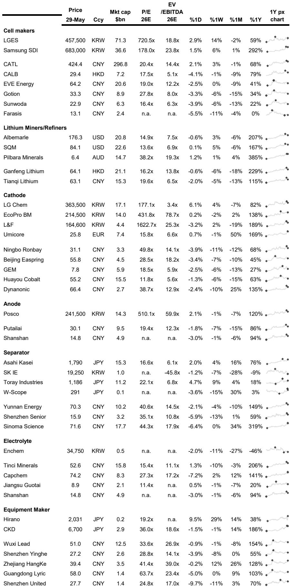
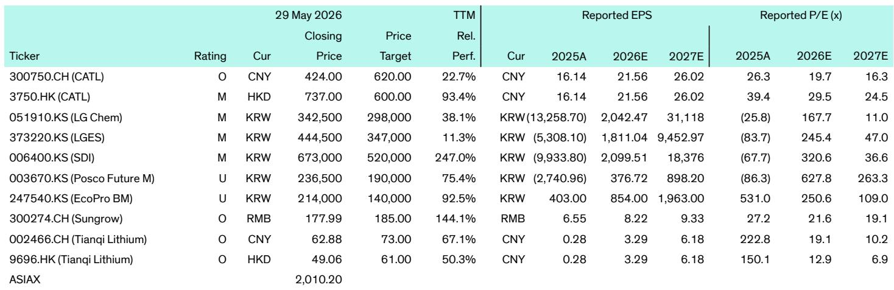
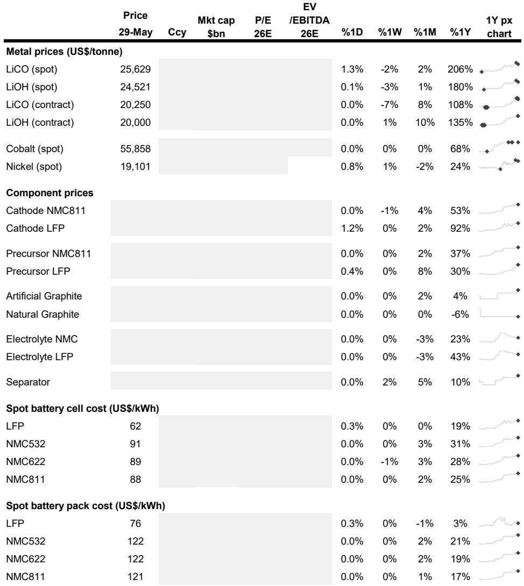

# 全球储能正在经历一场“供给重构”，而非简单的需求回暖

过去一年，电池金属价格大幅反弹，锂价同比涨幅超过200%，电池级LFP正极材料价格也上涨了近一倍。市场的主流叙事是“需求回来了”——电动车销量回暖、储能项目加速落地、AI数据中心拉动电力基础设施投资。但这份来自投行研报的周度追踪揭示了一个更值得关注的信号：真正改变行业格局的力量，不是需求端的一次性脉冲，而是供给端正在发生的结构性重组。

研报追踪的数十条动态中，最密集的信息点不是订单量，而是产能的重新布局、技术路线的切换、以及企业之间围绕“谁掌握下一代低成本产能”展开的卡位战。从LG Energy Solution出售合资工厂资产、SK Innovation剥离中国亏损隔膜业务，到Tinci Materials大举投资LFP正极材料、CATL加速换电网络落地，再到POSCO Future M将三元产线转向LFP——这些动作共同指向一个判断：全球储能产业正在从“规模竞赛”进入“成本与场景的双重分化期”。

理解这种分化的方向，比跟踪月度装机量更重要。因为前者决定的是，未来三年谁能留在牌桌上，谁又会被挤出。

## 1. 这轮变化真正考验的是企业能否把规模转化为议价权

研报中一个容易被忽略的细节是，LG Energy Solution以约25亿美元将其与本田的合资电池工厂建筑资产出售给本田美国子公司，同时通过租赁安排继续运营。这不是一次简单的资产变现。在电动车需求增速放缓的背景下，LGES选择将重资产从自己资产负债表上剥离，换取流动性，同时保持对产能的控制权。这是一种典型的“轻资产化”策略——规模不再是目的，现金流和灵活性才是。

类似的逻辑也出现在SK Innovation的决策中。它将以约5900万美元将中国常州隔膜工厂出售给Semcorp。这座工厂拥有约9.4亿平方米的年产能，但利用率低、持续亏损。SK的选择不是继续烧钱维持规模，而是果断退出，将隔膜业务重心转向波兰和其他核心区域。

这两件事放在一起看，结论很清楚：在电池产业链上，“拥有产能”和“拥有能盈利的产能”是两回事。当行业从高速增长期进入结构性调整期，企业必须回答一个更尖锐的问题——你的规模是否带来了成本优势、客户黏性或技术壁垒？如果答案是否定的，规模本身就是负债。

## 2. 技术路线切换正在重塑竞争格局，LFP的“逆袭”才刚刚开始

研报中一条容易被低估的信息是，POSCO Future M正在韩国浦项建设LFP正极材料工厂，计划2027年投产，年产能最终达到5万吨。更关键的是，它正在将部分现有的三元正极产线改造成LFP产线，今年就开始试生产。

POSCO Future M过去是高镍三元路线的坚定支持者。现在它的转向，不是技术路线的否定，而是对市场结构的回应。LFP电池在储能和入门级电动车中的渗透率正在快速提升，而三元材料在高端市场虽然仍有优势，但增长空间正在被压缩。POSCO的举动表明，即使是韩国头部材料企业，也开始认为“三元独大”的时代已经过去。

Tinci Materials的投资则从另一个角度印证了这一趋势。这家以电解质闻名的中国公司，计划投资约21亿元人民币在浙江建设年产16万吨的LFP正极材料工厂，重点生产高压实LFP——一种在能量密度、快充性能和循环寿命上都有改进的升级版LFP。Tinci的目标客户包括CATL、比亚迪和国轩高科。这意味着，LFP不再只是“便宜但性能一般”的选择，它正在通过技术迭代向中高端市场渗透。

对于投资者而言，需要关注的不是“LFP还是三元”的静态选择，而是LFP产业链上哪些企业能率先实现“高性能LFP”的规模化量产。这将是未来两年材料端最大的价值创造机会之一。

## 3. 储能正在从“电网附属品”变成“电网基础设施”，但商业模式仍不清晰

NR Electric在沙特阿拉伯交付的2.5 GW构网型储能项目，是目前全球最大的同类项目。它覆盖五个区域，包括超过2000台PCS（储能变流器），支持调频、调压、黑启动和弱电网稳定。这不是一个简单的“削峰填谷”项目，它正在承担传统火电机组和调相机组的角色。

但研报没有完全展开的问题是：这种构网型储能的商业模式是什么？谁来为它提供的“电网稳定服务”付费？在沙特，项目方是沙特电力公司（SEC），属于国家电网体系，商业模式更多是基础设施投资逻辑。但在市场化程度更高的电力市场，构网型储能的价值如何被定价、被回收，仍是一个开放问题。

这也是为什么LGES与DTE Energy签署的16亿美元、6 GWh储能供应协议值得关注。DTE Energy是美国密歇根州的公用事业公司，项目包括为AI数据中心供电。公用事业公司作为储能大客户，意味着储能正在从“项目制”走向“合同制”，收入的可预见性在提升。但即便如此，储能项目的投资回报率仍然高度依赖当地电价政策和辅助服务市场规则。

读者需要追问的是：你关注的储能公司，它的收入结构中，来自“容量市场”“辅助服务”“电能量套利”的比例各是多少？这三类收入的风险特征完全不同。

## 4. 换电模式在商用车领域的加速落地，正在打开一个新的“BaaS”估值逻辑

研报中两条关于换电的新闻值得放在一起读。一条是CATL与物流公司DST合作，在粤港澳大湾区启动轻型电动卡车换电网络，目前31个换电站，计划到2026年底扩展到140个，支持约5000辆电动卡车，换电时间约2分钟，运营成本比柴油车降低约50%。另一条是中国首个电动卡车换电站在池州投运，采用博世-三菱合资公司的BaaS方案，结合AI电池监控和云端分析。

这两件事的共同点在于：换电模式正在从乘用车（蔚来等）向商用车快速迁移。商用车对“补能时间”和“总拥有成本”的敏感度远高于乘用车，换电恰好同时解决这两个痛点。CATL的目标是在全国建设3000个换电站，这不是一个简单的补能网络，而是一个电池资产的运营平台。

如果CATL的换电网络真正铺开，它的商业模式将从“卖电池”变成“卖里程”——电池成为运营资产，CATL通过BaaS模式持续收取服务费。这种模式的核心优势在于：电池的残值管理、梯次利用和回收都可以由CATL统一完成，形成闭环。这将对电池企业的估值逻辑产生深远影响——从制造业的PE估值，转向平台型公司的用户价值估值。

但研报没有回答的一个关键问题是：换电站的资本开支密度极高，CATL的现金流能否支撑这种扩张？以及，在商用车换电领域，是否存在足够的标准化空间，避免重蹈乘用车换电标准不统一的覆辙？

## 5. 中国电池设备企业的全球化正在加速，但地缘风险没有完全定价

SINVO（深圳新诺自动化）在韩国龟尾建立电池设备工厂，为LGES的美国密歇根工厂供货，最终产品将用于特斯拉Megapack的LFP电池生产线。这是一个典型的“中国设备+韩国制造+美国终端”的供应链模式。

这背后反映的趋势是：中国电池设备企业正在通过“本地化生产”规避贸易壁垒，同时将技术能力输出到全球。SINVO的工厂目前以中国员工为主，计划随着需求增长扩大本地招聘。这种模式正在被更多中国设备企业复制。

但风险同样明显。研报没有深入讨论的是，如果美国或欧盟对中国电池设备实施更严格的进口限制或技术封锁，这些在海外设立的中国设备工厂是否会成为下一个制裁目标？目前市场对这一风险的定价可能偏低，因为设备端的贸易摩擦尚未成为焦点。但考虑到电池产业链的地缘政治敏感性，这一问题值得持续跟踪。

## 6. 报告尚未完全回答的关键问题：固态电池的商业化时间表是否被高估了？

JR Energy Solution与Factorial Energy的合作，以及Basquevolt发布的BQV400L锂金属电池（能量密度约402 Wh/kg），都指向一个方向：固态和半固态电池正在从实验室走向小批量生产。Basquevolt的产品被设计为“即插即用”方案，兼容现有产线，这降低了产业化门槛。

但研报没有给出一个明确的时间表。固态电池的商业化节奏，取决于三个变量的交集：成本能否降到可接受水平、循环寿命是否达到车规要求、以及是否有足够多的下游客户愿意为更高的能量密度支付溢价。目前来看，这三个变量都还有较大的不确定性。

对读者而言，最务实的做法是：把固态电池当作一个“期权”来跟踪，而不是一个“确定性”来押注。关注那些在固态电池上拥有实质性专利和试产线的公司，但不要因为固态电池的“远期故事”而忽略它们在现有LFP/三元业务上的竞争力和现金流。

---

以上讨论的五个结构性变化——企业从追求规模转向追求盈利、LFP技术路线的升级、储能商业模式的探索、换电BaaS的估值重估、以及中国设备企业的全球化——每一个都指向一个共同的问题：在供给重构的过程中，哪些公司真正拥有“不可替代的竞争优势”？

这份研报提供了大量的事实和信号，但它没有给出一个简单的答案。因为答案取决于你对每个变量的判断：成本曲线、技术迭代速度、地缘政治风险、以及下游需求的韧性。这些变量之间的互动，才是决定未来三年全球储能格局的核心。

如果你对这些未解问题感兴趣，欢迎来星球微信群里继续讨论。我们会在社群中分享更完整的研报原文、原始数据表格，以及围绕上述关键变量的深度推演。这里不做投资建议，只做事实和逻辑的拆解。

Personal reading notes and learning share only. Not investment advice.

