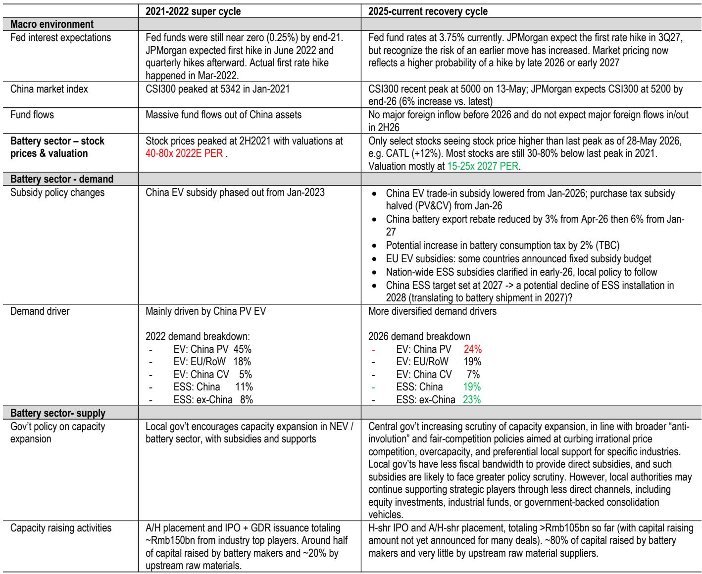
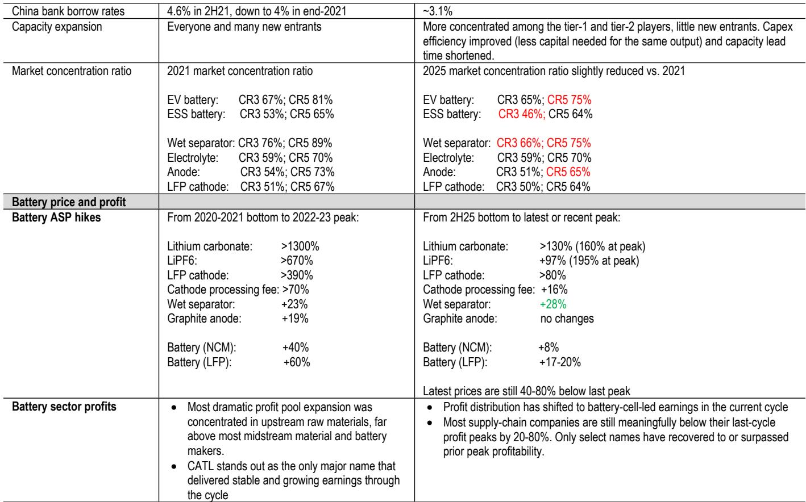
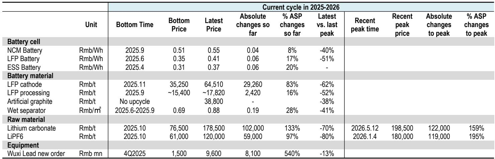

# The China Battery Sector Is Entering a Different Kind of Cycle: Why the Playbook Has Changed and What Investors Must Do Now

The global investment bank report argues that the China battery sector is not repeating its 2021-2022 supercycle. It is entering a fundamentally different recovery cycle, and investors who trade this phase using last cycle's logic will be disappointed. The 2021-2022 cycle was a once-in-a-decade event driven by near-zero interest rates, explosive EV penetration, aggressive capacity expansion, and extreme raw-material price inflation. The current cycle, by contrast, is more selective, more disciplined, and more dependent on volume-led earnings delivery rather than price-hike expectations. The key insight is this: stock prices peaked well ahead of earnings highs in the last cycle, and the market is likely to repeat that pattern. The opportunity now lies not in betting on further price increases, but in identifying companies that can deliver stable cashflow and earnings growth through volume, operating leverage, and technology leadership.

Why now matters. The first phase of the current rally, from the second half of 2025 to early 2026, was driven by a selling-price recovery across batteries and materials. That phase is largely complete. Prices have recovered from trough levels but remain 40-80% below their last-cycle peaks. The market has already priced in much of the ASP recovery. The next phase will be about earnings delivery, not price expectations. Investors who do not adjust their framework will find themselves buying into crowded trades just as the momentum fades. The report's central recommendation is clear: shift focus from "price hike expectations" to "volume-led cashflow and earnings delivery," and adopt a range-bound trading approach for most names while holding CATL as the sector's only true compounder.

## The Current Cycle Is a Recovery, Not a Supercycle, and Demands a Different Investment Framework

The distinction between a supercycle and a recovery cycle is not semantic. It is the most important analytical decision an investor can make. The 2021-2022 supercycle was characterized by a powerful alignment of forces: global interest rates near zero, rapid China EV penetration, aggressive capacity expansion, large capital inflows, and extreme raw-material price inflation. Battery stocks peaked in the second half of 2021 at roughly 40-80x forward P/E. The current cycle, by contrast, is supported by recovering utilization, more diversified demand drivers, and renewed pricing momentum, but it is occurring in a more disciplined capital-market and industry environment. Only CATL among the top players has exceeded its prior share-price peak. Most remain 30-80% below their 2021 highs and trade mostly at 15-25x 2027E P/E. The valuation gap alone signals that this is not a rerun.

The implications are profound. In a supercycle, nearly every company in the supply chain benefits. The rising tide lifts all boats, and the investment strategy is to buy the sector broadly and hold for the duration. In a recovery cycle, the tide lifts only those boats that have strong utilization, pricing power, and cash-flow resilience. The rest are at risk of being left behind as the market becomes more discerning. The report's analysis of profit distribution confirms this: in the last cycle, the most dramatic profit pool expansion was concentrated in upstream raw materials, especially lithium. In the current cycle, most supply-chain companies are still meaningfully below their last-cycle profit peaks. Only select names have recovered to or surpassed prior peak profitability. This is not a sector-wide recovery; it is a selective one.

## Demand Is More Diversified but Less Powerful, Making the Investment Narrative More Complex

In the 2021-2022 cycle, the demand story was simple: China passenger-vehicle EV adoption was exploding, and that single factor drove roughly 45% of total battery demand. The narrative was easy to understand, easy to communicate, and easy to price. The current cycle is structurally different. By 2026, China passenger EV is expected to contribute only 24% of total demand, while energy storage systems (ESS) are expected to make up more than 40%, up from less than 20% in 2022. The importance of EU and EV exports, as well as China commercial EV, has also increased. This diversification is positive for earnings resilience because the sector is no longer dependent on a single adoption curve. But it also makes the investment narrative less simple and less powerful. There is no single "EV penetration explosion" story to drive a broad rerating.

The report's data on price behavior in the two cycles illustrates this point vividly. In the 2021-2022 cycle, NCM battery prices rose by 40% from trough to peak over 16 months. In the current cycle, they have risen by only 15% and have already plateaued. LFP battery prices rose by 55% in the last cycle but have risen by only 20% in the current cycle and have already started to flatten. The pattern is consistent across the supply chain: price increases are meaningful but much smaller, and they are peaking earlier. This suggests that the market is already pricing in the recovery, and further upside from ASP alone is limited. The next leg of the cycle must come from volume growth, not price expansion.

## Policy Support Has Changed in Character, Creating Both Tailwinds and Headwinds

The policy environment in the current cycle is more complex and less uniformly supportive than in the last cycle. In 2021-2022, China EV subsidies were still in place and were only phased out from January 2023. Local governments actively encouraged NEV and battery capacity expansion with subsidies and support. The policy tailwind was clear and strong. In the current cycle, several policy changes are creating a more nuanced picture. China EV trade-in subsidies were lowered from January 2026, purchase-tax subsidies were halved for passenger and commercial vehicles, battery export rebates are being reduced, and there is a potential battery consumption-tax increase under discussion. At the same time, nationwide ESS subsidies were clarified in early 2026, but China's ESS target is set for 2027, raising the risk of a potential decline in ESS installations in 2028, which could translate into battery-shipment pressure in 2027.

On the supply side, the contrast is equally important. Central-government scrutiny has increased under broader "anti-involution" and fair-competition policies aimed at curbing irrational price competition, overcapacity, and preferential local support. Local governments also have less fiscal bandwidth to provide direct subsidies, although they may still support strategic players indirectly through equity investments, industrial funds, or government-backed consolidation vehicles. This creates a more disciplined supply environment, but it does not eliminate overcapacity risk. The report notes that current capacity expansion is more concentrated among tier-1 and tier-2 players, with fewer new entrants, improved capex efficiency, and shorter capacity lead times. This is positive for the sector's long-term health, but it also means that pricing power is more fragmented despite improving utilization.

## Capital Raising Patterns Reveal Where Bargaining Power Has Shifted

The pattern of capital raising in the two cycles is one of the most telling indicators of where bargaining power has shifted. In the 2021-2022 cycle, A/H placements, IPOs, and GDR issuance totaled around Rmb150 billion from top industry players, with roughly half raised by battery makers and around 20% by upstream raw-material companies. In the current cycle, H-share IPOs and A/H-share placements have already raised more than Rmb105 billion, but around 80% of the capital has come from battery makers, with very little from upstream raw-material suppliers. This reinforces the idea that bargaining power and investment focus have shifted toward battery cell makers, especially those with scale, utilization, technology, and cash-flow advantages.

The report's data on CATL is particularly striking. CATL has raised Rmb77 billion in this cycle, representing around 70% of total capital raised across the supply chain so far. This compares with Rmb45 billion in the previous cycle, or roughly 30% of the total. The concentration of capital raising at CATL is not random. It reflects the market's recognition that CATL is the only major battery supply-chain company that has demonstrated stable and solid earnings growth through the cycle, supported by scale, technology leadership, stronger bargaining power, stable unit profitability, and superior cash-flow generation. The capital market is voting with its wallet, and the message is clear: the future of the sector belongs to the scale leaders.

## What the Report Does Not Fully Answer: The Durability of the ESS Demand Story and the Risk of a 2028 Slowdown

The report provides a thorough analysis of the current cycle's demand drivers, but it leaves several important questions unanswered. The most critical is the durability of the ESS demand story. ESS is expected to make up more than 40% of total battery demand by 2026, up from less than 20% in 2022. This is a massive shift, and it is the primary reason why the current cycle is more diversified and potentially more resilient than the last one. However, the report also notes that China's ESS target is set for 2027, raising the risk of a potential decline in ESS installations in 2028, which could translate into battery-shipment pressure in 2027. This is a significant caveat. If ESS demand slows after 2027, the entire demand narrative for the sector could change. The report does not fully explore what a post-2027 ESS slowdown would mean for battery makers, especially those that are heavily exposed to the Chinese ESS market.

Another unanswered question is the impact of the potential battery consumption-tax increase. The report mentions it as a policy risk but does not provide a detailed analysis of its potential impact on margins, pricing, and demand. A consumption-tax increase could reduce the competitiveness of Chinese batteries in both domestic and export markets, especially if it is implemented at a time when margins are already under pressure from capacity expansion and pricing competition. The report also does not address the possibility of a trade war escalation that could affect Chinese battery exports to the EU and the US. These are real risks that could derail the current recovery cycle, and investors should monitor them closely.

## A Decision Framework for the Current Cycle: Focus on Volume-Led Earnings, Not Price Beta

The report's analysis provides a clear decision framework for investors. The first step is to distinguish between companies that can deliver volume-led earnings growth and those that are dependent on further price increases. The report's data on the current cycle's price behavior shows that ASP gains are already plateauing in many segments. Companies that need further price increases to meet earnings expectations are at risk of disappointment. The second step is to focus on utilization rates and cash-flow resilience. In a recovery cycle, companies with high utilization and strong cash-flow generation are better positioned to withstand pricing pressure and capacity expansion. The third step is to be disciplined on valuation. The report recommends a range-bound trading approach for material names and tier-2 battery makers: buy on weakness, take profit when expectations become crowded. This is not a buy-and-hold market for most names.

The report's recommendation for CATL is the clearest signal of all. CATL is the only major battery supply-chain company that has demonstrated stable and solid earnings growth through the cycle. It deserves to be held through the cycle as the sector's quality anchor. The rest of the supply chain should be traded more actively around valuation, ASP expectations, and EPS revision momentum. This is a nuanced and sophisticated framework that recognizes the sector's complexity. It is not a simple "buy the sector" call. It is a call to be selective, disciplined, and focused on earnings delivery rather than price expectations.

Join the community to read the full report and review the original charts.

*This article is for learning and discussion only and does not constitute investment advice.*

Personal reading notes and learning share only. Not investment advice.

