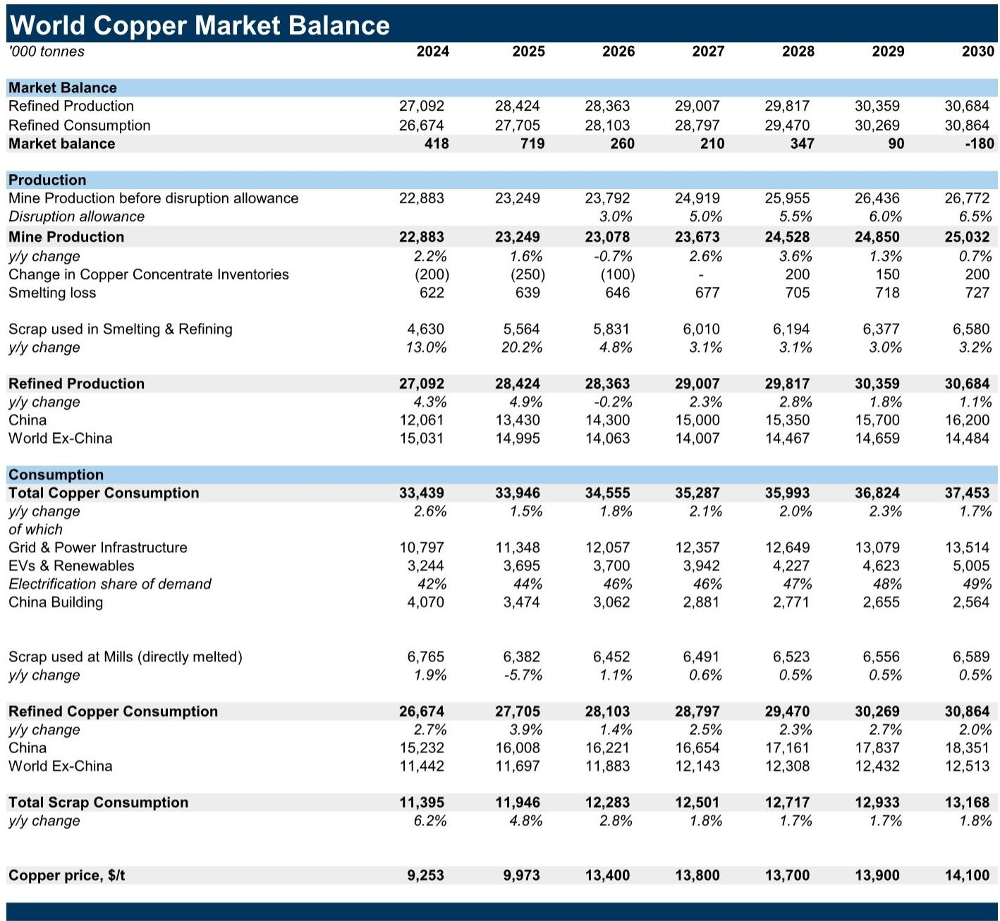
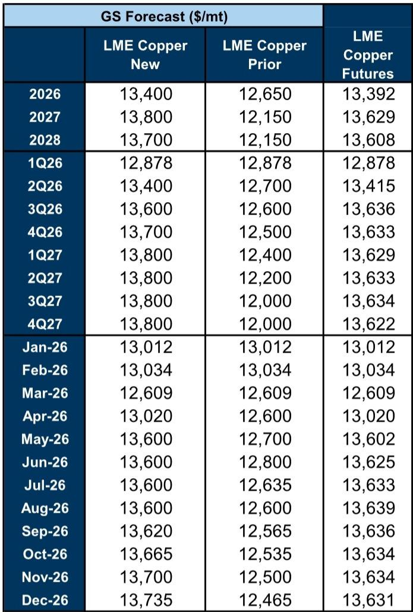
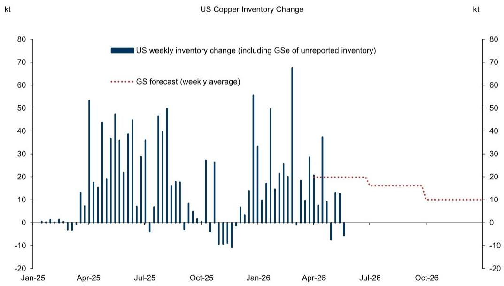

# 铜价真正的支撑不在需求故事，而在“非美市场”的供给收紧与库存错配

铜价在5月中旬触及每吨14,153美元的历史高点后有所回落，但截至当前仍维持在13,600美元附近，年初至今涨幅约10%。多数市场讨论将这一价格强势归结于AI算力扩张、能源转型与国防开支带来的长期需求叙事。然而，一份最新发布的投行研报给出了一个更具体、也更具操作价值的判断：铜价当前及未来两年的核心支撑，并非来自需求侧的宏大叙事，而是来自“非美市场”（ex-US）的供给持续低于预期，以及美国进口激增导致的全球铜库存地理错配。

这份报告上调了2026年底和2027年LME铜价预测至每吨13,735美元和13,800美元，较此前预测分别上调约9%和14%。上调的核心驱动力，不是需求预测的调升，而是供给侧的两次“意外”：矿山复产慢于预期，以及美国进口量超预期。这两个因素共同收紧了非美市场的供需平衡，而LME铜价恰恰由非美市场定价。

这意味着，对于关注铜资产定价的投资者而言，真正需要跟踪的变量，已经从“全球GDP增速”转向了“印尼与刚果金的矿山复产时间表”和“美国铜关税政策的落地节奏”。

## 1. 矿山复产一再延后，2026年全球供给预期被削减35万吨

报告最实质的调整，是对2026年全球矿山供给预测的下修。与2025年2月的预测相比，2026年全球矿山供给被削减了约35万吨，相当于全球矿山供给总量的约1.5%。这一削减主要集中两个矿山：印尼的Grasberg和刚果金的Kamoa-Kakula。报告明确指出，这两个矿山的产量恢复均慢于此前预期，且预计要到2028年才能恢复满产。

这意味着，2025年发生的矿山供应中断事件，其影响并非一次性冲击，而是将持续至少两年。市场此前可能低估了矿山复产的难度和周期。对于铜冶炼厂和下游加工企业而言，这意味着原料采购压力将持续存在，TC/RC费用可能长期维持在低位。对于投资者而言，这意味着铜价的下行风险中，来自供给侧的支撑比想象中更坚固。

## 2. 美国进口激增正在“虹吸”全球库存，非美市场赤字远超预期

如果说矿山供给削减是收紧全球总盘子，那么美国进口激增则是在“总盘子”内部制造了地理错配。报告显示，2026年上半年美国铜进口量已经超过此前的预测。即便在基准情景下——即假设今年不会宣布任何铜关税——美国库存预计仍将在2026年累积90万吨，较此前预测的55万吨大幅上调。

逻辑链条很清晰：美国进口的增加，意味着流向非美市场的铜减少。而LME铜价恰恰由非美市场的供需决定。报告将2026年非美市场的赤字预测从此前的6万吨大幅上调至64万吨，2027年也从4万吨赤字上调至17万吨赤字。这意味着，即便全球铜市场整体处于小幅过剩状态（2026年全球盈余约26万吨），非美市场仍将面临可观的供给缺口。

对于产业决策者而言，这一地理错配意味着：如果你在中国或欧洲采购铜，你将面临比全球均价更紧的现货市场；而如果你在美国有库存，则可能享受到结构性溢价。对于套利交易者而言，美国与非美市场的价差波动将成为未来两年的核心交易主题。

## 3. 铜价高于“公允价值”的部分，由投机仓位支撑，但短期内反转催化剂缺失

报告给出了一个关键的估值框架：基于非美市场供需平衡，2026年LME铜的公允价值约为每吨12,600美元，2027年约为13,800美元。当前13,600美元的铜价，高于2026年的公允价值，但低于2027年的公允价值。

报告将当前价格高于2026年公允价值的部分，归因于投机性仓位——尤其是“硬资产轮动”带来的资金流入。报告认为，短期内缺乏触发投机仓位反转的催化剂。原因有二：一是铜需求对能源安全、AI和国防等战略领域的敞口在增加，这些领域的需求对经济下行和高价格的敏感度较低；二是非美市场即将面临因美国进口加速而带来的进一步收紧。

这里需要指出一个尚未完全回答的问题：投机仓位本身就是一个双刃剑。报告承认，如果出现风险偏好大幅回落（例如霍尔木兹海峡长期关闭的情景），投机仓位的平仓可能将铜价打压至12,600美元附近。因此，铜价在2026年下半年存在一个“上有顶、下有底”的区间波动特征：底部由非美市场供需基本面支撑，顶部由投机情绪和关税不确定性共同决定。

## 4. 三个情景分析揭示：关税政策是最大的“二阶导”变量

报告给出了三个替代情景，其中两个与美国的铜关税政策直接相关。这本身就说明，当前铜价的核心不确定性，已经从基本面转向了政策面。

情景一：美国于2026年6月宣布从2027年1月起对铜征收关税。这将导致2026年下半年美国进口进一步加速，非美市场赤字扩大，铜价在2026年下半年可能突破14,000美元。但关税实施后，进口将停止，2027年铜价将回落至约13,900美元。

情景二：明确宣布不征收铜关税。这将导致2026年非美市场赤字缩小，2027年转为盈余，铜价在2027年可能回落至约12,800美元。

情景三：霍尔木兹海峡长期关闭。这是一个非关税风险情景。虽然供需两端会同时受到冲击（需求下降但硫磺短缺导致供给也下降），但全球风险偏好的大幅回落将导致投机仓位平仓，铜价在2026年下半年可能回落至12,600美元。

这三个情景的核心含义是：铜价在2026-2027年的走势，将高度依赖于美国铜关税政策的路径。而关税政策的“宣布时点”和“实施时点”之间的时间差，将制造出显著的交易窗口。目前市场隐含的关税概率是多少？报告没有直接给出，但提到“即使不宣布关税，市场仍会保留对未来关税的预期”，这意味着美国库存的累积可能不会完全停止。

## 5. 报告尚未完全回答的关键问题：中国的废铜供给能否成为“缓冲垫”？

报告提到了一个值得关注的细节：中国国内废铜产量同比下降12%，原因是增值税发票合规要求趋严，导致合规买家可采购的国内废铜量减少。这使得废铜无法像以往那样在铜价高位时替代精炼铜，从而加剧了精炼铜的供需紧张。

但这里有一个尚未展开的问题：如果铜价持续维持在高位，废铜供给是否会通过其他渠道（例如进口废铜）增加？报告提到“进口废铜需求强劲”，但未量化进口废铜能否弥补国内废铜的缺口。此外，中国废铜供给的合规化进程是短期扰动还是长期趋势？如果是长期趋势，那么精炼铜的需求将获得额外的结构性支撑。这一问题的答案，将直接影响铜价在高位区间的持续时间。

## 6. 对投资者的观察框架：从“看多还是看空”转向“跟踪三个变量”

基于这份报告的框架，投资者可以建立一个更精细的跟踪体系，而不是简单地判断铜价涨跌。

第一个变量：Grasberg和Kamoa-Kakula的复产进度。报告预计二者要到2028年才能满产。任何复产进度快于预期的信号，都将削弱供给端支撑。反之，如果复产进一步延后，则铜价上行风险加大。

第二个变量：美国铜进口量与库存变化。报告预测美国库存将在2026年累积90万吨。如果实际进口量持续超出这一预测，意味着非美市场赤字将进一步扩大，铜价上行压力增加。反之，如果进口放缓，则铜价可能向公允价值回归。

第三个变量：美国铜关税政策的信号。这是最大的“二阶导”变量。投资者需要关注的不只是关税是否落地，还包括：宣布时点（是否在2026年6月前）、实施时点（是否在2027年1月）、以及政策表述中是否留有“未来可能加征”的余地。这些细节将决定美国进口节奏和全球库存分布的变化路径。

这三个变量中，第一个和第二个具有较高的可跟踪性，第三个则取决于政治决策。但至少，这份报告给出了一个清晰的定价锚：2026年公允价值12,600美元，2027年公允价值13,800美元。当前价格偏离这些锚的程度，可以用来衡量市场情绪和投机仓位的贡献。

---

以上分析仅覆盖了这份报告的核心逻辑框架。报告还包含了对中国铜需求的韧性分析、LME价格与供需平衡的回归模型、以及情景分析中更详细的假设条件与测算路径。这些内容对于理解铜价在不同情景下的波动幅度和持续时间至关重要。

如果你希望进一步探讨：中国废铜供给的合规化趋势是否可持续？霍尔木兹海峡风险对全球铜供应链的具体传导机制是什么？或者，你想看到报告中对铜需求“战略部门”占比的详细测算——欢迎来星球微信群里继续讨论。我们会在群内分享完整报告的原始图表与数据，并围绕上述未解问题展开更深入的推演。

Personal reading notes and learning share only. Not investment advice.

