# G10 Consumer Dashboard: May 2026: Real Income Growth Slows in North America

We update our G10 consumer dashboard through April. G10 consumers generally continue to benefit from healthy balance sheets, but labor markets are more mixed, sentiment has worsened from already low levels following the start of the war in the Middle East, and we expect spending headwinds as higher energy prices erode real incomes in the next few months.

■ Household balance sheets remain strong. Household net worth as a share of income stands close to all time highs in the US, Japan and Australia, is around percentile 90 (P90) in Canada and the Euro area, and stands around P65 in the UK. Since we last published the dashboard, real net worth growth was little changed at P65 in the US and Japan (P65), P50 in the Euro area, and P40 in the UK, Canada and Australia. The saving rate declined to its lowest level since June 2022 in the US, and also declined in Canada (but remains elevated). Elsewhere, the saving rate remains elevated outside of Japan (Exhibit 10).

\- Consumer sentiment remains below its historical average across the G10 (Exhibit 13). In the US, the University of Michigan's index of consumer sentiment fell to its lowest level in the survey's history—with respondents mentioning that “high prices were eroding their personal finances”—and the Conference Board index of consumer confidence fell to its lowest level since May 2020, while the expectations component reached its lowest level since October 2011. In Australia, consumer sentiment improved by 3.5% but remains well below its historical average (83.0 vs 100.1).

Since we last published the dashboard, real income growth slowed in the US (P5)—partially reflecting a decline in payments from the Farmer Bridge Assistance program that had boosted personal income in March—and Canada (P20), moved sideways in the Euro area (P95), UK (P40) and Australia (P20) and improved in Japan (near all-time highs). In the UK, private sector pay growth slowed to $+3.0\%$ in March (vs. $+3.2\%$ in February) below consensus expectations. In Japan, basic wage growth for all workers slowed slightly but remained above $3\%$ ( $+3.2\%$ in March, vs. $+3.4\%$ ).

Real spending growth stands below historical averages across DMs, at P15 in Australia, P20 in the US, P35 in Canada, P40 in the Euro area and Japan and P45 in the UK. In Australia, nominal household spending declined by 1.1% mom in April, largely driven by a pullback in transport which the ABS noted “reflected widespread impacts and responses to the conflict in the Middle East”. In the US, real personal spending grew 0.1%, reflecting a 0.2% increase in real services

Megan Peters

+44(20)7051-2058

megan.l.peters@gs.com

GS International

spending but a $0.1\%$ decline in real goods spending. While spending growth has remained resilient so far (with real PCE growth tracking at a healthy $2.1\%$ year-over-year pace through March) we anticipate a slowdown in the months ahead as higher energy prices erode spending power.

Consumers benefit from healthy labor markets in the Euro area, Australia, and Japan, but labor markets have normalized in the US and are notably weaker in the UK and Canada. The unemployment rate is close to its historical low in the Euro area (6.2%), Japan (2.5%), and Australia (4.5%) but stands around P65 in the US (4.3%) P35 in the UK (5.0% 3mma) and P20 in Canada (6.9%). Since we last published the dashboard, the unemployment rate ticked down in the Euro area and Japan, moved sideways in the US and Japan, and increased in the UK, Canada and Australia.

\- Debt service ratios remain low by historical standards in the US (P75), the Euro area (P75), and Japan (P55) but are higher in Canada (P25), Australia (P40), and the UK (P45). House prices continued to decline in Canada (Exhibit 16). Outstanding mortgage debt growth stands above its historical averages in the US, Western Europe and Asia, but below in Canada.

Based on our percentile-based metrics, consumer health stands around P65 in the Euro area, followed by Japan and Australia around P50, the US around P45, and the UK around P40. Consumer health is weakest at around P30 in Canada. Since we last published the dashboard, our overall consumer health proxy deteriorated slightly in the UK.

We continue to expect a deterioration in overall DM consumer health in the next few months due to higher inflation and activity headwinds associated with the war in the Middle East.

# Consumer Snapshot

Exhibit 1: Balance Sheets Remain a Source of Strength, but Sentiment Is Weak   
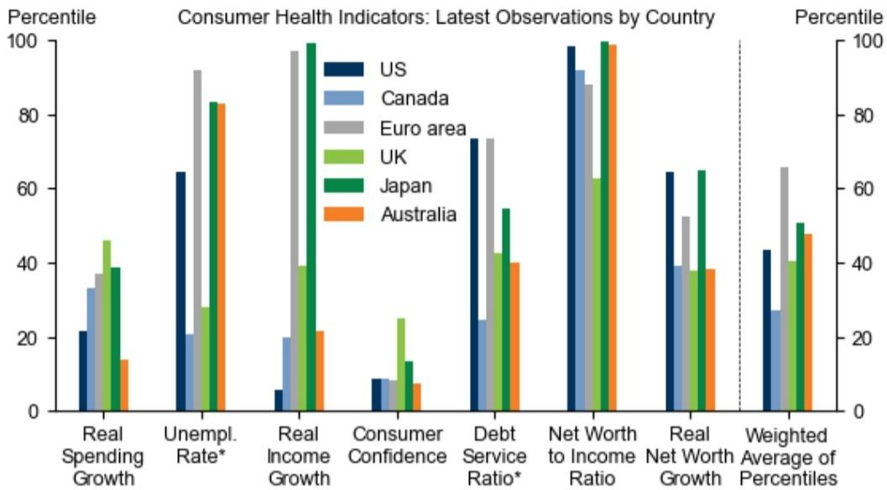

bar

Consumer Health Indicators: Latest Observations by Country
| Indicator | US (%) | Canada (%) | Euro area (%) | UK (%) | Japan (%) | Australia (%) |
|---|---|---|---|---|---|---|
| Real Spending Growth | 22 | 33 | 37 | 46 | 39 | 14 |
| Unempl. Rate* | 65 | 21 | 92 | 28 | 84 | 83 |
| Real Income Growth | 6 | 20 | 97 | 39 | 100 | 22 |
| Consumer Confidence | 9 | 9 | 9 | 25 | 14 | 8 |
| Debt Service Ratio* | 74 | 25 | 74 | 43 | 54 | 40 |
| Net Worth to Income Ratio | 99 | 92 | 88 | 63 | 100 | 100 |
| Real Net Worth Growth | 65 | 40 | 52 | 38 | 65 | 39 |
| Weighted Average of Percentiles | 44 | 28 | 66 | 41 | 51 | 48 |

\* Percentile is inverted. High percentiles correspond to positive outcomes (e.g., low unemployment). We compute the weighted average through April. Variables that are not observed or nowcasted for April are assumed to be unchanged relative to March when taking the average. We have excluded pension assets from UK net worth in measuring the net-worth-to-income ratio as of June 2025, see methodological notes below for further details. We have incorporated Morning Consult's Index of Consumer Sentiment in Canada as of October 2025.   
Source: Haver Analytics, GS Global Investment Research, Morning Consult

Exhibit 2: Real Income Growth Slowed in Canada but Improved in Japan; Real Spending Growth Worsened in Australia but Edged Up in Canada   
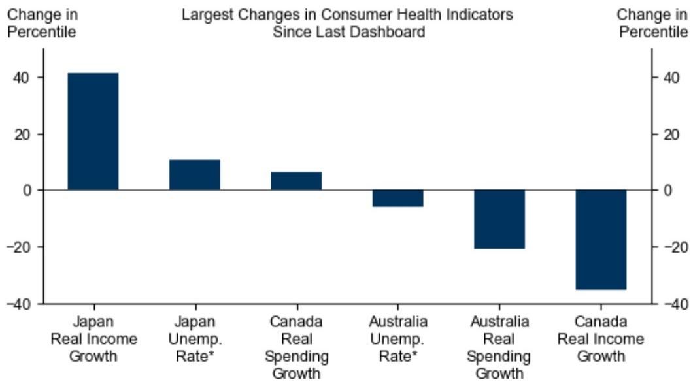

bar

Change in Percentile
| Indicator | Change in Percentile |
|---|---|
| Japan Real Income Growth | 42 |
| Japan Unemp. Rate* | 11 |
| Canada Real Spending Growth | 6 |
| Australia Unemp. Rate* | -5 |
| Australia Real Spending Growth | -20 |
| Canada Real Income Growth | -35 |

\* Percentile is inverted. High percentiles correspond to positive outcomes (i.e. low unemployment).   
Source: Haver Analytics, GS Global Investment Research

# Consumer Health Trends

Exhibit 3: Our Consumer Health Indicator Stands Around P45 in the US and P25 in Canada   
Consumer Health Indicators: North America   
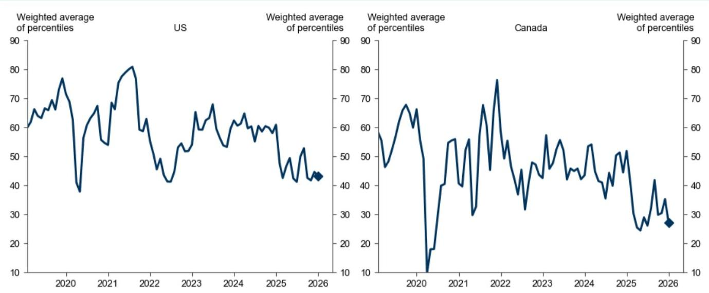

line

| Country | Year | Weighted average of percentiles |
|---------|------|---------------------------------|
| US      | 2020 | ~65                             |
| US      | 2021 | ~78                             |
| US      | 2022 | ~45                             |
| US      | 2023 | ~55                             |
| US      | 2024 | ~60                             |
| US      | 2025 | ~45                             |
| US      | 2026 | ~43                             |
| Canada  | 2020 | ~58                             |
| Canada  | 2021 | ~68                             |
| Canada  | 2022 | ~77                             |
| Canada  | 2023 | ~55                             |
| Canada  | 2024 | ~50                             |
| Canada  | 2025 | ~45                             |
| Canada  | 2026 | ~30                             |

We compute the weighted average through April. Variables that are not observed or nowcasted for April are assumed to be unchanged relative to March when taking the average.   
Source: Haver Analytics, GS Global Investment Research

Exhibit 4: Our Consumer Health Indicator Stands Around P65 in the Euro Area and P35 in the UK   
Consumer Health Indicators: Western Europe   
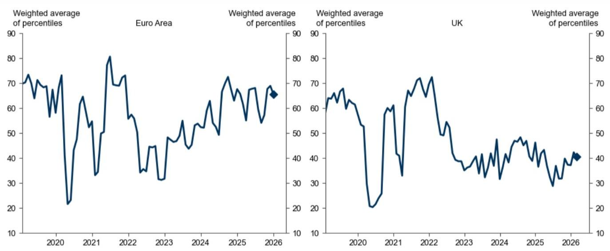

line

| Year | Euro Area Weighted average of percentiles | UK Weighted average of percentiles |
|------|------------------------------------------|-----------------------------------|
| 2020 | ~70                                      | ~65                               |
| 2021 | ~80                                      | ~70                               |
| 2022 | ~55                                      | ~45                               |
| 2023 | ~45                                      | ~35                               |
| 2024 | ~55                                      | ~40                               |
| 2025 | ~70                                      | ~45                               |
| 2026 | ~65                                      | ~40                               |

We compute the weighted average through April. Variables that are not observed or nowcasted for April are assumed to be unchanged relative to March when taking the average.   
Source: Haver Analytics, GS Global Investment Research

Exhibit 5: Our Consumer Health Indicator Stands Around P50 in Japan and Australia   
Consumer Health Indicators: Asia Pacific   
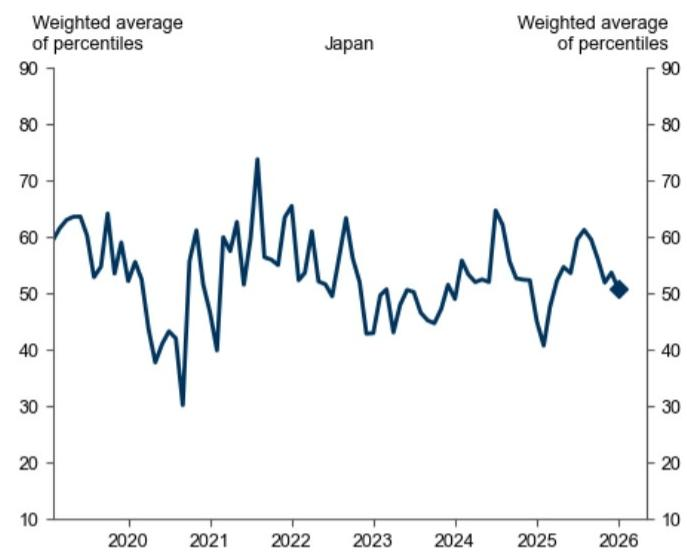

line

| Year | Weighted average of percentiles |
| ---- | ------------------------------ |
| 2020 | 60                             |
| 2021 | 30                             |
| 2022 | 75                             |
| 2023 | 45                             |
| 2024 | 55                             |
| 2025 | 40                             |
| 2026 | 50                             |

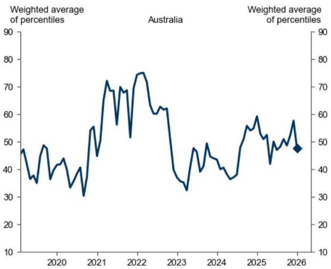

line

| Year | Weighted average of percentiles |
| ---- | ------------------------------- |
| 2020 | ~45                             |
| 2021 | ~55                             |
| 2022 | ~75                             |
| 2023 | ~35                             |
| 2024 | ~45                             |
| 2025 | ~60                             |
| 2026 | ~48                             |

We compute the weighted average through April. Variables that are not observed or nowcasted for April are assumed to be unchanged relative to March when taking the average.   
Source: Haver Analytics, GS Global Investment Research

# Spending Indicators

Exhibit 6: Real Spending Growth Stands Close to Its Historical Mean in the US but Real Services GVA Growth Remains Subdued in Canada   
Monthly Spending Indicators: North America   
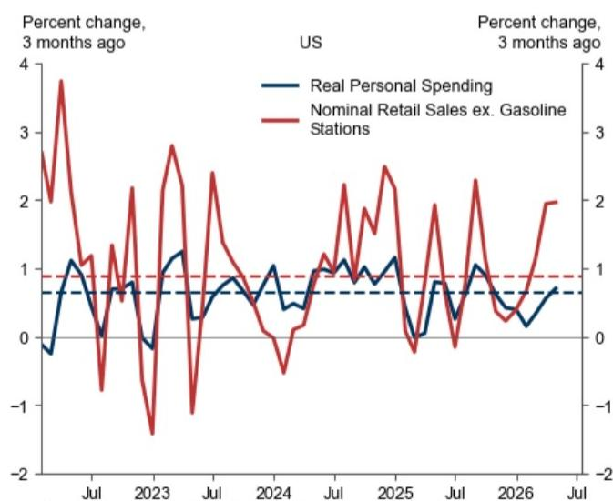

line

| Month | Real Personal Spending | Nominal Retail Sales ex. Gasoline Stations |
|-------|------------------------|---------------------------------------------|
| Jul   | ~0.5                   | ~3.8                                        |
| Aug   | ~0.8                   | ~2.0                                        |
| Sep   | ~1.0                   | ~1.2                                        |
| Oct   | ~0.5                   | ~-0.5                                       |
| Nov   | ~0.8                   | ~1.5                                        |
| Dec   | ~1.0                   | ~2.8                                        |
| Jan   | ~0.5                   | ~-1.5                                       |
| Feb   | ~0.8                   | ~-0.5                                       |
| Mar   | ~1.0                   | ~1.0                                        |
| Apr   | ~0.5                   | ~-0.5                                       |
| May   | ~0.8                   | ~1.5                                        |
| Jun   | ~1.0                   | ~2.5                                        |
| Jul   | ~0.5                   | ~-0.5                                       |
| Aug   | ~0.8                   | ~1.0                                        |
| Sep   | ~1.0                   | ~2.0                                        |
| Oct   | ~0.5                   | ~-0.5                                       |
| Nov   | ~0.8                   | ~1.5                                        |
| Dec   | ~1.0                   | ~2.5                                        |
| Jan   | ~0.5                   | ~-1.0                                       |
| Feb   | ~0.8                   | ~-0.5                                       |
| Mar   | ~1.0                   | ~1.0                                        |
| Apr   | ~0.5                   | ~-0.5                                       |
| May   | ~0.8                   | ~1.5                                        |
| Jun   | ~1.0                   | ~2.0                                        |
| Jul   | ~0.5                   | ~-0.5                                       |
| Aug   | ~0.8                   | ~1.0                                        |
| Sep   | ~1.0                   | ~2.5                                        |
| Oct   | ~0.5                   | ~-1.0                                       |
| Nov   | ~0.8                   | ~-0.5                                       |
| Dec   | ~1.0                   | ~1.5                                        |
| Jan   | ~0.5                   | ~-0.5                                       |
| Feb   | ~0.8                   | ~1.0                                        |
| Mar   | ~1.0                   | ~2.0                                        |
| Apr   | ~0.5                   | ~-1.0                                       |
| May   | ~0.8                   | ~-0.5                                       |
| Jun   | ~1.0                   | ~1.5                                        |
| Jul   | ~0.5                   | ~-0.5                                       |
| Aug   | ~0.8                   | ~1.0                                        |
| Sep   | ~1.0                   | ~2.5                                        |
| Oct   | ~0.5                   | ~-1.0                                       |
| Nov   | ~0.8                   | ~-0.5                                       |
| Dec   | ~1.0                   | ~1.5                                                        |
| Jan   | ~0.5                   | ~-0.5                                       |
| Feb   | ~0.8                   | ~1.0                                        |
| Mar   | ~1.0                   | ~2.0                                        |
| Apr   | ~0.5                   | ~-1.0                                       |
| May   | ~0.8                   | ~-0.5                                       |
| Jun   | ~1.0                   | ~1.5                                        |

Note: Dashed lines indicate the 2015-19 average growth rate.

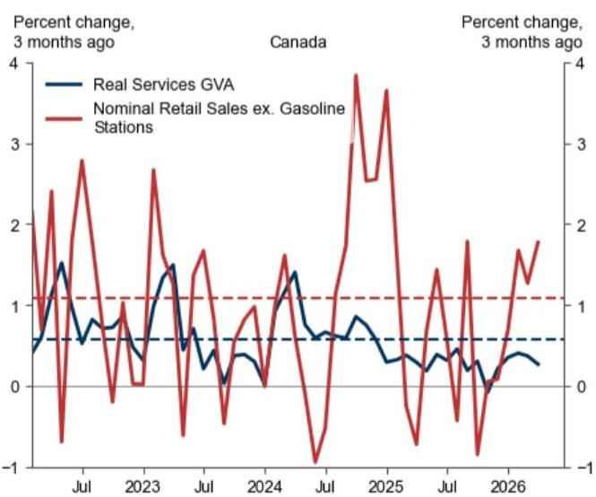

line

| Month | Real Services GVA | Nominal Retail Sales ex. Gasoline Stations |
|-------|-------------------|---------------------------------------------|
| Jul   | ~0.5              | ~2.5                                        |
| 2023  | ~1.5              | ~2.8                                        |
| Jul   | ~0.5              | ~1.5                                        |
| 2024  | ~0.5              | ~1.0                                        |
| Jul   | ~0.8              | ~3.8                                        |
| 2025  | ~0.5              | ~3.5                                        |
| Jul   | ~0.3              | ~1.5                                        |
| 2026  | ~0.2              | ~1.8                                        |

Source: Haver Analytics, GS Global Investment Research

Exhibit 7: Real Retail Sales Growth Is Negative in the Euro Area and UK   
Monthly Spending Indicators: Western Europe   
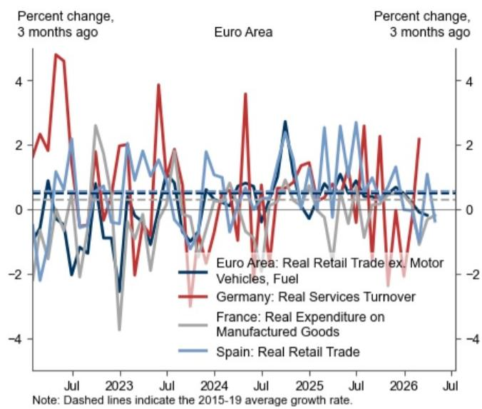

line

| Date       | Euro Area: Real Retail Trade ex: Motor Vehicles, Fuel | Germany: Real Services Turnover | France: Real Expenditure on Manufactured Goods | Spain: Real Retail Trade |
| ---------- | ---------------------------------------------------- | ---------------------------------- | --------------------------------------------- | ------------------------- |
| Jul 2023   | -1.5                                                 | 4.5                                | -2.0                                          | 2.0                       |
| Aug 2023   | -0.5                                                 | 2.0                                | -1.0                                          | 1.5                       |
| Sep 2023   | 0.0                                                  | 1.0                                | 0.5                                           | 0.0                       |
| Oct 2023   | -1.0                                                 | -1.5                               | -2.5                                          | -1.0                      |
| Nov 2023   | -2.0                                                 | 3.0                                | -3.0                                          | -2.0                      |
| Dec 2023   | -1.0                                                 | -1.0                               | -1.5                                          | -1.5                      |
| Jan 2024   | 0.5                                                  | 2.5                                | 0.0                                           | 1.0                       |
| Feb 2024   | -0.5                                                 | -1.0                               | -1.5                                          | -1.0                      |
| Mar 2024   | 1.0                                                  | 3.5                                | 0.5                                           | 1.5                       |
| Apr 2024   | -0.5                                                 | -1.5                               | -2.0                                          | -1.5                      |
| May 2024   | 0.5                                                  | 2.0                                | 0.0                                           | 1.0                       |
| Jun 2024   | -1.0                                                 | -1.0                               | -1.5                                          | -1.0                      |
| Jul 2024   | 1.5                                                  | 3.0                                | 1.0                                           | 2.0                       |
| Aug 2024   | -0.5                                                 | -1.5                               | -2.5                                          | -1.5                      |
| Sep 2024   | 0.5                                                  | 1.5                                | 0.5                                           | 1.0                       |
| Oct 2024   | -1.0                                                 | -1.0                               | -1.5                                          | -1.0                      |
| Nov 2024   | 1.0                                                  | 2.5                                | 1.0                                           | 1.5                       |
| Dec 2024   | -0.5                                                 | -1.5                               | -2.0                                          | -1.5                      |
| Jan 2025   | 0.5                                                  | 3.0                                | 1.5                                           | 2.0                       |
| Feb 2025   | -1.0                                                 | -1.0                               | -1.5                                          | -1.0                      |
| Mar 2025   | 1.5                                                  | 2.5                                | 1.0                                           | 1.5                       |
| Apr 2025   | -0.5                                                 | -1.5                               | -2.0                                          | -1.5                      |
| May 2025   | 0.5                                                  | 3.5                                | 1.5                                           | 2.0                       |
| Jun 2025   | -1.0                                                 | -1.0                               | -1.5                                          | -1.0                      |
| Jul 2025   | 1.0                                                  | 3.0                                | 1.0                                           | 1.5                       |
| Aug 2025   | -0.5                                                 | -1.5                               | -1.5                                          | -1.5                      |
| Sep 2025   | 0.5                                                  | 3.5                                | 1.5                                           | 2.0                       |
| Oct 2025   | -1.0                                                 | -1.0                               | -2.0                                          | -1.5                      |
| Nov 2025   | 1.5                                                  | 3.0                                | 1.0                                           | 1.5                       |
| Dec 2025   | -0.5                                                 | -1.5                               | -1.5                                          | -1.0                      |
| Jan 2026   | 0.5                                                  | 3.5                                | 1.5                                           | 2.0                       |
| Feb 2026   | -1.0                                                 | -1.0                               | -2.0                                          | -1.5                      |
| Mar 2026   | 1.0                                                  | 3.0                                | 1.0                                           | 1.5                       |
| Apr 2026   | -0.5                                                 | -1.5                               | -1.5                                          | -1.0                      |
| May 2026   | 0.5                                                  | 3.5                                | 1.5                                           | 2.0                       |
| Jun 2026   | -1.0                                                 | -1.0                               | -2.0                                          | -1.5                      |
| Jul 2026   | 1.5                                                  | 3.0                                | 1.0                                           | 1.5                       |
| Aug 2026   | -0.5                                                 | -1.5                               | -1.5                                          | -1.0                      |
| Sep 2026   | 0.5                                                  | 3.5                                | 1.5                                           | 2.0                       |
| Oct 2026   | -1.0                                                 | -1.0                               | -2.0                                          | -1.5                      |
| Nov 2026   | 1.0                                                  | 3.0                                | 1.0                                           | 1.5                       |
| Dec 2026   | -0.5                                                 | -1.5                               | -1.5                                          | -1.0                      |
Note: Dashed lines indicate the 2015-19 average growth rate.

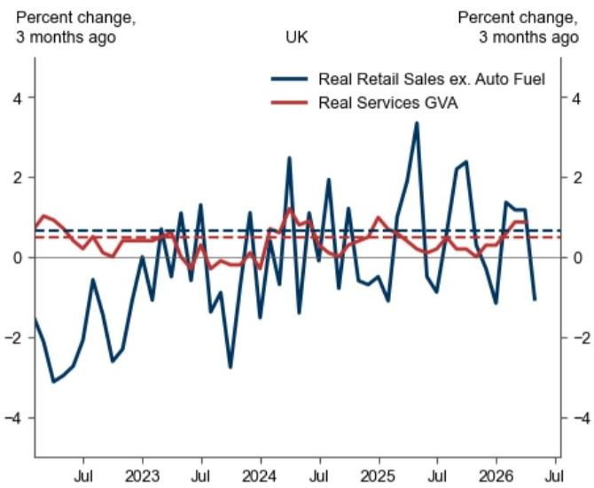

line

| Month | Real Retail Sales ex. Auto Fuel | Real Services GVA |
|-------|----------------------------------|-------------------|
| Jul   | -3.0                             | 1.0               |
| Aug   | -2.5                             | 0.8               |
| Sep   | -2.0                             | 0.6               |
| Oct   | -1.5                             | 0.4               |
| Nov   | -1.0                             | 0.2               |
| Dec   | -0.5                             | 0.0               |
| Jan   | 0.0                              | -0.2              |
| Feb   | 0.5                              | -0.4              |
| Mar   | 1.0                              | -0.6              |
| Apr   | 1.5                              | -0.8              |
| May   | 2.0                              | -1.0              |
| Jun   | 2.5                              | -1.2              |
| Jul   | 3.0                              | -1.4              |
| Aug   | 2.5                              | -1.2              |
| Sep   | 2.0                              | -1.0              |
| Oct   | 1.5                              | -0.8              |
| Nov   | 1.0                              | -0.6              |
| Dec   | 0.5                              | -0.4              |
| Jan   | 0.0                              | -0.2              |
| Feb   | -0.5                             | 0.0               |
| Mar   | -1.0                             | 0.2               |
| Apr   | -1.5                             | 0.4               |
| May   | -2.0                             | 0.6               |
| Jun   | -2.5                             | 0.8               |
| Jul   | -3.0                             | 1.0               |
| Aug   | -2.5                             | 0.8               |
| Sep   | -2.0                             | 0.6               |
| Oct   | -1.5                             | 0.4               |
| Nov   | -1.0                             | 0.2               |
| Dec   | -0.5                             | 0.0               |
| Jan   (Jul) | 0.0                            | -0.2              |
| Feb   (Jul) | 0.5                            | -0.4              |
| Mar   (Jul) | 1.0                            | -0.6              |
| Apr   (Jul) | 1.5                            | -0.8              |
| May   (Jul) | 2.0                            | -1.0              |
| Jun   (Jul) | 2.5                            | -1.2              |
| Jul   (Jul) | 3.0                           | -1.4              |
| Aug   (Jul) | 2.5                            | -1.2              |
| Sep   (Jul) | 2.0                            | -1.0              |
| Oct   (Jul) | 1.5                            | -0.8              |
| Nov   (Jul) | 1.0                            | -0.6              |
| Dec   (Jul) | 0.5                            | -0.4              |
| Jan   (Aug) | 0.0                            | -0.2              |
| Feb   (Aug) | -0.5                           | 0.0               |
| Mar   (Aug) | -1.0                           | 0.2               |
| Apr   (Aug) | -1.5                           | 0.4               |
| May   (Aug) | -2.0                           | 0.6               |
| Jun   (Aug) | -2.5                           | 0.8               |
| Jul   (Aug) | -3.0                           | 1.0               |
| Aug   (Aug) | -2.5                           | 0.8               |
| Sep   (Aug) | -2.0                           | 0.6               |
| Oct   (Aug) | -1.5                           | 0.4               |
| Nov   (Aug) | -1.0                           | 0.2               |
| Dec   (Aug) | -0.5                           | 0.0               |
| Jan   (Sep) | 0.0                            | -0.2              |
| Feb   (Sep) | 0.5                            | -0.4              |
| Mar   (Sep) | 1.0                            | -0.6              |
| Apr   (Sep) | 1.5                            | -0.8              |
| May   (Sep) | 2.0                            | -1.0              |
| Jun   (Sep) | 2.5                            | -1.2              |
| Jul   (Sep) | 3.0                            | -1.4              |
| Aug   (Sep) | 2.5                            | -1.2              |
| Sep   (Sep) | 2.0                            | -1.0              |
| Oct   (Sep) | 1.5                            | -0.8              |
| Nov   (Sep) | 1.0                            | -0.6              |
| Dec   (Sep) | 0.5                            | -0.4              |
| Jan   (Oct) | 0.0                            | -0.2              |
| Feb   (Oct) | -0.5                           | 0.0               |
| Mar   (Oct) | -1.0                           | 0.2               |
| Apr   (Oct) | -1.5                           | 0.4               |
| May   (Oct) | -2.0                           | 0.6               |
| Jun   (Oct) | -2.5                           | 0.8               |
| Jul   (Oct) | -3.0                           | 1.0               |
| Aug   (Oct) | -2.5                           | 0.8               |
| Sep   (Oct) | -2.0                           | 0.6               |
| Oct   (Oct) | -1.5                           | 0.4               |
| Nov   (Oct) | -1.0                           | 0.2               |
| Dec   (Oct) | -0.5                           | 0.0               |
| Jan   (Nov) | 0.0                            | -0.2              |
| Feb   (Nov) | 0.5                            | -0.4              |
| Mar   (Nov) | 1.0                            | -0.6              |
| Apr   (Nov) | 1.5                            | -0.8              |
| May   (Nov) | 2.0                            | -1.0              |
| Jun   (Nov) | 2.5                            | -1.2              |
| Jul   (Nov) | 3.0                            | -1.4              |
| Aug   (Nov) | 2.5                            | -1.2              |
| Sep   (Nov) | 2.0                            | -1.0              |
| Oct   (Nov) | 1.5                            | -0.8              |
| Nov   (Nov) | 1.0                            | -0.6              |
| Dec   (Nov) | 0.5                            | -0.4              |
| Jan   (Dec) | 0.0                            | -0.2              |
| Feb   (Dec) | -0.5                           | 0.0               |
| Mar   (Dec) | -1.0                           | 0.2               |
| Apr   (Dec) | -1.5                           | 0.4               |
| May   (Dec) | -2.0                           | 0.6               |
| Jun   (Dec) | -2.5                           | 0.8               |
| Jul   (Dec) | -3.0                           | 1.0               |
| Aug   (Dec) | -2.5                           | 0.8               |
| Sep   (Dec) | -2.0                           | 0.6               |
| Oct   (Dec) | -1.5                           | 0.4               |
| Nov   (Dec) | -1.0                           | 0.2               |
| Dec   (Dec) | -0.5                           | 0.0               |
| Jan   (Jan)| 0.0                            | -0.2              |
| Feb   (Jan)| 0.5                            | -0.4              |
| Mar   (Jan)| 1.0                            | -0.6              |
| Apr   (Jan)| 1.5                            | -0.8              |
| May   (Jan)| 2.0                            | -1.0              |
| Jun   (Jan)| 2.5                            | -1.2              |
| Jul   (Jan)| 3.0                            | -1.4              |
| Aug   (Jan)| 2.5                            | -1.2              |
| Sep   (Jan)| 2.0                            | -1.0              |
| Oct   (Jan)| 1.5                            | -0.8              |
| Nov   (Jan)| 1.0                            | -0.6              |
| Dec   (Jan)| 0.5                            | -0.4              |
| Jan   (Feb)| 1e-3                           | -9e-3             |
| Feb   (Feb)| 1e-3                           | -9e-3             |
| Mar   (Feb)| 1e-3                           | -9e-3             |
| Apr   (Feb)| 1e-3                           | -9e-3             |
| May   (Feb)| 1e-3                           | -9e-3             |
| Jun   (Feb)| 1e-3                           | -9e-3             |
| Jul   (Feb)| 1e-3                           | -9e-3             |
| Aug   (Feb)| 1e-3                           | -9e-3             |
| Sep   (Feb)| 1e-3                           | -9e-3             |
| Oct   (Feb)| 1e-3                           | -9e-3             |
| Nov   (Feb)| 1e-3                           | -9e-3             |
| Dec   (Feb)| 1e-3                           | -9e-3             |
| Jan     (Mar)| 1e-3                           | -9e-3             |
| Feb     (Mar)| 1e-3                           | -9e-3             |
| Mar     (Mar)| 1e-3                           | -9e-3             |
| Apr     (Mar)| 1e-3                           | -9e-3             |
| May     (Mar)| 1e-3                           | -9e-3             |
| Jun     (Mar)| 1e-3                           | -9e-3             |
| Jul     (Mar)| 1e-3                           | -9e-3             |
| Aug     (Mar)| 1e-3                           | -9e-3             |
| Sep     (Mar)| 1e-3                           | -9e-3             |
| Oct     (Mar)| 1e-3                           | -9e-3             |
| Nov     (Mar)| 1e-3                           | -9e-3             |
| Dec     (Mar)| 1e-3                           | -9e-3             |
| Jan     (Jun)| 1e-3                           | -9e-3             |
| Feb     (Jun)| 1e-3                           | -9e-3             |
| Mar     (Jun)| 1e-3                           | -9e-3             |
| Apr     (Jun)| 1e-3                           | -9e-3             |
| May     (Jun)| 1e-3                           | -9e-3             |
| Jun     (Jun)| 1e-3                           | -9e-3             |
| Jul     (Jun)| 1e-3                           | -9e-3             |
| Aug     (Jun)| 1e-3                           | -9e-3             |
| Sep     (Jun)| 1e-3                           | -9e-3             |
| Oct     (Jun)| 1e-3                           | -9e-3             |
| Nov     (Jun)| 1e-3                           | -9e-3             |
| Dec     (Jun)| 1e-3                           | -9e-3             |
| Jan     (Jul)| 1e-3                           | -9e-3             |
| Feb     (Jul)| 1e-3                           | -9e-3             |
| Mar     (Jul)| 1e-3                           | -9e-3             |
| Apr     (Jul)| 1e-3                           | -9e-3             |
| May     (Jul)| 1e-3                           | -9e-3             |
| Jun     (Jul)| 1e-3                           | -9e-3             |
| Jul     (Jul)| 1e-3                           | -9e-3             |
| Aug    (Jul)| 1e-3                           | -9e-3             |
| Sep     (Jul)| 1e-3                           | -9e-3             |
| Oct    (Jul)| 1e-3                           | -9e-3             |
| Nov    (Jul)| 1e-3                           | -9e-3             |
| Dec    (Jul)| 1e-3                           | -9e-3             |
| Jan     (Aug)| 1e-3                           | -9e-3             |
| Feb     (Aug)| 1e-3                           | -9e-3             |
| Mar     (Aug)| 1e-3                           | -9e-3             |
| Apr     (Aug)| 1e-3                           | -9e-3             |
| May     (Aug)| 1e-3                           | -9e-3             |
| Jun     (Aug)| 1e-3                           | -9e-3             |
| Jul     (Aug)| 1e-3                           | -9e-3             |
| Aug    (Aug)| 1e-3                           | -9e-3             |
| Sep     (Aug)| 1e-3                           | -9e-3             |
| Oct    (Aug)| 1e-3                           | -9e-3             |
| Nov    (Aug)| 1e-3                           | -9e-3             |
| Dec    (Aug)| 1e-3                           | -9e-3             |
| Jan     (Sep)| 1e-3                           | -9e-3             |
| Feb     (Sep)| 1e-3                           | -9e-3             |
| Mar     (Sep)| 1e-3                           | -9e-3             |
| Apr     (Sep)| 1e-3                           | -9e-3             |
| May     (Sep)| 1e-3                           | -9e-3             |
| Jun     (Sep)| 1e-3                           | -9e-3             |
| Jul     (Sep)| 1e-3                           | -9e-3             |
| Aug    (Sep)| 1e-3                           | -9e-3             |
| Sep     (Sep)| 1e-3                           | -9e-3             |
| Oct    (Sep)| 1e-3                           | -9e-3             |
| Nov    (Sep)| 1e-3                           | -9e-3             |
| Dec    (Sep)|

Source: Haver Analytics, GS Global Investment Research

Exhibit 8: Nominal Spending Growth Slowed in Japan and Australia, and Stands Close to Its Pre-Pandemic Trends   
Monthly Spending Indicators: Asia Pacific   
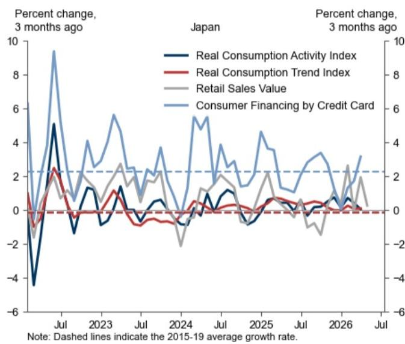

line

| Year | Real Consumption Activity Index | Real Consumption Trend Index | Retail Sales Value | Consumer Financing by Credit Card |
|------|----------------------------------|------------------------------|--------------------|-----------------------------------|
| 2015 | -5.0                             | 0.0                          | -2.0               | 6.0                               |
| 2016 | 5.0                              | 2.0                          | 1.0                | 9.0                               |
| 2017 | -1.0                             | 0.0                          | 0.0                | 1.0                               |
| 2018 | 1.0                              | 0.0                          | 1.0                | 2.0                               |
| 2019 | -1.0                             | 0.0                          | 0.0                | 1.0                               |
| 2020 | 1.0                              | 0.0                          | 1.0                | 2.0                               |
| 2021 | -1.0                             | 0.0                          | 0.0                | 1.0                               |
| 2022 | 1.0                              | 0.0                          | 1.0                | 2.0                               |
| 2023 | -1.0                             | 0.0                          | 0.0                | 1.0                               |
| 2024 | 1.0                              | 0.0                          | 1.0                | 2.0                               |
| 2025 | -1.0                             | 0.0                          | 0.0                | 1.0                               |
| 2026 | 1.0                              | 0.0                          | 1.0                | 2.0                               |
| 2027 | -1.0                             | 0.0                          | 0.0                | 1.0                               |
| 2028 | 1.0                              | 0.0                          | 1.0                | 2.0                               |
| 2029 | -1.0                             | 0.0                          | 0.0                | 1.0                               |
| 2030 | 1.0                              | 0.0                          | 1.0                | 2.0                               |
| Note: Dashed lines indicate the 2015-19 average growth rate.

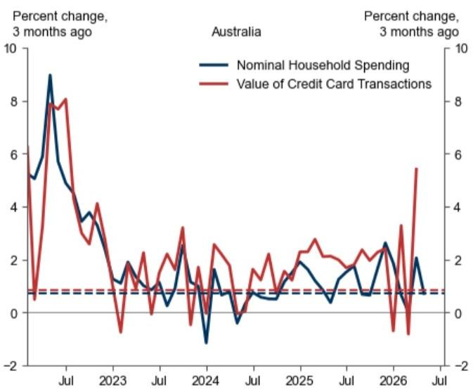

line

| Month | Nominal Household Spending | Value of Credit Card Transactions |
|-------|-----------------------------|-------------------------------------|
| Jul   | ~9.0                        | ~8.0                                |
| 2023  | ~1.5                        | ~4.0                                |
| Jul   | ~1.0                        | ~2.0                                |
| 2024  | ~-1.0                       | ~2.5                                |
| Jul   | ~0.5                        | ~1.5                                |
| 2025  | ~1.5                        | ~2.5                                |
| Jul   | ~1.0                        | ~2.0                                |
| 2026  | ~2.5                        | ~3.0                                |
| Jul   | ~2.0                        | ~5.5                                |

Source: Haver Analytics, GS Global Investment Research

Exhibit 9: Spending On Both Goods and Services Remains Depressed in the UK and Germany   
Real Household Consumption: Deviation from 2015-19 Trend   
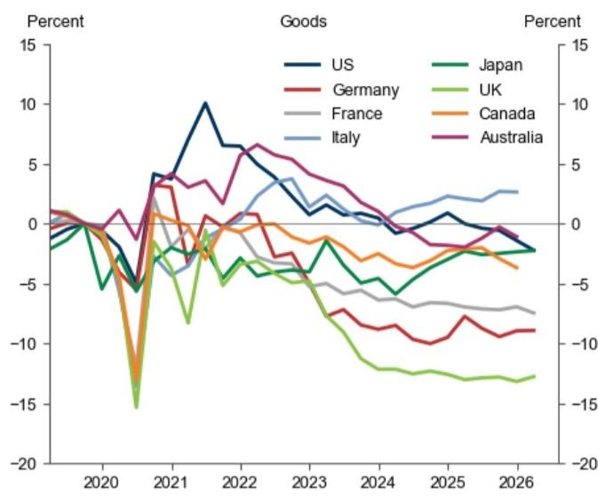

line

| Year | US   | Germany | Japan | UK   | France | Canada | Italy | Australia |
|------|------|---------|-------|------|--------|--------|-------|-----------|
| 2020 | -1.0 | 0.5     | -2.0  | -15.0| -3.0   | -1.5   | -4.0  | -1.0      |
| 2021 | 4.0  | 3.0     | -3.0  | -8.0 | -4.0   | -2.0   | -5.0  | 3.0       |
| 2022 | 7.0  | 6.0     | -4.0  | -5.0 | -3.0   | -1.0   | 2.0   | 6.0       |
| 2023 | 3.0  | 4.0     | -5.0  | -7.0 | -4.0   | -2.0   | 3.0   | 4.0       |
| 2024 | 1.0  | 2.0     | -6.0  | -12.0| -5.0   | -3.0   | 1.0   | 2.0       |
| 2025 | 1.5  | 1.0     | -7.0  | -13.0| -6.0   | -4.0   | 2.0   | 1.5       |
| 2026 | -1.0 | -1.5    | -8.0  | -14.0| -7.0   | -5.0   | 3.0   | -1.5      |

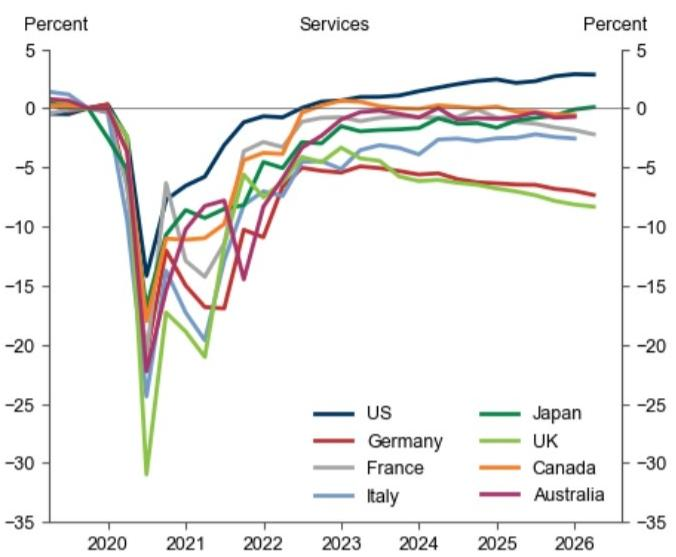

line

| Year | US    | Germany | France | Italy | Japan | UK    | Canada | Australia |
|------|-------|---------|--------|-------|-------|-------|--------|-----------|
| 2020 | 0.0   | 0.0     | 0.0    | 0.0   | 0.0   | 0.0   | 0.0    | 0.0       |
| 2021 | -15.0 | -18.0   | -17.0  | -25.0 | -10.0 | -30.0 | -12.0  | -18.0     |
| 2022 | -5.0  | -10.0   | -8.0   | -15.0 | -5.0  | -15.0 | -8.0   | -12.0     |
| 2023 | 0.0   | -5.0    | -3.0   | -10.0 | 0.0   | -5.0  | 0.0    | -5.0      |
| 2024 | 1.0   | -3.0    | -1.0   | -5.0  | 1.0   | -3.0  | 1.0    | -3.0      |
| 2025 | 2.0   | -1.0    | 1.0    | -2.0  | 2.0   | -1.0  | 2.0    | -1.0      |
| 2026 | 3.0   | 0.0     | 2.0    | 1.0   | 3.0   | 0.0   | 3.0    | 1.0       |

Source: Haver Analytics, GS Global Investment Research

Exhibit 10: The Saving Rate Ticked Down in the US and Canada   
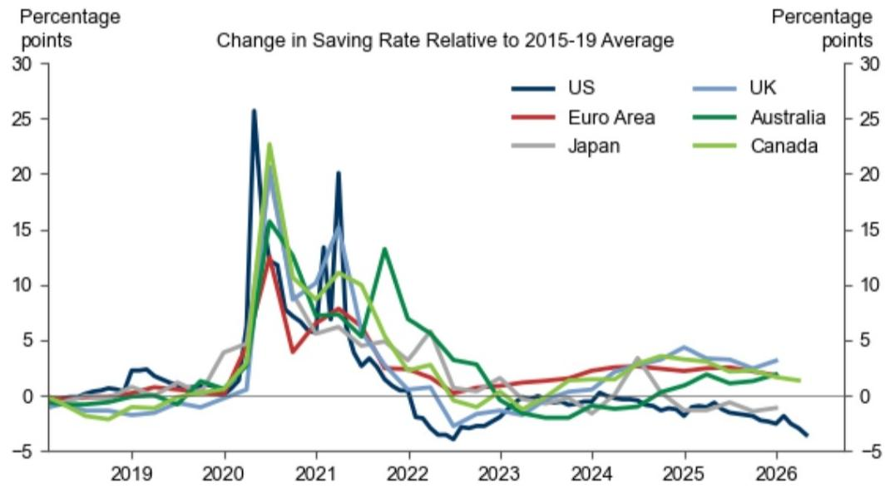

line

| Year | US   | Euro Area | Japan | UK   | Australia | Canada |
|------|------|-----------|-------|------|-----------|--------|
| 2019 | 0    | 0         | 0     | 0    | 0         | 0      |
| 2020 | 25   | 12        | 4     | 0    | 15        | 23     |
| 2021 | 20   | 7         | 6     | 10   | 13        | 11     |
| 2022 | 0    | 0         | 0     | 0    | 5         | 3      |
| 2023 | -5   | 0         | 0     | -5   | 0         | 0      |
| 2024 | 0    | 0         | 0     | 0    | 0         | 0      |
| 2025 | -5   | 0         | -5    | 4    | 3         | 3      |
| 2026 | -8   | 0         | -8    | 3    | 2         | 1      |

Source: Haver Analytics, GS Global Investment Research

# Labor-Market Indicators

Exhibit 11: The Unemployment Rate Ticked Up in the UK, Canada Australia but Ticked Down in Japan and the Euro Area   
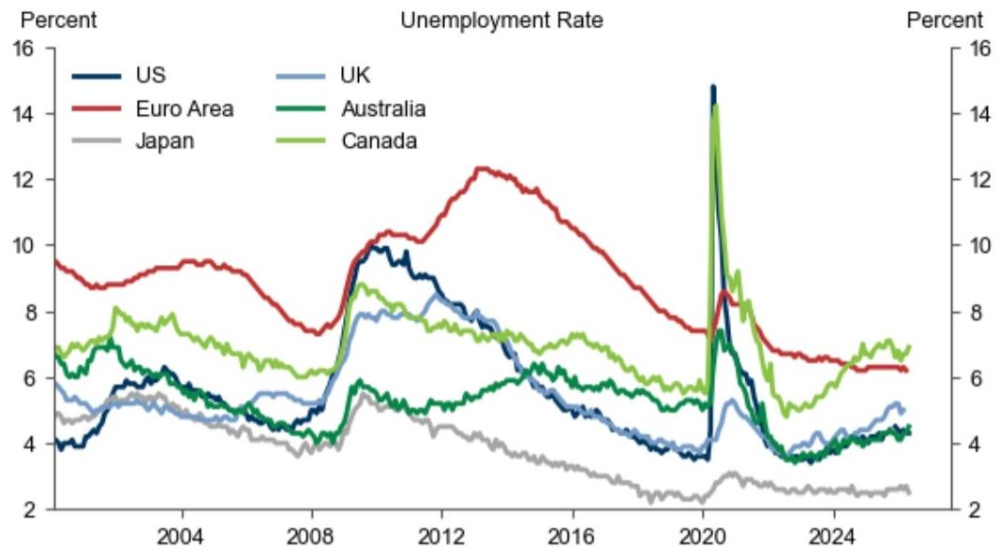

line

| Year | US   | Euro Area | UK   | Australia | Canada | Japan |
|------|------|-----------|------|-----------|--------|-------|
| 2004 | 6.0  | 9.5       | 5.5  | 7.0       | 8.0    | 4.5   |
| 2008 | 5.0  | 7.5       | 5.0  | 4.5       | 6.5    | 3.5   |
| 2012 | 9.5  | 10.5      | 8.0  | 6.0       | 7.5    | 4.0   |
| 2020 | 3.5  | 7.0       | 4.0  | 3.0       | 15.0   | 2.5   |
| 2024 | 4.5  | 6.5       | 5.0  | 4.0       | 7.0    | 2.5   |

\*The UK labor force survey has notably low participation rates.   
Source: Haver Analytics, OECD, GS Global Investment Research

Exhibit 12: Wage Growth Accelerated in Japan but Ticked Down from Elevated Levels (Due to Compositional Distortions) in Canada   
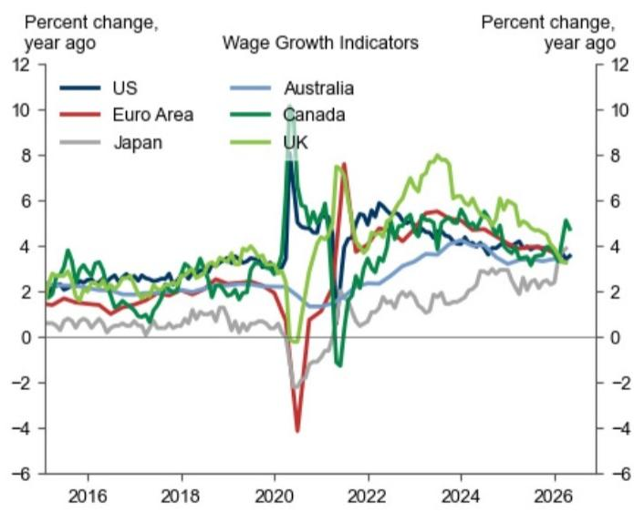

line

| Year | US   | Euro Area | Japan | Australia | Canada | UK   |
|------|------|-----------|-------|-----------|--------|------|
| 2016 | ~2.5 | ~1.5      | ~0.5  | ~2.0      | ~3.0   | ~2.5 |
| 2018 | ~3.0 | ~2.0      | ~1.0  | ~2.5      | ~3.5   | ~3.0 |
| 2020 | ~7.0 | ~-4.0     | ~-2.0 | ~3.0      | ~8.0   | ~4.0 |
| 2022 | ~5.0 | ~7.5      | ~1.5  | ~4.0      | ~5.0   | ~8.0 |
| 2024 | ~4.5 | ~5.5      | ~3.0  | ~4.5      | ~5.5   | ~7.5 |
| 2026 | ~3.5 | ~4.0      | ~3.5  | ~4.0      | ~5.0   | ~6.0 |

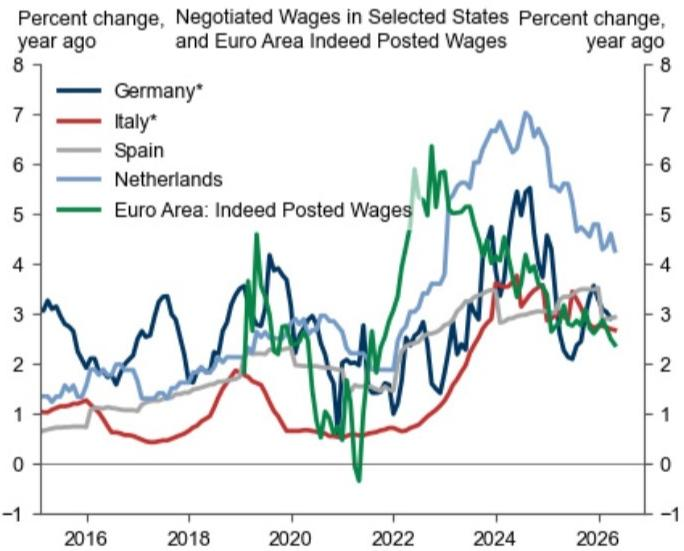

line

| Year | Germany* | Italy* | Spain | Netherlands | Euro Area: Indeed Posted Wages |
|------|----------|--------|-------|-------------|-------------------------------|
| 2016 | 3.2      | 1.1    | 0.8   | 1.5         | 1.8                           |
| 2017 | 2.8      | 0.9    | 0.9   | 1.7         | 2.0                           |
| 2018 | 3.5      | 1.0    | 1.0   | 1.9         | 2.2                           |
| 2019 | 4.0      | 1.5    | 1.2   | 2.1         | 4.5                           |
| 2020 | 3.8      | 0.8    | 1.5   | 2.5         | 2.8                           |
| 2021 | 2.5      | 0.5    | 1.8   | 2.0         | -0.5                          |
| 2022 | 3.0      | 0.7    | 2.0   | 3.0         | 6.0                           |
| 2023 | 4.5      | 1.0    | 2.5   | 4.0         | 5.5                           |
| 2024 | 5.5      | 3.5    | 3.0   | 7.0         | 4.0                           |
| 2025 | 4.0      | 3.0    | 3.5   | 6.5         | 3.5                           |
| 2026 | 3.0      | 2.8    | 3.2   | 4.5         | 2.5                           |

\*We take the 6mma of the negotiated wages in Germany and Italy to correct for high volatility from one-off payments.

We consider AHE for total private industries in the US, compensation per employee in the Euro area, contractual earnings index per FT employee in Japan, AWE (regular pay) for the whole economy in the UK, the quarterly wage price index in Australia, and average hourly wages of permanent employees in Canada. We consider negotiated hourly earnings ex one-off payments in Germany, contractual wages per employee in Italy, agreed wage from collective bargaining in Spain and monthly wage incl. special payments from collective bargaining in the Netherlands. The Euro area Indeed posted wage growth is a new indicator of wage growth based on wages and salaries posted in Indeed job ads, which is a more timely indicator of wage growth for new hires.

# Consumer Sentiment Indicators

Exhibit 13: Morning Consult's High Frequency Measure of Consumer Sentiment Recovered Slightly in April but Remains Depressed Amid the War in the Middle East   
Consumer Sentiment Surveys   
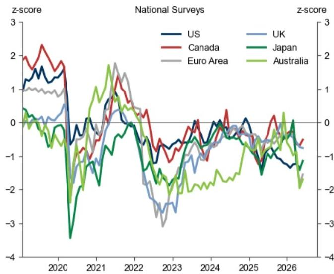

line

| Year | US    | Canada | UK    | Japan | Euro Area | Australia |
|------|-------|--------|-------|-------|-----------|-----------|
| 2020 | 1.5   | 2.0    | 0.5   | -3.5  | 1.0       | -0.5      |
| 2021 | 0.8   | 1.2    | 0.3   | -1.5  | 1.5       | 1.8       |
| 2022 | -0.5  | 0.5    | -0.8  | -1.0  | 0.8       | -1.2      |
| 2023 | -1.0  | -0.8   | -1.5  | -1.8  | -0.5      | -2.0      |
| 2024 | -0.2  | 0.3    | -0.5  | -1.2  | -0.8      | -1.5      |
| 2025 | -0.8  | -0.5   | -0.7  | -1.5  | -0.3      | -1.0      |
| 2026 | -1.2  | -0.3   | -1.0  | -1.8  | -0.5      | -1.5      |

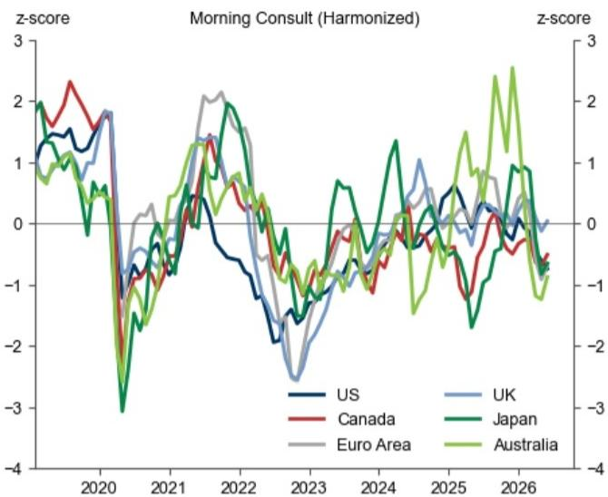

line

| Year | US    | Canada | UK    | Japan | Euro Area | Australia |
|------|-------|--------|-------|-------|-----------|-----------|
| 2020 | 1.5   | 2.5    | 1.8   | -3.0  | 0.5       | -1.5      |
| 2021 | -0.5  | 0.8    | -0.2  | 1.2   | 1.8       | 0.9       |
| 2022 | -1.8  | 0.3    | -1.5  | 1.5   | 2.0       | 1.2       |
| 2023 | -2.5  | -0.5   | -2.8  | -1.0  | -0.8      | -1.2      |
| 2024 | -0.8  | -0.2   | -0.5  | 1.0   | 0.5       | -0.8      |
| 2025 | 0.5   | -0.8   | 0.2   | -1.5  | 0.8       | 1.5       |
| 2026 | -0.5  | -1.0   | -0.8  | 0.8   | 0.5       | 2.5       |

In each country we consider the most prominent survey-based indicator of consumer confidence. These are the UMich Consumer Sentiment and the Conference Board Consumer Confidence in the US, the European Commission Consumer Confidence Indicator in the Euro area, the GfK Consumer Confidence Barometer in the UK, the Cabinet Office's Consumer Confidence Index in Japan, and the Westpac-Melbourne Institute's Consumer Sentiment Index in Australia. In Canada, we use Morning Consult's Index of Consumer Sentiment (MC ICS) given a lack of data. To construct the Euro Area composite of the MC ICS we take a GDP-weighted average of the indices for Germany, France, Italy and Spain.   
Source: Haver Analytics, Morning Consult, GS Global Investment Research

Exhibit 14: Sentiment Is Weakest in Australia for Both Low- and High-Income Consumers   
Consumer Sentiment by Income Group   
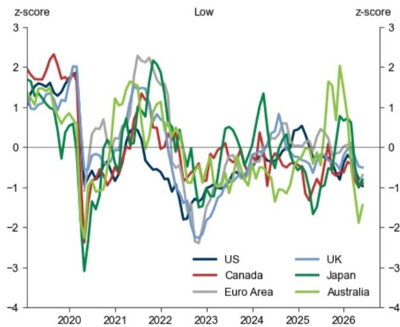

line

| Year | US    | Canada | UK    | Japan | Euro Area | Australia |
|------|-------|--------|-------|-------|-----------|-----------|
| 2020 | 1.5   | 2.0    | 1.8   | -3.0  | 0.5       | 1.2       |
| 2021 | -0.5  | -0.8   | -0.3  | 0.0   | 1.5       | 1.8       |
| 2022 | -1.0  | -0.5   | 0.5   | 1.5   | 2.0       | 1.0       |
| 2023 | -1.5  | -1.0   | -1.5  | -1.0  | -0.5      | -0.5      |
| 2024 | -0.5  | -0.8   | -0.3  | 1.5   | 0.5       | -0.5      |
| 2025 | 0.5   | -0.5   | 0.5   | -1.5  | 0.0       | -1.0      |
| 2026 | -1.0  | -1.5   | -1.0  | 0.5   | -0.5      | -2.0      |

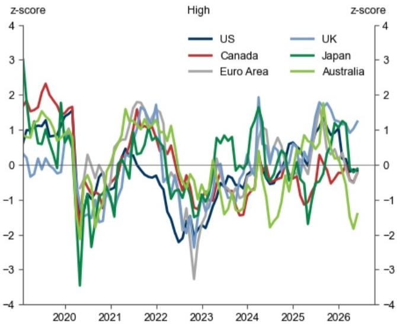

line

| Year | US    | Canada | UK    | Japan | Euro Area | Australia |
|------|-------|--------|-------|-------|-----------|-----------|
| 2020 | 1.5   | 2.5    | 0.5   | 3.0   | 1.0       | 1.8       |
| 2021 | -0.5  | -1.0   | -1.5  | -2.0  | -0.5      | -0.8      |
| 2022 | -1.0  | -1.5   | -1.0  | -1.5  | -1.0      | -1.2      |
| 2023 | -2.0  | -1.5   | -2.5  | -3.0  | -3.5      | -2.5      |
| 2024 | -0.5  | -1.0   | 2.0   | 1.5   | 0.5       | 0.0       |
| 2025 | 0.5   | -0.5   | 1.5   | 1.0   | 0.0       | 0.5       |
| 2026 | 1.0   | 0.5    | 1.5   | 1.0   | -0.5      | -1.0      |

In each country, we use Morning Consult's Index of Consumer Sentiment, disaggregated by income. To construct the Euro Area composite of the MC ICS we take a GDP-weighted average of the indices for Germany, France, Italy and Spain. The low and high income groups correspond to <\$50k and >\$100k in the US, <C\$40k and >C\$100k in Canada, <€40k and >€100k in Germany and France, <€30k and >€100k in Italy and Spain, <¥6m and >¥12m in Japan and <A\$60k and >A\$125k in Australia.   
Source: Morning Consult, GS Global Investment Research

# Financial Indicators

Exhibit 15: Interest Expenses Remain Elevated in Canada and Australia   
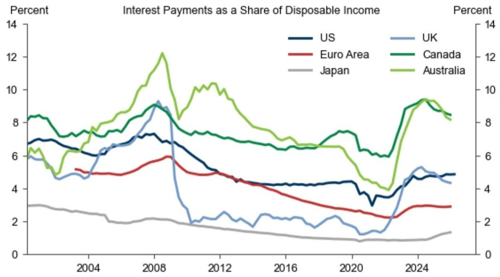

line

| Year | US   | Euro Area | Japan | UK   | Canada | Australia |
|------|------|-----------|-------|------|--------|-----------|
| 2004 | 6.5  | 5.0       | 3.0   | 5.5  | 7.0    | 6.0       |
| 2008 | 7.0  | 6.0       | 2.5   | 9.0  | 8.5    | 12.0      |
| 2012 | 5.0  | 4.5       | 1.5   | 2.0  | 7.0    | 10.0      |
| 2016 | 4.5  | 3.5       | 1.0   | 1.5  | 6.5    | 7.0       |
| 2020 | 4.0  | 2.5       | 0.8   | 1.0  | 6.0    | 5.0       |
| 2024 | 5.0  | 3.0       | 1.0   | 5.0  | 9.0    | 9.5       |
| 2028 | 5.0  | 3.0       | 1.5   | 4.5  | 8.5    | 8.0       |

Source: Haver Analytics, GS Global Investment Research

Exhibit 16: House Prices Continue to Decline in Canada   
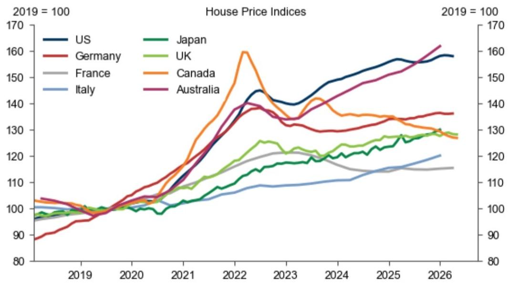

line

| Year | US   | Germany | Japan | UK   | France | Canada | Italy | Australia |
|------|------|---------|-------|------|--------|--------|-------|-----------|
| 2019 | 105  | 90      | 98    | 100  | 98     | 105    | 100   | 105       |
| 2020 | 110  | 105     | 100   | 105  | 105    | 110    | 105   | 110       |
| 2021 | 130  | 120     | 110   | 115  | 115    | 130    | 110   | 130       |
| 2022 | 145  | 135     | 120   | 125  | 120    | 160    | 115   | 140       |
| 2023 | 140  | 130     | 125   | 125  | 125    | 135    | 120   | 135       |
| 2024 | 150  | 135     | 130   | 130  | 130    | 140    | 125   | 145       |
| 2025 | 155  | 135     | 135   | 135  | 135    | 135    | 130   | 150       |
| 2026 | 160  | 135     | 135   | 135  | 135    | 130    | 135   | 165       |

We consider the S&P CoreLogic Case-Shiller HPI for existing single-family residential homes in the US, the residential property price index by the Ministry of Land, Infrastructure Transport and Tourism in Japan, the Hypoport HPI in Germany, the INS HPI for houses and apartments in France, the Istat HPI in Italy, the Halifax national HPI for all houses in the UK, the RBA's mean value of residential dwellings in Australia, and the CREA MLS benchmark price in Canada.   
Source: Haver Analytics, GS Global Investment Research

Exhibit 17: Outstanding Household Debt Was Little Changed in North America   
Household Debt: North America   
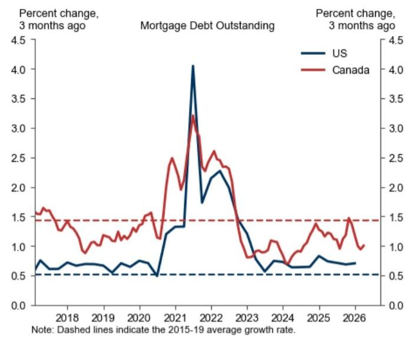

line

| Year | US   | Canada |
|------|------|--------|
| 2018 | 0.7  | 1.6    |
| 2019 | 0.6  | 1.4    |
| 2020 | 0.7  | 1.5    |
| 2021 | 1.4  | 2.5    |
| 2022 | 4.1  | 3.2    |
| 2023 | 1.5  | 1.0    |
| 2024 | 0.7  | 1.1    |
| 2025 | 0.8  | 1.4    |
| 2026 | 0.7  | 1.0    |

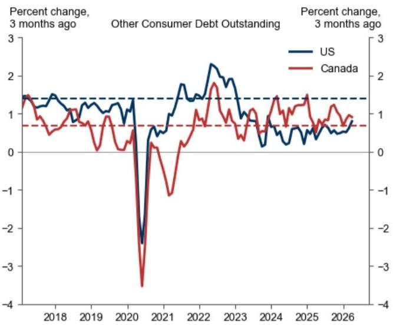

line

| Year | US   | Canada |
|------|------|--------|
| 2018 | 1.5  | 1.2    |
| 2019 | 1.3  | 0.8    |
| 2020 | -2.5 | -3.5   |
| 2021 | 0.5  | -1.0   |
| 2022 | 2.5  | 1.8    |
| 2023 | 1.8  | 1.0    |
| 2024 | 0.8  | 1.5    |
| 2025 | 0.5  | 1.2    |
| 2026 | 0.7  | 1.0    |

On the right-hand side, we consider consumer credit in the US and household non-mortgage debt in Canada.   
Source: Haver Analytics, GS Global Investment Research

Exhibit 18: Outstanding Mortgage Debt Growth Ticked Up in the UK   
Household Debt: Western Europe   
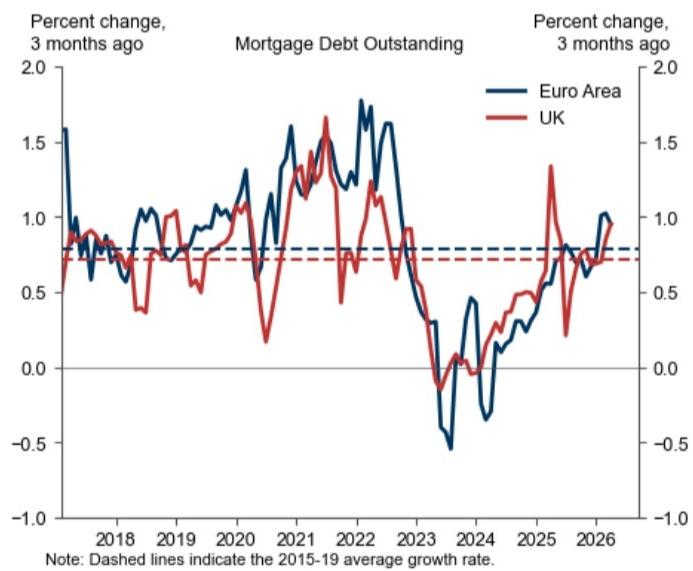

line

| Year | Euro Area | UK |
|------|-----------|----|
| 2018 | 1.6       | 0.9 |
| 2019 | 1.0       | 1.0 |
| 2020 | 1.3       | 0.8 |
| 2021 | 1.7       | 1.6 |
| 2022 | 1.8       | 1.4 |
| 2023 | -0.5      | -0.1 |
| 2024 | 0.5       | 0.3 |
| 2025 | 0.8       | 1.4 |
| 2026 | 1.0       | 0.9 |

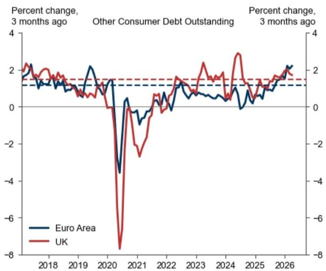

line

| Year | Euro Area | UK |
|------|-----------|----|
| 2018 | ~1.5      | ~2.0 |
| 2019 | ~1.0      | ~1.5 |
| 2020 | ~-3.5     | ~-7.5 |
| 2021 | ~-1.0     | ~-3.0 |
| 2022 | ~0.5      | ~1.0 |
| 2023 | ~1.0      | ~2.5 |
| 2024 | ~0.5      | ~3.0 |
| 2025 | ~1.0      | ~1.5 |
| 2026 | ~2.0      | ~2.0 |

On the right-hand side, we consider consumer credit in the Euro area and consumer credit (ex student loans) in the UK.   
Source: Haver Analytics, GS Global Investment Research

Exhibit 19: Growth in Mortgage and Other Consumer Debt Stands Above Trend in Japan and Australia   
Household Debt: Asia Pacific   
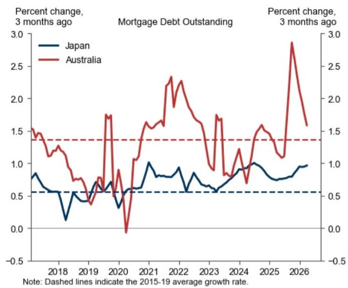

line

| Year | Japan | Australia |
|------|-------|-----------|
| 2018 | 0.8   | 1.5       |
| 2019 | 0.4   | 0.8       |
| 2020 | 0.6   | -0.2      |
| 2021 | 1.0   | 1.7       |
| 2022 | 0.9   | 2.3       |
| 2023 | 0.7   | 1.8       |
| 2024 | 0.9   | 1.6       |
| 2025 | 0.8   | 1.5       |
| 2026 | 1.0   | 2.9       |

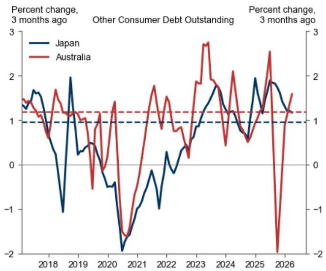

line

| Year | Japan | Australia |
|------|-------|-----------|
| 2018 | 1.5   | 1.3       |
| 2019 | 2.0   | 1.2       |
| 2020 | -0.5  | -0.8      |
| 2021 | -1.8  | -1.5      |
| 2022 | 0.5   | 1.0       |
| 2023 | 1.8   | 2.5       |
| 2024 | 1.5   | 1.8       |
| 2025 | 2.0   | 1.5       |
| 2026 | 1.5   | -2.0      |

On the right-hand side, we consider consumer credit in Japan and non-mortgage household debt in Australia.   
Source: Haver Analytics, GS Global Investment Research

# Consumer Dashboards

Exhibit 20: In the US, Household Balance Sheets Remain Healthy and Debt Service Ratios Low by Historical Standards, Although Sentiment and Spending Growth Are Weaker   
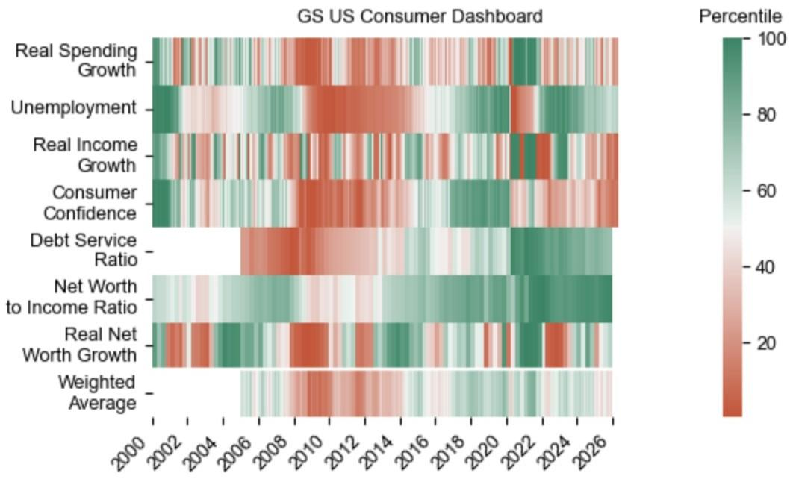  
We compute the weighted average through April. Variables that are not observed or nowcasted for April are assumed to be unchanged relative to March when taking the average.   
Source: Haver Analytics, GS Global Investment Research

Exhibit 21: In Canada, Consumer Confidence Remains Weak and Real Income Growth Has Deteriorated, but Net-Worth-to-Income Remains High by Historical Standards   
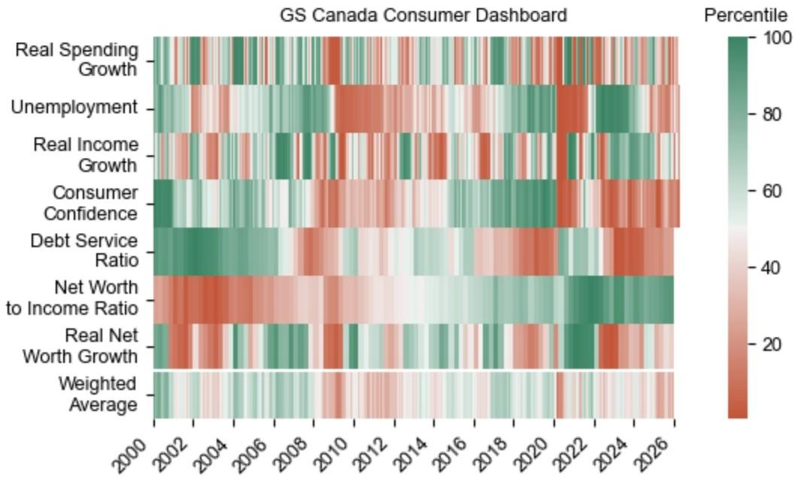

heatmap

| Year | Real Spending Growth | Unemployment | Real Income Growth | Consumer Confidence | Debt Service Ratio | Net Worth to Income Ratio | Real Net Worth Growth | Weighted Average |
|------|----------------------|--------------|--------------------|---------------------|--------------------|---------------------------|-----------------------|------------------|
| 2000 | 10                   | 5            | 15                 | 8                   | 3                  | 10                        | 5                     | 10               |
| 2002 | 15                   | 10           | 20                 | 10                  | 5                  | 15                        | 10                    | 15               |
| 2004 | 20                   | 15           | 25                 | 15                  | 10                 | 20                        | 15                    | 20               |
| 2006 | 25                   | 20           | 30                 | 20                  | 15                 | 25                        | 20                    | 25               |
| 2008 | 30                   | 25           | 35                 | 25                  | 20                 | 30                        | 25                    | 30               |
| 2010 | 35                   | 30           | 40                 | 30                  | 25                 | 35                        | 30                    | 35               |
| 2012 | 40                   | 35           | 45                 | 35                  | 30                 | 40                        | 35                    | 40               |
| 2014 | 45                   | 40           | 50                 | 40                  | 35                 | 45                        | 40                    | 45               |
| 2016 | 50                   | 45           | 55                 | 45                  | 40                 | 50                        | 45                    | 50               |
| 2018 | 55                   | 50           | 60                 | 50                  | 45                 | 55                        | 50                    | 55               |
| 2020 | 60                   | 55           | 65                 | 55                  | 50                 | 60                        | 55                    | 60               |
| 2022 | 65                   | 60           | 70                 | 60                  | 55                 | 65                        | 60                    | 65               |
| 2024 | 70                   | 65           | 75                 | 65                  | 60                 | 70                        | 65                    | 70               |
| 2026 | 75                   | 70           | 80                 | 70                  | 65                 | 75                        | 70                    | 75               |

We compute the weighted average through April. Variables that are not observed or nowcasted for April are assumed to be unchanged relative to March when taking the average.   
Source: Haver Analytics, GS Global Investment Research

Exhibit 22: In the Euro Area, the Labor Market Remains Tight and Balance Sheets Healthy by Historical Standards   
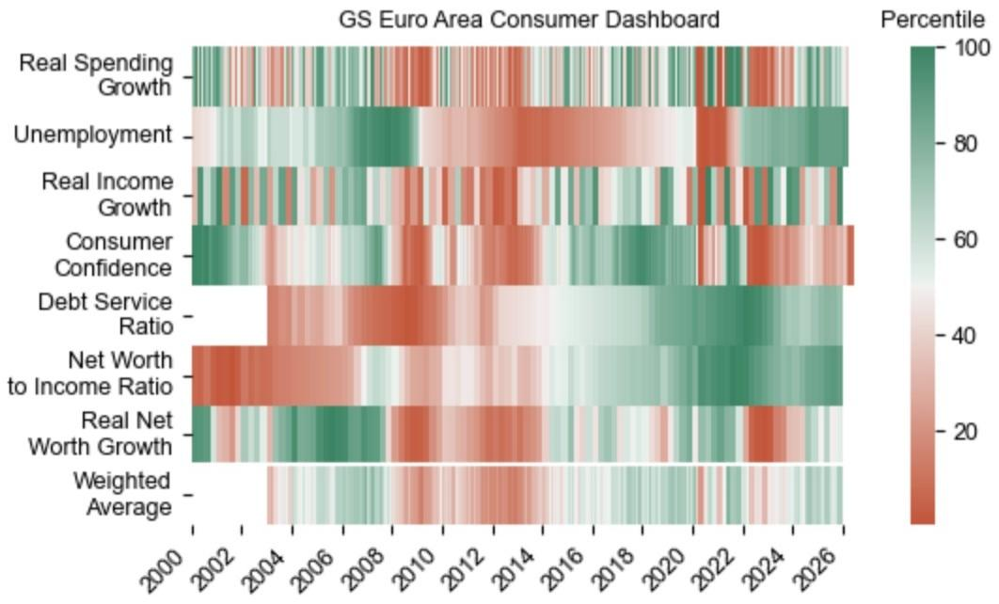

heatmap

| Year | Real Spending Growth | Unemployment | Real Income Growth | Consumer Confidence | Debt Service Ratio | Net Worth to Income Ratio | Real Net Worth Growth | Weighted Average |
|------|----------------------|--------------|--------------------|---------------------|--------------------|---------------------------|-----------------------|------------------|
| 2000 | ~5                   | ~5           | ~5                 | ~5                  | ~5                 | ~5                        | ~5                    | ~5               |
| 2002 | ~5                   | ~5           | ~5                 | ~5                  | ~5                 | ~5                        | ~5                    | ~5               |
| 2004 | ~5                   | ~5           | ~5                 | ~5                  | ~5                 | ~5                        | ~5                    | ~5               |
| 2006 | ~5                   | ~5           | ~5                 | ~5                  | ~5                 | ~5                        | ~5                    | ~5               |
| 2008 | ~5                   | ~5           | ~5                 | ~5                  | ~5                 | ~5                        | ~5                    | ~5               |
| 2010 | ~5                   | ~5           | ~5                 | ~5                  | ~5                 | ~5                        | ~5                    | ~5               |
| 2012 | ~5                   | ~5           | ~5                 | ~5                  | ~5                 | ~5                        | ~5                    | ~5               |
| 2014 | ~5                   | ~5           | ~5                 | ~5                  | ~5                 | ~5                        | ~5                    | ~5               |
| 2016 | ~5                   | ~5           | ~5                 | ~5                  | ~5                 | ~5                        | ~5                    | ~5               |
| 2018 | ~5                   | ~5           | ~5                 | ~5                  | ~5                 | ~5                        | ~5                    | ~5               |
| 2020 | ~5                   | ~5           | ~5                 | ~5                  | ~5                 | ~5                        | ~5                    | ~5               |
| 2022 | ~5                   | ~5           | ~5                 | ~5                  | ~5                 | ~5                        | ~5                    | ~5               |
| 2024 | ~5                   | ~5           | ~5                 | ~5                  | ~5                 | ~5                        | ~5                    | ~5               |
| 2026 | ~5                   | ~5           | ~5                 | ~5                  | ~5                 | ~5                        | ~5                    | ~5               |
Percentile (color scale) |
| 2000-2026: 10-30: 1.0
| 10-30: 10-30: 10-30: 10-30: 10-30: 10-30: 10-30: 10-30: 10-30: 10-30: 10-30: 10-30: 10-30: 10-30: 10-30: 30-30: 30-30: 30-30: 30-30: 30-30: 30-30: 30-30: 30-30: 30-30: 30-30: 30-30: 30-30: 30-30: 30-30: 30 -30: 30-30: 30-30: 30-30: 30-30: 30-30: 30-30: 30-30: 30-30: 30-30: 30-30: 30-30: 30-30: 30-30: 30-31: 31-31: 31-31: 31-31: 31-31: 31-31: 31-31: 31-31: 31-31: 31-31: 31-31: 31-31: 31-31: 31-31: 31-31: 31-29. Percentile (percentile) |
| 2026: 27.77777777777777777777777777777777777777777777777777777777777777777777777777777777777777777777777777778888888888888888888888888888888888888888888899999999999999999999999999999999999999999999999999999999999999999999999999999999999999999999999999998. (%) Percentile (percentile) |
| 26.6666666666666666666666666666666666666666666666666666666666666666666666666666666666666666666666666666    |      |              |                      |                     |                     |                           nan   |                       nan   |

We compute the weighted average through April. Variables that are not observed or nowcasted for April are assumed to be unchanged relative to March when taking the average.   
Source: Haver Analytics, GS Global Investment Research

Exhibit 23: In the UK, the Labor Market Remains Soft and Sentiment Subdued   
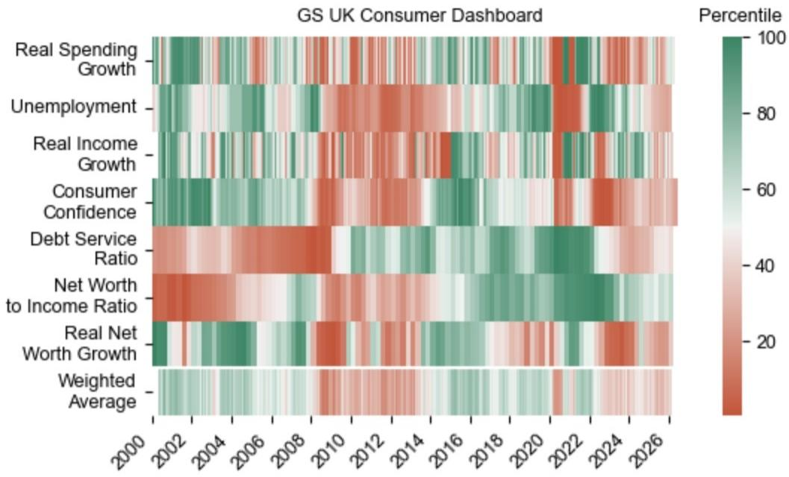

heatmap

| Year | Real Spending Growth | Unemployment | Real Income Growth | Consumer Confidence | Debt Service Ratio | Net Worth to Income Ratio | Real Net Worth Growth | Weighted Average |
|------|----------------------|--------------|--------------------|---------------------|--------------------|---------------------------|-----------------------|------------------|
| 2000 | 10                   | 5            | 3                  | 8                   | 4                  | 2                         | 1                     | 1                |
| 2002 | 15                   | 8            | 5                  | 9                   | 6                  | 3                         | 2                     | 2                |
| 2004 | 20                   | 10           | 8                  | 10                  | 8                  | 5                         | 3                     | 3                |
| 2006 | 25                   | 12           | 10                 | 11                  | 10                 | 7                         | 4                     | 4                |
| 2008 | 30                   | 15           | 12                 | 13                  | 12                 | 9                         | 5                     | 5                |
| 2010 | 35                   | 18           | 15                 | 15                  | 15                 | 11                        | 6                     | 6                |
| 2012 | 40                   | 20           | 18                 | 17                  | 18                 | 13                        | 7                     | 7                |
| 2014 | 45                   | 22           | 20                 | 19                  | 20                 | 15                        | 8                     | 8                |
| 2016 | 50                   | 25           | 22                 | 21                  | 22                 | 17                        | 9                     | 9                |
| 2018 | 55                   | 28           | 25                 | 23                  | 25                 | 19                        | 10                    | 10               |
| 2020 | 60                   | 30           | 28                 | 25                  | 28                 | 21                        | 11                    | 11               |
| 2022 | 65                   | 32           | 30                 | 27                  | 30                 | 23                        | 12                    | 12               |
| 2024 | 70                   | 35           | 32                 | 29                  | 32                 | 25                        | 13                    | 13               |
| 2026 | 75                   | 38           | 35                 | 31                  | 35                 | 27                        | 14                    | 14               |
Percentile (color scale) |
| Percentile (color scale) |
| White (low) to light blue |
| Dark Red (high) to light green |
| Light Green (low) to light green |
| Medium Red (low) to light green |
| Dark Green (low) to light green |
| Light Green (low) to light green |
| Dark Red (high) to light green |
| Dark Red (low) to light green |
| Light Green (low) to light green |
| Dark Red (high) to light green |
| Grey (low) to light green |
| Grey (high) to light green |
| Grey (low) to light green |
| Grey (high) to light green |
| Grey (low) to light green |
| Grey (high) to light green |
| Grey (low) to light green |
| Grey (high) to light green |
| Grey (low) to light green |
| Grey (high) to light green |
| Grey (low) to light green |
| Grey (high) to light green |
| Grey(low) to light green |
| Grey(low) to light green |
| Grey(high) to light green |
| Grey(low) to light green |
| Grey(high) to light green |
| Grey(low) to light green |
| Grey(low) to light green |
| Grey(high) to light green |
| Grey(low) to light green |
| Grey(high) to light green |
| Grey(low) to light green |
| Grey(high) to light green |
| Grey(low) to light green |
| Grey(high) to light green |
| Grey(low) to light green |
| Grey(high) to light green |
| Grey(low) to light green |
| Grey(high) to light green |
| Grey(lowing) to light green |
| Grey(high) to light green |
| Grey(lowing) to light green |
| Grey(high) to light green |
| Grey(lowing) to light green |
| Grey(high) to light green |
| Grey(lowing) to light green |
| Grey(high) to light green |
| Grey(lowing) to light green |
| Grey(high) to light green |
| Grey(lowing) to light green
| Grey(high) to light green |
| Grey(lowing) to light green |
| Grey(lowing) to light green |
| Grey(lowing) to light green |
| Grey(lowing) to light green |
| Grey(lowing) to light green |
| Grey(lowing) to light green |
| Grey(lowing) to light green |
| Grey(lowing) to light green |
| Grey(lowing) to light green |
| Grey(lowing) to light green |
| Grey(lowling) to light green |
| Grey(lowing) to light green |
| Grey(lowing) to light green |
| Grey(lowing) to light green |
| Grey(lowing) to light green |
| Grey(lowing) to light green |
| Grey(lowing) to light green |
| Grey(lowing) to light green |
| Grey(lowing) to light green |
| Grey(lowing) to light green |
| Grey(lowless) to light green |
| Grey(lowless) to light green |
| Grey(lowless) to light green |
| Grey(lowless) to light green |
| Grey(lowless) to light green |
| Grey(lowless) to light green |
| Grey(lowless) to light green |
| Grey(lowless) to light green |
| Grey(lowless) to light green |
| Grey(lowless) to light green |
| Grey(lowles) to light green |
| Grey(lowless) to light green |
| Grey(lowless) to light green |
| Grey(lowless) to light green |
| Grey(lowless) to light green |
| Grey(lowless) to light green |
| Grey(lowless) to light green |
| Grey(lowless) to light green |
| Grey(lowless) to light green |
| Grey(lowless) to light green |
| Grey(lowlss) to light green |
| Grey(lowlss) to light green |
| Grey(lowlss) to light green |
| Grey(lowlss) to light green |
| Grey(lowlss) to light green |
| Grey(lowlss) to light green |
| Grey(lowlss) to light green |
| Grey(lowlss) to light green |
| Grey(lowlss) to light green |
| Grey(lowlss)(to light green)|

We compute the weighted average through April. Variables that are not observed or nowcasted for April are assumed to be unchanged relative to March when taking the average.

Source: Haver Analytics, GS Global Investment Research

Exhibit 24: In Japan, the Labor Market Remains Tight and the Net-Worth-to-Income Ratio High by Historical Standards   
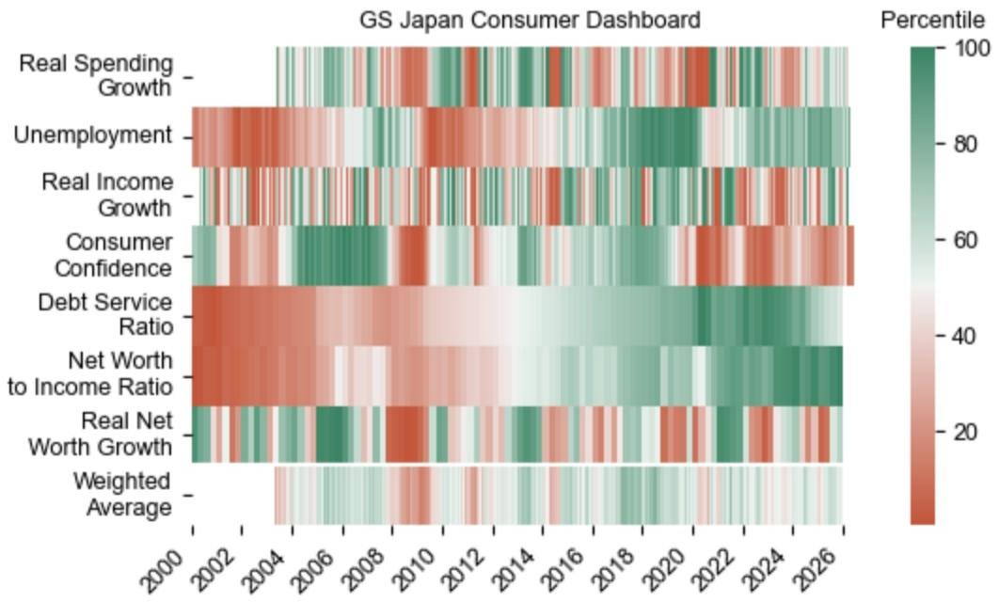

heatmap

| Year | Real Spending Growth | Unemployment | Real Income Growth | Consumer Confidence | Debt Service Ratio | Net Worth to Income Ratio | Real Net Worth Growth | Weighted Average |
|------|----------------------|--------------|--------------------|---------------------|--------------------|---------------------------|-----------------------|------------------|
| 2000 | ~10                  | ~15          | ~5                 | ~10                 | ~10                | ~10                       | ~5                    | ~5               |
| 2002 | ~15                  | ~20          | ~10                | ~15                 | ~15                | ~15                       | ~10                   | ~10              |
| 2004 | ~20                  | ~25          | ~15                | ~20                 | ~20                | ~20                       | ~15                   | ~15              |
| 2006 | ~25                  | ~30          | ~20                | ~25                 | ~25                | ~25                       | ~20                   | ~20              |
| 2008 | ~30                  | ~35          | ~25                | ~30                 | ~30                | ~30                       | ~25                   | ~25              |
| 2010 | ~35                  | ~40          | ~30                | ~35                 | ~35                | ~35                       | ~30                   | ~30              |
| 2012 | ~40                  | ~45          | ~35                | ~40                 | ~40                | ~40                       | ~35                   | ~35              |
| 2014 | ~45                  | ~50          | ~40                | ~45                 | ~45                | ~45                       | ~40                   | ~40              |
| 2016 | ~50                  | ~55          | ~45                | ~50                 | ~50                | ~50                       | ~45                   | ~45              |
| 2018 | ~55                  | ~60          | ~50                | ~55                 | ~55                | ~55                       | ~50                   | ~50              |
| 2020 | ~60                  | ~65          | ~55                | ~60                 | ~60                | ~60                       | ~55                   | ~55              |
| 2022 | ~65                  | ~70          | ~60                | ~65                 | ~65                | ~65                       | ~60                   | ~60              |
| 2024 | ~70                  | ~75          | ~65                | ~70                 | ~70                | ~70                       | ~65                   | ~65              |
| 2026 | ~75                  | ~80          | ~70                | ~75                 | ~75                | ~75                       | ~70                   | ~70              |

We compute the weighted average through April. Variables that are not observed or nowcasted for April are assumed to be unchanged relative to March when taking the average.

Source: Haver Analytics, GS Global Investment Research

Exhibit 25: In Australia, the Net-Worth-to-Income Ratio and the Labor Market Remain Healthy by Historical Standards   
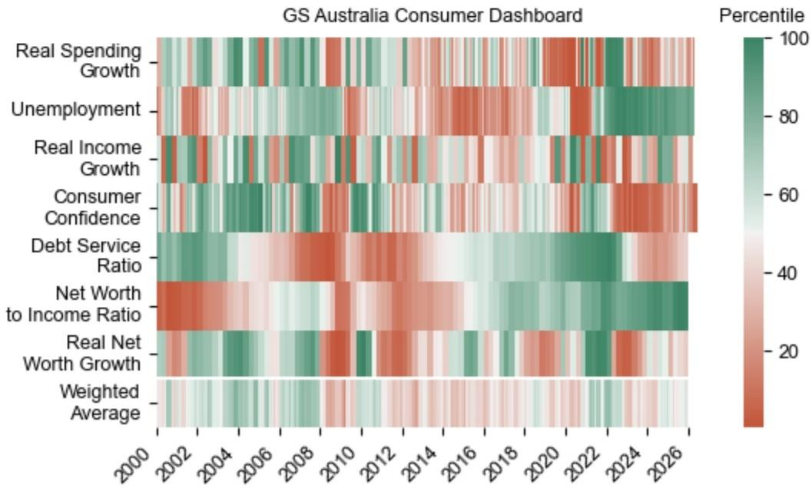

heatmap

| Year | Real Spending Growth | Unemployment | Real Income Growth | Consumer Confidence | Debt Service Ratio | Net Worth to Income Ratio | Real Net Worth Growth | Weighted Average |
|------|----------------------|--------------|--------------------|---------------------|--------------------|---------------------------|-----------------------|------------------|
| 2000 | 10                   | 5            | 15                 | 10                  | 15                 | 10                        | 10                    | 10               |
| 2002 | 15                   | 5            | 20                 | 15                  | 20                 | 15                        | 15                    | 15               |
| 2004 | 20                   | 5            | 25                 | 20                  | 25                 | 20                        | 20                    | 20               |
| 2006 | 25                   | 5            | 30                 | 25                  | 30                 | 25                        | 25                    | 25               |
| 2008 | 30                   | 5            | 35                 | 30                  | 35                 | 30                        | 30                    | 30               |
| 2010 | 35                   | 5            | 40                 | 35                  | 40                 | 35                        | 35                    | 35               |
| 2012 | 40                   | 5            | 45                 | 40                  | 45                 | 40                        | 40                    | 40               |
| 2014 | 45                   | 5            | 50                 | 45                  | 50                 | 45                        | 45                    | 45               |
| 2016 | 50                   | 5            | 55                 | 50                  | 55                 | 50                        | 50                    | 50               |
| 2018 | 55                   | 5            | 60                 | 55                  | 60                 | 55                        | 55                    | 55               |
| 2020 | 60                   | 5            | 65                 | 60                  | 65                 | 60                        | 60                    | 60               |
| 2022 | 65                   | 5            | 70                 | 65                  | 70                 | 65                        | 65                    | 65               |
| 2024 | 70                   | 5            | 75                 | 70                  | 75                 | 70                        | 70                    | 70               |
| 2026 | 75                   | 5            | 80                 | 75                  | 80                 | 75                        | 75                    | 75               |

We compute the weighted average through April. Variables that are not observed or nowcasted for April are assumed to be unchanged relative to March when taking the average.

Source: Haver Analytics, GS Global Investment Research

# Data Appendix

1. For the US, we maintain the framework introduced in our US consumer dashboard. Outside of the US, we identify the closest and most timely measures of consumer health available in each country.

2. Real spending growth: In the US, we consider six-month real personal consumption expenditure growth. In the Euro area, the UK, and Canada, we measure month-on-month growth in real retail sales. In Canada, the most recent value of real retail sales is nowcasted using Statcan's flash estimates. In Australia, we use the monthly nominal spending indicator, deflated by monthly CPI ex. volatile items and adjusted for housing costs. In Japan, we consider the average between the real consumption activity index and the real consumption trend. To address the volatility of monthly moves, we compute the 6-month moving average (6m MA).

3. Unemployment: We consider the gap between the monthly unemployment rate and OECD NAIRU estimates. In the Euro area and the UK (where furlough schemes limited the rise of unemployment during lockdowns), we apply an adjustment for hours worked during the pandemic.

4. Real income growth: We measure month-on-month growth in real aggregate labor earnings combining data, for instance, on hours worked and hourly earnings. Where available, we combine this with survey-based measures of household income, which help capture fluctuations in non-labor income sources. We again compute the 6m MA to address concerns over large swings in month on month data releases. In the Euro area and Australia, we consider quarterly growth in real disposable income and nowcast it when the most recent quarter is not yet released.

5. Consumer confidence: In each country, we consider the most prominent survey-based indicator of consumer confidence. These are the UMich Consumer Sentiment and the Conference Board Consumer Confidence in the US, the European Commission Consumer Confidence Indicator in the Euro area, the GfK Consumer Confidence Barometer in the UK, the Cabinet Office's Consumer Confidence Index in Japan, and the Westpac-Melbourne Institute's Consumer Sentiment Index in Australia. In Canada, we use Morning Consult's Index of Consumer Sentiment, which we backcast by projecting onto the US UMich index (which uses a harmonized set of questions) given a lack of national data.

6. Net worth to income ratio: We consider the ratio of household net worth (inclusive of housing) and disposable income. When the observation for the most recent quarter is not yet available, we nowcast it with a linear regression model featuring predictors available at higher frequency (e.g., changes in home prices and equity prices). As of the June 2025 publication we have removed all pension assets from the measure of UK net worth in an effort to harmonize the net-worth-to-income ratio measures across G10 counterparts. We are comfortable with this change given that pension assets are among the most illiquid forms of wealth, and the UK pension assets have seen a substantive and persistent devaluation that stood out as an outlier when compared to other G10 countries.

7. Debt service ratio: We consider the ratio of household interest payments and disposable income. When the observation for the most recent quarter is not yet available, we nowcast it with a regression model featuring higher frequency predictors.

8. Real net worth growth: We consider the year-on-year growth rate of real household net worth (inclusive of housing). When the observation for the most recent quarter is not yet available, we nowcast it with a regression model. As of the June 2025 publication we have removed all pension assets from the measure of UK net worth in an effort to harmonize the real net worth growth measures across G10 counterparts. We are comfortable with this change given that pension assets are among the most illiquid forms of wealth, and the UK pension assets have seen a substantive and persistent devaluation that stood out as an outlier when compared to other G10 countries.

9. For all components and non-US economies, we plot the percentile rank of each observation in the country's distribution since 2000. In the US, percentiles are computed since 1980, consistent with our US consumer dashboard.

10. For the unemployment gap and debt service ratio, we consider the inverted percentile rank such that high percentiles correspond to positive outcomes (i.e. low unemployment gaps and low debt service ratios).

11. Weighted average of percentiles: We compute the weighted average of percentiles with weights based on frequency, timeliness, and volatility of the indicator. We compute the weighted average through June. Variables that are not observed or nowcasted for June are assumed to be unchanged relative to May when taking the average. The weights are $20\%$ on real spending growth, $20\%$ on the unemployment gap, $20\%$ on consumer confidence, $15\%$ on real income growth, $10\%$ on debt service ratio, $10\%$ on real net worth growth, and $5\%$ on net worth to income ratio.

# The Global Economics Team

# Jan Hatzius

+1(212)902-0394

jan.hatzius@gs.com

GS & Co. LLC

# Joseph Briggs

+1(212)902-2163

joseph.briggs@gs.com

GS & Co. LLC

# Sarah Dong

+1(212)357-9741

sarah.dong@gs.com

GS & Co. LLC

# Megan Peters

+44(20)7051-2058

megan.l.peters@gs.com

GS International

# Disclosure Appendix

# Reg AC

I, Megan Peters, hereby certify that all of the views expressed in this report accurately reflect my personal views, which have not been influenced by considerations of the firm's business or client relationships.

Unless otherwise stated, the individuals listed on the cover page of this report are analysts in GS' Global Investment Research division.

Contributing Authors: Megan Peters GS International.

Unless otherwise stated, the individuals listed in the Contributing Authors disclosure of this report are analysts in GS' Global Investment Research division.

# Disclosures

# Regulatory disclosures

# Disclosures required by United States laws and regulations

See company-specific regulatory disclosures above for any of the following disclosures required as to companies referred to in this report: manager or co-manager in a pending transaction; $1\%$ or other ownership; compensation for certain services; types of client relationships; managed/co-managed public offerings in prior periods; directorships; for equity securities, market making and/or specialist role. GS trades or may trade as a principal in debt securities (or in related derivatives) of issuers discussed in this report.

The following are additional required disclosures: Ownership and material conflicts of interest: GS policy prohibits its analysts, professionals reporting to analysts and members of their households from owning securities of any company in the analyst's area of coverage. Analyst compensation: Analysts are paid in part based on the profitability of GS, which includes investment banking revenues. Analyst as officer or director: GS policy generally prohibits its analysts, persons reporting to analysts or members of their households from serving as an officer, director or advisor of any company in the analyst's area of coverage. Non-U.S. Analysts: Non-U.S. analysts may not be associated persons of GS & Co. LLC and therefore may not be subject to FINRA Rule 2241 or FINRA Rule 2242 restrictions on communications with a subject company, public appearances and trading in securities covered by the analysts.

# Additional disclosures required under the laws and regulations of jurisdictions other than the United States

The following disclosures are those required by the jurisdiction indicated, except to the extent already made above pursuant to United States laws and regulations. Australia: GS Australia Pty Ltd and its affiliates are not authorised deposit-taking institutions (as that term is defined in the Banking Act 1959 (Cth)) in Australia and do not provide banking services, nor carry on a banking business, in Australia. This research, and any access to it, is intended only for “wholesale clients” within the meaning of the Australian Corporations Act, unless otherwise agreed by GS. In producing research reports, members of Global Investment Research of GS Australia may attend site visits and other meetings hosted by the companies and other entities which are the subject of its research reports. In some instances the costs of such site visits or meetings may be met in part or in whole by the issuers concerned if GS Australia considers it is appropriate and reasonable in the specific circumstances relating to the site visit or meeting. To the extent that the contents of this document contains any financial product advice, it is general advice only and has been prepared by GS without taking into account a client’s objectives, financial situation or needs. A client should, before acting on any such advice, consider the appropriateness of the advice having regard to the client’s own objectives, financial situation and needs. A copy of certain GS Australia and New Zealand disclosure of interests and a copy of GS’ Australian Sell-Side Research Independence Policy Statement are available at: https://www.goldmansachs.com/disclosures/australia-new-zealand/index.html. Brazil: Disclosure information in relation to CVM Resolution n. 20 is available at https://www.gs.com/worldwide/brazil/area/gir/index.html. Where applicable, the Brazil-registered analyst primarily responsible for the content of this research report, as defined in Article 20 of CVM Resolution n. 20, is the first author named at the beginning of this report, unless indicated otherwise at the end of the text. Canada: This information is being provided to you for information purposes only and is not, and under no circumstances should be construed as, an advertisement, offering or solicitation by GS & Co. LLC for purchasers of securities in Canada to trade in any Canadian security. GS & Co. LLC is not registered as a dealer in any jurisdiction in Canada under applicable Canadian securities laws and generally is not permitted to trade in Canadian securities and may be prohibited from selling certain securities and products in certain jurisdictions in Canada. If you wish to trade in any Canadian securities or other products in Canada please contact GS Canada Inc., an affiliate of The GS Group Inc., or another registered Canadian dealer. Hong Kong: Further information on the securities of covered companies referred to in this research may be obtained on request from GS (Asia) L.L.C. India: Further information on the subject company or companies referred to in this research may be obtained from GS (India) Securities Private Limited, Research Analyst - SEBI Registration Number INH000001493, 10th Floor, Ascent-Worli, Sudam Kalu Ahire Marg, Worli, Mumbai-400 025, India, Corporate Identity Number U74140MH2006FTC160634, Phone +91 22 6616 9000, Fax +91 22 6616 9001. GS may beneficially own 1% or more of the securities (as such term is defined in clause 2 (h) the Indian Securities Contracts (Regulation) Act, 1956) of the subject company or companies referred to in this research report. Investment in securities market are subject to market risks. Read all the related documents carefully before investing. Registration granted by SEBI and certification from NISM in no way guarantee performance of the intermediary or provide any assurance of returns to investors. GS (India) Securities Private Limited compliance officer and investor grievance contact details can be found at: https://www.goldmansachs.com/worldwide/india/documents/Grievance-Redressal-and-Escalation-Matrix.pdf, and a copy of the annual audit compliance report can be found at this link: https://publishing.gs.com/content/site/india-annual-compliance-report.html. Japan: See below. Korea: This research, and any access to it, is intended only for “professional investors” within the meaning of the Financial Services and Capital Markets Act, unless otherwise agreed by GS. Further information on the subject company or companies referred to in this research may be obtained from GS (Asia) L.L.C., Seoul Branch. New Zealand: GS New Zealand Limited and its affiliates are neither “registered banks” nor “deposit takers” (as defined in the Reserve Bank of New Zealand Act 1989) in New Zealand. This research, and any access to it, is intended for “wholesale clients” (as defined in the Financial Advisers Act 2008) unless otherwise agreed by GS. A copy of certain GS Australia and New Zealand disclosure of interests is available at: https://www.goldmansachs.com/disclosures/australia-new-zealand/index.html. Russia: Research reports distributed in the Russian Federation are not advertising as defined in the Russian legislation, but are information and analysis not having product promotion as their main purpose and do not provide appraisal within the meaning of the Russian legislation on appraisal activity. Research reports do not constitute a personalized investment recommendation as defined in Russian laws and regulations, are not addressed to a specific client, and are prepared without analyzing the financial circumstances, investment profiles or risk profiles of clients. GS assumes no responsibility for any investment decisions that may be taken by a client or any other person based on this research report. Singapore: GS (Singapore) Pte. (Company Number: 198602165W), which is regulated by the Monetary Authority of Singapore, accepts legal responsibility for this research, and should be contacted with respect to any matters arising from, or in connection with, this research. Taiwan: This material is for reference only and must not be reprinted without permission. Investors should carefully consider their own investment risk. Investment results are the responsibility of the individual investor. United Kingdom: Persons who would be categorized as retail clients in the United Kingdom, as such term is defined in the rules of the Financial Conduct Authority, should read this research in conjunction with prior GS on the covered

companies referred to herein and should refer to the risk warnings that have been sent to them by GS International. A copy of these risks warnings, and a glossary of certain financial terms used in this report, are available from GS International on request.

European Union and United Kingdom: Disclosure information in relation to Article 6 (2) of the European Commission Delegated Regulation (EU) (2016/958) supplementing Regulation (EU) No 596/2014 of the European Parliament and of the Council (including as that Delegated Regulation is implemented into United Kingdom domestic law and regulation following the United Kingdom's departure from the European Union and the European Economic Area) with regard to regulatory technical standards for the technical arrangements for objective presentation of investment recommendations or other information recommending or suggesting an investment strategy and for disclosure of particular interests or indications of conflicts of interest is available at https://www.gs.com/disclosures/europeanpolicy.html which states the European Policy for Managing Conflicts of Interest in Connection with Investment Research.

Japan: GS Japan Co., Ltd. is a Financial Instrument Dealer registered with the Kanto Financial Bureau under registration number Kinsho 69, and a member of Japan Securities Dealers Association, Financial Futures Association of Japan Type II Financial Instruments Firms Association, and Investment Management Association of Japan. Sales and purchase of equities are subject to commission pre-determined with clients plus consumption tax. See company-specific disclosures as to any applicable disclosures required by Japanese stock exchanges, the Japanese Securities Dealers Association or the Japanese Securities Finance Company.

# Global product; distributing entities

GS Global Investment Research produces and distributes research products for clients of GS on a global basis. Analysts based in GS offices around the world produce research on industries and companies, and research on macroeconomics, currencies, commodities and portfolio strategy. This research is disseminated in Australia by GS Australia Pty Ltd (ABN 21 006 797 897); in Brazil by GS do Brasil Corretora de Títulos e Valores Mobiliários S.A.; Public Communication Channel GS Brazil: 0800 727 5764 and / or contatogoldmanbrasil@gs.com. Available Weekdays (except holidays), from 9am to 6pm. Canal de Comunicação com o Público GS Brasil: 0800 727 5764 e/ou contatogoldmanbrasil@gs.com. Horário de funcionamento: segunda-feira à sexta-feira (exceto feriados), das 9h às 18h; in Canada by GS & Co. LLC; in Hong Kong by GS (Asia) L.L.C.; in India by GS (India) Securities Private Ltd.; in Japan by GS Japan Co., Ltd.; in the Republic of Korea by GS (Asia) L.L.C., Seoul Branch; in New Zealand by GS New Zealand Limited; in Russia by OOO GS; in Singapore by GS (Singapore) Pte. (Company Number: 198602165W); and in the United States of America by GS & Co. LLC. GS International has approved this research in connection with its distribution in the United Kingdom.

GS International (“GSI”), authorised by the Prudential Regulation Authority (“PRA”) and regulated by the Financial Conduct Authority (“FCA”) and the PRA, has approved this research in connection with its distribution in the United Kingdom.

European Economic Area: GS Bank Europe SE ("GSBE") is a credit institution incorporated in Germany and, within the Single Supervisory Mechanism, subject to direct prudential supervision by the European Central Bank and in other respects supervised by German Federal Financial Supervisory Authority (Bundesanstalt für Finanzdienstleistungsaufsicht, BaFin) and Deutsche Bundesbank and disseminates research within the European Economic Area.

# General disclosures

This research is for our clients only. Other than disclosures relating to GS, this research is based on current public information that we consider reliable, but we do not represent it is accurate or complete, and it should not be relied on as such. The information, opinions, estimates and forecasts contained herein are as of the date hereof and are subject to change without prior notification. We seek to update our research as appropriate, but various regulations may prevent us from doing so. Other than certain industry reports published on a periodic basis, the large majority of reports are published at irregular intervals as appropriate in the analyst's judgment.

GS conducts a global full-service, integrated investment banking, investment management, and brokerage business. We have investment banking and other business relationships with a substantial percentage of the companies covered by Global Investment Research. GS & Co. LLC, the United States broker dealer, is a member of SIPC (https://www.sipc.org).

Our salespeople, traders, and other professionals may provide oral or written market commentary or trading strategies to our clients and principal trading desks that reflect opinions that are contrary to the opinions expressed in this research. Our asset management area, principal trading desks and investing businesses may make investment decisions that are inconsistent with the recommendations or views expressed in this research.

We and our affiliates, officers, directors, and employees will from time to time have long or short positions in, act as principal in, and buy or sell, the securities or derivatives, if any, referred to in this research, unless otherwise prohibited by regulation or GS policy.

The views attributed to third party presenters at GS arranged conferences, including individuals from other parts of GS, do not necessarily reflect those of Global Investment Research and are not an official view of GS.

Any third party referenced herein, including any salespeople, traders and other professionals or members of their household, may have positions in the products mentioned that are inconsistent with the views expressed by analysts named in this report.

This research is focused on investment themes across markets, industries and sectors. It does not attempt to distinguish between the prospects or performance of, or provide analysis of, individual companies within any industry or sector we describe.

Any trading recommendation in this research relating to an equity or credit security or securities within an industry or sector is reflective of the investment theme being discussed and is not a recommendation of any such security in isolation.

This research is not an offer to sell or the solicitation of an offer to buy any security in any jurisdiction where such an offer or solicitation would be illegal. It does not constitute a personal recommendation or take into account the particular investment objectives, financial situations, or needs of individual clients. Clients should consider whether any advice or recommendation in this research is suitable for their particular circumstances and, if appropriate, seek professional advice, including tax advice. The price and value of investments referred to in this research and the income from them may fluctuate. Past performance is not a guide to future performance, future returns are not guaranteed, and a loss of original capital may occur. Fluctuations in exchange rates could have adverse effects on the value or price of, or income derived from, certain investments.

Certain transactions, including those involving futures, options, and other derivatives, give rise to substantial risk and are not suitable for all investors. Investors should review current options and futures disclosure documents which are available from GS sales representatives or at https://www.theocc.com/about/publications/character-risks.jsp and https://www.goldmansachs.com/disclosures/cftc\_fcm\_disclosures. Transaction costs may be significant in option strategies calling for multiple purchase and sales of options such as spreads. Supporting documentation will be supplied upon request.

Differing Levels of Service provided by Global Investment Research: The level and types of services provided to you by GS Global Investment Research may vary as compared to that provided to internal and other external clients of GS, depending on various factors including your individual preferences as to the frequency and manner of receiving communication, your risk profile and investment focus and perspective (e.g.,

marketwide, sector specific, long term, short term), the size and scope of your overall client relationship with GS, and legal and regulatory constraints. As an example, certain clients may request to receive notifications when research on specific securities is published, and certain clients may request that specific data underlying analysts' fundamental analysis available on our internal client websites be delivered to them electronically through data feeds or otherwise. No change to an analyst's fundamental research views (e.g., ratings, price targets, or material changes to earnings estimates for equity securities), will be communicated to any client prior to inclusion of such information in a research report broadly disseminated through electronic publication to our internal client websites or through other means, as necessary, to all clients who are entitled to receive such reports.

All research reports are disseminated and available to all clients simultaneously through electronic publication to our internal client websites. Not all research content is redistributed to our clients or available to third-party aggregators, nor is GS responsible for the redistribution of our research by third party aggregators. For research, models or other data related to one or more securities, markets or asset classes (including related services) that may be available to you, please contact your GS representative or go to https://research.gs.com.

Disclosure information is also available at https://www.gs.com/research/hedge.html or from Research Compliance, 200 West Street, New York, NY 10282.

# © 2026 GS.

You are permitted to store, display, analyze, modify, reformat, and print the information made available to you via this service only for your own use. You may not resell or reverse engineer this information to calculate or develop any index for disclosure and/or marketing or create any other derivative works or commercial product(s), data or offering(s) without the express written consent of GS. You are not permitted to publish, transmit, or otherwise reproduce this information, in whole or in part, in any format to any third party without the express written consent of GS. This foregoing restriction includes, without limitation, using, extracting, downloading or retrieving this information, in whole or in part, to train or finetune a machine learning or artificial intelligence system, or to provide or reproduce this information, in whole or in part, as a prompt or input to any such system.