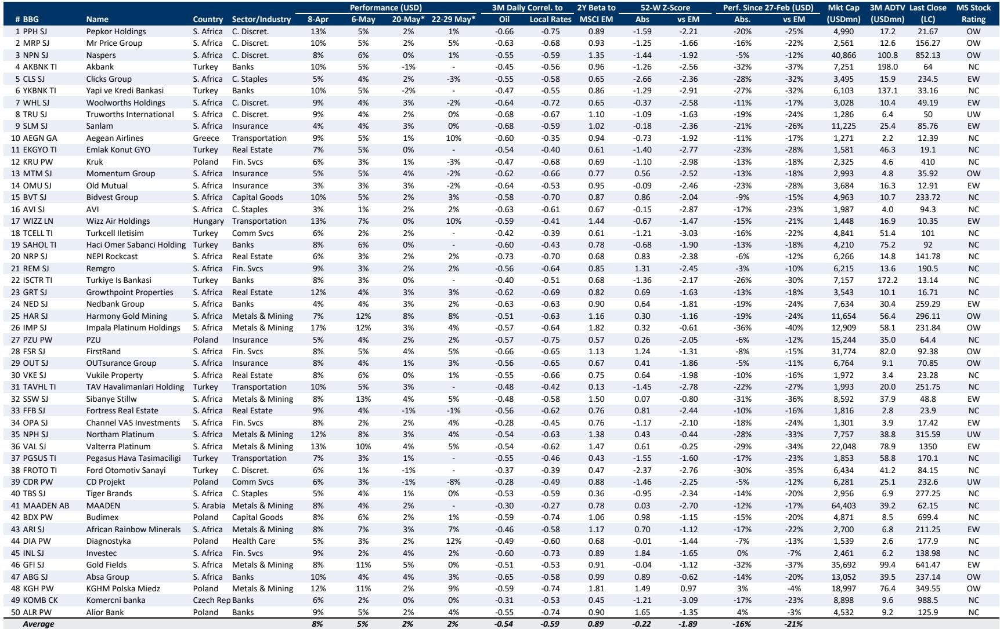
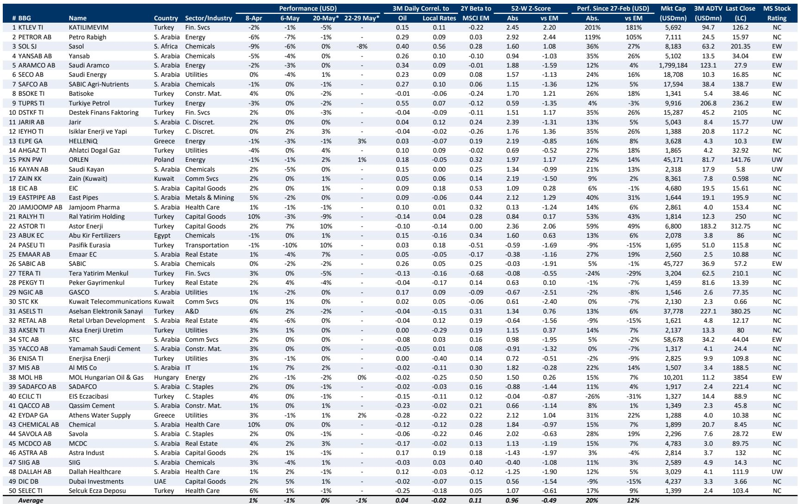
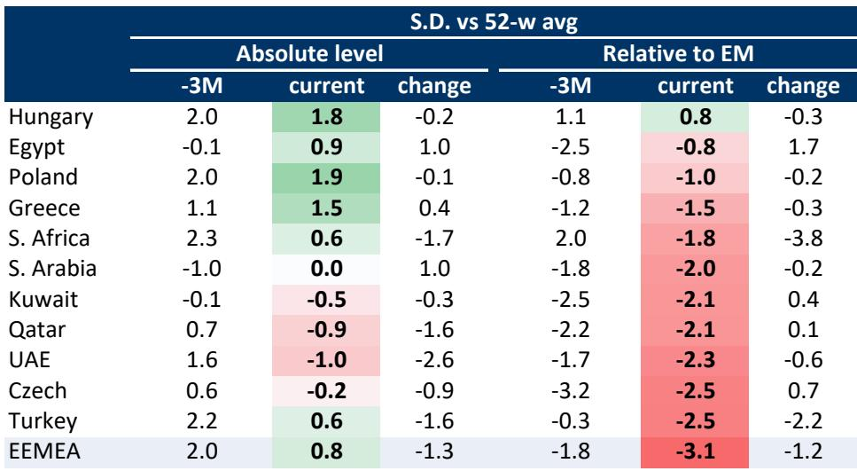

# Middle East De-Escalation Will Reshape EEMEA Equity Returns, But the Winners Are Not Where Most Investors Are Looking

The prospect of a US-Iran memorandum of understanding to reopen the Strait of Hormuz is the single most consequential geopolitical variable for EEMEA equities in the second half of 2026. Global markets have already begun to price this possibility, with the MSCI EEMEA index attempting to break out of a downtrend resistance level that has contained it for months. Yet the conventional wisdom—that a deal would benefit all regional markets uniformly—is dangerously simplistic. A rigorous, multi-factor analysis combining oil and local rates correlations, historical reactions to false-start deal headlines, and technical oversold conditions reveals a sharply divergent landscape. The highest upside is concentrated in South African stocks, Turkish banks, and select Greek and Polish names, while Saudi Arabian and EM European energy, chemicals, and utilities face the most negative exposure. The strategic question is not whether de-escalation will happen, but whether investors are positioned to capture the asymmetric upside in the markets that have been most punished by the conflict's indirect effects.

The timing of this analysis is critical. EEMEA equities have been in a structural downtrend since early 2025, driven by elevated geopolitical risk premiums, higher local rates, and a strong US dollar. A credible de-escalation catalyst could trigger a sharp mean-reversion rally in the most oversold segments. But the rally will not be uniform. It will be a rotation out of the defensive, oil-correlated positions that have outperformed during the tension and into the cyclicals, financials, and consumer stocks that have been most depressed. This is not a beta play on the region; it is a stock-picker's moment that demands a clear framework for distinguishing between temporary relief rallies and sustainable re-ratings.

The report from a global investment bank provides the analytical architecture for this distinction. It constructs a combined tactical score that weights two-thirds to a combination of inverse oil correlations, inverse local rates correlations, and average performance during earlier false-start deal headline moves, and one-third to performance technicals favoring oversold stocks. The resulting country-level rankings are striking: South Africa scores 71 out of 100, Greece 64, Poland 58, and the UAE 55. At the bottom sits Saudi Arabia with a score of just 35. This spread is not noise; it is a signal about which markets have the most to gain from a reversal of the conditions that have suppressed them.

The implications for portfolio construction are profound. An investor who simply buys the EEMEA index on a de-escalation headline is likely to be disappointed. The real opportunity lies in the stocks and sectors that have been most negatively correlated to oil prices and local interest rates, and that have been sold down to technically oversold levels. These are the positions that can deliver outsized returns when the macro headwinds reverse. Conversely, the stocks that have benefited from the status quo—Saudi energy names, Gulf petrochemical companies, and EM European utilities—face a period of relative underperformance, even if their absolute downside is limited by medium-term oil price support.

This article unpacks the logic behind these rankings, translates them into a decision framework for investors, and identifies the critical open questions that the report leaves for further analysis. The goal is not to summarize the data, but to interpret what the pattern means for strategic positioning in the months ahead.

## South Africa and Turkey Exhibit the Most Compelling Asymmetric Upside, Driven by Inverse Correlations to Oil and Rates

The bullish screen generated by the report is dominated by South African stocks and Turkish banks. This is not a coincidence. Both markets share a structural vulnerability to the very conditions that a de-escalation would reverse: high oil prices and elevated local interest rates. South Africa is a net oil importer, and its corporate sector—particularly consumer discretionary, financials, and insurers—has been squeezed by both higher input costs and tighter monetary policy. Turkish banks, meanwhile, have been battered by a combination of high inflation, currency volatility, and the indirect effects of regional instability on capital flows.

The data in the bullish screen is instructive. Pepkor Holdings, a South African consumer discretionary name, shows a three-month daily correlation to oil of -0.66 and to local rates of -0.75. Its absolute 52-week Z-score is -1.59, and its relative Z-score versus emerging markets is -2.21. This is a stock that has been punished by both the oil price and the rate environment, and that is technically deeply oversold. The same pattern repeats across Mr Price Group, Naspers, Clicks Group, Sanlam, and a host of other South African names. The common thread is that these businesses have negative correlations to the very variables that a de-escalation would move in their favor: lower oil prices and lower local rates.

The Turkish banks tell a similar story, though with an important twist. Akbank, Yapi ve Kredi Bankasi, and Turkiye Is Bankasi all show negative oil and rates correlations, and their absolute and relative Z-scores are deeply negative. But Turkish banks also carry a country-specific risk premium that is only partially related to the Middle East geopolitical situation. The report's bullish screen includes them, but the magnitude of their upside depends on whether de-escalation triggers a broader reassessment of Turkish macro stability, or whether it remains a tactical relief rally in a structurally challenged market.

The so-what for investors is clear: the highest-conviction long positions in a de-escalation scenario are not in the Gulf, but in the markets that have been most indirectly damaged by the conflict. South African miners, financials, and consumer stocks, along with Turkish banks, offer the most asymmetric upside. These are the positions that have the largest negative oil and rates betas, and the most oversold technicals. They are the stocks that can deliver a double-digit percentage return on a headline, and potentially a structural re-rating if the macro environment durably improves.

## Saudi Arabia and EM European Energy Face the Greatest Downside Risk, Even if Medium-Term Oil Support Limits the Damage

The bearish side of the analysis is equally important. The report assigns Saudi Arabia the lowest tactical score in the de-escalation scenario, at 35 out of 100. This reflects the Kingdom's high positive correlation to oil prices, its relatively low sensitivity to local rates, and the fact that its market has not been oversold in the way that South Africa or Turkey have been. A reopening of the Strait of Hormuz would increase global oil supply expectations, putting downward pressure on prices, and directly undermining the revenue base of Saudi Arabia's energy sector and the broader economy.

The bearish screen, while not explicitly shown in the parsing, is implied by the logic of the scoring system. Stocks with high positive oil correlations, strong recent relative performance, and elevated valuations are the most at risk. This includes Saudi energy names, Gulf petrochemical companies, and EM European utilities that have benefited from high energy prices. The report's explicit statement that it sees "most negative for Saudi/EM Europe energy, chemicals & utilities" confirms this interpretation.

However, the bearish case is not a simple sell signal. The report also notes that it expects oil prices to stay elevated in the medium term, which would continue to support the Saudi market. This creates a nuanced strategic dilemma: the tactical downside from a de-escalation headline may be real, but the structural support from medium-term oil fundamentals limits the extent of the damage. An investor might choose to underweight Saudi Arabia on a tactical basis, but a full exit would require a conviction that the de-escalation is both durable and large enough to fundamentally alter the oil supply-demand balance.

The so-what is that the bearish side of the trade is more about relative positioning than absolute shorts. The risk is not that Saudi stocks collapse, but that they underperform the rest of EEMEA in a de-escalation rally. The opportunity cost of being overweight Saudi Arabia during a risk-on rotation could be significant. This is a call to reduce exposure to oil-correlated defensives and rotate into the cyclical, oversold markets that have the most to gain.

## The UAE and Qatar Present a Mixed Case: Tactical Rally Potential, But Structural Questions About Population Growth and Foreign Flows

The report ranks the UAE at 55 and Qatar at 54, placing them in the middle of the EEMEA pack. This is a nuanced position that requires careful interpretation. On the one hand, both markets have some negative oil correlation and have been sold off to a degree. On the other hand, the report explicitly recommends fading a UAE rally "absent evidence of renewed population growth." This is a critical strategic insight.

The UAE's equity market has historically been driven by real estate, financials, and consumer sectors that are sensitive to population inflows. The post-pandemic rebound in Dubai was fueled by an influx of high-net-worth individuals, Russian capital, and crypto wealth. That dynamic has slowed. A de-escalation headline might trigger a short-term rally in UAE stocks, but without a fundamental catalyst to drive renewed population growth or foreign direct investment, the rally is likely to fade. The same logic applies, with variations, to Qatar, where the equity market is more concentrated in energy and financials.

The so-what for investors is that the UAE and Qatar are tactical trades, not strategic positions. They offer some upside in a de-escalation scenario, but the magnitude and durability of that upside are constrained by structural factors that the report explicitly flags. An investor might choose to take a small position in UAE or Qatar stocks as a hedge against a broader EEMEA rally, but the core of the de-escalation trade should be in South Africa and Turkey, where the fundamental catalysts are stronger and the technicals are more supportive.

## What the Report Does Not Fully Answer: The Sequencing of Catalysts, the Role of the US Dollar, and the Sustainability of the Deal

For all its analytical rigor, the report leaves several critical questions unanswered. These are not weaknesses in the analysis, but rather the natural boundaries of a tactical framework that is necessarily conditional on a single geopolitical event.

First, the report does not address the sequencing of catalysts. A US-Iran MoU is not the same as a full reopening of the Strait of Hormuz. There may be a phased implementation, with initial steps that are symbolic and later steps that are substantive. The market reaction to each phase could be different. The report's analysis is based on the assumption of "meaningful de-escalation," but it does not distinguish between a headline-driven rally and a sustainable re-rating. An investor needs a framework for determining which phase of the deal is being priced at any given moment.

Second, the report implicitly assumes that local rates will fall in response to de-escalation, but it does not model the role of the US dollar. A de-escalation that reduces geopolitical risk premiums could weaken the US dollar, which would be a tailwind for EEMEA equities generally. But it could also trigger a rotation out of dollar-denominated safe havens into riskier EM currencies, which would have differential effects on individual markets. South Africa's rand, Turkey's lira, and the Gulf's dollar-pegged currencies would react very differently to such a shift.

Third, the report does not address the sustainability of the deal. A US-Iran MoU could be a temporary arrangement that breaks down after a few months, or it could be the beginning of a longer-term diplomatic process. The tactical screens are based on a single event, not a regime change. An investor who buys South African stocks on a de-escalation headline needs to have an exit strategy for the scenario in which the deal unravels.

These open questions are not flaws in the analysis; they are the natural next steps in the research process. A serious investor should use the report's framework as a starting point, not an endpoint, and should develop a more granular view of catalyst sequencing, dollar dynamics, and deal sustainability.

## A Decision Framework for Positioning: Three Scenarios and the Corresponding Portfolio Tilts

The report's data can be translated into a practical decision framework for investors. The framework is based on three scenarios: a headline-driven tactical rally, a sustained de-escalation regime, and a deal failure that returns to the status quo.

In the headline-driven tactical rally scenario, the market reacts to the first credible report of a US-Iran MoU. This is a short-term, momentum-driven event. The appropriate response is to buy the most oversold, highest-beta names in the bullish screen: South African consumer discretionary and mining stocks, Turkish banks, and select Greek and Polish names. The holding period is measured in weeks, not months. The exit trigger is a technical overbought reading or a failure of the index to break through resistance.

In the sustained de-escalation regime scenario, the MoU is followed by concrete steps to reopen the Strait, and the geopolitical risk premium durably declines. This is a structural re-rating. The appropriate response is to rotate out of the tactical longs and into the markets that benefit from a lower risk premium over a longer horizon: South African financials, Greek transportation, and Polish insurance. The holding period is measured in quarters. The exit trigger is a change in the fundamental macro outlook, such as a rise in US rates or a deterioration in the deal's implementation.

In the deal failure scenario, the MoU falls apart, and tensions return to or exceed previous levels. This is a risk-management event. The appropriate response is to reverse the de-escalation trades and re-enter the defensive, oil-correlated positions that have been sold off. The key is to have a pre-defined stop-loss or hedge in place before the de-escalation trade is initiated.

This framework is intentionally simple, but it forces the investor to think about the trade in terms of scenarios and triggers, rather than a binary bet on a single outcome. The report's data provides the raw material for this framework; the investor's job is to apply it to their specific portfolio and risk tolerance.

## Join the Community to Read the Full Report and Review the Original Charts

The analysis presented here is a synthesis and interpretation of a single research report. The full report contains additional detail on the stock-level screens, the technical methodology, and the sector-level implications that could not be fully covered in this article. The original charts, particularly the combined tactical score exhibit and the MSCI EEMEA price chart, provide visual confirmation of the arguments made here. For investors who want to deepen their understanding of the de-escalation trade and to monitor the evolving data in real time, the full report is an essential resource. Join the community to read the full report and review the original charts.

*This article is for learning and discussion only and does not constitute investment advice.*

Personal reading notes and learning share only. Not investment advice.

