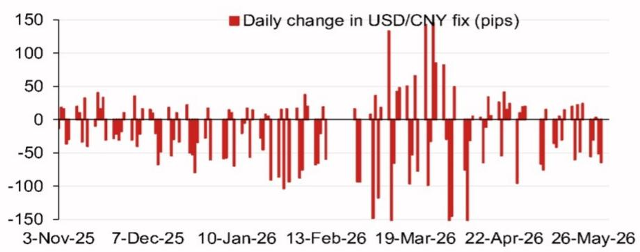
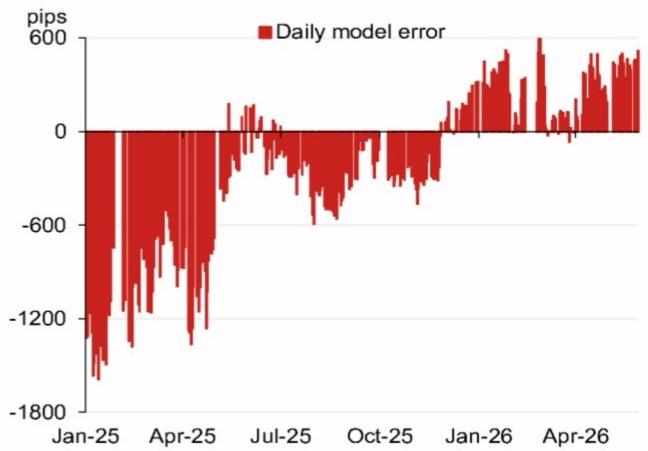

# The USD/CNY Fix Is Entering a New Regime, and Markets Are Not Pricing It Correctly

The People's Bank of China's daily fix for the USD/CNY exchange rate is not a mechanical calculation. It is a policy signal, a diplomatic lever, and a risk management tool rolled into one daily number. For analysts and investors tracking Asia ex-Japan FX, understanding the fix is not optional—it is foundational. A global investment bank report published on 1 June 2026 projects the next fix at 6.7661, a full 515 pips lower than the previous fix of 6.8176. That is a large move by historical standards. But the number itself is not the story. What matters is what the model reveals about the shifting logic behind the fix, and how that logic will evolve through the second half of 2026.

This article argues that the USD/CNY fix is transitioning from a defensive stability mechanism to a more active policy tool, one that reflects both internal economic priorities and external diplomatic calendars. The model projections point to a stronger renminbi bias in the near term, but the real insight lies in the counter-cyclical factor, the pattern of model errors, and the political events that will shape fix decisions in the months ahead. Investors who treat the fix as a technical input are missing the strategic picture. Those who read it as a forward indicator of policy intent will have a clear edge.

The argument unfolds in five parts. First, the model's output signals a deliberate shift in fix policy, not a passive adjustment to market forces. Second, the counter-cyclical factor remains the most opaque and most powerful variable in the fix equation, and its current setting deserves scrutiny. Third, the pattern of model errors over the past 18 months reveals a central bank that is learning, adapting, and becoming more sophisticated in its management of expectations. Fourth, the calendar of high-stakes political events through late 2026 creates specific windows in which fix policy will likely shift again. Finally, the report leaves several critical questions unanswered, and these gaps define the research agenda for serious FX strategists.

This is not a summary of a research report. It is an interpretation of what the report's model and data mean for decision-makers. The goal is to equip readers with a framework for anticipating fix changes, not just reacting to them.

## The Model Projects a Sharply Stronger Fix, But the Signal Is More About Policy Intent Than Market Mechanics

The headline number is striking. The model projects a fix of 6.7661, which is 515 pips lower than the previous fix of 6.8176. A move of this magnitude, if realized, would represent a significant strengthening of the renminbi against the dollar in a single fix window. But the projection is not a forecast of where the spot rate will trade. It is an estimate of where the fix would land if the model's inputs were the only factors at work. The model incorporates overnight moves in a basket of currencies, with the Korean won, the euro, the Australian dollar, and the British pound contributing the largest weighted changes. The won alone contributes 15 pips of upward pressure on the renminbi. The euro and Australian dollar pull in the opposite direction.

What matters is not the arithmetic of these weights. It is the fact that the model is producing a projection that is significantly stronger than the previous fix. This implies that, in the absence of any discretionary adjustment, the fix would naturally move toward a stronger renminbi. That is not a neutral technical outcome. It is a reflection of broader dollar weakness and renminbi-supportive cross-currency dynamics. But the central bank does not operate in a vacuum. It has the ability to override the model's output using the counter-cyclical factor, and it has a track record of doing so when it judges that market forces are out of line with policy objectives.

The key question for investors is whether the central bank will allow the fix to move as strongly as the model suggests, or whether it will apply a discretionary filter. The answer depends on the policy environment, not on the model. The model provides a baseline. The policy choice provides the outcome.

## The Counter-Cyclical Factor Remains the Most Important Variable, and Its Current Setting Signals Caution

The report provides a second projection that includes the counter-cyclical factor: 6.7873. That is 303 pips lower than the previous fix, but still 212 pips weaker than the pure model projection. This gap is the discretionary space the central bank is choosing to occupy. It is not a small gap. It tells us that the central bank is willing to let the fix strengthen, but not as much as the model alone would dictate. This is a signal of caution, not of resistance.

The counter-cyclical factor was introduced to allow the central bank to lean against excessive market volatility, whether that means preventing excessive renminbi weakness or excessive strength. In practice, it has been used more often to defend against depreciation pressure than to cap appreciation. But the current setting suggests a different dynamic. The central bank is not trying to hold the line against depreciation. It is trying to manage the pace of appreciation. That is a meaningful shift.

Why would the central bank want to slow the renminbi's strengthening? There are several plausible reasons. A too-rapid appreciation could hurt export competitiveness at a time when the external demand environment remains uncertain. It could also destabilize domestic financial conditions by triggering rapid capital inflows that are difficult to manage. And it could create political friction with trading partners who might view a sharp renminbi appreciation as a form of competitive rebalancing rather than a market-driven adjustment.

The counter-cyclical factor is the central bank's way of saying "not too fast." But the fact that it is allowing any appreciation at all is the more important signal. The direction of the bias has changed. Investors should watch the size of the counter-cyclical adjustment in each daily fix. A narrowing gap between the model projection and the adjusted fix would indicate growing confidence in allowing market forces to drive the renminbi higher. A widening gap would signal renewed caution.

## The Pattern of Model Errors Reveals a Central Bank That Is Becoming More Proactive and More Precise

The report includes a chart of daily model errors over the period from January 2025 to April 2026. The errors are large and variable. In January 2025, the error was minus 1,800 pips. By July 2025, it had narrowed to zero. By January 2026, it had swung to plus 600 pips. These are not small rounding errors. They are deliberate deviations from the model's output, and they tell a story about the central bank's evolving approach.

In early 2025, the central bank was leaning heavily against depreciation pressure. The model was projecting a weaker fix than the central bank was willing to set, so the actual fix was significantly stronger than the model. That is the classic defense of the renminbi in a period of stress. By mid-2025, the error had essentially disappeared. The model and the fix were aligned. That suggests a period of relative calm, or at least a period in which the central bank saw no need to intervene.

By early 2026, the error had flipped. The model was projecting a stronger fix than the central bank was willing to set. The actual fix was weaker than the model. That is the pattern we see today. The central bank is now leaning against appreciation, not depreciation. That is a regime change.

The implication is clear. The central bank is not a passive actor that simply validates market moves. It is an active participant that uses the fix to manage the pace and direction of renminbi movement. The pattern of errors shows that the central bank is becoming more precise in its interventions. The errors are smaller in magnitude than they were in early 2025, and they are more consistent in direction. This suggests a learning process. The central bank is getting better at calibrating the fix to achieve its objectives without creating excessive volatility or triggering speculative attacks.

For investors, this means that the fix is becoming a more reliable signal of policy intent, not less. As the central bank becomes more precise, the gap between the model and the actual fix becomes a clearer indicator of where policy is heading.

## The Political Calendar Through Late 2026 Will Force Several Inflection Points in Fix Policy

The report includes a calendar of events extending through the end of 2026. The Politburo meeting for economic work in late July, the APEC summit in Shenzhen in November, the Central Economic Work Conference in mid-December, and a potential state visit by China's president to the United States toward the end of the year. Each of these events creates a context in which the fix will be managed with specific diplomatic and domestic objectives in mind.

The July Politburo meeting is the first major milestone. The readout from this meeting typically includes a to-do list for the economy and clues to the priorities of top leaders. If the meeting signals a greater emphasis on external rebalancing or currency flexibility, the fix could move more aggressively toward the model's projection. If the focus remains on stability and export support, the counter-cyclical factor will likely remain in place.

The APEC summit in November is a different kind of event. China is hosting the 31st APEC Economic Leaders' Meeting in Shenzhen. Hosting a major international summit creates a powerful incentive for stability. The central bank will want to avoid sharp currency moves that could dominate headlines or create diplomatic friction. That suggests a period of fix management aimed at reducing volatility, not signaling direction.

The Central Economic Work Conference in December is the most important domestic policy event of the year. It sets the agenda for the following year. If the conference signals a shift toward a more market-determined exchange rate, the fix regime could change fundamentally. If it reaffirms the current approach, the gradual managed appreciation path will continue.

The potential state visit by China's president to the United States is the wildcard. A meeting between the two leaders could produce agreements on trade, tariffs, or currency matters that would directly affect the fix. The report notes that President Trump stated in February 2026 that President Xi would visit the White House toward the end of the year. If that visit materializes, the fix will become a bargaining chip. Investors should expect the fix to be used as a signal of goodwill or as a tool of negotiation in the weeks leading up to the visit.

## What the Report Does Not Fully Answer: The Interaction Between the Fix and Capital Flows, and the Threshold for a Regime Shift

The report provides a detailed model and a rich set of data, but it leaves two critical questions unresolved. First, how does the fix interact with capital flow dynamics? The model is built on overnight currency moves and a basket weighting methodology. It does not explicitly incorporate capital account pressures, such as portfolio inflows or outflows, trade settlement patterns, or corporate hedging behavior. Yet these flows are a major driver of spot market dynamics, and the fix is ultimately a tool for managing the gap between onshore and offshore markets.

If capital inflows accelerate, the central bank may face a choice between allowing the renminbi to appreciate more rapidly or intervening in the spot market to absorb the inflows. The fix is part of that calculus, but it is not the whole story. The report does not provide a framework for linking fix policy to the broader capital account environment. That is a gap that serious investors need to fill on their own.

Second, what is the threshold at which the central bank would abandon the current gradual approach and allow a more abrupt adjustment? The model errors show that the central bank is becoming more precise, but precision does not mean predictability. There may be a level of market pressure or a diplomatic trigger that causes the central bank to shift from managing the pace of change to accepting a step change. The report does not identify that threshold. It provides the tools for monitoring the fix, but it does not offer a decision rule for when the regime itself might change.

These unanswered questions are not weaknesses in the report. They are invitations for further analysis. Investors who can build a bridge between the fix model and capital flow dynamics, and who can identify the conditions for a regime shift, will have a significant advantage over those who simply track the daily fix number.

## A Decision Framework for Monitoring and Anticipating Fix Changes

For investors who want to operationalize the insights from this report, a three-part framework is useful. First, track the gap between the pure model projection and the actual fix on a daily basis. A narrowing gap signals that the central bank is becoming more comfortable with market-driven appreciation. A widening gap signals renewed caution or a shift in policy priorities.

Second, monitor the composition of the model's inputs. The top four weighted currencies in the current projection are the Korean won, the British pound, the Australian dollar, and the euro. Changes in the relative contribution of these currencies can reveal shifts in the implicit basket that the central bank is targeting. A rising weight for the won, for example, may indicate that the central bank is paying more attention to regional competitive dynamics.

Third, align fix analysis with the political calendar. In the weeks before a major event, expect the fix to be managed for stability. In the weeks after, expect the fix to reflect any policy shifts that emerge from the event. The July Politburo meeting, the November APEC summit, and the December Central Economic Work Conference are the three most important events for the remainder of 2026. Each one creates a window in which the fix regime could change.

This framework is not a substitute for in-depth research. It is a starting point for building a more sophisticated understanding of how the fix works in practice. The report provides the model and the data. The investor must provide the judgment.

Join the community to read the full report and review the original charts.

*This article is for learning and discussion only and does not constitute investment advice.*

Personal reading notes and learning share only. Not investment advice.

