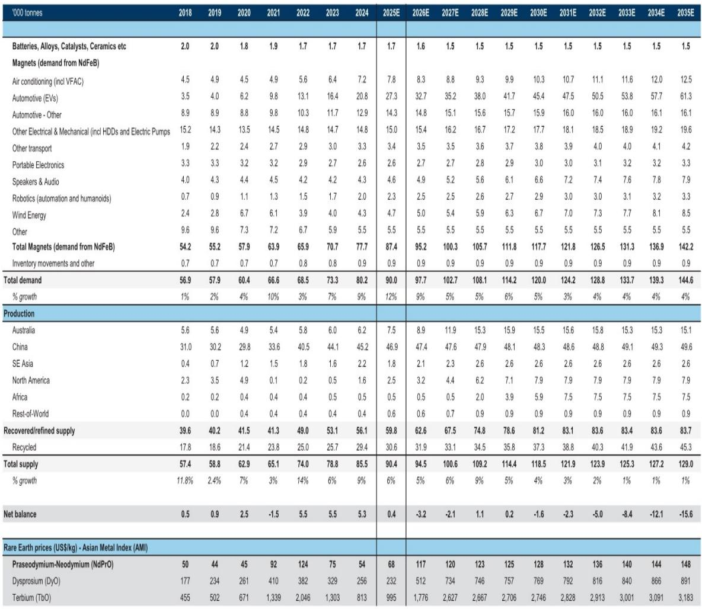
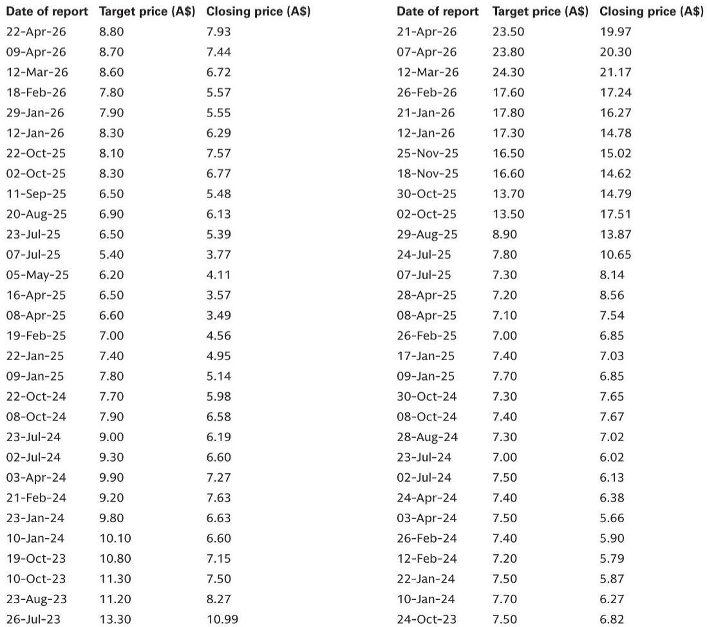
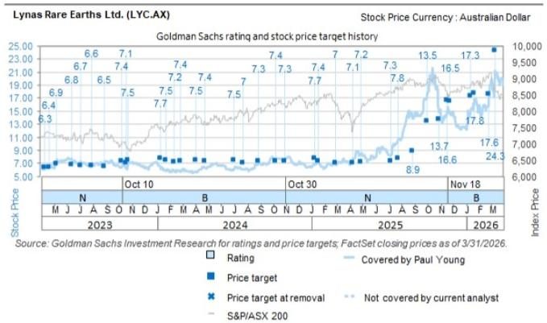

# Rare Earth Magnets Are Entering a Structural Deficit: The 2026 Demand Inflection Demands a New Supply Strategy

The rare earth magnet market has crossed a critical threshold. After years of demand growth that was largely met by expanding Chinese production and inventory drawdowns, the supply-demand balance for neodymium-praseodymium oxide (NdPrO) is now shifting into a sustained deficit that extends well beyond the typical commodity cycle. A recent call with JL Mag, the world's largest producer of sintered NdFeB magnets, reveals that the company expects roughly 10% growth in rare earth magnet sales in 2026, driven by electric vehicles, electric trucks, and industrial robotics. But this is not merely a cyclical upswing. The structural drivers are intensifying: EV penetration is accelerating in heavy-duty vehicles where magnet intensity is higher, robotics orders are surging at over 80% year-on-year, and wind turbine installations are recovering with geopolitical tailwinds. Meanwhile, upstream supply has been disrupted by Chinese regulatory investigations into quota overproduction, and the medium-term supply outlook from new mines remains uncertain.

The implication is clear: investors who treat rare earths as a niche materials play risk missing a multi-year thematic shift. This is not about one quarter of strong orders. It is about a demand trajectory that the supply base is not positioned to meet. The global NdPrO market is forecast to move from a small surplus of 0.4 kilotonnes in 2025 to a deficit of 3.2 kilotonnes in 2026, and deficits are projected to widen to over 15 kilotonnes by 2035. For context, total NdPrO demand in 2026 is estimated at nearly 98 kilotonnes. A deficit of this magnitude, if realized, will force price adjustments, supply chain reconfiguration, and strategic stockpiling by end-users. The question is not whether prices will rise, but how the market will allocate scarce supply and which companies are best positioned to capture value.

The following analysis draws on the call insights and the broader supply-demand framework to identify the strategic implications for investors, corporate planners, and policymakers. The argument is not that rare earths are simply a good trade. It is that the market is entering a regime change that demands a fundamentally different approach to positioning and risk management.

## The Magnet Demand Recovery Is Broad-Based and Accelerating, Not a One-Off Rebound

The most important signal from the recent call is not the 16% revenue growth or the 6-percentage-point gross margin expansion in the first quarter. It is the order trajectory. After a soft first quarter that followed the Chinese New Year lull, management reports that magnet orders in April and May have nearly doubled compared to the first quarter. Capacity utilisation is tracking above 90% so far for 2026. This is not a low-base effect; it is a demand acceleration that is broad across end markets.

Electric vehicles remain the largest driver, but the composition is shifting. The growth in electric trucks and commercial vehicles is particularly noteworthy because these applications use significantly more magnet material per vehicle than passenger cars. A heavy-duty electric truck can require 10 to 20 times the magnet content of a standard EV sedan. As battery electric trucks begin to scale in China and globally, the magnet intensity of the EV fleet is rising. This is a structural multiplier that is often missing from aggregate EV penetration forecasts. Meanwhile, the industrial robotics segment grew over 80% in the first quarter, driven by downstream industrial demand in China and orders from semiconductor plants. Management expects this segment to overtake wind turbines as the third-largest revenue contributor. This is not a niche; it is a rapidly scaling industrial demand driver that will compound over time.

The pricing mechanism reinforces the bullish outlook. Raw materials account for roughly 70% of the cost base, and JL Mag operates on a cost-plus model that passes through NdPr spot prices with a lag. The adjustment mechanism varies by end market: quarterly for EVs, annually for wind turbines, and monthly for air conditioning. This means that as NdPrO prices rise, magnet producers can largely protect their margins, and the lag in pass-through creates a working capital advantage during periods of rising input costs. Management expects further upward adjustment to magnet prices into year-end. The combination of volume growth and pricing power is a powerful margin dynamic.

## The Supply Side Is More Constrained Than Headline Capacity Numbers Suggest

It is tempting to look at global NdPrO supply projections and conclude that the market will be adequately supplied. Total supply is forecast to grow from approximately 90 kilotonnes in 2025 to 129 kilotonnes by 2035, a compound annual growth rate of roughly 3.5%. But the composition of that supply growth matters enormously. Chinese production, which currently accounts for over half of global supply, is projected to grow at less than 1% per annum over the next decade. The growth is expected to come from Australia, North America, and Africa, but these projects face long lead times, permitting risks, and technical challenges.

The recent disruption in Chinese supply is a case study in the fragility of the current system. Chinese authorities investigated rare earth refineries for exceeding 2025 production quotas, triggering a shortage and a step-up in pricing during the first quarter. JL Mag sources roughly 70% of its NdPrO from two major Chinese producers under existing agreements, with the remaining 30% supplied internally from its own recycling plant. This recycling capability provides a buffer, but it is not scalable to meet the projected demand growth. The company does not expect NdPrO prices to decline in 2026, and the supply-demand model suggests deficits in most years from 2026 through 2035.

The implication is that the market is structurally short of supply, and the deficits will not be easily resolved by new mine development. Even if projects in Australia and North America ramp as planned, the deficits in the early 2030s are projected to be severe. This is not a temporary imbalance that will correct itself. It is a multi-year structural gap that will require higher prices to incentivize supply and demand destruction in less essential applications.

## The Pricing Mechanism Creates a Divergence Between Magnet Producers and Upstream Miners

One of the most underappreciated aspects of the rare earth value chain is the asymmetry in pricing power. Magnet producers like JL Mag operate under cost-plus contracts that pass through raw material costs with a lag. This means that rising NdPrO prices are largely a pass-through item for magnet producers, protecting their margins but limiting their upside. The real leverage to rising NdPrO prices accrues to upstream miners and processors who own the resource.

However, there is a nuance. The lag in pass-through, particularly for wind turbine contracts that are locked in annually, means that magnet producers can benefit from a timing advantage during periods of rapid price increases. If NdPrO prices rise sharply, the magnet producer's input costs increase immediately, but their selling prices adjust only after the contractually defined period. This can compress margins in the short term. Conversely, if prices stabilize or decline, the lag works in the opposite direction. The net effect over a full cycle is that magnet producers earn a stable margin on conversion, while upstream miners capture the commodity price leverage.

For investors, this means that the rare earth theme is not monolithic. The value chain has distinct risk-return profiles. Upstream producers offer direct exposure to NdPrO prices, with higher volatility but greater upside during bull markets. Magnet producers offer volume growth and margin stability, with lower volatility but less commodity leverage. The strategic question is which part of the chain is best positioned for the current cycle. Given the expected deficits and rising prices, the upstream segment appears to offer more asymmetric upside, but it also carries more execution risk from new projects.

## What the Report Does Not Fully Answer: The Substitution Threat and the Humanoid Robot Wildcard

The call and the supply-demand model are compelling, but they leave two critical questions unanswered. The first is the substitution threat. NdFeB magnets are the most powerful permanent magnets commercially available, and for applications like EV drive motors and wind turbine generators, there is no viable substitute at scale. However, in less demanding applications, such as certain consumer electronics and industrial motors, alternative magnet chemistries or motor designs could reduce NdPrO demand. The report notes that wind turbine customers are more price-sensitive than EV and air conditioning customers, and that the limited availability of substitutes is a key support for pricing. But if NdPrO prices rise significantly, the incentive to develop and deploy substitutes will increase. The model assumes that substitution is limited, but this assumption has not been stress-tested for a sustained period of high prices.

The second unanswered question is the humanoid robot wildcard. The robotics segment in the model is currently small, projected to grow from 2.5 kilotonnes of NdPrO demand in 2026 to 3.3 kilotonnes by 2035. But this forecast predates the recent acceleration in humanoid robot development. If humanoid robots scale commercially in the late 2020s, each unit could require significant magnet content, potentially adding several kilotonnes of demand that is not captured in the current model. The call noted that industrial robot sales volumes grew more than 80% in the first quarter, but this is for traditional robotic arms, not humanoids. The potential for humanoid robots to become a major demand driver is a high-impact, low-probability event that could transform the supply-demand balance.

These open questions do not invalidate the thesis, but they highlight the need for scenario analysis. Investors should consider a range of outcomes, including the possibility that substitution or new supply sources moderate the deficit, and the possibility that humanoid robots create a demand shock that pushes the market into even deeper deficit.

## A Decision Framework for Navigating the Rare Earth Magnet Cycle

For corporate strategists and investors, the rare earth magnet market requires a decision framework that accounts for three dimensions: time horizon, value chain position, and scenario dependence.

First, time horizon. The near-term outlook for 2026 is relatively clear. Demand growth of roughly 10% is supported by visible order books, supply is constrained by Chinese quota enforcement, and prices are trending higher. This supports a bullish view on NdPrO prices and magnet producer volumes for the next 12 to 18 months. The medium-term outlook to 2030 is more uncertain, as new supply from Australia and North America could come online, and substitution effects could begin to bite. The long-term outlook to 2035 is the most speculative, but the structural deficit projections suggest that current supply plans are insufficient.

Second, value chain position. Upstream producers offer direct commodity leverage and are the preferred exposure for a bull case on NdPrO prices. Magnet producers offer volume growth and margin stability, and are more suitable for investors who want rare earth exposure with lower volatility. The choice depends on the investor's risk appetite and conviction in the price thesis.

Third, scenario dependence. The base case is a gradual tightening of the market with moderate deficits and rising prices. The bull case is a demand shock from humanoid robots or accelerated EV truck adoption, leading to severe deficits and a price spike. The bear case is faster-than-expected substitution or a global economic slowdown that reduces demand growth. Investors should size their positions accordingly and be prepared to adjust as new data emerges.

The most important strategic insight is that the rare earth magnet market is no longer a cyclical niche. It is a structural growth market with supply constraints that are not easily resolved. The companies and countries that secure access to rare earth supply and processing capacity will have a competitive advantage in the energy transition and advanced manufacturing. This is not a short-term trade. It is a long-term strategic theme.

Join the community to read the full report and review the original charts. The analysis here is based on a single call and a supply-demand model, but the full report contains detailed breakdowns by end market, supply project, and pricing scenario that will allow you to stress-test your own assumptions and build a more robust investment thesis.

*This article is for learning and discussion only and does not constitute investment advice.*

Personal reading notes and learning share only. Not investment advice.

