# US Inflation Monitor: April 2026: Commodity Prices and AI-Related Effects Continue to Boost Inflation

# ■ Recent inflation trends:

Core PCE prices increased by $0.24\%$ month over month and $3.29\%$ year over year rate in April. Core CPI increased by $0.38\%$ month over month and $2.74\%$ year over year in April. April inflation was boosted by two months' worth of rent and owners' equivalent rent inflation, which went unmeasured 6 months ago because of the federal government shutdown.   
☐ Headline PCE prices increased by 0.40% month over month and 3.77% year over year in April, boosted by another strong increase in energy prices (+3.9% month-over-month). Headline CPI increased 0.64% month over month and 3.78% year-over-year in April.   
Core goods prices increased by 0.30% in April (vs. +0.21% in March) and 2.8% over the prior year—the fastest year-over-year pace since December 2022—in the PCE price index. This compares to an average year-over-year pace of -0.5% in 2018, when year-on-year core PCE inflation ran at a roughly 2% pace.   
Core services prices increased by 0.22% in April (vs. +0.32% in March) and 3.4% over the prior year in the PCE price index. This compares to an average year-over-year pace of 2.5% in 2018, when overall core PCE inflation was roughly 2%.

# Iran war effects:

☐ Oil prices have increased sharply since the start of the Iran war, with spot prices rising from \$71/barrel on average in February to \$117/barrel on average in April, \$108/barrel on average in May, and \$92/barrel today. Our oil strategists expect Brent crude oil prices to decline to \$90/barrel by 2026Q4, but they see risks as two-sided with significant upside risks from potentially more persistent supply losses but meaningful downside risk from weaker demand. We expect higher energy prices to boost core PCE inflation by roughly 0.35pp this year.   
☐ The war has also raised prices of other Gulf exports including chemical and metal products such as nitrogen fertilizer and aluminum. We expect higher fertilizer costs to boost food prices by roughly 1.0% this year, worth about 0.07pp on headline inflation. We expect higher food prices to raise restaurant prices in core PCE, boosting core inflation by 0.05-0.10pp.   
☐ Higher energy and other commodity prices will directly boost headline

# Jessica Rindels

+1(972)368-1516

jessica.rindels@gs.com

GS & Co. LLC

inflation through higher household energy and food prices. We have raised our December 2026 year-over-year headline PCE inflation forecast by 1.4pp since the start of the war, with most of the boost coming from higher energy prices.

# AI-Related effects:

□ AI is boosting inflation through three main channels.

\- Strong demand for AI infrastructure has raised the prices of some key electronics inputs, including digital memory and batteries. For example, the producer price index for electronic components and accessories increased by 20% on a year-over-year basis in April.

\- AI-related spending has likely put some upward pressure on software prices in recent years, as several companies have recently raised software prices. We see this as a channel for potential mismeasurement because software and accessories are not quality-adjusted in either PCE or CPI, meaning new AI features have likely been captured as pure price (rather than quantity) increases.

\- Strong demand for data centers is boosting electricity demand and power prices. We estimate that higher electricity prices will boost headline PCE inflation by about 0.1-0.2pp over the next few years.

☐ Computer software and accessories prices in the PCE price index increased by 5.0% month-over-month in April after increasing by 4.0% in March and 6.5% in February. This likely reflects a combination of higher accessories prices as a result of memory cost increases and higher software prices. While CPI and PCE use the same price index for this component, the recent acceleration has boosted core PCE by significantly more than core CPI because the software and accessories component receives roughly 30 times the weight in PCE compared to CPI, which we suspect reflects an overstatement of software sales to retail customers in the PCE source data.

☐ We expect higher electronics and digital input prices to boost year-over-year core PCE inflation by another 0.3pp (making a peak of 0.6pp in 2026Q3) and core CPI inflation by about 0.1pp over the next year.

# Tariff effects:

☐ We estimate that the share of tariff costs that has passed through to consumer prices reached 90% after 13 months.   
☐ We estimate that tariffs have boosted current year-over-year core PCE inflation by 0.9pp and will contribute 0.1pp at the end of 2026.   
☐ We expect core goods inflation to decelerate from a year-over-year pace of 2.8% in April 2026 to 1.8% in December 2026 and 0.5% in December 2027 as tariff cost passthrough to goods prices comes to an end.

# Inflation expectations:

☐ Inflation expectations have increased notably since the start of the Iran war. Short-term inflation expectations increased in both the UMich (+0.1pp to +4.8%, 1yr ahead) and NY Fed (+0.2pp to +3.6%, 1yr ahead) surveys.

Long-term household inflation expectations increased notably in the University of Michigan survey (+0.4pp to +3.9%, next 5-10yr) while the New York Fed measure declined (-0.1pp to +3.0%, 5yr ahead).

☐ Financial market-implied expectations for annualized headline CPI inflation over the next few years were little changed over the past month but have increased sharply since the start of the Iran war.

# GS inflation forecast:

☐ We estimate that core PCE inflation net of tariff effects stands at roughly 2.4% in April. Inclusive of tariff effects, we expect core PCE inflation to decline to 2.8% by December 2026.

☐ We expect core CPI inflation to decline from 2.7% in April to 2.5% in December 2026 and 2.1% in December 2027.

New inflation research from US Economics:

US Daily: What's Behind the Recent Core PPI Acceleration?, May 11   
US Economics Analyst: AI and (Measured) Inflation: Up Then Down, May 4   
US Daily: Core vs. Trimmed vs. Median: What's the Best Measure of the Inflation Trend?, May 1   
US Economics Analyst: Higher Energy Costs, International Spillovers, and the Inflation Outlook, April 28

# Latest Inflation Trends

Exhibit 1: Both Core PCE Inflation (+0.05pp to +3.29%) and Core CPI Inflation (+0.14pp to +2.74%) Accelerated on a Year-on-Year Basis in April   
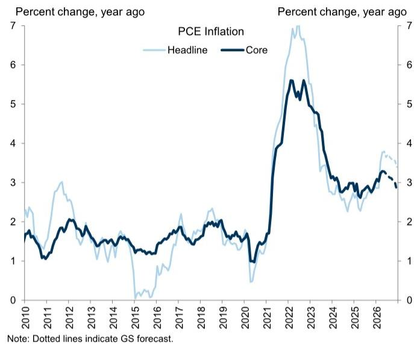

line

| Year | Headline | Core |
|------|----------|------|
| 2010 | 2.5      | 1.8  |
| 2011 | 3.0      | 1.5  |
| 2012 | 2.8      | 2.0  |
| 2013 | 2.0      | 1.7  |
| 2014 | 1.5      | 1.5  |
| 2015 | 0.5      | 1.2  |
| 2016 | 1.0      | 1.5  |
| 2017 | 2.0      | 1.8  |
| 2018 | 2.5      | 2.0  |
| 2019 | 2.0      | 1.8  |
| 2020 | 1.0      | 1.0  |
| 2021 | 4.0      | 4.5  |
| 2022 | 7.0      | 5.5  |
| 2023 | 6.5      | 5.0  |
| 2024 | 3.5      | 3.0  |
| 2025 | 3.0      | 3.0  |
| 2026 | 3.5      | 3.0  |

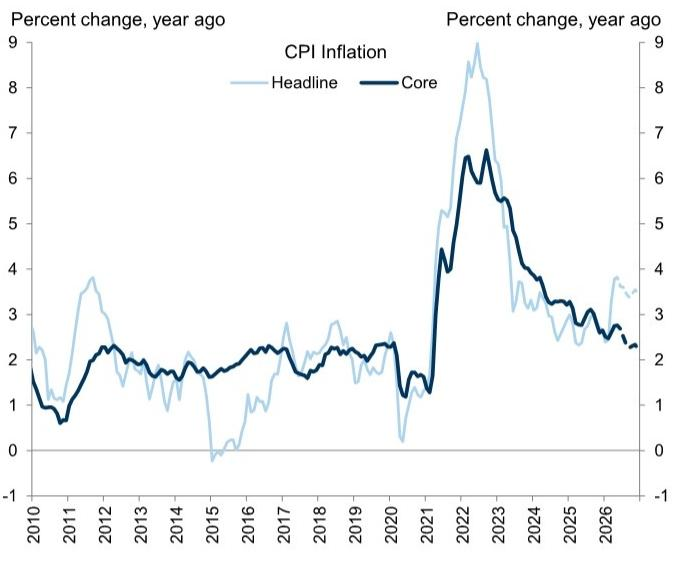

line

| Year | Headline | Core |
|------|----------|------|
| 2010 | 2.5      | 1.5  |
| 2011 | 3.8      | 1.0  |
| 2012 | 2.0      | 2.2  |
| 2013 | 1.8      | 1.9  |
| 2014 | 2.1      | 1.8  |
| 2015 | -0.5     | 1.7  |
| 2016 | 1.5      | 2.0  |
| 2017 | 2.8      | 2.1  |
| 2018 | 2.5      | 2.0  |
| 2019 | 2.3      | 2.2  |
| 2020 | 2.5      | 2.3  |
| 2021 | 0.5      | 1.5  |
| 2022 | 8.5      | 6.5  |
| 2023 | 9.0      | 6.8  |
| 2024 | 3.5      | 4.0  |
| 2025 | 3.0      | 3.5  |
| 2026 | 3.5      | 3.0  |

Source: Department of Commerce, Department of Labor, GS Global Investment Research

Exhibit 2: Measures of the Sequential Core Inflation Trend Accelerated on Net in April, Partly Reflecting a Boost From Two Months' Worth of Rent and Owners' Equivalent Rent Inflation, Which Went Unmeasured in October 2025 Because of the Government Shutdown   

line

| Indicator | Apr | % change, month ago |
| --- | --- | --- |
| Core PCE | 0.24 | |
| SF Fed Cyclical Core PCE Inflation | 0.37 | |
| Dallas Fed Trimmed-Mean | 0.21 | |
| GS Trimmed Core | 0.17 | |
| Core CPI | 0.38 | |
| Atlanta Fed Core Sticky CPI | 0.39 | |
| Cleveland Fed 16% Trimmed-Mean | 0.43 | |
| Cleveland Fed Median | 0.40 | |

Source: Department of Commerce, Federal Reserve, GS Global Investment Research

Exhibit 3: Measures of the Year-on-Year Inflation Trend Accelerated on Average in April, Remaining Somewhat Elevated   
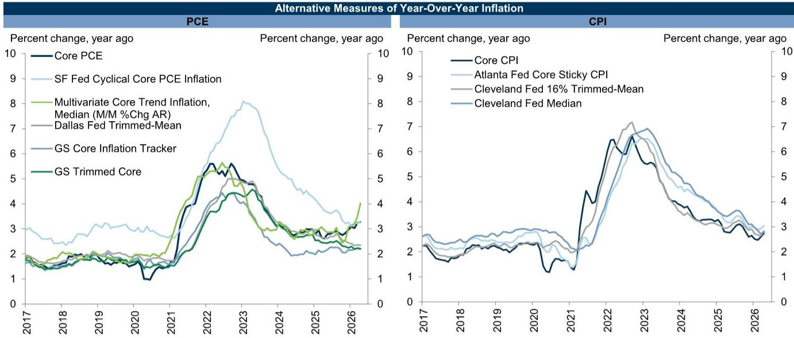

<table><tr><td rowspan="2">Indicator</td><td colspan="5">Latest Readings</td></tr><tr><td>Month</td><td>% change, year ago</td><td>Indicator</td><td>Month</td><td>% change, year ago</td></tr><tr><td>Core PCE</td><td>Apr</td><td>3.29</td><td>Core CPI</td><td>Apr</td><td>2.74</td></tr><tr><td>SF Fed Cyclical Core PCE Inflation</td><td>Apr</td><td>3.31</td><td>Atlanta Fed Core Sticky CPI</td><td>Apr</td><td>3.04</td></tr><tr><td>Dallas Fed Trimmed-Mean</td><td>Apr</td><td>2.35</td><td>Cleveland Fed 16% Trimmed-Mean</td><td>Apr</td><td>2.83</td></tr><tr><td>GS Core Inflation Tracker</td><td>Apr</td><td>2.20</td><td>Cleveland Fed Median</td><td>Apr</td><td>2.80</td></tr><tr><td>GS Trimmed Core</td><td>Apr</td><td>2.21</td><td></td><td></td><td></td></tr><tr><td>Multivariate Core Trend Inflation</td><td>Apr</td><td>4.02</td><td></td><td></td><td></td></tr></table>

Source: Department of Commerce, Federal Reserve, GS Global Investment Research

Exhibit 4: The Contribution from Financial and Medical Services to Year-Over-Year Inflation Has Been Higher Than Usual   
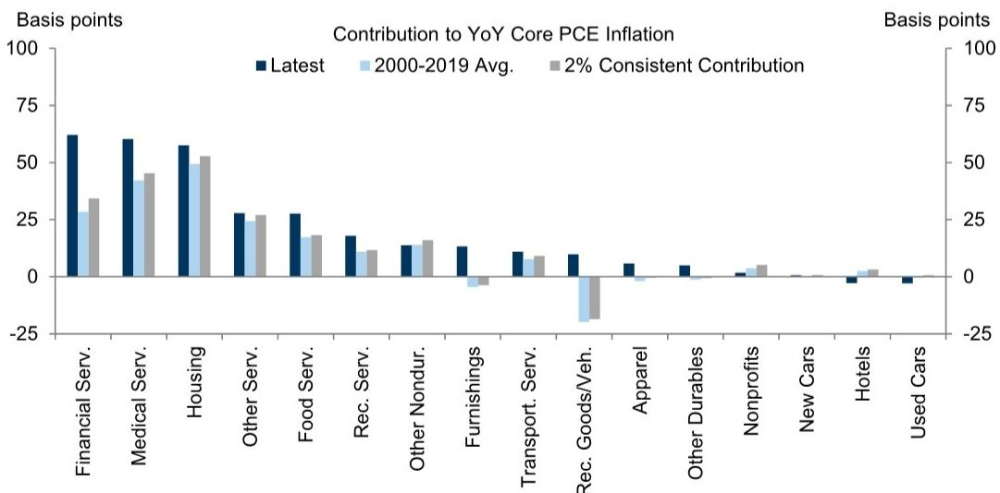

bar

Contribution to YoY Core PCE Inflation Basis points
| Category | Latest (Basis points) | 2000-2019 Avg. (Basis points) | 2% Consistent Contribution (Basis points) |
|---|---|---|---|
| Financial Serv. | 63 | 28 | 34 |
| Medical Serv. | 61 | 43 | 47 |
| Housing | 57 | 51 | 54 |
| Other Serv. | 28 | 25 | 27 |
| Food Serv. | 27 | 17 | 18 |
| Rec. Serv. | 18 | 12 | 11 |
| Other Nondur. | 14 | 13 | 16 |
| Furnishings | 13 | -3 | -4 |
| Transport. Serv. | 11 | 8 | 9 |
| Rec. Goods/Veh. | 10 | -20 | -23 |
| Apparel | 5 | -2 | -1 |
| Other Durables | 4 | -1 | -1 |
| Nonprofits | 1 | 3 | 4 |
| New Cars | 0 | 0 | 0 |
| Hotels | -3 | 2 | 3 |
| Used Cars | -2 | 0 | 0 |

Note: The 2% consistent contribution takes the average contribution for each component between 2000-2019, then calculates the minimum necessary increase in standardized component inflation rates required to reach 2% core PCE inflation.

Exhibit 5: The PCE Measure of Core Goods Prices Accelerated in April While CPI Core Goods Prices Increased at a Slower Pace, Largely Reflecting the Larger Impact of Software and Accessories in the PCE Index   
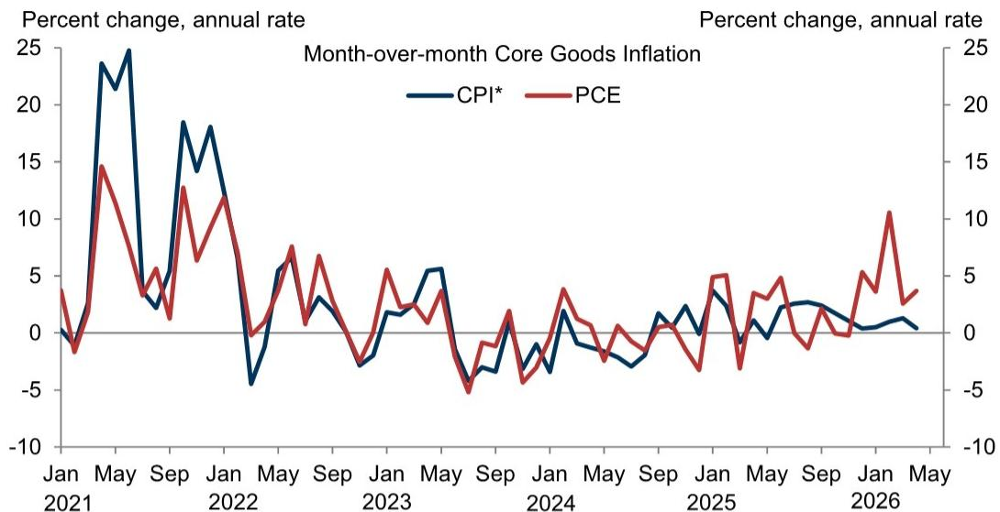

line

| Month       | CPI*  | PCE   |
| ----------- | ----- | ----- |
| Jan 2021    | -1.0  | -2.0  |
| May 2021    | 24.0  | 14.0  |
| Sep 2021    | 3.0   | 5.0   |
| Jan 2022    | 18.0  | 12.0  |
| May 2022    | -5.0  | 7.0   |
| Sep 2022    | 3.0   | 6.0   |
| Jan 2023    | -3.0  | -1.0  |
| May 2023    | 5.0   | 3.0   |
| Sep 2023    | -5.0  | -4.0  |
| Jan 2024    | -3.0  | -2.0  |
| May 2024    | -1.0  | -1.0  |
| Sep 2024    | 1.0   | 0.0   |
| Jan 2025    | 3.0   | 5.0   |
| May 2025    | -1.0  | -3.0  |
| Sep 2025    | 2.0   | 4.0   |
| Jan 2026    | 1.0   | 10.0  |
| May 2026    | 0.0   | 3.0   |

\* Commodities less food and energy commodities.   
Source: GS Global Investment Research, Department of Commerce, Department of Labor

Exhibit 6: The CPI Measure of Core Services Inflation Excluding Housing Accelerated in April, While the PCE Measure Slowed, Reflecting the Larger Impact of the Extra Month of Rent and OER Inflation on the CPI   
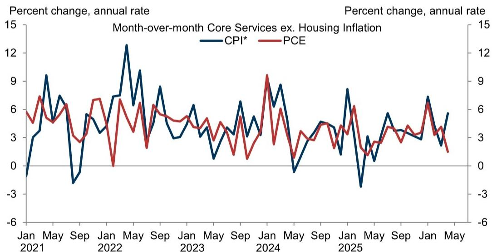

line

| Month       | CPI*  | PCE   |
| ----------- | ----- | ----- |
| Jan 2021    | -1.0  | 6.0   |
| May 2021    | 9.0   | 7.0   |
| Sep 2021    | -2.0  | 3.0   |
| Jan 2022    | 7.0   | 6.0   |
| May 2022    | 13.0  | 6.0   |
| Sep 2022    | 8.0   | 5.0   |
| Jan 2023    | 6.0   | 4.0   |
| May 2023    | 3.0   | 3.0   |
| Sep 2023    | 6.0   | 5.0   |
| Jan 2024    | 9.0   | 9.0   |
| May 2024    | -1.0  | 3.0   |
| Sep 2024    | 5.0   | 5.0   |
| Jan 2025    | -3.0  | 6.0   |
| May 2025    | 3.0   | 3.0   |
| Sep 2025    | 6.0   | 4.0   |
| Jan 2026    | 7.0   | 6.0   |
| May 2026    | 5.0   | 3.0   |

\* Core services excluding rent and OER.   
Source: GS Global Investment Research, Department of Labor, Department of Commerce

Exhibit 7: The April CPI and PCE Reports Included Two Months' Worth of Rent and Owners' Equivalent Rent Inflation, Which Went Unmeasured in October 2025 Because of the Federal Government Shutdown   
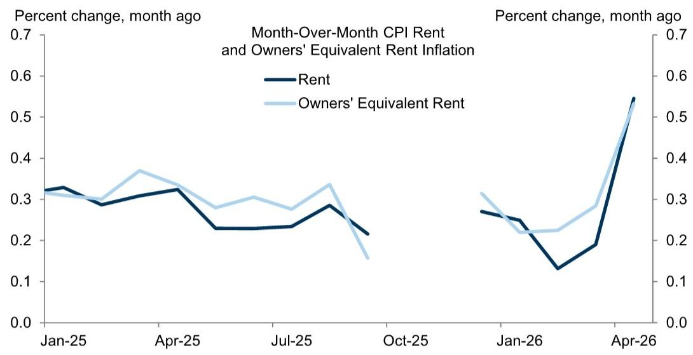

line

Month-Over-Month CPI Rent and Owners' Equivalent Rent Inflation
| Month | Rent (%) | Owners' Equivalent Rent (%) |
|---|---|---|
| Jan-25 | 0.32 | 0.31 |
| Feb-25 | 0.29 | 0.30 |
| Mar-25 | 0.31 | 0.37 |
| Apr-25 | 0.32 | 0.34 |
| May-25 | 0.23 | 0.28 |
| Jun-25 | 0.23 | 0.31 |
| Jul-25 | 0.23 | 0.28 |
| Aug-25 | 0.29 | 0.34 |
| Sep-25 | 0.23 | 0.16 |
| Oct-25 | 0.21 | - |
| Nov-25 | - | - |
| Dec-25 | - | - |
| Jan-26 | 0.27 | 0.32 |
| Feb-26 | 0.25 | 0.23 |
| Mar-26 | 0.13 | 0.23 |
| Apr-26 | 0.55 | 0.55 |

Source: GS Global Investment Research, Department of Labor

# Iran war effects

Exhibit 8: Crude Oil Prices Have Increased by Roughly 50% Since the Start of the War in Iran; Our Oil Strategists Expect Brent Oil Prices to Fall to \$90 by 2026Q4, but See Two-Sided Risks to Prices Going Forward   
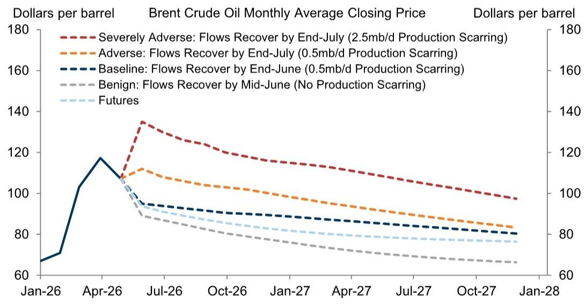

line

| Month   | Severely Adverse: Flows Recover by End-July (2.5mb/d Production Scarring) | Adverse: Flows Recover by End-July (0.5mb/d Production Scarring) | Baseline: Flows Recover by End-June (0.5mb/d Production Scarring) | Benign: Flows Recover by Mid-June (No Production Scarring) | Futures |
|---------|------------------------------------------------------------------------|---------------------------------------------------------------|---------------------------------------------------------------|------------------------------------------------------|---------|
| Jan-26  | 65                                                                     | 65                                                            | 65                                                            | 65                                                   | 65      |
| Apr-26  | 118                                                                    | 112                                                           | 118                                                           | 118                                                  | 105     |
| Jul-26  | 135                                                                    | 110                                                           | 95                                                            | 90                                                   | 95      |
| Oct-26  | 125                                                                    | 105                                                           | 90                                                            | 85                                                   | 90      |
| Jan-27  | 120                                                                    | 100                                                           | 88                                                            | 80                                                   | 85      |
| Apr-27  | 115                                                                    | 95                                                            | 85                                                            | 75                                                   | 80      |
| Jul-27  | 110                                                                    | 90                                                            | 83                                                            | 70                                                   | 78      |
| Oct-27  | 105                                                                    | 85                                                            | 80                                                            | 68                                                   | 75      |
| Jan-28  | 98                                                                     | 80                                                            | 78                                                            | 65                                                   | 73      |

Source: GS Global Investment Research

Exhibit 9: The War Has Raised Prices of Non-Oil Gulf Exports, Including Fertilizers and Aluminum; We Have Boosted Our Forecast for PCE Food Inflation, Reflecting the Increase in Fertilizer Prices   
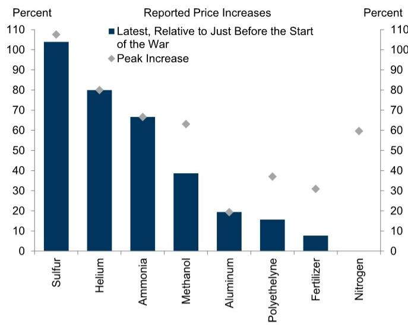

bar_line

Reported Price Increases
| Commodity | Latest, Relative to Just Before the Start of the War (Percent) | Peak Increase (Percent) |
| :--- | :--- | :--- |
| Sulfur | 103 | 108 |
| Helium | 80 | 80 |
| Ammonia | 66 | 67 |
| Methanol | 39 | 64 |
| Aluminum | 19 | 20 |
| Polyethylene | 15 | 38 |
| Fertilizer | 7 | 32 |
| Nitrogen | 0 | 60 |

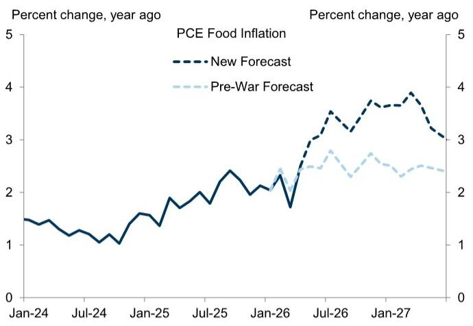

line

| Date    | New Forecast | Pre-War Forecast |
|---------|--------------|------------------|
| Jan-24  | 1.5          | -                |
| Jul-24  | 1.2          | -                |
| Jan-25  | 1.6          | -                |
| Jul-25  | 2.0          | -                |
| Jan-26  | 2.5          | 2.3              |
| Jul-26  | 3.5          | 2.8              |
| Jan-27  | 3.8          | 2.5              |

Source: GS Global Investment Research, Department of Labor, Data compiled by GS Global Investment Research

Exhibit 10: We Estimate That the Boost from Commodity Price Increases to Year-Over-Year Core PCE Inflation Will Peak Around 0.35pp in 2026Q4 in Our Baseline Scenario for Oil Prices, Excluding the Impact via Imported Consumer Goods   
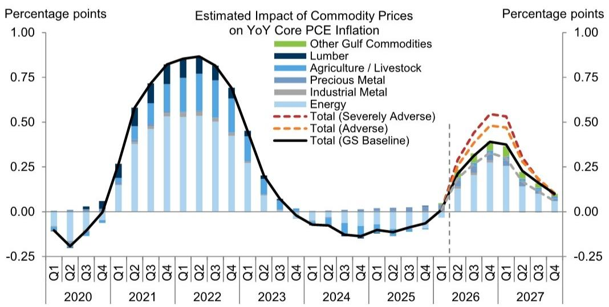

bar_line

Estimated Impact of Commodity Prices on YoY Core PCE Inflation
| Quarter | Other Gulf Commodities | Lumber | Agriculture / Livestock | Precious Metal | Industrial Metal | Energy | Total (Severely Adverse) | Total (Adverse) | Total (GS Baseline) |
|---|---|---|---|---|---|---|---|---|---|
| Q1 2020 | -0.05 | -0.08 | -0.03 | -0.01 | -0.01 | 0.00 | 0.00 | 0.00 | 0.00 |
| Q2 2020 | -0.15 | -0.18 | -0.06 | -0.02 | -0.01 | 0.01 | 0.00 | 0.00 | 0.00 |
| Q3 2020 | -0.12 | -0.14 | -0.05 | -0.01 | -0.01 | 0.02 | 0.00 | 0.00 | 0.00 |
| Q4 2020 | -0.18 | -0.16 | -0.04 | -0.01 | -0.01 | 0.03 | 0.01 | 0.01 | 0.01 |
| Q1 2021 | 0.25 | 0.28 | 0.15 | 0.12 | 0.11 | 0.35 | 0.15 | 0.15 | 0.35 |
| Q2 2021 | 0.55 | 0.62 | 0.38 | 0.35 | 0.34 | 0.65 | 0.38 | 0.38 | 0.65 |
| Q3 2021 | 0.75 | 0.82 | 0.58 | 0.55 | 0.54 | 0.85 | 0.58 | 0.58 | 0.85 |
| Q4 2021 | 0.85 | 0.92 | 0.78 | 0.75 | 0.74 | 0.95 | 0.78 | 0.78 | 0.95 |
| Q1 2022 | 0.88 | 0.94 | 0.82 | 0.79 | 0.78 | 0.96 | 0.82 | 0.82 | 0.96 |
| Q2 2022 | 0.86 | 0.93 | 0.81 | 0.78 | 0.77 | 0.94 | 0.81 | 0.81 | 0.94 |
| Q3 2022 | 0.83 | 0.91 | 0.79 | 0.76 | 0.75 | 0.92 | 0.79 | 0.79 | 0.92 |
| Q4 2022 | 0.78 | 0.87 | 0.73 | 0.71 | 0.71 | 0.86 | 0.73 | 0.73 | 0.86 |
| Q1 2023 | 0.45 | 0.48 | 0.35 | 0.33 | 0.32 | 0.49 | 0.45 | 0.45 | 0.49 |
| Q2 2023 | 0.25 | 0.28 | 0.18 | 0.16 | 0.15 | 0.33 | 0.31 | 0.31 | 0.33 |
| Q3 2023 | 0.15 | 0.17 | 0.11 | 0.11 | 0.11 | 0.26 | 0.24 | 0.24 | 0.26 |
| Q4 2023 | -0.15 | -0.16 | -0.11 | -0.11 | -0.11 | -1.46 | -1.44 | -1.44 | -1.46 |
| Q1 2024 | -0.25 | -0.26 | -0.16 | -0.16 | -0.16 | -1.66 | -1.64 | -1.64 | -1.66 |
| Q2 2024 | -0.35 | -0.36 | -0.21 | -0.21 | -0.21 | -1.96 | -1.94 | -1.94 | -1.96 |
| Q3 2024 | -0.45 | -0.46 | -0.26 | -0.26 | -0.26 | -2.36 | -2.34 | -2.34 | -2.36 |
| Q4 2024 | -0.55 | -0.56 | -0.31 | -0.31 | -0.31 | -2.76 | -2.74 | -2.74 | -2.76 |
| Q1 2025 | -1.55 | -1.56 | -1.33 | -1.33 | -1.33 | -4.46 | -4.44 | -4.44 | -4.46 |
| Q2 2025 | -1.65 | -1.66 | -1.43 | -1.43 | -1.43 | -4.96 | -4.94 | -4.94 | -4.96 |
| Q3 2025 | -1.75 | -1.76 | -1.53 | -1.53 | -1.53 | -5.46 | -5.44 | -5.44 | -5.46 |
| Q4 2025 | -1.85 | -1.86 | -1.63 | -1.63 | -1.63 | -5.96 | -5.94 | -5.94 | -5.96 |
| Q1 2026*Q1-Q4*Q4*Q4*Q4*Q4*Q4*Q4*Q4*Q4*Q4*Q4*Q4*Q4*Q4*Q4*Q4*Q4*Q4*Q4*Q4*Q4*Q4*Q4*Q4*Q4*Q4*Q4*Q4*Q4*Q4*Q4*Q4*Q4*Q4*Q<ecel><ecel><ecel><ecel><ecel><ecel><ecel><ecel><ecel><ecel><nl>

For more information on our commodity price pass-through model, see Ronnie Walker, "US Economics Analyst: The Commodities Boom and Consumer Prices," 2021.

Source: GS Global Investment Research

Exhibit 11: The Price Components of Business Surveys Have Increased Notably Since the Start of the War; Supplier Delivery Times Jumped Following the Start of the War, but Delays Remain Minor Compared to Pandemic Disruptions   
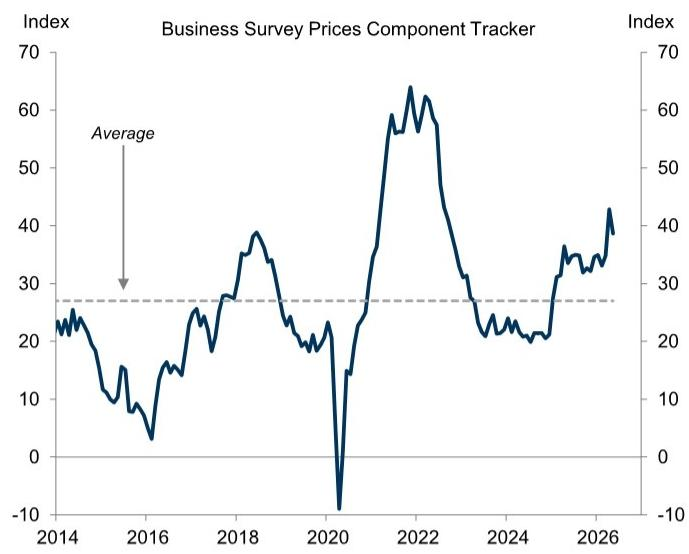

line

| Year | Index |
|------|-------|
| Average | 25.0 |

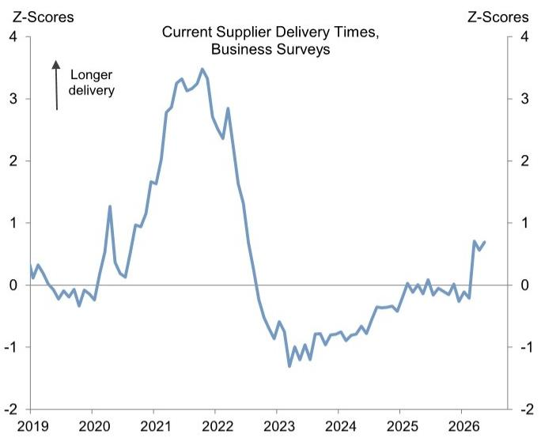

line

| Year | Z-Scores |
|------|----------|
| 2019 | ~0.2     |
| 2020 | ~-0.1    |
| 2021 | ~1.8     |
| 2022 | ~3.5     |
| 2023 | ~-1.5    |
| 2024 | ~-0.8    |
| 2025 | ~0.0     |
| 2026 | ~0.7     |

Source: GS Global Investment Research, Federal Reserve, Institute for Supply Management

# AI-Related Effects

Exhibit 12: AI-Related Demand Has Put Upward Pressure on Key Electronics Inputs   
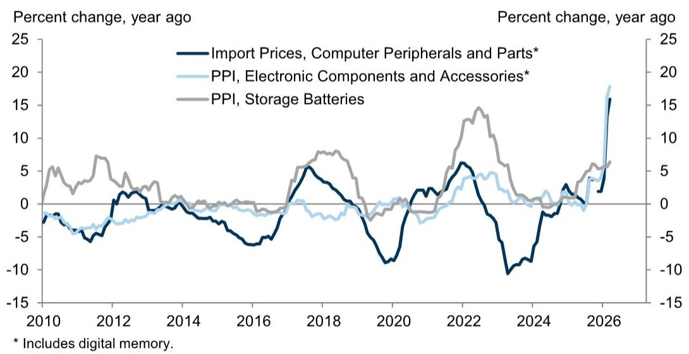

line

| Year | Import Prices, Computer Peripherals and Parts* | PPI, Electronic Components and Accessories* | PPI, Storage Batteries |
|------|--------------------------------------------------|---------------------------------------------|------------------------|
| 2010 | -2.0                                             | -1.0                                        | 3.0                    |
| 2012 | 1.0                                              | -2.0                                        | 7.0                    |
| 2014 | -1.0                                             | -1.0                                        | 1.0                    |
| 2016 | -6.0                                             | -1.0                                        | 0.0                    |
| 2018 | 5.0                                              | 0.0                                         | 8.0                    |
| 2020 | -10.0                                            | -2.0                                        | -1.0                   |
| 2022 | 6.0                                              | 4.0                                         | 14.0                   |
| 2024 | -10.0                                            | -1.0                                        | 1.0                    |
| 2026 | 16.0                                             | 18.0                                        | 6.0                    |

Source: GS Global Investment Research, Department of Commerce, Department of Commerce

Exhibit 13: We Estimate That Higher Electricity Prices Will Boost Headline PCE Inflation Both Directly and Indirectly by About 0.1-0.2pp Over the Next Couple of Years   
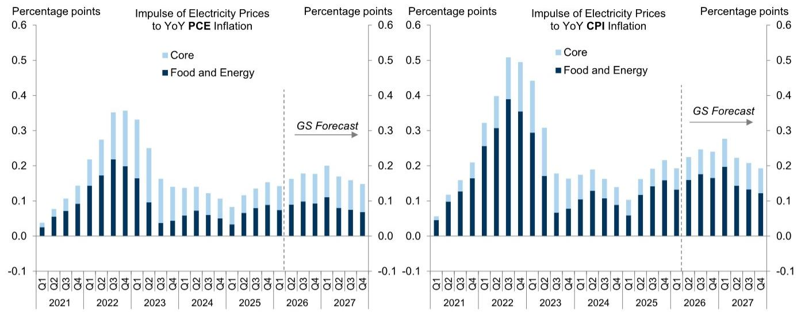

bar

| Year | Quarter | Core (Percentage points) | Food and Energy (Percentage points) |
|---|---|---|---|
| 2021 | Q1 | 0.03 | 0.02 |
| 2021 | Q2 | 0.06 | 0.05 |
| 2021 | Q3 | 0.08 | 0.07 |
| 2021 | Q4 | 0.10 | 0.09 |
| 2022 | Q1 | 0.14 | 0.14 |
| 2022 | Q2 | 0.21 | 0.17 |
| 2022 | Q3 | 0.28 | 0.21 |
| 2022 | Q4 | 0.35 | 0.20 |
| 2023 | Q1 | 0.33 | 0.17 |
| 2023 | Q2 | 0.16 | 0.10 |
| 2023 | Q3 | 0.16 | 0.04 |
| 2023 | Q4 | 0.14 | 0.05 |
| 2024 | Q1 | 0.13 | 0.07 |
| 2024 | Q2 | 0.13 | 0.06 |
| 2024 | Q3 | 0.11 | 0.06 |
| 2024 | Q4 | 0.11 | 0.05 |
| 2025 | Q1 | 0.08 | 0.03 |
| 2025 | Q2 | 0.11 | 0.06 |
| 2025 | Q3 | 0.13 | 0.08 |
| 2025 | Q4 | 0.15 | 0.09 |
| 2026 | Q1 | 0.14 | 0.07 |
| 2026 | Q2 | 0.16 | 0.09 |
| 2026 | Q3 | 0.17 | 0.10 |
| 2026 | Q4 | 0.18 | 0.11 |
| 2027 | Q1 | 0.17 | 0.08 |
| 2027 | Q2 | 0.16 | 0.08 |
| 2027 | Q3 | 0.15 | 0.07 |
| 2027 | Q4 | 0.14 | 0.07 |
GS Forecast (approx.) for Impulse of Electricity Prices to YoY PCE Inflation; GS Forecast (approx.) for Impulse of Electricity Prices to YoY CPI Inflation; GS Forecast (approx.) for Impulse of Electricity Prices to YoY CPI Inflation; GS Forecast (approx.) for Impulse of Electricity Prices to YoY CPI Inflation; GS Forecast (approx.) for Impulse of Electricity Prices to YoY CPI Inflation; GS Forecast (approx.) for Impulse of Electricity Prices to YoY CPI Inflation; GS Forecast (approx.) for Impulse of Electricity Prices to YoY CPI Inflation; GS Forecast (approx.) for Implied vs GS Forecast; GS Forecast (approx.) for Implied vs GS Forecast; GS Forecast (approx.) for Implied vs GS Forecast; GS Forecast (approx.) for Implied vs GS Forecast; GS Forecast (approx.) for Implied vs GS Forecast; GS Forecast (approx.) for Implied vs GS Forecast; GS Forecast (approx.) for Implied vs GS Forecast; GS Forecast (approx.) for Implied vs GS Forecast; GS Forecast (approx.) for Implied vs GS Forecast; GS Forecast is projected to be revised downward from GS Forecast to Implied vs GS Forecast; GS Forecast is projected to be revised upward from GS Forecast to Implied vs GS Forecast; GS Forecast is projected to be revised downward from GS Forecast to Implied vs GS Forecast; GS Forecast is projected to be revised upward from GS Forecast to Implied vs GS Forecast; GS Forecast is projected to be revised downward from GS Forecast to Implied vs GS Forecast; GS Forecast is projected to be revised upward from GS Forecast to Implied vs GS Forecast; GS Forecast is projected to be revised downward from GS Forecast to Implied vs GS Forecast; GS Forecast is revised upward from GS Forecast to Implied vs GS Forecast; GS Forecast is revised downward from GS Forecast to Implied vs GS Forecast; GS Forecast is revised upward from GS Forecast to Implied vs GS Forecast; GS Forecast is revised downward from GS Forecast to Implied vs GS Forecast; GS Forecast is revised upward from GS Forecast to Implied vs GS Forecast; GS Forecast is revised downward from GS Forecast to Implied vs GS Forecast; GS Forecast is revised upward from GS Forecast to Implied vs GS Forecast; GS Forecast is revised downward from GS Forecast to Implied vs GPS forecast; GS Forecast is revised upward from GS Forecast to GPS forecast; GS Forecast is revised downward from GPS forecast to GPS forecast; GS Forecast is revised upward from GPS forecast to GPS forecast; GS Forecast is revised downward from GPS forecast to GPS forecast; GS Forecast is revised upward from GPS forecast to GPS forecast; GS Forecast is revised downward from GPS forecast to GPS forecast; GS Forecast is revised upward from GPS forecast to GPS forecast; GS Forecast is revised downward from GPS forecast to GPS forecast; GS Forecast is revised upward from GPS forecast to GPS forecast; GS Forecast is revised downward from GPS forecast to GPS forecast; GS Forecast is revised upward from GPS forecast to GPS forecast: GS Forecast is projected to be revised downward from GPS forecast to GPS forecast: GS Forecast is projected to be revised upward from GPS forecast to GPS forecast: GS Forecast is projected to be revised downward from GPS forecast to GPS forecast: GS Forecast is projected to be revised upward from GPS forecast to GPS forecast: GS Forecast is projected to be revised downward from GPS forecast to GPS forecast: GS Forecast is projected to be revised upward from GPS forecast to GPS forecast: GS Forecast is projected to be revised downward from GPS forecast to GPS forecast: GS Forecast is projected to be revised upward from GPS forecast to GPS forecast: GO forecasts are projected to rise slightly over time, while the actual costs are not shown in this view.

Source: GS Global Investment Research

Exhibit 14: Software Accessory Prices Boosted Core PCE by 0.05pp on a Month-Over-Month Basis and by 0.17pp on a Year-Over-Year Basis in April; The Impact on Core CPI Has Been Much Smaller Because the Software and Accessories Component Has a Much Smaller Weight in CPI Than in PCE   
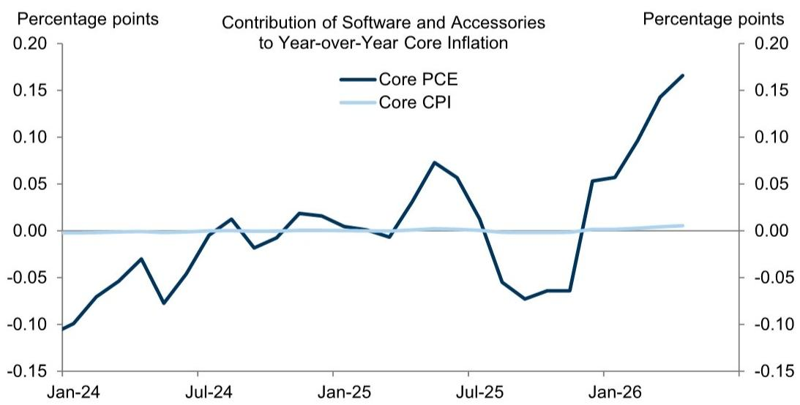

line

| Date    | Core PCE | Core CPI |
|---------|----------|----------|
| Jan-24  | -0.10    | 0.00     |
| Jul-24  | -0.08    | 0.00     |
| Jan-25  | 0.02     | 0.00     |
| Jul-25  | 0.07     | 0.00     |
| Jan-26  | 0.17     | 0.00     |

Source: GS Global Investment Research, Department of Labor

Exhibit 15: We Expect Higher Electricity, Electronics, and Software Prices to Boost Year-over-Year Core PCE Inflation by About 0.3pp and Core CPI Inflation by About 0.1pp Over the Next Year, With a Higher Peak in 2026H2   
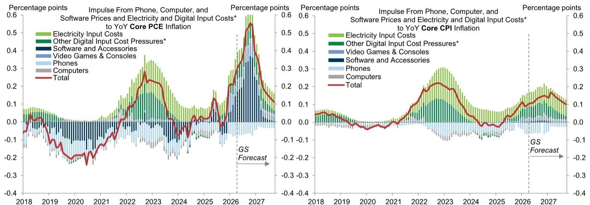  
\* Estimated effect of changes in digital memory, storage, computer terminals and other peripherals costs on consumer prices throughout the supply chain, based on PPI, import prices, and input-output linkages.   
\* Estimated effect of changes in digital memory, storage, computer terminals and other peripherals costs on consumer prices throughout the supply chain, based on PPI, import prices, and input-output linkages.   
Source: GS Global Investment Research, Department of Commerce, Department of Labor

# Tariff Effects

Exhibit 16: We Estimate That Passthrough from Tariff Costs to Consumer Prices Has Reached 90% So Far   
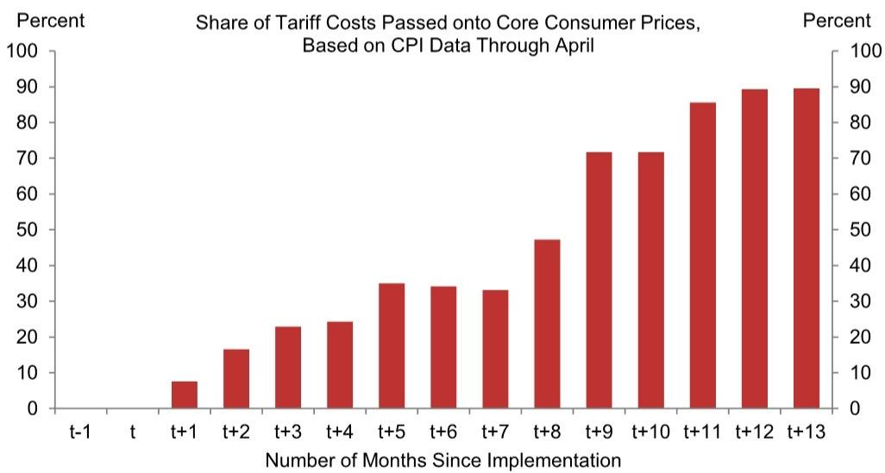

bar

Share of Tariff Costs Passed onto Core Consumer Prices, Based on CPI Data Through April
| Number of Months Since Implementation | Percent (%) |
| :--- | :--- |
| t-1 | 0 |
| t | 0 |
| t+1 | 8 |
| t+2 | 17 |
| t+3 | 23 |
| t+4 | 24 |
| t+5 | 35 |
| t+6 | 34 |
| t+7 | 33 |
| t+8 | 47 |
| t+9 | 72 |
| t+10 | 72 |
| t+11 | 86 |
| t+12 | 90 |
| t+13 | 90 |

\*This estimation method may capture spillover effects (e.g. domestic producers not directly affected by tariffs may opportunistically raise prices), so the estimated passthrough rate can eventually reach over $100\%$ .

Source: GS Global Investment Research, Department of Commerce

Exhibit 17: Year-Over-Year Core Goods Inflation Has Accelerated in Recent Months, but We Expect the Pace to Slow Somewhat Going Forward as Tariff Passthrough Comes to an End but AI-Related Pressure Continues   
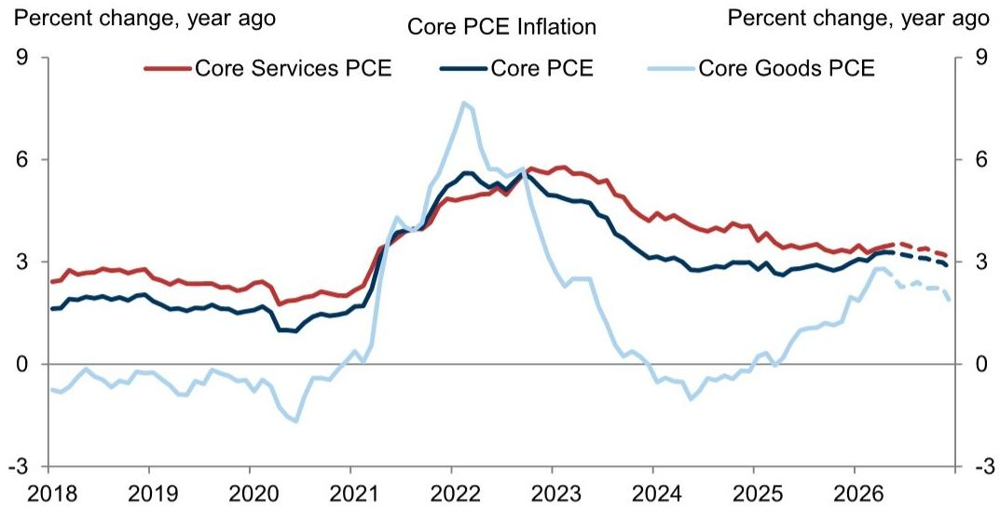

line

| Year | Core Services PCE | Core PCE | Core Goods PCE |
|------|-------------------|----------|----------------|
| 2018 | ~2.5              | ~2.0     | ~-1.0          |
| 2019 | ~2.7              | ~2.2     | ~-0.5          |
| 2020 | ~2.4              | ~1.8     | ~-1.5          |
| 2021 | ~3.0              | ~2.5     | ~0.5           |
| 2022 | ~5.5              | ~5.8     | ~7.5           |
| 2023 | ~5.8              | ~5.5     | ~3.0           |
| 2024 | ~4.5              | ~3.5     | ~-1.0          |
| 2025 | ~3.8              | ~3.0     | ~0.0           |
| 2026 | ~3.5              | ~3.2     | ~2.5           |

Source: GS Global Investment Research, Department of Labor

# Inflation Expectations

Exhibit 18: Inflation Expectations Have Moved Higher Since the Start of the Iran War; Short-Term Inflation Expectations Increased in Both the UMich Survey (+0.1pp to +4.8%, 1yr Ahead) and the NY Fed Survey (+0.2pp to +3.6%, 1yr Ahead); Long-Term Household Inflation Expectations Increased Notably in the UMich Survey (+0.4pp to +3.9%, Next 5-10yr) but Ticked Down in the NY Fed Survey (-0.1pp to 3.0%, 5yr Ahead)   
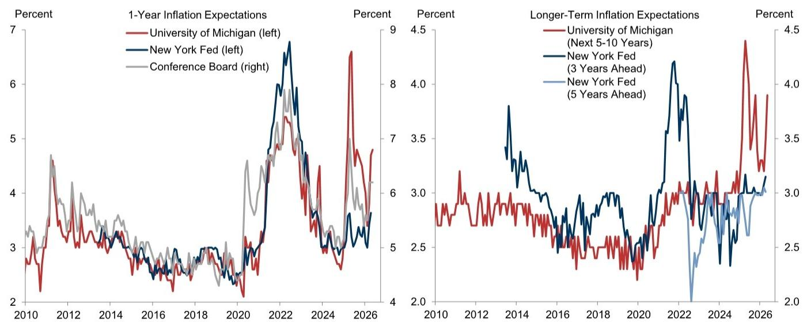

line

1-Year Inflation Expectations
| Year | University of Michigan (left) | New York Fed (left) | Conference Board (right) |
|---|---|---|---|
| 2010 | ~2.8% | ~3.0% | ~3.3% |
| 2011 | ~4.7% | ~4.5% | ~4.2% |
| 2012 | ~3.5% | ~3.8% | ~4.0% |
| 2013 | ~3.2% | ~3.5% | ~3.8% |
| 2014 | ~3.0% | ~3.3% | ~3.6% |
| 2015 | ~2.9% | ~3.1% | ~3.5% |
| 2016 | ~2.8% | ~3.0% | ~3.4% |
| 2017 | ~2.7% | ~2.9% | ~3.3% |
| 2018 | ~2.8% | ~3.0% | ~3.4% |
| 2019 | ~2.9% | ~3.1% | ~3.5% |
| 2020 | ~2.2% | ~2.8% | ~4.5% |
| 2021 | ~3.0% | ~3.5% | ~5.0% |
| 2022 | ~5.5% | ~6.8% | ~6.0% |
| 2023 | ~4.8% | ~5.5% | ~5.0% |
| 2024 | ~4.5% | ~4.8% | ~4.5% |
| 2025 | ~6.7% | ~4.5% | ~4.0% |
| 2026 | ~4.8% | ~3.5% | ~3.8% |
Longer-Term Inflation Expectations
University of Michigan (Next 5-10 Years)
New York Fed (3 Years Ahead)
New York Fed (5 Years Ahead)

Source: University of Michigan, Federal Reserve

Exhibit 19: Business Inflation Expectations Increased Following the Tariff Announcements in Early 2025 and Have Risen Again Since the Start of the Iran War   
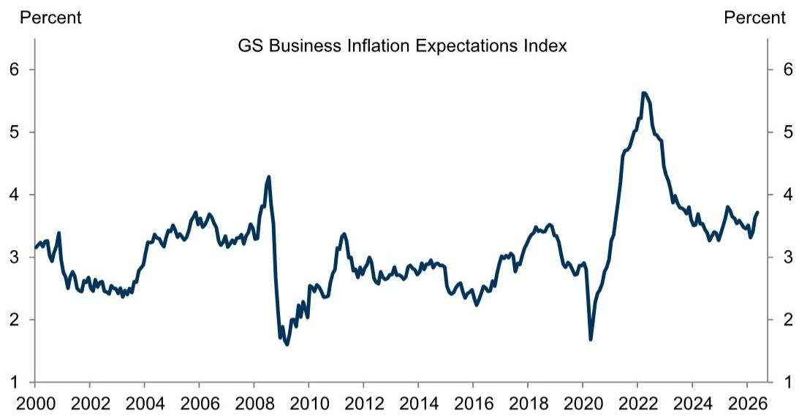

line

| Year | GS Business Inflation Expectations Index |
| ---- | ---------------------------------------- |
| 2000 | ~3.2                                     |
| 2002 | ~2.8                                     |
| 2004 | ~3.0                                     |
| 2006 | ~3.5                                     |
| 2008 | ~4.3                                     |
| 2010 | ~1.7                                     |
| 2012 | ~3.3                                     |
| 2014 | ~2.8                                     |
| 2016 | ~2.5                                     |
| 2018 | ~3.4                                     |
| 2020 | ~1.7                                     |
| 2022 | ~5.6                                     |
| 2024 | ~3.8                                     |
| 2026 | ~3.5                                     |

Source: GS Global Investment Research

Exhibit 20: Our Company Price Announcement Index Based on Russell 3000 Earnings Calls Has Increased Since the Start of the Iran War   
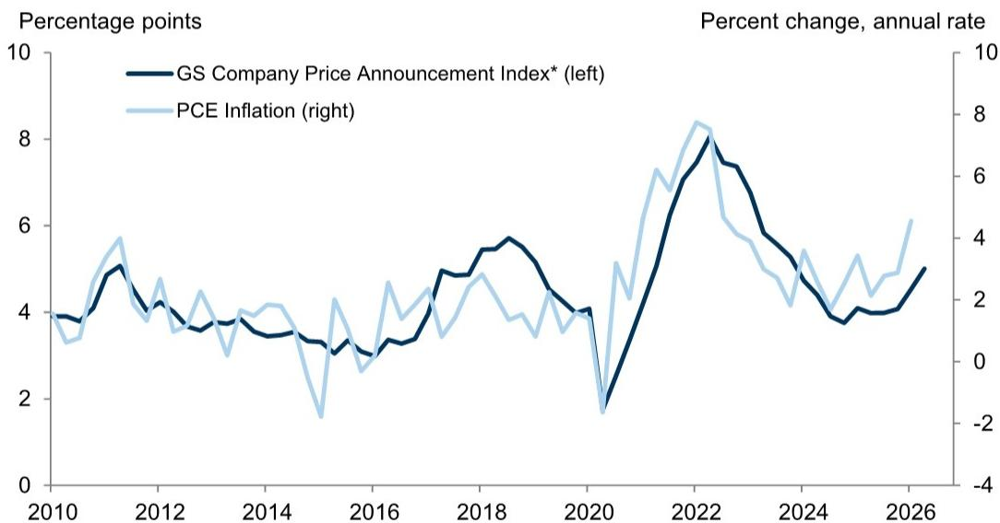

line

| Year | GS Company Price Announcement Index* (left) | PCE Inflation (right) |
|------|---------------------------------------------|------------------------|
| 2010 | 4.0                                         | 3.5                    |
| 2011 | 5.0                                         | 5.5                    |
| 2012 | 4.5                                         | 4.0                    |
| 2013 | 3.8                                         | 3.0                    |
| 2014 | 3.5                                         | 4.0                    |
| 2015 | 3.2                                         | 1.5                    |
| 2016 | 3.0                                         | 2.5                    |
| 2017 | 4.5                                         | 4.0                    |
| 2018 | 5.5                                         | 4.5                    |
| 2019 | 5.0                                         | 3.5                    |
| 2020 | 4.0                                         | 1.5                    |
| 2021 | 6.0                                         | 7.0                    |
| 2022 | 8.0                                         | 8.5                    |
| 2023 | 7.0                                         | 6.0                    |
| 2024 | 5.0                                         | 4.0                    |
| 2025 | 4.0                                         | 3.0                    |
| 2026 | 5.0                                         | 6.0                    |

\* Share of sentences mentioning higher prices less share of sentences mentioning lower prices.   
Source: GS Global Investment Research, Department of Commerce

Exhibit 21: Market-Implied Expectations for Annualized Headline CPI Inflation Over the Next Few Years Were Roughly Unchanged Over the Past Month but Have Increased Sharply Since the Start of the Iran War   
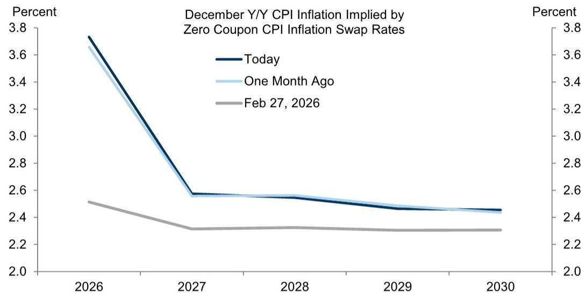

line

| Year | Today | One Month Ago | Feb 27, 2026 |
|------|-------|---------------|--------------|
| 2026 | 3.75  | 3.65          | 2.50         |
| 2027 | 2.55  | 2.55          | 2.30         |
| 2028 | 2.50  | 2.55          | 2.30         |
| 2029 | 2.45  | 2.45          | 2.30         |
| 2030 | 2.45  | 2.45          | 2.30         |

Source: GS Global Investment Research

# GS Inflation Forecast

Exhibit 22: Excluding the Effects of Higher Energy Prices and Tariffs, We Estimate That Underlying Core PCE Inflation Stands at 2.4% in April   
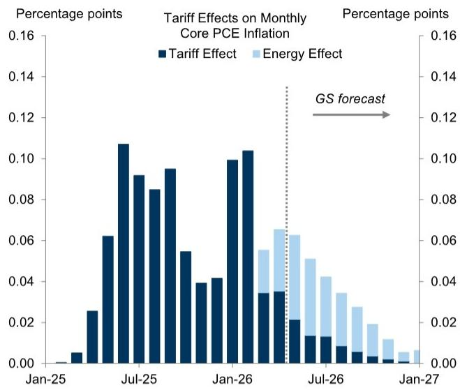

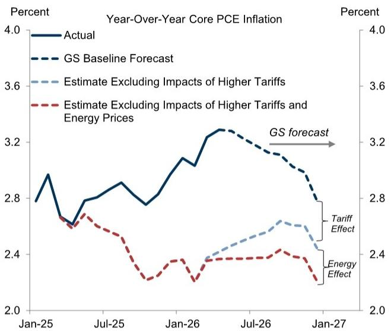

line

Year-Over-Year Core PCE Inflation
| Date | Actual (Percent) | GS Baseline Forecast (Percent) | Estimate Excluding Impacts of Higher Tariffs (Percent) | Estimate Excluding Impacts of Higher Tariffs and Energy Prices (Percent) |
|---|---|---|---|---|
| Jan-25 | 2.8 | 3.1 | 2.6 | 2.6 |
| Jul-25 | 2.85 | 3.15 | 2.65 | 2.55 |
| Jan-26 | 3.15 | 3.25 | 2.4 | 2.3 |
| Jul-26 | 3.25 | 3.2 | 2.55 | 2.4 |
| Jan-27 | 3.1 | 3.0 | 2.45 | 2.35 |

Source: GS Global Investment Research

Exhibit 23: We Expect Core PCE Inflation to Stand at $2.8\%$ by End-2026 and $2.1\%$ by End-2027 

<table><tr><td rowspan="3" colspan="2"></td><td colspan="5">GS Bottom-up Core PCE Model</td></tr><tr><td>Apr. 2026</td><td colspan="2">Dec. 2026</td><td colspan="2">Dec. 2027</td></tr><tr><td>Weight</td><td>YoY</td><td>Contribution to Change</td><td>YoY</td><td>Contribution to Change</td></tr><tr><td>Core PCE</td><td>100.0</td><td>3.3</td><td>2.8</td><td>-0.5</td><td>2.1</td><td>-1.2</td></tr><tr><td>Core Goods</td><td>24.4</td><td>2.8</td><td>1.8</td><td>-0.2</td><td>0.5</td><td>-0.6</td></tr><tr><td>New Vehicles</td><td>2.1</td><td>0.2</td><td>-0.3</td><td>0.0</td><td>0.2</td><td>0.0</td></tr><tr><td>Used Vehicles</td><td>1.2</td><td>-2.9</td><td>-2.9</td><td>0.0</td><td>0.2</td><td>0.0</td></tr><tr><td>Household Appliances</td><td>0.5</td><td>0.4</td><td>-1.3</td><td>0.0</td><td>0.6</td><td>0.0</td></tr><tr><td>Video, Audio, Computers</td><td>2.4</td><td>8.7</td><td>12.5</td><td>0.1</td><td>-0.7</td><td>-0.2</td></tr><tr><td>Recreational Vehicles</td><td>0.5</td><td>3.4</td><td>0.5</td><td>0.0</td><td>1.0</td><td>0.0</td></tr><tr><td>Jewelry, Watches</td><td>0.6</td><td>14.5</td><td>15.0</td><td>0.0</td><td>0.8</td><td>-0.1</td></tr><tr><td>Clothing &amp; Footwear</td><td>3.0</td><td>3.8</td><td>3.0</td><td>0.0</td><td>1.4</td><td>-0.1</td></tr><tr><td>Pharma &amp; Medical</td><td>3.8</td><td>-0.8</td><td>-1.6</td><td>0.0</td><td>0.1</td><td>0.0</td></tr><tr><td>Pets Products</td><td>0.6</td><td>2.6</td><td>2.7</td><td>0.0</td><td>0.4</td><td>0.0</td></tr><tr><td>Expenditures Abroad</td><td>0.1</td><td>7.1</td><td>7.4</td><td>0.0</td><td>3.3</td><td>0.0</td></tr><tr><td>Residual Core Goods</td><td>9.6</td><td>3.2</td><td>0.7</td><td>-0.2</td><td>0.7</td><td>-0.2</td></tr><tr><td>Core goods ex. autos</td><td>21.1</td><td>3.4</td><td>2.4</td><td>-0.2</td><td>0.5</td><td>-0.6</td></tr><tr><td>Core Services</td><td>75.6</td><td>3.4</td><td>3.1</td><td>-0.3</td><td>2.6</td><td>-0.6</td></tr><tr><td>Housing</td><td>17.5</td><td>3.2</td><td>2.6</td><td>-0.1</td><td>2.2</td><td>-0.2</td></tr><tr><td>Ground Transportation</td><td>0.6</td><td>2.6</td><td>14.9</td><td>0.1</td><td>-1.5</td><td>0.0</td></tr><tr><td>Air Transportation</td><td>1.1</td><td>12.0</td><td>14.5</td><td>0.0</td><td>-2.3</td><td>-0.2</td></tr><tr><td>Food Services &amp; Accommodation</td><td>7.9</td><td>3.6</td><td>3.2</td><td>0.0</td><td>3.4</td><td>0.0</td></tr><tr><td>Financial Services &amp; Insurance</td><td>9.3</td><td>6.3</td><td>4.6</td><td>-0.2</td><td>3.8</td><td>-0.2</td></tr><tr><td>Medical Services</td><td>18.9</td><td>2.9</td><td>2.7</td><td>0.0</td><td>2.8</td><td>0.0</td></tr><tr><td>Foreign Travel</td><td>1.5</td><td>0.5</td><td>3.4</td><td>0.0</td><td>2.9</td><td>0.0</td></tr><tr><td>Residual Core Services</td><td>18.8</td><td>2.6</td><td>2.3</td><td>-0.1</td><td>2.3</td><td>-0.1</td></tr><tr><td>Core services ex. housing</td><td>58.1</td><td>3.5</td><td>3.3</td><td>-0.1</td><td>2.7</td><td>-0.5</td></tr></table>

Source: GS Global Investment Research

Exhibit 24: We Expect Core CPI Inflation to Stand at $2.5\%$ by End-2026 and $2.1\%$ by End-2027 

<table><tr><td rowspan="3" colspan="2"></td><td rowspan="2">Apr. 2026</td><td colspan="4">GS Bottom-up CPI Forecast</td></tr><tr><td colspan="2">Dec. 2026</td><td colspan="2">Dec. 2027</td></tr><tr><td>Weight</td><td>YoY</td><td>YoY Contribution to Change</td><td>YoY</td><td>Contribution to Change</td></tr><tr><td>Core CPI</td><td>100.0</td><td>2.7</td><td>2.5</td><td>-0.2</td><td>2.1</td><td>-0.6</td></tr><tr><td>Apparel</td><td>3.1</td><td>4.2</td><td>3.3</td><td>0.0</td><td>0.1</td><td>-0.1</td></tr><tr><td>New Cars</td><td>4.8</td><td>0.2</td><td>-0.2</td><td>0.0</td><td>-0.4</td><td>0.0</td></tr><tr><td>Used Cars</td><td>3.3</td><td>-2.7</td><td>-2.7</td><td>0.0</td><td>-1.0</td><td>0.1</td></tr><tr><td>Medical Care Commodities</td><td>1.8</td><td>-0.5</td><td>-1.4</td><td>0.0</td><td>0.1</td><td>0.0</td></tr><tr><td>Health Insurance</td><td>1.1</td><td>-6.1</td><td>-14.3</td><td>-0.1</td><td>-5.1</td><td>0.0</td></tr><tr><td>Medical Services ex. Insurance</td><td>7.6</td><td>4.6</td><td>3.9</td><td>0.0</td><td>3.6</td><td>-0.1</td></tr><tr><td>Pets</td><td>1.5</td><td>3.8</td><td>3.7</td><td>0.0</td><td>0.4</td><td>0.0</td></tr><tr><td>Household Furnishings + Ops.</td><td>5.4</td><td>3.9</td><td>0.9</td><td>-0.2</td><td>0.7</td><td>-0.2</td></tr><tr><td>Personal Care</td><td>3.1</td><td>3.8</td><td>3.5</td><td>0.0</td><td>1.2</td><td>-0.1</td></tr><tr><td>Rent + OER</td><td>42.4</td><td>3.2</td><td>2.6</td><td>-0.3</td><td>2.2</td><td>-0.4</td></tr><tr><td>Public Transportation</td><td>2.1</td><td>13.7</td><td>10.7</td><td>-0.1</td><td>1.3</td><td>-0.3</td></tr><tr><td>Private Transportation Services</td><td>6.0</td><td>1.4</td><td>2.4</td><td>0.1</td><td>2.4</td><td>0.1</td></tr><tr><td>Misc. Goods and Services</td><td>17.9</td><td>2.8</td><td>3.1</td><td>0.1</td><td>2.8</td><td>0.0</td></tr><tr><td>Headline CPI</td><td>100.0</td><td>3.8</td><td>3.6</td><td>-0.2</td><td>2.0</td><td>-1.8</td></tr><tr><td>Core CPI</td><td>79.0</td><td>2.7</td><td>2.5</td><td>-0.2</td><td>2.1</td><td>-0.5</td></tr><tr><td>Food</td><td>13.5</td><td>3.2</td><td>4.0</td><td>0.1</td><td>2.6</td><td>-0.1</td></tr><tr><td>Energy</td><td>7.5</td><td>17.5</td><td>15.7</td><td>-0.1</td><td>-0.6</td><td>-1.4</td></tr></table>

Source: Department of Labor, GS Global Investment Research

Exhibit 25: GS Inflation Forecasts, 2026-2028 

<table><tr><td rowspan="2"></td><td colspan="2">PCE</td><td colspan="2">CPI</td></tr><tr><td>Core</td><td>Headline</td><td>Core</td><td>Headline</td></tr><tr><td>Dec. 2026</td><td>2.8</td><td>3.3</td><td>2.5</td><td>3.6</td></tr><tr><td>Dec. 2027</td><td>2.1</td><td>2.0</td><td>2.1</td><td>2.0</td></tr><tr><td>Dec. 2028</td><td>2.0</td><td>2.0</td><td>2.2</td><td>2.2</td></tr></table>

Source: GS Global Investment Research

# The US Economics Team

# Jan Hatzius

+1(212)902-0394

jan.hatzius@gs.com

GS & Co. LLC

# Ronnie Walker

+1(917)343-4543

ronnie.walker@gs.com

GS & Co. LLC

# Pierfrancesco Mei

+1(212)902-8809

pierfrancesco.mei@gs.com

GS & Co. LLC

# Alec Phillips

+1(202)637-3746

alec.phillips@gs.com

GS & Co. LLC

# Manuel Abecasis

+1(212)902-8357

manuel.abecasis@gs.com

GS & Co. LLC

# Jessica Rindels

+1(972)368-1516

jessica.rindels@gs.com

GS & Co. LLC

# David Mericle

+1(212)357-2619

david.mericle@gs.com

GS & Co. LLC

# Elsie Peng

+1(212)357-3137

elsie.peng@gs.com

GS & Co. LLC

# Disclosure Appendix

# Reg AC

I, Jessica Rindels, hereby certify that all of the views expressed in this report accurately reflect my personal views, which have not been influenced by considerations of the firm's business or client relationships.

Unless otherwise stated, the individuals listed on the cover page of this report are analysts in GS' Global Investment Research division.

Contributing Authors: Jessica Rindels GS & Co. LLC.

Unless otherwise stated, the individuals listed in the Contributing Authors disclosure of this report are analysts in GS' Global Investment Research division.

# Disclosures

# Regulatory disclosures

# Disclosures required by United States laws and regulations

See company-specific regulatory disclosures above for any of the following disclosures required as to companies referred to in this report: manager or co-manager in a pending transaction; $1\%$ or other ownership; compensation for certain services; types of client relationships; managed/co-managed public offerings in prior periods; directorships; for equity securities, market making and/or specialist role. GS trades or may trade as a principal in debt securities (or in related derivatives) of issuers discussed in this report.

The following are additional required disclosures: Ownership and material conflicts of interest: GS policy prohibits its analysts, professionals reporting to analysts and members of their households from owning securities of any company in the analyst's area of coverage. Analyst compensation: Analysts are paid in part based on the profitability of GS, which includes investment banking revenues. Analyst as officer or director: GS policy generally prohibits its analysts, persons reporting to analysts or members of their households from serving as an officer, director or advisor of any company in the analyst's area of coverage. Non-U.S. Analysts: Non-U.S. analysts may not be associated persons of GS & Co. LLC and therefore may not be subject to FINRA Rule 2241 or FINRA Rule 2242 restrictions on communications with a subject company, public appearances and trading in securities covered by the analysts.

# Additional disclosures required under the laws and regulations of jurisdictions other than the United States

The following disclosures are those required by the jurisdiction indicated, except to the extent already made above pursuant to United States laws and regulations. Australia: GS Australia Pty Ltd and its affiliates are not authorised deposit-taking institutions (as that term is defined in the Banking Act 1959 (Cth)) in Australia and do not provide banking services, nor carry on a banking business, in Australia. This research, and any access to it, is intended only for “wholesale clients” within the meaning of the Australian Corporations Act, unless otherwise agreed by GS. In producing research reports, members of Global Investment Research of GS Australia may attend site visits and other meetings hosted by the companies and other entities which are the subject of its research reports. In some instances the costs of such site visits or meetings may be met in part or in whole by the issuers concerned if GS Australia considers it is appropriate and reasonable in the specific circumstances relating to the site visit or meeting. To the extent that the contents of this document contains any financial product advice, it is general advice only and has been prepared by GS without taking into account a client’s objectives, financial situation or needs. A client should, before acting on any such advice, consider the appropriateness of the advice having regard to the client’s own objectives, financial situation and needs. A copy of certain GS Australia and New Zealand disclosure of interests and a copy of GS’ Australian Sell-Side Research Independence Policy Statement are available at: https://www.goldmansachs.com/disclosures/australia-new-zealand/index.html. Brazil: Disclosure information in relation to CVM Resolution n. 20 is available at https://www.gs.com/worldwide/brazil/area/gir/index.html. Where applicable, the Brazil-registered analyst primarily responsible for the content of this research report, as defined in Article 20 of CVM Resolution n. 20, is the first author named at the beginning of this report, unless indicated otherwise at the end of the text. Canada: This information is being provided to you for information purposes only and is not, and under no circumstances should be construed as, an advertisement, offering or solicitation by GS & Co. LLC for purchasers of securities in Canada to trade in any Canadian security. GS & Co. LLC is not registered as a dealer in any jurisdiction in Canada under applicable Canadian securities laws and generally is not permitted to trade in Canadian securities and may be prohibited from selling certain securities and products in certain jurisdictions in Canada. If you wish to trade in any Canadian securities or other products in Canada please contact GS Canada Inc., an affiliate of The GS Group Inc., or another registered Canadian dealer. Hong Kong: Further information on the securities of covered companies referred to in this research may be obtained on request from GS (Asia) L.L.C. India: Further information on the subject company or companies referred to in this research may be obtained from GS (India) Securities Private Limited, Research Analyst - SEBI Registration Number INH000001493, 10th Floor, Ascent-Worli, Sudam Kalu Ahire Marg, Worli, Mumbai-400 025, India, Corporate Identity Number U74140MH2006FTC160634, Phone +91 22 6616 9000, Fax +91 22 6616 9001. GS may beneficially own 1% or more of the securities (as such term is defined in clause 2 (h) the Indian Securities Contracts (Regulation) Act, 1956) of the subject company or companies referred to in this research report. Investment in securities market are subject to market risks. Read all the related documents carefully before investing. Registration granted by SEBI and certification from NISM in no way guarantee performance of the intermediary or provide any assurance of returns to investors. GS (India) Securities Private Limited compliance officer and investor grievance contact details can be found at: https://www.goldmansachs.com/worldwide/india/documents/Grievance-Redressal-and-Escalation-Matrix.pdf, and a copy of the annual audit compliance report can be found at this link: https://publishing.gs.com/content/site/india-annual-compliance-report.html. Japan: See below. Korea: This research, and any access to it, is intended only for “professional investors” within the meaning of the Financial Services and Capital Markets Act, unless otherwise agreed by GS. Further information on the subject company or companies referred to in this research may be obtained from GS (Asia) L.L.C., Seoul Branch. New Zealand: GS New Zealand Limited and its affiliates are neither “registered banks” nor “deposit takers” (as defined in the Reserve Bank of New Zealand Act 1989) in New Zealand. This research, and any access to it, is intended for “wholesale clients” (as defined in the Financial Advisers Act 2008) unless otherwise agreed by GS. A copy of certain GS Australia and New Zealand disclosure of interests is available at: https://www.goldmansachs.com/disclosures/australia-new-zealand/index.html. Russia: Research reports distributed in the Russian Federation are not advertising as defined in the Russian legislation, but are information and analysis not having product promotion as their main purpose and do not provide appraisal within the meaning of the Russian legislation on appraisal activity. Research reports do not constitute a personalized investment recommendation as defined in Russian laws and regulations, are not addressed to a specific client, and are prepared without analyzing the financial circumstances, investment profiles or risk profiles of clients. GS assumes no responsibility for any investment decisions that may be taken by a client or any other person based on this research report. Singapore: GS (Singapore) Pte. (Company Number: 198602165W), which is regulated by the Monetary Authority of Singapore, accepts legal responsibility for this research, and should be contacted with respect to any matters arising from, or in connection with, this research. Taiwan: This material is for reference only and must not be reprinted without permission. Investors should carefully consider their own investment risk. Investment results are the responsibility of the individual investor. United Kingdom: Persons who would be categorized as retail clients in the United Kingdom, as such term is defined in the rules of the Financial Conduct Authority, should read this research in conjunction with prior GS on the covered

companies referred to herein and should refer to the risk warnings that have been sent to them by GS International. A copy of these risks warnings, and a glossary of certain financial terms used in this report, are available from GS International on request.

European Union and United Kingdom: Disclosure information in relation to Article 6 (2) of the European Commission Delegated Regulation (EU) (2016/958) supplementing Regulation (EU) No 596/2014 of the European Parliament and of the Council (including as that Delegated Regulation is implemented into United Kingdom domestic law and regulation following the United Kingdom's departure from the European Union and the European Economic Area) with regard to regulatory technical standards for the technical arrangements for objective presentation of investment recommendations or other information recommending or suggesting an investment strategy and for disclosure of particular interests or indications of conflicts of interest is available at https://www.gs.com/disclosures/europeanpolicy.html which states the European Policy for Managing Conflicts of Interest in Connection with Investment Research.

Japan: GS Japan Co., Ltd. is a Financial Instrument Dealer registered with the Kanto Financial Bureau under registration number Kinsho 69, and a member of Japan Securities Dealers Association, Financial Futures Association of Japan Type II Financial Instruments Firms Association, and Investment Management Association of Japan. Sales and purchase of equities are subject to commission pre-determined with clients plus consumption tax. See company-specific disclosures as to any applicable disclosures required by Japanese stock exchanges, the Japanese Securities Dealers Association or the Japanese Securities Finance Company.

# Global product; distributing entities

GS Global Investment Research produces and distributes research products for clients of GS on a global basis. Analysts based in GS offices around the world produce research on industries and companies, and research on macroeconomics, currencies, commodities and portfolio strategy. This research is disseminated in Australia by GS Australia Pty Ltd (ABN 21 006 797 897); in Brazil by GS do Brasil Corretora de Títulos e Valores Mobiliários S.A.; Public Communication Channel GS Brazil: 0800 727 5764 and / or contatogoldmanbrasil@gs.com. Available Weekdays (except holidays), from 9am to 6pm. Canal de Comunicação com o Público GS Brasil: 0800 727 5764 e/ou contatogoldmanbrasil@gs.com. Horário de funcionamento: segunda-feira à sexta-feira (exceto feriados), das 9h às 18h; in Canada by GS & Co. LLC; in Hong Kong by GS (Asia) L.L.C.; in India by GS (India) Securities Private Ltd.; in Japan by GS Japan Co., Ltd.; in the Republic of Korea by GS (Asia) L.L.C., Seoul Branch; in New Zealand by GS New Zealand Limited; in Russia by OOO GS; in Singapore by GS (Singapore) Pte. (Company Number: 198602165W); and in the United States of America by GS & Co. LLC. GS International has approved this research in connection with its distribution in the United Kingdom.

GS International (“GSI”), authorised by the Prudential Regulation Authority (“PRA”) and regulated by the Financial Conduct Authority (“FCA”) and the PRA, has approved this research in connection with its distribution in the United Kingdom.

European Economic Area: GS Bank Europe SE (“GSBE”) is a credit institution incorporated in Germany and, within the Single Supervisory Mechanism, subject to direct prudential supervision by the European Central Bank and in other respects supervised by German Federal Financial Supervisory Authority (Bundesanstalt für Finanzdienstleistungsaufsicht, BaFin) and Deutsche Bundesbank and disseminates research within the European Economic Area.

# General disclosures

This research is for our clients only. Other than disclosures relating to GS, this research is based on current public information that we consider reliable, but we do not represent it is accurate or complete, and it should not be relied on as such. The information, opinions, estimates and forecasts contained herein are as of the date hereof and are subject to change without prior notification. We seek to update our research as appropriate, but various regulations may prevent us from doing so. Other than certain industry reports published on a periodic basis, the large majority of reports are published at irregular intervals as appropriate in the analyst's judgment.

GS conducts a global full-service, integrated investment banking, investment management, and brokerage business. We have investment banking and other business relationships with a substantial percentage of the companies covered by Global Investment Research. GS & Co. LLC, the United States broker dealer, is a member of SIPC (https://www.sipc.org).

Our salespeople, traders, and other professionals may provide oral or written market commentary or trading strategies to our clients and principal trading desks that reflect opinions that are contrary to the opinions expressed in this research. Our asset management area, principal trading desks and investing businesses may make investment decisions that are inconsistent with the recommendations or views expressed in this research.

We and our affiliates, officers, directors, and employees will from time to time have long or short positions in, act as principal in, and buy or sell, the securities or derivatives, if any, referred to in this research, unless otherwise prohibited by regulation or GS policy.

The views attributed to third party presenters at GS arranged conferences, including individuals from other parts of GS, do not necessarily reflect those of Global Investment Research and are not an official view of GS.

Any third party referenced herein, including any salespeople, traders and other professionals or members of their household, may have positions in the products mentioned that are inconsistent with the views expressed by analysts named in this report.

This research is focused on investment themes across markets, industries and sectors. It does not attempt to distinguish between the prospects or performance of, or provide analysis of, individual companies within any industry or sector we describe.

Any trading recommendation in this research relating to an equity or credit security or securities within an industry or sector is reflective of the investment theme being discussed and is not a recommendation of any such security in isolation.

This research is not an offer to sell or the solicitation of an offer to buy any security in any jurisdiction where such an offer or solicitation would be illegal. It does not constitute a personal recommendation or take into account the particular investment objectives, financial situations, or needs of individual clients. Clients should consider whether any advice or recommendation in this research is suitable for their particular circumstances and, if appropriate, seek professional advice, including tax advice. The price and value of investments referred to in this research and the income from them may fluctuate. Past performance is not a guide to future performance, future returns are not guaranteed, and a loss of original capital may occur. Fluctuations in exchange rates could have adverse effects on the value or price of, or income derived from, certain investments.

Certain transactions, including those involving futures, options, and other derivatives, give rise to substantial risk and are not suitable for all investors. Investors should review current options and futures disclosure documents which are available from GS sales representatives or at https://www.theocc.com/about/publications/character-risks.jsp and https://www.goldmansachs.com/disclosures/cftc\_fcm\_disclosures. Transaction costs may be significant in option strategies calling for multiple purchase and sales of options such as spreads. Supporting documentation will be supplied upon request.

Differing Levels of Service provided by Global Investment Research: The level and types of services provided to you by GS Global Investment Research may vary as compared to that provided to internal and other external clients of GS, depending on various factors including your individual preferences as to the frequency and manner of receiving communication, your risk profile and investment focus and perspective (e.g.,

marketwide, sector specific, long term, short term), the size and scope of your overall client relationship with GS, and legal and regulatory constraints. As an example, certain clients may request to receive notifications when research on specific securities is published, and certain clients may request that specific data underlying analysts' fundamental analysis available on our internal client websites be delivered to them electronically through data feeds or otherwise. No change to an analyst's fundamental research views (e.g., ratings, price targets, or material changes to earnings estimates for equity securities), will be communicated to any client prior to inclusion of such information in a research report broadly disseminated through electronic publication to our internal client websites or through other means, as necessary, to all clients who are entitled to receive such reports.

All research reports are disseminated and available to all clients simultaneously through electronic publication to our internal client websites. Not all research content is redistributed to our clients or available to third-party aggregators, nor is GS responsible for the redistribution of our research by third party aggregators. For research, models or other data related to one or more securities, markets or asset classes (including related services) that may be available to you, please contact your GS representative or go to https://research.gs.com.

Disclosure information is also available at https://www.gs.com/research/hedge.html or from Research Compliance, 200 West Street, New York, NY 10282.

# © 2026 GS.

You are permitted to store, display, analyze, modify, reformat, and print the information made available to you via this service only for your own use. You may not resell or reverse engineer this information to calculate or develop any index for disclosure and/or marketing or create any other derivative works or commercial product(s), data or offering(s) without the express written consent of GS. You are not permitted to publish, transmit, or otherwise reproduce this information, in whole or in part, in any format to any third party without the express written consent of GS. This foregoing restriction includes, without limitation, using, extracting, downloading or retrieving this information, in whole or in part, to train or finetune a machine learning or artificial intelligence system, or to provide or reproduce this information, in whole or in part, as a prompt or input to any such system.