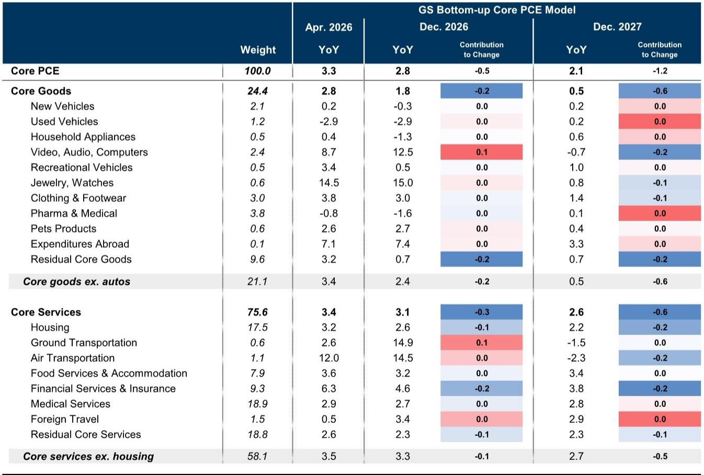
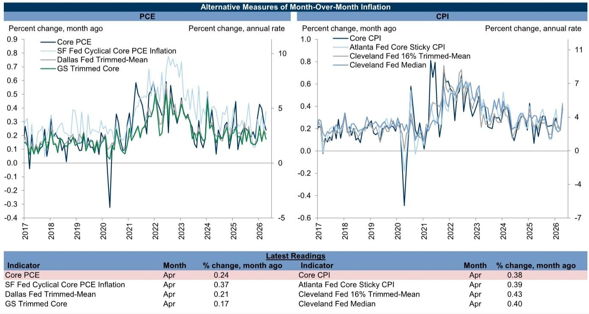
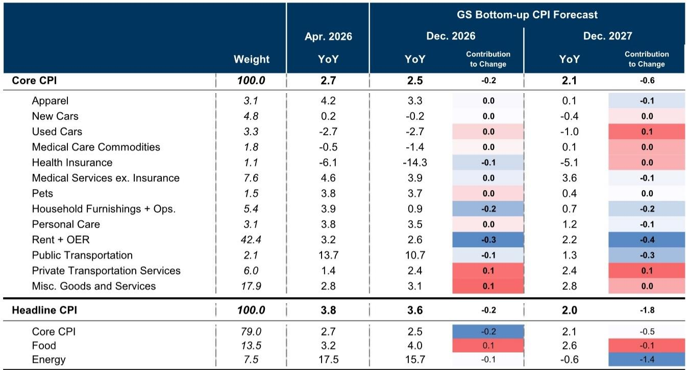

# 通胀正在被三股力量重塑，市场低估了它们的持续性

四月的通胀数据，表面上是数字的跳动，背后却是三个长期变量的共振。某外资投行最新发布的美国通胀监测报告，提供了一个值得产业决策者和资产配置者仔细拆解的分析框架。

核心PCE同比升至3.29%，核心CPI同比升至2.74%。单看这两个数字，似乎只是通胀从高点回落过程中的一次颠簸。但报告揭示的更深层问题是：推动四月通胀上行的三股力量——地缘冲突、AI基础设施需求、以及关税传导——各自有不同的持续性、传导路径和政策含义。市场对其中任何一股力量的定价，可能都不够充分。

这不是一个“通胀会不会再加速”的老问题。这是一个“通胀的结构正在被谁重新定义”的新问题。

## 1. 伊朗战争对通胀的冲击不只是油价，而是通过三条供应链同时传导

报告显示，油价从二月平均每桶71美元飙升至四月平均每桶117美元，涨幅超过50%。但真正值得关注的不是油价本身，而是战争通过三条供应链同时推高通胀的机制。

第一条是能源直接传导。报告预计，更高的能源价格今年将直接推高核心PCE通胀约0.35个百分点。这是最直观、也最容易被市场定价的渠道。

第二条是非石油大宗商品。战争推高了海湾地区其他出口品的价格，包括氮肥和铝。报告预计，化肥成本上升将使食品价格今年上涨约1.0%，对整体通胀贡献约0.07个百分点。更关键的是，食品价格上涨还会通过餐饮价格传导至核心PCE，额外贡献0.05至0.10个百分点。这是一个间接但更持久的传导路径。

第三条是供应链成本的重构。战争导致化肥、铝、甲醇等工业原料价格上涨，这些成本最终会嵌入制造业和服务业的定价中，其影响周期可能远超油价本身。

报告给出一个关键数据：自战争爆发以来，已将2026年12月同比整体PCE通胀预测上调了1.4个百分点。这意味着，地缘冲突不是通胀的短期扰动，而是正在成为通胀结构的一部分。

对于企业而言，这意味着需要重新评估供应链的“安全成本”是否已经永久性上升。对于投资者而言，这意味着能源和商品相关的通胀溢价可能不会随着战争结束而完全消失。

## 2. AI正在通过三个渠道成为通胀的新结构性推手

这是这份报告最值得反复阅读的部分。AI对通胀的影响，不是通过需求拉动，而是通过供给侧的三个具体渠道。

第一个渠道是电子元件价格。AI基础设施的强劲需求推高了关键电子元件的价格，包括数字存储芯片和电池。报告显示，电子元件及配件的生产者价格指数四月同比上涨了20%。这是自2022年以来最快的增速。

第二个渠道是软件定价。报告指出，多家公司近期提高了软件价格，而软件和配件在PCE和CPI中都没有进行质量调整。这意味着，AI新功能带来的价值提升，在统计上被完全计为价格上涨，而非数量增加。这是一个潜在的测量偏差，但其对实际通胀的影响是真实的。

第三个渠道是电力需求。数据中心的强劲需求正在推高电力价格。报告估计，未来几年，电力价格上涨将使整体PCE通胀每年增加约0.1至0.2个百分点。这个数字看似不大，但其持续性值得关注——数据中心建设周期长，电力需求增长具有结构性特征。

报告特别强调了一个被市场忽视的细节：软件和配件在PCE中的权重约为CPI的30倍。这意味着，同样的软件价格上涨，对核心PCE的推升作用远大于对核心CPI。四月软件和配件价格环比上涨5.0%，已是连续三个月大幅上涨。报告预计，未来一年，电子和数字投入品价格上涨将使核心PCE通胀额外增加0.3个百分点，到2026年三季度达到峰值0.6个百分点。

对于关注通胀指标的投资者而言，这意味着PCE和CPI的分化可能持续，而美联储更关注PCE。对于科技行业从业者而言，这意味着AI带来的成本压力正在从基础设施向软件和服务传导。

## 3. 关税的滞后效应尚未完全释放，核心商品通胀的回落可能比预期更慢

报告对关税效应的分析提供了一个重要的时间维度。数据显示，关税成本向消费者价格的传导率在13个月后达到90%。这意味着，即使不再加征新关税，已经实施的关税仍在持续推高通胀。

报告估计，关税已将当前核心PCE同比通胀推高了0.9个百分点。到2026年底，这一贡献将降至0.1个百分点。但关键在于：关税对通胀的影响不是均匀分布的，而是集中在核心商品领域。

四月核心商品价格同比上涨2.8%，是2022年12月以来最快的增速。相比之下，2018年核心PCE通胀约2%时，核心商品价格同比平均下降0.5%。这意味着，当前商品通胀的“正常化”水平已经系统性上移。

报告预计，核心商品通胀将从四月的2.8%降至2026年12月的1.8%，再到2027年12月的0.5%。但这一预测的前提是关税成本传导结束。如果贸易政策出现新的变化，这一回落路径可能被打断。

对于零售和制造业企业而言，这意味着成本端压力缓解的时间窗口可能比预期更短。对于关注通胀路径的投资者而言，核心商品通胀的回落速度是判断整体通胀走向的关键变量。

## 4. 通胀预期的分化正在形成，这对美联储的政策框架构成新挑战

通胀预期是决定实际通胀走向的重要因素。报告呈现了一个值得警惕的分化格局。

短期通胀预期明显上升。密歇根大学调查的一年期通胀预期升至4.8%，纽约联储调查升至3.6%。这反映了消费者对近期物价上涨的直接感受。

但长期通胀预期出现了显著分化。密歇根大学调查的5-10年通胀预期升至3.9%，上升了0.4个百分点。而纽约联储的五年期预期则降至3.0%，下降了0.1个百分点。

这种分化意味着什么？一种可能的解读是，消费者对长期通胀的锚定正在松动。密歇根大学调查的长期预期上升，反映的是对通胀结构性变化的担忧——地缘冲突、AI投资、关税等长期因素正在改变通胀的底层逻辑。而纽约联储调查的下降，可能反映的是对货币政策紧缩效果的预期。

对于美联储而言，这是一个棘手的问题。如果长期通胀预期开始“脱锚”，即使短期通胀回落，也需要更紧缩的政策来重新锚定预期。但当前的分化格局让政策制定者难以判断真正需要关注哪个信号。

报告没有对这一分化给出明确的结论。这恰恰是需要我们持续跟踪的关键变量。

## 5. 报告尚未完全回答的三个问题，恰恰是下一步判断的关键

这份报告提供了丰富的分析框架，但有几个关键问题尚未完全回答，这些缺口正是我们需要持续关注的方向。

第一个问题是：AI对通胀的影响是暂时的还是结构性的？报告指出，软件和配件在PCE中的权重可能是被高估的，这意味着部分AI相关通胀可能是统计偏差。但另一方面，电力需求和电子元件价格的上涨是真实的结构性成本。两者之间的平衡如何演变，报告没有给出明确判断。

第二个问题是：通胀预期的分化是否可持续？如果密歇根大学的长期预期继续上升，而纽约联储的预期保持稳定，这将对美联储的政策沟通构成挑战。但报告没有深入分析这两种调查的方法论差异和各自的代表性。

第三个问题是：关税效应的消退路径是否会被新的贸易政策打断？报告假设关税传导将在2027年基本结束，但贸易政策的不确定性仍然很大。如果出现新的关税措施，整个通胀预测框架都需要调整。

这些未解问题，恰恰是决定通胀走向的核心变量。对它们的持续跟踪和深入分析，比预测下一个月的通胀数字更有价值。

---

以上是对这份报告核心框架的解读。报告本身包含了更多细节数据、情景分析和图表，对理解通胀的结构性变化有更完整的帮助。

欢迎来星球微信群里继续讨论。我们会持续跟踪这三个未解问题的演变，并在群内分享更深入的原始报告解读和交叉验证。

Personal reading notes and learning share only. Not investment advice.

