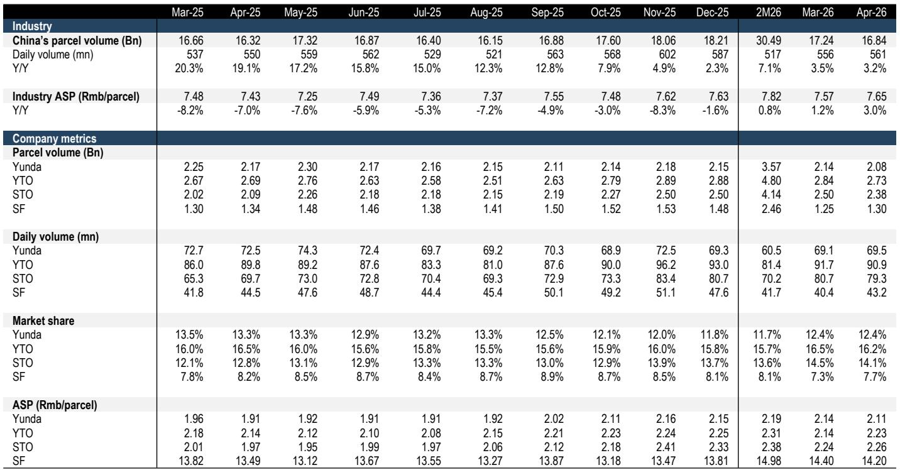
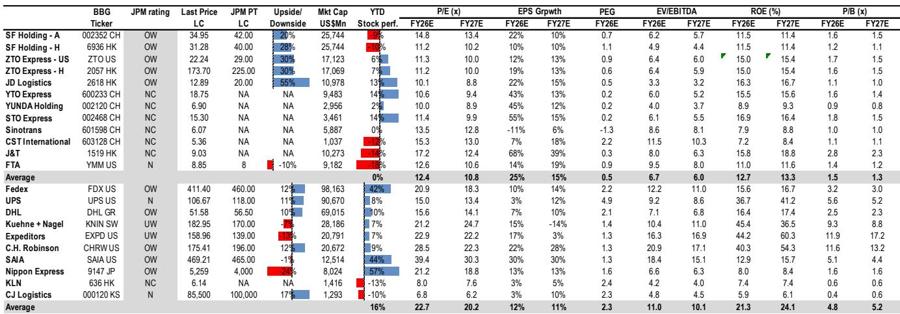

# China Logistics Has Entered a Yield-First Era, But the Real Test Is Whether Pricing Discipline Can Survive a Demand Slowdown

The Chinese logistics sector is no longer chasing volume at any cost. April data from the State Post Bureau confirms a structural shift: parcel volume growth moderated to 3.2% year-on-year, yet industry revenue accelerated to 6.3% growth, driven by an average selling price recovery of 3% to RMB 7.65. This is not a temporary blip. It is the signature of an industry that has internalized the logic of anti-involution—the regulatory and competitive push away from destructive price wars toward sustainable profitability. For the first time in years, pricing power is holding even as volume growth decelerates.

But this narrative of discipline and yield faces its most serious test in the second quarter of 2026. The same month that showed pricing resilience also revealed a sharp deceleration in e-commerce demand. April online retail sales grew just 2.3% year-on-year, and online physical goods GMV expanded by a meager 0.2%. When the engine of parcel demand—e-commerce—loses momentum, the sustainability of pricing power becomes an open question. The sector is entering a phase where the quality of earnings will be determined not by how much volume operators can capture, but by how effectively they can protect margins when the volume tailwind fades.

Conversations with management teams at ZTO, J&T, Yunda, and YMM during the recent Global China Summit converged on a consistent playbook: cost transmission to manage fuel volatility, technology and automation to protect unit economics, and service quality and reverse logistics as the key differentiation as headline pricing converges. The industry is making a bet that rational competition has become self-reinforcing. The data supports that bet—for now. But the coming quarters will reveal whether that bet survives a demand environment that is clearly cooling.

## The Industry Has Successfully Transitioned from Volume-at-Any-Cost to Yield-Driven Competition, But the Divergence Between Winners and Losers Is Widening

The April express delivery data provides the clearest evidence yet that anti-involution has moved from a regulatory campaign into repeatable operating rules. Industry volume of 16.84 billion parcels grew 3.2% year-on-year, a modest pace that reflects both base effects and a deliberate shift away from volume maximization. What matters is the revenue side: total industry revenue rose 6.3% to RMB 128.91 billion, meaning revenue growth outpaced volume growth by a factor of nearly two. The ASP recovery to RMB 7.65 represents a 3% year-on-year increase, and this is occurring against a backdrop of rising fuel costs and a slowing demand environment.

This is not a uniform recovery. The disaggregated data reveals a market that is bifurcating along lines of strategic focus and mix quality. STO Express delivered standout performance, with parcel volume surging 14% year-on-year to 2.38 billion and ASP rising 15% to RMB 2.26. This reflects ongoing consolidation benefits from the Danniao integration and a mix that is shifting toward higher-value parcels. YTO maintained steady volume growth at 2.73 billion parcels, up 1% year-on-year, while improving ASP by 4% to RMB 2.23. Yunda took a different approach, deliberately pruning ultra-low-price flows, which resulted in a 4% volume decline but a 10% ASP increase. Even SF Holdings, which continues to realign its e-commerce strategy, saw volume down 3% but ASP up 5% to RMB 14.2, signaling improved revenue quality.

The strategic implication is clear: the era of uniform volume growth is over. Companies are making explicit trade-offs between volume share and price quality, and the market is rewarding those who prioritize the latter. Market share dynamics reflect this, with STO gaining 1.3 percentage points year-on-year, while Yunda, YTO, and SF saw slight declines. The question that the data does not yet answer is whether this divergence is sustainable. If demand continues to soften, the pressure to chase volume may re-emerge, particularly for companies that have ceded market share in the pursuit of yield.

## E-Commerce Demand Deceleration Creates a Fundamental Tension with the Yield-First Strategy, and the Second Quarter Will Be the Stress Test

The April National Bureau of Statistics data reveals a demand environment that is meaningfully softer than the express delivery data might suggest. Online retail sales growth slowed to 2.3% year-on-year from 5.8% in March. Online physical goods GMV grew just 0.2% year-on-year, the lowest monthly growth since December 2024 and a sharp deceleration from 2.5% in March. The category-level data is even more concerning. Home appliance sales dropped 15% year-on-year in April, compared to a 5% decline in March. Communication device sales growth slowed to 6% from 27% in March. These are not minor fluctuations; they represent a material step-down in discretionary consumption.

The explanation lies in a combination of factors: a still-high comparable base from last year, a less intensive subsidy program in 2026, and what appears to be a genuine softening in consumer appetite for non-essential categories. Apparel online sales growth slowed to 7% in the first four months of 2026 from 12% in the first quarter, implying an 8% year-on-year decline in April alone. Daily-use products sales were essentially flat in April. The only relative bright spot was online food sales, which grew at a marginally accelerated pace.

This demand deceleration creates a fundamental tension for the express delivery sector. The yield-first strategy depends on operators having sufficient pricing power to pass through cost increases and maintain margins. Pricing power, in turn, depends on capacity utilization remaining high enough that operators do not need to compete on price to fill their networks. If e-commerce demand continues to soften, the volume base that supports pricing discipline will erode. The April data already shows this tension: express delivery volume growth of 3.2% is below the industry's typical run rate, and management teams at the summit acknowledged that full-year volume growth of 8-10% may be challenging.

The critical question that the April data raises but does not answer is whether the pricing discipline will hold if volume growth continues to decelerate. The answer will depend on whether the anti-involution regulatory framework is robust enough to prevent a return to price wars even when demand is weak. Management teams expressed confidence that the policy environment remains supportive, with continued government focus on grassroots welfare and network stability making a return to aggressive price wars unlikely. But confidence is not a guarantee, and the second quarter will provide the first real stress test of this thesis.

## Technology and Automation Are Becoming the Decisive Competitive Advantages, But the Returns Are Concentrated Among Leaders Who Can Scale Investment

The summit conversations revealed a consistent theme: technology investment is no longer optional. It is the primary mechanism through which operators are protecting unit economics in an environment where pricing is converging and costs are rising. ZTO's management highlighted that cost reduction and automation efforts are now focused on the last mile, with direct sorting rates at 40-45% and unmanned vehicle deployment progressing. Critically, ZTO passes all last-mile cost savings through to franchisees, reinforcing network confidence and engagement. This is a strategic choice that creates a virtuous cycle: lower costs for franchisees improve service quality, which supports pricing power, which generates the returns needed to fund further automation.

J&T's approach to technology is more geographically distributed, reflecting its multi-market footprint. The company has established a robust cost transmission mechanism that allows it to pass increased fuel costs to customers, a capability that has been well-received by shippers. In Southeast Asia, where parcel volume per capita is only a quarter of China's, the growth opportunity is substantial, but so is the need for technology to manage a fragmented and diverse operational footprint. J&T's partnership with SF Holdings, which involves handling most of SF's overseas last-mile deliveries and expanding into Europe and the Americas, is a technology-intensive collaboration that would not be feasible without sophisticated routing and tracking capabilities.

YMM's application of AI to optimize shipper and driver workflows represents a different dimension of technology investment. The platform is using AI to deliver cost savings and efficiency gains, and its mid-term commission rate target of at least 3% (from current levels around 2%) depends on demonstrating sufficient value to both sides of the marketplace. YMM's pure electric heavy truck penetration of approximately 10%, with faster adoption in short-haul routes, is another technology-driven trend that will reshape cost structures over time.

The so-what for investors is that technology investment is creating a two-tier industry. The companies that can afford to invest at scale—ZTO, J&T, SF—are building competitive moats that will be difficult for smaller operators to replicate. ZTO's reverse logistics capability, handling peak daily volumes of 10 million parcels, is a specific example of a technology-enabled service that competitors cannot quickly match. The unanswered question is whether the returns on this technology investment will justify the capital outlay, particularly if demand growth continues to slow and the volume base that amortizes fixed technology costs becomes less predictable.

## The Report Raises a Critical Unresolved Question: Can Pricing Discipline Survive a Demand Recession, or Is the Current Structure Dependent on Volume Growth That May Not Materialize?

The report provides a comprehensive picture of an industry in transition, but it leaves one question deliberately open: the sustainability of the yield-first strategy if demand deceleration becomes a demand recession. The April data shows that the industry is currently managing the tension between pricing power and volume growth, but the margin of safety is narrowing. Express delivery volume growth of 3.2% is already below the typical range, and management teams at the summit acknowledged that full-year volume growth of 8-10% is challenging.

The report's analysis of the e-commerce demand deceleration is thorough, but it does not fully explore the second-order implications for the express delivery sector. If online physical goods GMV growth remains near zero, the volume base that supports the current pricing structure will erode. Operators will face a choice: accept lower capacity utilization and maintain pricing discipline, or cut prices to stimulate volume. The anti-involution regulatory framework makes the latter option less likely, but it does not make it impossible. The real test will come when a major operator faces a sustained period of volume decline and must decide whether to defend market share or defend pricing.

There is also an unresolved question about the relationship between e-commerce platform dynamics and express delivery pricing. The report notes that Alibaba's stake reduction in ZTO is not expected to have a fundamental impact, as Tmall and Taobao contribute less than 20% of ZTO's parcel volume. But the broader question of platform-operator bargaining power remains. If e-commerce platforms face their own revenue pressure from slowing GMV growth, they may push back on delivery costs, creating a margin squeeze that the express delivery operators cannot easily offset through technology investment.

## A Decision Framework for Investors: Four Questions to Determine Which Operators Will Thrive in the Yield-First Era

For investors navigating this complex landscape, the report's insights can be synthesized into a decision framework built on four questions. Each question addresses a specific dimension of competitive advantage that will determine which operators emerge as winners in the yield-first era.

First, can the operator pass through cost increases to customers? The April data and summit conversations both emphasize that cost transmission is the most immediate test of pricing power. ZTO and J&T have demonstrated this capability, with J&T establishing a robust mechanism that has been well-received by shippers. Yunda has also shown effective price transmission, though it varies by region. The operators that cannot pass through costs will see margin compression that technology investment alone cannot offset.

Second, does the operator have a technology and automation moat that competitors cannot quickly replicate? ZTO's reverse logistics capability and last-mile automation are examples of technology advantages that create structural cost advantages. J&T's multi-market technology platform and partnership with SF represent a different kind of moat, based on geographic scope and integration complexity. The operators that are investing in proprietary technology will have a widening advantage over those that are relying on off-the-shelf solutions.

Third, is the operator's service quality and mix quality improving relative to peers? The divergence in April data between STO's volume and ASP growth and Yunda's volume decline and ASP improvement illustrates that different strategies can work, but only if they are executed consistently. The operators that are improving service quality and moving up the value chain into reverse logistics and high-value parcels will be better positioned to maintain pricing power even if overall demand softens.

Fourth, does the operator have exposure to growth markets that can offset domestic demand deceleration? J&T's Southeast Asia business, with a projected annual growth rate of 50%, provides a natural hedge against China demand weakness. YMM's overseas expansion in Egypt, Turkey, Indonesia, and the UAE represents a similar diversification strategy. The operators that are building international revenue streams will have more flexibility to maintain pricing discipline in their domestic operations.

The operators that score positively on all four questions—ZTO and JD Logistics are the report's top picks for precisely this reason—are likely to emerge as structural winners. The operators that score positively on some but not all questions face a more uncertain trajectory, and their performance will depend on the evolution of demand and competitive dynamics.

## Join the Community to Read the Full Report and Review the Original Charts

The analysis presented here draws on a detailed report from a global investment bank that includes comprehensive data on express delivery volumes, pricing trends, e-commerce demand dynamics, and management commentary from the Global China Summit. The full report contains charts showing share price performance, monthly express delivery data, and category-level e-commerce trends that provide the empirical foundation for the strategic conclusions discussed above. It also includes detailed company-level analysis and valuation frameworks that go beyond the scope of this article. For investors who want to make informed decisions in a sector that is undergoing a fundamental structural transformation, the full report and its accompanying data are essential reading. Join the community to access the complete analysis and the original charts that support these insights.

*This article is for learning and discussion only and does not constitute investment advice.*

Personal reading notes and learning share only. Not investment advice.

