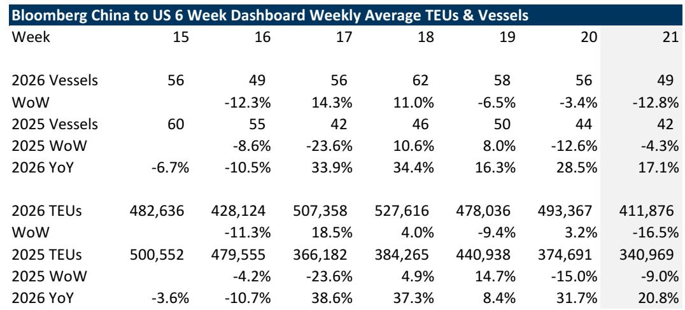
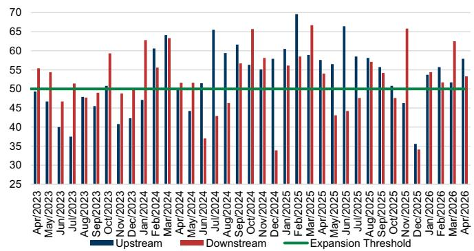
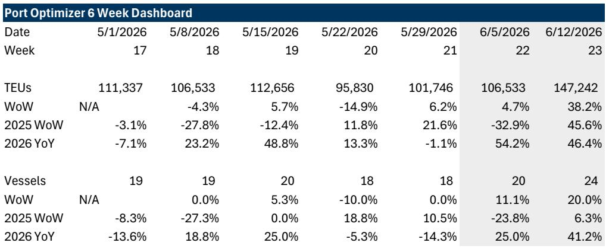

# The Tariff-Led Restocking Cycle Is Real, But It Masks a Deeper Structural Shift That Will Redefine Transport Demand Into 2027

The data from late May 2026 tells a clear and surprising story: laden container vessels from China to the United States remain up 17% year-over-year, even as sequential weekly volumes declined 13%. Imports into the Port of Los Angeles are projected to rise 38% week-over-week in the near term, with year-over-year comparisons exceeding 50%. On the surface, this looks like a straightforward post-Liberation Day recovery, driven by easy comparables and pent-up demand. But that interpretation is too shallow. The real pattern is more strategic, and more consequential.

What we are witnessing is not merely a normalization of trade flows after the April 2025 tariff shock. It is the early stage of a multi-phase inventory recalibration, one in which shippers are actively restocking under a new tariff regime that is both lower in effective rate and higher in uncertainty. The double-digit year-over-year import trajectory cannot be explained by easy comps alone. It suggests that importers are making calculated bets on future demand, even as the geopolitical backdrop remains fluid. The question is not whether volumes will hold. The question is what kind of demand is being built, and for whom.

This article argues that the current import surge is real but fragile, and that the real investment opportunity lies not in chasing the near-term volume spike, but in understanding how the structure of U.S. freight demand is being rewritten by tariff policy, reshoring investment, and shifting supply chain architecture. The next twelve months will separate transport operators who can navigate volatility from those who can position for a fundamentally different demand profile.

## The Current Import Surge Reflects a Deliberate Restocking Strategy, Not Just a Base-Effect Recovery

The most misleading statistic in the current data is the year-over-year comparison. Yes, imports into Los Angeles are expected to be up 54% and 46% in the coming weeks versus the same period in 2025. But 2025 was the Liberation Day trough, when import volumes collapsed as shippers scrambled to assess the impact of the new tariff structure. Comparing against that baseline inflates the apparent strength of the current recovery.

Strip out the base effect, and the picture becomes more nuanced. Sequential data shows a different rhythm. Laden vessels from China to the U.S. declined 13% week-over-week in late May, following a 3% decline the prior week. TEU volumes from China fell 16.5% sequentially. This is not a smooth ramp. It is a choppy, deliberate pattern that looks less like a demand boom and more like a carefully managed restocking cycle.

The key insight is that effective tariff rates have come down from the peak of the Liberation Day shock. The administration's use of Section 122 authority has created a 150-day window during which tariff rates are lower than what shippers feared. Importers are using this window to rebuild inventories that were deliberately drawn down during the uncertainty of early 2025. They are not betting on surging consumer demand. They are betting that the current tariff environment is the most favorable they will see for some time, and they are front-loading shipments accordingly.

This is a rational but risky strategy. If consumer demand softens in the second half of 2026, the restocked inventories will become excess inventories. The air pocket that many transport analysts feared for late 2025 may simply have been delayed, not avoided. The current volume strength is a tactical response to a policy window, not evidence of a structural demand recovery.

## The June Inflection Point Will Reveal Whether Shippers Are Restocking or Retrenching

The most critical data point in the coming weeks will not be the next week-over-week change, but the trajectory through June. The report's forward-looking indicators show a sharp increase in expected TEU volumes into Los Angeles over the next two weeks, followed by a question mark. The question is what happens after that initial surge fades.

If volumes remain elevated through June, it would suggest that shippers are not just filling a temporary gap, but are committing to higher inventory levels based on sustained demand expectations. That would be a bullish signal for transport volumes into the third quarter. If volumes roll over in June, it would confirm that the current strength is purely a tactical restocking move, and that the underlying demand picture is weaker than the year-over-year numbers suggest.

There are two factors that make the June data especially important. First, the Section 122 tariffs have a 150-day expiration. Shippers know the clock is ticking. If they believe tariffs will rise again after the window closes, they have every incentive to front-load even more aggressively. But if they believe the current rates will persist or be extended, the urgency to restock diminishes. Second, the geopolitical landscape remains unsettled. The report notes that ongoing conflicts could impact ocean and air rates, primarily through fuel costs rather than capacity constraints. Higher fuel costs act as a tax on global trade, and they disproportionately affect longer supply chains. If energy prices remain elevated, the cost advantage of sourcing from Asia narrows, which could accelerate the shift toward nearshoring and domestic sourcing.

The June data will not just tell us about volumes. It will tell us about shipper conviction.

## The Real Structural Shift Is Not About Tariffs Alone, But About the Reshaping of U.S. Freight Demand by Reshoring and Industrial Policy

The most important long-term insight from the report is not about container volumes from China. It is about the broader transformation of U.S. freight demand that is now underway. The report highlights several factors that could finally stimulate a volume inflection into 2026 and beyond: Fed rate cuts, the lapsing of Liberation Day, increased corporate investment in U.S. manufacturing, and the bonus depreciation revival through the One Big Beautiful Bill Act.

These factors are not independent. They form a coherent policy package designed to restructure the U.S. industrial base. The tariff regime is the stick. The investment incentives and depreciation benefits are the carrot. Together, they are intended to shift sourcing patterns away from China and toward domestic production and allied nations.

The early evidence is visible in the data. While Mainland China TEU volumes to the U.S. were up 20% year-over-year, Asia ex-China volumes were down 4.5%. This divergence is striking. It suggests that the restocking is disproportionately benefiting Chinese exporters, not the broader Asian supply chain. That may seem counterintuitive given the tariff focus on China, but it makes sense in the context of the current tariff window. Chinese exporters have the manufacturing scale, the logistics networks, and the pricing flexibility to respond quickly to the restocking opportunity. Other Asian suppliers are still building capacity.

Over a longer horizon, this pattern will reverse. The report notes that shifting logistics patterns and changing supply chain sourcing could drive secular global trade opportunity as companies pursue a China Plus 1 or 2 strategy. That means the current strength in China-to-U.S. volumes is likely the last hurrah of the old supply chain model, not the beginning of a new one. The companies that will benefit most from the next phase are not the ocean carriers serving the China-U.S. lane, but the logistics operators, trucking firms, and parcel carriers that serve domestic and nearshore supply chains.

## What the Report Does Not Fully Answer: How to Distinguish Between Tariff-Driven Volume and Demand-Driven Volume

The report's data is rich, but it leaves a critical analytical question unresolved. How do you distinguish between volume that is being pulled forward by tariff uncertainty and volume that reflects genuine end-market demand? This distinction is not academic. It determines whether the current strength is a tailwind or a trap.

Pull-forward volume is borrowed from future periods. It creates a temporary spike that is followed by a trough. Demand-driven volume is sustainable. It supports consistent freight volumes and pricing power. The two look identical in the weekly data. The only way to differentiate them is to look at downstream indicators: retail sales, inventory-to-sales ratios, consumer confidence, and industrial production.

The report acknowledges this challenge indirectly by cautioning that weekly data can be volatile and that conclusions should not be drawn from single data points. But it does not provide a framework for separating signal from noise. That is the missing piece.

A useful approach would be to compare import volumes with consumer spending data on a lagged basis. If import volumes are rising faster than consumer spending, the excess is likely going into inventory, which is a warning sign. If import volumes are tracking consumer spending closely, the restocking is demand-aligned. The report does not make this comparison, and it is a meaningful gap for any investor trying to assess the sustainability of the current cycle.

## A Decision Framework for Transport Investors: Three Questions to Ask Before Taking a Position

The report provides extensive data but no explicit investment framework. Based on the analysis, here is a three-question framework that any transport investor should answer before making a bet on the sector.

First, is the company exposed to China-U.S. ocean freight or to domestic and nearshore logistics? The answer determines whether the company is riding the current restocking wave or positioning for the structural shift. Ocean carriers and freight forwarders with heavy China exposure will benefit in the near term but face headwinds as the supply chain diversifies. Trucking firms, parcel carriers, and logistics operators serving domestic manufacturing will face a slower recovery but have a longer runway.

Second, does the company have pricing power in a volatile rate environment? The report notes that ocean container rates were flat sequentially after rising 13% the prior week, and that choppiness is expected as global capacity shifts. Companies that can pass through fuel costs and maintain margins in a volatile rate environment are better positioned than those that rely on stable, predictable pricing.

Third, what is the company's exposure to the U.S. consumer? The report highlights that the impact of higher energy costs on the American consumer is a key risk, especially if the geopolitical situation persists. Transport companies that serve industrial and B2B customers are less exposed to consumer spending weakness than those that rely on retail and e-commerce volumes.

These three questions will separate the short-term winners from the long-term compounders. The current data is noisy, but the strategic direction is clear. The transport sector is not just cycling through a tariff shock. It is being reshaped by it.

## The Next Six Months Will Test Whether the Transport Cycle Has Truly Bottomed

The report's authors express a cautiously positive view on the cycle recovery story, despite acknowledging that the bottom has been elusive. They point to Fed rate cuts, the lapsing of Liberation Day, and corporate investment announcements as catalysts for a volume inflection. These are valid arguments, but they are conditional.

The Fed rate cuts are already priced into expectations. The lapsing of Liberation Day is a one-time event that will not repeat. The corporate investment announcements are long-term projects that will take years to translate into freight volumes. The near-term risk is that the current restocking cycle fades before these structural catalysts materialize, leaving transport volumes in a no-man's-land between the old demand pattern and the new one.

The report's reference to a potential "air pocket" in the second half of the year is the most important caution. If consumer demand does not lift shipments after the pull-forward effect dissipates, the transport sector could face a disappointing end to 2026. That risk is real, and it is not fully captured by the positive year-over-year comparisons.

For serious investors, the right approach is not to bet on the direction of the next quarter's volumes. It is to identify which transport companies are building the infrastructure, networks, and customer relationships that will matter in a reshored, diversified, and more expensive supply chain. The current data is a snapshot of a transition. The real value lies in understanding where the transition is heading.

Join the community to read the full report and review the original charts.

*This article is for learning and discussion only and does not constitute investment advice.*

Personal reading notes and learning share only. Not investment advice.

