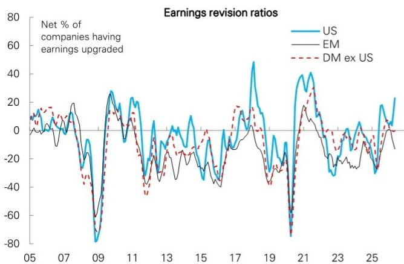

# The Dollar’s Exceptionalism Trap: Why Strong US Growth Alone Cannot Reignite a Bullish USD Regime

The narrative of US exceptionalism has returned with force in 2026. US GDP growth forecasts have climbed back into the top tier among G10 economies, data surprises have turned decisively positive, the Federal Reserve has been repriced hawkishly relative to peers, and US equities have outperformed the rest of the world by a meaningful margin over the past three months. On the surface, this looks like a textbook recipe for dollar strength. Yet the dollar has remained stubbornly neutral, failing to rally in response to what should be its most supportive macro environment in over a year. This disconnect is not a temporary anomaly. It reveals a structural shift in how global capital markets now price the dollar—a shift that makes the traditional growth-led dollar bull case incomplete at best, and misleading at worst.

The core argument of this article is straightforward: US exceptionalism in 2026 is real, but it is no longer sufficient to drive sustained dollar appreciation. The reason lies in three structural changes that the standard narrative overlooks. First, the source of US outperformance has shifted from earnings-led growth to GDP-led growth, and global equity investors care far more about the former than the latter. Second, the dollar’s yield advantage has eroded permanently relative to a broader set of G10 peers, meaning that even aggressive Fed repricing no longer translates into the same currency support it once did. Third, the record-breaking foreign inflows into US equities in 2025 have created a natural saturation point, with early 2026 data already showing a significant slowdown in foreign buying. These forces do not make the dollar bearish, but they do impose a ceiling on how much strength can be extracted from good news. The strategic question for investors is no longer whether the US economy will outperform, but whether that outperformance can still move the dollar.

This analysis draws on proprietary research from a global investment bank’s FX strategy team, which has recently shifted to a neutral dollar stance after months of careful observation. The report’s key insight—that US exceptionalism has returned but the dollar has not responded—deserves a deeper unpacking than a typical summary can provide. What follows is a structured examination of the forces at play, the gaps in the current analytical framework, and the decision framework investors should adopt in this new regime.

## The US Economy Is Outperforming Again, But Markets Are No Longer Pricing the Dollar on GDP Alone

The most striking feature of the current macro landscape is the sheer breadth of positive US data surprises. After a lull in 2025, US GDP growth is now forecast to rank among the top three in the G10, exceeding the peer average by a meaningful margin. US data surprises have been strongly positive in recent months, standing in stark contrast to the eurozone, where surprises have turned decisively negative. Corporate earnings revisions in the US have also improved relative to other developed markets. The Federal Reserve has been repriced hawkishly, with the two-year yield spread versus G10 peers widening by a substantial 40 basis points in the past month alone. US equities have outperformed the rest of the world by approximately 7 percent over the past three months.

This is a formidable list of positives. In any normal cycle, such a constellation would be sufficient to drive a sustained dollar rally. The fact that it has not done so should give every investor pause. The reason is that the relationship between GDP growth and currency strength is not linear, and in the current environment, it has become particularly weak. The market’s focus has shifted from headline growth to the composition of that growth—specifically, whether it is translating into corporate earnings that can attract and sustain global capital flows.

The evidence is clear. While US equities have outperformed recently, they remain laggards on a six-month and twelve-month basis. More importantly, rest-of-world earnings have been keeping pace with US earnings for some time now, with both rising by over 20 percent in the past six months. This means that the earnings advantage that historically underpinned US equity outperformance and dollar strength has effectively disappeared. Global equity investors are not seeing a compelling reason to increase their US exposure based on earnings alone, and without that marginal buyer, the dollar lacks a key pillar of support.

The implication is profound: US exceptionalism in GDP terms is real, but it has become decoupled from dollar performance. Investors who continue to trade the dollar based on GDP differentials alone are using an outdated playbook. The market has moved on.

## The Dollar Has Lost Its Top-Tier Yield Status, and the Reconnection Between Rates and the Currency Is Structurally Different

One of the most underappreciated changes in the global FX landscape over the past year is the dollar’s fall from the top tier of G10 yielders. Despite the recent hawkish repricing of the Fed, the US two-year yield remains outside the top three among G10 currencies—a position it lost approximately a year ago. This is not a minor detail. For much of the post-2022 period, the dollar’s yield advantage was a primary driver of its strength, attracting carry-seeking capital and providing a cushion against risk-off episodes. That cushion has now been removed.

The price action in recent weeks offers a telling signal. The front-end sell-off in US rates has been substantial, yet the dollar has remained unmoved. Instead of the dollar rallying in response to higher yields, what we have observed is a simple reconnection: the currency is now moving roughly in line with what the yield differential would suggest, rather than outperforming it. In other words, the dollar is no longer earning an exceptionalism premium on top of its yield advantage—because that yield advantage is no longer exceptional.

This shift has two important consequences. First, it means that further Fed repricing will have a smaller marginal impact on the dollar than it would have had a year ago. The bar for moving the currency has been raised. Second, it opens the door for other currencies to compete more effectively for yield-seeking flows. Currencies like the Australian dollar, the New Zealand dollar, and even the Norwegian krone now offer comparable or superior yields without the same degree of overvaluation risk that the dollar carries. This is a structural change, not a cyclical one, and it will persist even if the Fed continues to tighten.

## Foreign Demand for US Assets Has Hit a Saturation Point, Creating a Natural Ceiling for Dollar Appreciation

The third structural force restraining the dollar is the state of foreign demand for US assets. The data is unambiguous: global investors bought record amounts of US equities in 2025, but that buying has slowed dramatically in 2026. Treasury International Capital data shows a clear deceleration in foreign purchases of US equities, consistent with the view that the marginal buyer has stepped back.

This is not a coincidence. The record inflows of 2025 were driven by a combination of AI-related enthusiasm, a perceived safety premium on US assets, and the sheer momentum of a market that had been outperforming for years. But at some point, portfolios become saturated. Institutional investors have limits on how much they can allocate to a single market, and those limits are now being tested. The fact that foreign buying has slowed even as US economic data has improved suggests that allocation constraints, rather than macro pessimism, are the binding factor.

The implications for the dollar are clear. Without sustained foreign demand for US assets, the dollar loses a critical source of structural support. Capital flows are the transmission mechanism through which economic outperformance becomes currency strength. If that mechanism is impaired, even the best GDP data will fail to move the needle. The dollar can still rally on specific catalysts—a geopolitical shock, a sharp risk-off move, or a surprise Fed hike—but the baseline trend is capped by the simple reality that the world has already bought as much US exposure as it wants at current valuations.

## What the Report Does Not Fully Answer: The Asymmetry of Dollar Risk in a Regime of Neutrality

The report’s shift to a neutral dollar stance is analytically sound, but it leaves several important questions unresolved. The most critical of these is the asymmetry of dollar risk. If the dollar is neutral because the positives of US exceptionalism are offset by structural headwinds, then the path of least resistance may actually be lower, not flat. Neutrality in FX is rarely a stable equilibrium; it is usually a point of tension between competing forces that will eventually resolve in one direction.

The report identifies two upside risks—the oil story and the potential for more Fed repricing—and one downside risk—an Iran war resolution. But the magnitude of these risks is not symmetric. A resolution of geopolitical tensions could trigger a sharp unwind of dollar longs, particularly if it coincides with a broader risk-on move that favors currencies with higher beta and higher yields. Conversely, the upside risks seem more incremental in nature. More Fed repricing would likely be met with diminishing returns, given the dollar’s loss of top-tier yield status. And the oil story, while real, is a relatively narrow channel for dollar support compared to the broad-based headwinds from saturated foreign demand and earnings convergence.

The report also does not fully address the question of positioning. If foreign buying of US equities has already slowed, and if the dollar has failed to rally on good news, then the market may already be positioned for a neutral-to-weaker dollar outcome. This would mean that any negative surprise could trigger a disproportionately large move to the downside, while positive surprises would be met with a shrug. Understanding this asymmetry is crucial for anyone managing FX exposure in the current environment.

## A Decision Framework for Investors: How to Navigate the Dollar’s New Regime

Given the structural changes outlined above, investors need a new framework for thinking about the dollar. The old framework—buy the dollar when US data surprises are positive and sell when they are negative—no longer works. The new framework must account for three factors: the composition of US growth, the state of foreign demand for US assets, and the relative yield positioning of the dollar versus its G10 peers.

The first decision point is to distinguish between GDP-led and earnings-led US outperformance. If US data is strong but corporate earnings are not widening the gap versus the rest of the world, the dollar is unlikely to benefit. Investors should monitor earnings revision ratios and earnings growth differentials as leading indicators, not lagging ones. If the earnings gap begins to widen again, that would be a genuine signal to reassess the dollar’s prospects.

The second decision point is to track foreign capital flows into US equities and bonds with a focus on the marginal buyer. When inflows are accelerating, the dollar has a structural tailwind. When they are decelerating or reversing, the dollar loses that support. The TIC data is a lagging indicator, but surveys of institutional investor allocations and positioning data from futures markets can provide more timely signals.

The third decision point is to compare the dollar’s yield not just against a simple G10 average, but against the specific currencies that compete for carry flows. The dollar’s yield advantage over the euro and yen may still be intact, but its advantage over the Australian dollar, New Zealand dollar, and Norwegian krone has narrowed or reversed. This means that the dollar’s carry appeal is now concentrated in a narrower set of pairs, and that broader dollar strength requires a different catalyst than yield alone.

The report’s specific trade recommendation—selling EUR/JPY—is consistent with this framework. Japan’s data is outperforming the eurozone, yet rates repricing has gone the other way, with the ECB being repriced hawkishly relative to the Bank of Japan. This divergence between data and pricing creates an opportunity, particularly if the Bank of Japan’s recent hawkish rhetoric translates into actual policy action. The trade is not a dollar trade per se, but it reflects the same analytical discipline: look for disconnects between fundamentals and pricing, and act where the asymmetry is most favorable.

## The Unresolved Questions That Make the Full Report Worth Reading

The analysis above captures the key strategic takeaways, but it also reveals several questions that the full report addresses in greater depth. How exactly does the oil channel affect the dollar, and under what scenarios does it become dominant? What is the precise positioning of speculative and institutional investors in the dollar, and how does that affect the risk of a sharp reversal? How durable is the convergence in earnings growth between the US and the rest of the world, and what would cause it to break? And perhaps most importantly, what is the probability that the dollar’s neutral stance resolves to the upside versus the downside over a three-to-six-month horizon?

These are not academic questions. They have direct implications for portfolio construction, hedging decisions, and tactical trading. The full report provides the data, the charts, and the analytical depth needed to answer them with confidence. The charts on US data surprises versus the eurozone, the evolution of foreign buying of US equities, the yield rankings across G10 currencies, and the divergence between data and rates repricing in Japan versus the eurozone are all essential tools for building a robust view.

Join the community to read the full report and review the original charts.

*This article is for learning and discussion only and does not constitute investment advice.*

Personal reading notes and learning share only. Not investment advice.

