# Global Data Watch: Asia

EMAX resilience drives more hawkishness

# EMAX resilience to energy shock prompts more central bank hawkishness

Asia was always feared to be the region most susceptible to shortages from a prolonged closure of the Strait of Hormuz given its dependence on the region. However, the worst fears have not materialized because the region -- outside of China -- has been able to source imports from other areas. Daily tanker import volumes reveal that May imports of energy in EMAX and India, for example, are rapidly approaching normal levels. Enhanced procurement has been complemented by the running down of national energy reserves and the move to other fuel sources (coal, biofuel) to buffer the hit on activity. These dynamics, in conjunction with continued strong tech momentum – reinforced by this week's April IP prints in the region – alongside fiscal policy supports in some economies, has meant the hit to activity from the energy shock, while visible, is less potent than had been initially feared. But resilience has come at a price, with inflation pressures continuing to build in the region reflected in surging input and output prices in the April PMIs. With growth holding up, central banks have turned their attention to inflation and have become progressively hawkish.

The BSP and Bank of Indonesia have already hiked in recent weeks though for different reasons (the former because of an inflation shock, the latter because FX has come under pressure) and this week the Bank of Korea joined the camp of hawks. While the BoK kept rates on hold, as we had expected, it delivered a strongly hawkish message, signaling a faster and more robust hiking cycle than previously anticipated. The central bank's forward guidance now points to a rate hike as early as July with additional increases likely through next year. This shift is driven by Korea's sustained growth momentum, particularly from the tech sector, and a growing concern that this strength will spill over into demand side-inflation pressures. We therefore now pencil in four 25 bps hikes over the next year (compared to our previous forecast of 50 bps through the end of 2027), with the first hike in July itself.

In contrast, one central bank that is expected to remain patient is India's Reserve Bank of India. Even as markets price in multiple hikes, our longstanding view is that the bar for hikes in India is high. This week, the Governor reiterated the RBI will only react if energy pressures spill into core inflation, and with core very benign at the moment we expect the RBI to remain comfortably on hold at next week's review.

# Emerging Markets Asia, Economic and Policy Research

# Sajjid Z Chinoy

(91-22) 6157-3386

sajjid.z.chinoy@JPM.com

JPM Chase Bank, N.A., Mumbai Branch

# Anusha Mital

(91-22) 6157-4113

anusha.mital@jpmchase.com

JPM India Private Limited

Contents 

<table><tr><td>Australian housing: Grinding gears</td><td>6</td></tr><tr><td colspan="2">Data Watches</td></tr><tr><td>Japan</td><td>8</td></tr><tr><td>Australia and New Zealand</td><td>12</td></tr><tr><td>Greater China</td><td>14</td></tr><tr><td>Korea</td><td>17</td></tr><tr><td>ASEAN</td><td>19</td></tr><tr><td>India</td><td>22</td></tr><tr><td>Regional Data Calendars</td><td>24</td></tr></table>

Figure 1: EMAX tanker imports   
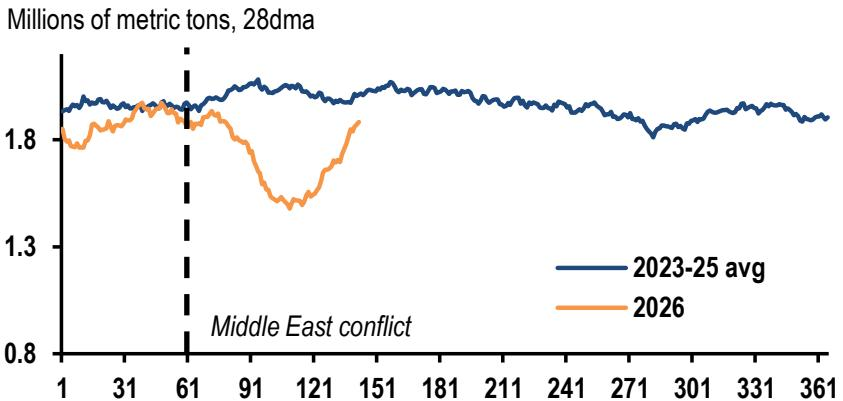

line

| X-axis | 2023-25 avg | 2026 |
|--------|-------------|------|
| 1      | ~1.85       | ~1.8 |
| 31     | ~1.85       | ~1.8 |
| 61     | ~1.85       | ~1.8 |
| 91     | ~1.85       | ~1.7 |
| 121    | ~1.85       | ~1.6 |
| 151    | ~1.85       | ~1.7 |
| 181    | ~1.85       | ~1.7 |
| 211    | ~1.85       | ~1.7 |
| 241    | ~1.85       | ~1.7 |
| 271    | ~1.85       | ~1.7 |
| 301    | ~1.85       | ~1.7 |
| 331    | ~1.85       | ~1.7 |
| 361    | ~1.85       | ~1.7 |

Source: IMF Portwatch, JPM.

Figure 2: India tanker imports   
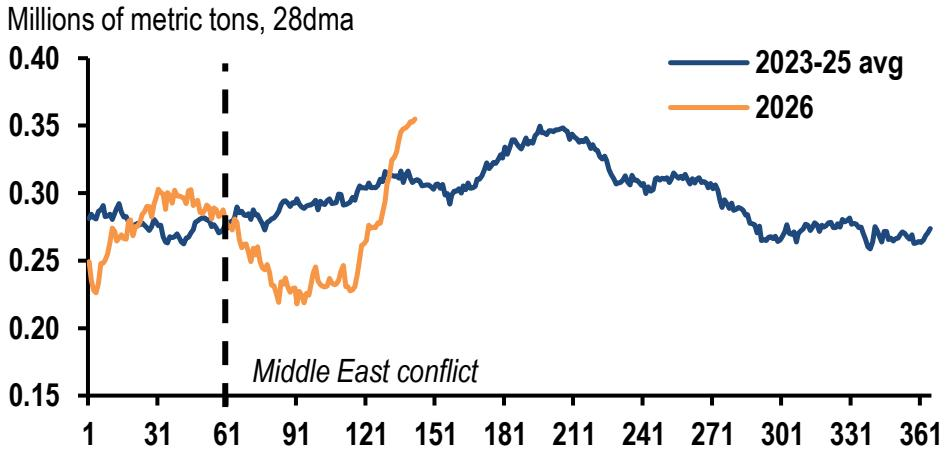

line

| Year | 2023-25 avg | 2026 |
|------|-------------|------|
| 1    | ~0.28       | ~0.24 |
| 31   | ~0.29       | ~0.30 |
| 61   | ~0.28       | ~0.28 |
| 91   | ~0.29       | ~0.23 |
| 121  | ~0.31       | ~0.24 |
| 151  | ~0.32       | ~0.36 |
| 181  | ~0.34       | —    |
| 211  | ~0.35       | —    |
| 241  | ~0.33       | —    |
| 271  | ~0.31       | —    |
| 301  | ~0.28       | —    |
| 331  | ~0.27       | —    |
| 361  | ~0.27       | —    |

Source: IMF Portwatch, JPM

# China: May PMIs to test near-term resilience

The Middle East conflict and energy shocks weighed on China's production and domestic demand in April, raising questions about the economy's resilience. Oil supply disruptions pushed processed oil and petrochemical output into contraction, partly reflecting the difficulties that small refiners face to switch suppliers and weaker incentives for SOE refiners to ramp up production amidst the export ban. Alternative indicators suggest processed crude output may have contracted further in May. Meanwhile, higher coke-oven operating rates point to increased oil-to-coal switching, partially offsetting the drag.

April's activity softness also appears to be associated with some scaling back of fiscal support and greater policy patience (relative to subsidy rollouts in some regional peers). General budget expenditure slipped into contraction, driven by weaker infrastructure outlays despite decent revenue growth. After three months of drawdowns, fiscal deposits jumped in April by more than typical seasonality, helping to explain the recent investment slide. All told, fiscal support has been less frontloaded than we had initially envisaged with the implication that the expected payback in the second half will also be less acute than feared.

Meanwhile, exports remained resilient in April and did the heavy lifting: a stronger-than-expected April rebound offset domestic weakness, though recent tailwinds appear increasingly concentrated in less labor-intensive categories such as memory ICs, EVs, solar, and batteries. Port trackers show slower month-on-month outbound container and bulk deadweight tonnage, pointing to a partial cooling. Taken together, for next week's May PMIs, we expect a modest dip to 50.1 for NBS manufacturing (vs. 50.3 in April) and 51.0 for RatingDog (vs. 52.2 in April).

Table 1: EM Asia data release 

<table><tr><td>Date</td><td>Market</td><td>Data</td><td>Period</td><td>Unit</td><td>JPM</td><td>Consensus</td><td>Previous</td></tr><tr><td rowspan="8">Mon, 01-Jun</td><td>TW</td><td>PMI mfg.</td><td>May</td><td>Index</td><td>53.0</td><td>-</td><td>55.3</td></tr><tr><td>KR</td><td>Trade balance</td><td>May</td><td>US$bn</td><td>23.0</td><td>24.5</td><td>23.8</td></tr><tr><td>KR</td><td>Exports</td><td>May</td><td>%oya</td><td>50.1</td><td>48.4</td><td>48.0</td></tr><tr><td>KR</td><td>Imports</td><td>May</td><td>%oya</td><td>25.2</td><td>21.9</td><td>16.7</td></tr><tr><td>KR</td><td>PMI mfg.</td><td>May</td><td>Index</td><td>53.5</td><td>-</td><td>53.6</td></tr><tr><td>CN</td><td>PMI mfg. (RatingDog)</td><td>May</td><td>Index</td><td>51.0</td><td>51.3</td><td>52.2</td></tr><tr><td>IN</td><td>PMI mfg.</td><td>May</td><td>Index</td><td>-</td><td>-</td><td>54.3</td></tr><tr><td>IN</td><td>IP</td><td>Apr</td><td>%oya</td><td>4.0</td><td>3.8</td><td>4.1</td></tr><tr><td rowspan="7">Tue, 02-Jun</td><td>KR</td><td>CPI</td><td>May</td><td>%oya</td><td>3.0</td><td>2.9</td><td>2.6</td></tr><tr><td>ID</td><td>Trade balance</td><td>Apr</td><td>US$bn</td><td>1.4</td><td>0.2</td><td>3.3</td></tr><tr><td>ID</td><td>Exports</td><td>Apr</td><td>%oya</td><td>3.2</td><td>10.2</td><td>-3.1</td></tr><tr><td>ID</td><td>Imports</td><td>Apr</td><td>%oya</td><td>-2.7</td><td>9.0</td><td>1.5</td></tr><tr><td>ID</td><td>CPI</td><td>May</td><td>%oya</td><td>2.7</td><td>2.9</td><td>2.4</td></tr><tr><td>HK</td><td>Retail sales</td><td>Apr</td><td>%oya</td><td>9.4</td><td>-</td><td>9.8</td></tr><tr><td>SG</td><td>PMI</td><td>May</td><td>Index</td><td>50.9</td><td>-</td><td>50.7</td></tr><tr><td>Wed, 03-Jun</td><td>HK</td><td>PMI</td><td>May</td><td>Index</td><td>50.3</td><td>-</td><td>48.6</td></tr><tr><td>Thu, 04-Jun</td><td></td><td></td><td></td><td></td><td></td><td></td><td></td></tr><tr><td rowspan="6">Fri, 05-Jun</td><td>KR</td><td>Current account balance</td><td>May</td><td>US$bn</td><td>29.0</td><td>-</td><td>37.3</td></tr><tr><td>PH</td><td>CPI</td><td>May</td><td>%oya</td><td>6.8</td><td>8.0</td><td>7.2</td></tr><tr><td>IN</td><td>RBI monetary policy meeting</td><td>Jun</td><td>%p.a.</td><td>5.25</td><td>5.25</td><td>5.25</td></tr><tr><td>IN</td><td>GDP</td><td>1Q</td><td>%oya</td><td>7.5</td><td>7.0</td><td>7.8</td></tr><tr><td>TH</td><td>CPI</td><td>May</td><td>%oya</td><td>2.7</td><td>3.2</td><td>2.9</td></tr><tr><td>TW</td><td>CPI</td><td>May</td><td>%oya</td><td>2.1</td><td>2.2</td><td>1.7</td></tr><tr><td colspan="8">During the week</td></tr><tr><td>Sun, 31-May</td><td>CN</td><td>PMI mfg. (NBS)</td><td>May</td><td>US$bn</td><td>50.1</td><td>50.0</td><td>50.3</td></tr></table>

Source: Bloomberg Finance L.P. and JPM forecasts

Regional Economic Outlook in Summary 

<table><tr><td rowspan="3"></td><td colspan="3">2021 Nominal GDP, US$</td><td colspan="3">Real GDP</td><td colspan="3">Consumer prices</td></tr><tr><td rowspan="2">Total billion</td><td rowspan="2">% of region</td><td rowspan="2">per capita</td><td colspan="3">% year-on-year</td><td colspan="3">% year-on-year</td></tr><tr><td>2024</td><td>2025</td><td>2026</td><td>2024</td><td>2025</td><td>2026</td></tr><tr><td>Japan</td><td>4,935</td><td>n.a.</td><td>40,114</td><td>-0.2</td><td>1.1</td><td>0.7</td><td>2.7</td><td>3.2</td><td>2.1</td></tr><tr><td>Australia</td><td>1,634</td><td>n.a.</td><td>64,327</td><td>1.0</td><td>2.0</td><td>2.0</td><td>3.2</td><td>2.8</td><td>4.3</td></tr><tr><td>New Zealand</td><td>247</td><td>n.a.</td><td>48,861</td><td>-0.3</td><td>0.2</td><td>1.9</td><td>2.9</td><td>2.8</td><td>3.7</td></tr><tr><td>Emerging Asia</td><td>26,963</td><td>100.0</td><td>8,048</td><td>4.9</td><td>5.1</td><td>4.8</td><td>1.2</td><td>0.6</td><td>1.8</td></tr><tr><td>ex China and India</td><td>6,175</td><td>22.9</td><td>10,794</td><td>3.9</td><td>3.9</td><td>4.5</td><td>2.1</td><td>1.6</td><td>2.9</td></tr><tr><td>China</td><td>17,706</td><td>65.7</td><td>12,572</td><td>4.9</td><td>5.0</td><td>4.7</td><td>0.2</td><td>0.0</td><td>1.0</td></tr><tr><td>Hong Kong SAR, China</td><td>368</td><td>1.4</td><td>49,849</td><td>2.6</td><td>3.6</td><td>3.4</td><td>1.7</td><td>1.4</td><td>1.6</td></tr><tr><td>Taiwan, China</td><td>777</td><td>2.9</td><td>33,071</td><td>5.3</td><td>8.7</td><td>9.8</td><td>2.2</td><td>1.7</td><td>2.0</td></tr><tr><td>Korea</td><td>1,809</td><td>6.7</td><td>35,126</td><td>2.0</td><td>1.0</td><td>3.0</td><td>2.3</td><td>2.1</td><td>2.7</td></tr><tr><td>India</td><td>3,082</td><td>11.4</td><td>2,250</td><td>6.5</td><td>7.5</td><td>6.0</td><td>4.9</td><td>2.1</td><td>4.6</td></tr><tr><td>Indonesia</td><td>1,187</td><td>4.4</td><td>4,358</td><td>5.0</td><td>5.1</td><td>4.7</td><td>2.3</td><td>1.9</td><td>3.5</td></tr><tr><td>Malaysia</td><td>373</td><td>1.4</td><td>11,476</td><td>5.1</td><td>5.2</td><td>4.6</td><td>1.8</td><td>1.4</td><td>1.9</td></tr><tr><td>Philippines</td><td>393</td><td>1.5</td><td>3,576</td><td>5.7</td><td>4.4</td><td>4.0</td><td>3.2</td><td>1.6</td><td>6.8</td></tr><tr><td>Singapore</td><td>397</td><td>1.5</td><td>79,601</td><td>5.3</td><td>5.0</td><td>4.3</td><td>2.4</td><td>0.9</td><td>2.1</td></tr><tr><td>Thailand</td><td>506</td><td>1.9</td><td>7,237</td><td>2.9</td><td>2.4</td><td>2.1</td><td>0.4</td><td>-0.1</td><td>2.7</td></tr><tr><td>Vietnam</td><td>365</td><td>1.4</td><td>3,757</td><td>7.1</td><td>7.9</td><td>7.3</td><td>3.6</td><td>3.3</td><td>5.3</td></tr><tr><td rowspan="3"></td><td colspan="3">Current account balance</td><td colspan="3">Current account</td><td colspan="3">Foreign reserves</td></tr><tr><td colspan="3">US$ billion</td><td colspan="3">% of GDP</td><td colspan="3">US$ billion</td></tr><tr><td>2024</td><td>2025</td><td>2026</td><td>2024</td><td>2025</td><td>2026</td><td>2024</td><td>2025</td><td>2026</td></tr><tr><td>Japan</td><td>n.a.</td><td>n.a.</td><td>n.a.</td><td>4.6</td><td>4.8</td><td>3.9</td><td>n.a.</td><td>n.a.</td><td>n.a.</td></tr><tr><td>Australia</td><td>n.a.</td><td>n.a.</td><td>n.a.</td><td>-2.2</td><td>-2.6</td><td>-2.0</td><td>n.a.</td><td>n.a.</td><td>n.a.</td></tr><tr><td>New Zealand</td><td>n.a.</td><td>n.a.</td><td>n.a.</td><td>-4.8</td><td>-3.7</td><td>-4.2</td><td>n.a.</td><td>n.a.</td><td>n.a.</td></tr><tr><td>Emerging Asia</td><td>786.9</td><td>1165.0</td><td>1170.4</td><td>2.6</td><td>3.8</td><td>3.6</td><td>n.a.</td><td>n.a.</td><td>n.a.</td></tr><tr><td>ex China and India</td><td>385.9</td><td>456.8</td><td>495.6</td><td>5.4</td><td>6.1</td><td>6.7</td><td>n.a.</td><td>n.a.</td><td>n.a.</td></tr><tr><td>China</td><td>423.9</td><td>747.9</td><td>754.1</td><td>2.3</td><td>3.8</td><td>3.6</td><td>n.a.</td><td>n.a.</td><td>n.a.</td></tr><tr><td>Hong Kong SAR, China</td><td>52.5</td><td>54.7</td><td>47.3</td><td>12.9</td><td>12.8</td><td>10.5</td><td>421</td><td>426</td><td>428</td></tr><tr><td>Taiwan, China</td><td>112.7</td><td>139.3</td><td>135.2</td><td>14.1</td><td>15.1</td><td>13.6</td><td>578</td><td>585</td><td>592</td></tr><tr><td>Korea</td><td>99.0</td><td>122.7</td><td>195.9</td><td>5.3</td><td>6.6</td><td>10.2</td><td>409</td><td>427</td><td>445</td></tr><tr><td>India</td><td>-23.0</td><td>-39.7</td><td>-79.3</td><td>-0.6</td><td>-1.0</td><td>-2.0</td><td>n.a.</td><td>n.a.</td><td>n.a.</td></tr><tr><td>Indonesia</td><td>-8.7</td><td>-10.2</td><td>-15.7</td><td>-0.6</td><td>-0.8</td><td>-1.1</td><td>149</td><td>145</td><td>140</td></tr><tr><td>Malaysia</td><td>7.2</td><td>9.7</td><td>14.9</td><td>1.7</td><td>2.1</td><td>2.8</td><td>124</td><td>127</td><td>130</td></tr><tr><td>Philippines</td><td>-17.5</td><td>-16.3</td><td>-21.9</td><td>-3.8</td><td>-3.3</td><td>-4.4</td><td>95</td><td>91</td><td>74</td></tr><tr><td>Singapore</td><td>98.5</td><td>100.9</td><td>128.0</td><td>17.2</td><td>16.7</td><td>19.9</td><td>n.a.</td><td>n.a.</td><td>n.a.</td></tr><tr><td>Thailand</td><td>11.6</td><td>22.8</td><td>2.3</td><td>2.2</td><td>3.9</td><td>0.4</td><td>217</td><td>249</td><td>270</td></tr><tr><td>Vietnam</td><td>30.5</td><td>33.1</td><td>9.7</td><td>6.8</td><td>6.6</td><td>1.8</td><td>83</td><td>87</td><td>82</td></tr><tr><td rowspan="3"></td><td colspan="3">External debt</td><td colspan="3">Short-term foreign debt</td><td colspan="3">Government balance</td></tr><tr><td colspan="3">% of GDP, end of period</td><td colspan="3">US$ billion, end of period</td><td colspan="3">% of GDP, end of period</td></tr><tr><td>2024</td><td>2025</td><td>2026</td><td>2024</td><td>2025</td><td>2026</td><td>2024</td><td>2025</td><td>2026</td></tr><tr><td>Japan</td><td>n.a.</td><td>n.a.</td><td>n.a.</td><td>n.a.</td><td>n.a.</td><td>n.a.</td><td>-6.1</td><td>-6.7</td><td>-6.9</td></tr><tr><td>Australia</td><td>n.a.</td><td>n.a.</td><td>n.a.</td><td>n.a.</td><td>n.a.</td><td>n.a.</td><td>0.0</td><td>-0.4</td><td>-0.6</td></tr><tr><td>New Zealand</td><td>n.a.</td><td>n.a.</td><td>n.a.</td><td>n.a.</td><td>n.a.</td><td>n.a.</td><td>-2.6</td><td>-2.4</td><td>-2.7</td></tr><tr><td>China</td><td>n.a.</td><td>n.a.</td><td>n.a.</td><td>n.a.</td><td>n.a.</td><td>n.a.</td><td>-3.0</td><td>-4.0</td><td>-4.0</td></tr><tr><td>Hong Kong SAR, China</td><td>n.a.</td><td>n.a.</td><td>n.a.</td><td>n.a.</td><td>n.a.</td><td>n.a.</td><td>-1.8</td><td>0.1</td><td>0.6</td></tr><tr><td>Taiwan, China</td><td>26.2</td><td>23.6</td><td>22.5</td><td>207</td><td>213</td><td>221</td><td>-0.6</td><td>-1.0</td><td>-1.6</td></tr><tr><td>Korea</td><td>35.6</td><td>37.9</td><td>40.3</td><td>146</td><td>178</td><td>178</td><td>-1.7</td><td>-1.8</td><td>-0.5</td></tr><tr><td>India</td><td>n.a.</td><td>n.a.</td><td>n.a.</td><td>n.a.</td><td>n.a.</td><td>n.a.</td><td>-8.4</td><td>-8.0</td><td>-8.3</td></tr><tr><td>Indonesia</td><td>27.4</td><td>25.3</td><td>23.6</td><td>43</td><td>43</td><td>43</td><td>-2.7</td><td>-2.9</td><td>-3.0</td></tr><tr><td>Malaysia</td><td>50.6</td><td>47.3</td><td>44.0</td><td>119</td><td>129</td><td>139</td><td>-4.3</td><td>-3.8</td><td>-3.5</td></tr><tr><td>Philippines</td><td>28.5</td><td>30.6</td><td>33.6</td><td>21</td><td>22</td><td>27</td><td>-5.7</td><td>-4.8</td><td>-6.0</td></tr><tr><td>Singapore</td><td>n.a.</td><td>n.a.</td><td>n.a.</td><td>n.a.</td><td>n.a.</td><td>n.a.</td><td>0.4</td><td>0.4</td><td>0.2</td></tr><tr><td>Thailand</td><td>37.0</td><td>34.1</td><td>32.1</td><td>86</td><td>75</td><td>75</td><td>-4.0</td><td>-4.7</td><td>-4.5</td></tr><tr><td>Vietnam</td><td>46.1</td><td>47.1</td><td>48.1</td><td>n.a.</td><td>n.a.</td><td>n.a.</td><td>-3.6</td><td>-3.8</td><td>-4.0</td></tr></table>

Source: National statistics authorities and JPM

Key economic statistics 

<table><tr><td colspan="2"></td><td>1Q25</td><td>2Q25</td><td>3Q25</td><td>4Q25</td><td>1Q26</td><td>2Q26</td><td>3Q26</td><td>4Q26</td></tr><tr><td colspan="10">Real GDP, %-ch over 1 quarter, saar</td></tr><tr><td colspan="2">Japan</td><td>1.8</td><td>1.4</td><td>-2.5</td><td>0.8</td><td>2.1</td><td>0.2</td><td>1.0</td><td>0.8</td></tr><tr><td colspan="2">Australia</td><td>1.7</td><td>3.4</td><td>1.9</td><td>3.2</td><td>1.3</td><td>1.6</td><td>1.5</td><td>1.9</td></tr><tr><td colspan="2">New Zealand</td><td>4.5</td><td>-3.4</td><td>3.5</td><td>1.0</td><td>3.3</td><td>1.2</td><td>3.4</td><td>1.2</td></tr><tr><td colspan="2">Emerging Asia</td><td>4.7</td><td>4.9</td><td>4.4</td><td>5.6</td><td>6.8</td><td>3.7</td><td>3.4</td><td>3.4</td></tr><tr><td colspan="2">ex China and India</td><td>2.9</td><td>5.3</td><td>5.0</td><td>6.0</td><td>6.5</td><td>2.3</td><td>2.9</td><td>3.0</td></tr><tr><td colspan="2">China</td><td>4.9</td><td>4.2</td><td>3.7</td><td>5.2</td><td>6.7</td><td>4.0</td><td>3.2</td><td>3.2</td></tr><tr><td colspan="2">Hong Kong SAR, China</td><td>4.6</td><td>3.3</td><td>3.8</td><td>4.3</td><td>12.2</td><td>3.0</td><td>2.8</td><td>2.8</td></tr><tr><td colspan="2">Taiwan, China</td><td>6.4</td><td>13.2</td><td>7.4</td><td>23.6</td><td>11.9</td><td>2.2</td><td>3.6</td><td>3.6</td></tr><tr><td colspan="2">Korea</td><td>-0.9</td><td>2.7</td><td>5.4</td><td>-0.6</td><td>6.9</td><td>1.0</td><td>2.0</td><td>2.0</td></tr><tr><td colspan="2">India</td><td>7.2</td><td>8.5</td><td>7.5</td><td>7.5</td><td>7.4</td><td>4.3</td><td>5.5</td><td>5.5</td></tr><tr><td colspan="2">Indonesia</td><td>4.9</td><td>5.5</td><td>5.3</td><td>5.7</td><td>5.7</td><td>3.7</td><td>3.3</td><td>3.0</td></tr><tr><td colspan="2">Malaysia</td><td>5.3</td><td>6.1</td><td>7.6</td><td>6.2</td><td>1.4</td><td>5.0</td><td>4.5</td><td>4.0</td></tr><tr><td colspan="2">Philippines</td><td>4.9</td><td>3.7</td><td>1.4</td><td>2.4</td><td>3.8</td><td>4.9</td><td>5.7</td><td>8.2</td></tr><tr><td colspan="2">Singapore</td><td>2.5</td><td>7.3</td><td>7.8</td><td>5.2</td><td>3.9</td><td>3.0</td><td>2.0</td><td>2.0</td></tr><tr><td colspan="2">Thailand</td><td>1.9</td><td>2.2</td><td>-1.1</td><td>7.6</td><td>2.7</td><td>-1.1</td><td>1.2</td><td>2.0</td></tr><tr><td colspan="2">Vietnam</td><td>7.8</td><td>12.0</td><td>8.0</td><td>5.0</td><td>5.0</td><td>4.5</td><td>6.0</td><td>6.0</td></tr><tr><td colspan="10">Consumer prices, %oya, average</td></tr><tr><td colspan="2">Emerging Asia</td><td>1.8</td><td>0.7</td><td>0.4</td><td>0.9</td><td>1.4</td><td>1.9</td><td>2.1</td><td>1.9</td></tr><tr><td colspan="2">ex China and India</td><td>1.6</td><td>1.5</td><td>1.5</td><td>1.8</td><td>2.1</td><td>2.9</td><td>3.2</td><td>3.3</td></tr><tr><td colspan="2">China</td><td>-0.1</td><td>0.0</td><td>-0.2</td><td>0.6</td><td>0.8</td><td>1.2</td><td>1.3</td><td>0.9</td></tr><tr><td colspan="2">Hong Kong SAR, China</td><td>1.6</td><td>1.8</td><td>1.1</td><td>1.3</td><td>1.6</td><td>1.6</td><td>1.5</td><td>1.7</td></tr><tr><td colspan="2">Taiwan, China</td><td>2.2</td><td>1.6</td><td>1.5</td><td>1.3</td><td>1.2</td><td>2.3</td><td>2.3</td><td>2.2</td></tr><tr><td colspan="2">Korea</td><td>2.1</td><td>2.1</td><td>2.0</td><td>2.4</td><td>2.1</td><td>2.8</td><td>3.1</td><td>2.8</td></tr><tr><td colspan="2">India</td><td>3.9</td><td>3.1</td><td>1.9</td><td>0.8</td><td>3.0</td><td>4.2</td><td>4.4</td><td>5.0</td></tr><tr><td colspan="2">Indonesia</td><td>0.6</td><td>1.8</td><td>2.4</td><td>2.8</td><td>3.9</td><td>2.7</td><td>3.2</td><td>3.6</td></tr><tr><td colspan="2">Malaysia</td><td>1.5</td><td>1.3</td><td>1.3</td><td>1.4</td><td>1.6</td><td>2.0</td><td>2.0</td><td>2.1</td></tr><tr><td colspan="2">Philippines</td><td>2.2</td><td>1.4</td><td>1.4</td><td>1.7</td><td>2.8</td><td>7.6</td><td>8.2</td><td>8.7</td></tr><tr><td colspan="2">Singapore</td><td>1.0</td><td>0.8</td><td>0.6</td><td>1.2</td><td>1.5</td><td>1.9</td><td>2.6</td><td>2.4</td></tr><tr><td colspan="2">Thailand</td><td>1.1</td><td>-0.3</td><td>-0.7</td><td>-0.5</td><td>-0.5</td><td>3.2</td><td>3.9</td><td>4.3</td></tr><tr><td colspan="2">Vietnam</td><td>3.1</td><td>3.6</td><td>3.4</td><td>3.5</td><td>4.7</td><td>5.9</td><td>5.8</td><td>5.6</td></tr><tr><td colspan="2"></td><td>1Q25</td><td>2Q25</td><td>3Q25</td><td>4Q25</td><td>1Q26</td><td>2Q26</td><td>3Q26</td><td>4Q26</td></tr><tr><td colspan="10">Official interest rates, % p.a., end-period</td></tr><tr><td>Japan</td><td>Pol rate IOER1</td><td>0.48</td><td>0.48</td><td>0.48</td><td>0.73</td><td>0.73</td><td>1.00</td><td>1.00</td><td>1.25</td></tr><tr><td>Australia</td><td>Cash rate</td><td>4.10</td><td>3.85</td><td>3.60</td><td>3.60</td><td>4.10</td><td>4.35</td><td>4.35</td><td>4.35</td></tr><tr><td>New Zealand</td><td>Cash rate</td><td>3.75</td><td>3.25</td><td>3.00</td><td>2.25</td><td>2.25</td><td>2.25</td><td>2.75</td><td>3.00</td></tr><tr><td>China</td><td>7-day Reverse repo rate</td><td>1.50</td><td>1.40</td><td>1.40</td><td>1.40</td><td>1.40</td><td>1.40</td><td>1.30</td><td>1.30</td></tr><tr><td>Taiwan, China</td><td>Official discount rate</td><td>2.00</td><td>2.00</td><td>2.00</td><td>2.00</td><td>2.00</td><td>2.00</td><td>2.00</td><td>2.00</td></tr><tr><td>Korea</td><td>Base rate</td><td>2.75</td><td>2.50</td><td>2.50</td><td>2.50</td><td>2.50</td><td>2.50</td><td>2.75</td><td>3.00</td></tr><tr><td>India</td><td>Repo rate</td><td>6.25</td><td>5.50</td><td>5.50</td><td>5.25</td><td>5.25</td><td>5.25</td><td>5.25</td><td>5.25</td></tr><tr><td>Indonesia</td><td>BI RR rate</td><td>5.75</td><td>5.50</td><td>4.75</td><td>4.75</td><td>4.75</td><td>5.00</td><td>5.00</td><td>5.00</td></tr><tr><td>Malaysia</td><td>Overnight policy rate</td><td>3.00</td><td>3.00</td><td>2.75</td><td>2.75</td><td>2.75</td><td>2.75</td><td>2.75</td><td>2.75</td></tr><tr><td>Philippines</td><td>Reverse repo rate</td><td>5.75</td><td>5.25</td><td>5.00</td><td>4.50</td><td>4.25</td><td>5.00</td><td>5.50</td><td>6.00</td></tr><tr><td>Thailand</td><td>1-day repo rate</td><td>2.00</td><td>1.75</td><td>1.50</td><td>1.25</td><td>1.00</td><td>1.00</td><td>1.00</td><td>1.00</td></tr><tr><td>Vietnam</td><td>Refinancing rate</td><td>4.50</td><td>4.50</td><td>4.50</td><td>4.50</td><td>4.50</td><td>4.50</td><td>4.50</td><td>4.50</td></tr></table>

1. BoJ sets the policy rate on IOER (O/N) and targets 10-year JGB yields as policy guidance.   
Source: National statistics authorities and JPM.

# Australian housing: Grinding gears

• Tax rule changes on investor housing should reinforce the near-term slowdown   
- Differences in gearing treatment suggest this will manifest more via weakening in turnover, than in prices   
- Lower housing turnover is historically negative for consumer spending on furniture, household goods and recreation services

This month's FY27 Commonwealth Budget affirmed that fiscal policy settings should be a headwind to growth in 2026/27, relative to 2025. That assessment largely rests on fiscal impulse estimates, which translate changes in government revenues and expenditure from policy choices, through fiscal multipliers, into GDP (see here).

However, the FY27 Budget also introduced significant policy changes to the taxation of assets, which carry secondary incentive effects through the economy. Here we focus on one in particular: the elimination of negative gearing on investor housing. Market participants have been particularly interested in the implications for dwelling prices, though in our view the larger effect will be in housing turnover. Below we run through the logic supporting that view and the implications for housing-sensitive consumption groups.

# House Rules

The FY27 Budget unveiled the most significant change in taxation of capital since the late 1990s. Subject to (not guaranteed) passage through the Senate, the government plans to eliminate the current $50\%$ capital gains tax discount (a halving of the marginal tax rate, for assets held for more than one year), moving to an inflation indexation approach. This will tax gains on assets above inflation, at the maximum of one's marginal tax rate, and $30\%$ . The changes, originally mooted to address property speculation, will also apply to equity wealth and returns on other forms of business ownership.

The government plans to simultaneously remove negative gearing of investor housing on existing dwellings. Negative gearing is the right to deduct net rental losses – i.e. when interest and related costs exceed rental income – against other forms of taxable income. Importantly, properties held prior to the release of the Budget will be exempt (“grandfathered”), so arrangements will not change for current investor holdings.

# Volume game

By reducing the after-tax benefit of holding investment property, willingness to pay for such assets should fall, meaning a near-term weakening in property turnover and prices. We observed previously that the outlook for housing had already deteriorated following a sharp swing in policy rate expectations. Even in data before the Budget release, housing turnover had fallen on reduced buyer interest, suggesting a turn in house prices ahead (Figure 1). Tax changes are then likely to interact with a slowdown in housing already underway.

Figure 1: Dwelling sales turnover and prices   
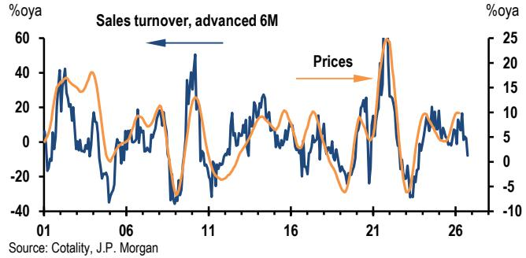

line

| Date | Sales turnover, advanced 6M (%oya) | Prices (%oya) |
|------|-----------------------------------|---------------|
| 01   | ~40                               | ~15           |
| 06   | ~20                               | ~5            |
| 11   | ~50                               | ~10           |
| 16   | ~20                               | ~5            |
| 21   | ~60                               | ~25           |
| 26   | ~10                               | ~5            |

The stability of the relationship in Figure 1 reveals an important feature: the relationship between price and turnover appears to be reliably positive. Most variation in turnover then historically comes through demand shocks, against relatively stable market supply, pushing price and quantity in the same direction. Note also that the elasticity of prices to turnover is on average about +0.3, i.e. materially less than one. Most of the time, we should then expect the percentage change in transaction volumes from any demand shocks to be greater than that in prices.

# Stuck between gears

The negative gearing rule change is particularly interesting in that grandfathering maintains the tax benefit to existing owners. This is represented by the unchanged offer (O) curve for existing holders of investor housing, in the schematic of Figure 2. Prospective investors, who can't access the tax benefit on the same asset, would perceive lower value, represented by the shift DT in bid curves from B to B'.

Figure 2: Investor housing bid/offer curves with tax treatment   
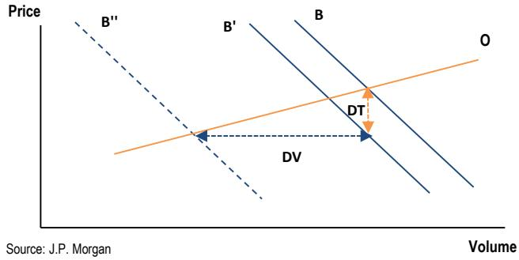

line

| Point | Price | Volume |
|-------|-------|--------|
| B     | B     |        |
| B'    | B'    |        |
| DT    | DT    |        |
| DV    | DV    |        |
| O     | O     |        |
| Source: JPM |       |        |

Because the offer curve is relatively flat (slope of approximately +0.3, as above), the change in turnover moving from (O,B) to (O,B') is larger than the resulting change in price, in a ratio of about 3 to 1. In other words, we should again expect reduced turnover to bear most of the adjustment.

Further, for this speculative segment of the market, the lower carrying value of the asset means the bid curve is lower for all states of the world on expected future prices. By reinforcing a downturn underway, the demand shift may then be larger, so that prices need to fully reflect the tax impact. This doesn't change the relative impacts on prices and volumes, but does make for a larger absolute volume contraction (shown by DV). A larger dislocation in turnover is an intuitive income, if buyer and seller now disagree on the carrying value of the asset.

Table 1: Relative price and turnover impacts 

<table><tr><td>Gearing benefit lost (% of price)</td><td>Price (growth) impact (%-pt)</td><td>Turnover (growth) impact (%-pt)</td></tr><tr><td>0.00</td><td>-0.0</td><td>-0.0</td></tr><tr><td>-0.25</td><td>-0.4</td><td>-1.3</td></tr><tr><td>-0.50</td><td>-0.8</td><td>-2.6</td></tr><tr><td>-0.75</td><td>-1.2</td><td>-4.0</td></tr><tr><td>-1.00</td><td>-1.6</td><td>-5.3</td></tr><tr><td>-1.25</td><td>-2.0</td><td>-6.6</td></tr><tr><td>-1.50</td><td>-2.4</td><td>-7.9</td></tr><tr><td>-1.75</td><td>-2.8</td><td>-9.2</td></tr><tr><td>-2.00</td><td>-3.2</td><td>-10.6</td></tr><tr><td>-2.25</td><td>-3.6</td><td>-11.9</td></tr><tr><td>-2.50</td><td>-4.0</td><td>-13.2</td></tr><tr><td>-2.75</td><td>-4.4</td><td>-14.5</td></tr><tr><td>-3.00</td><td>-4.7</td><td>-15.8</td></tr></table>

Source: JPM.

Table 1 presents rough calculations of the impact on price, with the volume/turnover effect DV assumed to be three times larger. We show some rough simulations, depending on the average tax benefit lost from negative gearing, as a percentage of price (most estimates put this in a 0.5-2% of price range). We then take the gearing benefit per year and treat it as a fixed coupon stream over 10 years, taking the net present value at a mortgage/discount rate of 5.5%. For an aggregate price effect, this is then multiplied by the current share of investors in property ownership (around 1/3) and within that, the share of negatively geared exposures (depending on whether this is % of properties or investors, yields 0.5 to 0.7).

The resulting price impact is in the 1-3% range, similar to Treasury estimates for the entire tax package over the medium term. Recall that this estimate is on top of the underlying trajectory for prices which, as argued above, is already weakening, so could push into modest contraction. The volume/ turnover effect is bigger, potentially above 10%-pt.

# Turning over

We have argued that housing turnover is likely to bear most of the near-term adjustment from the loss of negative gearing. In the past we have also found that while wealth effects from asset prices can be important at times, the most cyclical components of consumer spending have a more reliable relationship to housing turnover.

Figure 3 below shows the betas of nominal household spending categories (%oya) to lagged housing turnover (%oya, 6m lag). The blue bars are from a regression with only a constant, and dwelling turnover. The orange bars are from a regression with an extra control for aggregate spending (the first principal component of spending growth across all categories), so represent the relative over- or under-performance of a category, as a function of housing turnover.

Figure 3: Betas of household spending to housing turnover   
% change in %oya spending for % change in housing turnover growth   
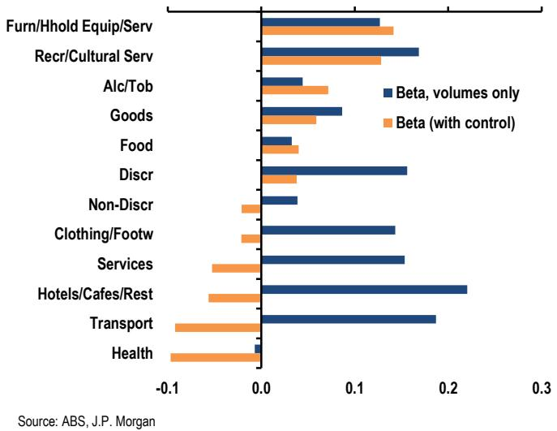

bar

| Sector | Beta, volumes only | Beta (with control) |
| :--- | :--- | :--- |
| Furn/Hhold Equip/Serv | 0.12 | 0.13 |
| Recr/Cultural Serv | 0.17 | 0.12 |
| Alc/Tob | 0.04 | 0.07 |
| Goods | 0.09 | 0.06 |
| Food | 0.03 | 0.04 |
| Discr | 0.15 | 0.03 |
| Non-Discr | 0.04 | -0.02 |
| Clothing/Footw | 0.14 | -0.02 |
| Services | 0.15 | -0.05 |
| Hotels/Cafes/Rest | 0.22 | -0.06 |
| Transport | 0.18 | -0.08 |
| Health | 0.01 | -0.10 |
Source: ABS, JPM

In the orange bars, which we view as the most relevant result, furniture/household equipment/household services, intuitively, have greatest relative sensitivity to housing turnover. Health, transport, hospitality, and clothing/footwear have lower, or negative sensitivity. If we take out the control for aggregate spending (the blue bars), the betas generally go up, as they now also pick up the broader business cycle relationship between aggregate consumption and housing turnover, which has many elements. That result may suggest some additional downside risks to spending overall, though relative to our already-soft forecasts calibrated on the higher rate outlook, we see less downside at these levels, given the cushion from the increase in the saving rate over the last year.

# Japan

- Manufacturers' future concerns are focused not on weaker demand, but on tighter supply conditions   
- The government announced plans to fund the investment budget off-budget,...   
- ... which may politically mask fiscal expansion but leaves JGB supply and demand concerns unresolved   
- Next week: 1Q corporate capex and profits, May wages

Incoming data suggest that economic activity continues to be resilient, supported by government subsidies offsetting much of the impact of higher crude prices, while conflict in the Middle East is contributing to a drawdown of production inventories. Against the backdrop of solid tech demand and a decline in headline inflation, both industrial production and retail sales in April came in stronger than expected. Manufacturers' production plans also remain firm, suggesting that their concerns are tilted not toward demand but primarily toward supply constraints.

This strength is also being supported by the government's fiscal measures that effectively shoulder the inflationary pressures emerging globally. This week, in addition to a supplementary budget related to energy subsidies of more than JPY3 trillion (about 0.5% of GDP)—already signaled by the government last week—the administration indicated it will fund fiscal costs related to the growth strategy, currently being discussed under the Takaichi government, through a framework managed outside the general account. While the size and details will be clarified in due course, the government appears to be considering a scheme similar to the existing Fiscal Investment and Loan Programs (FILP). If so, future investment budgets executed under this framework would, statistically, be classified as belonging to a public-sector entity separate from the government, and therefore would not affect the general government's primary balance or the outstanding government debt. Politically, this would likely be used to argue that the government is “responsibly” mindful of fiscal discipline even while pursuing an expansionary fiscal stance.

However, the substantive impact on markets may differ from the narrative. Regardless of how the government administratively segments these items or how they are classified in official statistics, the JGBs issued under this program would have the same characteristics as ordinary JGBs and would be incorporated into the government's bond issuance plans from the next fiscal year onward. PM Takaichi has also indicated a policy of securing the necessary amount without being constrained by conventional budget ceilings, suggesting that a sizable budget may be in view. If discussions on growth

investment—expected from this summer onward—raise the likelihood of increased JGB issuance via off-budget accounts, supply-demand concerns in the JGB market, which is already facing pressure, would likely intensify further.

# April output rises as inventories contract

Japan's April industrial production rose $0.8\%$ m/m sa, above our expectation $(0.5\%)$ and well above consensus $(-0.9\%)$ . Part of the gain reflects a rebound from the prior two months' declines, but the broader tone remains firm: the three-month run rate is up $3.9\% 3\mathrm{m} / 3\mathrm{m}$ saar. Manufacturers' projections also remained upbeat following solid growth in 1Q (Figure 1). METI's production outlook implies a $2.1\%$ increase in May, consistent with the resilience signaled by the May PMI. With only a modest payback expected in June, manufacturers' projections point to a clearer pickup in 2Q than our forecast of a limited pickup.

Figure 1: Manufacturing output   
%3m/3m saar, dashed line is manufacturers' projection   
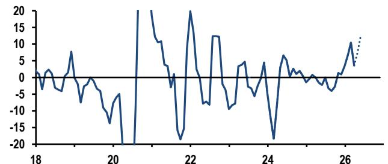

line

| x    | y     |
| ---- | ----- |
| 18   | 0     |
| 19   | 5     |
| 20   | -15   |
| 21   | 20    |
| 22   | -20   |
| 23   | 10    |
| 24   | -20   |
| 25   | 5     |
| 26   | 10    |

Source: METI, JPM

As in prior months, the April details show a divergence between tech-related strength and softness elsewhere. Electronics output rose 1.6% m/m sa and tech-related machinery output rose 3.5%. On the flip side, auto output fell 2.4%m/m sa, and the chemical and petroleum/oil products industries—where supply conditions appear to be more affected by energy-related disruptions—extended their declines for a third consecutive month (-2.8% and -3.4% in April, respectively).

Figure 2: Inventories and inventory to shipment ratio   
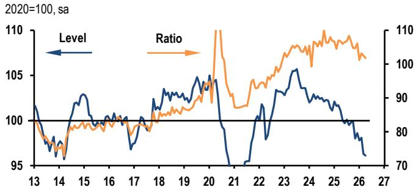

line

| Year | Level | Ratio |
|------|-------|-------|
| 13   | 102   | 85    |
| 14   | 96    | 80    |
| 15   | 103   | 88    |
| 16   | 100   | 90    |
| 17   | 98    | 92    |
| 18   | 102   | 95    |
| 19   | 104   | 98    |
| 20   | 105   | 105   |
| 21   | 95    | 90    |
| 22   | 102   | 95    |
| 23   | 105   | 100   |
| 24   | 103   | 105   |
| 25   | 100   | 108   |
| 26   | 96    | 106   |
| 27   | 95    | 105   |

Source: METI, JPM

Against this backdrop, inventories continued to be drawn down. Total inventories fell 0.2%m/m sa after a 1.8% decline in March, bringing levels close to pandemic-era lows (Figure 2). While auto inventories rebounded sharply, inventories in chemicals and plastics continued to contract. Alongside resilient shipments, this may suggest that firms may be meeting demand by running down inventories, potentially because production is constrained. Overall, the data imply activity is holding up on the back of resilient demand, but the inventory drawdown also reduces the buffer against further supply constraints.

# Wider subsidy rollout lowers Tokyo CPI

May Tokyo CPI came in weaker than expected. The official core (ex. fresh food) index rose 0.2%m/m sa to 1.3%oya (consensus and JPM: 1.5%) (Figure 3). The main drag was a further expansion of policy-driven price reductions. In addition to the broadened free childcare measures and free school lunch programs that have been weighing on inflation since spring, water charges became free from May. While free water charges are not a nationwide measure, in Tokyo water bills will be waived for four months starting in May. This is estimated to have lowered May's official core (ex. fresh food) inflation by around 0.2%-pt. Combined with the roughly 0.5%-pt drag from childcare, the total policy impact is to lower inflation by at least about 0.7%-pt. Excluding these policy effects, the underlying inflation trend remains consistent with the BoJ's policy target.

Figure 3: Tokyo core CPI   
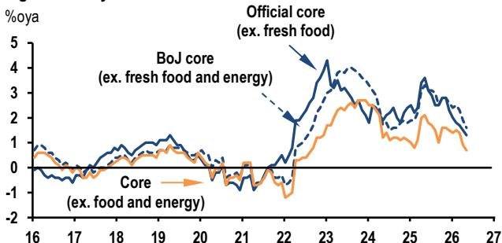

line

| Year | BoJ core (ex. fresh food and energy) | Official core (ex. fresh food) | Core (ex. food and energy) |
|------|----------------------------------------|----------------------------------|----------------------------|
| 16   | ~0.5                                   | ~0.5                             | ~0.5                       |
| 17   | ~0.0                                   | ~0.0                             | ~0.0                       |
| 18   | ~0.5                                   | ~0.5                             | ~0.5                       |
| 19   | ~1.0                                   | ~1.0                             | ~1.0                       |
| 20   | ~0.5                                   | ~0.5                             | ~0.5                       |
| 21   | ~-0.5                                  | ~-0.5                            | ~-0.5                      |
| 22   | ~-1.0                                  | ~-1.0                            | ~-1.0                      |
| 23   | ~4.0                                   | ~4.0                             | ~2.5                       |
| 24   | ~2.5                                   | ~2.5                             | ~2.0                       |
| 25   | ~3.5                                   | ~3.5                             | ~1.5                       |
| 26   | ~2.0                                   | ~2.0                             | ~1.0                       |
| 27   | ~1.0                                   | ~1.0                             | ~0.5                       |

Source: Statistics Bureau, JPM   
%oya, ex. the impact of consumption tax hike

Figure 4: Tokyo CPI, public transportation

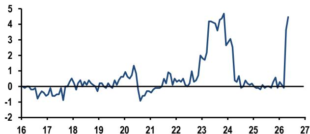

line

| Year | Value |
| ---- | ----- |
| 16   | 0.0   |
| 17   | -0.5  |
| 18   | 0.2   |
| 19   | 0.1   |
| 20   | 0.8   |
| 21   | -0.3  |
| 22   | 0.5   |
| 23   | 2.0   |
| 24   | 4.5   |
| 25   | 0.1   |
| 26   | 0.3   |
| 27   | 4.8   |

Source: Statistic Bureau, JPM

Underlying inflation remains firm. As of May, there are no clear signs of rising producer inflation caused by higher crude prices broadening into consumer prices. By contrast, inflation driven by accumulated cost increases—including wages—remains widespread. This is evident in categories such as communications (6.9% oya), public transportation (4.5%), and recreation services (2.4% oya) (Figure 4). Meanwhile, medical care posted a slight decline in May (-0.1% oya), marking the third consecutive month of marginally negative inflation. This largely reflects reductions in administered drug prices since the spring, ahead of the scheduled 2.8% increase in medical service fees in June. The government has been cutting medical costs, including drug prices, for more than a decade, but last year it finally decided on a positive revision at the highest level since 1996. Reflecting this, medical care inflation is likely to pick up again from next month onward.

Looking ahead, policy-driven disinflationary effects are likely to persist for the time being, but there are growing signs that price pressures for other goods and services are building. While the activity data do not send a clear signal of a sharp slowdown, producers are facing significant cost pressures. We expect this to begin feeding through to consumer prices gradually over the summer, pushing up inflation (excluding policy effects) to a level above the BoJ's target.

# April sales firm, and confidence picks up

April retail sales rose 1.3%m/m sa, beating our expectations of a 0.4% increase. Part of the surprise reflected stronger-than-expected durable goods spending, likely supported by government policies. Still, today's report suggested that household spending has remained resilient despite weak consumer sentiment (Figure 5), with the three-month run rate up 2.8%3m/3m saar. The gap between sentiment and realized spending is not unusual in this cycle, and we believe that the near-term resilience in consumption is being underpinned by energy and other subsidies that have lowered headline inflation by more than 1%pt and helped preserve real purchasing power at the start of the quarter.

Figure 5: Retail sales and consumer sentiment   
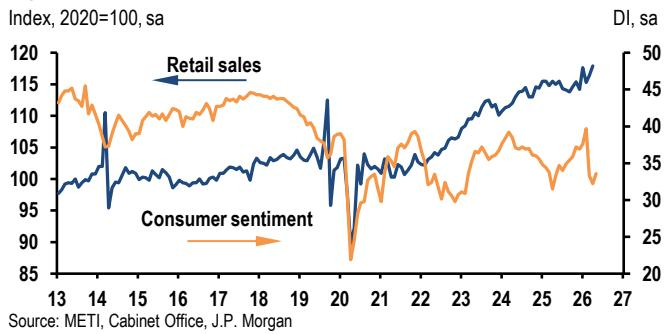

line

| Year | Retail sales | Consumer sentiment |
|------|--------------|--------------------|
| 13   | ~100         | ~45                |
| 14   | ~110         | ~40                |
| 15   | ~105         | ~35                |
| 16   | ~105         | ~35                |
| 17   | ~105         | ~35                |
| 18   | ~105         | ~35                |
| 19   | ~105         | ~35                |
| 20   | ~95          | ~25                |
| 21   | ~105         | ~35                |
| 22   | ~105         | ~35                |
| 23   | ~110         | ~35                |
| 24   | ~115         | ~35                |
| 25   | ~115         | ~35                |
| 26   | ~115         | ~35                |
| 27   | ~115         | ~35                |

Sentiment indicators started to recover in May. The Cabinet Office's May consumer confidence index rose 1.4 points to 33.6, returning to above the March level, though it remains well below pre-conflict readings amidst still-elevated inflation expectations. The share of households expecting inflation above $2\%$ edged down only $1.1\%$ pts to $85.8\%$ , still $14.4\%$ pts above February. Even so, the recovery in consumer sentiment possibly suggests that households are taking some reassurance from policy measures that limit the pass-through of energy costs.

# Data releases and forecasts

# Week of June 1 - 5

<table><tr><td>Mon</td><td colspan="5">MoF corporate survey</td></tr><tr><td>Jun 1</td><td colspan="5">%q/q saar, unless noted, nonfinancial firms</td></tr><tr><td>8:50am</td><td></td><td>2Q25</td><td>3Q25</td><td>4Q25</td><td>1Q26</td></tr><tr><td></td><td>Sales</td><td>-4.6</td><td>-0.3</td><td>2.6</td><td></td></tr><tr><td></td><td>Current profits</td><td>6.9</td><td>16.3</td><td>6.5</td><td></td></tr><tr><td></td><td>Capex ex. software</td><td>-0.7</td><td>0.0</td><td>16.9</td><td></td></tr><tr><td></td><td>Capex ex. software(%oya)</td><td>5.2</td><td>2.9</td><td>7.3</td><td>5.5</td></tr></table>

We expect capital expenditures excluding software in the MoF corporate survey, which is a major input to the second estimate of GDP, to rise 5.5% oya in 1Q26. While the first estimate of 1Q26 real GDP showed stable growth in capex, high-frequency data suggested jumps in machinery orders.

<table><tr><td>Fri</td><td colspan="5">Employers&#x27; survey – preliminary</td></tr><tr><td>Jun 5</td><td>%oya</td><td></td><td></td><td></td><td></td></tr><tr><td>8:30am</td><td></td><td>Jan</td><td>Feb</td><td>Mar</td><td>Apr</td></tr><tr><td></td><td>Monthly wages per employee</td><td>2.5</td><td>3.4</td><td>3.1</td><td>2.7</td></tr><tr><td></td><td>Scheduled payments</td><td>3.0</td><td>3.4</td><td>3.4</td><td></td></tr><tr><td></td><td>Full-timers monthly</td><td>3.4</td><td>3.8</td><td>3.9</td><td></td></tr><tr><td></td><td>Part-timers hourly</td><td>3.7</td><td>4.2</td><td>4.3</td><td></td></tr><tr><td></td><td>Overtime payments</td><td>3.2</td><td>3.0</td><td>3.1</td><td></td></tr><tr><td></td><td>Special payments</td><td>-8.6</td><td>7.5</td><td>-0.7</td><td></td></tr><tr><td></td><td>Real wages (total)</td><td>1.0</td><td>2.1</td><td>1.6</td><td></td></tr><tr><td></td><td colspan="5">*Real wages deflated by headline CPI</td></tr></table>

We expect the Employers' Survey to continue to indicate a solid increase in scheduled payments growth in April.

Review of the past week's data 

<table><tr><td colspan="6">Services producer prices (May 27)</td></tr><tr><td></td><td>Feb</td><td></td><td>Mar</td><td></td><td>Apr</td></tr><tr><td>%oya</td><td>2.7</td><td></td><td>3.1</td><td>3.3</td><td>3.0</td></tr><tr><td>Ex. international transportation</td><td>2.7</td><td>2.8</td><td>2.8</td><td>2.9</td><td>2.5</td></tr></table>

The BoJ's Services Producer Price Index rose 0.5%m/m and 3.0%oya in April. Services PPI inflation has picked up since March, with both the March and April readings at 3%oya or

higher for the first time since last September. The rise was driven mainly by transportation services amid higher energy costs: transportation prices increased 5.1% oya, a much stronger gain than in 2022–23. While international transportation—typically sensitive to overseas demand and currency moves—surged and pushed up the overall transportation index, domestic transportation also strengthened, including road freight transportation (+3.5% oya). Combined with the strong increase in April goods PPI, higher transportation costs are likely to feed into consumer prices with a lag of a few months.

Excluding international transportation, services PPI inflation eased to 2.5% oya, but this still implies persistent inflation pressure. Prices for labor-cost-sensitive services rose 2.5% oya (down 0.4% pt from March) but increased 1.2% m/m, pointing to continued underlying momentum. Firm wage growth this year should keep these service prices elevated. Leasing prices also jumped 5.3% oya in April, the strongest increase in the past decade.

Tokyo consumer prices (May 29) 

<table><tr><td colspan="5">2020-based</td></tr><tr><td></td><td>Mar</td><td>Apr</td><td colspan="2">May</td></tr><tr><td colspan="5">%oya</td></tr><tr><td>Overall</td><td>1.4</td><td>1.5</td><td> $\underline{1.5}$ </td><td>1.4</td></tr><tr><td>Core (ex fresh food)</td><td>1.7</td><td>1.5</td><td> $\underline{1.5}$ </td><td>1.3</td></tr><tr><td>Ex fresh food and energy</td><td>2.3</td><td>1.9</td><td> $\underline{2.0}$ </td><td>1.6</td></tr><tr><td>Ex food and energy</td><td>1.4</td><td>0.9</td><td> $\underline{1.0}$ </td><td>0.7</td></tr><tr><td colspan="5">%m/m, sa</td></tr><tr><td>Overall</td><td>0.1</td><td> $\underline{0.5}$ </td><td>0.4</td><td> $\underline{0.2}$ </td></tr><tr><td>Core (ex fresh food)</td><td>0.3</td><td>0.1</td><td> $\underline{0.2}$ </td><td></td></tr><tr><td>Ex fresh food and energy</td><td>0.2</td><td>-0.1</td><td> $\underline{0.3}$ </td><td>0.1</td></tr><tr><td>Ex food and energy</td><td>0.2</td><td>0.0</td><td> $\underline{0.2}$ </td><td>0.0</td></tr></table>

See main essay. 

<table><tr><td colspan="5">Labor force survey (May 29)</td></tr><tr><td>Sa</td><td></td><td></td><td></td><td></td></tr><tr><td></td><td>Feb</td><td>Mar</td><td>Apr</td><td></td></tr><tr><td>Unemployment rate (% sa)</td><td>2.6</td><td>2.7</td><td>2.7</td><td>2.5</td></tr><tr><td>Job offers ratio (% sa)</td><td>1.19</td><td>1.18</td><td>1.19</td><td>1.18</td></tr></table>

Industrial production – preliminary (May 29) 

<table><tr><td colspan="5">%m/m, sa</td></tr><tr><td></td><td>Feb</td><td>Mar</td><td>Apr</td><td></td></tr><tr><td>Production</td><td>-2.0</td><td>-0.4</td><td>0.5</td><td>0.8</td></tr><tr><td>Shipments</td><td>-1.5</td><td>-0.9</td><td>—</td><td>1.5</td></tr><tr><td>Inventories</td><td>0.3</td><td>-1.8</td><td>—</td><td>-0.2</td></tr><tr><td>Inventory/shipments ratio</td><td>2.0</td><td>-0.7</td><td>—</td><td>-0.7</td></tr></table>

See main essay.

Commercial sales (May 29)   
%m/m, sa 

<table><tr><td></td><td>Feb</td><td>Mar</td><td>Apr</td><td></td></tr><tr><td>Total retail sales</td><td>-2.0</td><td>1.0</td><td> $\underline{0.4}$ </td><td>1.3</td></tr><tr><td>%oya</td><td>-0.1</td><td>1.4</td><td> $\underline{1.2}$ </td><td>2.1</td></tr></table>

Motor vehicle sales surged 9.7%m/m sa, possibly reflecting increased subsidies for clean energy vehicles and the reduction in motor vehicle taxes that began in April. Home appliance sales rose 2.5% m/m sa. Industry data suggested strong air conditioner sales, which were potentially due to elevated replacement demand ahead of next year's regulatory changes. Non-durable goods were more mixed: apparel sales increased 2.5%, but higher energy prices may have weighed on food (down 0.5%) and fuel (down 4.2%), even as energy subsidies cushioned some of the direct impact on households.

Housing starts (May 29) 

<table><tr><td></td><td>Feb</td><td>Mar</td><td>Apr</td><td></td></tr><tr><td>Housing units %oya</td><td>-4.9</td><td>-29.3</td><td>13.8</td><td>11.4</td></tr><tr><td>%m/m, sa</td><td>-0.6</td><td>-1.9</td><td>1.0</td><td>-1.7</td></tr><tr><td>Mn units, saar</td><td>0.75</td><td>0.74</td><td></td><td>0.72</td></tr><tr><td>Floor space, 6mma (%m/m, sa)</td><td>0.8</td><td>0.8</td><td></td><td>-1.7</td></tr></table>

Housing starts posted a fourth consecutive monthly decline. In addition to trend weakness in housing demand, supply-side pressures are weighing on the construction industry. Input costs continue to rise, driven by yen depreciation and higher labor costs. Industry data also indicate that inventories of certain oil-derived products have fallen since March, potentially pointing to emerging supply constraints.

Consumer sentiment (May 29)   
DI, sa 

<table><tr><td></td><td>Mar</td><td>Apr</td><td>May</td><td></td></tr><tr><td>Consumer sentiment</td><td>33.3</td><td>32.2</td><td>32.6</td><td>33.6</td></tr><tr><td>Standard of living</td><td>29.7</td><td>28.2</td><td>—</td><td>31.2</td></tr><tr><td>Income growth</td><td>39.8</td><td>39.8</td><td>—</td><td>40.3</td></tr><tr><td>Labor market conditions</td><td>37.6</td><td>37.4</td><td>—</td><td>38.3</td></tr><tr><td>Durables purchases</td><td>26.0</td><td>23.2</td><td>—</td><td>24.4</td></tr><tr><td colspan="5">% of respondents, &quot;Rise&quot; minus &quot;fall&quot;</td></tr><tr><td colspan="5">Inflation expectations in next 12 months</td></tr><tr><td>Nsa</td><td>89.0</td><td>91.3</td><td>—</td><td>91.6</td></tr><tr><td>Sa</td><td>90.7</td><td>90.1</td><td>—</td><td>91.5</td></tr></table>

1. The DI asks whether a respondent thinks that now is a good time to purchase durables

Recovery in the standard-of-living DI is consistent with energy price caps supporting perceptions of real purchasing power. The willingness-to-buy-durables index also improved, although it remains below levels seen over the past three years. Income conditions remain steady, pointing to sustained real income growth.

Sources for all data tables: ADA, BoJ, CAO, JCSA, JDSA, JFA, JLM, VMA, Markit, METI, MHLW, MILT, MoF, Reuters, Statistics Bureau, JPM forecasts.

# Australia and New Zealand

- Australian CPI lands at 4.2% oya in April, well below expectations   
- We forecast Australian GDP to increase 0.5%q/q in 1Q26   
- RBNZ delivered a hawkish hold; we now expect hikes from July

April's headline inflation data were softer than expected, increasing $0.4\% \mathrm{m / m}$ (JPM and consensus: $0.6\% \mathrm{m / m}$ ) which saw the annual rate slow four tenths to $4.2\%$ oya. Trimmed mean CPI printed at $3.4\%$ oya, one tenth firmer than the prior release (Figure 1). Combined with the recent upturn in the unemployment rate, the print supports our forecast for the RBA to remain sidelined through 2026. The inflation pick-up since mid-2025 has been concentrated in goods and energy, while core measures have continued to decelerate toward $3\%$ annualised pace. Goods pass-through from energy/supply shocks has so far been muted, and even on a conservative roll forward, 2Q is tracking softer than RBA forecasts of $1.5\% \mathrm{q / q}$ headline and $1.0\%$ oya trimmed mean.

Figure 1: Australian core and headline inflation   
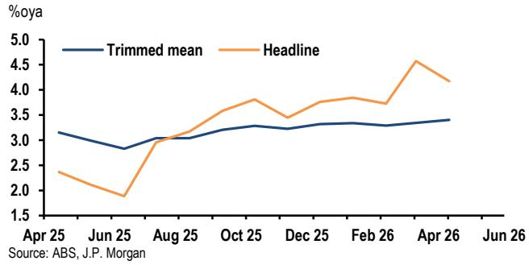

line

| Date   | Trimmed mean | Headline |
|--------|--------------|----------|
| Apr 25 | 3.1          | 2.4      |
| Jun 25 | 2.8          | 1.9      |
| Aug 25 | 3.0          | 3.2      |
| Oct 25 | 3.3          | 3.8      |
| Dec 25 | 3.2          | 3.5      |
| Feb 26 | 3.3          | 3.8      |
| Apr 26 | 3.4          | 4.6      |
| Jun 26 | 3.4          | 4.1      |

The details of the CPI print revealed fuel fell 7%m/m on the heels of the excise tax cut and lower spot energy prices, while softer than anticipated food and clothing price growth explained most of our forecast miss. The housing basket was mixed with new dwelling purchase costs moving higher, while residential rents flatlined and electricity/gas prices declined. Domestic holiday/accommodation inflation was surprisingly strong, which the ABS attributed to peak Easter/school holiday demand and which we expect to fade.

# GDP tracking firmer

This week's GDP tracking data point to solid activity momentum heading into the 1Q release. Construction work done surprised to the upside, rising $3.4\%$ q/q, as a surge in engineering and non-residential building activity more than offset a slowdown in residential construction. Private capex was also much stronger than anticipated $(+6.5\%$ q/q), led by plant and

equipment spending in the technology sector (Figure 2). That said, the tech sector's reliance on capital imports implies part of this strength will be offset by a sharp rise in real imports, resulting in a drag from net exports.

Figure 2: Australian technology sector capital expenditure   
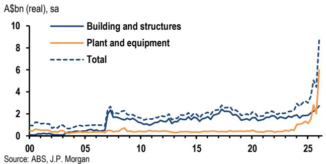

line

| Year | Building and structures | Plant and equipment | Total |
|------|--------------------------|---------------------|-------|
| 00   | 0.5                      | 0.3                 | 1.0   |
| 05   | 0.8                      | 0.4                 | 1.2   |
| 10   | 1.5                      | 0.6                 | 1.8   |
| 15   | 1.7                      | 0.7                 | 2.0   |
| 20   | 1.9                      | 0.8                 | 2.2   |
| 25   | 2.5                      | 1.0                 | 3.0   |
| 26   | 3.0                      | 1.5                 | 4.0   |
| 27   | 4.0                      | 2.0                 | 5.0   |
| 28   | 5.0                      | 2.5                 | 6.0   |
| 29   | 6.0                      | 3.0                 | 7.0   |
| 30   | 7.0                      | 3.5                 | 8.0   |
| 31   | 8.0                      | 4.0                 | 9.0   |
| 32   | 9.0                      | 4.5                 | 10.0  |
| 33   | 10.0                     | 5.0                 | 11.0  |
| 34   | 11.0                     | 5.5                 | 12.0  |
| 35   | 12.0                     | 6.0                 | 13.0  |
| 36   | 13.0                     | 6.5                 | 14.0  |
| 37   | 14.0                     | 7.0                 | 15.0  |
| 38   | 15.0                     | 7.5                 | 16.0  |
| 39   | 16.0                     | 8.0                 | 17.0  |
| 40   | 17.0                     | 8.5                 | 18.0  |
| 41   | 18.0                     | 9.0                 | 19.0  |
| 42   | 19.0                     | 9.5                 | 20.0  |
| 43   | 20.0                     | 10.0                | 21.0  |
| 44   | 21.0                     | 10.5                | 22.0  |
| 45   | 22.0                     | 11.0                | 23.0  |
| 46   | 23.0                     | 11.5                | 24.0  |
| 47   | 24.0                     | 12.0                | 25.0  |
| 48   | 25.0                     | 12.5                | 26.0  |
| 49   | 26.0                     | 13.0                | 27.0  |
| 50   | 27.0                     | 13.5                | 28.0  |
| 51   | 28.0                     | 14.0                | 29.0  |
| 52   | 29.0                     | 14.5                | 30.0  |
| 53   | 30.0                     | 15.0                | 31.0  |
| 54   | 31.0                     | 15.5                | 32.0  |
| 55   | 32.0                     | 16.0                | 33.0  |
| 56   | 33.0                     | 16.5                | 34.0  |
| 57   | 34.0                     | 17.0                | 35.0  |
| 58   | 35.0                     | 17.5                | 36.0  |
| 59   | 36.0                     | 18.0                | 37.0  |
| 60   | 37.0                     | 18.5                | 38.0  |
| 61   | 38.0                     | 19.0                | 39.0  |
| 62   | 39.0                     | 19.5                | 40.0  |
| 63   | 40.0                     | 20.0                | 41.0  |
| 64   | 41.0                     | 20.5                | 42.0  |
| 65   | 42.0                     | 21.0                | 43.0  |
| 66   | 43.0                     | 21.5                | 44.0  |
| 67   | 44.0                     | 22.0                | 45.0  |
| 68   | 45.0                     | 22.5                | 46.0  |
| 69   | 46.0                     | 23.0                | 47.0  |
| 70   | 47.0                     | 23.5                | 48.0  |
| ... (approx) - '26' to '27' (approx) - '28' to '29' to '36' (approx) - '37' to '38' (approx) - '39' to '46' (approx) - '47' to '48' (approx) - '49' to '56' (approx) - '56' to '67' (approx) - '68' to '79' (approx) - '79' to '89' (approx) - '9' to '16' (approx) - '9' to '17' (approx) - '18' to '19' (approx) - '19' to '26' (approx) - '26' to '36' (approx) - '37' to '46' (approx) - '38' to '47' (approx) - '48' to '58' (approx) - '49' to '67' (approx) - '68' to '79' (approx) - '79' to '89' (approx) - '9' to '16' (approx) - '9' to '17' (approx) - '18' to '26' (approx) - '19' to '36' (approx) - '26' to '46' (approx) - '37' to '47' (approx) - '38' to '58' (approx) - '49' to '67' (approx) - '59' to '79' (approx) - '68' to '89' (approx) - '79' to '99' (approx) - '9' to '16' (approx) - '9' to '17' (approx) - '18' to '26' (approx) - '19' to '36' (approx) - '26' to '46' (approx) - '27' to '47' (approx) - '28' to '58' (approx) - '29' to '67' (approx) - '3<ecel><ecel><ecel><nl>

The monthly household spending indicator suggests consumption held up reasonably well in 1Q. Together with a shift in spending from the public to private sector following the expiry of the electricity subsidy, this should see quarterly real spending growth accelerate in the March quarter. In aggregate, the data suggest 1Q GDP growth at $0.5\% \mathrm{q} / \mathrm{q}$ , a $0.2 - \%$ pt uplift from our initial tracking estimate, owing to the upside surprises in this week's data.

# RBNZ: holding on

In a split decision, the RBNZ held the OCR at 2.25% at its May meeting with a hawkish turn in communications. Internal members (Governor Breman, Silk, Conway) voted to hold, while external members (Hansen, Gai, Gourley) voted to hike; the Governor's casting vote broke the tie. All members agreed that the OCR needs to rise over time, with the disagreement centered on urgency. Externals emphasized the risk that first-round indirect price increases broaden into second-round dynamics, while internals placed greater weight on low core inflation, anchored expectations, and weak domestic demand containing spillovers. The split and the accompanying tone represent a materially hawkish shift versus recent guidance that had emphasized gradualism.

We now expect a 25bp hike in July (previously September) and retain our forecast of 100bp of total tightening through early 2027 (Figure 3). Forward guidance explicitly stated the OCR will "most likely need to increase sooner and by more than envisaged" in the February MPS, reinforced by an OCR track that is 40bp higher by 4Q26 and plateaus around $3.1\%$ in mid-2027.

Figure 3: RBNZ cash rate forecasts   
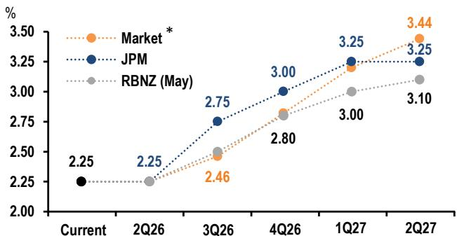

line

| Period   | Market* | JPM  | RBNZ (May) |
| -------- | ------- | ---- | ---------- |
| Current  |         |      | 2.25       |
| 2Q26     |         |      | 2.25       |
| 3Q26     | 2.46    | 2.75 |            |
| 4Q26     |         | 3.00 | 2.80       |
| 1Q27     |         | 3.25 | 3.00       |
| 2Q27     | 3.44    | 3.25 | 3.10       |

Source: RBNZ, Bloomberg Finance L.P., JPM \*Market pricing as of May 27th

The Bank revised up its inflation profile, with headline CPI now expected to peak at 4.3% in 3Q (+1.8%-pts vs prior), attributed almost exclusively to energy prices while keeping core broadly consistent with target. GDP forecasts were pushed lower in 1H26 but revised higher in 2H27 despite a higher forecast for the real cash rate and unemployment still above 5%.

# Australia

# Data releases and forecasts

Week of June 1 - 5 

<table><tr><td>Tue</td><td colspan="5">ANZ job advertisement</td></tr><tr><td>May 19</td><td></td><td>Feb</td><td>Mar</td><td>Apr</td><td>May</td></tr><tr><td>10:30am</td><td>%m/m, sa</td><td>3.1</td><td>-3.2</td><td>-0.8</td><td></td></tr><tr><td>Mon</td><td colspan="5">Building approvals</td></tr><tr><td>May 18</td><td></td><td>Jan</td><td>Feb</td><td>Mar</td><td>Apr</td></tr><tr><td>8:30am</td><td>%m/m, sa</td><td>-6.9</td><td>30.1</td><td>-10.5</td><td>-3.0</td></tr></table>

Residential building approvals have picked up over 2H25, though the path has been choppy with lumpy high density approvals driving the uplift. We expect approvals growth will ease through the year as housing market activity slows, with auction clearance rates, sales volumes and prices already turning sharply lower. For April, we expect some further pay-back in the high density segment following a +90%m/m move in February, while detached approvals should fare somewhat better.

<table><tr><td>Wed</td><td colspan="5">Company gross operating profits</td></tr><tr><td>May 13</td><td></td><td>2Q25</td><td>3Q25</td><td>4Q25</td><td>1Q26</td></tr><tr><td>11:30am</td><td>%q/q, sa</td><td>-3.7</td><td>1.5</td><td>5.8</td><td></td></tr><tr><td>Thu</td><td colspan="5">Current account</td></tr><tr><td>May 14</td><td></td><td>2Q25</td><td>3Q25</td><td>4Q25</td><td>1Q26</td></tr><tr><td>11:00am</td><td>A$bn, sa</td><td>-17.2</td><td>-18.3</td><td>-21.1</td><td>-23.0</td></tr></table>

# Global Economic Research

29 May 2026

<table><tr><td>Fri</td><td colspan="5">Gross domestic product</td></tr><tr><td>May 15</td><td></td><td>2Q25</td><td>3Q25</td><td>4Q25</td><td>1Q26</td></tr><tr><td>8:30am</td><td>%q/q, sa</td><td>0.8</td><td>0.5</td><td>0.8</td><td> $\underline{0.5}$ </td></tr><tr><td>Fri</td><td colspan="5">Goods trade balance</td></tr><tr><td>May 15</td><td></td><td>Jan</td><td>Feb</td><td>Mar</td><td>Apr</td></tr><tr><td>8:30am</td><td>A$bn</td><td>2.1</td><td>5.0</td><td>-1.8</td><td> $\underline{3.0}$ </td></tr></table>

Review of past week's data 

<table><tr><td colspan="5">Headline CPI</td></tr><tr><td></td><td>Feb</td><td>Mar</td><td>Apr</td><td></td></tr><tr><td>%oya</td><td>3.7</td><td>4.6</td><td> $\underline{4.5}$ </td><td>4.2</td></tr><tr><td>%m/m</td><td>0.0</td><td>1.1</td><td> $\underline{0.6}$ </td><td>0.4</td></tr></table>

See main text.

<table><tr><td colspan="5">Trimmed mean CPI</td></tr><tr><td></td><td>Feb</td><td>Mar</td><td>Apr</td><td></td></tr><tr><td>%oya</td><td>3.3</td><td>3.3</td><td></td><td>3.4</td></tr><tr><td>%m/m</td><td>0.3</td><td>0.2</td><td></td><td>0.3</td></tr><tr><td colspan="5">Construction work done</td></tr><tr><td></td><td>3Q25</td><td>4Q25</td><td>1Q26</td><td></td></tr><tr><td>%oya</td><td>0.10</td><td>-0.10</td><td> $\underline{2.0}$ </td><td>3.6</td></tr><tr><td colspan="5">Household spending</td></tr><tr><td></td><td>Feb</td><td>Mar</td><td>Apr</td><td></td></tr><tr><td>%m/m, sa</td><td>0.3</td><td>1.6</td><td> $\underline{-0.5}$ </td><td>-1.1</td></tr><tr><td colspan="5">Private sector credit</td></tr><tr><td></td><td>Feb</td><td>Mar</td><td>Apr</td><td></td></tr><tr><td>%m/m, sa</td><td>0.6</td><td>0.7</td><td> $\underline{0.5}$ </td><td></td></tr></table>

# New Zealand

# Data releases and forecasts

Week of June 1 - 5

No data releases of note.

Review of past week's data 

<table><tr><td colspan="4">RBNZ official cash rate</td></tr><tr><td></td><td>Feb</td><td>Apr</td><td>May</td></tr><tr><td>%</td><td>2.25</td><td>2.25</td><td>2.25</td></tr></table>

See main text.

Sources: ABS, Stats NZ, RBA, RBNZ, JPM

# Greater China

- China: Fiscal spending pullback mirrors fixed asset investment drop   
• Strong but uneven industrial profit growth   
• Taiwan: Tech IP resilient while retail sales gained   
• Hong Kong: Solid export gains led by Asia   
- Next week: China PMIs; Hong Kong retail sales and PMI; Taiwan PMI and CPI

The Middle East–driven energy shock visibly weighed on China’s domestic production and demand in April, testing the ‘resilience’ narrative. We think this is partly due to greater-than-expected policy patience (vs subsidy rollouts in regional peers) and some scaling back of fiscal support. Alternative data suggest processed crude output may have contracted further in May even as coke-oven operations rose, likely indicating oil-to-coal switching that could partly offset the drag. Port trackers show slower outbound container and bulk dead-weight tonnage on the month, pointing to a likely partial cooling after April’s rebound. For next week’s May PMIs, we expect a modest dip to 50.1 for NBS manufacturing and 51.0 for RatingDog.

# Fiscal spending pulled back

April fiscal data helped explain the surprise Fixed Asset Investment (FAI) contraction in April. General budget expenditure turned negative at -3.2% oya, led by an -18.6% oya drop in infrastructure spending, consistent with the broader investment pullback (Figure 1). Livelihood spending also cooled. Outside the general budget, government-managed fund accounts saw land-sale revenue down sharply and overall revenue/expenditure contracting, highlighting continued housing/land-related pressures on local-government finances. Fiscal deposits jumped more than typical seasonality would explain, suggesting slower fiscal deployment. Revenue growth remained relatively solid at 6.7% oya in April, still driven by tax receipts.

Figure 1: China fiscal expenditure vs. FAI   
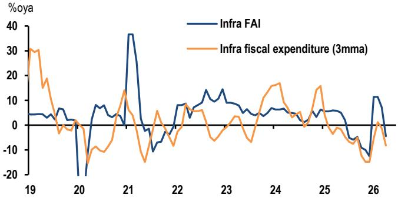

line

| Year | Infra FAI | Infra fiscal expenditure (3mma) |
|------|-----------|---------------------------------|
| 19   | ~5        | ~30                             |
| 20   | ~-20      | ~-10                            |
| 21   | ~35       | ~15                             |
| 22   | ~5        | ~5                              |
| 23   | ~10       | ~5                              |
| 24   | ~5        | ~15                             |
| 25   | ~5        | ~10                             |
| 26   | ~-10      | ~-15                            |

Source: MOF, JPM

The latest fiscal figures point to greater policy patience following strong 1Q GDP growth, contrary to our expectation that fiscal spending and public projects would be notably front-loaded early in the 15th Five Year Plan (FYP). While central government bond issuance has picked up, local issuance – especially special LGBs – slowed sharply in April and May. Prima facie, less front loading also implies that fiscal policy will be less of a drag in 2H. Meanwhile, the investment pullback may reflect: i) a thinner pipeline of eligible projects, ii) prioritizing debt repayments, and iii) the slow rollout of policy-bank tools. As approvals accelerate – alongside faster government bond issuance and quicker deployment of proceeds – investment could rebound from April’s sharp contraction.

# Industrial profits reveal K-shaped growth

Headline industrial profits accelerated to 24.7% oya in April, lifting YTD profit growth to 18.2% oya in Jan-Apr, well above the same period last year (Figure 2). Sector performance showed further divergence. Profits in policy tailwind sectors, including equipment and high tech manufacturing, continued to grow at a decent pace. Imported PPI inflation from higher global commodity prices lifted profits in upstream raw material sectors (+88.1% oya). Demand from new energy and AI also boosted non-ferrous metal profits (+117.8%). In contrast, consumer product profits remained in contraction amid ongoing demand weakness, including furniture, autos and clothing.

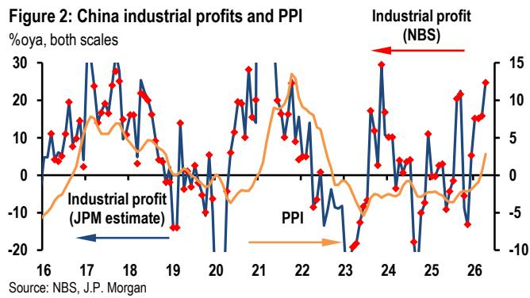

line

| Year | Industrial profit (JPM estimate) | PPI |
|------|----------------------------------|-----|
| 16   | ~5                               | ~-5 |
| 17   | ~30                              | ~10 |
| 18   | ~25                              | ~5  |
| 19   | ~-15                             | ~-5 |
| 20   | ~-20                             | ~-5 |
| 21   | ~30                              | ~10 |
| 22   | ~25                              | ~5  |
| 23   | ~-20                             | ~-5 |
| 24   | ~30                              | ~10 |
| 25   | ~-15                             | ~-5 |
| 26   | ~25                              | ~5  |

Looking ahead, we remain cautious about the scope for a sustained, broad-based profit rebound. Domestic demand remains weak, with consumer goods PPI still in deflation. Soft retail spending suggests downstream sectors may have limited ability to pass higher input costs on to consumers, creating pressure on profit margins.

# Taiwan: IP resilient, retail sales jumped

Taiwan's industrial production rose $0.2\%$ m/m sa (14.2% oya) in April, as the tech sector continued to outperform (Figure 3). Tech IP remained resilient (+1.0%m/m sa), supported by gains in electronic parts and components (+3.0%), while AI server output was broadly flat (+0.1%). Non-tech output was weighed down mainly by petroleum/coal/chemicals, likely reflecting oil supply and feedstock disruptions. This drag was partly offset by firmer machinery and equipment activity tied to AI-related capacity expansion, alongside modest gains in base metals and motor vehicles. Retail sales recovered in April after a weak March, indicating firmer consumption momentum, helped by equity market wealth effects and a gradual improvement in non-tech wage growth. Consumer confidence also edged higher.

Figure 3: Taiwan IP growth breakdown   
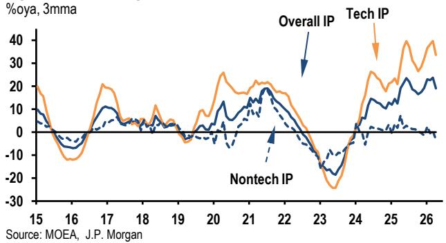

line

| Year | Overall IP | Tech IP | Nontech IP |
|------|------------|---------|------------|
| 15   | ~15        | ~15     | ~5         |
| 16   | ~-10       | ~-10    | ~-5        |
| 17   | ~20        | ~20     | ~10        |
| 18   | ~5         | ~5      | ~0         |
| 19   | ~0         | ~0      | ~0         |
| 20   | ~15        | ~15     | ~5         |
| 21   | ~20        | ~20     | ~10        |
| 22   | ~15        | ~15     | ~5         |
| 23   | ~-20       | ~-20    | ~-20       |
| 24   | ~-10       | ~-10    | ~-10       |
| 25   | ~30        | ~30     | ~5         |
| 26   | ~40        | ~40     | ~0         |

Debate around Taiwan's outlook centers on the duration of the AI upcycle and the impact from the energy shock. Recent US hyperscaler results suggest the AI capex cycle remains intact, with strong backlogs pointing to multi-year demand that should continue to support Taiwan's tech manufacturers. On energy, the Ministry of Economic Affairs reports June–July supplies are secured, with ample crude and gas inventories, while alternative Middle East routes and higher US imports are keeping shipments on track. Petrochemicals faced more pressure, but downstream spillovers appear manageable so far.

# Hong Kong: exports firmed, led by Asia

Headline exports rose for the eighth consecutive month, up 5.0%m/m sa, lifting the annual rate to 42.9%oya. Shipments to Asia (excluding China) showed strong momentum (+5.7%m/m sa), while exports to mainland China rose for the sixth consecutive month (+2.9%), reflecting Hong Kong's role as a re-export hub in the regional tech supply chain (Figure 4). Imports firmed further on a 2.6%m/m rise, with the annual growth reaching a multi-year high at 44.4%oya.

# Global Economic Research

29 May 2026

Hong Kong's 1Q GDP reached a five-year high driven by investment (esp. inventories), while net trade was a drag as imports outpaced exports. Looking ahead, net export contributions may remain volatile, but strong regional tech trade and resilient mainland China exports should provide some support. The Trump–Xi summit is an incremental positive by stabilizing trade ties, but uncertainty remains given the structurally competitive nature of the relationship. A prolonged or escalated conflict could weigh on HK trade through disruptions to major trade routes and a potential drag on the external demand of mainland China's exports.

Figure 4: Hong Kong export growth breakdown   
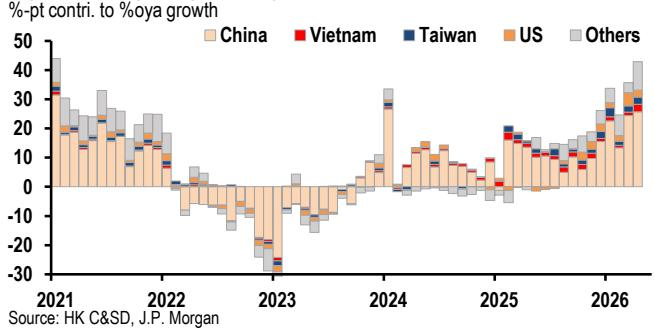

bar

| Year | China | Vietnam | Taiwan | US | Others |
|------|-------|---------|--------|----|--------|
| 2021 | 30    | 10      | 5      | 5  | 10     |
| 2022 | 10    | 5       | 5      | 5  | 5      |
| 2023 | -30   | -10     | -5     | -5 | -10    |
| 2024 | 30    | 10      | 5      | 5  | 10     |
| 2025 | 10    | 5       | 5      | 5  | 5      |
| 2026 | 40    | 10      | 5      | 5  | 10     |

# China

# Data releases and forecasts

Week of May 31- June 5

<table><tr><td>Sun</td><td colspan="5">Purchasing managers index</td></tr><tr><td>May 31</td><td>Index</td><td></td><td></td><td></td><td></td></tr><tr><td>9:30am</td><td></td><td>Feb</td><td>Mar</td><td>Apr</td><td>May</td></tr><tr><td></td><td>Overall (RatingDog)</td><td>52.1</td><td>50.8</td><td>52.2</td><td>51.0</td></tr><tr><td></td><td>Output</td><td>53.6</td><td>50.8</td><td>53.8</td><td></td></tr><tr><td></td><td>Overall (NBS)</td><td>49.0</td><td>50.4</td><td>50.3</td><td>50.1</td></tr><tr><td></td><td>Output</td><td>49.6</td><td>51.4</td><td>51.5</td><td></td></tr></table>

# Review of past week's data

Industrial profits (27 May)

<table><tr><td colspan="4">% change</td></tr><tr><td></td><td>Feb</td><td>Mar</td><td>Apr</td></tr><tr><td>%oya</td><td>15.2</td><td>15.8</td><td>24.7</td></tr><tr><td>%oya, ytd</td><td>15.2</td><td>15.5</td><td>18.2</td></tr></table>

# Hong Kong SAR

# Data releases and forecasts

Week of June 1-5 

<table><tr><td rowspan="4">TueJun 24:30pm</td><td colspan="5">Retail sales volume% change</td></tr><tr><td></td><td>Jan</td><td>Feb</td><td>Mar</td><td>Apr</td></tr><tr><td>%oya</td><td>3.5</td><td>17.5</td><td>9.8</td><td>9.4</td></tr><tr><td>%m/m sa</td><td>1.0</td><td>3.3</td><td>0.3</td><td>0.3</td></tr><tr><td rowspan="4">WedJun 38:30am</td><td colspan="5">S&amp;P Global Hong Kong PMIIndex, sa</td></tr><tr><td></td><td>Feb</td><td>Mar</td><td>Apr</td><td>May</td></tr><tr><td>Overall</td><td>53.3</td><td>49.3</td><td>48.6</td><td>50.3</td></tr><tr><td>Output</td><td>55.5</td><td>48.6</td><td>48.3</td><td></td></tr></table>

# Review of past week's data

Merchandise trade (28 May) 

<table><tr><td colspan="5">US$bn</td></tr><tr><td></td><td>Feb</td><td>Mar</td><td>Apr</td><td></td></tr><tr><td>Balance</td><td>-64.2</td><td>-89.1</td><td>-67.9</td><td>-29.5</td></tr><tr><td>Exports</td><td>408.8</td><td>618.4</td><td>567.0</td><td>620.9</td></tr><tr><td>%oya</td><td>24.7</td><td>35.8</td><td>30.5</td><td>42.9</td></tr><tr><td>Imports</td><td>472.9</td><td>707.5</td><td>634.9</td><td>650.4</td></tr><tr><td>%oya</td><td>29.9</td><td>41.2</td><td>40.9</td><td>44.4</td></tr></table>

# Taiwan

# Data releases and forecasts

Week of June 1-5 

<table><tr><td>Mon</td><td colspan="5">S&amp;P Global Taiwan PMI Mfg</td></tr><tr><td>Jun 1</td><td>Index, sa</td><td></td><td></td><td></td><td></td></tr><tr><td>8:30am</td><td></td><td>Feb</td><td>Mar</td><td>Apr</td><td>May</td></tr><tr><td></td><td>Overall</td><td>55.2</td><td>53.3</td><td>55.3</td><td>53.0</td></tr><tr><td></td><td>Output</td><td>55.5</td><td>52.8</td><td>54.8</td><td></td></tr><tr><td>Fri</td><td colspan="5">Consumer prices</td></tr><tr><td>Jun 5</td><td>% change</td><td></td><td></td><td></td><td></td></tr><tr><td>4:00pm</td><td></td><td>Feb</td><td>Mar</td><td>Apr</td><td>May</td></tr><tr><td></td><td>%oya</td><td>1.8</td><td>1.2</td><td>1.7</td><td>2.1</td></tr><tr><td></td><td>%m/m sa</td><td>0.5</td><td>-0.1</td><td>0.4</td><td>0.2</td></tr></table>

# Review of past week's data

Industrial production (26 May) 

<table><tr><td colspan="5">% change</td></tr><tr><td></td><td>Feb</td><td>Mar</td><td>Apr</td><td></td></tr><tr><td>%oya</td><td>16.6</td><td>26.1</td><td>16.6</td><td>14.2</td></tr><tr><td>%m/m sa</td><td>1.6</td><td>3.0</td><td>0.6</td><td>0.2</td></tr></table>

# Global Economic Research

# Greater China

29 May 2026

Real GDP (29 May) 

<table><tr><td>% change</td><td></td><td></td><td></td><td></td></tr><tr><td></td><td>25Q3</td><td>25Q4</td><td>26Q1</td><td></td></tr><tr><td>%oya</td><td>8.4</td><td>13.0</td><td>13.7</td><td>14.6</td></tr><tr><td>%q/q saar</td><td>6.7</td><td>28.7</td><td>11.9</td><td>6.9</td></tr></table>

Source: NBS, China Customs, Hong Kong Census and Statistics Department, Taiwan Ministry of Economic Affairs, DGBAS, MoF, JPM forecasts. The long-form nomenclature for references to China; Hong Kong; and Taiwan within this research material is Mainland China; Hong Kong SAR (China); and Taiwan (China).

# Korea

- Bank of Korea signals faster and stronger hiking cycle; we revise up the terminal rate to 3.5%   
- April IP pulls back less than expected, creating upside risks for 2Q growth

At this week's MPC meeting, the Bank of Korea kept its policy rate unchanged at $2.5\%$ , as was widely expected. However, the tone of the communication—including the dot plot, hawkish dissenting votes, and press conference—was significantly more hawkish than anticipated, signaling a faster and stronger rate hiking cycle ahead. The forward guidance now clearly points to a rate hike at the July MPC meeting, rather than the previously anticipated November meeting. We now expect the first hike in July followed by three more hikes later this year and next year, taking the policy rate to $3.5\%$ .

Meanwhile, despite a modest pullback in April IP, Korea's manufacturing sector continues to show resilience, with robust tech output and improving trends in defense-related manufacturing. While 2Q growth is expected to slow compared to 1Q, the benign nature of April IP's pullback and the ongoing momentum in key sectors suggest there is upside risk to our current 2Q GDP growth forecast.

# BoK signals faster, stronger hike cycle

The shift towards a more hawkish stance is rooted in the MPC's renewed optimism about Korea's growth prospects. The growth forecast was revised up to $2.6\%$ , reflecting expectations for a sustained upswing led by the tech sector, with spillover effects to domestic demand. This marks a departure from the April MPC meeting, which had emphasized downside risks from Middle East geopolitical tensions and adopted a wait-and-see approach. Now, demand-side inflation pressures are being considered more seriously, and the Governor's remarks indicate a clear direction across growth, inflation, and financial stability, allowing for greater consensus within the MPC. The communication suggests that the Committee is more concerned about inflation spillover from tech-led growth, and is prepared to act more decisively.

In light of these developments, we are revising our policy rate forecast through the end of 2027 from $3.0\%$ to $3.5\%$ . The dot plot and dissenting votes indicate that two hikes are likely this year, with further action possible if growth and inflation remain above potential and target next year. We also expect the timing of rate hikes to be brought forward, with a July hike now highly likely, followed by another one in October. Additional hikes are expected in January and April next year, each by 25bp, to reach $3.5\%$ at the April 2027 meeting. Overall, the BoK's more hawkish stance reflects a greater emphasis on the impact of growth on inflation, and we anticipate

further upward revisions to the growth outlook in the coming months.

# IP fell only modestly in April

In April, Korea's industrial production declined $0.7\%$ m/m sa, a milder pullback than anticipated following strong gains in the previous two months. The three-month trend growth rate rebounded to $18.2\%$ 3m/3m, saar, largely reflecting the low base in January. Tech manufacturing was a bright spot, with computer parts rising $13.8\%$ m/m sa and semiconductors up $3.1\%$ , resulting in a $2.5\%$ rebound in overall tech IP after a sharp drop in March. Although tech shipments fell $4.2\%$ in April, this was in line with typical early-quarter patterns, and both shipments and production are expected to increase in May and June. The three-month trend growth for tech products was a robust $71.1\%$ 3m/3m, saar, and this momentum is likely to persist through the remainder of the second quarter.

Figure 1: Petrochemical productions   
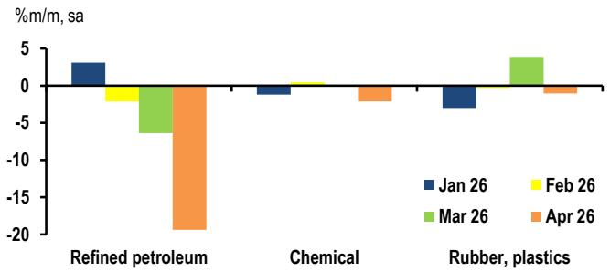

bar

| Category           | Jan 26 | Feb 26 | Mar 26 | Apr 26 |
| ------------------ | ------ | ------ | ------ | ------ |
| Refined petroleum  | 3      | -2     | -7     | -19    |
| Chemical           | -1     | 1      | -1     | -2     |
| Rubber, plastics   | -4     | -1     | 4      | -1     |

Source: NSO, and JPM

Non-tech production, by contrast, declined 2.0% m/m sa in April after a 3.6% gain in March, with auto production falling 10.0% and petroleum refining dropping 19.4% amid supply chain disruptions and new model launch cycles. Chemical products and rubber/plastics were less affected, helping overall IP to hold up (Figure 1). In the petro refinery sector, inventories declined by less than shipments, pushing the shipment-to-inventory ratio higher. Crude oil and naphtha imports fell sharply, while natural gas imports increased, but government guidance suggests that average import volumes for May–July should recover to over 80% of last year's levels. If this rebound materializes, the negative impact on refining and related industries should gradually ease, though some stress is expected to persist through May.

# Data releases and forecasts

# Week of June 1-5

Mon Customs trade

Jun 1 US\$ bn, nsa

9am

Feb Mar Apr May

<table><tr><td>Trade balance</td><td>15.7</td><td>26.8</td><td>23.8</td><td>23.0</td></tr><tr><td>Exports</td><td>67.6</td><td>87.2</td><td>85.9</td><td>86.0</td></tr><tr><td>Imports</td><td>51.9</td><td>60.4</td><td>62.1</td><td>63.0</td></tr></table>

High-frequency customs trade data show continued month-on-month growth in nominal terms, with the three-month trend growth rate still posting triple-digit figures – likely reflecting strong price effects.

Mon Purchasing Managers Index 

<table><tr><td colspan="5">Jun 1 Index, sa</td></tr><tr><td>9.30am</td><td>Feb</td><td>Mar</td><td>Apr</td><td>May</td></tr><tr><td>PMI - Manufacturing</td><td>51.1</td><td>52.6</td><td>53.6</td><td>53.5</td></tr></table>

Observed supply disruptions for manufacturers may have eased somewhat in May, in line with the May local survey results, while inventory trends are likely to be mixed – reflecting both ongoing procurement efforts and risk of depletion.

Tue Consumer prices 

<table><tr><td rowspan="3">Jun 28am</td><td>% change</td><td>Feb</td><td>Mar</td><td>Apr</td><td>May</td></tr><tr><td>%oya</td><td>2.0</td><td>2.2</td><td>2.6</td><td>3.0</td></tr><tr><td>%m/m, nsa</td><td>0.3</td><td>0.3</td><td>0.5</td><td>0.3</td></tr></table>

Although energy import prices partially retreated last month, inflation risks are building on both the energy and non-energy sides, as indicated by producer price trends through April.

Fri Current account 

<table><tr><td>Jun 5</td><td>US$ bn, nsa</td><td></td><td></td><td></td><td></td></tr><tr><td>8am</td><td></td><td>Jan</td><td>Feb</td><td>Mar</td><td>Apr</td></tr><tr><td></td><td>Balance</td><td>13.3</td><td>23.2</td><td>37.3</td><td>29.0</td></tr></table>

While the headline balance may pause in April due to the seasonality of dividend payments, the goods balance is likely to remain the main driver of the CA surplus, supported by ongoing tech momentum.

# Review of past week's data

FKI business survey (May 27) 

<table><tr><td colspan="5">100=neutral reading, sa</td></tr><tr><td></td><td>Mar</td><td>Apr</td><td>May</td><td></td></tr><tr><td>One-month outlook</td><td>85.1</td><td>89.4</td><td>95.0</td><td>97.0</td></tr><tr><td>Current conditions</td><td>90.4</td><td>85.4</td><td>90.0</td><td>96.1</td></tr></table>

BoK MPC meeting (May 28)

%pa

# Global Economic Research

# Korea

29 May 2026

<table><tr><td></td><td>Feb</td><td>Apr</td><td>May</td></tr><tr><td>Base rate</td><td>2.50</td><td>2.50</td><td>2.50</td></tr></table>

See main text.

Industrial production (May 29) 

<table><tr><td colspan="6">% change</td></tr><tr><td></td><td>Feb</td><td colspan="2">Mar</td><td colspan="2">Apr</td></tr><tr><td>%oya</td><td>-2.3</td><td>3.6</td><td>3.9</td><td>0.0</td><td>1.5</td></tr><tr><td>%m/m, sa</td><td>5.4</td><td>5.2</td><td>0.3</td><td>0.6</td><td>-2.0</td></tr></table>

See main text.

Shipments and inventories 

<table><tr><td>%oya</td><td colspan="2">Feb</td><td colspan="2">Mar</td><td colspan="2">Apr</td></tr><tr><td>Shipments</td><td>-4.4</td><td></td><td>3.0</td><td>3.1</td><td>1.4</td><td>-1.3</td></tr><tr><td>Inventories</td><td>1.6</td><td>1.7</td><td>-1.3</td><td>-1.5</td><td>-1.2</td><td>-0.4</td></tr></table>

Composite leading indicator 

<table><tr><td colspan="5">2020=100</td></tr><tr><td></td><td>Feb</td><td>Mar</td><td>Apr</td><td></td></tr><tr><td>Index</td><td>125.2</td><td>126.4</td><td>127.4</td><td>127.5</td></tr></table>

Service activity 

<table><tr><td colspan="7">% change</td></tr><tr><td></td><td colspan="2">Feb</td><td colspan="2">Mar</td><td colspan="2">Apr</td></tr><tr><td>%oya</td><td>2.1</td><td>2.2</td><td>5.1</td><td>5.4</td><td>4.5</td><td>3.5</td></tr></table>

Consumption goods sales 

<table><tr><td colspan="7">% change</td></tr><tr><td></td><td colspan="2">Feb</td><td colspan="2">Mar</td><td colspan="2">Apr</td></tr><tr><td>%oya</td><td>4.3</td><td>4.2</td><td>5.0</td><td></td><td>4.2</td><td>1.6</td></tr><tr><td>%m/m, sa</td><td>-0.3</td><td>-0.4</td><td>1.8</td><td>1.9</td><td>-1.3</td><td>-3.6</td></tr></table>

The monthly print was mainly due to an 11.1% drop in durable goods. The effect of the March handset launch faded, with auto sales down 6.4% after a four-month streak of gains. Semi-durable goods sales were flat, while non-durable goods declined further, fully reversing February's rise. Notably, vehicle fuel sales fell 8.3% m/m sa – the steepest drop since 2010.

Sources: BoK, NSO, Markit, Customs office, FKI, and JPM forecasts.

# ASEAN

- May CPI expected to undershoot consensus forecasts in the Philippines, Indonesia, and Thailand   
- Following a sharp upward revision to Singapore's 1Q26 GDP growth and a strong April IP beat ...   
- ... full-year GDP growth forecast raised to 4.3% oya from 3.1%   
- Thailand's 2026 current account surplus forecast reduced to $0.4\%$ from $1.3\%$ of GDP

We are closely watching CPI releases next week, where we expect headline inflation to undershoot consensus forecasts in the Philippines, Indonesia and Thailand.

In terms of monetary policy implications, we continue to expect the BSP to hike by a total of 150bp to $6.0\%$ , but a softer-than-expected CPI reading in May would reduce the risk of an off-cycle hike. For the BI, we maintain our forecast for two further 25bp hikes in June and July, in line with our cautious view on the currency. We continue to expect the BOT to stay on hold throughout 2026-27, given limited signs of demand-pull pressures. However, we have flagged a risk of hikes in 4Q26 from BOT's rising inflation concerns and our constructive view on the growth outlook.

# May CPI preview

May CPI releases are due next Tuesday for Indonesia and Friday for the Philippines and Thailand. We expect inflation to surprise to the downside relative to consensus expectations.

In the Philippines, we expect headline inflation to drop to 6.8% oya (Consensus: 7.9%) from 7.2% (Figure 1), reflecting the pullback in transport fuel prices from elevated levels and intensifying administrative price controls in key areas (e.g., rice, electricity tariff), while core inflation should still increase to 4.3% from 3.9%, on the faster pass-through of second-round effects.

Figure 1: ASEAN - Headline CPI inflation forecast   
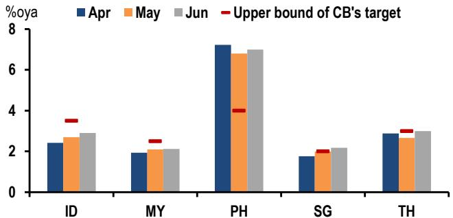

bar

| Category | Apr  | May  | Jun  | Upper bound of CB's target |
| -------- | ---- | ---- | ---- | -------------------------- |
| ID       | 2.4  | 2.7  | 2.9  | 3.6                        |
| MY       | 1.9  | 2.1  | 2.1  | 2.6                        |
| PH       | 7.2  | 6.8  | 7.0  | 4.0                        |
| SG       | 1.7  | 2.0  | 2.1  | 2.1                        |
| TH       | 2.9  | 2.6  | 3.0  | 3.1                        |

Source: National statistical agencies, JPM forecasts.

For Indonesia, we expect headline inflation to rise to 2.7% oya in May (Consensus: 2.9%), from 2.4% in April, as base effects normalize. We expect core inflation to remain stable at 2.4% oya (Consensus: 2.5%), as the boost from gold jewelry should dissipate further in line with the continued drop in gold prices in local currency terms.

In Thailand, we expect headline inflation to ease to 2.6% oya in May (Consensus: 3.1%), from 2.9%, as fuel and raw food prices ease, and the 2% hike in electricity tariffs is negligible. We expect core inflation to rise, but only marginally to 0.9% oya (Consensus: 0.9%), from 0.8%, on rising cost-push pressures, while demand-pull remains muted.

# Singapore: GDP strengthens, CPI softens

Incoming data on Singapore's activity and inflation surprised in opposite directions, with upward revisions to 1Q26 growth and a strong April IP beat contrasting with a downside surprise in the April CPI report. The final 1Q26 GDP estimates sharply lifted 1Q growth from $4.6\%$ oya in the advance release to $6\%$ oya (and from $-1.3\%$ q/q, saar to $3.9\%$ ar), with broad-based upward revisions to goods and services sector growth. Boomy construction investment and net exports fuelled the solid GDP gain, in line with our view that, together with tech exports, a strong pipeline of investments will be a key pillar for Singapore's growth in 2026 (Figure 2). The April IP report also reinforced this upbeat view, with accelerating tech momentum and a stabilization in the conflict-hit chemicals sector leading us to also raise our sights on 2Q growth from $2.5\%$ q/q, saar to $3\%$ ar. The combined 1H26 growth revisions have lifted our full-year growth estimate back up to $4.3\%$ oya, above the MTI forecast range of $2 - 4\%$ oya.

Figure 2: Singapore GDP - demand side breakdown

%-pt contribution to %oya GDP growth; black line is GDP growth

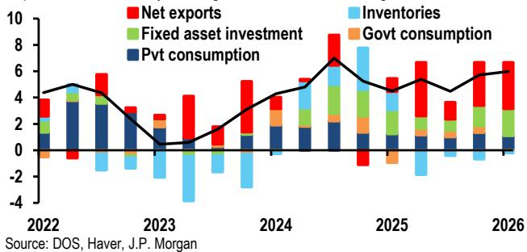

bar_stacked

| Year | Net exports | Fixed asset investment | Pvt consumption | Inventories | Govt consumption |
| :--- | :--- | :--- | :--- | :--- | :--- |
| 2022 | 3.5 | 1.0 | 1.5 | 0.5 | -0.5 |
| 2023 | 2.5 | -1.0 | 1.0 | -1.0 | -0.5 |
| 2024 | 4.0 | -1.0 | 1.5 | 1.0 | 0.5 |
| 2025 | 5.0 | 1.5 | 1.0 | 1.5 | -1.0 |
| 2026 | 6.0 | 1.5 | 1.0 | -1.0 | -0.5 |
Source: DOS, Haver, JPM

In contrast to the encouraging growth signals, April core inflation came in weaker than expected at 1.4% oya against JPM/consensus expectations for a 1.7% oya/1.8% oya rise. Goods prices posted another strong increase (+0.3% m/m, sa), but services prices surprisingly held flat as airfares and package holidays eased despite surging jet fuel costs (Figure 3). A drop in ICT services prices further dragged down services

inflation. Despite the April downside surprise, however, we still see elevated energy prices lifting Singapore's core inflation to 2.1% oya this year (MAS forecast: 1.5-2.5% oya). But at these levels, we do not see core inflation warranting another MAS policy tightening in 2026, given elevated global uncertainty.

Figure 3: Singapore core CPI - goods vs services   
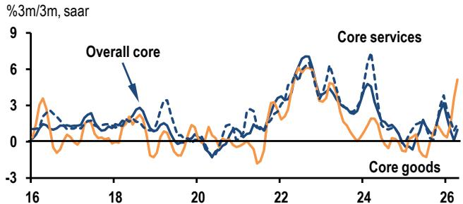

line

| Year | Overall core | Core goods |
|------|--------------|----------|
| 16   | ~1.5         | ~3.0     |
| 18   | ~2.0         | ~1.0     |
| 20   | ~1.0         | ~0.5     |
| 22   | ~4.0         | ~3.0     |
| 24   | ~6.0         | ~5.0     |
| 26   | ~3.0         | ~5.5     |

Source: DOS, JPM estimates

# Thailand: A swing to a CAD

The current account balance swung to a large deficit of USD7.6bn in April from a USD0.6bn surplus in March, broadly consistent with data reported earlier on a record-high customs-cleared goods trade deficit and falling foreign tourist arrivals.

We have lowered our 2026 current account surplus forecast further to 0.4% of GDP from 1.3% (Consensus: 1.3%), reflecting a broad-based increase in imports ranging from surging gold demand in 1Q26, a sharp increase in fuel prices and fuel import diversification to sustained underlying investment demand. We are penciling in a large swing to a current account deficit (CAD) of USD9.9bn in 2Q26 from a surplus of USD3.2bn in 1Q26 (Figure 4).

Figure 4: Thailand - Current account balance and its components   
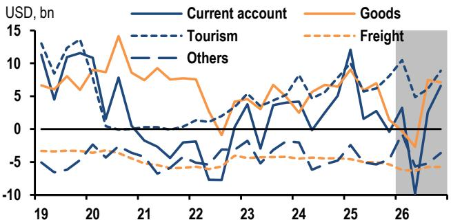

line

| Year | Current account | Goods | Tourism | Freight | Others |
|------|-----------------|-------|---------|---------|--------|
| 19   | 5               | 7     | 13      | -3      | -5     |
| 20   | 10              | 8     | 14      | -3      | -4     |
| 21   | 8               | 14    | 0       | -3      | -5     |
| 22   | -2              | 8     | 0       | -3      | -5     |
| 23   | 4               | 5     | 5       | -3      | -4     |
| 24   | 3               | 7     | 8       | -3      | -4     |
| 25   | 12              | 9     | 10      | -3      | -4     |
| 26   | -10             | -3    | 10      | -3      | -4     |

Source: CEIC, JPM.

# Philippines: Wider fiscal deficit in 2026/27

Last week, we published a note with the view that the government will enact a modest supplementary budget worth PHP200 billion (0.7% of GDP) in 2H26 to cushion the impact from the energy price shock. The reasons are two-fold: fiscal

policy may need to do the heavy lifting to support growth when the BSP is focused on taming inflation via rate tightening, and fiscal slippages (tax revenues, interest payments, external debt servicing) from the Middle East conflict are manageable so far.

Assuming that the government proceeds with a PHP200 billion spending package and pushes out the annual deficit target by a year, we project that long-term public debt sustainability would still be intact (Figure 5). As such, we have revised higher our 2026/27 fiscal deficit forecast from 5.3%/4.8% of GDP to 6.0%/5.3% of GDP.

Figure 5: Philippines outstanding public debt   
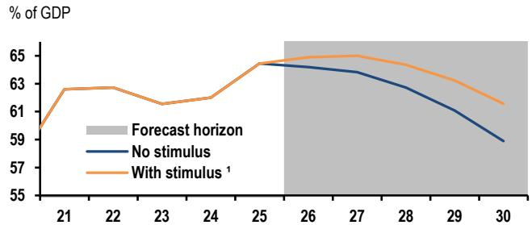

line

| Year | Forecast horizon | No stimulus | With stimulus¹ |
|------|------------------|-------------|----------------|
| 21   |                  |             | 60.0           |
| 22   |                  |             | 63.0           |
| 23   |                  |             | 61.5           |
| 24   |                  |             | 62.0           |
| 25   |                  | 64.0        | 64.5           |
| 26   |                  | 64.0        | 64.5           |
| 27   |                  | 63.5        | 64.5           |
| 28   |                  | 62.5        | 64.0           |
| 29   |                  | 61.0        | 63.0           |
| 30   |                  | 59.0        | 61.5           |

Source: CEIC, JPM forecast in shaded region   
1. Assume 2026 deficit rise to 6% of GDP; 2027-30 deficit target push out by a year

# Indonesia

# Review of past week's data

No data released.

# Data releases and forecasts

<table><tr><td rowspan="4">Tue02-Jun12:00pm</td><td colspan="5">Consumer prices% change</td></tr><tr><td></td><td>Feb</td><td>Mar</td><td>Apr</td><td>May</td></tr><tr><td>Total, %oya</td><td>4.8</td><td>3.5</td><td>2.4</td><td>2.7</td></tr><tr><td>%m/m, sa</td><td>0.5</td><td>0.1</td><td>0.1</td><td>-0.0</td></tr><tr><td rowspan="5">Tue02-Jun12:00pm</td><td colspan="5">Merchandise tradeUS$ bn, nsa</td></tr><tr><td></td><td>Jan</td><td>Feb</td><td>Mar</td><td>Apr</td></tr><tr><td>Trade balance</td><td>1.0</td><td>1.3</td><td>3.3</td><td>1.4</td></tr><tr><td>Exports,%oya</td><td>3.4</td><td>1.0</td><td>-3.1</td><td>3.2</td></tr><tr><td>Imports,%oya</td><td>18.2</td><td>10.8</td><td>1.5</td><td>-2.7</td></tr></table>

# Malaysia

# Review of past week's data

No data released.

# Data releases and forecasts

No data releases.

# Philippines

# Review of past week's data

No data released.

Data releases and forecasts 

<table><tr><td>Fri</td><td colspan="5">Consumer prices</td></tr><tr><td>05-Jun</td><td colspan="5">% change</td></tr><tr><td>9:00am</td><td></td><td>Feb</td><td>Mar</td><td>Apr</td><td>May</td></tr><tr><td></td><td>Total, %oya</td><td>2.4</td><td>4.1</td><td>7.2</td><td>6.8</td></tr><tr><td></td><td>%m/m, sa</td><td>0.4</td><td>1.6</td><td>3.0</td><td>-0.1</td></tr></table>

# Singapore

Review of past week's data 

<table><tr><td colspan="6">Real GDP</td></tr><tr><td>% change</td><td></td><td></td><td></td><td></td><td></td></tr><tr><td></td><td>3Q25</td><td>4Q25</td><td>1Q26</td><td></td><td></td></tr><tr><td>%oya</td><td>4.5</td><td>5.7</td><td>4.6</td><td>6.0</td><td></td></tr><tr><td>%q/q, saar</td><td>7.8</td><td>5.2</td><td>-1.3</td><td>3.9</td><td></td></tr><tr><td colspan="6">Consumer prices</td></tr><tr><td>% change</td><td></td><td></td><td></td><td></td><td></td></tr><tr><td></td><td>Feb</td><td>Mar</td><td>Apr</td><td></td><td></td></tr><tr><td>%oya</td><td>1.2</td><td>1.8</td><td>1.8</td><td>1.8</td><td></td></tr><tr><td>%m/m, sa</td><td>-0.1</td><td>0.6</td><td>0.4</td><td>0.4</td><td></td></tr><tr><td colspan="6">Industrial production</td></tr><tr><td>% change</td><td></td><td></td><td></td><td></td><td></td></tr><tr><td></td><td>Feb</td><td>Mar</td><td>Apr</td><td></td><td></td></tr><tr><td>%oya</td><td>3.3</td><td>3.6</td><td>10.1</td><td>9.2</td><td>12.7</td></tr><tr><td>%m/m, sa</td><td>-1.2</td><td>-1.1</td><td>4.7</td><td>3.5</td><td>2.0</td></tr></table>

Data releases and forecasts 

<table><tr><td rowspan="4">Tue02-Jun9:00pm</td><td colspan="5">Purchasing managers indexIndex</td></tr><tr><td></td><td>Feb</td><td>Mar</td><td>Apr</td><td>May</td></tr><tr><td>PMI</td><td>50.6</td><td>50.5</td><td>50.7</td><td>50.9</td></tr><tr><td>PMI—electronics</td><td>51.3</td><td>51.4</td><td>51.7</td><td>52.0</td></tr></table>

# Thailand

# Review of past week's data

Manufacturing production 

<table><tr><td colspan="5">% change</td></tr><tr><td></td><td>Feb</td><td>Mar</td><td>Apr</td><td></td></tr><tr><td>%oya</td><td>-0.2</td><td>1.3</td><td>-2.9</td><td>-0.4</td></tr><tr><td>%m/m, sa</td><td>-1.9</td><td>2.3</td><td>-0.9</td><td>0.0</td></tr></table>

# Global Economic Research

29 May 2026

Merchandise trade 

<table><tr><td colspan="5">% change</td></tr><tr><td></td><td>Feb</td><td>Mar</td><td>Apr</td><td></td></tr><tr><td>Trade balance</td><td>-2.8</td><td>-3.3</td><td>-5.4</td><td>-10.0</td></tr><tr><td>Exports, %oya</td><td>9.9</td><td>18.7</td><td>18.5</td><td>23.1</td></tr><tr><td>Imports, %oya</td><td>31.8</td><td>35.7</td><td>24.7</td><td>45.0</td></tr></table>

Data releases and forecasts 

<table><tr><td>Fri</td><td colspan="5">Consumer prices</td></tr><tr><td>05-Jun</td><td>% change</td><td></td><td></td><td></td><td></td></tr><tr><td>11:30am</td><td></td><td>Feb</td><td>Mar</td><td>Apr</td><td>May</td></tr><tr><td></td><td>Total, %oya</td><td>-0.9</td><td>-0.1</td><td>2.9</td><td>2.7</td></tr><tr><td></td><td>%m/m, sa</td><td>-0.3</td><td>0.7</td><td>2.3</td><td>-0.1</td></tr></table>

# India

• RBI expected to stay on hold next week   
• We expect 1Q26 GDP growth to print at 7.5%   
- High-frequency data show pickup in petroleum imports

The RBI is expected to stay on hold at next week's policy review, signaling that, while it remains vigilant, it will respond if it sees signs of CPI getting entrenched. While the RBI's inflation forecast for 2026-27 is likely to be revised higher due to El Niño risks, the MPC is likely to highlight that inflation uncertainty remains elevated. GDP growth is expected to remain strong in 1Q26, as reflected in indicators such as credit growth, auto sales and excess GST collections, with the impact of the Middle East crisis expected to show up from 2Q26 onward.

# RBI expected to remain on hold

We expect the MPC to keep policy rates on hold at next week's Monetary Policy Review, reinforcing its “wait-and-watch” approach and signaling that it would act only if second-round effects on inflation begin to materialize. As noted in the previous meeting and in the minutes, the MPC emphasized that monetary policy has limited ability to counter the direct impact of a supply-driven inflation shock; it becomes operationally relevant only once second-round effects are evident. We expect the MPC to reiterate this message.

With the probability of El Niño rising, the RBI may incorporate some impact into its inflation forecast for 2026-27. The extant forecast for inflation in 2026-27 is $4.6\%$ , and the RBI has previously estimated that El Niño could raise inflation by about 40 bps. The Met Department's second forecast projected rainfall at $10\%$ below normal this monsoon season. We expect inflation to average $5\%$ in FY27, incorporating the moderate El Niño impact.

Notably, while food inflation faces upside risks if there is a “super El Niño,” there is a wide band of uncertainty around how weather patterns will evolve. Large buffer stocks could also help moderate pressures on food prices stemming from El Niño-related disruptions. Moreover, there have been instances—such as 2015, another “super El Niño” year—when food inflation remained contained.

On growth, the MPC is likely to note that activity so far has not seen any material impact from the Middle East crisis. However, it could acknowledge downside risks to its FY27 GDP growth forecast (6.9%) if oil prices remain elevated.

Importantly, given the recent weakness in the currency, the RBI is likely to reiterate the “separability” principle under the inflation-targeting regime: Policy rates are used to manage growth-inflation dynamics, while FX volatility is addressed through FX reserves and other regulatory measures. Since the adoption of the inflation-targeting framework in 2014, the RBI has remained consistent with this separability principle.

# 1Q26 growth expected to remain strong

We forecast 1Q26 GDP growth of $7.5\%$ oya, slightly lower than $7.8\%$ in 4Q25. This is higher than the statistical office's second advance estimate of $7.3\%$ . If our forecast is correct, it would imply full-year FY26 growth of $7.7\%$ vs. the statistical office's forecast of $7.6\%$ .

Across sectors, services growth is expected to remain strong, supported by a continued acceleration of credit growth and higher GST collections. In contrast, manufacturing growth is likely to be more subdued, reflecting softer earnings growth. Notably, the weakness in manufacturing earnings is driven largely by the petroleum sector. Excluding petroleum, manufacturing earnings growth accelerated in 4QFY25, in line with the broader pickup in overall earnings growth.

Importantly, 1Q26 included a one-month drag from higher oil prices. However, this is unlikely to show up in the GDP data, as the impact was absorbed by the government's oil marketing companies, while retail pump prices remained unchanged.

That said, the margin of error around our GDP forecast is high. First, we have built our estimate using the old IIP series, whereas the GDP release will incorporate the new IIP series expected to be released on Monday. Second, this will be only the second data release under the new GDP series, which includes several methodological improvements—particularly around deflators—and there remains uncertainty about how these deflators will behave.

More broadly, while 1Q26 should print as robust growth, it is largely backward-looking. From 2Q26, growth is likely to begin reflecting the impact of the Middle East crisis.

Figure 1: Real GDP   
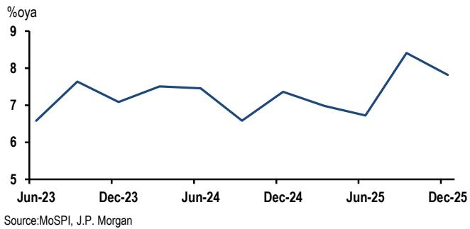

line

| Date   | %oya |
|--------|------|
| Jun-23 | 6.5  |
| Dec-23 | 7.5  |
| Jun-24 | 7.0  |
| Dec-24 | 7.5  |
| Jun-25 | 6.5  |
| Dec-25 | 8.5  |

# Tanker import data shows recovery

Daily tanker-tracking data indicate that India's tanker imports rebounded sharply in May. Volumes, which averaged about 0.3 MMT/day before the Middle East conflict, slipped to roughly 0.2 MMT/day in March-April, but have since risen above pre-conflict levels (Figure 2), suggesting efforts by India to diversify petroleum imports.

Figure 2: India tanker imports   
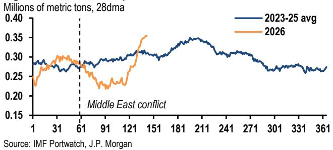

line

| Date | 2023-25 avg | 2026 |
|------|-------------|------|
| 1    | ~0.28       | ~0.24 |
| 31   | ~0.29       | ~0.30 |
| 61   | ~0.28       | ~0.27 |
| 91   | ~0.29       | ~0.23 |
| 121  | ~0.30       | ~0.35 |
| 151  | ~0.31       | ~0.36 |
| 181  | ~0.34       | ~0.35 |
| 211  | ~0.35       | ~0.34 |
| 241  | ~0.33       | ~0.32 |
| 271  | ~0.31       | ~0.30 |
| 301  | ~0.28       | ~0.27 |
| 331  | ~0.27       | ~0.26 |
| 361  | ~0.27       | ~0.26 |

The Petroleum Planning & Analysis Cell (PPAC) data show total crude and petroleum product volumes improving from -16%oya in March to -9%oya in April, with scope for further normalization in May if the daily tanker data are indicative (Figure 3). By product, the recovery has been driven by crude oil, which has improved materially from -17%oya to -4%oya. In contrast, LPG imports have not shown a rebound, remaining around -56%oya, broadly unchanged from March. That said, the impact on activity due to lower LPG imports was partly cushioned by stronger domestic production, which accelerated from 5%oya in February to 29% in March and 33% in April.

# Global Economic Research

29 May 2026

Figure 3: Petroleum import volumes   
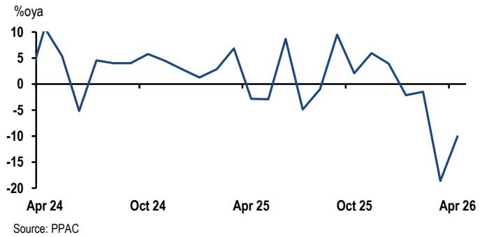

line

| Date   | %oya |
|--------|------|
| Apr 24 | 10   |
| Oct 24 | -5   |
| Apr 25 | 7    |
| Oct 25 | -5   |
| Apr 26 | -20  |

# Data releases and forecasts

Week of June 1-5 

<table><tr><td>Fri</td><td>GDP</td><td></td><td></td><td></td><td></td></tr><tr><td>5-Jun</td><td>%</td><td></td><td></td><td></td><td></td></tr><tr><td></td><td></td><td>2Q25</td><td>3Q25</td><td>4Q25</td><td>1Q26</td></tr><tr><td></td><td>% oya</td><td>6.7</td><td>8</td><td>7.8</td><td>7.5</td></tr></table>

See main text. 

<table><tr><td>Fri</td><td>Repo rate</td><td></td><td></td><td></td><td></td></tr><tr><td>5-Jun</td><td>%</td><td></td><td></td><td></td><td></td></tr><tr><td></td><td></td><td>Dec</td><td>Feb</td><td>Apr</td><td>Jun</td></tr><tr><td></td><td>Repo rate</td><td>5.25</td><td>5.25</td><td>5.25</td><td>5.25</td></tr></table>

See main text.

<table><tr><td>Mon</td><td colspan="5">Industrial Production</td></tr><tr><td>1-Jun</td><td>% oya</td><td></td><td></td><td></td><td></td></tr><tr><td></td><td></td><td>Jan</td><td>Feb</td><td>Mar</td><td>Apr</td></tr><tr><td></td><td>% oya</td><td>5.1</td><td>5.1</td><td>4.1</td><td>4.0</td></tr></table>

We expect industrial production to rise 4% oya in April, broadly unchanged from March. However, sequential momentum is likely to soften, led by mining, consistent with weaker coal output in core IP.

That said, this forecast is based on the old IP series, though a new series with methodological changes will be released next week.

# Review of past week's data

No data releases.

Sources: MoSPI, RBI, JPM

Japan economic calendar 

<table><tr><td>Monday</td><td>Tuesday</td><td>Wednesday</td><td>Thursday</td><td>Friday</td></tr><tr><td>1 JunMoF corporate survey(8:50am) 1Q 5.5 %oyaPMI manufacturing final(9:30am) May</td><td>2 JunAuction 10-year note</td><td>3 JunPMI services final(9:30am) MaySpeech by Governor UEDA at the Kisaragi-kai Meeting (5:30pm)</td><td>4 Jun</td><td>5 JunEmployers&#x27; survey(8:30am) Apr wage 2.7 %oyaAll household spending(8:30am) AprCoincident CI prelim(2:00pm) AprConsumption activity index(2:00pm) AprAuction 3-month bill</td></tr><tr><td colspan="5"></td></tr><tr><td>8 JunGDP 2nd(8:50am) 1QBank lending(8:50am) MayCurrent account(8:50am) AprEconomy watchers survey(2:00pm) May</td><td>9 JunM2(8:50am) MayAuction 6-month bill</td><td>10 JunCorporate goods prices(8:50am) MayAuction 30-year note</td><td>11 JunBusiness outlook survey(8:50am) 2Q</td><td>12 JunIP final(1:30pm) AprAuction 3-month bill</td></tr><tr><td colspan="5"></td></tr><tr><td>15 JunTertiary sector activity index(1:30pm) AprBoJ Monetary Policy Meeting</td><td>16 JunBoJ Monetary Policy MeetingBoJ Governor Ueda&#x27;s press conference (3:30pm)</td><td>17 JunTrade balance(8:50am) MayPrivate machinery orders(8:50am) Apr</td><td>18 JunReal exports and imports(2:00pm) MayAuction 1-year note</td><td>19 JunNationwide core CPI(8:30am) MayMinutes of Apr 27-28 BoJ Monetary Policy Meeting (8:50am)Auction 3-month bill</td></tr><tr><td colspan="5">During the week: Nationwide department store sales (16-22 Jun)</td></tr><tr><td>22 Jun</td><td>23 JunPMI manufacturing prelim(9:30am) JunPMI services prelim(9:30am) JunAuction 5-year note</td><td>24 JunCorporate service prices(8:50am) May</td><td>25 JunCoincident CI final(2:00pm) AprAuction 20-year note</td><td>26 JunTokyo core CPI(8:30am) JunAuction 3-month bill</td></tr></table>

Note: Times shown are local. Source: Private and public agencies and JPM. Further details available upon request.

Non-Japan Asia economic calendar 

<table><tr><td>Monday</td><td>Tuesday</td><td>Wednesday</td><td>Thursday</td><td>Friday</td></tr><tr><td>1 JunSouth KoreaTrade balance (9:00am) MayUS$23.0bnPMI mfg. (9:30am) May53.5TaiwanPMI mfg. (8:30am) May53.0AustraliaANZ job advertisements(11:30am) MayChinaPMI Mfg. (9:45am) May51.0IndiaPMI mfg. final (10:30am) MayIP (4:00pm) Apr4.0%oyaHoliday: Indonesia, Malaysia,Thailand</td><td>2 JunSouth KoreaCPI (8:00am) May3.0%oyaAustraliaBuilding approvals (11:30am) Apr-3.0%m/m, saCurrent account balance1QA$-23bnCompany operating profit 1QInventories (11:30am) 1QIndonesiaTrade balance (11:00am) AprUS$1.4bnCPI (11:00am) May2.7%oyaHong KongRetail sales (4:30pm) Apr9.4%oyaSingaporePMI (9:00pm) May50.9Holiday: Malaysia</td><td>3 JunNew ZealandTerms of trade (10:45am) 1QBuilding permits (10:45am) MayAustraliaGDP (11:30am) 1Q0.5%q/q, saVietnamExports (9:05am) MayIndustrial output (9:05am) MayCPI (9:05am) MayHong KongPMI May50.3Holiday: Thailand</td><td>4 JunNew ZealandANZ commodity price (1:00pm)MayAustraliaTrade balance (11:30am) AprA$3.0bn</td><td>5 JunSouth KoreaCurrent account balance (8:00am)MayUS$29.0bnPhilippinesCPI (9:00am) May6.8%oyaThailandCPI (10:30am) May2.7%oyaIndiaRBI monetary policy meetingno changeGDP (4:00pm) 1Q7.5%oyaTaiwanCPI (4:00pm) May2.1%oya</td></tr><tr><td colspan="5">During the week: China PMI mfg. (NBS) May (31 May)50.1India BoP 1Q (1-9 Jun) China Foreign Exchange Reserves May (7 Jun)</td></tr><tr><td>8 Jun</td><td>9 JunNew ZealandManufacturing output 1QSouth KoreaGDP prelim (8:00am) 1QTaiwanTrade balance (4:00pm) MayChinaTrade balance May</td><td>10 JunChinaPPI (9:30am) MayCPI (9:30am) May</td><td>11 JunSouth KoreaUnemployment rate (8:00am) May</td><td>12 JunNew ZealandBusiness NZ PMI (10:30am) MayIndiaCPI (4:00pm) MayHoliday: Philippines</td></tr><tr><td colspan="5">During the week: China Money supply/TSF May (9-15 Jun)</td></tr><tr><td>15 JunIndiaWPI (12:00pm) MayTrade balance May</td><td>16 JunSouth KoreaExport price index (6:00am) MayImport price index (6:00am) MayMoney supply (12:00pm) AprChinaIP (10:00am) MayFAI (10:00am) MayRetail sales (10:00am) MayHong KongUnemployment rate (4:30pm) MayHoliday: Indonesia</td><td>17 JunNew ZealandCurrent account balance(10:45am) 1QSingaporeNODX (8:30am) MayHoliday: Malaysia</td><td>18 JunNew ZealandGDP (10:45am) 1QPhilippinesBSP monetary policy meetingIndonesiaBI monetary policy meetingTaiwanCBC monetary policy meeting</td><td>19 JunSouth KoreaPPI (6:00am) MayNew ZealandTrade balance (10:45am) MayMalaysiaCPI (12:00pm) MayTrade balance (12:00pm) MayHoliday: China, Hong Kong,Taiwan</td></tr><tr><td colspan="5">During the week: Thailand Trade balance May (21-26 Jun)</td></tr><tr><td>22 Jun</td><td>23 JunSouth KoreaConsumer survey (6:00am) JunSingaporeCPI (1:00pm) MayIndiaPMI mfg. (10:30am)TaiwanExport orders (4:00pm) MayUnemployment rate (4:00pm) MayHong KongCPI (4:30pm) May</td><td>24 JunThailandBOT monetary policy meetingTaiwanIP (4:00pm) May</td><td>25 JunAustraliaUnemployment rate (11:30am)MayHong KongTrade balance (4:30pm) May</td><td>26 JunSingaporeIP (1:00pm) MayHoliday: India</td></tr><tr><td colspan="5">During the week: Thailand Mfg. Production May (27-29 Jun)</td></tr></table>

Times shown are local. Source: Private and public agencies and JPM. Further details available upon request.

# Disclosures

Analyst Certification: The Research Analyst(s) denoted by an “AC” on the cover of this report certifies (or, where multiple Research Analysts are primarily responsible for this report, the Research Analyst denoted by an “AC” on the cover or within the document individually certifies, with respect to each security or issuer that the Research Analyst covers in this research) that: (1) all of the views expressed in this report accurately reflect the Research Analyst’s personal views about any and all of the subject securities or issuers; and (2) no part of any of the Research Analyst's compensation was, is, or will be directly or indirectly related to the specific recommendations or views expressed by the Research Analyst(s) in this report. For all Korea-based Research Analysts listed on the front cover, if applicable, they also certify, as per KOFIA requirements, that the Research Analyst’s analysis was made in good faith and that the views reflect the Research Analyst’s own opinion, without undue influence or intervention.

All authors named within this report are Research Analysts who produce independent research unless otherwise specified. In Europe, Sector Specialists (Sales and Trading) may be shown on this report as contacts but are not authors of the report or part of the Research Department.

# Important Disclosures

Company-Specific Disclosures: Important disclosures, including price charts and credit opinion history tables (if applicable), are available for compendium reports and all JPM-covered companies, and certain non-covered companies, by visiting

https://www.jpmm.com/research/disclosures, calling 1-800-477-0406, or e-mailing research.disclosure.inquiries@JPM.com with your request.

# History of Investment Recommendations:

A history of JPM investment recommendations disseminated during the preceding 12 months can be accessed on the Research & Commentary page of http://www.JPMmarkets.com where you can also search by analyst name, sector or financial instrument.

# Explanation of Emerging Markets Sovereign Research Ratings System and Valuation & Methodology:

Ratings System: JPM uses the following issuer portfolio weightings for Emerging Markets Sovereign Research: Overweight (over the next three months, the recommended risk position is expected to outperform the relevant index, sector, or benchmark credit returns);

Marketweight (over the next three months, the recommended risk position is expected to perform in line with the relevant index, sector, or benchmark credit returns); and Underweight (over the next three months, the recommended risk position is expected to underperform the relevant index, sector, or benchmark credit returns). NR is Not Rated. In this case, JPM has removed the rating for this security because of either legal, regulatory or policy reasons or because of lack of a sufficient fundamental basis. The previous rating no longer should be relied upon. An NR designation is not a recommendation or a rating. NC is Not Covered. An NC designation is not a rating or a recommendation.

Recommendations will be at the issuer level, and an issuer recommendation applies to all of the index-eligible bonds at the same level for the issuer. When we change the issuer-level rating, we are changing the rating for all of the issues covered, unless otherwise specified. Ratings for quasi-sovereign issuers in the EMBIG may differ from the ratings provided in EM corporate coverage.

Valuation & Methodology: For JPM's Emerging Markets Sovereign Research, we assign a rating to each sovereign issuer (Overweight, Marketweight or Underweight) based on our view of whether the combination of the issuer's fundamentals, market technicals, and the relative value of its securities will cause it to outperform, perform in line with, or underperform the credit returns of the EMBIGD index over the next three months. Our view of an issuer's fundamentals includes our opinion of whether the issuer is becoming more or less able to service its debt obligations when they become due and payable, as well as whether its willingness to service debt obligations is increasing or decreasing.

JPM Emerging Markets Sovereign Research Ratings Distribution, as of April 4, 2026 

<table><tr><td></td><td>Overweight (buy)</td><td>Marketweight (hold)</td><td>Underweight (sell)</td></tr><tr><td>Emerging Markets Sovereign Research Universe*</td><td>6%</td><td>84%</td><td>10%</td></tr><tr><td>IB clients**</td><td>100%</td><td>86%</td><td>100%</td></tr></table>

\*Please note that the percentages may not add to 100% because of rounding.   
\*\*Percentage of subject issuers within each of the "Overweight, "Marketweight" and "Underweight" categories for which JPM has provided investment banking services within the previous 12 months.   
For purposes of FINRA ratings distribution rules only, our Overweight rating falls into a buy rating category; our Marketweight rating falls into a hold rating category; and our Underweight rating falls into a sell rating category. The Emerging Markets Sovereign Research Rating Distribution is at the issuer level. Issuers with an NR or an NC designation are not included in the table above. This information is current as of the end of the most recent calendar quarter.

Analysts' Compensation: The research analysts responsible for the preparation of this report receive compensation based upon various factors, including the quality and accuracy of research, client feedback, competitive factors, and overall firm revenues.

Registration of non-US Analysts: Unless otherwise noted, the non-US analysts listed on the front of this report are employees of non-US affiliates of JPM Securities LLC, may not be registered as research analysts under FINRA rules, may not be associated persons of JPM Securities LLC, and may not be subject to FINRA Rule 2241 or 2242 restrictions on communications with covered companies, public appearances, and trading securities held by a research analyst account.

# Other Disclosures

JPM is a marketing name for investment banking businesses of JPM Chase & Co. and its subsidiaries and affiliates worldwide.   
UK MIFID FICC research unbundling exemption: UK clients should refer to UK MIFID Research Unbundling exemption for details of JPM's implementation of the FICC research exemption and guidance on relevant FICC research categorisation.   
Any long form nomenclature for references to China; Hong Kong; Taiwan; and Macau within this research material are Mainland China; Hong Kong SAR (China); Taiwan (China); and Macau SAR (China).   
JPM may, from time to time, write on issuers or securities targeted by economic or financial sanctions imposed or administered by the governmental authorities of the U.S., EU, UK or other relevant jurisdictions (Sanctioned Securities). Nothing in this report is intended to be read or construed as encouraging, facilitating, promoting or otherwise approving investment or dealing in such Sanctioned Securities. Clients should be aware of their own legal and compliance obligations when making investment decisions.   
Any digital or crypto assets discussed in this research report are subject to a rapidly changing regulatory landscape. For relevant regulatory advisories on crypto assets, including bitcoin and ether, please see https://www.JPM.com/disclosures/cryptoasset-disclosure.   
The author(s) of this research report may not be licensed to carry on regulated activities in your jurisdiction and, if not licensed, do not hold themselves out as being able to do so.   
Exchange-Traded Funds (ETFs): JPM Securities LLC (“JPMS”) acts as authorized participant for substantially all U.S.-listed ETFs. To the extent that any ETFs are mentioned in this report, JPMS may earn commissions and transaction-based compensation in connection with the distribution of those ETF shares and may earn fees for performing other trade-related services, such as securities lending to short sellers of the ETF shares. JPMS may also perform services for the ETFs themselves, including acting as a broker or dealer to the ETFs. In addition, affiliates of JPMS may perform services for the ETFs, including trust, custodial, administration, lending, index calculation and/or maintenance and other services.   
Options and Futures related research: If the information contained herein regards options- or futures-related research, such information is available only to persons who have received the proper options or futures risk disclosure documents. Please contact your JPM Representative or visit https://www.theocc.com/components/docs/riskstoc.pdf for a copy of the Option Clearing Corporation's Characteristics and Risks of Standardized Options or https://www.finra.org/sites/default/files/2020-08/Security\_Futures\_Risk\_Disclosure\_Statement\_2020.pdf for a copy of the Security Futures Risk Disclosure Statement.   
Changes to Interbank Offered Rates (IBORs) and other benchmark rates: Certain interest rate benchmarks are, or may in the future become, subject to ongoing international, national and other regulatory guidance, reform and proposals for reform. For more information, please consult: https://www.JPM.com/global/disclosures/interbank\_offered\_rates   
Private Bank Clients: Where you are receiving research as a client of the private banking businesses offered by JPM Chase & Co. and its subsidiaries (“JPM Private Bank”), research is provided to you by JPM Private Bank and not by any other division of JPM, including, but not limited to, the JPM Corporate and Investment Bank and its Global Research division.   
Legal entity responsible for the production and distribution of research: The legal entity identified below the name of the Reg AC Research Analyst who authored this material is the legal entity responsible for the production of this research. Where multiple Reg AC Research Analysts authored this material with different legal entities identified below their names, these legal entities are jointly responsible for the production of this research. Where more than one legal entity is listed under an analyst's name, the first legal entity is responsible for the production unless stated otherwise. Research Analysts from various JPM affiliates may have contributed to the production of this material but may not be licensed to carry out regulated activities in your jurisdiction (and do not hold themselves out as being able to do so). Unless otherwise stated below in the legal entity disclosures, this material has been distributed by the legal entity responsible for production, or where more than one legal entity is listed under the analyst's name, the first legal entity will be responsible for distribution. If you have any queries, please contact the relevant Research Analyst in your jurisdiction or the entity in your jurisdiction that has distributed this research material.   
Legal Entities Disclosures and Country-/Region-Specific Disclosures:   
Argentina: JPM Chase Bank N.A Sucursal Buenos Aires is regulated by Banco Central de la República Argentina (“BCRA”- Central Bank of Argentina) and Comisión Nacional de Valores (“CNV”- Argentinian Securities Commission - ALYC y AN Integral N°51).   
Australia: JPM Securities Australia Limited (“JPMSAL”) (ABN 61 003 245 234/AFS Licence No: 238066) is regulated by the Australian Securities and Investments Commission and is a Market Participant of ASX Limited, a Clearing and Settlement Participant of ASX Clear Pty Limited and a Clearing Participant of ASX Clear (Futures) Pty Limited. This material is issued and distributed in Australia by or on behalf of JPMSAL only to "wholesale clients" (as defined in section 761G of the Corporations Act 2001). A list of all financial products covered can be found by visiting https://www.jpmm.com/research/disclosures. JPM seeks to cover companies of relevance to the domestic and

international investor base across all Global Industry Classification Standard (GICS) sectors, as well as across a range of market capitalisation sizes. If applicable, in the course of conducting public side due diligence on the subject company(ies), the Research Analyst team may at times perform such diligence through corporate engagements such as site visits, discussions with company representatives, management presentations, etc. Research issued by JPMSAL has been prepared in accordance with JPM Australia’s Research Independence Policy which can be found at the following link: JPM Australia - Research Independence Policy.

Brazil: Banco JPM S.A. is regulated by the Comissao de Valores Mobiliarios (CVM) and by the Central Bank of Brazil. Ombudsman JPM: 0800-7700847 / 0800-7700810 (For Hearing Impaired) / ouvidoria.jp.morgan@jpmchase.com.

Canada: JPM Securities Canada Inc. is a registered investment dealer, regulated by the Canadian Investment Regulatory Organization and the Ontario Securities Commission and is the participating member on Canadian exchanges. This material is distributed in Canada by or on behalf of JPM Securities Canada Inc.

Chile: Inversiones JPM Limitada is an unregulated entity incorporated in Chile.

China: JPM Securities (China) Company Limited has been approved by CSRC to conduct the securities investment consultancy business.

Colombia: Banco JPM Colombia S.A. is supervised by the Superintendencia Financiera de Colombia (SFC). Any reference in this material to products or services offered abroad by entities other than the Bank in Colombia is included exclusively for descriptive purposes. Such references do not constitute, and should not be construed as, promotional activity or the provision of financial products or services within Colombian territory, as defined under applicable Colombian regulation.

Dubai International Financial Centre (DIFC): JPM Chase Bank, N.A., Dubai Branch is regulated by the Dubai Financial Services Authority (DFSA) and its registered address is Dubai International Financial Centre - The Gate, West Wing, Level 3 and 9 PO Box 506551, Dubai, UAE. This material has been distributed by JPM Chase Bank, N.A., Dubai Branch to persons regarded as professional clients or market counterparties as defined under the DFSA rules.

European Economic Area (EEA): Unless specified to the contrary, research is distributed in the EEA by JPM SE (“JPM SE”), which is authorised as a credit institution by the Federal Financial Supervisory Authority (Bundesanstalt für Finanzdienstleistungsaufsicht, BaFin) and jointly supervised by the BaFin, the German Central Bank (Deutsche Bundesbank) and the European Central Bank (ECB). JPM SE is a company headquartered in Frankfurt with registered address at TaunusTurm, Taunustor 1, Frankfurt am Main, 60310, Germany. The material has been distributed in the EEA to persons regarded as professional investors (or equivalent) pursuant to Art. 4 para. 1 no. 10 and Annex II of MiFID II and its respective implementation in their home jurisdictions (“EEA professional investors”). This material must not be acted on or relied on by persons who are not EEA professional investors. Any investment or investment activity to which this material relates is only available to EEA relevant persons and will be engaged in only with EEA relevant persons.

Hong Kong: JPM Securities (Asia Pacific) Limited (CE number AAJ321) is regulated by the Hong Kong Monetary Authority and the Securities and Futures Commission in Hong Kong, and JPM Broking (Hong Kong) Limited (CE number AAB027) is regulated by the Securities and Futures Commission in Hong Kong. JPM Chase Bank, N.A., Hong Kong Branch (CE Number AAL996) is regulated by the Hong Kong Monetary Authority and the Securities and Futures Commission, is organized under the laws of the United States with limited liability. Where the distribution of this material is a regulated activity in Hong Kong, the material is distributed in Hong Kong by or through JPM Securities (Asia Pacific) Limited and/or JPM Broking (Hong Kong) Limited.

India: JPM India Private Limited (Corporate Identity Number - U67120MH1992FTC068724), having its registered office at JPM Tower, Off. C.S.T. Road, Kalina, Santacruz - East, Mumbai – 400098, is registered with the Securities and Exchange Board of India (SEBI) as a 'Research Analyst' having registration number INH000001873. JPM India Private Limited is also registered with SEBI as a member of the National Stock Exchange of India Limited and the Bombay Stock Exchange Limited (SEBI Registration Number – INZ000239730) and as a Merchant Banker (SEBI Registration Number - MB/INM000002970). Telephone: 91-22-6157 3000, Facsimile: 91-22-6157 3990 and Website: http://www.jpmipl.com. JPM Chase Bank, N.A. - Mumbai Branch is licensed by the Reserve Bank of India (RBI) (Licence No. 53/Licence No. BY.4/94; SEBI - IN/CUS/014/ CDSL : IN-DP-CDSL-444-2008/ IN-DP-NSDL-285-2008/ INBI00000984/ INE231311239) as a Scheduled Commercial Bank in India, which is its primary license allowing it to carry on Banking business in India and other activities, which a Bank branch in India are permitted to undertake. For non-local research material, this material is not distributed in India by JPM India Private Limited. Compliance Officer: Ashutosh Sharma; ashutosh.j.sharma@jpmchase.com; +912261575002. Grievance Officer: Ramprasadh K, jpmipl.research.feedback@JPM.com; +912261573000. Registration granted by SEBI and certification from NISM in no way guarantee performance of the intermediary or provide any assurance of returns to investors. Please visit Terms and Conditions and Most Important Terms and Conditions (MITC). The annual Compliance audit report is available at http://www.jpmipl.com/#research.

Indonesia: PT JPM Sekuritas Indonesia is a member of the Indonesia Stock Exchange and is registered and supervised by the Otoritas Jasa Keuangan (OJK).

Korea: JPM Securities (Far East) Limited, Seoul Branch, is a member of the Korea Exchange (KRX). JPM Chase Bank, N.A., Seoul Branch, is licensed as a branch office of foreign bank (JPM Chase Bank, N.A.) in Korea. Both entities are regulated by the Financial Services Commission (FSC) and the Financial Supervisory Service (FSS). For non-macro research material, the material is distributed in Korea by or through JPM Securities (Far East) Limited, Seoul Branch.

Japan: JPM Securities Japan Co., Ltd. and JPM Chase Bank, N.A., Tokyo Branch are regulated by the Financial Services Agency in

Japan.

Malaysia: This material is issued and distributed in Malaysia by JPM Securities (Malaysia) Sdn Bhd (18146-X), which is a Participating Organization of Bursa Malaysia Berhad and holds a Capital Markets Services License issued by the Securities Commission in Malaysia.

Mexico: JPM Casa de Bolsa, S.A. de C.V., JPM Grupo Financiero is member of the Mexican Stock Exchange (“Bolsa Mexicana de Valores”) and the Institutional Stock Exchange (“Bolsa Institucional de Valores”), and it is authorized to act as a broker dealer by the National Banking and Securities Exchange Commission (“Comisión Nacional Bancaria y de Valores”).

New Zealand: This material is issued and distributed by JPMSAL in New Zealand only to "wholesale clients" (as defined in the Financial Markets Conduct Act 2013). JPMSAL is registered as a Financial Service Provider under the Financial Service providers (Registration and Dispute Resolution) Act of 2008.

Philippines: JPM Securities Philippines Inc. is a Trading Participant of the Philippine Stock Exchange and a member of the Securities Clearing Corporation of the Philippines and the Securities Investor Protection Fund. It is regulated by the Securities and Exchange Commission.

Singapore: This material is issued and distributed in Singapore by or through JPM Securities Singapore Private Limited (JPMSS) [MDDI (P) 057/08/2025 and Co. Reg. No.: 199405335R], which is a member of the Singapore Exchange Securities Trading Limited, and/or JPM Chase Bank, N.A., Singapore branch (JPMCB Singapore), both of which are regulated by the Monetary Authority of Singapore. This material is issued and distributed in Singapore only to accredited investors, expert investors and institutional investors, as defined in Section 4A of the Securities and Futures Act, Cap. 289 (SFA). This material is not intended to be issued or distributed to any retail investors or any other investors that do not fall into the classes of “accredited investors,” “expert investors” or “institutional investors,” as defined under Section 4A of the SFA. Recipients of this material in Singapore are to contact JPMSS or JPMCB Singapore in respect of any matters arising from, or in connection with, the material.

South Africa: JPM Equities South Africa Proprietary Limited and JPM Chase Bank, N.A., Johannesburg Branch are members of the Johannesburg Securities Exchange and are regulated by the Financial Services Conduct Authority (FSCA).

Taiwan: JPM Securities (Taiwan) Limited is a participant of the Taiwan Stock Exchange (company-type) and regulated by the Taiwan Securities and Futures Bureau. Material relating to equity securities is issued and distributed in Taiwan by JPM Securities (Taiwan) Limited, subject to the license scope and the applicable laws and the regulations in Taiwan. To the extent that JPM Securities (Taiwan) Limited produces research materials on securities not listed on the Taiwan Stock Exchange or Taipei Exchange (“Non-Taiwan Listed Securities”), these materials shall not constitute securities recommendations for the purpose of applicable Taiwan regulations, and, for the avoidance of doubt, JPM Securities (Taiwan) Limited does not act as broker for Non-Taiwan Listed Securities. According to Paragraph 2, Article 7-1 of Operational Regulations Governing Securities Firms Recommending Trades in Securities to Customers (as amended or supplemented) and/or other applicable laws or regulations, please note that the recipient of this material is not permitted to engage in any activities in connection with the material that may give rise to conflicts of interests, unless otherwise disclosed in the “Important Disclosures” in this material.

Thailand: This material is issued and distributed in Thailand by JPM Securities (Thailand) Ltd., which is a member of the Stock Exchange of Thailand and is regulated by the Ministry of Finance and the Securities and Exchange Commission. The registered address is 548 One City Center Building, 50th Floor, Ploenchit Road, Lymphini, Pathum Wan, Bangkok 10330.

UK: Research is produced in the UK by JPM Securities plc (“JPMS plc”) which is a member of the London Stock Exchange and is authorised by the Prudential Regulation Authority and regulated by the Financial Conduct Authority and the Prudential Regulation Authority or JPM Markets Limited (“JPMML Ltd”) which is authorised and regulated by the Financial Conduct Authority. Unless specified to the contrary, this material is distributed in the UK by JPMS plc and is directed in the UK only to: (a) persons having professional experience in matters relating to investments falling within article 19(5) of the Financial Services and Markets Act 2000 (Financial Promotion) (Order) 2005 (“the FPO”); (b) persons outlined in article 49 of the FPO (high net worth companies, unincorporated associations or partnerships, the trustees of high value trusts, etc.); or (c) any persons to whom this communication may otherwise lawfully be made; all such persons being referred to as "UK relevant persons". This material must not be acted on or relied on by persons who are not UK relevant persons. Any investment or investment activity to which this material relates is only available to UK relevant persons and will be engaged in only with UK relevant persons. A description of JPM EMEA’s policy for prevention and avoidance of conflicts of interest related to the production of Research can be found at the following link: JPM EMEA - Research Independence Policy.

U.S.: JPM Securities LLC (“JPMS”) is a member of the NYSE, FINRA, SIPC, and the NFA. JPM Chase Bank, N.A. is a member of the FDIC. Material published by non-U.S. affiliates is distributed in the U.S. by JPMS who accepts responsibility for its content.

General: Additional information is available upon request. The information in this material has been obtained from sources believed to be reliable. While all reasonable care has been taken to ensure that the facts stated in this material are accurate and that the forecasts, opinions and expectations contained herein are fair and reasonable, JPM Chase & Co. or its affiliates and/or subsidiaries (collectively JPM) make no representations or warranties whatsoever to the completeness or accuracy of the material provided, except with respect to any disclosures relative to JPM and the Research Analyst's involvement with the issuer that is the subject of the material. Accordingly, no reliance should be placed on the accuracy, fairness or completeness of the information contained in this material. There may be certain discrepancies with data and/or limited content in this material as a result of calculations, adjustments, translations to different languages, and/or local regulatory restrictions, as applicable. These discrepancies should not impact the overall investment analysis, views and/or recommendations of the subject company(ies) that may be discussed in the material. Artificial intelligence tools may have been used in the preparation of this material, including assisting in data analysis, pattern recognition, and content drafting for research material. JPM accepts no liability whatsoever for any loss arising from any use of this material or its contents, and neither JPM nor any of its respective directors, officers or employees, shall be in any way responsible for the contents hereof, apart from the liabilities and responsibilities that may be imposed on them by the relevant regulatory authority in the jurisdiction in question, or the regulatory regime thereunder. Opinions, forecasts or projections contained in this material represent JPM's current opinions or judgment as of the date of the material only and are therefore subject to change without notice. Periodic updates may be provided on companies/industries based on company-specific developments or announcements, market conditions or any other publicly available information. There can be no assurance that future results or events will be consistent with any such opinions, forecasts or projections, which represent only one possible outcome. Furthermore, such opinions, forecasts or projections are subject to certain risks, uncertainties and assumptions that have not been verified, and future actual results or events could differ materially. The value of, or income from, any investments referred to in this material may fluctuate and/or be affected by changes in exchange rates. All pricing is indicative as of the close of market for the securities discussed, unless otherwise stated. Past performance is not indicative of future results. Accordingly, investors may receive back less than originally invested. This material is not intended as an offer or solicitation for the purchase or sale of any financial instrument. The opinions and recommendations herein do not take into account individual client circumstances, objectives, or needs and are not intended as recommendations of particular securities, financial instruments or strategies to particular clients. This material may include views on structured securities, options, futures and other derivatives. These are complex instruments, may involve a high degree of risk and may be appropriate investments only for sophisticated investors who are capable of understanding and assuming the risks involved. The recipients of this material must make their own independent decisions regarding any securities or financial instruments mentioned herein and should seek advice from such independent financial, legal, tax or other adviser as they deem necessary. JPM may trade as a principal on the basis of the Research Analysts' views and research, and it may also engage in transactions for its own account or for its clients' accounts in a manner inconsistent with the views taken in this material, and JPM is under no obligation to ensure that such other communication is brought to the attention of any recipient of this material. Others within JPM, including Strategists, Sales staff and other Research Analysts, may take views that are inconsistent with those taken in this material. Employees of JPM not involved in the preparation of this material may have investments in the securities (or derivatives of such securities) mentioned in this material and may trade them in ways different from those discussed in this material. This material is not an advertisement for or marketing of any issuer, its products or services, or its securities in any jurisdiction.

Confidentiality and Security Notice: This transmission may contain information that is privileged, confidential, legally privileged, and/or exempt from disclosure under applicable law. If you are not the intended recipient, you are hereby notified that any disclosure, copying, distribution, or use of the information contained herein (including any reliance thereon) is STRICTLY PROHIBITED. Although this transmission and any attachments are believed to be free of any virus or other defect that might affect any computer system into which it is received and opened, it is the responsibility of the recipient to ensure that it is virus free and no responsibility is accepted by JPM Chase & Co., its subsidiaries and affiliates, as applicable, for any loss or damage arising in any way from its use. If you received this transmission in error, please immediately contact the sender and destroy the material in its entirety, whether in electronic or hard copy format. This message is subject to electronic monitoring: https://www.JPM.com/disclosures/email

MSCI: Certain information herein (“Information”) is reproduced by permission of MSCI Inc., its affiliates and information providers (“MSCI”) ©2026. No reproduction or dissemination of the Information is permitted without an appropriate license. MSCI MAKES NO EXPRESS OR IMPLIED WARRANTIES (INCLUDING MERCHANTABILITY OR FITNESS) AS TO THE INFORMATION AND DISCLAIMS ALL LIABILITY TO THE EXTENT PERMITTED BY LAW. No Information constitutes investment advice, except for any applicable Information from MSCI ESG Research. Subject also to msci.com/disclaimer

Sustainalytics: Certain information, data, analyses and opinions contained herein are reproduced by permission of Sustainalytics and: (1) includes the proprietary information of Sustainalytics; (2) may not be copied or redistributed except as specifically authorized; (3) do not constitute investment advice nor an endorsement of any product or project; (4) are provided solely for informational purposes; and (5) are not warranted to be complete, accurate or timely. Sustainalytics is not responsible for any trading decisions, damages or other losses related to it or its use. The use of the data is subject to conditions available at https://www.sustainalytics.com/legal-disclaimers. ©2026 Sustainalytics. All Rights Reserved.

"Other Disclosures" last revised May 16, 2026.

Copyright 2026 JPM Chase & Co. All rights reserved. This material or any portion hereof may not be reprinted, sold or redistributed without the written consent of JPM. It is strictly prohibited to use or share without prior written consent from JPM any research material received from JPM or an authorized third-party (“JPM Data”) in any third-party artificial intelligence (“AI”) systems or models when such JPM Data is accessible by a third-party.