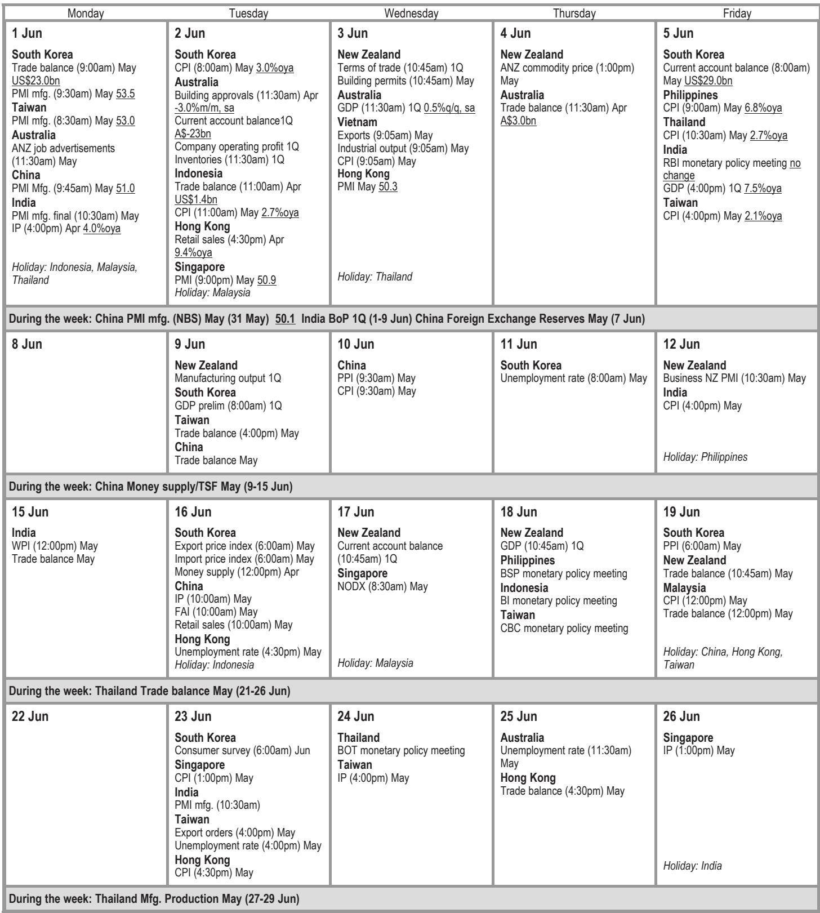
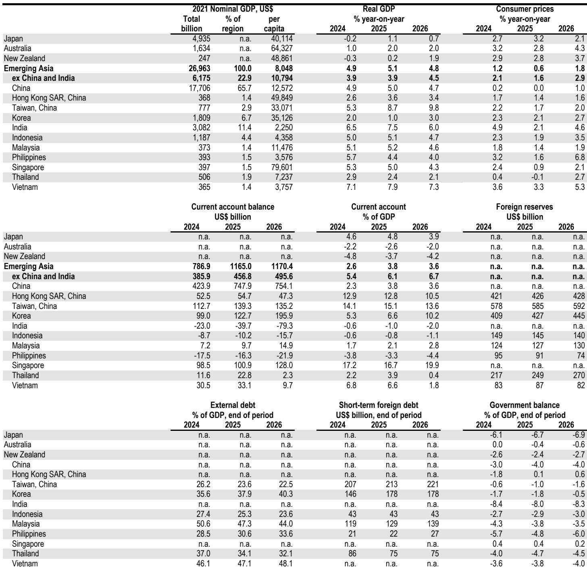
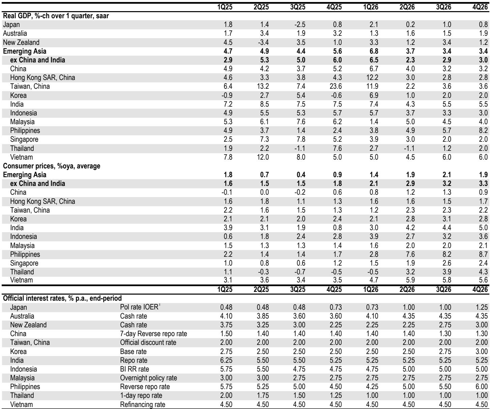

# Asia’s Energy Resilience Is Not a Victory—It Is a Policy Trap That Forces Central Banks to Choose Between Growth and Credibility

The conventional wisdom heading into this year was clear: a prolonged closure of the Strait of Hormuz would cripple Asia, the region most dependent on Middle Eastern energy flows. That scenario has not materialized. Emergency procurement, strategic reserve drawdowns, and fuel switching have kept tanker imports in EMAX economies and India near normal levels by May. Activity has held up better than feared, and tech-driven export momentum has even accelerated. But this resilience has come at a direct cost: inflation pressures are building across input and output prices, and central banks are now being forced into a hawkish posture that will reshape the region’s growth trajectory. The real story is not that Asia escaped the energy shock. It is that the escape has created a new, more insidious policy dilemma. Central banks that were preparing to defend growth must now decide whether to preemptively tighten into a still-fragile expansion—and the data suggests they are choosing inflation credibility over output support.

The implications are strategic, not cyclical. The Bank of Korea has already signaled a rate hike as early as July, with four 25-basis-point increases penciled in over the next year. The BSP and Bank of Indonesia have acted. Only the Reserve Bank of India appears to be holding the line, betting that core inflation will remain benign. This divergence is not random. It reflects fundamental differences in each economy’s exposure to the energy shock, the strength of its tech cycle, and the credibility of its inflation targeting framework. For investors and policymakers, the critical question is no longer whether Asia can survive the energy shock. It is whether the resulting monetary tightening will become the dominant drag on growth in the second half of the year, and which economies are most vulnerable to that second-order effect.

## EMAX Economies Have Successfully Diversified Energy Supply, But the Cost of That Diversification Is Now Showing Up in Inflation Data

The headline resilience of EMAX energy imports is a genuine achievement. Daily tanker data shows that May import volumes in economies like Indonesia and the Philippines are rapidly approaching normal levels. But this achievement has required aggressive procurement from non-Middle Eastern sources, the depletion of national strategic reserves, and a shift toward coal and biofuels. Each of these strategies carries a direct inflationary cost. Alternative suppliers charge a premium. Reserve drawdowns must eventually be replenished, often at higher prices. And fuel switching to coal and biofuels pushes up domestic energy costs, especially in economies where those markets are less liquid or more regulated.

The April PMI data already reflects this pressure. Input prices are surging across the region, and output prices are following. This is not a transient supply-side shock that will fade as logistics normalize. It is a structural increase in the cost of energy procurement that will persist as long as the Strait of Hormuz remains contested. The Bank of Korea’s hawkish shift is the most explicit acknowledgment of this reality. The bank’s forward guidance now points to a rate hike as early as July, with additional tightening through next year. The logic is straightforward: sustained growth momentum, particularly from the tech sector, is creating demand-side inflation pressures on top of the supply-side energy shock. The combination is too dangerous to ignore.

The strategic takeaway is that the energy shock has not been absorbed—it has been transformed. What began as a supply disruption has become a persistent cost-push inflation driver. Central banks that were hoping for a temporary spike are now realizing that the inflation data will not self-correct. The only question is how aggressively they will respond.

## Korea’s Hawkish Pivot Is the Canary in the Coal Mine for Tech-Driven Asian Economies

Korea is the most instructive case because it combines the region’s strongest tech export cycle with the clearest inflation signal. The Bank of Korea’s decision to keep rates on hold at its latest meeting was a tactical pause, not a strategic one. The accompanying statement was unambiguous: the bank now expects to begin hiking in July and to continue tightening through next year. The revised forecast of four 25-basis-point hikes over the next twelve months, compared to a previous call for only 50 basis points through the end of 2027, represents a dramatic acceleration.

The driving force behind this shift is the tech sector. Korea’s semiconductor and electronics exports have been a bright spot, and April industrial production data confirmed that the momentum is broadening. The central bank’s concern is that this growth will spill over into demand-side inflation, compounding the energy-driven cost pressures already visible in the PMIs. This is a classic overheating risk, and the central bank is choosing to get ahead of it.

For other tech-dependent economies in the region, Korea’s path is a template. Taiwan, Singapore, and Vietnam all have significant tech exposure and are likely to face similar dynamics. The key variable is the speed at which domestic demand responds to export-driven income growth. If tech exports continue to accelerate, the risk of demand-side inflation will rise, and central banks will have little choice but to follow Korea’s lead. The implication is that the region’s strongest growth engines are also the ones most likely to face monetary tightening, creating a self-limiting cycle.

## India’s Patience Is a Bet on Core Inflation Staying Benign—A Bet That Deserves Scrutiny

The Reserve Bank of India stands out as the most dovish major central bank in the region. The governor has explicitly stated that the RBI will only react if energy pressures spill into core inflation, and with core inflation currently benign, the bank is expected to remain on hold at its next review. Markets are pricing in multiple hikes, but the RBI is betting that the energy shock will remain contained to fuel and food prices.

This is a high-stakes gamble. India imports a significant share of its energy needs, and the cost of alternative procurement is likely to be higher than for some EMAX economies that have more diversified supply relationships. The RBI’s logic is that core inflation—which excludes volatile food and energy prices—is the right metric for assessing underlying demand pressures. But if energy costs persist, they will eventually feed into transportation, logistics, and industrial input prices, pushing up core inflation over time.

The RBI’s patience may be justified if the energy shock proves temporary. But if the Strait of Hormuz disruption extends into the second half of the year, the RBI will be forced into a catch-up tightening cycle that could be more disruptive than a preemptive move. The critical question is whether the RBI’s inflation targeting framework has enough credibility to tolerate a period of above-target headline inflation while waiting for core to move. History suggests that central banks that wait too long often end up tightening more aggressively later.

## The Report Leaves a Critical Question Unanswered: How Will China’s Fiscal and Monetary Patience Interact With the Region’s Hawkish Shift?

The report’s analysis of China is notably cautious. April data showed softness in domestic demand, with oil supply disruptions pushing processed oil and petrochemical output into contraction. Fiscal support has been less frontloaded than expected, and fiscal deposits actually jumped in April, suggesting that the government is not rushing to stimulate. Exports have remained resilient, but the composition is shifting toward less labor-intensive categories like memory ICs, EVs, and solar panels.

The open question is whether China’s policy patience will persist as the rest of the region tightens. If China maintains its current stance, it will face a growing divergence between its own easing bias and the hawkish tilt of its neighbors. This could create currency pressures, capital flow volatility, and a competitive disadvantage for Chinese exporters. Alternatively, if China decides to accelerate fiscal stimulus in the second half, it could offset some of the regional tightening by boosting demand for Asian inputs. But the report does not provide a clear answer on which path China will take.

This uncertainty has direct implications for investors. A China that maintains policy patience will likely see continued domestic weakness, which will weigh on regional demand for commodities and intermediate goods. A China that pivots to stimulus could reignite inflation pressures and complicate the region’s monetary policy calculus. The lack of clarity on this point is the report’s most significant analytical gap.

## A Decision Framework for Investors: Three Scenarios for Asia’s Monetary Policy Divergence

The report’s data supports three distinct scenarios for the region’s monetary policy trajectory. Investors should use this framework to position their portfolios.

Scenario One: Coordinated Tightening. If the energy shock persists and tech momentum remains strong, central banks across the region will follow Korea’s lead. This scenario implies higher rates across EMAX economies, with the RBI eventually joining the hawkish camp as core inflation rises. The winners in this scenario are economies with strong current account surpluses and low external debt, such as Taiwan and Singapore. The losers are economies with high external debt and weak fiscal positions, such as the Philippines and Vietnam.

Scenario Two: Divergent Tightening. If the energy shock moderates but tech momentum remains strong, the divergence will widen. Korea and Taiwan will tighten, while India and Indonesia may hold. This scenario creates opportunities for carry trades in economies that maintain relatively dovish stances, but it also increases the risk of currency volatility. Investors will need to hedge FX exposure carefully.

Scenario Three: Growth Shock. If the energy shock intensifies or a second wave of disruption hits, the region could face a growth shock that overwhelms inflation concerns. In this scenario, central banks would be forced to pause or reverse tightening, prioritizing output support over price stability. This is the tail risk that the report does not fully explore, but it is the scenario that would most disrupt current positioning.

Each scenario requires a different portfolio allocation. The report’s value is that it provides the data to assess which scenario is most likely, but the decision ultimately rests on how the Strait of Hormuz situation evolves and how China responds.

## The Full Report Contains the Charts and Data You Need to Make These Decisions

The analysis above is based on a detailed regional research report that includes tanker import data, PMI breakdowns, central bank forward guidance, and fiscal policy tracking. The original charts show the trajectory of EMAX and Indian energy imports, the evolution of inflation pressures, and the specific data points that underpin the Bank of Korea’s hawkish shift. These are not abstract forecasts. They are real-time measurements of how the region is responding to a genuine geopolitical shock.

Join the community to read the full report and review the original charts. The data will help you assess which scenario is unfolding and adjust your portfolio accordingly. The energy shock is not over. It has simply entered a new phase. Understanding the policy response is the key to navigating it.

*This article is for learning and discussion only and does not constitute investment advice.*

Personal reading notes and learning share only. Not investment advice.

