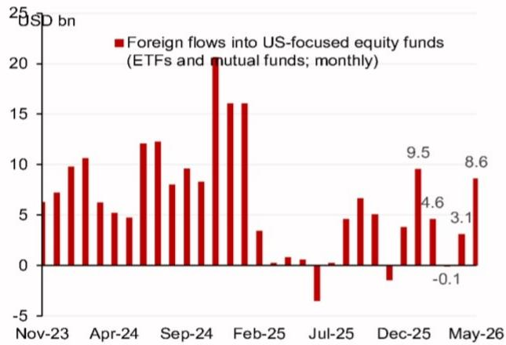
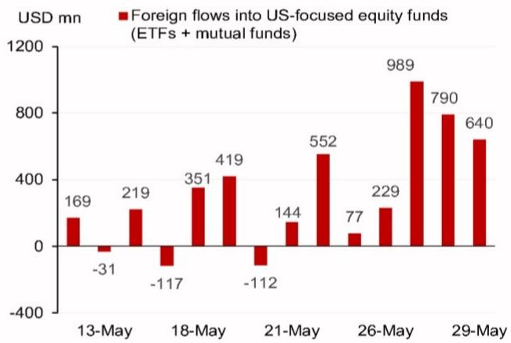
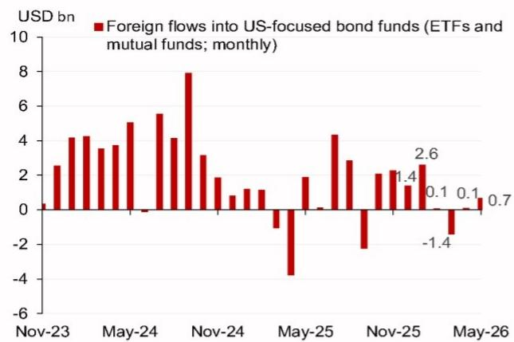
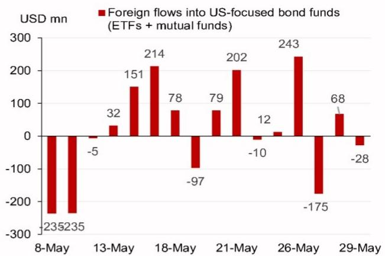
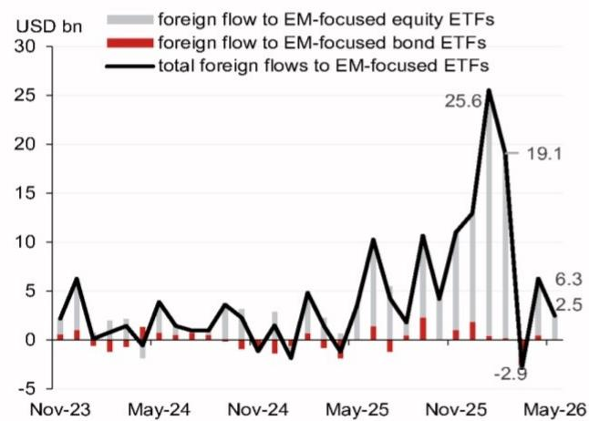
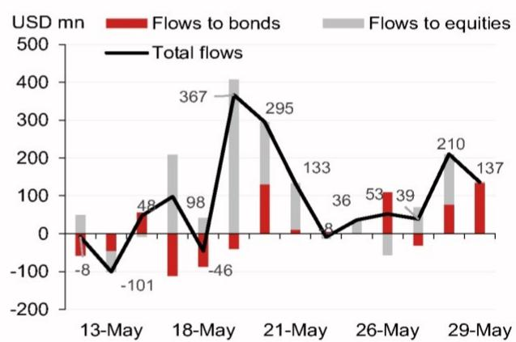
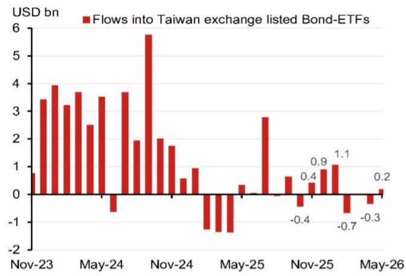
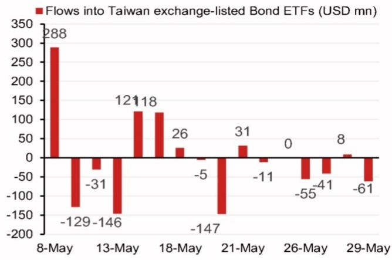
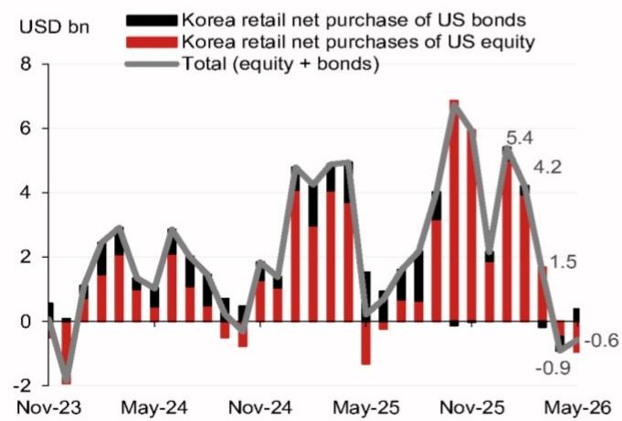
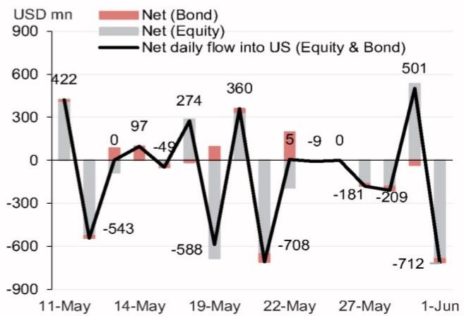

# FX Insights

Global Markets Research

2 June 2026

Foreign Exchange - Asia ex-Japan

# Inflows to US equities accelerated with the AI boom in focus

- Foreign inflows into US-focused funds accelerated to USD2.8bn between 23 and 29 May, predominantly into equity funds.   
- Specifically, inflows into US-focused equity funds accelerated to USD2.7bn, while inflows to bond funds were slower at USD120mn over the same period.   
- Inflows to EM-focused ETFs slowed to USD475mn between 23 and 29 May from inflows of USD741mn over the previous week.   
- Korea's retail investor net sold USD601mn of US portfolio assets between 26 May and 1 June. April and May 2026 marked the first two consecutive months of selling since June 2023.   
- Taiwan's investors net sold USD149mn of USD-denominated bond funds between 23 and 29 May, which compares with net selling of USD106mn over the previous week.

# Research Analysts

# Asia FX Strategy

Craig Chan - NSL

craig.chan@NOM.com

+65 6433 6106

Wee Choon Teo - NSL

weechoon.teo@NOM.com

+65 6433 6107

Vicky Chen - NSL

vicky.chen1@NOM.com

+65 6433 6540

Manthan Shingala - NSL

manthan.shingala1@NOM.com

+65 6433 6427

Fig. 1: Summary of flows into US securities 

<table><tr><td></td><td colspan="3">Foreign investments in US-focused funds (ETF and MF)</td><td colspan="3">EM-focused ETFs</td><td colspan="3">Korea retail investments</td><td>Taiwan investments in local ETFs</td></tr><tr><td>USD mn</td><td>US Equities</td><td>US Bonds</td><td>Total</td><td>Equity funds</td><td>Bond funds</td><td>Total</td><td>US Equities</td><td>US Bonds</td><td>Total</td><td>USD-denominated Bonds</td></tr><tr><td>Latest week (5 sessions)</td><td>2,725</td><td>120</td><td>2,845</td><td>184</td><td>291</td><td>475</td><td>-501</td><td>-101</td><td>-601</td><td>-149</td></tr><tr><td>Previous week (previous 5 sessions)</td><td>1,354</td><td>252</td><td>1,606</td><td>721</td><td>19</td><td>741</td><td>-1,197</td><td>257</td><td>-940</td><td>-106</td></tr><tr><td>Monthly flow in May</td><td>8,599</td><td>688</td><td>9,287</td><td>2,418</td><td>44</td><td>2,463</td><td>-940</td><td>372</td><td>-568</td><td>186</td></tr><tr><td>Monthly flow in April</td><td>3,094</td><td>103</td><td>3,197</td><td>5,832</td><td>453</td><td>6,285</td><td>-469</td><td>-441</td><td>-910</td><td>-342</td></tr><tr><td>Monthly flow in March</td><td>-118</td><td>-1,412</td><td>-1,529</td><td>-237</td><td>-2,645</td><td>-2,882</td><td>1,691</td><td>-166</td><td>1,525</td><td>-29</td></tr><tr><td>Monthly flow in February</td><td>4,586</td><td>74</td><td>4,661</td><td>18,920</td><td>184</td><td>19,104</td><td>3,949</td><td>257</td><td>4,206</td><td>-662</td></tr><tr><td>Monthly flow in January</td><td>9,549</td><td>2,618</td><td>12,168</td><td>25,150</td><td>401</td><td>25,551</td><td>5,003</td><td>396</td><td>5,399</td><td>1,065</td></tr></table>

Note: Note: The latest weekly data are up to 29 May for US equity and bond-focused ETFs and mutual funds, 29 May for EM-focused ETFs, 1 June for Korea retail investors and 29 May for Taiwan investors. Data for the previous week are the preceding 5 sessions of the latest week.  
Source: Bloomberg, KSD, NOM

# Weekly update of high-frequency investor flows

\- Foreign inflows into US-focused equity ETFs and mutual funds[1] totaled USD2.7bn between 23 and 29 May (Figure 3), accelerating from inflows of USD1.4bn over the previous week. In May, inflows into these funds totaled USD8.6bn, the highest since USD9.5bn in January 2026 (Figure 2).

\- Foreign inflows into US-focused bond ETFs and mutual funds $^{[2]}$ were limited at USD120mn between 23 and 29 May, slowing slightly from inflows of USD252mn in the previous week (Figure 5). In May, inflows into these funds totaled USD688mn, following inflows of USD103mn in April 2026 (Figure 4).

\- Foreign inflows into EM-focused ETFs[3] slowed to USD475mn between 23 and 29 May from inflows of USD741mn over the previous week. In May, foreign investors net bought USD2.5bn of EM funds, down from USD6.3bn in April (Figures 6 and 7).
- Within EM-focused ETFs, inflows were concentrated in equity funds in May at USD2.4bn, while inflows to bond funds were flattish at only USD44mn.

\- Outflows from Taiwan's exchange-listed USD bond ETFs amounted to USD149mn (23 to 29 May), up from outflows of USD106mn over the previous week (Figure 9). In May, Taiwanese investors net bought USD186mn of USD denominated bonds, partially offsetting the USD342mn of selling in April (Figure 8).

\- Korean retail investors net sold USD601mn of US portfolio assets from 26 May to 1 June. This consisted of net selling of USD101mn of US bonds and USD501mn of US equities (Figures 10 and 11). In May, Korea's retail investors net sold USD568mn of US portfolio assets, after net selling USD910mn of US portfolio assets in April 2026. This is the first time since June 2023 that Korea's retail investors have sold US portfolio assets for two consecutive months.

Fig. 2: Foreign flows into US-focused equity ETFs and mutual funds (monthly)   

bar

| Month    | Foreign flows into US-focused equity funds (ETFs and mutual funds; monthly) |
| -------- | ---------------------------------------------------------------------------------- |
| Nov-23   | 7.0                                                                              |
| Dec-23   | 10.0                                                                             |
| Jan-24   | 6.0                                                                              |
| Feb-24   | 5.0                                                                              |
| Mar-24   | 4.0                                                                              |
| Apr-24   | 12.0                                                                             |
| May-24   | 12.0                                                                             |
| Jun-24   | 8.0                                                                              |
| Jul-24   | 10.0                                                                             |
| Aug-24   | 8.0                                                                              |
| Sep-24   | 21.0                                                                             |
| Oct-24   | 16.0                                                                             |
| Nov-24   | 16.0                                                                             |
| Dec-24   | 3.0                                                                              |
| Jan-25   | 0.0                                                                              |
| Feb-25   | 0.0                                                                              |
| Mar-25   | 0.0                                                                              |
| Apr-25   | 0.0                                                                              |
| May-25   | -3.0                                                                             |
| Jun-25   | 0.0                                                                              |
| Jul-25   | 0.0                                                                              |
| Aug-25   | 4.0                                                                              |
| Sep-25   | 6.0                                                                              |
| Oct-25   | 5.0                                                                              |
| Nov-25   | -1.0                                                                             |
| Dec-25   | 3.0                                                                              |
| Jan-26   | 9.5                                                                              |
| Feb-26   | 4.6                                                                              |
| Mar-26   | 3.1                                                                              |
| Apr-26   | 8.6                                                                              |

Source: Bloomberg, NOM.

Fig. 3: Foreign flows into US-focused equity ETFs and mutual funds (daily)   

bar

Foreign flows into US-focused equity funds (ETFs + mutual funds)
| Date | Foreign flows into US-focused equity funds (USD mn) |
| :--- | :--- |
| 13-May | 169 |
| | -31 |
| 18-May | 219 |
| | -117 |
| 21-May | 351 |
| | 419 |
| 26-May | -112 |
| | 144 |
| 29-May | 552 |
| | 77 |
| | 229 |
| 26-May | 989 |
| | 790 |
| 29-May | 640 |

Source: Bloomberg, NOM.

Fig. 4: Foreign flows into US-focused bond ETFs and mutual funds (monthly)   

bar

| Date | Foreign flows into US-focused bond funds (ETFs and mutual funds; monthly) (USD bn) |
|---|---|
| Nov-23 | 0.1 |
| Dec-23 | 2.5 |
| Jan-24 | 4.2 |
| Feb-24 | 4.2 |
| Mar-24 | 3.5 |
| Apr-24 | 3.8 |
| May-24 | 5.0 |
| Jun-24 | -0.1 |
| Jul-24 | 5.5 |
| Aug-24 | 4.1 |
| Sep-24 | 7.9 |
| Oct-24 | 3.1 |
| Nov-24 | 1.8 |
| Dec-24 | 0.7 |
| Jan-25 | 1.1 |
| Feb-25 | -0.8 |
| Mar-25 | -3.8 |
| Apr-25 | 1.8 |
| May-25 | -0.1 |
| Jun-25 | 4.3 |
| Jul-25 | 2.8 |
| Aug-25 | -2.3 |
| Sep-25 | 2.0 |
| Oct-25 | 2.1 |
| Nov-25 | 1.4 |
| Dec-25 | 1.5 |
| Jan-26 | 2.6 |
| Feb-26 | -1.4 |
| Mar-26 | 0.1 |
| Apr-26 | 0.1 |
| May-26 | 0.7 |

Source: Bloomberg, NOM.

Fig. 5: Foreign flows into US-focused bond ETFs and mutual funds (daily)   

bar

| Date | Foreign flows into US-focused bond funds (ETFs + mutual funds) (USD mn) |
|---|---|
| 8-May | -235 |
| 13-May | -5 |
| 18-May | 32 |
| 21-May | 151 |
| 26-May | 214 |
| 29-May | -97 |
| 26-May | 78 |
| 21-May | 79 |
| 26-May | 202 |
| 29-May | 12 |
| 26-May | 1 |
| 29-May | -175 |
| 29-May | 68 |
| 29-May | -28 |

Source: Bloomberg, NOM.

Fig. 6: Foreign flows into EM-focused ETFs (Monthly)   

line

| Date    | foreign flow to EM-focused equity ETFs (USD bn) | foreign flow to EM-focused bond ETFs (USD bn) | total foreign flows to EM-focused ETFs (USD bn) |
|---------|--------------------------------------------------|-----------------------------------------------|------------------------------------------------|
| Nov-23  | 0                                                | 0                                             | 2.5                                            |
| May-24  | 0                                                | 0                                             | 6.3                                            |
| Nov-24  | 0                                                | 0                                             | 0                                              |
| May-25  | 0                                                | 0                                             | 10.0                                           |
| Nov-25  | 0                                                | 0                                             | 25.6                                           |
| May-26  | 0                                                | 0                                             | -2.9                                           |

Source: Bloomberg, NOM

Fig. 7: Foreign flows into EM-focused ETFs (Daily)   

bar_line

| Date | Flows to bonds (USD mn) | Flows to equities (USD mn) | Total flows (USD mn) |
|---|---|---|---|
| 13-May | -8 | 50 | -101 |
| | | -101 | 48 |
| 18-May | -46 | 207 | 98 |
| | | 407 | 367 |
| 21-May | 8 | 133 | 295 |
| | | 36 | 8 |
| 26-May | 53 | -60 | 53 |
| | | 39 | 39 |
| 29-May | 137 | 100 | 210 |
Total flows (black line) = Flows to bonds + Flows to equities (gray bars) (USD mn) (line) (black line).

Source: Bloomberg, NOM

Fig. 8: Taiwan flows into ETFs invested in USD bonds (monthly)   

bar

| Date    | Flows (USD bn) |
|---------|----------------|
| Nov-23  | 0.7            |
|         | 3.4            |
|         | 3.9            |
|         | 3.2            |
|         | 3.7            |
|         | 2.5            |
|         | 3.5            |
| May-24  | -0.7           |
|         | 3.7            |
|         | 1.9            |
|         | 5.8            |
|         | 2.0            |
|         | 1.7            |
|         | 0.5            |
|         | 0.9            |
|         | -1.2           |
|         | -1.5           |
| May-25  | -1.7           |
|         | 0.3            |
|         | 2.8            |
|         | -0.4           |
|         | 0.6            |
|         | -0.4           |
|         | 0.4            |
|         | 0.9            |
|         | 1.1            |
|         | -0.7           |
|         | -0.3           |
| May-26  | 0.2            |

Source: Bloomberg, NOM.

Fig. 9: Taiwan flows into ETFs invested in USD bonds (daily)   

bar

Flows into Taiwan exchange-listed Bond ETFs (USD mn)
| Date | Flows into Taiwan exchange-listed Bond ETFs (USD mn) |
| :--- | :--- |
| 8-May | 288 |
| 13-May | -129 |
| 13-May | -31 |
| 13-May | -146 |
| 18-May | 121 |
| 18-May | 118 |
| 18-May | 26 |
| 18-May | -5 |
| 21-May | -147 |
| 21-May | 31 |
| 21-May | -11 |
| 26-May | 0 |
| 26-May | -55 |
| 26-May | -41 |
| 29-May | 8 |
| 29-May | -61 |

Source: Bloomberg, NOM.

Fig. 10: Korea retail flows into US equities and bonds (monthly)   

bar_line

| Date | Korea retail net purchase of US bonds (USD bn) | Korea retail net purchases of US equity (USD bn) | Total (equity + bonds) (USD bn) |
| :--- | :--- | :--- | :--- |
| Nov-23 | -0.5 | -1.8 | -1.9 |
| May-24 | 0.8 | 1.5 | 2.8 |
| Nov-24 | 0.5 | -0.5 | 1.7 |
| May-25 | 1.5 | -1.5 | 4.8 |
| Nov-25 | 0.0 | 6.8 | 6.8 |
| May-26 | -0.9 | -0.6 | 4.2 |

Source: KSD, NOM.

Fig. 11: Korea retail flows into US equities and bonds (daily)   

line

| Date     | Net (Bond) | Net (Equity) | Net daily flow into US (Equity & Bond) |
| -------- | ---------- | ------------ | -------------------------------------- |
| 11-May   | 422        |              | -543                                   |
| 14-May   | 0          | 97           | -49                                    |
| 19-May   | 274        | -588         | 360                                    |
| 22-May   | 5          | -708         | -9                                     |
| 27-May   | -181       | -209         | 0                                      |
| 1-Jun    | -712       |              | 501                                    |

Source: KSD, NOM.

1. Our proxy for tracking foreign flows into US-focused equity funds is based on the assumption that US-focused funds listed/domiciled in non-US based markets are primarily invested in by non-US based retail and institutional investors.   
2. Our proxy for tracking foreign flows into US bond funds is based on the assumption that US-focused funds listed on non-US based markets are primarily invested in by non-US based retail and institutional investors.   
3. Our proxy for tracking foreign flows into EM-focused funds is based on the assumption that EM-focused funds listed in non-EM markets are primarily invested in by foreign investors.

# Appendix A-1

This report has been produced by NOM Singapore Ltd. (NSL), Singapore.

See Disclaimers for NOM Group entity details.

# Analyst Certification

We, Craig Chan, Wee Choon Teo, Vicky Chen and Manthan Shingala, hereby certify (1) that the views expressed in this Research report accurately reflect our personal views about any or all of the subject securities or issuers referred to in this Research report, (2) no part of our compensation was, is or will be directly or indirectly related to the specific recommendations or views expressed in this Research report and (3) no part of our compensation is tied to any specific investment banking transactions performed by NOM Securities International, Inc., NOM International plc or any other NOM Group company.

# Important Disclosures

# Online availability of research and conflict-of-interest disclosures

NOM Group research is available on www.NOMnow.com/research, Bloomberg, Capital IQ, Factset, LSEG.

Important disclosures may be read at http://go.NOMnow.com/research/m/Disclosures or requested from NOM Securities International, Inc. If you have any difficulties with the website, please email grpsupport@NOM.com for help.

The analysts responsible for preparing this report have received compensation based upon various factors including the firm's total revenues, a portion of which is generated by Investment Banking activities. Unless otherwise noted, the non-US analysts listed at the front of this report are not registered/qualified as research analysts under FINRA rules, may not be associated persons of NSI, and may not be subject to FINRA Rule 2241 restrictions on communications with covered companies, public appearances, and trading securities held by a research analyst account.

NOM Global Financial Products Inc. (NGFP) NOM Derivative Products Inc. (NDP) and NOM International plc. (NIplc) are registered with the Commodities Futures Trading Commission and the National Futures Association (NFA) as swap dealers. NGFP, NDPI, and NIplc are generally engaged in the trading of swaps and other derivative products, any of which may be the subject of this report.

# ADDITIONAL DISCLOSURES REQUIRED IN THE U.S.

Principal Trading: NOM Securities International, Inc and its affiliates will usually trade as principal in the fixed income securities (or in related derivatives) that are the subject of this research report. Analyst Interactions with other NOM Securities International, Inc. Personnel: The fixed income research analysts of NOM Securities International, Inc and its affiliates regularly interact with sales and trading desk personnel in connection with obtaining liquidity and pricing information for their respective coverage universe.

# Valuation methodology - Fixed Income

NOM's Fixed Income Strategists express views on the price of securities and financial markets by providing trade recommendations. These can be relative value recommendations, directional trade recommendations, asset allocation recommendations, or a mixture of all three.

The analysis which is embedded in a trade recommendation would include, but not be limited to:

\- Fundamental analysis regarding whether a security's price deviates from its underlying macro- or micro-economic fundamentals.

• Quantitative analysis of price variations.

\- Technical factors such as regulatory changes, changes to risk appetite in the market, unexpected rating actions, primary market activity and supply/ demand considerations.

The timeframe for a trade recommendation is variable. Tactical ideas have a short timeframe, typically less than three months. Strategic trade ideas have a longer timeframe of typically more than three months.

For the purposes of the EU Market Abuse Regulation, the distribution of ratings published by NOM Global Fixed Income Research is as follows:

52% have been assigned a Buy (or equivalent) rating; 50% of issuers with this rating were supplied material services\* by the NOM Group\*\*.
0% have been assigned a Neutral (or equivalent) rating.

48% have been assigned a Sell (or equivalent) rating; 50% of issuers with this rating were supplied material services by the NOM Group. As at 31 Mar 2026.

\*As defined by the EU Market Abuse Regulation

\*\*The NOM Group as defined in the Disclaimer section at the end of this report

# Disclaimers

This publication contains material that has been prepared by the NOM Group entity identified on page 1 and, if applicable, with the contributions of one or more NOM Group entities whose employees and their respective affiliations are specified on page 1 or identified elsewhere in this publication. The term "NOM Group" used herein refers to NOM Holdings, Inc. and its affiliates and subsidiaries including: (a) NOM Securities Co., Ltd. ('NSC') Tokyo, Japan, (b) NOM Financial Products Europe GmbH ('NFPE'), Germany, (c) NOM International plc ('NIplc'), UK, (d) NOM Securities International, Inc. ('NSI'), New York, US, (e) NOM International (Hong Kong) Ltd.

('NIHK'), Hong Kong, (f) NOM Financial Investment (Korea) Co., Ltd. ('NFIK'), Korea (Information on NOM analysts registered with the Korea Financial Investment Association ('KOFIA') can be found on the KOFIA Intranet at http://dis.kofia.or.kr, (g) NOM Singapore Ltd. ('NSL'), Singapore (Registration number 197201440E, regulated by the Monetary Authority of Singapore) (h) NOM Australia Ltd. ('NAL'), Australia (ABN 48 003 032 513), regulated by the Australian Securities and Investment Commission ('ASIC') and holder of an Australian financial services licence number 246412, (i) NOM Securities Malaysia Sdn. Bhd. ('NSM'), Malaysia, (j) NIHK, Taipei Branch ('NITB'), Taiwan, (k) NOM Financial Advisory and Securities (India) Private Limited ('NFASL'), Mumbai, India (Registered Address: Ceejay House, Level 11, Plot F, Shivsagar Estate, Dr. Annie Besant Road, Worli, Mumbai- 400 018, India; Tel: 91 22 4037 4037, Fax: 91 22 4037 4111; CIN No: U74140MH2007PTC169116, SEBI Registration No. for Stock Broking activities : INZ000255633; SEBI Registration No. for Merchant Banking : INM000011419; SEBI Registration No. for Research: INH000001014 - Compliance Officer: Ms. Pratiksha Tondwalkar, 91 22 40374904, grievance email: investorgrievancesra@NOM.com Webpage: LINK

For reports with respect to Indian public companies or authored by India-based NFASL research analysts: (i) Investment in securities markets is subject to market risks. Read all the related documents carefully before investing. (ii) Registration granted by SEBI, and certification from NISM in no way guarantee performance of the intermediary or provide any assurance of returns to investors. (iii) NFASL terms and conditions for availing research services is disclosed on NFASL webpage.

(I) NOM Fiduciary Research & Consulting Co., Ltd. ('NFRC') Tokyo, Japan. (m) NOM Orient International Securities Co., Ltd ("NOI"), is a majority owned joint venture amongst NOM Group, Orient International (Holding) Co., Ltd, and Shanghai Huangpu Investment Holding (Group) Co., Ltd. In accordance with the laws of the People's Republic of China ("PRC", excluding Hong Kong, Macau and Taiwan, for the purpose of this document), NOI is licensed in the PRC to provide securities research and investment recommendations and it operates independently from the other members of the NOM Group; in particular, NOI's interests in PRC securities are not disclosed to, or aggregated with the holdings of, any other NOM Group entities and the interests in PRC securities of other NOM Group entities are not disclosed to, or aggregated with the holdings of, NOI. An individual name printed next to NOI on the front page of a research report indicates that individual is employed by NOI to provide research assistance to NIHK under a research partnership agreement. 'NSFSPL' next to an employee's name on the front page of a research report indicates that the individual is employed by NOM Structured Finance Services Private Limited to provide assistance to certain NOM entities under inter-company agreements. 'Verdhana' next to an individual's name on the front page of a research report indicates that the individual is employed by PT Verdhana Sekuritas Indonesia ('Verdhana') to provide research assistance to NIHK under a research partnership agreement and neither Verdhana nor such individual is licensed outside of Indonesia.

THIS MATERIAL IS: (I) FOR YOUR PRIVATE INFORMATION, AND WE ARE NOT SOLICITING ANY ACTION BASED UPON IT; (II) NOT TO BE CONSTRUED AS AN OFFER TO SELL OR A SOLICITATION OF AN OFFER TO BUY ANY SECURITIES IN ANY JURISDICTION WHERE SUCH OFFER OR SOLICITATION WOULD BE ILLEGAL; AND (III) OTHER THAN DISCLOSURES RELATING TO THE NOM GROUP, BASED UPON INFORMATION FROM SOURCES THAT WE CONSIDER RELIABLE, BUT HAS NOT BEEN INDEPENDENTLY VERIFIED BY NOM GROUP.

Other than disclosures relating to the NOM Group, the NOM Group does not warrant, represent or undertake, express or implied, that the document is fair, accurate, complete, correct, reliable or fit for any particular purpose or merchantable, and to the maximum extent permissible by law and/or regulation, does not accept liability (in negligence or otherwise, and in whole or in part) for any act (or decision not to act) resulting from use of this document and related data. To the maximum extent permissible by law and/or regulation, all warranties and other assurances by the NOM Group are hereby excluded and the NOM Group shall have no liability (in negligence or otherwise, and in whole or in part) for any loss howsoever arising from the use, misuse, or distribution of this material or the information contained in this material or otherwise arising in connection therewith.

Opinions or estimates expressed are current opinions as of the original publication date appearing on this material and the information, including the opinions and estimates contained herein, are subject to change without notice. The NOM Group, however, expressly disclaims any obligation, and therefore is under no duty, to update or revise this document. Any comments or statements made herein are those of the author(s) and may differ from views held by other parties within NOM Group. Clients should consider whether any advice or recommendation in this report is suitable for their particular circumstances and, if appropriate, seek professional advice, including tax advice. The NOM Group does not provide tax advice.

The NOM Group, and/or its officers, directors, employees and affiliates, may, to the extent permitted by applicable law and/or regulation, deal as principal, agent, or otherwise, or have long or short positions in, or buy or sell, the securities, commodities or instruments, or options or other derivative instruments based thereon, of issuers or securities mentioned herein. The NOM Group companies may also act as market maker or liquidity provider (within the meaning of applicable regulations in the UK) in the financial instruments of the issuer. Where the activity of market maker is carried out in accordance with the definition given to it by specific laws and regulations of the US or other jurisdictions, this will be separately disclosed within the specific issuer disclosures.

This document may contain information obtained from third parties, including, but not limited to, ratings from credit ratings agencies such as Standard & Poor's. The NOM Group hereby expressly disclaims all representations, warranties or undertakings of originality, fairness, accuracy, completeness, correctness, merchantability or fitness for a particular purpose with respect to any of the information obtained from third parties contained in this material or otherwise arising in connection therewith, and shall not be liable (in negligence or otherwise, and in whole or in part) for any direct, indirect, incidental, exemplary, compensatory, punitive, special or consequential damages, costs, expenses, legal fees, or losses (including lost income or profits and opportunity costs) in connection with any use or misuse of any of the information obtained from third parties contained in this material or otherwise arising in connection therewith. Reproduction and distribution of third-party content in any form is prohibited except with the prior written permission of the related third-party. Third-party content providers do not, express or implied, guarantee the fairness, accuracy, completeness, correctness, timeliness or availability of any information, including ratings, and are not in any way responsible for any errors or omissions (negligent or otherwise), regardless of the cause, or for the results obtained from the use or misuse of such content. Third-party content providers give no express or implied warranties, including, but not limited to, any warranties of merchantability or fitness for a particular purpose or use. Third-party content providers shall not be liable (in negligence or otherwise, and in whole or in part) for any direct, indirect, incidental, exemplary, compensatory, punitive, special or consequential damages, costs, expenses, legal fees, or losses (including lost income or profits and opportunity costs) in connection with any use or misuse of their content, including ratings. Credit ratings are statements of opinions and are not statements of fact or recommendations to purchase hold or sell securities. They do not address the suitability of securities or the suitability of securities for investment purposes, and should not be relied on as investment advice. Any MSCI sourced information in this document is the exclusive property of MSCI Inc. ('MSCI'). Without prior written permission of MSCI, this information and any other MSCI intellectual property may not be duplicated, reproduced, re-disseminated, redistributed or used, in whole or in part, for any purpose whatsoever, including creating any financial products and any indices. This information is provided on an "as is" basis. The user assumes the entire risk of any use made of this information. MSCI, its affiliates and any third party involved in, or related to, computing or compiling the information hereby expressly disclaim all representations, warranties or undertakings of originality, fairness, accuracy, completeness, correctness, merchantability or fitness for a particular purpose with respect to any of this material or the information contained in this material or otherwise arising in connection therewith. Without limiting any of the foregoing, in no event shall MSCI, any of its affiliates or any third party involved in, or related to, computing or compiling the information have any liability (in negligence or otherwise, and in whole or in part) for any damages of any kind. MSCI and the MSCI indexes are services marks of MSCI and its affiliates.

The intellectual property rights and any other rights, in Russell/NOM Japan Equity Index belong to NOM Fiduciary Research & Consulting Co., Ltd. ("NFRC") and FTSE Russell ("Russell"). NFRC and Russell do not guarantee fairness, accuracy, completeness, correctness, reliability, usefulness, marketability, merchantability or fitness of the Index, and do not account for business activities or services that any index user and/or its affiliates undertakes with the use of the Index.

Investors should consider this document as only a single factor in making their investment decision and, as such, the report should not be viewed as identifying or suggesting all risks, direct or indirect, that may be associated with any investment decision. NOM Group produces a number of different types of research product including, among others, fundamental analysis and quantitative analysis; recommendations contained in one type of research product may differ from recommendations contained in other types of research product, whether as a result of differing time horizons, methodologies or otherwise. The NOM Group publishes research product in a number of different ways including the posting of product on the NOM Group portals and/or distribution directly to clients. Different groups of clients may receive different products and services from the research department depending on their individual requirements.

Figures presented herein may refer to past performance or simulations based on past performance which are not reliable indicators of future or likely performance. Where the information contains an expectation, projection or indication of future performance and business prospects, such forecasts may not be a reliable indicator of future or likely performance. Moreover, simulations are based on models and simplifying assumptions which may oversimplify and not reflect the future distribution of returns. Any figure, strategy or index created and published for illustrative purposes within this document is not intended for “use” as a “benchmark” as defined by the European Benchmark Regulation.

Certain securities are subject to fluctuations in exchange rates that could have an adverse effect on the value or price of, or income derived from, the investment.

With respect to Fixed Income Research: Recommendations fall into two categories: tactical, which typically last up to three months; or strategic, which typically last from 6-12 months. However, trade recommendations may be reviewed at any time as circumstances change. 'Stop loss' levels for trades are also provided; which, if hit, closes the trade recommendation automatically. Prices and yields shown in recommendations are taken at the time of submission for publication and are based on either indicative Bloomberg, LSEG or NOM prices and yields at that time. The prices and yields shown are not necessarily those at which the trade recommendation can be implemented.

The securities described herein may not have been registered under the US Securities Act of 1933 (the '1933 Act'), and, in such case, may not be offered or sold in the US or to US persons unless they have been registered under the 1933 Act, or except in compliance with an exemption from the registration requirements of the 1933 Act. Unless governing law permits otherwise, any transaction should be executed via a NOM entity in your home jurisdiction.

This document has been approved for distribution in the UK as investment research by NIplc. NIplc is authorised by the Prudential Regulation Authority and regulated by the Financial Conduct Authority and the Prudential Regulation Authority. NIplc is a member of the London Stock Exchange. This document does not constitute a personal recommendation within the meaning of applicable regulations in the UK, or take into account the particular investment objectives, financial situations, or needs of individual investors. This document is intended only for investors who are 'eligible counterparties' or 'professional clients' for the purposes of applicable regulations in the UK, and may not, therefore, be redistributed to persons who are 'retail clients' for such purposes.

This document has been approved for distribution in the European Economic Area as investment research by NOM Financial Products Europe GmbH ("NFPE"). NFPE is a company organized as a limited liability company under German law registered in the Commercial Register of the Court of Frankfurt/Main under HRB 110223. NFPE is authorized and regulated by the German Federal Financial Supervisory Authority (BaFin).

This document has been approved by NIHK, which is regulated by the Hong Kong Securities and Futures Commission, for distribution in Hong Kong by NIHK. This document is intended only for investors who are 'professional investors' for the purposes of applicable regulations in Hong Kong and may not, therefore, be redistributed to persons who are not 'professional investors' for such purposes.

This document has been approved for distribution in Australia by NAL, which is authorized and regulated in Australia by the ASIC. This document has also been approved for distribution in Malaysia by NSM.

In Singapore, this document has been distributed by NSL, an exempt financial adviser as defined under the Financial Advisers Act (Chapter 110), among other things, and regulated by the Monetary Authority of Singapore. NSL may distribute this document produced by its foreign affiliates pursuant to an arrangement under Regulation 32C of the Financial Advisers Regulations. This document is intended for accredited, expert or institutional investors as defined by the Securities and Futures Act (Chapter 289). Where the recipient of this document is not an accredited, expert or institutional investor, NSL accepts legal responsibility for the contents of this document in respect of such recipient only to the extent required by law. Recipients of this document in Singapore should contact NSL in respect of matters arising from, or in connection with, this document. THIS DOCUMENT IS INTENDED FOR GENERAL CIRCULATION. IT DOES NOT TAKE INTO ACCOUNT THE SPECIFIC INVESTMENT OBJECTIVES, FINANCIAL SITUATION OR PARTICULAR NEEDS OF ANY PARTICULAR PERSON. RECIPIENTS SHOULD

TAKE INTO ACCOUNT THEIR SPECIFIC INVESTMENT OBJECTIVES, FINANCIAL SITUATION OR PARTICULAR NEEDS BEFORE MAKING A COMMITMENT TO PURCHASE ANY SECURITIES, INCLUDING SEEKING ADVICE FROM AN INDEPENDENT FINANCIAL ADVISER REGARDING THE SUITABILITY OF THE INVESTMENT, UNDER A SEPARATE ENGAGEMENT, AS THE RECIPIENT DEEMS FIT. Unless prohibited by the provisions of Regulation S of the 1933 Act, this material is distributed in the US, by NSI, a US-registered broker-dealer, which accepts responsibility for its contents in accordance with the provisions of Rule 15a-6, under the US Securities Exchange Act of 1934. The entity that prepared this document permits its separately operated affiliates within the NOM Group to make copies of such documents available to their clients.

This document has not been approved for distribution to persons other than ‘Authorised Persons’, ‘Exempt Persons’ or ‘Institutions’ (as defined by the Capital Markets Authority) in the Kingdom of Saudi Arabia (‘Saudi Arabia’) or a ‘Market Counterparty’ or a ‘Professional Client’ (as defined by the Dubai Financial Services Authority) in the United Arab Emirates (‘UAE’) or a ‘Market Counterparty’ or a ‘Business Customer’ (as defined by the Qatar Financial Centre Regulatory Authority) in the State of Qatar (‘Qatar’) by NOM Saudi Arabia, NIplc or any other member of the NOM Group, as the case may be. Neither this document nor any copy thereof may be taken or transmitted or distributed, directly or indirectly, by any person other than those authorised to do so into Saudi Arabia or in the UAE or in Qatar or to any person other than ‘Authorised Persons’, ‘Exempt Persons’ or ‘Institutions’ located in Saudi Arabia or a ‘Market Counterparty’ or a ‘Professional Client’ in the UAE or a ‘Market Counterparty’ or a ‘Business Customer’ in Qatar. Any failure to comply with these restrictions may constitute a violation of the laws of the UAE or Saudi Arabia or Qatar.

For report with reference of TAIWAN public companies or authored by Taiwan based research analyst:

THIS DOCUMENT IS SOLELY FOR REFERENCE ONLY. You should independently evaluate the investment risks and are solely responsible for your investment decisions. NO PORTION OF THE REPORT MAY BE REPRODUCED OR QUOTED BY THE PRESS OR ANY OTHER PERSON WITHOUT WRITTEN AUTHORIZATION FROM NOM GROUP. Pursuant to Operational Regulations Governing Securities Firms Recommending Trades in Securities to Customers and/or other applicable laws or regulations in Taiwan, you are prohibited to provide the reports to others (including but not limited to related parties, affiliated companies and any other third parties) or engage in any activities in connection with the reports which may involve conflicts of interests. INFORMATION ON SECURITIES / INSTRUMENTS NOT EXECUTABLE BY NOM INTERNATIONAL (HONG KONG) LTD., TAIPEI BRANCH IS FOR INFORMATIONAL PURPOSES ONLY AND IS NOT BE CONSTRUED AS A RECOMMENDATION OR A SOLICITATION TO TRADE IN SUCH SECURITIES / INSTRUMENTS.

This material may not be distributed in Indonesia or passed on within the territory of the Republic of Indonesia or to persons who are Indonesian citizens (wherever they are domiciled or located) or entities of or residents in Indonesia in a manner which constitutes a public offering under the laws of the Republic of Indonesia. The securities mentioned in this document may not be offered or sold in Indonesia or to persons who are citizens of Indonesia (wherever they are domiciled or located) or entities of or residents in Indonesia in a manner which constitutes a public offering under the laws of the Republic of Indonesia.

An individual name printed next to NOI on the front page of a research report indicates that this document is a translation of a research report issued by NOI in the PRC. In all other cases, this document is prepared by NOM Group or its subsidiary or affiliate (collectively, “Offshore Issuers”) that is not licensed in the PRC to provide securities research. This research report is not approved or intended to be circulated in the PRC. The A-share related analysis (if any) is not produced for any persons located or incorporated in the PRC. The recipients should not rely on any information contained in this research report in making investment decisions and Offshore Issuers take no responsibility in this regard. NO PART OF THIS MATERIAL MAY BE (I) COPIED, PHOTOCOPIED, REPRODUCED OR DUPLICATED IN ANY FORM, BY ANY MEANS; OR (II) REDISSEMINATED, REPUBLISHED OR REDISTRIBUTED WITHOUT THE PRIOR WRITTEN CONSENT OF A MEMBER OF THE NOM GROUP. If this document has been distributed by electronic transmission, such as e-mail, then such transmission cannot be guaranteed to be secure or error-free as information could be intercepted, corrupted, lost, destroyed, arrive late or incomplete, or contain viruses. The sender therefore does not accept liability (in negligence or otherwise, and in whole or in part) for any errors or omissions in the contents of this document, which may arise as a result of electronic transmission. If verification is required, please request a hard-copy version.

The NOM Group manages conflicts with respect to the production of research through its compliance policies and procedures (including, but not limited to, Conflicts of Interest, Chinese Wall and Confidentiality policies) as well as through the maintenance of Chinese Walls and employee training.

Additional information regarding the methodologies or models used in the production of any investment recommendations contained within this document is available upon request by contacting the Research Analysts of NOM listed on the front page. Disclosures information is available upon request and disclosure information is available at the NOM Disclosure web page:

http://go.NOMnow.com/research/m/Disclosures

Copyright © 2026 NOM Singapore Ltd., Singapore. All rights reserved.