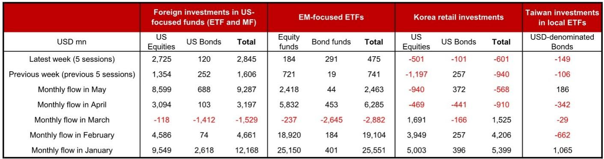

# The Great Rotation Is Not Pausing: Foreign Capital Is Doubling Down on US Equity Dominance While Asia Retail Retreats

The most consequential capital flow signal in the current macro environment is not the volume of money moving into US equities, but the asymmetry between foreign institutional conviction and Asian retail hesitation. In the week ending 29 May 2026, foreign inflows into US-focused funds accelerated to USD 2.8 billion, with equity funds absorbing USD 2.7 billion of that total. This represents a near-doubling from the previous week's USD 1.4 billion and pushes May's cumulative equity inflows to USD 8.6 billion, the highest monthly reading since January 2026. The direction is unambiguous: global allocators are treating US equities as the primary vehicle for AI-era exposure, and they are doing so with increasing urgency.

Yet beneath this headline lies a more nuanced and strategically important divergence. While foreign capital floods into US equity funds, Korean retail investors have now recorded two consecutive months of net selling of US portfolio assets for the first time since June 2023. Taiwanese investors are simultaneously reducing their USD-denominated bond fund holdings. The pattern suggests that sophisticated institutional capital is moving in one direction, while a portion of Asia's retail base is rotating out. Understanding who is right, and what this divergence implies for currency markets and portfolio construction, is the central analytical challenge of the current moment.

The data from the most recent weekly flow report reveals three structural themes that demand attention. First, the AI-driven equity narrative is overwhelming all other asset class preferences within US-focused flows. Second, emerging market fund flows are decelerating, and the composition of those flows is shifting toward a more cautious equity-only posture. Third, Asian retail behavior, particularly in Korea and Taiwan, is signaling a potential inflection in risk appetite that warrants close monitoring. Each of these themes carries implications for FX strategy, particularly for Asia ex-Japan currencies.

## The AI Narrative Has Collapsed All Other Investment Premises Into a Single US Equity Trade

The magnitude of the equity-bond divergence within US-focused flows is striking and deserves direct interpretation. In the latest week, equity inflows of USD 2.7 billion dwarfed bond inflows of just USD 120 million. This is not a temporary aberration; it is the culmination of a trend that has been building throughout May. Monthly equity inflows of USD 8.6 billion compare with bond inflows of only USD 688 million. The ratio of equity to bond flows is now approximately 12.5 to 1. For context, in January 2026, when total US-focused inflows were at their highest, the equity-to-bond ratio was roughly 3.6 to 1. The concentration has intensified dramatically.

The so-what here is that global investors are not making a general "risk-on" bet on the United States. They are making a specific, thesis-driven bet on a narrow set of outcomes: that AI-related productivity gains and earnings acceleration will be concentrated in US-listed technology and related sectors. Bond flows, by contrast, are being treated as an afterthought. This suggests that the prevailing macro narrative has shifted from a debate about interest rate trajectories or recession probabilities to a single-minded focus on structural growth differentials. For FX strategists, this means that USD strength is increasingly being driven by equity flow dynamics rather than by traditional rate differentials or safe-haven demand. The dollar is becoming a proxy for AI exposure.

The practical implication for Asia ex-Japan currencies is that traditional carry trade logic may be temporarily suspended. If capital continues to flow into US equities at this pace, Asian currencies will face persistent depreciation pressure regardless of local central bank policy rates. The question is whether this flow regime is sustainable, or whether it carries the seeds of its own reversal. The data from Asia's retail investors may provide an early warning signal.

## Emerging Market Fund Flows Are Slowing, and the Composition Reveals a Loss of Conviction

Foreign inflows into EM-focused ETFs slowed to USD 475 million in the latest week, down from USD 741 million in the prior week. Monthly flows in May totaled USD 2.5 billion, a sharp deceleration from April's USD 6.3 billion and a fraction of the USD 25.6 billion recorded in January. The deterioration is not just in volume but in composition. Within May's EM flows, equity funds absorbed USD 2.4 billion while bond funds managed only USD 44 million. This is a dramatic shift from April, when EM bond funds saw USD 453 million in inflows.

This pattern tells a specific story. Investors are not abandoning EM exposure entirely, but they are becoming highly selective. They are willing to buy EM equities, presumably those with AI or semiconductor exposure, but they are unwilling to commit to EM bonds. The reluctance to buy EM bonds likely reflects ongoing concerns about currency stability, fiscal sustainability, and the interest rate trajectories of EM central banks relative to the Federal Reserve. The message is clear: EM as a diversified allocation is out of favor, but EM as a targeted equity play on specific themes retains some appeal.

For Asia ex-Japan currencies, this is a bearish signal. EM bond flows have historically been a more stable and less speculative source of foreign capital, often providing a buffer during periods of equity market volatility. The absence of bond inflows means that Asian central banks have one fewer channel through which to support their currencies. If equity flows to EM also continue to decelerate, the pressure on regional currencies could intensify. The decoupling of equity and bond flows within EM is a vulnerability that portfolio managers should not ignore.

## Korean Retail Investors Are Sending a Warning Signal That Institutional Investors Should Heed

The most provocative data point in this report is the behavior of Korean retail investors. Between 26 May and 1 June, Korean retail investors net sold USD 601 million of US portfolio assets, consisting of USD 501 million in equities and USD 101 million in bonds. This followed net selling of USD 910 million in April. May and April 2026 mark the first two consecutive months of net selling since June 2023. Over the past three months, Korean retail investors have sold a cumulative USD 2.1 billion in US portfolio assets.

This matters because Korean retail investors have historically been a reliable and trend-following source of demand for US equities. Their willingness to sell for two consecutive months suggests a shift in sentiment that may be ahead of, rather than behind, institutional behavior. Korean retail investors are often characterized as late-cycle momentum chasers, but their recent selling may reflect a more sophisticated calculus: concerns about stretched valuations in US tech, a desire to lock in profits, or a rotation into domestic or other regional opportunities.

The analytical question is whether this retail selling is a contrarian buy signal or a leading indicator of broader risk aversion. The answer may depend on the catalyst. If Korean retail investors are selling because they have identified better relative value elsewhere, the impact on US equity flows may be limited. But if they are selling because of a generalized reduction in risk appetite, this could foreshadow a broader pullback that would affect institutional flows as well. The fact that Taiwanese investors are also net selling USD-denominated bond funds, albeit at a smaller scale, adds to the sense that Asia's retail base is turning cautious.

For FX markets, the Korean retail data is particularly relevant for the USD/KRW exchange rate. Korean investors selling US assets and potentially repatriating funds could provide some support for the won, but only if the selling is motivated by a rotation into domestic assets rather than a move to cash. The data does not yet allow us to distinguish between these two motivations, and that ambiguity is itself a risk factor.

## The Report Raises a Structural Question It Cannot Yet Answer: Is This a Regime Change or a Momentum Peak?

The flow data through late May paints a clear picture of institutional conviction, but it also raises a question that the report cannot fully resolve: are we witnessing a sustainable regime change in global capital allocation, or are we approaching a momentum peak that will be followed by a sharp reversal?

There are arguments on both sides. In favor of regime change: the AI investment cycle is still in its early stages, corporate earnings in the US technology sector continue to surprise to the upside, and the Federal Reserve has signaled a patient approach to rate cuts that reduces the risk of a disruptive policy error. Under this scenario, US equity inflows could continue to accelerate through the second half of 2026, and the dollar would remain strong against most Asian currencies.

In favor of a momentum peak: the concentration of flows into a narrow set of US equities creates valuation risk, the deceleration in EM fund flows suggests that global risk appetite is not unlimited, and the behavior of Korean retail investors may be a canary in the coal mine. Furthermore, the near-total absence of US bond inflows suggests that investors are not hedging their equity exposure with fixed income, leaving portfolios vulnerable to a sudden shift in risk sentiment. A correction in US tech stocks could trigger a rapid unwind of the very flows that have been supporting the dollar.

The data does not yet provide a clear answer, and that uncertainty is itself valuable information for strategic decision-making. The prudent approach is to monitor the weekly flow data for signs of deceleration in US equity inflows or an uptick in bond inflows, either of which would signal a shift in the prevailing narrative.

## A Decision Framework for Navigating the Current Flow Regime

For portfolio managers and FX strategists operating in Asia ex-Japan, the current flow environment demands a framework that goes beyond simple trend-following. The following three-part decision framework is designed to translate the weekly flow data into actionable positioning.

First, assess the direction of US equity flows relative to expectations. If weekly inflows continue to accelerate or hold above USD 2 billion, the dollar-bullish and Asia FX-bearish bias should be maintained. If inflows slow to below USD 1 billion for two consecutive weeks, this would be an early signal that the AI trade is losing momentum and that a tactical shift toward Asian currencies may be warranted.

Second, monitor the composition of EM fund flows. A recovery in EM bond inflows would be a more reliable signal of genuine risk appetite than continued equity-only flows. If EM bond flows turn positive and sustained, this would support a more constructive view on Asian currencies, particularly those with higher carry. If EM bond flows remain negligible, the risk of currency depreciation in the region remains elevated.

Third, track Korean retail flows as a sentiment indicator. If Korean retail investors shift from net selling to net buying of US assets, this would confirm that the recent selling was a tactical adjustment rather than a structural shift. Continued net selling for a third consecutive month would be a more serious warning signal and would justify reducing exposure to US equities and the dollar.

This framework is deliberately simple because the flow data is high-frequency and noisy. The goal is not to predict the future but to identify the conditions under which the current narrative would need to be revised. The most dangerous position in the current environment is to assume that the trend will continue indefinitely without monitoring the signals that would indicate a change.

## Join the Community to Read the Full Report and Review the Original Charts

The weekly flow data presented here is a window into the global capital allocation process, but it is only one piece of a larger puzzle. The full report includes detailed historical charts for US equity and bond flows, EM fund flows, and Asia retail investor activity dating back to 2023, allowing readers to contextualize the current readings within a multi-year framework. Understanding the baseline is essential for identifying inflection points. Join the community to read the full report and review the original charts. The data tells a story, but the most valuable insights come from the questions it leaves unanswered.

*This article is for learning and discussion only and does not constitute investment advice.*

Personal reading notes and learning share only. Not investment advice.

