# China Metals Activity Tracker

Copper consumption slows, aluminum picks up. Mysteel analysis of China's new rules for steel capacity replacement

We present our high-frequency inventory trends for base metals, steel and iron ore in China for the week ended 29 May'26. Our data plots China weekly metals inventory trends, a proxy for consumption. Copper recorded a fifth consecutive week of weak destocking (-3kt); although this marks a slowdown vs exceptionally strong consumption across March-April, slower destocking is consistent with normal seasonality. Aluminum shows greater momentum and has moved into a destocking phase (-16kt), albeit running slightly slower vs normal seasonality. Despite slower copper consumption, China's total copper inventories remain low vs historic seasonality at just \~200kt. Conversely, total aluminium inventories are significantly above historic seasonality and very high at 1.4Mt.

Most noteworthy from Mysteel's weekly data, is a $\sim 19\%$ increase in weekly global iron ore shipments (+6Mt), and $\sim 19\%$ increase YoY, with Australia $+20\%$ WoW and Brazil $+30\%$ WoW. Mysteel report flat iron ore volumes at China ports (171Mt).

Weak metals drawdowns suggest slowing China metals consumption, after an exceptionally strong reopening post China New Year. JPM China Economists noted last week that China's April fiscal expenditure saw a decline in fixed asset investments (-18.6% YoY in infrastructure), but weaker growth data may imply additional fiscal support in H2'26 (link). China PMI for May declined to 50.0 (JPMe 50.1) from 50.3, with exports dropping to 48.6 (link). China's Steel PMI declined to 47.9 from 49.2 in April.

Mysteel provide an interpretation of the Ministry of Industry and Information Technology's recent new measures governing capacity additions for China's steel industry. The new rules break from previous regionally differentiated standards by raising the national replacement ratio for pig iron and crude steel capacity uniformly to no less than 1.5:1. This means that for every tonne of new capacity built, 1.5 tonnes of old capacity must be eliminated. In order to encourage substantive M&A, the rules specify a favorable replacement ratio of 1.25:1 for M&A. Green and high-end projects such as hydrogen-based metallurgy and EAFs are allowed to replace capacity on 1:1 basis. Stainless steel induction furnaces are brought under supervision to prevent disguised capacity expansion. The new rules establish a two-year transition period during which cross-enterprise and cross-group transfers of capacity quotas remain permitted in order to preserve market stability.

Mysteel estimate that the nationally uniform 1.5:1 reduction replacement, combined with the elimination of zombie capacity, means that after 2027 there will be virtually no new capacity additions. That the industry will shift to net reductions in crude steel capacity. The supply-demand balance will tighten, providing stronger floor support for steel prices and improving the stability of industry profitability, thereby easing the problem of low-price involution.

JPM Data Insights

# European Metals, Mining & Steel

# Dominic O'Kane AC

(44-20) 7742-6729

dominic.j.okane@JPM.com

JPM Securities plc

# Patrick Jones

(44-20) 7742-5964

patrick.jones@JPM.com

JPM Securities plc

# Asia Pacific Basic Materials

# Lyndon Fagan

(61-2) 9003-8648

lyndon.fagan@JPM.com

JPM Securities Australia Limited

# North America Metals, Mining & Clean Tech

# Bill Peterson

(1-415) 315-6766

bill.peterson@jpmchase.com

JPM Securities LLC

# Global Commodities Research

# Gregory C. Shearer

(44-20) 7134-8161

gregory.c.shearer@JPM.com

JPM Securities plc

We provide our latest EMEA Metals & Mining valuations and commodity price scenario analysis (here).

Table 1: China iron ore shipment & steel production data - week ended 29 $^{th}$ May 

<table><tr><td></td><td></td><td>29/05/2026</td><td>22/05/2026</td><td>WoW %</td><td>29/05/2025</td><td>YoY %</td></tr><tr><td>Iron ore arrivals in China of 47 ports</td><td>Mt</td><td>26.05</td><td>28.30</td><td>-8.0%</td><td>23.44</td><td>11.1%</td></tr><tr><td>Australia iron ore shipments</td><td>Mt</td><td>21.46</td><td>17.90</td><td>19.9%</td><td>19.71</td><td>8.9%</td></tr><tr><td>Brazil iron ore shipments</td><td>Mt</td><td>9.16</td><td>7.04</td><td>30.1%</td><td>7.58</td><td>20.8%</td></tr><tr><td>Global iron ore shipments</td><td>Mt</td><td>38.02</td><td>32.06</td><td>18.6%</td><td>31.89</td><td>19.2%</td></tr><tr><td>Tubarão–Qingdao freight rate</td><td>$/t</td><td>37.4</td><td>36.1</td><td>3.6%</td><td>19.9</td><td>87.9%</td></tr><tr><td>Hedland–Qingdao freight rate</td><td>$/t</td><td>16.2</td><td>15.5</td><td>4.5%</td><td>8.6</td><td>88.4%</td></tr><tr><td>Weekly China steel production</td><td>Mt</td><td>8.64</td><td>8.62</td><td>0.2%</td><td>8.81</td><td>-1.9%</td></tr><tr><td>Weekly China steel apparent consumption</td><td>Mt</td><td>8.76</td><td>8.81</td><td>-0.6%</td><td>9.14</td><td>-4.2%</td></tr><tr><td>Weekly rebar apparent consumption</td><td>Mt</td><td>2.32</td><td>2.42</td><td>-4.1%</td><td>2.49</td><td>-6.8%</td></tr><tr><td>Weekly HRC apparent consumption</td><td>Mt</td><td>2.94</td><td>2.98</td><td>-1.3%</td><td>3.27</td><td>-10.1%</td></tr><tr><td>Total China steel inventory</td><td>Mt</td><td>15.44</td><td>15.57</td><td>-0.8%</td><td>13.66</td><td>13.0%</td></tr><tr><td>BF Capacity Utilisation of 247 steel mills</td><td>%</td><td>90.4%</td><td>90.3%</td><td>0.1%</td><td>90.7%</td><td>-0.3%</td></tr><tr><td>Iron ore portside inventory at 47 ports</td><td>Mt</td><td>171.16</td><td>171.15</td><td>0.0%</td><td>144.70</td><td>18.3%</td></tr></table>

Source: MySteel, JPM estimates.

Figure 1: Weekly change in China visible copper inventory (SHFE + Bonded). Rate of de-stocking has slowed in the last few weeks; inventories -3kt for week ended 29 May'26   
x-axis = weeks post Chinese New Year (week 0 = week closest to start of CNY), y-axis = kt of copper increase / (decrease)   
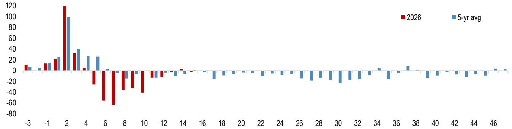

bar

| X  | 2026 | 5-yr avg |
|----|------|----------|
| -3 | 10   | 5        |
| -1 | 15   | 10       |
| 2  | 120  | 100      |
| 4  | 30   | 40       |
| 6  | -60  | -5       |
| 8  | -40  | -10      |
| 10 | -45  | -5       |
| 12 | -10  | -5       |
| 14 | 5    | -5       |
| 16 | -5   | -5       |
| 18 | -10  | -15      |
| 20 | -5   | -5       |
| 22 | -5   | -5       |
| 24 | -5   | -5       |
| 26 | -5   | -10      |
| 28 | -5   | -10      |
| 30 | -5   | -15      |
| 32 | -5   | -10      |
| 34 | -5   | 5        |
| 36 | -5   | -10      |
| 38 | -5   | 10       |
| 40 | -5   | -10      |
| 42 | -5   | -5       |
| 44 | -5   | -5       |
| 46 | -5   | 0        |

\*Build over first and second weeks post-CNY averaged due to lagged inventory reporting.   
Source: SHFE, CRU, SMM, JPM Commodities, \*First and second weeks grouped together due to lagged inventory reporting

Figure 2: Iron ore bulk shipping costs continue to rise, with latest reported Australia, Brazil & South African rates +50% vs end of February US\$/t   
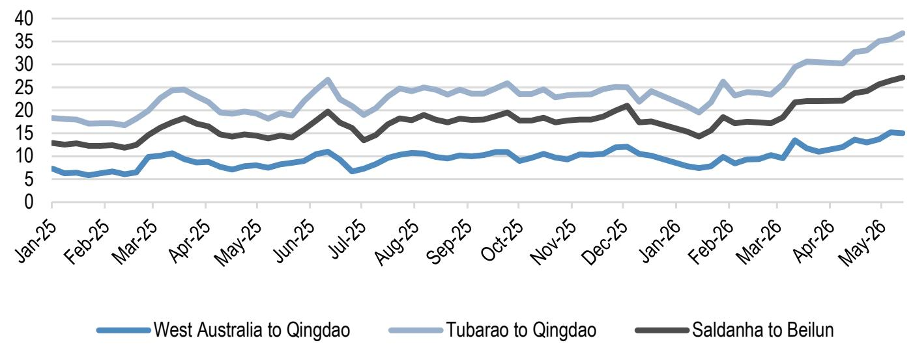

line

| Month   | West Australia to Qingdao | Tubarao to Qingdao | Saldanha to Beilun |
|---------|----------------------------|---------------------|---------------------|
| Jan-25  | 7                          | 18                  | 13                  |
| Feb-25  | 6                          | 17                  | 12                  |
| Mar-25  | 9                          | 24                  | 16                  |
| Apr-25  | 8                          | 20                  | 18                  |
| May-25  | 7                          | 19                  | 15                  |
| Jun-25  | 8                          | 27                  | 19                  |
| Jul-25  | 6                          | 19                  | 13                  |
| Aug-25  | 10                         | 24                  | 18                  |
| Sep-25  | 10                         | 24                  | 18                  |
| Oct-25  | 10                         | 25                  | 19                  |
| Nov-25  | 10                         | 24                  | 18                  |
| Dec-25  | 12                         | 25                  | 20                  |
| Jan-26  | 8                          | 23                  | 17                  |
| Feb-26  | 9                          | 26                  | 18                  |
| Mar-26  | 10                         | 24                  | 17                  |
| Apr-26  | 13                         | 30                  | 21                  |
| May-26  | 15                         | 37                  | 27                  |

Source: JPM estimates, Bloomberg Finance L.P.

Figure 3: Australian FOB Iron Ore price now flat vs mid-Feb'26 level   
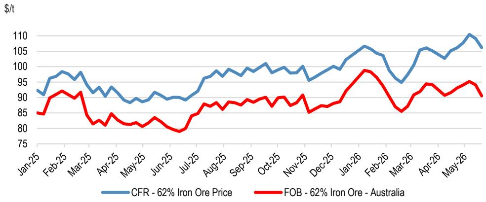

line

| Date   | CFR - 62% Iron Ore Price | FOB - 62% Iron Ore - Australia |
|--------|--------------------------|-------------------------------|
| Jan-25 | ~92                      | ~85                           |
| Feb-25 | ~98                      | ~90                           |
| Mar-25 | ~97                      | ~82                           |
| Apr-25 | ~93                      | ~81                           |
| May-25 | ~89                      | ~80                           |
| Jun-25 | ~90                      | ~79                           |
| Jul-25 | ~91                      | ~84                           |
| Aug-25 | ~98                      | ~87                           |
| Sep-25 | ~100                     | ~88                           |
| Oct-25 | ~101                     | ~89                           |
| Nov-25 | ~98                      | ~86                           |
| Dec-25 | ~100                     | ~87                           |
| Jan-26 | ~107                     | ~98                           |
| Feb-26 | ~104                     | ~90                           |
| Mar-26 | ~95                      | ~85                           |
| Apr-26 | ~106                     | ~93                           |
| May-26 | ~110                     | ~95                           |
| Jun-26 | ~107                     | ~90                           |

Source: JPM estimates, Bloomberg Finance L.P.

# China metals inventory channel check – week ended 29 May 2026

JPM is tracking China's metal inventories for potential insights regarding end-consumer demand activity. These high-frequency datapoints provide signals to gauge China metals consumption trends. Rapid pivots in inventory de-stocking volumes (or re-stocking) can potentially provide signals that downstream consumption is improving (or weakening).

The pace of copper consumption in China has continued to slow. Latest data suggests only a small 2.7kt de-stocking in the past week but this is in line vs seasonal average level. Copper inventories in China remain relatively tight (\~220kt) although we note that following three weeks of weaker drawdowns, inventory level has risen back above the level same time last year which was driven by pulling of copper imports into the US on fear of copper tariffs. China, on the other hand, has begun to ramp up aluminium drawdown which de-stocked another 16kt last week. Zinc inventory was broadly flat in the past week, and continues to sit at the top end vs past five years' range.

Figure 4: Weekly change in China visible copper inventory (SHFE + Bonded). Rate of de-stocking has slowed in the last few weeks; inventories declined 2.7kt in week ended 29 May'26   
x-axis = weeks post Chinese New Year (week 0 = week closest to start of CNY), y-axis = kt of copper increase / (decrease)   
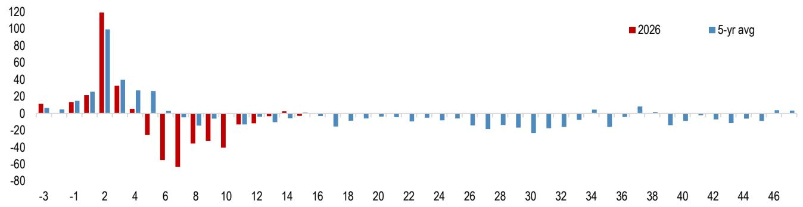

bar

| X  | 2026 | 5-yr avg |
|----|------|----------|
| -3 | 10   | 5        |
| -1 | 15   | 10       |
| 2  | 120  | 100      |
| 4  | 30   | 40       |
| 6  | -60  | -5       |
| 8  | -40  | -10      |
| 10 | -45  | -5       |
| 12 | -5   | -5       |
| 14 | 5    | -5       |
| 16 | -5   | -5       |
| 18 | -5   | -10      |
| 20 | -5   | -5       |
| 22 | -5   | -5       |
| 24 | -5   | -5       |
| 26 | -5   | -10      |
| 28 | -5   | -10      |
| 30 | -5   | -20      |
| 32 | -5   | -10      |
| 34 | -5   | 5        |
| 36 | -5   | -10      |
| 38 | -5   | 10       |
| 40 | -5   | -10      |
| 42 | -5   | -5       |
| 44 | -5   | -5       |
| 46 | -5   | 5        |

\*Build over first and second weeks post-CNY averaged due to lagged inventory reporting.   
Source: SHFE, CRU, SMM, JPM Commodities, \*First and second weeks grouped together due to lagged inventory reporting

Figure 5: Total China visible copper inventory (SHFE + Bonded) week ended 29 May'26. Copper inventory (218kt) remains at bottom end of seasonal range but \~60kt higher vs 2025   
x-axis = weeks post Chinese New Year (week 0 = week closest to start of CNY), y-axis = kt of copper   
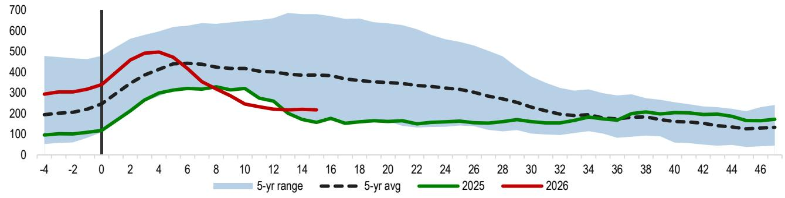

line

| x  | 5-yr range (min) | 5-yr range (max) | 5-yr avg | 2025 | 2026 |
|----|------------------|------------------|----------|------|------|
| -4 | ~100             | ~480             | ~200     | ~100 | ~300 |
| -2 | ~100             | ~500             | ~220     | ~110 | ~310 |
| 0  | ~100             | ~550             | ~250     | ~120 | ~330 |
| 2  | ~150             | ~600             | ~300     | ~180 | ~450 |
| 4  | ~200             | ~650             | ~350     | ~250 | ~500 |
| 6  | ~250             | ~680             | ~380     | ~300 | ~480 |
| 8  | ~300             | ~690             | ~400     | ~320 | ~450 |
| 10 | ~350             | ~700             | ~420     | ~330 | ~350 |
| 12 | ~400             | ~710             | ~430     | ~320 | ~250 |
| 14 | ~450             | ~720             | ~440     | ~280 | ~220 |
| 16 | ~500             | ~730             | ~450     | ~180 | —    |
| 18 | ~550             | ~740             | ~460     | ~170 | —    |
| 20 | ~600             | ~750             | ~470     | ~160 | —    |
| 22 | ~650             | ~760             | ~480     | ~150 | —    |
| 24 | ~700             | ~770             | ~490     | ~140 | —    |
| 26 | ~750             | ~780             | ~500     | ~130 | —    |
| 28 | ~800             | ~790             | ~510     | ~120 | —    |
| 30 | ~850             | ~800             | ~520     | ~110 | —    |
| 32 | ~900             | ~810             | ~530     | ~100 | —    |
| 34 | ~950             | ~820             | ~540     | ~90  | —    |
| 36 | ~1000            | ~830             | ~550     | ~85  | —    |
| 38 | ~1100            | ~840             | ~560     | ~85  | —    |
| 40 | ~1200            | ~850             | ~570     | ~85  | —    |
| 42 | ~1300            | ~860             | ~580     | ~85  | —    |
| 44 | ~1400            | ~870             | ~590     | ~85  | —    |
| 46 | ~1500            | ~880             | ~600     | ~85  | —    |

Source: SHFE, CRU, SMM, JPM Commodities

Figure 6: Aluminum inventories movements in 2026 – weekly change in China visible aluminium inventory (SHFE + Bonded). Aluminum de-stocking continues at -16kt last week   
x-axis = weeks post Chinese New Year (week 0 = week closest to start of CNY), y-axis = kt of aluminium increase / (decrease)   
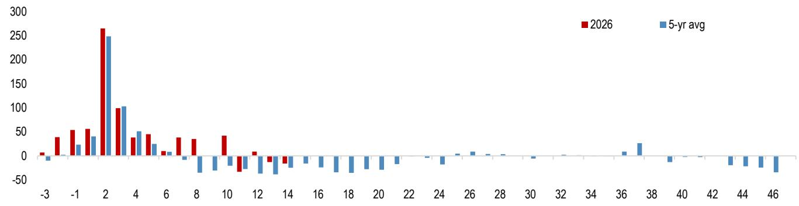

bar

| X-axis | 2026 | 5-yr avg |
| ------ | ---- | -------- |
| -3     | 5    | -10      |
| -1     | 40   | 20       |
| 2      | 270  | 250      |
| 4      | 40   | 50       |
| 6      | 10   | 5        |
| 8      | 35   | -10      |
| 10     | 40   | -15      |
| 12     | 10   | -20      |
| 14     | -10  | -25      |
| 16     | -5   | -10      |
| 18     | -5   | -15      |
| 20     | -5   | -15      |
| 22     | -5   | -10      |
| 24     | -5   | -10      |
| 26     | -5   | 5        |
| 28     | -5   | 5        |
| 30     | -5   | -5       |
| 32     | -5   | -5       |
| 34     | -5   | -5       |
| 36     | -5   | 10       |
| 38     | -5   | 25       |
| 40     | -5   | -10      |
| 42     | -5   | -5       |
| 44     | -5   | -10      |
| 46     | -5   | -15      |

\*Build over first and second weeks post-CNY averaged due to lagged inventory reporting.   
Source: SHFE, CRU, SMM, JPM Commodities, \*First and second weeks grouped together due to lagged inventory reporting

Figure 7: Total China visible aluminum inventory (SHFE + Regional Warehouses) week ended 29 May'26. China aluminum inventory (1.4Mt) is at the highest level for this period since 2019   
x-axis = weeks post Chinese New Year (week 0 = week closest to start of CNY), y-axis = kt of aluminium   
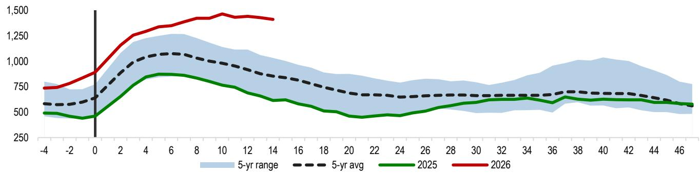

line

| x  | 2025 | 5-yr avg | 2026 |
|----|------|----------|------|
| -4 | 480  | 580      | 730  |
| -2 | 450  | 590      | 760  |
| 0  | 430  | 600      | 800  |
| 2  | 600  | 750      | 1000 |
| 4  | 850  | 950      | 1250 |
| 6  | 870  | 1050     | 1350 |
| 8  | 850  | 1080     | 1400 |
| 10 | 820  | 1050     | 1450 |
| 12 | 780  | 1020     | 1430 |
| 14 | 750  | 980      | 1420 |
| 16 | 720  | 950      | —    |
| 18 | 680  | 920      | —    |
| 20 | 650  | 900      | —    |
| 22 | 630  | 880      | —    |
| 24 | 620  | 870      | —    |
| 26 | 610  | 860      | —    |
| 28 | 630  | 870      | —    |
| 30 | 650  | 880      | —    |
| 32 | 670  | 890      | —    |
| 34 | 680  | 900      | —    |
| 36 | 690  | 910      | —    |
| 38 | 700  | 920      | —    |
| 40 | 710  | 930      | —    |
| 42 | 720  | 940      | —    |
| 44 | 730  | 950      | —    |
| 46 | 740  | 960      | —    |

Source: SHFE, CRU, SMM, JPM Commodities

Figure 8: Zinc inventories movements in 2026 – weekly change in China visible zinc inventory (SHFE + Bonded). Small Zinc inventory de-stocking last week of -2kt   
x-axis = weeks post Chinese New Year (week 0 = week closest to start of CNY), y-axis = kt of aluminium increase / (decrease)   
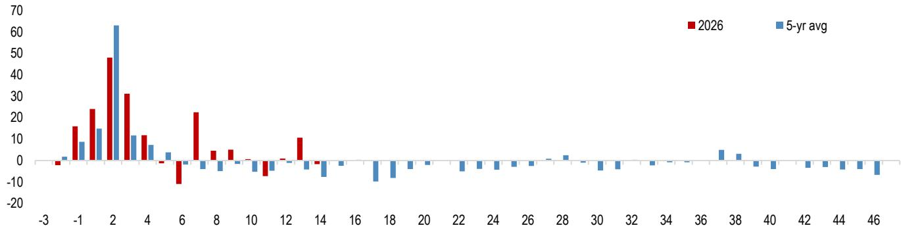

bar

| X Value | 2026 | 5-yr avg |
| ------- | ---- | -------- |
| -3      | -2   | 1        |
| -1      | 15   | 8        |
| 2       | 48   | 63       |
| 4       | 31   | 11       |
| 6       | -12  | -2       |
| 8       | 22   | -3       |
| 10      | -5   | -4       |
| 12      | 1    | -1       |
| 14      | -3   | -5       |
| 16      | -1   | -1       |
| 18      | -8   | -10      |
| 20      | -1   | -2       |
| 22      | -1   | -3       |
| 24      | -1   | -4       |
| 26      | -1   | -3       |
| 28      | -1   | 2        |
| 30      | -1   | -3       |
| 32      | -1   | -4       |
| 34      | -1   | -3       |
| 36      | -1   | -2       |
| 38      | -1   | 5        |
| 40      | -1   | -3       |
| 42      | -1   | -4       |
| 44      | -1   | -3       |
| 46      | -1   | -5       |

\*Build over first and second weeks post-CNY averaged due to lagged inventory reporting.   
Source: SHFE, CRU, SMM, JPM Commodities, \*First and second weeks grouped together due to lagged inventory reporting

Figure 9: Total China visible zinc inventory for week ended 29 May'26. Total inventory (263kt) is at the top end of historical seasonal range x-axis = weeks post Chinese New Year (week 0 = week closest to start of CNY), y-axis = kt of zinc   
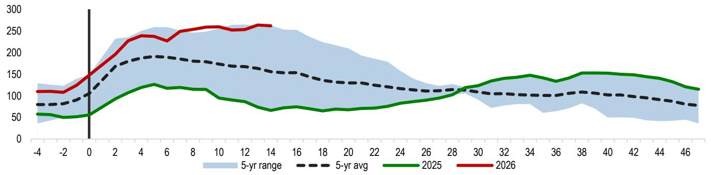

line

| x  | 5-yr range | 5-yr avg | 2025 | 2026 |
|----|------------|----------|------|------|
| -4 | 120        | 80       | 50   | 110  |
| -2 | 130        | 90       | 55   | 115  |
| 0  | 140        | 100      | 60   | 130  |
| 2  | 160        | 120      | 80   | 160  |
| 4  | 180        | 140      | 100  | 190  |
| 6  | 200        | 160      | 110  | 220  |
| 8  | 220        | 170      | 115  | 240  |
| 10 | 230        | 175      | 110  | 250  |
| 12 | 240        | 170      | 100  | 260  |
| 14 | 250        | 165      | 90   | 265  |
| 16 | 240        | 160      | 85   | —    |
| 18 | 230        | 155      | 80   | —    |
| 20 | 220        | 150      | 75   | —    |
| 22 | 210        | 145      | 70   | —    |
| 24 | 200        | 140      | 65   | —    |
| 26 | 190        | 135      | 60   | —    |
| 28 | 180        | 130      | 55   | —    |
| 30 | 170        | 125      | 50   | —    |
| 32 | 160        | 120      | 45   | —    |
| 34 | 150        | 115      | 40   | —    |
| 36 | 140        | 110      | 35   | —    |
| 38 | 130        | 105      | 30   | —    |
| 40 | 120        | 100      | 25   | —    |
| 42 | 110        | 95       | 20   | —    |
| 44 | 100        | 90       | 15   | —    |
| 46 | 90         | 85       | 10   | —    |

Source: SHFE, CRU, SMM, JPM Commodities Research   
LHS: Yangshan Premium; RHS: LME Copper Spot; Unit: \$/t

Figure 10: China Yangshan Copper Premium vs LME Copper Spot: Premium sustained at \~\$70/t despite LME copper now back above \$13,000/t

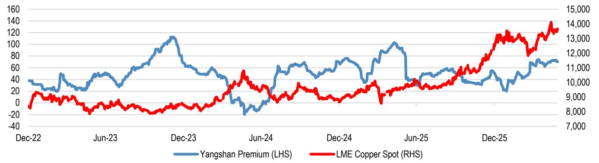

line

| Date    | Yangshan Premium (LHS) | LME Copper Spot (RHS) |
|---------|------------------------|------------------------|
| Dec-22  | ~30                    | ~8,000                 |
| Jun-23  | ~50                    | ~9,000                 |
| Dec-23  | ~110                   | ~10,000                |
| Jun-24  | ~60                    | ~11,000                |
| Dec-24  | ~70                    | ~10,000                |
| Jun-25  | ~100                   | ~12,000                |
| Dec-25  | ~70                    | ~14,000                |

Source: Bloomberg Finance L.P.

Figure 11: China steel mill margins remain loss-making in Q1'26 & coking coal price faces an additional source of upward pressure following gas explosion at Liushenyu coal mine in China   
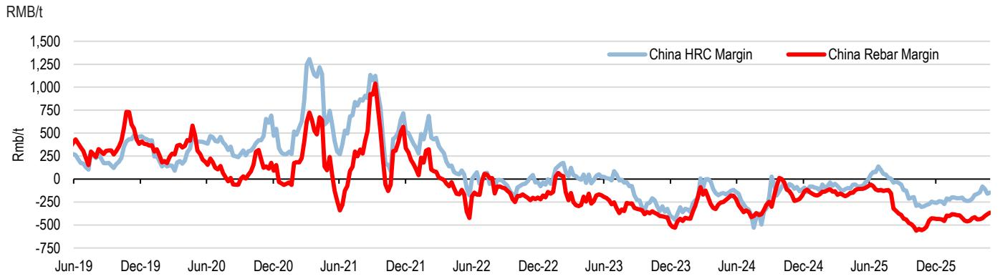

line

| Date    | China HRC Margin | China Rebar Margin |
|---------|------------------|--------------------|
| Jun-19  | ~250             | ~400               |
| Dec-19  | ~500             | ~750               |
| Jun-20  | ~300             | ~500               |
| Dec-20  | ~600             | ~200               |
| Jun-21  | ~1,300           | ~1,000              |
| Dec-21  | ~700             | ~500               |
| Jun-22  | ~100             | ~-500              |
| Dec-22  | ~200             | ~-250              |
| Jun-23  | ~100             | ~-300              |
| Dec-23  | ~-100            | ~-400              |
| Jun-24  | ~-500            | ~-300              |
| Dec-24  | ~-100            | ~-200              |
| Jun-25  | ~150             | ~-100              |
| Dec-25  | ~-100            | ~-300              |

Source: Bloomberg Finance L.P, JPM estimates.

Figure 12: China steel inventory week ending 28 May, flat WoW and +9% YoY; Inventory increases as production activity picks up   
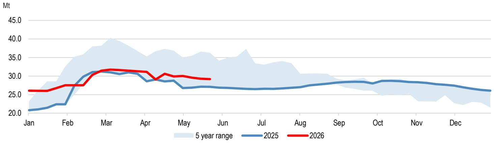

area

| Month | 2025 | 2026 |
|-------|------|------|
| Jan   | 21.0 | 26.0 |
| Feb   | 22.0 | 27.0 |
| Mar   | 31.0 | 32.0 |
| Apr   | 29.0 | 31.0 |
| May   | 27.0 | 30.0 |
| Jun   | 27.0 | 29.0 |
| Jul   | 27.0 | 28.0 |
| Aug   | 27.0 | 28.0 |
| Sep   | 28.0 | 28.0 |
| Oct   | 29.0 | 28.0 |
| Nov   | 28.0 | 27.0 |
| Dec   | 26.0 | 26.0 |

Source: JPM estimates, Bloomberg Finance L.P.

Figure 13: Iron Ore inventory held at ports in China \~161Mt is high vs history but has shown a drawdown trend in the past few weeks   
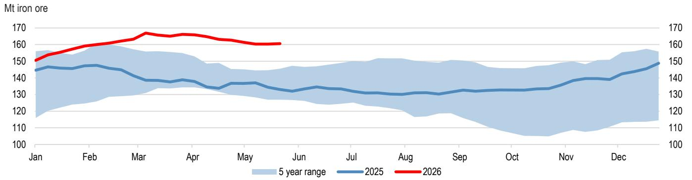

line

| Month | 2025 | 2026 |
|-------|------|------|
| Jan   | 145  | 150  |
| Feb   | 147  | 158  |
| Mar   | 140  | 168  |
| Apr   | 138  | 167  |
| May   | 135  | 163  |
| Jun   | 132  | 160  |
| Jul   | 130  | -    |
| Aug   | 130  | -    |
| Sep   | 132  | -    |
| Oct   | 133  | -    |
| Nov   | 138  | -    |
| Dec   | 148  | -    |

Source: JPM estimates, Bloomberg Finance L.P.   
Mt iron ore exports, red bar = February, typical seasonal trough for shipments is Jan/Feb

Figure 14: Global iron ore shipments - we are entering the seasonal period during which global iron ore shipments ramp up. Global shipments +3% MoM in April (+4Mt) & +2% YoY

bar_line

| Month    | Global Total Iron Ore Shipments | 3mth moving average |
|----------|----------------------------------|---------------------|
| Jan'16   | 85                               | 90                  |
| Apr'16   | 90                               | 95                  |
| Jul'16   | 100                              | 105                 |
| Oct'16   | 105                              | 110                 |
| Jan'17   | 110                              | 115                 |
| Apr'17   | 105                              | 110                 |
| Jul'17   | 100                              | 105                 |
| Oct'17   | 95                               | 100                 |
| Jan'18   | 90                               | 95                  |
| Apr'18   | 85                               | 90                  |
| Jul'18   | 90                               | 95                  |
| Oct'18   | 95                               | 100                 |
| Jan'19   | 100                              | 105                 |
| Apr'19   | 105                              | 110                 |
| Jul'19   | 110                              | 115                 |
| Oct'19   | 105                              | 110                 |
| Jan'20   | 100                              | 105                 |
| Apr'20   | 95                               | 100                 |
| Jul'20   | 100                              | 105                 |
| Oct'20   | 105                              | 110                 |
| Jan'21   | 110                              | 115                 |
| Apr'21   | 105                              | 110                 |
| Jul'21   | 100                              | 105                 |
| Oct'21   | 95                               | 100                 |
| Jan'22   | 90                               | 95                  |
| Apr'22   | 85                               | 90                  |
| Jul'22   | 90                               | 95                  |
| Oct'22   | 95                               | 100                 |
| Jan'23   | 100                              | 105                 |
| Apr'23   | 105                              | 110                 |
| Jul'23   | 110                              | 115                 |
| Oct'23   | 105                              | 110                 |
| Jan'24   | 100                              | 105                 |
| Apr'24   | 95                               | 100                 |
| Jul'24   | 90                               | 95                  |
| Oct'24   | 85                               | 90                  |
| Jan'25   | 80                               | 85                  |
| Apr'25   | 75                               | 80                  |
| Jul'25   | 70                               | 75                  |
| Oct'25   | 65                               | 70                  |
| Jan'26   | 60                               | 65                  |
| Apr'26   | 55                               | 60                  |

Source: JPM estimates, Bloomberg Finance L.P.

Figure 15: Australia iron ore shipments - Latest data suggests Australian iron ore shipments +8% MoM in April (+5Mt) & +3% YoY   
Mt iron ore exports, red bar = February, typical seasonal trough for shipments is Jan/Feb   
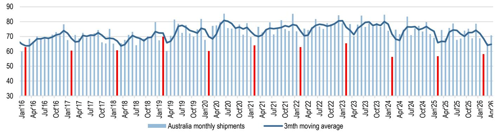

bar_line

| Month    | Australia monthly shipments | 3mth moving average |
|----------|------------------------------|---------------------|
| Jan'16   | 60                           | 65                  |
| Apr'16   | 65                           | 68                  |
| Jul'16   | 68                           | 70                  |
| Oct'16   | 70                           | 72                  |
| Jan'17   | 60                           | 75                  |
| Apr'17   | 65                           | 70                  |
| Jul'17   | 70                           | 72                  |
| Oct'17   | 65                           | 70                  |
| Jan'18   | 60                           | 68                  |
| Apr'18   | 65                           | 70                  |
| Jul'18   | 70                           | 72                  |
| Oct'18   | 75                           | 75                  |
| Jan'19   | 60                           | 70                  |
| Apr'19   | 70                           | 75                  |
| Jul'19   | 75                           | 78                  |
| Oct'19   | 70                           | 75                  |
| Jan'20   | 60                           | 70                  |
| Apr'20   | 75                           | 75                  |
| Jul'20   | 80                           | 80                  |
| Oct'20   | 75                           | 75                  |
| Jan'21   | 65                           | 70                  |
| Apr'21   | 70                           | 72                  |
| Jul'21   | 75                           | 75                  |
| Oct'21   | 80                           | 78                  |
| Jan'22   | 65                           | 75                  |
| Apr'22   | 70                           | 78                  |
| Jul'22   | 75                           | 80                  |
| Oct'22   | 80                           | 82                  |
| Jan'23   | 65                           | 75                  |
| Apr'23   | 70                           | 78                  |
| Jul'23   | 75                           | 80                  |
| Oct'23   | 80                           | 82                  |
| Jan'24   | 55                           | 75                  |
| Apr'24   | 65                           | 70                  |
| Jul'24   | 70                           | 75                  |
| Oct'24   | 75                           | 78                  |
| Jan'25   | 55                           | 75                  |
| Apr'25   | 65                           | 70                  |
| Jul'25   | 70                           | 75                  |
| Oct'25   | 75                           | 78                  |
| Jan'26   | 65                           | 75                  |
| Apr'26   | 60                           | 70                  |

Source: JPM estimates, Bloomberg Finance L.P.

Figure 16: Brazil iron ore shipments -3% MoM in April, -3% YoY   
Mt iron ore exports, red bar = February, typical seasonal trough for shipments is Jan/Feb   
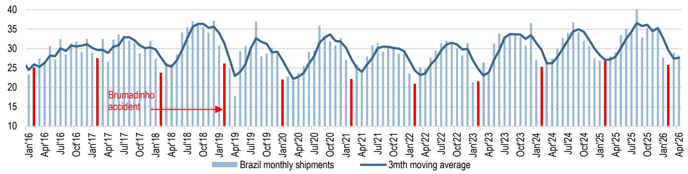

bar_line

| Date     | Brazil monthly shipments | 3mth moving average |
|----------|--------------------------|---------------------|
| Jan'16   | 25                       | 25                  |
| Apr'16   | 27                       | 27                  |
| Jul'16   | 29                       | 29                  |
| Oct'16   | 30                       | 30                  |
| Jan'17   | 28                       | 28                  |
| Apr'17   | 26                       | 26                  |
| Jul'17   | 29                       | 29                  |
| Oct'17   | 30                       | 30                  |
| Jan'18   | 24                       | 24                  |
| Apr'18   | 25                       | 25                  |
| Jul'18   | 35                       | 35                  |
| Oct'18   | 37                       | 37                  |
| Jan'19   | 26                       | 26                  |
| Apr'19   | 18                       | 18                  |
| Jul'19   | 37                       | 37                  |
| Oct'19   | 30                       | 30                  |
| Jan'20   | 22                       | 22                  |
| Apr'20   | 35                       | 35                  |
| Jul'20   | 34                       | 34                  |
| Oct'20   | 32                       | 32                  |
| Jan'21   | 22                       | 22                  |
| Apr'21   | 30                       | 30                  |
| Jul'21   | 30                       | 30                  |
| Oct'21   | 29                       | 29                  |
| Jan'22   | 24                       | 24                  |
| Apr'22   | 23                       | 23                  |
| Jul'22   | 31                       | 31                  |
| Oct'22   | 30                       | 30                  |
| Jan'23   | 21                       | 21                  |
| Apr'23   | 34                       | 34                  |
| Jul'23   | 34                       | 34                  |
| Oct'23   | 34                       | 34                  |
| Jan'24   | 25                       | 25                  |
| Apr'24   | 36                       | 36                  |
| Jul'24   | 35                       | 35                  |
| Oct'24   | 34                       | 34                  |
| Jan'25   | 27                       | 27                  |
| Apr'25   | 34                       | 34                  |
| Jul'25   | 36                       | 36                  |
| Oct'25   | 35                       | 35                  |
| Jan'26   | 26                       | 26                  |
| Apr'26   | 27                       | 27                  |

Source: JPM estimates, Bloomberg Finance L.P.

Figure 17: Chinese visible copper inventory (SHFE + Bonded) for week ended 29 May. Copper inventories still relatively tight in the Chinese market kt of copper   
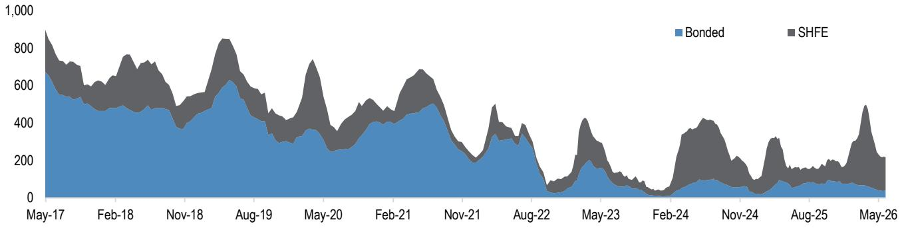

area

| Date    | Bonded | SHFE |
|---------|--------|------|
| May-17  | 650    | 400  |
| Feb-18  | 500    | 350  |
| Nov-18  | 450    | 300  |
| Aug-19  | 600    | 450  |
| May-20  | 300    | 250  |
| Feb-21  | 450    | 350  |
| Nov-21  | 300    | 200  |
| Aug-22  | 200    | 100  |
| May-23  | 150    | 150  |
| Feb-24  | 50     | 50   |
| Nov-24  | 100    | 150  |
| Aug-25  | 150    | 200  |
| May-26  | 50     | 300  |

Source: SHFE, CRU, SMM, JPM Commodities

Figure 18: China visible aluminium inventory (SHFE + Regional Warehouses) for week ended 29 May. Aluminum inventories are still at the highest level vs 5-year range   
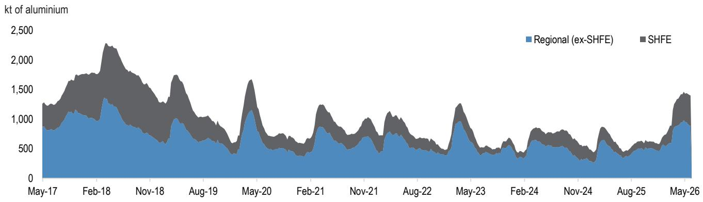

area

| Date    | Regional (ex-SHFE) | SHFE |
|---------|--------------------|------|
| May-17  | ~900               | ~400 |
| Feb-18  | ~1300              | ~1000 |
| Nov-18  | ~800               | ~600 |
| Aug-19  | ~600               | ~500 |
| May-20  | ~1100              | ~800 |
| Feb-21  | ~800               | ~500 |
| Nov-21  | ~700               | ~400 |
| Aug-22  | ~600               | ~300 |
| May-23  | ~900               | ~500 |
| Feb-24  | ~600               | ~400 |
| Nov-24  | ~500               | ~300 |
| Aug-25  | ~400               | ~200 |
| May-26  | ~900               | ~500 |

Source: SHFE, CRU, SMM, JPM Commodities Research

Figure 19: China visible zinc inventory (SHFE + Regional Warehouses) for week ended 29 May. Zinc inventories are also still at the highest level vs 5-year range   
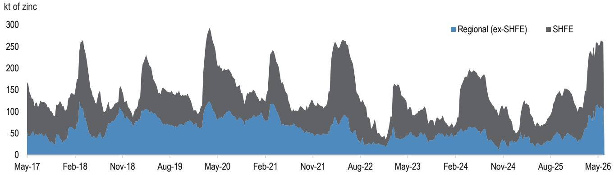

area

| Date    | Regional (ex-SHFE) | SHFE |
|---------|--------------------|------|
| May-17  | ~40                | ~80  |
| Feb-18  | ~50                | ~120 |
| Nov-18  | ~60                | ~90  |
| Aug-19  | ~70                | ~110 |
| May-20  | ~120               | ~180 |
| Feb-21  | ~100               | ~130 |
| Nov-21  | ~80                | ~100 |
| Aug-22  | ~60                | ~140 |
| May-23  | ~50                | ~90  |
| Feb-24  | ~60                | ~110 |
| Nov-24  | ~40                | ~70  |
| Aug-25  | ~50                | ~100 |
| May-26  | ~110               | ~160 |

Source: SHFE, CRU, SMM, JPM Commodities

# Disclosures

Analyst Certification: The Research Analyst(s) denoted by an “AC” on the cover of this report certifies (or, where multiple Research Analysts are primarily responsible for this report, the Research Analyst denoted by an “AC” on the cover or within the document individually certifies, with respect to each security or issuer that the Research Analyst covers in this research) that: (1) all of the views expressed in this report accurately reflect the Research Analyst’s personal views about any and all of the subject securities or issuers; and (2) no part of any of the Research Analyst's compensation was, is, or will be directly or indirectly related to the specific recommendations or views expressed by the Research Analyst(s) in this report. For all Korea-based Research Analysts listed on the front cover, if applicable, they also certify, as per KOFIA requirements, that the Research Analyst’s analysis was made in good faith and that the views reflect the Research Analyst’s own opinion, without undue influence or intervention.

All authors named within this report are Research Analysts who produce independent research unless otherwise specified. In Europe, Sector Specialists (Sales and Trading) may be shown on this report as contacts but are not authors of the report or part of the Research Department.

# Important Disclosures

Company-Specific Disclosures: JPM does and seeks to do business with companies covered in its research reports. As a result, investors should be aware that the firm may have a conflict of interest that could affect the objectivity of this report. Investors should consider this report as only a single factor in making their investment decision. Important disclosures, including price charts and credit opinion history tables (if applicable), are available for compendium reports and all JPM-covered companies, and certain non-covered companies, by visiting https://www.jpmm.com/research/disclosures, calling 1-800-477-0406, or e-mailing research.disclosure.inquiries@JPM.com with your request.

# Explanation of Equity Research Ratings, Designations and Analyst(s) Coverage Universe:

JPM uses the following rating system: Overweight (over the duration of the price target indicated in this report, we expect this stock will outperform the average total return of the stocks in the Research Analyst's, or the Research Analyst's team's, coverage universe); Neutral (over the duration of the price target indicated in this report, we expect this stock will perform in line with the average total return of the stocks in the Research Analyst's, or the Research Analyst's team's, coverage universe); and Underweight (over the duration of the price target indicated in this report, we expect this stock will underperform the average total return of the stocks in the Research Analyst's, or the Research Analyst's team's, coverage universe. NR is Not Rated. In this case, JPM has removed the rating and, if applicable, the price target, for this stock because of either a lack of a sufficient fundamental basis or for legal, regulatory or policy reasons. The previous rating and, if applicable, the price target, no longer should be relied upon. An NR designation is not a recommendation or a rating. Some stocks under coverage have a rating but no price target; in these cases, we expect the stock will outperform/perform in line/underperform the average total return of the stocks in the Research Analyst's, or the Research Analyst's team's, coverage universe of the relevant duration of the region. In our Asia (ex-Australia and ex-India) and U.K. small- and mid-cap Equity Research, each stock's expected total return is compared to the expected total return of a benchmark country market index, not to those Research Analysts' coverage universe. If it does not appear in the Important Disclosures section of this report, the certifying Research Analyst's coverage universe can be found on JPM's Research website, https://www.JPMmarkets.com.

Coverage Universe: O'Kane, Dominic J: Acerinox (ACX.MC), Anglo American (AAL.L), Anglo American (AGLJ.J) (AGLJ.J), Aperam (APAM.AS), ArcelorMittal (MT.AS), BHP Group Ltd (BHG SJ) (BHGJ.J), BHP Group Ltd (BHP LN) (BHPB.L), Glencore PLC (GLEN.L), Glencore plc (GLN SJ) (GLNJ.J), Harmony Gold Mining Co Ltd (HARJ.J), Harmony Gold Mining-ADR (HMY), Impala Platinum Holdings Ltd (IMPJ.J), Kumba Iron Ore Limited (KIOJ.J), Northam Platinum Ltd (NPHJ.J), Outokumpu (OUT1V.HE), Rio Tinto plc (RIO.L), SSAB-A (SSABa.ST), SSAB-B (SSABb.ST), Salzgitter (SZGG.DE), Sibanye-Stillwater (SSWJ.J), Sibanye-Stillwater-ADR (SBSW), ThyssenKrupp (TKAG.DE), Valterra Platinum - ADR (AGPPF), Valterra Platinum Limited (VALJ.J), voestalpine (VOES.VI)

JPM Equity Research Ratings Distribution, as of April 04, 2026 

<table><tr><td></td><td>Overweight (buy)</td><td>Neutral (hold)</td><td>Underweight (sell)</td></tr><tr><td>JPM Global Equity Research Coverage*</td><td>51%</td><td>37%</td><td>12%</td></tr><tr><td>IB clients**</td><td>83%</td><td>79%</td><td>74%</td></tr><tr><td>JPMS Equity Research Coverage*</td><td>49%</td><td>39%</td><td>13%</td></tr><tr><td>IB clients**</td><td>94%</td><td>93%</td><td>85%</td></tr></table>

\*Please note that the percentages may not add to 100% because of rounding.   
\*\*Percentage of subject companies within each of the "buy," "hold" and "sell" categories for which JPM has provided investment banking services within the previous 12 months.   
For purposes of FINRA ratings distribution rules only, our Overweight rating falls into a buy rating category; our Neutral rating falls into a hold rating category; and our Underweight rating falls into a sell rating category. Please note that stocks with an NR designation are not included in the table above. This information is current as of the end of the most recent calendar quarter.

Equity Valuation and Risks: For valuation methodology and risks associated with covered companies or price targets for covered companies, please see the most recent company-specific research report at http://www.JPMmarkets.com, contact the primary analyst or your JPM representative, or email research.disclosure.inquiries@JPM.com. For material information about the proprietary models used, please see the Summary of Financials in company-specific research reports and the Company Tearsheets, which are available to download on the company pages of our client website, http://www.JPMmarkets.com. This report also sets out within it the material underlying assumptions used.

# History of Investment Recommendations:

A history of JPM investment recommendations disseminated during the preceding 12 months can be accessed on the Research & Commentary page of http://www.JPMmarkets.com where you can also search by analyst name, sector or financial instrument.

Analysts' Compensation: The research analysts responsible for the preparation of this report receive compensation based upon various factors, including the quality and accuracy of research, client feedback, competitive factors, and overall firm revenues.

Registration of non-US Analysts: Unless otherwise noted, the non-US analysts listed on the front of this report are employees of non-US affiliates of JPM Securities LLC, may not be registered as research analysts under FINRA rules, may not be associated persons of JPM Securities LLC, and may not be subject to FINRA Rule 2241 or 2242 restrictions on communications with covered companies, public appearances, and trading securities held by a research analyst account.

Company-Specific Disclosures: Important disclosures, including price charts and credit opinion history tables (if applicable), are available for compendium reports and all JPM-covered companies, and certain non-covered companies, by visiting https://www.jpmm.com/research/disclosures, calling 1-800-477-0406, or e-mailing research.disclosure.inquiries@JPM.com with your request.

# Other Disclosures

JPM is a marketing name for investment banking businesses of JPM Chase & Co. and its subsidiaries and affiliates worldwide.

UK MIFID FICC research unbundling exemption: UK clients should refer to UK MIFID Research Unbundling exemption for details of JPM's implementation of the FICC research exemption and guidance on relevant FICC research categorisation.

All research material made available to clients are simultaneously available on our client website, JPM Markets, unless specifically permitted by relevant laws. Not all research content is redistributed, e-mailed or made available to third-party aggregators. For all research material available on a particular stock, please contact your sales representative.

Any long form nomenclature for references to China; Hong Kong; Taiwan; and Macau within this research material are Mainland China; Hong Kong SAR (China); Taiwan (China); and Macau SAR (China).

JPM may, from time to time, write on issuers or securities targeted by economic or financial sanctions imposed or administered by the governmental authorities of the U.S., EU, UK or other relevant jurisdictions (Sanctioned Securities). Nothing in this report is intended to be read or construed as encouraging, facilitating, promoting or otherwise approving investment or dealing in such Sanctioned Securities. Clients should be aware of their own legal and compliance obligations when making investment decisions.

Any digital or crypto assets discussed in this research report are subject to a rapidly changing regulatory landscape. For relevant regulatory advisories on crypto assets, including bitcoin and ether, please see https://www.JPM.com/disclosures/cryptoasset-disclosure.

The author(s) of this research report may not be licensed to carry on regulated activities in your jurisdiction and, if not licensed, do not hold themselves out as being able to do so.

Exchange-Traded Funds (ETFs): JPM Securities LLC (“JPMS”) acts as authorized participant for substantially all U.S.-listed ETFs. To the extent that any ETFs are mentioned in this report, JPMS may earn commissions and transaction-based compensation in connection with the distribution of those ETF shares and may earn fees for performing other trade-related services, such as securities lending to short sellers of the ETF shares. JPMS may also perform services for the ETFs themselves, including acting as a broker or dealer to the ETFs. In addition, affiliates of JPMS may perform services for the ETFs, including trust, custodial, administration, lending, index calculation and/or maintenance and other services.

Options and Futures related research: If the information contained herein regards options- or futures-related research, such information is available only to persons who have received the proper options or futures risk disclosure documents. Please contact your JPM Representative or visit https://www.theocc.com/components/docs/riskstoc.pdf for a copy of the Option Clearing Corporation's Characteristics and Risks of Standardized Options or https://www.finra.org/sites/default/files/2020-08/Security\_Futures\_Risk\_Disclosure\_Statement\_2020.pdf for a copy of the Security Futures Risk Disclosure Statement.

Changes to Interbank Offered Rates (IBORs) and other benchmark rates: Certain interest rate benchmarks are, or may in the future become, subject to ongoing international, national and other regulatory guidance, reform and proposals for reform. For more information, please consult: https://www.JPM.com/global/disclosures/interbank\_offered\_rates

Private Bank Clients: Where you are receiving research as a client of the private banking businesses offered by JPM Chase & Co. and its subsidiaries (“JPM Private Bank”), research is provided to you by JPM Private Bank and not by any other division of JPM, including, but not limited to, the JPM Corporate and Investment Bank and its Global Research division.

Legal entity responsible for the production and distribution of research: The legal entity identified below the name of the Reg AC Research Analyst who authored this material is the legal entity responsible for the production of this research. Where multiple Reg AC Research Analysts authored this material with different legal entities identified below their names, these legal entities are jointly responsible for the production of this research. Where more than one legal entity is listed under an analyst's name, the first legal entity is responsible for the production unless stated otherwise. Research Analysts from various JPM affiliates may have contributed to the production of this material but may not be licensed to carry out regulated activities in your jurisdiction (and do not hold themselves out as being able to do so). Unless otherwise stated below in the legal entity disclosures, this material has been distributed by the legal entity responsible for production, or where more than one legal entity is listed under the analyst's name, the first legal entity will be responsible for distribution. If you have any queries, please contact the relevant Research Analyst in your jurisdiction or the entity in your jurisdiction that has distributed this research material.

# Legal Entities Disclosures and Country-/Region-Specific Disclosures:

Argentina: JPM Chase Bank N.A Sucursal Buenos Aires is regulated by Banco Central de la República Argentina (“BCRA”- Central Bank of Argentina) and Comisión Nacional de Valores (“CNV”- Argentinian Securities Commission - ALYC y AN Integral N°51).

Australia: JPM Securities Australia Limited (“JPMSAL”) (ABN 61 003 245 234/AFS Licence No: 238066) is regulated by the Australian Securities and Investments Commission and is a Market Participant of ASX Limited, a Clearing and Settlement Participant of ASX Clear Pty Limited and a Clearing Participant of ASX Clear (Futures) Pty Limited. This material is issued and distributed in Australia by or on behalf of JPMSAL only to "wholesale clients" (as defined in section 761G of the Corporations Act 2001). A list of all financial products covered can be found by visiting https://www.jpmm.com/research/disclosures. JPM seeks to cover companies of relevance to the domestic and international investor base across all Global Industry Classification Standard (GICS) sectors, as well as across a range of market capitalisation sizes. If applicable, in the course of conducting public side due diligence on the subject company(ies), the Research Analyst team may at times perform such diligence through corporate engagements such as site visits, discussions with company representatives, management presentations, etc. Research issued by JPMSAL has been prepared in accordance with JPM Australia’s Research Independence Policy which can be found at the following link: JPM Australia - Research Independence Policy.

Brazil: Banco JPM S.A. is regulated by the Comissao de Valores Mobiliarios (CVM) and by the Central Bank of Brazil. Ombudsman JPM: 0800-7700847 / 0800-7700810 (For Hearing Impaired) / ouvidoria.jp.morgan@jpmchase.com.

Canada: JPM Securities Canada Inc. is a registered investment dealer, regulated by the Canadian Investment Regulatory Organization and the Ontario Securities Commission and is the participating member on Canadian exchanges. This material is distributed in Canada by or on behalf of JPM Securities Canada Inc.

Chile: Inversiones JPM Limitada is an unregulated entity incorporated in Chile.

China: JPM Securities (China) Company Limited has been approved by CSRC to conduct the securities investment consultancy business.

Colombia: Banco JPM Colombia S.A. is supervised by the Superintendencia Financiera de Colombia (SFC). Any reference in this material to products or services offered abroad by entities other than the Bank in Colombia is included exclusively for descriptive purposes. Such references do not constitute, and should not be construed as, promotional activity or the provision of financial products or services within Colombian territory, as defined under applicable Colombian regulation.

Dubai International Financial Centre (DIFC): JPM Chase Bank, N.A., Dubai Branch is regulated by the Dubai Financial Services Authority (DFSA) and its registered address is Dubai International Financial Centre - The Gate, West Wing, Level 3 and 9 PO Box 506551, Dubai, UAE. This material has been distributed by JPM Chase Bank, N.A., Dubai Branch to persons regarded as professional clients or market counterparties as defined under the DFSA rules.

European Economic Area (EEA): Unless specified to the contrary, research is distributed in the EEA by JPM SE (“JPM SE”), which is authorised as a credit institution by the Federal Financial Supervisory Authority (Bundesanstalt für Finanzdienstleistungsaufsicht, BaFin) and jointly supervised by the BaFin, the German Central Bank (Deutsche Bundesbank) and the European Central Bank (ECB). JPM SE is a company headquartered in Frankfurt with registered address at TaunusTurm, Taunustor 1, Frankfurt am Main, 60310, Germany. The material has been distributed in the EEA to persons regarded as professional investors (or equivalent) pursuant to Art. 4 para. 1 no. 10 and Annex II of MiFID II and its respective implementation in their home jurisdictions (“EEA professional investors”). This material must not be acted on or relied on by persons who are not EEA professional investors. Any investment or investment activity to which this material relates is only available to EEA relevant persons and will be engaged in only with EEA relevant persons.

Hong Kong: JPM Securities (Asia Pacific) Limited (CE number AAJ321) is regulated by the Hong Kong Monetary Authority and the Securities and Futures Commission in Hong Kong, and JPM Broking (Hong Kong) Limited (CE number AAB027) is regulated by the Securities and Futures Commission in Hong Kong. JPM Chase Bank, N.A., Hong Kong Branch (CE Number AAL996) is regulated by the Hong Kong Monetary Authority and the Securities and Futures Commission, is organized under the laws of the United States with limited liability. Where the distribution of this material is a regulated activity in Hong Kong, the material is distributed in Hong Kong by or through JPM Securities (Asia Pacific) Limited and/or JPM Broking (Hong Kong) Limited.

India: JPM India Private Limited (Corporate Identity Number - U67120MH1992FTC068724), having its registered office at JPM

Tower, Off. C.S.T. Road, Kalina, Santacruz - East, Mumbai – 400098, is registered with the Securities and Exchange Board of India (SEBI) as a 'Research Analyst' having registration number INH000001873. JPM India Private Limited is also registered with SEBI as a member of the National Stock Exchange of India Limited and the Bombay Stock Exchange Limited (SEBI Registration Number – INZ000239730) and as a Merchant Banker (SEBI Registration Number - MB/INM000002970). Telephone: 91-22-6157 3000, Facsimile: 91-22-6157 3990 and Website: http://www.jpmipl.com. JPM Chase Bank, N.A. - Mumbai Branch is licensed by the Reserve Bank of India (RBI) (Licence No. 53/Licence No. BY.4/94; SEBI - IN/CUS/014/ CDSL : IN-DP-CDSL-444-2008/ IN-DP-NSDL-285-2008/ INBI00000984/ INE231311239) as a Scheduled Commercial Bank in India, which is its primary license allowing it to carry on Banking business in India and other activities, which a Bank branch in India are permitted to undertake. For non-local research material, this material is not distributed in India by JPM India Private Limited. Compliance Officer: Ashutosh Sharma; ashutosh.j.sharma@jpmchase.com; +912261575002. Grievance Officer: Ramprasadh K, jpmipl.research.feedback@JPM.com; +912261573000. Registration granted by SEBI and certification from NISM in no way guarantee performance of the intermediary or provide any assurance of returns to investors. Please visit Terms and Conditions and Most Important Terms and Conditions (MITC). The annual Compliance audit report is available at http://www.jpmipl.com/#research.

Indonesia: PT JPM Sekuritas Indonesia is a member of the Indonesia Stock Exchange and is registered and supervised by the Otoritas Jasa Keuangan (OJK).

Korea: JPM Securities (Far East) Limited, Seoul Branch, is a member of the Korea Exchange (KRX). JPM Chase Bank, N.A., Seoul Branch, is licensed as a branch office of foreign bank (JPM Chase Bank, N.A.) in Korea. Both entities are regulated by the Financial Services Commission (FSC) and the Financial Supervisory Service (FSS). For non-macro research material, the material is distributed in Korea by or through JPM Securities (Far East) Limited, Seoul Branch.

Japan: JPM Securities Japan Co., Ltd. and JPM Chase Bank, N.A., Tokyo Branch are regulated by the Financial Services Agency in Japan.

Malaysia: This material is issued and distributed in Malaysia by JPM Securities (Malaysia) Sdn Bhd (18146-X), which is a Participating Organization of Bursa Malaysia Berhad and holds a Capital Markets Services License issued by the Securities Commission in Malaysia.

Mexico: JPM Casa de Bolsa, S.A. de C.V., JPM Grupo Financiero is member of the Mexican Stock Exchange (“Bolsa Mexicana de Valores”) and the Institutional Stock Exchange (“Bolsa Institucional de Valores”), and it is authorized to act as a broker dealer by the National Banking and Securities Exchange Commission (“Comisión Nacional Bancaria y de Valores”).

New Zealand: This material is issued and distributed by JPMSAL in New Zealand only to "wholesale clients" (as defined in the Financial Markets Conduct Act 2013). JPMSAL is registered as a Financial Service Provider under the Financial Service providers (Registration and Dispute Resolution) Act of 2008.

Philippines: JPM Securities Philippines Inc. is a Trading Participant of the Philippine Stock Exchange and a member of the Securities Clearing Corporation of the Philippines and the Securities Investor Protection Fund. It is regulated by the Securities and Exchange Commission.

Singapore: This material is issued and distributed in Singapore by or through JPM Securities Singapore Private Limited (JPMSS) [MDDI (P) 057/08/2025 and Co. Reg. No.: 199405335R], which is a member of the Singapore Exchange Securities Trading Limited, and/or JPM Chase Bank, N.A., Singapore branch (JPMCB Singapore), both of which are regulated by the Monetary Authority of Singapore. This material is issued and distributed in Singapore only to accredited investors, expert investors and institutional investors, as defined in Section 4A of the Securities and Futures Act, Cap. 289 (SFA). This material is not intended to be issued or distributed to any retail investors or any other investors that do not fall into the classes of “accredited investors,” “expert investors” or “institutional investors,” as defined under Section 4A of the SFA. Recipients of this material in Singapore are to contact JPMSS or JPMCB Singapore in respect of any matters arising from, or in connection with, the material.

South Africa: JPM Equities South Africa Proprietary Limited and JPM Chase Bank, N.A., Johannesburg Branch are members of the Johannesburg Securities Exchange and are regulated by the Financial Services Conduct Authority (FSCA).

Taiwan: JPM Securities (Taiwan) Limited is a participant of the Taiwan Stock Exchange (company-type) and regulated by the Taiwan Securities and Futures Bureau. Material relating to equity securities is issued and distributed in Taiwan by JPM Securities (Taiwan) Limited, subject to the license scope and the applicable laws and the regulations in Taiwan. To the extent that JPM Securities (Taiwan) Limited produces research materials on securities not listed on the Taiwan Stock Exchange or Taipei Exchange (“Non-Taiwan Listed Securities”), these materials shall not constitute securities recommendations for the purpose of applicable Taiwan regulations, and, for the avoidance of doubt, JPM Securities (Taiwan) Limited does not act as broker for Non-Taiwan Listed Securities. According to Paragraph 2, Article 7-1 of Operational Regulations Governing Securities Firms Recommending Trades in Securities to Customers (as amended or supplemented) and/or other applicable laws or regulations, please note that the recipient of this material is not permitted to engage in any activities in connection with the material that may give rise to conflicts of interests, unless otherwise disclosed in the “Important Disclosures” in this material.

Thailand: This material is issued and distributed in Thailand by JPM Securities (Thailand) Ltd., which is a member of the Stock Exchange of Thailand and is regulated by the Ministry of Finance and the Securities and Exchange Commission. The registered address is 548 One City Center Building, 50th Floor, Ploenchit Road, Lymphini, Pathum Wan, Bangkok 10330.

UK: Research is produced in the UK by JPM Securities plc (“JPMS plc”) which is a member of the London Stock Exchange and is authorised by the Prudential Regulation Authority and regulated by the Financial Conduct Authority and the Prudential Regulation Authority or

JPM Markets Limited (“JPMML Ltd”) which is authorised and regulated by the Financial Conduct Authority. Unless specified to the contrary, this material is distributed in the UK by JPMS plc and is directed in the UK only to: (a) persons having professional experience in matters relating to investments falling within article 19(5) of the Financial Services and Markets Act 2000 (Financial Promotion) (Order) 2005 (“the FPO”); (b) persons outlined in article 49 of the FPO (high net worth companies, unincorporated associations or partnerships, the trustees of high value trusts, etc.); or (c) any persons to whom this communication may otherwise lawfully be made; all such persons being referred to as "UK relevant persons". This material must not be acted on or relied on by persons who are not UK relevant persons. Any investment or investment activity to which this material relates is only available to UK relevant persons and will be engaged in only with UK relevant persons. A description of JPM EMEA’s policy for prevention and avoidance of conflicts of interest related to the production of Research can be found at the following link: JPM EMEA - Research Independence Policy.

U.S.: JPM Securities LLC (“JPMS”) is a member of the NYSE, FINRA, SIPC, and the NFA. JPM Chase Bank, N.A. is a member of the FDIC. Material published by non-U.S. affiliates is distributed in the U.S. by JPMS who accepts responsibility for its content.

General: Additional information is available upon request. The information in this material has been obtained from sources believed to be reliable. While all reasonable care has been taken to ensure that the facts stated in this material are accurate and that the forecasts, opinions and expectations contained herein are fair and reasonable, JPM Chase & Co. or its affiliates and/or subsidiaries (collectively JPM) make no representations or warranties whatsoever to the completeness or accuracy of the material provided, except with respect to any disclosures relative to JPM and the Research Analyst's involvement with the issuer that is the subject of the material. Accordingly, no reliance should be placed on the accuracy, fairness or completeness of the information contained in this material. There may be certain discrepancies with data and/or limited content in this material as a result of calculations, adjustments, translations to different languages, and/or local regulatory restrictions, as applicable. These discrepancies should not impact the overall investment analysis, views and/or recommendations of the subject company(ies) that may be discussed in the material. Artificial intelligence tools may have been used in the preparation of this material, including assisting in data analysis, pattern recognition, and content drafting for research material. JPM accepts no liability whatsoever for any loss arising from any use of this material or its contents, and neither JPM nor any of its respective directors, officers or employees, shall be in any way responsible for the contents hereof, apart from the liabilities and responsibilities that may be imposed on them by the relevant regulatory authority in the jurisdiction in question, or the regulatory regime thereunder. Opinions, forecasts or projections contained in this material represent JPM's current opinions or judgment as of the date of the material only and are therefore subject to change without notice. Periodic updates may be provided on companies/industries based on company-specific developments or announcements, market conditions or any other publicly available information. There can be no assurance that future results or events will be consistent with any such opinions, forecasts or projections, which represent only one possible outcome. Furthermore, such opinions, forecasts or projections are subject to certain risks, uncertainties and assumptions that have not been verified, and future actual results or events could differ materially. The value of, or income from, any investments referred to in this material may fluctuate and/or be affected by changes in exchange rates. All pricing is indicative as of the close of market for the securities discussed, unless otherwise stated. Past performance is not indicative of future results. Accordingly, investors may receive back less than originally invested. This material is not intended as an offer or solicitation for the purchase or sale of any financial instrument. The opinions and recommendations herein do not take into account individual client circumstances, objectives, or needs and are not intended as recommendations of particular securities, financial instruments or strategies to particular clients. This material may include views on structured securities, options, futures and other derivatives. These are complex instruments, may involve a high degree of risk and may be appropriate investments only for sophisticated investors who are capable of understanding and assuming the risks involved. The recipients of this material must make their own independent decisions regarding any securities or financial instruments mentioned herein and should seek advice from such independent financial, legal, tax or other adviser as they deem necessary. JPM may trade as a principal on the basis of the Research Analysts' views and research, and it may also engage in transactions for its own account or for its clients' accounts in a manner inconsistent with the views taken in this material, and JPM is under no obligation to ensure that such other communication is brought to the attention of any recipient of this material. Others within JPM, including Strategists, Sales staff and other Research Analysts, may take views that are inconsistent with those taken in this material. Employees of JPM not involved in the preparation of this material may have investments in the securities (or derivatives of such securities) mentioned in this material and may trade them in ways different from those discussed in this material. This material is not an advertisement for or marketing of any issuer, its products or services, or its securities in any jurisdiction.

Confidentiality and Security Notice: This transmission may contain information that is privileged, confidential, legally privileged, and/or exempt from disclosure under applicable law. If you are not the intended recipient, you are hereby notified that any disclosure, copying, distribution, or use of the information contained herein (including any reliance thereon) is STRICTLY PROHIBITED. Although this transmission and any attachments are believed to be free of any virus or other defect that might affect any computer system into which it is received and opened, it is the responsibility of the recipient to ensure that it is virus free and no responsibility is accepted by JPM Chase & Co., its subsidiaries and affiliates, as applicable, for any loss or damage arising in any way from its use. If you received this transmission in error, please immediately contact the sender and destroy the material in its entirety, whether in electronic or hard copy format. This message is subject to electronic monitoring: https://www.JPM.com/disclosures/email

MSCI: Certain information herein (“Information”) is reproduced by permission of MSCI Inc., its affiliates and information providers (“MSCI”) ©2026. No reproduction or dissemination of the Information is permitted without an appropriate license. MSCI MAKES NO EXPRESS OR IMPLIED WARRANTIES (INCLUDING MERCHANTABILITY OR FITNESS) AS TO THE INFORMATION AND DISCLAIMS ALL LIABILITY TO THE EXTENT PERMITTED BY LAW. No Information constitutes investment advice, except for any applicable Information from MSCI ESG Research. Subject also to msci.com/disclaimer

Sustainalytics: Certain information, data, analyses and opinions contained herein are reproduced by permission of Sustainalytics and: (1)

includes the proprietary information of Sustainalytics; (2) may not be copied or redistributed except as specifically authorized; (3) do not constitute investment advice nor an endorsement of any product or project; (4) are provided solely for informational purposes; and (5) are not warranted to be complete, accurate or timely. Sustainalytics is not responsible for any trading decisions, damages or other losses related to it or its use. The use of the data is subject to conditions available at https://www.sustainalytics.com/legal-disclaimers. ©2026 Sustainalytics. All Rights Reserved.

"Other Disclosures" last revised May 16, 2026.

Copyright 2026 JPM Chase & Co. All rights reserved. This material or any portion hereof may not be reprinted, sold or redistributed without the written consent of JPM. It is strictly prohibited to use or share without prior written consent from JPM any research material received from JPM or an authorized third-party (“JPM Data”) in any third-party artificial intelligence (“AI”) systems or models when such JPM Data is accessible by a third-party.

Completed 31 May 2026 09:47 PM BST

Disseminated 01 Jun 2026 12:15 AM BST