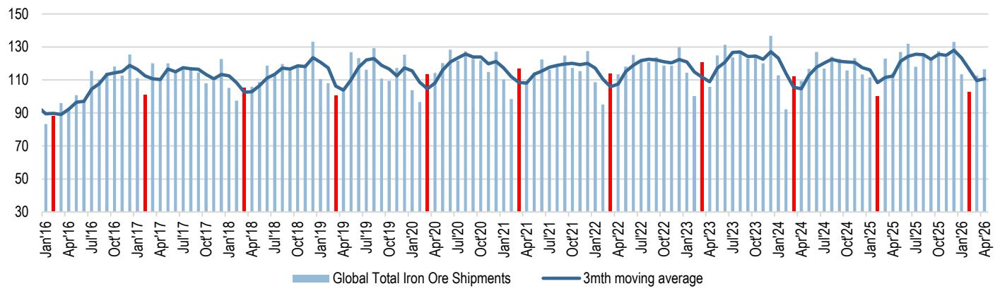
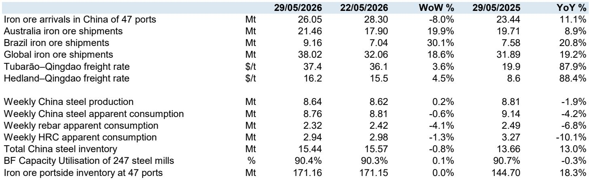

# China's Metals Tell a Divergent Story: Copper Demand Is Cooling While Steel Supply Is About to Collapse

The most important signal in China's metals markets this week is not the slowing pace of copper destocking. It is the structural shift underway in steel. For five consecutive weeks, China's copper inventories have drawn down at a weakening pace, pulling total visible stocks to roughly 200 kilotonnes. That is low by historical standards, but it is no longer falling at the rate that defined the post-reopening surge across March and April. Meanwhile, aluminum destocking has accelerated, albeit from a very high base. Zinc sits near the top of its five-year range. Taken together, these three base metals paint a picture of moderating consumption momentum, consistent with a broader economic slowdown that saw China's May PMI slip to 50.0 and fixed-asset investment in infrastructure fall 18.6 percent year-on-year in April. But the real strategic story lies not in demand but in supply — specifically, the new steel capacity replacement rules that the Ministry of Industry and Information Technology has just introduced. These rules, if enforced as written, will effectively end net capacity expansion in China's steel industry after 2027. That is a structural change with multi-year implications for steel prices, industry profitability, and the competitive positioning of every participant in the global steel value chain.

The divergence between copper and aluminum inventory trajectories is instructive. Copper, often seen as a leading indicator for industrial activity, is now drawing down at a rate that is merely seasonal, not exceptional. The 3 kilotonne reduction in the latest week is in line with the five-year average for this period. That is a normalization after an extraordinary first quarter, but it also raises a question: how much of the earlier strength was genuine demand versus precautionary stockpiling? Aluminum, by contrast, is showing greater momentum in absolute destocking terms — a 16 kilotonne draw in the latest week — but total inventories remain historically bloated at 1.4 million tonnes. The aluminum market is moving in the right direction, but it started from a position of significant oversupply. These inventory signals are consistent with a China that is slowing cyclically but not collapsing. The real inflection point, however, is not in base metals at all. It is in steel.

The new capacity replacement rules represent the most significant regulatory intervention in China's steel industry since the supply-side reforms of 2016. The key change is the shift from regionally differentiated replacement ratios to a uniform national standard of 1.5:1. For every tonne of new crude steel or pig iron capacity, 1.5 tonnes of old capacity must be eliminated. There are important exceptions: mergers and acquisitions qualify for a more favorable 1.25:1 ratio, while green projects such as hydrogen-based metallurgy and electric arc furnaces can replace capacity on a one-to-one basis. Stainless steel induction furnaces, previously a gray area for capacity expansion, are now explicitly brought under regulatory supervision. The two-year transition period preserves some flexibility for cross-enterprise and cross-group capacity transfers, but after 2027, the window for net capacity additions effectively closes. Mysteel's analysis suggests that the combination of the 1.5:1 ratio and the elimination of zombie capacity means the industry will shift from net additions to net reductions. That is a structural tightening of supply that has not been priced into current steel market expectations.

The implications for steel prices and industry profitability are straightforward but powerful. A supply-constrained market provides a stronger floor under prices, reducing the risk of the low-price involution that has plagued China's steel mills in recent years. For global steel producers, the question is whether this tightening in China will be offset by demand weakness or amplified by it. If China's property sector continues to drag and infrastructure investment remains subdued, the supply reduction may simply align with lower demand, keeping prices range-bound. But if demand stabilizes or recovers while supply is structurally capped, the pricing power shift could be significant. The rules also create a strategic incentive for M&A, since the favorable 1.25:1 ratio rewards consolidation. This could accelerate the trend toward larger, more efficient steel groups in China, with implications for global trade flows and competition.

Yet the report leaves several critical questions unanswered. First, will enforcement match the regulatory intent? China's steel industry has a history of capacity reduction targets that were circumvented through loopholes, disguised expansions, and local government resistance. The inclusion of stainless steel induction furnaces under supervision closes one loophole, but others may emerge. Second, what happens to the capacity that is eliminated? The rules target zombie capacity, but the definition and identification of zombie capacity remain open to interpretation. Third, how will the transition period affect market behavior? The two-year window for capacity transfers could create a flurry of pre-emptive capacity trading, potentially distorting short-term supply dynamics. Fourth, what is the demand trajectory that this supply reduction is being layered onto? The May PMI data and the decline in infrastructure spending suggest demand is softening, but the magnitude and duration of that softening are uncertain. If demand falls faster than supply is withdrawn, the price floor may not hold. If demand surprises to the upside, the supply constraint could become binding quickly.

For readers trying to make sense of these signals, a decision framework is useful. The first variable to monitor is the pace of copper destocking over the next four to six weeks. If the drawdown accelerates back toward the March-April pace, that would signal that the current slowdown is seasonal noise rather than a trend. If destocking continues to lag seasonal norms, it would confirm that industrial demand is weakening. The second variable is the trajectory of aluminum inventories. The absolute level is high, but the direction of change matters more. A sustained destocking trend would indicate that the aluminum market is absorbing oversupply, which would be supportive for prices. The third variable is the implementation of the steel capacity rules. Specifically, watch for announcements of capacity elimination targets, M&A activity among major steel groups, and any signs of local government pushback. The fourth variable is the policy response from Beijing. The decline in infrastructure spending and the weakening PMI increase the probability of additional fiscal stimulus in the second half of the year. Such stimulus would be a direct counterweight to the supply tightening in steel and could re-accelerate base metals demand.

The strategic takeaway is this: China's metals markets are entering a period of structural divergence. Base metals are reflecting a cyclical slowdown that may or may not be temporary. Steel is facing a regulatory-driven supply contraction that is almost certainly permanent. The interaction between these two forces will determine the relative performance of different commodities and the companies that produce them. Investors and strategists who focus only on the demand side risk missing the supply-side transformation that is quietly taking shape.

Join the community to read the full report and review the original charts.

*This article is for learning and discussion only and does not constitute investment advice.*

Personal reading notes and learning share only. Not investment advice.

