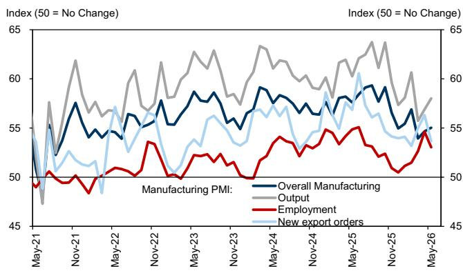
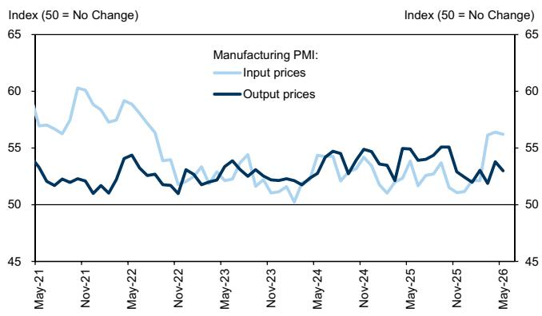

# 印度制造业的真正信号：内需托底，但成本压力正在重塑利润分配格局

5月的印度制造业PMI数据，看起来是一个温和的改善。从54.7上升到55.0，连续第三个月扩张，产出指数更是跳升至三个月高点58.0。如果只看这个数字，很容易得出“印度制造业景气度持续向好”的结论。但这份来自某外资投行的研报，真正值得关注的不是PMI本身，而是藏在细项里的结构性分化：内需强劲，但外需走弱；产出扩张，但成本压力仍处四年高位。这组矛盾信号指向一个更本质的追问——当前的增长，有多少是可持续的，又有多少是在消耗企业的利润空间？

这份报告的核心判断是：印度制造业正在经历一轮由国内需求驱动的复苏，但复苏的质量正在被上游成本侵蚀。对于投资者和产业决策者而言，真正需要跟踪的，不是PMI的绝对值，而是企业能否将成本压力传导至下游——这决定了利润分配的方向，也决定了哪些行业、哪些公司能在下一阶段跑赢。

## 1. 内需是当前唯一的引擎，但出口信号已经转弱

5月PMI的改善，几乎完全由国内需求拉动。产出指数从56.9升至58.0，受访企业明确将增长归因于“具有韧性的国内需求”。更细致地看，中间品和资本品行业的新订单增速最快，消费品则出现了放缓。这个结构本身就透露了关键信息：资本品和中间品的扩张，通常意味着下游企业正在加大投资或备货，指向的是对未来需求的乐观预期，而非当下消费的即时反馈。

但硬币的另一面是，新出口订单指数从4月的56.3骤降至53.7，创下三个月新低。这并不是一个孤立的下滑——在过去的几个季度里，印度出口订单的波动一直大于内需。全球贸易放缓、主要经济体需求降温，正在对印度出口形成实质性压制。这意味着，如果内需出现任何超预期的走弱，制造业将缺乏外部缓冲。

对于读者而言，这个分化带来的观察框架是：接下来需要重点追踪资本品订单的持续性。如果资本品扩张只是短期补库行为，而非趋势性投资周期启动，那么整个制造业的景气度将面临回调风险。

## 2. 成本压力并未真正缓解，定价权才是关键变量

PMI数据中最容易被忽视，但可能最具长期含义的，是价格分项。5月投入价格指数从56.4微降至56.2，产出价格指数从53.8降至53.0。表面上看，通胀压力似乎有所缓和。但报告明确指出，投入价格仍处于“近四年高位”附近，企业普遍反映能源、燃料、原材料和运输成本在上升。

这里有一个重要的结构性细节：资本品行业面临最高的投入成本通胀，消费品行业则最低。这意味着，不同行业的企业，承受的成本压力完全不同。资本品企业——通常是机械、设备、工程类公司——对上游原材料价格最为敏感，而消费品企业因为有更强的品牌溢价和终端定价能力，成本传导相对顺畅。

但更关键的问题是，产出价格指数在下降。这说明，尽管成本高企，企业并没有（或无法）将全部压力转嫁给下游。投入价格与产出价格之间的“剪刀差”在收窄，但并未消失。对于制造业企业来说，这意味着利润空间仍在被压缩。

这个信号对资产定价的含义是：当成本压力持续而定价能力不足时，市场将开始区分“有定价权的企业”和“被动接受价格的企业”。前者的利润率韧性更强，估值应该获得溢价；后者则可能面临盈利下修风险。报告没有展开这一层，但这是投资者必须自己做的功课。

## 3. 就业指数回落，是谨慎信号还是正常波动？

5月就业指数从4月的高位回落。报告没有给出具体数值，但趋势明确。这可能是整个PMI数据中最容易被低估的信号。

在PMI的五大分项中，就业通常是最滞后的指标。企业通常在确认需求可持续后才会增加招聘。因此，就业指数的回落，可能意味着企业对未来需求的信心出现了边际动摇。结合出口订单的下滑，这个信号值得警惕。

但也要注意，单月的数据波动并不构成趋势。印度制造业近年来经历了多次就业数据的短期波动，最终都回到了扩张区间。关键在于，接下来几个月就业指数是否会持续低于50的荣枯线。如果出现连续收缩，那就不是波动，而是需求走弱的确认。

对于产业决策者而言，就业数据是观察“增长是否惠及劳动力市场”的核心窗口。如果产出扩张但就业收缩，说明企业正在通过提高产能利用率而非增加人手来应对需求——这种增长模式的上限很低。

## 4. 报告尚未完全回答的关键问题：资本品扩张的可持续性

这份报告给出了清晰的数据和判断，但有一个核心问题没有展开：资本品行业的新订单高速增长，究竟是周期性的资本开支启动，还是政策驱动的短期脉冲？

印度近年来在基础设施和制造业领域推出了多项激励政策，包括生产挂钩激励计划（PLI）和基建投资计划。这些政策确实在推动资本品需求。但政策驱动的需求往往具有“前高后低”的特征——初期集中审批和采购，后续可能放缓。

报告没有提供资本品订单的同比增速或与历史周期的对比，也没有讨论政策刺激的边际递减效应。这是读者在阅读完整报告时需要自行追问的问题：如果剔除政策因素，内生性的资本开支需求究竟有多强？

这个未解问题，恰恰是判断印度制造业能否从“复苏”走向“扩张”的关键。如果资本品扩张是可持续的，那么整个制造业的景气周期将更长；如果只是政策脉冲，那么市场可能高估了未来几个季度的增长动能。

## 5. 一个更长期的观察框架：从“量的增长”转向“质的增长”

综合以上分析，对于关注印度市场的读者，可以建立一个简单的观察框架，用来评估制造业的真实健康状况，而不仅仅是PMI的读数。

第一层，看需求结构。内需和出口的比值是否在恶化。如果出口持续走弱，内需必须加速才能维持总量增长。但内需本身也有结构问题——消费品放缓意味着终端消费可能已经见顶。

第二层，看价格传导。投入价格与产出价格的差值，是衡量企业利润压力的直接指标。如果这个剪刀差持续扩大，意味着成本无法转嫁，企业盈利将承压。反之，如果产出价格开始回升，说明定价权正在回归。

第三层，看就业与投资的匹配度。就业指数是否与产出指数同步扩张。如果产出增长但就业停滞，说明增长是“浅层”的，缺乏劳动力市场的支撑。

第四层，看政策依赖度。资本品订单的增长，有多少来自政策激励，有多少来自市场内生需求。这个判断需要更长时间序列的数据和行业调研，但它是决定投资周期长度的核心变量。

这份研报的价值，不在于给出了一个简单的“看好”或“看空”结论，而在于提供了足够多的结构性细节，让读者能够建立起自己的分析框架。数据本身是中性的，真正的洞察来自于对数据背后因果链的追问。

---

以上讨论中，有一个关键假设尚未在公开研报中得到充分验证：资本品行业的高投入成本是否最终会传导至产出价格，从而推高整体制造业的通胀水平。如果这一传导发生，央行的政策路径可能比市场预期更鹰派。这个判断需要更详细的分行业定价数据来支撑。

欢迎来星球微信群里继续讨论，我们将分享完整研报中的原始图表和分项数据，并围绕“印度制造业利润分配的未来走向”做进一步的专题拆解。

Personal reading notes and learning share only. Not investment advice.

