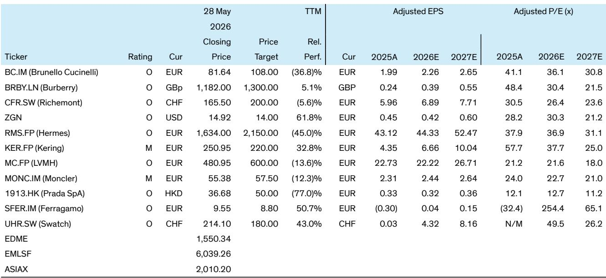
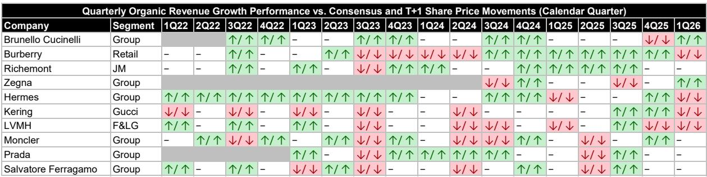
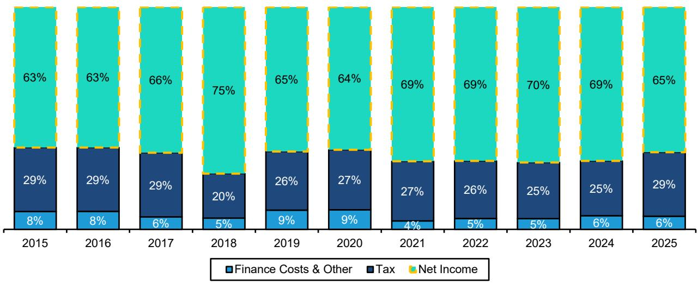

# 全球奢侈品定价的核心矛盾：市场低估的不是需求，而是供给侧的再定价

过去二十年，全球奢侈品行业以约8%的年复合增长率跑赢全球GDP三倍，投资者涌入这个赛道，本质上是在为“持续增长”支付溢价。但2025年以来，全球奢侈品板块估值大幅回撤：以NTM EV/Sales计算，板块交易在3.7倍，较2025年均值折价18%，较十年均值折价9%。与此同时，行业ROIC仍维持在15.0%的十年均值之上。某外资投行最新研报指出，当前市场最大的误判，并非对中国需求的过度悲观，而是对奢侈品行业“固定成本结构”下经营杠杆的重新定价尚未充分展开。

这份研报的核心贡献，是搭建了一个从收入增长到估值扩张的完整传导链条：收入超预期驱动经营杠杆，经营杠杆推动利润率扩张，利润率变化直接映射为EV/Sales倍数变动，最终通过ROIC改善传导至股东总回报。在这个框架下，当前估值与基本面的背离，恰恰指向了一个被忽视的投资窗口。

## 1. 奢侈品行业真正的护城河，藏在70%-80%的毛利率和固定成本结构里

研报揭示了一个常被误解的事实：奢侈品行业的竞争优势，并非来自品牌溢价本身，而是来自其独特的成本结构。行业平均毛利率高达70%-80%，因为原材料成本仅占零售价的极小部分。而运营支出的主体是零售门店租金、销售人员和营销费用——这些几乎全部是固定成本。

这意味着什么？规模本身就是最深的护城河。大型品牌可以用更低的销售费用率覆盖同样的固定成本，而小型品牌却要在同样昂贵的地段、同样稀缺的客户资源和人才市场上与巨头竞争。这种“规模驱动效率，效率强化竞争力”的正向循环，是奢侈品行业集中度持续提升的根本动力。

从研报提供的2025年行业成本结构来看，EBIT利润率平均为21%，而运营支出占收入的46%。在这样一个固定成本占比接近一半的行业里，收入增速的微小变化，都会通过经营杠杆被显著放大。

## 2. 收入增速的“超预期”才是股价的终极驱动力，而非利润本身

研报用一张长达17个季度的矩阵表格，清晰地揭示了奢侈品行业股价运行的核心规律：股价反应的是“收入增速是否超预期”，而不是利润是否增长。在统计的17个季度中，当公司季度有机收入增速超预期时，次日股价上涨的案例占比显著高于下跌；反之亦然。

这一发现挑战了传统投资框架中“利润为王”的直觉。但逻辑链条其实非常清晰：在固定成本结构下，收入超预期意味着经营杠杆的释放，而经营杠杆的释放会直接推动利润率扩张。更重要的是，奢侈品行业的利润表结构决定了，EBIT以下的项目（财务费用、税收）相对稳定，因此EBIT的变化几乎可以完整传递到净利润。这意味着，收入增速的“惊喜”或“失望”会以接近1:1的比例映射到利润端。

对投资者而言，这意味着盯住季度收入增速与市场预期的差距，比分析利润表细节更具前瞻性。

## 3. EBIT利润率每变动100个基点，估值倍数将同向变动约0.2倍

研报进一步量化了利润率与估值之间的传导关系：EBIT利润率的年度变化与EV/Sales倍数的变化之间存在稳定的正相关。从2006年至2025年的历史数据来看，EBIT利润率每扩张100个基点，EV/Sales倍数平均提升约0.2倍。

这个关系的稳定性来自于奢侈品行业利润结构的可预测性。由于财务费用和税率相对固定，EBIT的变化能够“干净地”传导至净利润，进而影响P/E估值。因此，有机收入增速通过影响利润率，最终成为估值倍数变化的最有效代理变量。

当前行业EV/Sales倍数处于十年均值以下9%的水平，而ROIC仍高于十年均值。这意味着，如果收入增速能够企稳甚至回升，估值修复的空间将是可观的。

## 4. ROIC与股东总回报的关联，比市场想象的更紧密

研报还建立了一个更长期的观察框架：ROIC的变化是预测中期股东总回报最有效的指标之一。这个关系在行业上行期和下行期都保持稳定。背后的逻辑是，ROIC的提升通常伴随着估值重估，而估值重估直接转化为股东总回报。

当前行业ROIC约为15.0%，高于十年均值14.6%。研报的预测更乐观，认为2026年ROIC有望达到15.9%。如果这一预测成立，那么当前估值折价与基本面之间的背离，将构成一个典型的均值回归机会。

但这里有一个关键假设需要验证：ROIC的韧性是否可持续？答案取决于收入增速能否恢复。如果中国消费者信心持续低迷，全球宏观经济进一步走弱，那么ROIC的支撑基础就会动摇。

## 5. 报告尚未完全回答的关键问题：中国需求的“结构性”还是“周期性”？

研报坦承，当前市场最大的分歧在于：中国奢侈品消费放缓是结构性还是周期性的？中国房地产危机和消费者信心崩塌导致行业增速显著放缓。研报的历史视角提供了一种安慰：过去30年，每当行业增速放缓，投资者都会担心“这是否是奢侈品的终点”，但每一次都不是。

然而，这一历史规律是否适用于当前的中国市场？中国奢侈品消费者的行为模式正在发生变化：从“炫耀性消费”向“体验式消费”迁移，从“品牌崇拜”向“性价比敏感”转变。这些变化究竟是经济周期导致的暂时调整，还是消费价值观的长期重塑？研报没有给出确定的答案，而是将这个问题留给了读者。

这恰恰是当前市场定价分歧的核心。如果中国需求是周期性的，那么当前估值折价就是过度反应；如果是结构性的，那么奢侈品行业的长期增长中枢可能下移，估值折价将具有合理性。

## 6. 投资者的观察框架：从“增长故事”转向“防御+自愈”的双轨配置

在高度不确定的宏观环境下，研报提出一个防御性的配置思路：核心仓位配置“优质但估值合理”的公司，同时配置“正在自我修复”的标的。

所谓“优质但估值合理”，指的是那些品牌力强、现金流稳定、但当前估值已充分反映悲观预期的公司。研报特别提到，某珠宝巨头因其强劲的珠宝业务增长和领导地位成为首选，另一家意大利奢侈品牌则因其品质和均值回归潜力受到青睐。

所谓“自我修复”，指的是那些正在进行品牌重塑、渠道优化或成本削减的公司。某英国奢侈品牌的转型已初见成效，其“Burberry Forward”战略在品牌势能和全价销售率上取得了进展；某意大利鞋履品牌则处于更早期的转型阶段，但管理层正在解决品牌、品类和零售网络等核心问题。

这种配置思路的核心逻辑是：在收入增速整体承压的背景下，市场将更关注公司自身的经营能力——能否通过品牌力维持定价权，能否通过运营效率提升利润率，能否通过自我修复实现超越行业平均的增长。

## 7. 未解的问题与下一步的观察点

这份研报的价值，不仅在于它提供了一个系统的估值分析框架，更在于它诚实地指出了当前框架中的不确定性。

第一个未解问题是：全球奢侈品需求复苏的路径和节奏。研报识别出两个波动源：一是消费者在脆弱的宏观环境和紧张的地缘政治中产生的需求波动；二是短期投资者多空博弈放大的股价波动。在双重波动叠加的背景下，任何预测都需要谨慎对待。

第二个未解问题是：不同品牌之间的分化将如何演化。研报的配置建议暗示，未来行业将不再是“水涨船高”的普涨格局，而是品牌力、运营能力和转型执行力决定胜负的分化格局。但哪些品牌能够真正实现“自我修复”，哪些只是昙花一现，仍需持续跟踪。

第三个未解问题是：估值折价何时会被修复。研报指出，当前估值与基本面之间存在背离，但背离持续的时间可能比基本面修复的时间更长。触发估值修复的条件是什么？是收入增速的明确拐点，还是市场对中国消费信心的重新评估？这些问题在研报中留下了伏笔。

这些未解的问题，恰恰是继续深入阅读完整报告、持续跟踪行业动态的价值所在。欢迎来星球微信群里继续讨论，我们会持续更新对这些关键问题的判断，并分享更详细的估值模型和公司分析。

---

Personal reading notes and learning share only. Not investment advice.

