APAC CONVICTION LIST - DIRECTORS' CUT

June update - Adding S-Oil

APAC Conviction List - Director's Cut

See the list >

We add S-Oil to the APAC Conviction List in this month's update. In addition, we highlight the upcoming catalysts for all the stocks on our APAC Conviction List, as well as key strategy and sector reports across Agentic Economy, Global Refining, and China Consumer.

S-Oil – Nikhil Bhandari's positive view on S-Oil is based on: 1) Potential strong free cash flow inflection (18% FCF yield in 2027E); 2) Favourable middle distillates exposure (diesel & jet fuel; \~56% of product yield) positioning the company well in a market where product tightness is likely to persist; 3) Consensus earnings upgrade to accelerate; and 4) Attractive valuation with shares discounting a combination of below mid-cycle diesel/jet cracks in 2027E and lower for longer chemical spreads for the upcoming Shaheen project (effectively assuming negative IRR on the new chemical project).

# Michael Snaith

+852-2978-0455

michael.snaith@gs.com

GS (Asia) L.L.C.

# Joy Nguyen

+852-2978-1106 | joy.nguyen@gs.com

GS (Asia) L.L.C.

# Matthew Ross

+61(3)9679-1616

matthew.ross@gs.com

GS Australia Pty Ltd

# Daiki Takayama

+81(3)4587-9870

daiki.takayama@gs.com

GS Japan Co., Ltd.

# Sho Kawano

+81(3)4587-9905 | sho.kawano@gs.com

GS Japan Co., Ltd.

# Caleb Chan

+852-2978-0790 | caleb.chan@gs.com

GS (Asia) L.L.C.

Exhibit 1: APAC Conviction List - Directors' Cut

June 2026: All price targets are for 12 months; prices are in LCY as of May 29, 2026; green shading indicates new additions

<table><tr><td>Ticker</td><td>Company Name</td><td>Market Cap ($, mn)</td><td>Last Close</td><td>Target Price</td><td>Upside to 12m PT</td><td>12m Fwd Div Yield</td><td>Total Return Potential (12m)</td><td>GS vs. Cons*</td><td>Analyst</td><td>Market / Exchange</td></tr><tr><td colspan="11">Consumer</td></tr><tr><td>278470.KS</td><td>APR Corp.</td><td>9,737</td><td>395,500</td><td>460000</td><td>16%</td><td>1%</td><td>17%</td><td>-1%</td><td>Diane Kang</td><td>South Korea</td></tr><tr><td>1364.HK</td><td>Guming Holdings Ltd.</td><td>6,918</td><td>22.80</td><td>36</td><td>58%</td><td>3%</td><td>61%</td><td>4%</td><td>Michelle Cheng</td><td>China H</td></tr><tr><td>3288.HK</td><td>Foshan Haitian Flavouring &amp; Food</td><td>24,356</td><td>32.62</td><td>47.3</td><td>45%</td><td>4%</td><td>49%</td><td>0%</td><td>Leaf Liu</td><td>China H</td></tr><tr><td>1318.HK</td><td>Mao Geping Cosmetics Co.</td><td>3,743</td><td>59.85</td><td>106</td><td>77%</td><td>3%</td><td>80%</td><td>-1%</td><td>Valerie Zhou</td><td>China H</td></tr><tr><td>TACN.BO</td><td>Tata Consumer Products Ltd.</td><td>11,440</td><td>1179.35</td><td>1450</td><td>23%</td><td>1%</td><td>24%</td><td>4%</td><td>Arnab Mitra</td><td>India</td></tr><tr><td>YUMC</td><td>Yum China Holdings</td><td>14,635</td><td>42.43</td><td>58</td><td>37%</td><td>3%</td><td>40%</td><td>-1%</td><td>Michelle Cheng</td><td>China US</td></tr><tr><td colspan="11">Financials</td></tr><tr><td>0012.HK</td><td>Henderson Land</td><td>19,125</td><td>30.96</td><td>41</td><td>32%</td><td>4%</td><td>36%</td><td>7%</td><td>Simon Cheung, CFA</td><td>Hong Kong</td></tr><tr><td>8411.T</td><td>Mizuho FG</td><td>110,215</td><td>7,195</td><td>8140</td><td>13%</td><td>2%</td><td>15%</td><td>0%</td><td>Makoto Kuroda</td><td>Japan</td></tr><tr><td colspan="11">Healthcare</td></tr><tr><td>FPH.AX</td><td>Fisher &amp; Paykel Healthcare Corp.</td><td>13,052</td><td>31.17</td><td>42.3</td><td>36%</td><td>2%</td><td>37%</td><td>3%</td><td>Davin Thillainathan, CFA</td><td>NZ</td></tr><tr><td>2359.HK</td><td>WuXi AppTec Co.</td><td>49,358</td><td>130.30</td><td>169.8</td><td>30%</td><td>2%</td><td>32%</td><td>12%</td><td>Ziyi Chen</td><td>China H</td></tr><tr><td colspan="11">Industrials</td></tr><tr><td>ALQ.AX</td><td>ALS Ltd.</td><td>8,597</td><td>23.59</td><td>28.3</td><td>20%</td><td>2%</td><td>22%</td><td>4%</td><td>Niraj Shah</td><td>Australia</td></tr><tr><td>JARD.SI</td><td>Jardine Matheson</td><td>44,541</td><td>66.38</td><td>95.5</td><td>44%</td><td>4%</td><td>48%</td><td>7%</td><td>Simon Cheung, CFA</td><td>Hong Kong</td></tr><tr><td>300124.SZ</td><td>Shenzhen Inovance Technology Co.</td><td>29,579</td><td>73.96</td><td>86</td><td>16%</td><td>1%</td><td>17%</td><td>-6%</td><td>Jacqueline Du</td><td>China A</td></tr><tr><td>6506.T</td><td>Yaskawa Electric</td><td>11,744</td><td>7,208</td><td>9200</td><td>28%</td><td>1%</td><td>29%</td><td>14%</td><td>Yuichiro Isayama</td><td>Japan</td></tr><tr><td colspan="11">Internet &amp; IT Services</td></tr><tr><td>BABA</td><td>Alibaba Group</td><td>298,136</td><td>124.22</td><td>186</td><td>50%</td><td>2%</td><td>52%</td><td>-23%</td><td>Ronald Keung, CFA</td><td>China US</td></tr><tr><td colspan="11">Mobility</td></tr><tr><td>MRTI.BO</td><td>Maruti Suzuki India</td><td>43,420</td><td>13119.85</td><td>15800</td><td>20%</td><td>1%</td><td>22%</td><td>2%</td><td>Chandramouli Muthiah</td><td>India</td></tr><tr><td colspan="11">Natural Resources</td></tr><tr><td>RMS.AX</td><td>Ramelius Resources</td><td>4,355</td><td>3.22</td><td>5.6</td><td>74%</td><td>2%</td><td>76%</td><td>13%</td><td>Hugo Nicolaci</td><td>Australia</td></tr><tr><td>010950.KS</td><td>S-Oil Corp.</td><td>8,297</td><td>107,400</td><td>147000</td><td>37%</td><td>3%</td><td>40%</td><td>-31%</td><td>Nikhil Bhandari</td><td>South Korea</td></tr><tr><td colspan="11">Technology</td></tr><tr><td>2317.TW</td><td>Hon Hai</td><td>130,703</td><td>289</td><td>400</td><td>38%</td><td>4%</td><td>42%</td><td>9%</td><td>Allen Chang</td><td>Taiwan</td></tr><tr><td>6920.T</td><td>Lasertec</td><td>22,736</td><td>40,130</td><td>55000</td><td>37%</td><td>1%</td><td>38%</td><td>23%</td><td>Shuhei Nakamura</td><td>Japan</td></tr><tr><td>6981.T</td><td>Murata Mfg.</td><td>122,584</td><td>9,625</td><td>5400</td><td>-44%</td><td>1%</td><td>-43%</td><td>7%</td><td>Daiki Takayama</td><td>Japan</td></tr><tr><td>8046.TW</td><td>NYPCB</td><td>17,492</td><td>848</td><td>1115</td><td>31%</td><td>2%</td><td>33%</td><td>61%</td><td>Chao Wang</td><td>Taiwan</td></tr><tr><td>2330.TW</td><td>TSMC</td><td>1,949,404</td><td>2,355</td><td>2750</td><td>17%</td><td>1%</td><td>18%</td><td>1%</td><td>Bruce Lu</td><td>Taiwan</td></tr><tr><td>300476.SZ</td><td>Victory Giant</td><td>47,387</td><td>368.52</td><td>550</td><td>49%</td><td>2%</td><td>51%</td><td>13%</td><td>Allen Chang</td><td>China A</td></tr></table>

\*FY1 EPS: 1364.HK, 3288.HK, 1318.HK, TACN.BO, YUMC, 0012.HK, 8411.T, FPH.AX, 2359.HK, ALQ.AX, 300124.SZ, 6506.T, BABA, RMS.AX, 010950.KS, 2317.TW, 6981.T, 8046.TW, 300476.SZ; FY1 EBITDA: ; FY1 Sales: MRTI.BO; FY2 EPS: 278470.KS, JARD.SI, 2330.TW; FY3 OP: 6920.T

Alibaba-H price target is HK\$180 (May 29 close: HK\$120.9); TSMC ADR price target is \$550 (May 29 close: \$418.45); Wuxi AppTec-A price target is Rmb151.9 (May 29 close: Rmb101.6); Yum China-H price target is HK\$452 (May 29 close: HK\$343)

Source: GS Global Investment Research, Bloomberg

# Our 24 Differentiated Buy Recommendations

The company-specific discussion in the sections below reflects the views of the covering analyst.

Exhibit 2: Anatomy of the List   
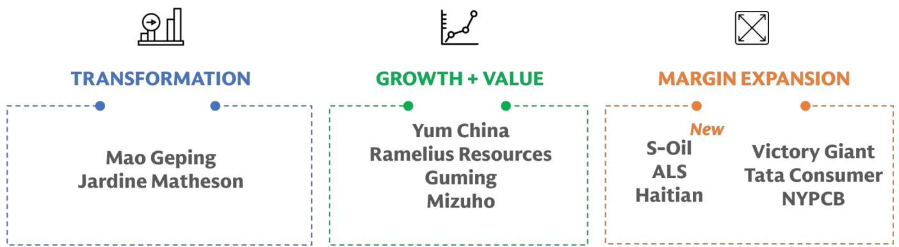

flowchart

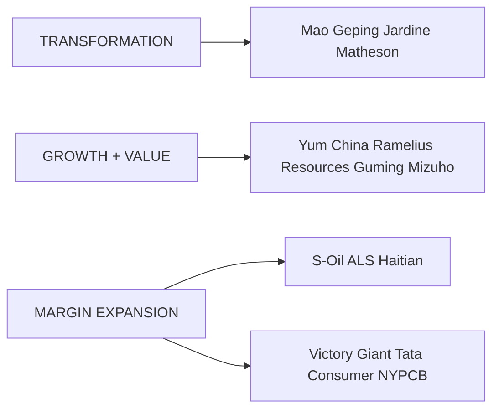

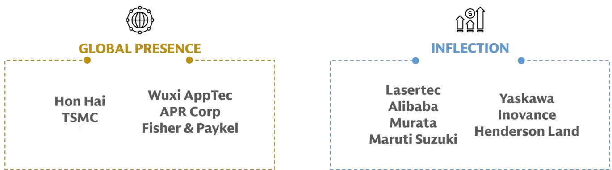

flowchart

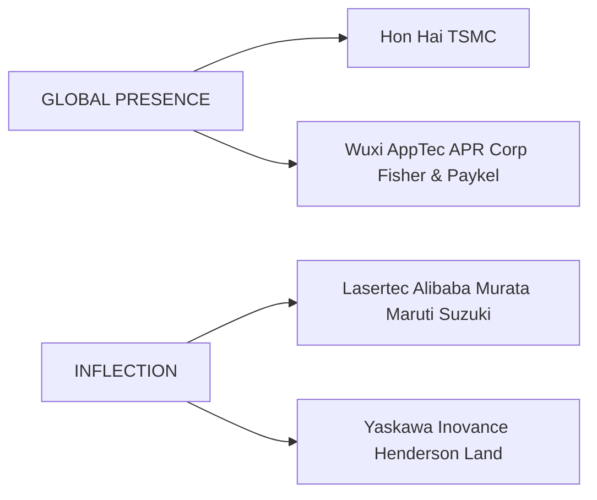

Source: GS Global Investment Research

Exhibit 3: Regional exposure of the APAC Conviction List
Companies by domicile (%)   
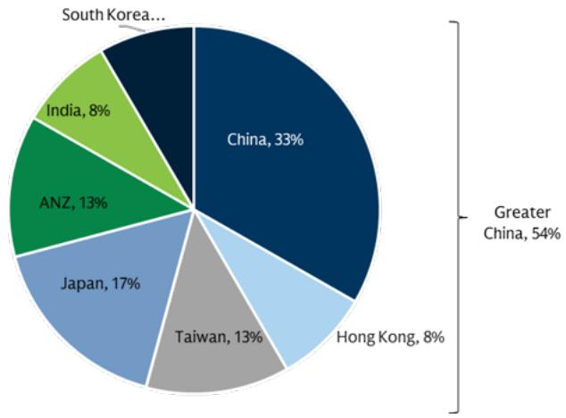

pie

| Region | Percentage (%) |
| :--- | :--- |
| China | 33 |
| Greater China | 54 |
| Japan | 17 |
| Taiwan | 13 |
| Hong Kong | 8 |
| ANZ | 13 |
| India | 8 |
| South Korea... | 9 |

Source: Bloomberg, GS Global Investment Research

Exhibit 4: Sector exposure of the APAC Conviction List
Companies by GICS Level 1 Sector (%)   
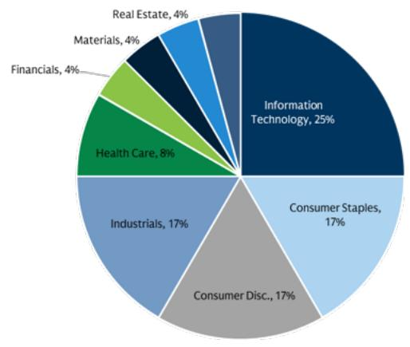

pie

| Category | Percentage (%) |
| :--- | :--- |
| Information Technology | 25 |
| Consumer Staples | 17 |
| Consumer Disc. | 17 |
| Industrials | 17 |
| Health Care | 8 |
| Financials | 4 |
| Materials | 4 |
| Real Estate | 4 |

Source: Bloomberg, GS Global Investment Research

Exhibit 5: APAC Conviction List - Directors' Cut 

<table><tr><td>Ticker</td><td>Company Name</td><td>Summary</td></tr><tr><td colspan="3">Consumer</td></tr><tr><td>278470.KS</td><td>APR Corp.</td><td>Drivers of sustainable growth materializing</td></tr><tr><td>1364.HK</td><td>Guming Holdings Ltd.</td><td>High growth visibility amid consumption uncertainties</td></tr><tr><td>3288.HK</td><td>Foshan Haitian Flavouring &amp; Food</td><td>Solid growth visibility as the leader pivots to a recovery path</td></tr><tr><td>1318.HK</td><td>Mao Geping Cosmetics Co.</td><td>Monetizing brand strength with category &amp; channel expansion</td></tr><tr><td>TACN.BO</td><td>Tata Consumer Products Ltd.</td><td>Industry leading mid-teens volume growth, margin recovery on track</td></tr><tr><td>YUMC</td><td>Yum China Holdings</td><td>Growth certainty with strong track record navigating market volatility</td></tr><tr><td colspan="3">Financials</td></tr><tr><td>0012.HK</td><td>Henderson Land</td><td>Recovery after prolonged downturn</td></tr><tr><td>8411.T</td><td>Mizuho FG</td><td>Entering new phase of growth investment &amp; shareholder returns</td></tr><tr><td colspan="3">Healthcare</td></tr><tr><td>FPH.AX</td><td>Fisher &amp; Paykel Healthcare Corp.</td><td>Growing portfolio breadth assists market share &amp; pricing power</td></tr><tr><td>2359.HK</td><td>WuXi AppTec Co.</td><td>Favorable product cycle and technology depth in TIDES drive visibility beyond 2026</td></tr><tr><td colspan="3">Industrials</td></tr><tr><td>ALQ.AX</td><td>ALS Ltd.</td><td>Improving commodities momentum continues to drive cyclical leverage</td></tr><tr><td>JARD.SI</td><td>Jardine Matheson</td><td>Strategic change to drive efficiency gains and unlock value</td></tr><tr><td>300124.SZ</td><td>Shenzhen Inovance Technology Co.</td><td>Order momentum, capacity expansion and price hikes drive re-acceleration</td></tr><tr><td>6506.T</td><td>Yaskawa Electric</td><td>AI Capex and Motion Control recovery driving substantial upside</td></tr><tr><td colspan="3">Internet &amp; IT Services</td></tr><tr><td>BABA</td><td>Alibaba Group</td><td>Full-stack AI leader with EPS recovery ahead</td></tr><tr><td colspan="3">Mobility</td></tr><tr><td>MRTI.BO</td><td>Maruti Suzuki India</td><td>Small car elasticity + Product cycle inflection</td></tr><tr><td colspan="3">Natural Resources</td></tr><tr><td>RMS.AX</td><td>Ramelius Resources</td><td>An attractive mix of longer term value and output growth</td></tr><tr><td>010950.KS</td><td>S-Oil Corp.</td><td>Refining supercycle underpinned by structural tightness</td></tr><tr><td colspan="3">Technology</td></tr><tr><td>2317.TW</td><td>Hon Hai</td><td>Growth acceleration from AI servers &amp; smartphones</td></tr><tr><td>6920.T</td><td>Lasertec</td><td>Earnings to accelerate, driven by game-changing new product</td></tr><tr><td>6981.T</td><td>Murata Mfg.</td><td>Tightening MLCC demand/supply driving earnings momentum</td></tr><tr><td>8046.TW</td><td>NYPCB</td><td>Elongated pricing upcycle to drive above consensus growth</td></tr><tr><td>2330.TW</td><td>TSMC</td><td>Easing Concerns on AI demand to drive outperformance</td></tr><tr><td>300476.SZ</td><td>Victory Giant</td><td>AI Server PCB leader riding on specification upgrades and global expansion</td></tr></table>

Source: GS Global Investment Research

# Upcoming Catalysts

We provide a rolling calendar of earnings and non-earnings events our analysts have identified as possible catalysts.

Exhibit 6: Upcoming Non-Earnings Catalysts   
Upcoming Non-Earnings Catalysts 

<table><tr><td>Ticker</td><td>Company Name</td><td>Date</td><td>Event</td></tr><tr><td>1318.HK</td><td>Mao Geping Cosmetics Co.</td><td>May/Jun-2026</td><td>618 shopping festival</td></tr><tr><td>278470.KS</td><td>APR Corp.</td><td>May/Jun-2026</td><td>Emergence of next champion SKU (e.g., sun products targeted for US launch)</td></tr><tr><td>JARD.SI</td><td>Jardine Matheson</td><td>16/06/2026</td><td>Investor Day</td></tr><tr><td>MRTI.BO</td><td>Maruti Suzuki India</td><td>1H 2026</td><td>Potential new Electric Car launch</td></tr><tr><td>JARD.SI</td><td>Jardine Matheson</td><td>1H 2026</td><td>Astra/JC&amp;C strategic review conclusion</td></tr></table>

Source: Company data, GS Global Investment Research

Exhibit 7: Upcoming Earnings Catalysts in the Next 3 Months   
Upcoming Earnings Catalysts 

<table><tr><td>Ticker</td><td>Company Name</td><td>Date</td><td>Event</td></tr><tr><td>6506.T</td><td>Yaskawa Electric</td><td>03/07/2026</td><td>2027 First Quarter Earnings Release</td></tr><tr><td>2330.TW</td><td>TSMC</td><td>17/07/2026</td><td>2026 Second Quarter Earnings Release</td></tr><tr><td>TACN.BO</td><td>Tata Consumer Products Ltd.</td><td>23/07/2026</td><td>2027 First Quarter Earnings Release</td></tr><tr><td>010950.KS</td><td>S-Oil Corp.</td><td>27/07/2026</td><td>2026 Second Quarter Earnings Release</td></tr><tr><td>2359.HK</td><td>WuXi AppTec Co.</td><td>28/07/2026</td><td>2026 Second Quarter Earnings Release</td></tr><tr><td>JARD.SI</td><td>Jardine Matheson</td><td>30/07/2026</td><td>2026 First Half Earnings Release</td></tr><tr><td>8411.T</td><td>Mizuho FG</td><td>31/07/2026</td><td>2027 First Quarter Earnings Release</td></tr><tr><td>MRTI.BO</td><td>Maruti Suzuki India</td><td>31/07/2026</td><td>2027 First Quarter Earnings Release</td></tr><tr><td>6981.T</td><td>Murata Mfg.</td><td>31/07/2026</td><td>2027 First Quarter Earnings Release</td></tr><tr><td>YUMC</td><td>Yum China Holdings</td><td>05/08/2026</td><td>2026 Second Quarter Earnings Release</td></tr><tr><td>8046.TW</td><td>NYPCB</td><td>06/08/2026</td><td>2026 Second Quarter Earnings Release</td></tr><tr><td>278470.KS</td><td>APR Corp.</td><td>06/08/2026</td><td>2026 Second Quarter Earnings Release</td></tr><tr><td>6920.T</td><td>Lasertec</td><td>07/08/2026</td><td>2026 Annual Earnings Release</td></tr><tr><td>2317.TW</td><td>Hon Hai</td><td>12/08/2026</td><td>2026 Second Quarter Earnings Release</td></tr><tr><td>0012.HK</td><td>Henderson Land</td><td>20/08/2026</td><td>2026 First Half Earnings Release</td></tr><tr><td>300124.SZ</td><td>Shenzhen Inovance Technology Co.</td><td>25/08/2026</td><td>2026 Second Quarter Earnings Release</td></tr><tr><td>1364.HK</td><td>Guming Holdings Ltd.</td><td>26/08/2026</td><td>2026 First Half Earnings Release</td></tr><tr><td>300476.SZ</td><td>Victory Giant</td><td>26/08/2026</td><td>2026 Second Quarter Earnings Release</td></tr><tr><td>1318.HK</td><td>Mao Geping Cosmetics Co.</td><td>27/08/2026</td><td>2026 First Half Earnings Release</td></tr><tr><td>BABA</td><td>Alibaba Group</td><td>28/08/2026</td><td>2027 First Quarter Earnings Release</td></tr><tr><td>3288.HK</td><td>Foshan Haitian Flavouring &amp; Food</td><td>28/08/2026</td><td>2026 Second Quarter Earnings Release</td></tr></table>

Source: Bloomberg, GS Global Investment Research

# S-Oil - Refining supercycle underpinned by structural tightness

Covered by Nikhil Bhandari (nikhil.bhandari@gs.com, +65 6889-2867)

<table><tr><td>010950.KS</td><td>12m Price Target: W147000</td><td colspan="2">Price: W107400</td><td colspan="2">Upside: 36.9%</td></tr><tr><td rowspan="2">BuyCL</td><td rowspan="2">GS Forecast</td><td></td><td></td><td></td><td></td></tr><tr><td>12/25</td><td>12/26E</td><td>12/27E</td><td>12/28E</td></tr><tr><td>Market cap: W12.5tr / $8.3bn</td><td>Revenue (W bn)</td><td>34,247</td><td>41,360</td><td>39,508</td><td>40,537</td></tr><tr><td>Enterprise value: W18.3tr / $12.2bn</td><td>EBITDA (W bn)</td><td>1,082</td><td>3,341</td><td>3,325</td><td>3,528</td></tr><tr><td>3m ADTV :W117.9bn/ $79.6mn</td><td>EPS (W)</td><td>584</td><td>10,993</td><td>17,406</td><td>15,891</td></tr><tr><td>South Korea</td><td>P/E (X)</td><td>108.4</td><td>9.8</td><td>6.2</td><td>6.8</td></tr><tr><td rowspan="2">Asia Energy &amp; Chemicals</td><td>P/B (X)</td><td>0.8</td><td>1.2</td><td>1.1</td><td>1.0</td></tr><tr><td>Dividend yield (%)</td><td>0.6</td><td>2.8</td><td>4.1</td><td>4.4</td></tr><tr><td>M&amp;A Rank: 3</td><td>N debt/EBITDA (ex lease,X)</td><td>5.5</td><td>1.7</td><td>1.2</td><td>0.6</td></tr><tr><td rowspan="4">Leases incl. in net debt &amp; EV?: No</td><td>CROCI (%)</td><td>4.9</td><td>11.7</td><td>11.2</td><td>11.8</td></tr><tr><td>FCF yield (%)</td><td>(3.3)</td><td>3.8</td><td>18.4</td><td>20.2</td></tr><tr><td></td><td>12/25</td><td>3/26E</td><td>6/26E</td><td>9/26E</td></tr><tr><td>EPS (W)</td><td>2,121.00</td><td>1,143.95</td><td>2,802.34</td><td>1,776.72</td></tr></table>

Source: Company data, GS estimates, FactSet. Price as of 29 May 2026 close.

Core Thesis: Nikhil Bhandari's positive view on S-Oil is based on: 1) Potential strong free cash flow inflection (18% FCF yield in 2027E) driven by a significant decline in capex next year with the company on track to complete the US\$7bn capex expansion by mid-2026. 2) Favourable middle distillates exposure (diesel & jet fuel; \~56% of product yield) positioning the company well in a market where product tightness is likely to persist. He views middle distillates as the key bottlenecks in the refining system, which he expects to remain tight over the medium term especially in longer disruption scenarios where refined product inventories could decline to historical lows by 4Q (see our recent Global Refining note). 3) Consensus earnings upgrade to accelerate with 1Q OP already having accounted for a significant portion of 2026 Bloomberg consensus operating profit, while 2Q could shape up as another strong quarter. S-Oil's crude premiums and logistical cost (freight/insurance) have remained under control, while product cracks could be supported by other Asian refiners who are more marginal on the cost curve. 4) Attractive valuation with shares discounting a combination of below mid-cycle diesel/jet cracks in 2027E and lower-for-longer chemical spreads for the upcoming Shaheen project (effectively assuming negative IRR on the new chemical project).

Nikhil thinks that S-Oil's share price may remain volatile in the near-term especially with the ongoing oil price volatility. That said, Nikhil sees good opportunity to buy on dips given the market likely underestimates the more lasting impact of the refined product market disruption as compared to the crude market.

# Key debates & GS views:

# ■ Refining margins to remain strong even in near-term de-escalation scenarios:

Nikhil's updated refining framework suggests that refining margins should remain robust in 2H even in a scenario of a near-term de-escalation in the Middle East conflict, with his balances pointing to persistent product tightness in 2H (especially diesel/jet) even if Hormuz flows fully recover by end-June and refinery runs

normalize in August (accounting for transit time). OECD product inventories could even fall to historical lows in longer disruption scenarios, which could imply greater demand destruction than in Nikhil's base case of flat yoy demand or incentives for underutilized Chinese refineries to ramp, both requiring higher product cracks. Based on the inventory-to-crack relationship, Nikhil estimate Singapore complex GRM fair value at c.US\$14/bbl by end-2026 (vs. mid-cycle levels at US\$8/bbl) in the base case (which assumes Gulf exports normalize by end-June), with ranges up to US\$18/bbl in longer disruption scenarios.

Middle distillates to lead refining margins strength: The largest refined product supply disruption has been in middle distillates on a volume basis, reflecting the high middle distillate yield of Middle Eastern crude grades. At the same time, diesel demand is the most price inelastic and correlated with industrial activities, given its essential role in heavy transport, mining, and agriculture, hence requiring much higher prices for demand destruction to occur. Nikhil's sees S-Oil's earnings and cash flows as strongly leveraged to higher middle distillate cracks given its high middle distillates exposure (\~56% of product yield) where every US\$1/bbl higher diesel/jet crack drives \~6% higher 2027E EBITDA, whilst alongside a significant moderation in capex could drive 18% FCF yield in 2027E.   
- Attractive valuation: The stock is currently discounting a combination of below mid-cycle diesel/jet cracks in 2027E and lower-for-longer chemical spreads for the upcoming Shaheen project (effectively assuming negative IRR on the new chemical project), which in Nikhil's view, leaves the market underestimating both the duration of elevated product cracks and the potential cyclical recovery in petchem margins. While Nikhil's base case assumes below mid-cycle petchem margins in 2027E, he notes that the petchem industry would be in its 6th year of down-cycle next year when the Shaheen project starts up. Hence, the possibility of a faster-than-expected cyclical recovery in the petchem industry comes at a free optionality, which would imply significantly higher fair value of S-Oil's stock.

Catalysts: 1) Longer duration of Hormuz disruption or greater permanent scarring of upstream and refining capacities; (2) Delays to commissioning timelines for large upcoming refineries (eg. Dos Bocas); and (3) Faster-than-expected ramp up of Shaheen project.

Valuation & TP: 12m TP of W147,000 based on 6.5x 2028E EV/EBITDA (2028E implied value discounted back to 2027E based on 10% cost of equity).

Exhibit 8: We believe S-Oil's shares are now discounting below mid-cycle diesel cracks in 2027 

<table><tr><td rowspan="3" colspan="2"></td><td colspan="2">Shaheen project scenarios</td></tr><tr><td>Lower for longer chemical spreads</td><td>Mid-cycle long-term chemical spreads</td></tr><tr><td>-5% IRR scenario</td><td>5% IRR scenario</td></tr><tr><td rowspan="5">Diesel/Jet crack, US$/bbl (2027E)</td><td>$34 (severely adverse scenario implied)</td><td>182%</td><td>277%</td></tr><tr><td>$28 (forward curve)</td><td>131%</td><td>226%</td></tr><tr><td>$23 (GSe)</td><td>90%</td><td>185%</td></tr><tr><td>$18 (mid-cycle)</td><td>40%</td><td>135%</td></tr><tr><td>$12 (low-cycle)</td><td>-20%</td><td>75%</td></tr></table>

Implied valuation is calculated on 2027E basis, based on 6.5x EV/EBITDA multiple, while CWIP for Shaheen project is valued separately using IRR scenarios. Priced as of 29 May 2026.

Exhibit 9: We expect FCF (excl. working capital changes) to inflect to W2.3tn in 2027E as the Shaheen project gets completed after 4 years of weak FCF generation   
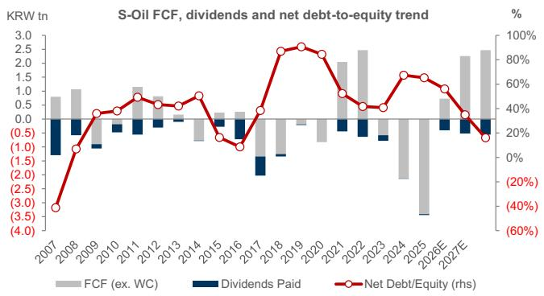

bar_line

S-Oil FCF, dividends and net debt-to-equity trend
| Year | FCF (ex. WC) (trillion KRW tn) | Dividends Paid (trillion KRW tn) | Net Debt/Equity (rhs) (%) |
|---|---|---|---|
| 2007 | 0.8 | -0.5 | -35 |
| 2008 | 1.1 | -0.6 | -10 |
| 2009 | 0.4 | -0.8 | 2 |
| 2010 | 0.6 | -0.7 | 3 |
| 2011 | 1.2 | -0.6 | 5 |
| 2012 | 0.7 | -0.5 | 4 |
| 2013 | 0.6 | -0.4 | 4 |
| 2014 | 0.3 | -0.3 | 6 |
| 2015 | 0.2 | -0.2 | -1 |
| 2016 | 0.3 | -0.1 | -1 |
| 2017 | 0.4 | -1.5 | 3 |
| 2018 | 0.1 | -1.2 | 85 |
| 2019 | -0.1 | -1.3 | 95 |
| 2020 | -0.3 | -1.4 | 85 |
| 2021 | 2.1 | -1.3 | 55 |
| 2022 | 2.5 | -1.4 | 45 |
| 2023 | 2.6 | -1.5 | 45 |
| 2024 | -1.8 | -1.6 | 65 |
| 2025E | -3.5 | -1.7 | 65 |
| 2026E | 0.6 | -1.8 | 55 |
| 2027E | 2.4 | -1.9 | 35 |
| **Dividends Paid** | -0.4 | -1.9 | - |
*Net Debt/Equity (rhs) %

Source: Company data, GS Global Investment Research   
Source: GS Global Investment Research

# Relevant Research:

GLOBAL: OIL - Refining: The Product Supply Challenge Even in a De-Escalation Scenario

APAC ENERGY: Refining supercycle underpinned by structural tightness (Thai Oil to Buy), Upstream TP upgrades, and India OMC downgrades

S-Oil Corp. (010950.KS): Upgrade to Buy on favorable diesel exposure, peak capex and attractive valuations

Buy

# S-Oil Corp. (010950.KS)

Nikhil Bhandari

Price: W107,400

nikhil.bhandari@gs.com

12m Price Target: W147,000

+65 6889-2867

Upside: 36.9%

Singapore

Price as of May 29, 2026

Key Data 

<table><tr><td>Market cap</td><td>W12.5tr</td><td>$8.3bn</td></tr><tr><td>Enterprise value</td><td>W18.3tr</td><td>$12.2bn</td></tr><tr><td>3m ADTV</td><td>W117.9bn</td><td>$79.6mn</td></tr><tr><td>South Korea</td><td></td><td></td></tr><tr><td>Asia Energy &amp; Chemicals</td><td></td><td></td></tr><tr><td>M&amp;A Rank</td><td>3</td><td></td></tr><tr><td>Leases incl. in net debt &amp; EV?</td><td>No</td><td></td></tr></table>

<table><tr><td>GS Forecast</td><td>2023</td><td>2024</td><td>2025</td><td>2026E</td><td>2027E</td><td>2028E</td></tr><tr><td>Revenue (W bn)</td><td>35,727</td><td>36,637</td><td>34,247</td><td>41,360</td><td>39,508</td><td>40,537</td></tr><tr><td>EBITDA (W bn)</td><td>2,074</td><td>1,174</td><td>1,082</td><td>3,341</td><td>3,325</td><td>3,528</td></tr><tr><td>EPS (W)</td><td>8,948</td><td>1,069</td><td>584</td><td>10,993</td><td>17,406</td><td>15,891</td></tr><tr><td>P/E (X)</td><td>8.4</td><td>62.2</td><td>108.4</td><td>9.8</td><td>6.2</td><td>6.8</td></tr><tr><td>P/B (X)</td><td>1.0</td><td>0.9</td><td>0.8</td><td>1.2</td><td>1.1</td><td>1.0</td></tr><tr><td>Dividend yield (%)</td><td>2.3</td><td>0.2</td><td>0.6</td><td>2.8</td><td>4.1</td><td>4.4</td></tr><tr><td>N debt/EBITDA (ex lease,X)</td><td>1.8</td><td>5.0</td><td>5.5</td><td>1.7</td><td>1.2</td><td>0.6</td></tr><tr><td>CROCI (%)</td><td>10.1</td><td>6.0</td><td>4.9</td><td>11.7</td><td>11.2</td><td>11.8</td></tr><tr><td>FCF yield (%)</td><td>3.2</td><td>(17.4)</td><td>(3.3)</td><td>3.8</td><td>18.4</td><td>20.2</td></tr></table>

<table><tr><td>Ratios &amp; Valuations</td><td>2023</td><td>2024</td><td>2025</td><td>2026E</td><td>2027E</td><td>2028E</td></tr><tr><td>P/E (X)</td><td>8.4</td><td>62.2</td><td>108.4</td><td>9.8</td><td>6.2</td><td>6.8</td></tr><tr><td>P/B (X)</td><td>1.0</td><td>0.9</td><td>0.8</td><td>1.2</td><td>1.1</td><td>1.0</td></tr><tr><td>FCF yield (%)</td><td>3.2</td><td>(17.4)</td><td>(3.3)</td><td>3.8</td><td>18.4</td><td>20.2</td></tr><tr><td>EV/EBITDAR (X)</td><td>6.0</td><td>11.6</td><td>12.3</td><td>5.5</td><td>5.0</td><td>4.1</td></tr><tr><td>EV/EBITDA (excl. leases) (X)</td><td>6.0</td><td>11.6</td><td>12.3</td><td>5.5</td><td>5.0</td><td>4.1</td></tr><tr><td>CROCI (%)</td><td>10.1</td><td>6.0</td><td>4.9</td><td>11.7</td><td>11.2</td><td>11.8</td></tr><tr><td>ROE (%)</td><td>11.9</td><td>1.4</td><td>0.8</td><td>13.4</td><td>18.7</td><td>15.3</td></tr><tr><td>Net debt/equity (%)</td><td>40.8</td><td>67.4</td><td>67.3</td><td>57.0</td><td>35.4</td><td>16.4</td></tr><tr><td>Net debt/equity (excl. leases) (%)</td><td>40.8</td><td>67.4</td><td>67.3</td><td>57.0</td><td>35.4</td><td>16.4</td></tr><tr><td>Interest cover (X)</td><td>5.7</td><td>1.5</td><td>0.9</td><td>7.5</td><td>7.6</td><td>10.3</td></tr><tr><td>Days inventory outst, sales</td><td>47.9</td><td>45.5</td><td>40.9</td><td>31.0</td><td>34.7</td><td>33.5</td></tr><tr><td>Receivable days</td><td>30.4</td><td>32.2</td><td>31.0</td><td>23.9</td><td>27.6</td><td>26.7</td></tr><tr><td>Days payable outstanding</td><td>58.8</td><td>69.5</td><td>83.2</td><td>79.7</td><td>87.0</td><td>84.0</td></tr><tr><td>DuPont ROE (%)</td><td>11.5</td><td>1.4</td><td>0.8</td><td>12.5</td><td>17.7</td><td>14.5</td></tr><tr><td>Turnover (X)</td><td>1.7</td><td>1.5</td><td>1.4</td><td>1.4</td><td>1.4</td><td>1.5</td></tr><tr><td>Leverage (X)</td><td>2.4</td><td>2.8</td><td>2.8</td><td>2.8</td><td>2.4</td><td>2.2</td></tr><tr><td>Gross cash invested (ex cash) (W)</td><td>19,043</td><td>21,371</td><td>22,452</td><td>24,536</td><td>24,860</td><td>25,177</td></tr><tr><td>Average capital employed (W)</td><td>12,374</td><td>13,638</td><td>14,697</td><td>15,475</td><td>15,812</td><td>15,178</td></tr><tr><td>BVPS (W)</td><td>77,629</td><td>74,692</td><td>76,182</td><td>88,162</td><td>98,400</td><td>109,524</td></tr></table>

<table><tr><td>Growth &amp; Margins (%)</td><td>2023</td><td>2024</td><td>2025</td><td>2026E</td><td>2027E</td><td>2028E</td></tr><tr><td>Total revenue growth</td><td>(15.8)</td><td>2.5</td><td>(6.5)</td><td>20.8</td><td>(4.5)</td><td>2.6</td></tr><tr><td>EBITDA growth</td><td>(48.1)</td><td>(43.4)</td><td>(7.9)</td><td>208.9</td><td>(0.5)</td><td>6.1</td></tr><tr><td>EPS growth</td><td>(56.6)</td><td>(88.1)</td><td>(45.3)</td><td>1,781.7</td><td>58.3</td><td>(8.7)</td></tr><tr><td>DPS growth</td><td>(69.1)</td><td>(92.6)</td><td>196.1</td><td>703.8</td><td>46.5</td><td>8.7</td></tr><tr><td>EBIT margin</td><td>3.8</td><td>1.2</td><td>0.8</td><td>6.1</td><td>6.1</td><td>6.3</td></tr><tr><td>EBITDA margin</td><td>5.8</td><td>3.2</td><td>3.2</td><td>8.1</td><td>8.4</td><td>8.7</td></tr><tr><td>Net income margin</td><td>2.9</td><td>0.3</td><td>0.2</td><td>3.1</td><td>5.1</td><td>4.6</td></tr></table>

Source: Company data, GS estimates.

# Spotlight - Global Macro & Strategy, Asia Strategy, Agentic Economy, Global Refining, China Consumer

# Global Macro & Strategy – Momentum risks yielding to bonds (Link, Link). Jan Hatzius, Peter Oppenheimer

Our economists have lowered their 12-month US recession probability by 5 percentage points to 25%, though they still anticipate below-trend growth and rising unemployment. They expect these conditions to eventually prompt the FOMC to deliver two final 25-basis-point normalization cuts, which have been delayed to December 2026 and March 2027 due to reduced recession risks and higher near-term core PCE inflation. Additionally, our economists project the ECB will execute two 25-basis-point hikes in June and September 2026 before reversing course in early 2027. Meanwhile, they observe that China maintains solid growth, although a severe imbalance between robust goods production and weak domestic demand persists.

Our strategists expect global equities to continue pushing higher, supported by resilient global growth and strong earnings upgrades led by the technology and energy sectors. However, they note that momentum is becoming increasingly concentrated and positioning appears stretched, with the Risk Appetite Indicator rising above 1.1, leaving markets more vulnerable to negative surprises. Furthermore, our strategists believe interest rates are becoming a key constraint, as higher bond yields begin to weigh on valuations and equities exhibit greater sensitivity to rate movements. Despite near-term correction risks if the growth and inflation mix deteriorates, they remain optimistic about opportunities to generate alpha by identifying emerging pockets of value within the growth space and growth opportunities within value segments.

Exhibit 10: Global Macro - Fed Cuts on a More Delayed Schedule   
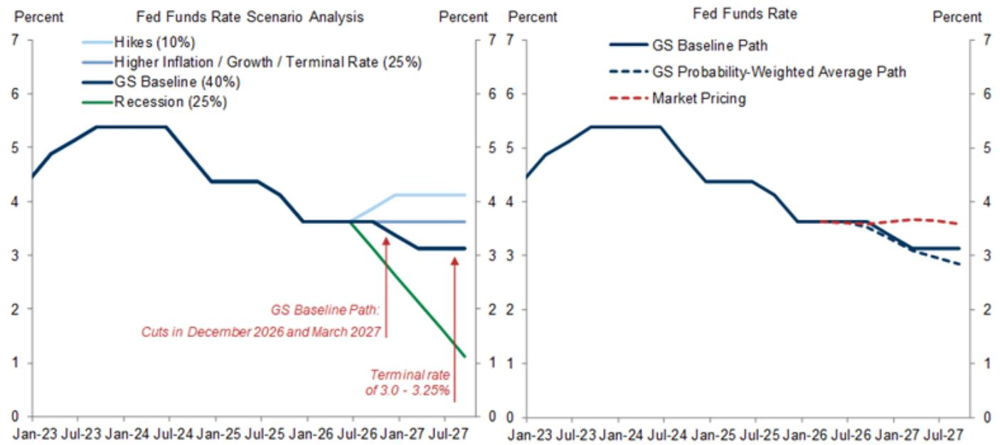

line

| Period | Hikes (10%) | Higher Inflation / Growth / Terminal Rate (25%) | GS Baseline (40%) | Recession (25%) |
|--------|-------------|-----------------------------------------------|-------------------|-----------------|
| Jan-23 | 4.5         | 4.5                                           | 4.5               | 4.5             |
| Jul-23 | 5.0         | 5.0                                           | 5.0               | 5.0             |
| Jan-24 | 5.5         | 5.5                                           | 5.5               | 5.5             |
| Jul-24 | 5.5         | 5.5                                           | 5.5               | 5.5             |
| Jan-25 | 4.5         | 4.5                                           | 4.5               | 4.5             |
| Jul-25 | 4.5         | 4.5                                           | 4.5               | 4.5             |
| Jan-26 | 3.5         | 3.5                                           | 3.5               | 3.5             |
| Jul-26 | 3.5         | 3.5                                           | 3.5               | 3.5             |
| Jan-27 | 3.0         | 3.0                                           | 3.0               | 3.0             |
| Jul-27 | 3.0         | 3.0                                           | 3.0               | 3.0             |

Source: Bloomberg, GS Global Investment Research

# Asian Equity Perspectives – Stay the course (Link). Timothy Moe

Our strategists remain positive on North Asia and key structural themes, raising 2026 earnings growth forecasts for tech-heavy Korea (to +300%) and Taiwan (+45%). Driven by stronger earnings, they have increased their KOSPI target to 9,000 and their 12-month MXAPJ index target to 990, implying 13% and 16% USD price and total returns, respectively. Their core view emphasizes structural themes resilient to or bolstered by the Iran conflict, including energy security, defense, US re-industrialization, and the semiconductor memory cycle. Our strategists retain an overweight stance on Korea, Japan, and China, and a constructive marketweight view on Taiwan. They also introduce a regional HALO basket and screens for oil supply shock winners and losers. Following sharp rebounds from March lows, they view derivative overlays as tactically attractive for hedging pullback risk, favoring zero-cost put spread collars on the KOSPI200 and TWSE indices.

Exhibit 11: Asia Strategy – Our strategists favor North Asia and HALO/energy security themes, and remain selective on AI exposure 

<table><tr><td colspan="5">Summary Views</td></tr><tr><td colspan="2">Returns &amp; Growth (MXAPJ)</td><td>12m index target: 990, implying 13%/16% USD price/total return; GSe path (3/6/12m): 900/940/990; 60%/20% EPSg in 2026/27</td><td rowspan="7">Themes &amp; Implementation Ideas</td><td>AI Beneficiaries: Infrastructure (Servers, Hardware, Semis)</td></tr><tr><td rowspan="3">Markets</td><td>OW</td><td>Japan, Korea, China Offshore, China A</td><td>HALO (Heavy Assets, Low Obsolescence): Capital Intensive vs. Light</td></tr><tr><td>MW</td><td>Taiwan, Singapore, Hong Kong, Malaysia, India</td><td>Power Demand: Nuclear Power, Renewables, Power &amp; Electricity</td></tr><tr><td>UW</td><td>Australia, Thailand, Indonesia, Philippines</td><td>Geopolitics: U.S. Reindustrialization, Aerospace &amp; Defense, Oil Supply Shock Winners</td></tr><tr><td rowspan="3">Sectors</td><td>OW</td><td>Internet/Media/Entertainment, Tech H/W &amp; Semis, Capital Goods, Health Care, Energy</td><td rowspan="2">China Opportunities: 15th FYP Portfolio, POEs (Prominent 10), Going Global</td></tr><tr><td>MW</td><td>Insurance &amp; Other Fins, Property, Metals &amp; Mining, Banks Telecom Services, Consumer Retail &amp; Durables, Chemicals</td></tr><tr><td>UW</td><td>Transportation, Software &amp; Services, Utilities, Autos, Consumer Staples</td><td>Shareholder Yield: Secure Dividend, Buyback</td></tr></table>

Source: GS Global Investment Research

# US Technology – Decoding the Agentic Economy (Link). Jim Schneider, Eric Sheridan, Gabriela Borges

Our analysts expect Agentic AI to catalyze a step-function change in token consumption, projecting global demand to surge 24-fold to 120 quadrillion tokens per month by 2030. Concurrently, they anticipate an inflection in token economics for hyperscalers and model providers, driven by a 60% to 70% annualized decline in compute costs and stabilizing token prices. Our analysts believe these improving unit economics will lead to a positive gross margin inflection over the next 3 to 12 months, making elevated AI infrastructure spending more sustainable. Across the value chain, they highlight Buy-rated Broadcom, Nvidia, and AMD in semiconductors; Alphabet, Amazon, and Meta in internet; and Microsoft, Cloudflare, and Accenture in software.

Exhibit 12: US Technology - By 2030, our analysts estimate consumer and enterprise agents could push token consumption 24X above today's estimated global capacity   
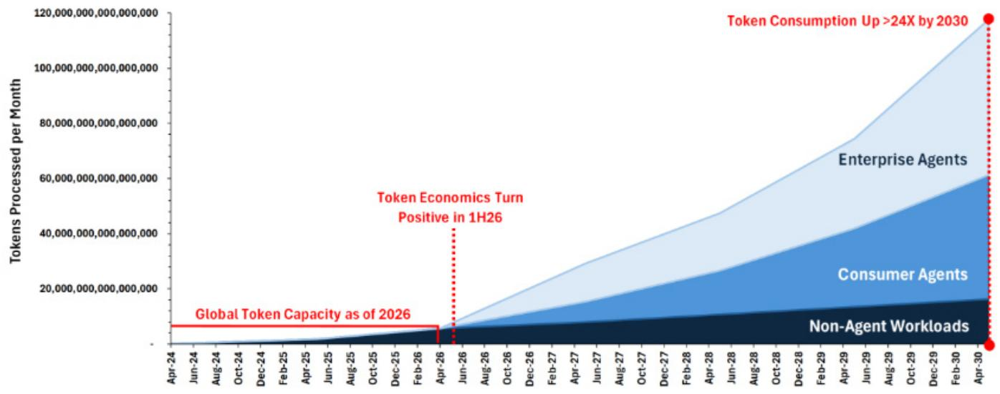

area

| Date     | Non-Agent Workloads | Consumer Agents | Enterprise Agents | Token Economics Turn Positive in 1H26 |
|----------|---------------------|-----------------|-------------------|--------------------------------------|
| Apr-30   | ~15M                | ~30M            | ~60M              | >24X                                 |

Source: Data compiled by GS Global Investment Research

# Global Refining - The Product Supply Challenge Even in a De-Escalation Scenario (Link). Nikhil Bhandari et al

The global refining system was already operating near capacity prior to the Middle East disruption, constrained by aging infrastructure and limited net additions. Even if refinery utilization normalizes in a de-escalation scenario, their updated balances indicate persistent product tightness in the second half of 2026. In response, our analysts have updated their refining framework with a base case and three alternative scenarios for run normalization, introducing monthly product-level supply-demand balances. Within Asia, they favor merchant refiners such as S-Oil and Thai Oil due to free cash flow inflection and strong middle distillate exposure. They also highlight Buy-rated Reliance, noting that its flexible crude sourcing has mitigated throughput downside during recent disruptions.

Exhibit 13: Global Refining - Refined product supply disruptions in volume terms is the most obvious in middle distillates   
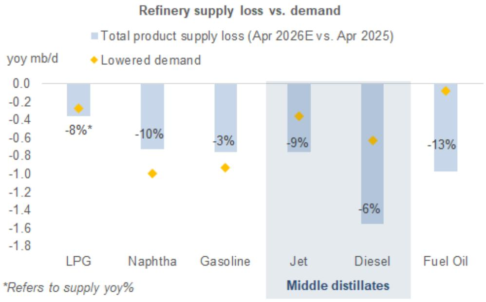

bar

| Fuel Type | Total product supply loss (Apr 2026E vs. Apr 2025) | Lowered demand (%) |
|-----------|--------------------------------------------------|-------------------|
| LPG       | -0.4                                             | -8*               |
| Naphtha   | -0.7                                             | -10%              |
| Gasoline  | -0.8                                             | -3%               |
| Jet       | -0.9                                             | -9%               |
| Diesel    | -1.6                                             | -6%               |
| Fuel Oil  | -1.1                                             | -13%              |

Source: Kpler, Wood Mackenzie, GS Global Investment Research

# China Consumer – Pulse Check: 1Q26/Post-holiday tour wrap-up (Link). Michelle Cheng

Our analysts observe broadly healthy domestic consumption in the first quarter of 2026 following a challenging second half of 2025. However, sequential moderation since March and a measured Labor Day holiday have lowered expectations for the second quarter. While pricing stabilization is encouraging, our analysts note that cost headwinds from the Middle East conflict remain a significant swing factor. They also highlight increased uncertainties for companies with overseas exposure due to demand slowdowns, margin pressures, or foreign exchange losses, though structural share gain opportunities remain intact. Consequently, our analysts have updated their sector preferences, turning incrementally positive on Dairy due to bottoming-out potential, adding it to their preferred list alongside restaurants, sportswear, condiments, and food and beverage value retailers. Conversely, they have removed prepared food from the preferred list and downgraded Pet Food to least preferred, reflecting intensifying domestic competition and volatile overseas operations. Top Buy-rated ideas include Haitian-H, Yum China, Guming, Mao Geping, Midea, Nongfu Spring, Anta, WH Group, Laopu Gold, Busy Ming, Wanchen, Mengniu, Li Ning, Anjoy Foods-H, Hisense, Nine Bot, Miniso, Yankershop, and Yihai. Also see China Consumer Staples – Apr Check-in/Consumer Tour Wrap.

Exhibit 14: China Consumer – Sector Preferences: Our analysts turn incrementally positive on Dairy   
May, 2026 VER 

<table><tr><td colspan="2">Sector</td></tr><tr><td>Preferred</td><td>Restaurants, Sports brands, Condiment, F&amp;B value retailers, Dairy↑</td></tr><tr><td></td><td>Beverage, Cosmetics, Snacks, Beer, Dairy, RVC, Major/small kitchen appliances, Leading white goods, Super premium spirits, Jewelry, IP Diversified retailer, Prepared food↓</td></tr><tr><td>Least preferred</td><td>Furniture, Projectors, Discretionary small kitchen appliances, Spirits (non super-premium), Sports retailer, Apparel/footwear OEM, Pet food↓</td></tr></table>

Source: GS Global Investment Research

Impacted stocks on the APAC Conviction List: Haitian-H, Guming, Yum China

# Multimedia Highlights

# Thesis in Charts

Thesis in Charts: Henderson Land: Recovery after prolonged downturn [Video]

Thesis in Charts: Inovance: Order momentum, capacity expansion and price hikes drive re-acceleration [Video]

Thesis in Charts: Yaskawa: AI Capex and Motion Control recovery driving substantial upside [Video]

# Macro & Strategy

China Macro & Strategy: Takeaways from Trump-Xi Meeting [Replay]

Asia Strategy: Stay the Course [Replay]

Japan Strategy: HALO, Good Buy [Replay]

# Sector & Stock

US Internet & Software: Decoding the Agentic Economy [Replay]

Asia Industrials: Positioning for Automation Recovery and AI Capex Expansion [Replay]

On the Road with GS – Asia Pacific: China Consumer Tour

China Internet: Mega Cap Earnings Takeaways

Australia Macro to Micro: Commonwealth Budget & Implications for Banks [Replay]

# Conviction List - What Has Changed

Exhibit 15: APAC Conviction List - Directors' Cut stock performance

End May 2026, life-to-date and year-to-date total return (in local currency, only calculate period when stock is on the list)

<table><tr><td>Ticker</td><td>Company Name</td><td>May-26</td><td>LTD Return</td><td>LTD vs. MXAPEW</td><td>LTD vs. MXAP</td></tr><tr><td>6981.T</td><td>Murata Mfg.</td><td>86.7%</td><td>191.7%</td><td>184.1%</td><td>173.7%</td></tr><tr><td>2317.TW</td><td>Hon Hai</td><td>31.7%</td><td>14.9%</td><td>4.8%</td><td>-7.4%</td></tr><tr><td>6506.T</td><td>Yaskawa Electric</td><td>20.7%</td><td>20.7%</td><td>19.2%</td><td>14.5%</td></tr><tr><td>300476.SZ</td><td>Victory Giant</td><td>12.2%</td><td>22.3%</td><td>21.5%</td><td>13.5%</td></tr><tr><td>2330.TW</td><td>TSMC</td><td>10.3%</td><td>83.4%</td><td>0.0%</td><td>0.0%</td></tr><tr><td>ALQ.AX</td><td>ALS Ltd.</td><td>10.9%</td><td>48.1%</td><td>0.0%</td><td>0.0%</td></tr><tr><td></td><td>MSCI Asia Pacific Index</td><td>8.5%</td><td>83.4%</td><td></td><td></td></tr><tr><td>8411.T</td><td>Mizuho FG</td><td>7.0%</td><td>89.4%</td><td>50.9%</td><td>31.3%</td></tr><tr><td>FPH.AX</td><td>Fisher &amp; Paykel Healthcare Corp.</td><td>4.5%</td><td>-4.5%</td><td>-16.5%</td><td>-30.4%</td></tr><tr><td>300124.SZ</td><td>Shenzhen Inovance Technology Co.</td><td>4.1%</td><td>4.1%</td><td>2.6%</td><td>-2.1%</td></tr><tr><td>TACN.BO</td><td>Tata Consumer Products Ltd.</td><td>3.8%</td><td>5.6%</td><td>4.8%</td><td>-3.2%</td></tr><tr><td></td><td>MSCI Asia Pacific Equal Weight Index</td><td>2.3%</td><td>48.1%</td><td></td><td></td></tr><tr><td>MRTI.BO</td><td>Maruti Suzuki India</td><td>-1.4%</td><td>-18.5%</td><td>-30.5%</td><td>-44.4%</td></tr><tr><td>JARD.SI</td><td>Jardine Matheson</td><td>-2.2%</td><td>19.8%</td><td>-1.3%</td><td>-18.3%</td></tr><tr><td>2359.HK</td><td>WuXi AppTec Co.</td><td>-2.9%</td><td>6.6%</td><td>-2.2%</td><td>-10.7%</td></tr><tr><td>0012.HK</td><td>Henderson Land</td><td>-4.1%</td><td>-4.1%</td><td>-5.6%</td><td>-10.3%</td></tr><tr><td>RMS.AX</td><td>Ramelius Resources</td><td>-4.2%</td><td>-17.0%</td><td>-25.7%</td><td>-34.3%</td></tr><tr><td>3288.HK</td><td>Foshan Haitian Flavouring &amp; Food</td><td>-4.2%</td><td>-10.2%</td><td>-19.0%</td><td>-27.5%</td></tr><tr><td>BABA</td><td>Alibaba Group</td><td>-5.8%</td><td>-12.9%</td><td>-13.7%</td><td>-21.7%</td></tr><tr><td>6920.T</td><td>Lasertec</td><td>-6.0%</td><td>13.5%</td><td>4.8%</td><td>-3.7%</td></tr><tr><td>278470.KS</td><td>APR Corp.</td><td>-8.1%</td><td>46.2%</td><td>45.4%</td><td>37.4%</td></tr><tr><td>1364.HK</td><td>Guming Holdings Ltd.</td><td>-10.5%</td><td>6.2%</td><td>-4.0%</td><td>-16.1%</td></tr><tr><td>YUMC</td><td>Yum China Holdings</td><td>-11.8%</td><td>-13.0%</td><td>-21.7%</td><td>-30.3%</td></tr><tr><td>8046.TW</td><td>NYPCB</td><td>-15.6%</td><td>321.9%</td><td>307.3%</td><td>288.6%</td></tr><tr><td>1318.HK</td><td>Mao Geping Cosmetics Co.</td><td>-16.9%</td><td>-29.3%</td><td>-33.6%</td><td>-43.1%</td></tr></table>

% of Stocks that outperformed\* 

<table><tr><td>vs. MXAP Equal Weighted Index</td><td>36.4%</td><td>48%</td></tr><tr><td>vs. MXAP Index</td><td>18%</td><td>39%</td></tr></table>

Removed from the list this month 

<table><tr><td>Ticker</td><td>Company Name</td><td>Date Added</td><td>Date Removed</td><td>Days on the List</td><td>LTD Return</td><td>LTD vs. MXAPEW</td></tr><tr><td>FUTU</td><td>Futu Holdings</td><td>03/05/2026</td><td>25/05/2026</td><td>22</td><td>-42.5%</td><td>-44.2%</td></tr></table>

\*LTD % outperformance includes stocks that have been removed from the list (list of prior removals in Appendix II). Priced as of May 29th, 2026   
Source: Bloomberg, GS Global Investment Research

We add S-Oil to the APAC Conviction List.

As discussed in previous updates, there are many reasons a stock could be removed from the list. They can include (but are not limited to), analysts no longer having conviction in their idea (e.g. a downgrade), price realization, the passage of catalysts or the subcommittee believing there are better opportunities elsewhere. In short, names will be removed if the committee determines a name is no longer a top investment idea across the APAC coverage.

Importantly, inclusion on this list is not a stock rating and addition to or removal from this list does not necessarily represent a change in the analyst's investment rating for such stock.

Exhibit 16: APAC Conviction List changes since May 3, 2026

Changes to FY1/FY2 EPS (>1.5%), target prices and to the List

<table><tr><td>Ticker</td><td>Company Name</td><td>FY1 EPS %</td><td>FY2 EPS %</td><td>PT %</td></tr><tr><td>8411.T</td><td>Mizuho FG</td><td>10.1%</td><td>-3.2%</td><td>8.0%</td></tr><tr><td>8046.TW</td><td>NYPCB</td><td>1.8%</td><td>3.6%</td><td>14.9%</td></tr><tr><td>FPH.AX</td><td>Fisher &amp; Paykel Healthcare Corp.</td><td>-3.0%</td><td>-1.8%</td><td>-1.2%</td></tr><tr><td>BABA</td><td>Alibaba Group</td><td>-11.5%</td><td>-3.5%</td><td>0.0%</td></tr><tr><td>278470.KS</td><td>APR Corp.</td><td>10.0%</td><td>4.8%</td><td>4.5%</td></tr><tr><td>TACN.BO</td><td>Tata Consumer Products Ltd.</td><td>1.2%</td><td>1.9%</td><td>3.6%</td></tr><tr><td>6920.T</td><td>Lasertec</td><td>0.0%</td><td>5.8%</td><td>3.8%</td></tr><tr><td>0012.HK</td><td>Henderson Land</td><td>1.7%</td><td>6.8%</td><td>7.9%</td></tr><tr><td>6506.T</td><td>Yaskawa Electric</td><td>0.0%</td><td>0.0%</td><td>26.0%</td></tr><tr><td>ALQ.AX</td><td>ALS Ltd.</td><td>-1.6%</td><td>0.4%</td><td>1.1%</td></tr></table>

CL Additions 

<table><tr><td>Ticker</td><td>Company Name</td><td>Date Added</td></tr><tr><td>010950.KS</td><td>S-Oil Corp.</td><td>01/06/2026</td></tr></table>

CL Removal 

<table><tr><td>Ticker</td><td>Company Name</td><td>Date Added</td><td>Date Removed</td></tr><tr><td>FUTU</td><td>Futu Holdings</td><td>03/05/2026</td><td>25/05/2026</td></tr></table>

Source: GS Global Investment Research, Bloomberg

# Appendix I - Valuation Table

Exhibit 17: APAC Conviction List - Valuation Table 

<table><tr><td rowspan="2">Ticker</td><td rowspan="2">Company Name</td><td colspan="5">GROWTH</td><td colspan="4">VALU</td><td colspan="3">PROFIT</td><td colspan="4">REVISIONS (1M)</td></tr><tr><td>FY1 Year</td><td>Sales Growth FY1</td><td>EBITDA Growth FY1</td><td>EPS Growth FY1</td><td>FCF Growth FY1</td><td>PE FY1</td><td>P/B FY1</td><td>EV/ EBITDA FY1</td><td>FCF yield FY1</td><td>EBITDA Margin FY1</td><td>EBITDA Margin FY2</td><td>ROE CY26</td><td>GS TP</td><td>GS Sales FY1</td><td>GS EPS FY1</td><td>Cons EPS FY1</td></tr><tr><td colspan="18">Consumer</td></tr><tr><td>278470.KS</td><td>APR Corp.</td><td>26</td><td>70%</td><td>76%</td><td>81%</td><td>78%</td><td>28.0x</td><td>18.5x</td><td>21.4x</td><td>3%</td><td>25.3%</td><td>26.7%</td><td>84%</td><td>4.5%</td><td>4.2%</td><td>10.0%</td><td>5.6%</td></tr><tr><td>1364.HK</td><td>Guming Holdings Ltd.</td><td>26</td><td>29%</td><td>19%</td><td>20%</td><td>-18%</td><td>13.5x</td><td>6.1x</td><td>9.3x</td><td>8%</td><td>25.1%</td><td>25.3%</td><td>51%</td><td>-</td><td>-</td><td>-</td><td>0.1%</td></tr><tr><td>3288.HK</td><td>Foshan Haitian Flavouring &amp; Food</td><td>26</td><td>9%</td><td>10%</td><td>11%</td><td>13%</td><td>21.0x</td><td>3.8x</td><td>14.9x</td><td>4%</td><td>30.0%</td><td>30.7%</td><td>18%</td><td>-</td><td>-</td><td>-</td><td>0.2%</td></tr><tr><td>1318.HK</td><td>Mao Geping Cosmetics Co.</td><td>26</td><td>30%</td><td>31%</td><td>28%</td><td>104%</td><td>16.4x</td><td>4.5x</td><td>10.3x</td><td>8%</td><td>31.9%</td><td>31.0%</td><td>30%</td><td>-</td><td>-</td><td>-</td><td>-0.4%</td></tr><tr><td>TACN.BO</td><td>Tata Consumer Products Ltd.</td><td>27</td><td>12%</td><td>18%</td><td>34%</td><td>70%</td><td>56.3x</td><td>5.4x</td><td>35.0x</td><td>2%</td><td>14.5%</td><td>15.3%</td><td>9%</td><td>3.6%</td><td>1.9%</td><td>1.2%</td><td>-1.8%</td></tr><tr><td>YUMC</td><td>Yum China Holdings</td><td>26</td><td>6%</td><td>8%</td><td>14%</td><td>17%</td><td>14.8x</td><td>2.9x</td><td>6.9x</td><td>6%</td><td>15.0%</td><td>15.4%</td><td>17%</td><td>-</td><td>-</td><td>-</td><td>0.0%</td></tr><tr><td colspan="18">Financials</td></tr><tr><td>0012.HK</td><td>Henderson Land</td><td>26</td><td>31%</td><td>61%</td><td>40%</td><td>-34%</td><td>18.9x</td><td>0.5x</td><td>23.7x</td><td>5%</td><td>24.1%</td><td>30.4%</td><td>2%</td><td>7.9%</td><td>0.6%</td><td>1.9%</td><td>-5.3%</td></tr><tr><td>8411.T</td><td>Mizuho FG</td><td>27</td><td>13%</td><td></td><td>9%</td><td></td><td>13.1x</td><td>1.4x</td><td></td><td></td><td></td><td></td><td>11%</td><td>8.0%</td><td>3.2%</td><td>10.1%</td><td>0.7%</td></tr><tr><td colspan="18">Healthcare</td></tr><tr><td>FPH.AX</td><td>Fisher &amp; Paykel Healthcare Corp.</td><td>27</td><td>12%</td><td>16%</td><td>18%</td><td>1%</td><td>39.7x</td><td>9.4x</td><td>23.2x</td><td>2%</td><td>35.9%</td><td>37.3%</td><td>25%</td><td>-1.2%</td><td>-0.2%</td><td>-3.1%</td><td>-1.2%</td></tr><tr><td>2359.HK</td><td>WuXi AppTec Co.</td><td>26</td><td>20%</td><td>24%</td><td>1%</td><td>18%</td><td>16.9x</td><td>3.4x</td><td>11.9x</td><td>4%</td><td>45.2%</td><td>45.2%</td><td>22%</td><td>0.2%</td><td>-</td><td>-</td><td>0.7%</td></tr><tr><td colspan="18">Industrials</td></tr><tr><td>ALQ.AX</td><td>ALS Ltd.</td><td>27</td><td>12%</td><td>18%</td><td>18%</td><td>99%</td><td>25.4x</td><td>6.2x</td><td>13.3x</td><td>2%</td><td>26.3%</td><td>26.5%</td><td>25%</td><td>1.1%</td><td>1.6%</td><td>-1.1%</td><td>0.0%</td></tr><tr><td>JARD.SI</td><td>Jardine Matheson</td><td>26</td><td>2%</td><td>4%</td><td>61%</td><td>7%</td><td>10.9x</td><td>0.6x</td><td>3.7x</td><td>8%</td><td>17.7%</td><td>18.1%</td><td>6%</td><td>-</td><td>-</td><td>-</td><td>-0.4%</td></tr><tr><td>300124.SZ</td><td>Shenzhen Inovance Technology Co.</td><td>26</td><td>18%</td><td>18%</td><td>13%</td><td>-82%</td><td>34.9x</td><td>5.1x</td><td>29.8x</td><td>0%</td><td>12.5%</td><td>12.9%</td><td>15%</td><td>-</td><td>-</td><td>-</td><td>-3.9%</td></tr><tr><td>6506.T</td><td>Yaskawa Electric</td><td>27</td><td>11%</td><td>46%</td><td>63%</td><td>524%</td><td>32.6x</td><td>3.6x</td><td>19.2x</td><td>2%</td><td>16.6%</td><td>18.5%</td><td>11%</td><td>26.0%</td><td>-</td><td>4.2%</td><td>4.1%</td></tr><tr><td colspan="18">Internet &amp; IT Services</td></tr><tr><td>BABA</td><td>Alibaba Group</td><td>27</td><td>10%</td><td>31%</td><td>32%</td><td>N/A</td><td>23.4x</td><td>1.7x</td><td>11.9x</td><td>-3%</td><td>13.3%</td><td>19.4%</td><td>7%</td><td>-</td><td>-0.6%</td><td>-11.6%</td><td>-7.8%</td></tr><tr><td colspan="18">Mobility</td></tr><tr><td>MRTI.BO</td><td>Maruti Suzuki India</td><td>27</td><td>15%</td><td>9%</td><td>-3%</td><td>10%</td><td>28.4x</td><td>3.6x</td><td>16.7x</td><td>2%</td><td>11.1%</td><td>12.5%</td><td>14%</td><td>-</td><td>-</td><td>-</td><td>0.0%</td></tr><tr><td colspan="18">Natural Resources</td></tr><tr><td>RMS.AX</td><td>Ramelius Resources</td><td>26</td><td>-8%</td><td>-11%</td><td>-63%</td><td>-60%</td><td>21.0x</td><td>1.6x</td><td>7.6x</td><td>4%</td><td>65.7%</td><td>62.4%</td><td>10%</td><td>-</td><td>0.2%</td><td>-16.7%</td><td>-12.8%</td></tr><tr><td>010950.KS</td><td>S-Oil Corp.</td><td>26</td><td>21%</td><td>209%</td><td>1782%</td><td>294%</td><td>9.8x</td><td>1.2x</td><td>5.5x</td><td>4%</td><td>8.1%</td><td>8.4%</td><td>13%</td><td>-</td><td>-</td><td>-</td><td>33.2%</td></tr><tr><td colspan="18">Technology</td></tr><tr><td>2317.TW</td><td>Hon Hai</td><td>26</td><td>36%</td><td>34%</td><td>42%</td><td>815%</td><td>15.2x</td><td>2.2x</td><td>6.9x</td><td>11%</td><td>4.2%</td><td>3.9%</td><td>13%</td><td>-</td><td>0.0%</td><td>-0.1%</td><td>4.1%</td></tr><tr><td>6920.T</td><td>Lasertec</td><td>26</td><td>-9%</td><td>-12%</td><td>-6%</td><td>36%</td><td>45.5x</td><td>14.5x</td><td>30.9x</td><td>3%</td><td>48.8%</td><td>50.2%</td><td>35%</td><td>10.0%</td><td>-</td><td>0.1%</td><td>-1.0%</td></tr><tr><td>6981.T</td><td>Murata Mfg.</td><td>27</td><td>10%</td><td>41%</td><td>43%</td><td>78%</td><td>52.7x</td><td>6.5x</td><td>26.6x</td><td>2%</td><td>32.1%</td><td>34.5%</td><td>11%</td><td>28.6%</td><td>0.3%</td><td>4.9%</td><td>3.2%</td></tr><tr><td>8046.TW</td><td>NYPCB</td><td>26</td><td>83%</td><td>165%</td><td>580%</td><td>1571%</td><td>41.4x</td><td>10.1x</td><td>22.6x</td><td>2%</td><td>32.0%</td><td>39.1%</td><td>26%</td><td>14.9%</td><td>-</td><td>1.8%</td><td>12.7%</td></tr><tr><td>2330.TW</td><td>TSMC</td><td>26</td><td>38%</td><td>41%</td><td>46%</td><td>61%</td><td>24.3x</td><td>8.3x</td><td>15.8x</td><td>3%</td><td>70.3%</td><td>70.6%</td><td>39%</td><td>-</td><td>-</td><td>-</td><td>0.1%</td></tr><tr><td>300476.SZ</td><td>Victory Giant</td><td>26</td><td>89%</td><td>112%</td><td>129%</td><td>92%</td><td>32.3x</td><td>14.3x</td><td>25.7x</td><td>0%</td><td>35.4%</td><td>37.2%</td><td>51%</td><td>-</td><td>-</td><td>-</td><td>-0.3%</td></tr></table>

Source: Bloomberg, GS Global Investment Research

# Appendix II - Conviction List Explained

On December 4th 2023, we introduced a new investment list highlighting a selection of fundamental Buy-rated Asia-Pacific stocks across the GS Global Investment Research department. This new “APAC Conviction List - Directors’ Cut” is designed to provide investors with a curated and active list of 20-30 stocks of what we believe to be differentiated fundamental Buy ideas across our Asia-Pacific stock coverage. We intend to refresh and publish this list monthly in an easily digestible format that focuses on 1) the analyst’s core investment thesis, 2) key debates and where we are different, 3) upcoming catalysts, and 4) financials/valuation.

A subcommittee designated by the Asia-Pacific Investment Review Committee will select stocks for the “APAC Conviction List – Directors’ Cut” from the Buy recommendations of Asia-Pacific stocks. The subcommittee will collaborate with each sector analyst to identify top ideas that offer a combination of conviction, a differentiated view and high risk-adjusted returns. The subcommittee will then choose what they view as the top 20-30 ideas across the department for the list.

We intend to refresh and publish the list monthly. Any new names added to the APAC Conviction List – Directors’ Cut will include a concise description detailing the key drivers of the analyst’s Buy thesis, with a focus on where these views are different and relevant market debates, as well as links to their recent reports. All additions to the list will be captured in this monthly note. Removals (discussed below) may occur intra-month should a material event occur that requires an adjustment to the list.

Reasons for removal can include (but are not limited to) analysts no longer having conviction in their idea (e.g. a downgrade), price realisation, the passage of catalysts or the subcommittee believing there are better opportunities elsewhere. In short, names will be removed if this committee determines a name is no longer a top investment idea across our coverage.

Additional information. This list should not be seen as a portfolio, as we will not attempt to weight the included stocks or ensure diversification across our stock coverage. Inclusion on this list is not a stock rating and addition to, or removal from, this list does not necessarily represent a change in the analyst's investment rating for such stock.

# Past Editions and Multimedia

APAC Conviction List - Directors' Cut: August Update - Adding Jardine Matheson & Namura Shipbuilding; Removing M&M, Kotobuki Spirits & Worley

APAC Conviction List - Directors' Cut: July Update - Adding Goodman; removing Panasonic, Anhui Conch, Iluka & NextDC

APAC Conviction List - Directors' Cut: Monthly Update - Adding TSMC, RIL & Huaqin; removing Mitsui Fudosan

APAC Conviction List - Directors' Cut: Key Theses in Charts (Videos)

APAC Conviction List - Directors' Cut Launch

Visit the APAC Conviction List - Directors' Cut portal page

Exhibit 18: APAC Conviction List Removals' Stock Performance LTD total return (in local ccy) 

<table><tr><td>Ticker</td><td>Company Name</td><td>Date Added</td><td>Date Removed</td><td>Days on the List</td><td>LTD Return</td><td>LTD vs. MXAPEW</td></tr><tr><td>CSL.AX</td><td>CSL Ltd.</td><td>04/12/2023</td><td>30/01/2024</td><td>57</td><td>12.3%</td><td>16.0%</td></tr><tr><td>601138.SS</td><td>Foxconn Industrial Internet</td><td>04/12/2023</td><td>01/02/2024</td><td>59</td><td>-1.5%</td><td>2.5%</td></tr><tr><td>6758.T</td><td>Sony Group</td><td>04/12/2023</td><td>03/03/2024</td><td>90</td><td>5.3%</td><td>2.8%</td></tr><tr><td>OCBC.SI</td><td>Oversea-Chinese Banking Corp.</td><td>04/12/2023</td><td>03/03/2024</td><td>90</td><td>2.9%</td><td>0.4%</td></tr><tr><td>PDD</td><td>PDD Holdings</td><td>04/12/2023</td><td>11/03/2024</td><td>98</td><td>-21.7%</td><td>-25.6%</td></tr><tr><td>0867.HK</td><td>China Medical System Holdings</td><td>04/12/2023</td><td>07/04/2024</td><td>125</td><td>-47.7%</td><td>-50.0%</td></tr><tr><td>4507.T</td><td>Shionogi</td><td>04/12/2023</td><td>07/04/2024</td><td>125</td><td>10.1%</td><td>7.7%</td></tr><tr><td>002050.SZ</td><td>Sanhua Intelligent Controls</td><td>04/12/2023</td><td>02/05/2024</td><td>150</td><td>-23.8%</td><td>-27.4%</td></tr><tr><td>7269.T</td><td>Suzuki Motor</td><td>04/12/2023</td><td>02/05/2024</td><td>150</td><td>24.4%</td><td>20.8%</td></tr><tr><td>352820.KS</td><td>HYBE Co.</td><td>04/01/2024</td><td>02/06/2024</td><td>150</td><td>-16.8%</td><td>-19.5%</td></tr><tr><td>8306.T</td><td>MUFG</td><td>04/12/2023</td><td>02/06/2024</td><td>181</td><td>35.1%</td><td>31.6%</td></tr><tr><td>2313.HK</td><td>Shenzhou International Group</td><td>04/12/2023</td><td>02/06/2024</td><td>181</td><td>-0.8%</td><td>-4.3%</td></tr><tr><td>1024.HK</td><td>Kuaishou Technology</td><td>04/12/2023</td><td>01/07/2024</td><td>210</td><td>-16.0%</td><td>-18.5%</td></tr><tr><td>6723.T</td><td>Renesas Electronics</td><td>04/12/2023</td><td>04/08/2024</td><td>244</td><td>-13.5%</td><td>-15.8%</td></tr><tr><td>1299.HK</td><td>AIA Group</td><td>04/12/2023</td><td>03/09/2024</td><td>274</td><td>-15.7%</td><td>-19.9%</td></tr><tr><td>WOW.AX</td><td>Woolworths Group</td><td>04/12/2023</td><td>03/09/2024</td><td>274</td><td>6.1%</td><td>1.8%</td></tr><tr><td>HTHT</td><td>H World Group</td><td>04/12/2023</td><td>03/09/2024</td><td>274</td><td>-14.1%</td><td>-18.3%</td></tr><tr><td>600019.SS</td><td>Baoshan Iron &amp; Steel</td><td>04/12/2023</td><td>03/09/2024</td><td>274</td><td>-2.9%</td><td>-7.2%</td></tr><tr><td>6273.T</td><td>SMC</td><td>04/12/2023</td><td>03/09/2024</td><td>274</td><td>-10.2%</td><td>-14.5%</td></tr><tr><td>105560.KS</td><td>KB Financial Group</td><td>01/02/2024</td><td>03/09/2024</td><td>215</td><td>48.5%</td><td>39.9%</td></tr><tr><td>002371.SZ</td><td>NAURA</td><td>01/02/2024</td><td>03/09/2024</td><td>215</td><td>32.5%</td><td>24.0%</td></tr><tr><td>005380.KS</td><td>Hyundai Motor</td><td>03/03/2024</td><td>03/09/2024</td><td>184</td><td>-5.6%</td><td>-7.2%</td></tr><tr><td>688169.SS</td><td>Beijing Roborock Technology</td><td>03/03/2024</td><td>03/09/2024</td><td>184</td><td>-1.4%</td><td>-3.0%</td></tr><tr><td>0291.HK</td><td>China Resources Beer</td><td>07/04/2024</td><td>03/09/2024</td><td>149</td><td>-26.9%</td><td>-28.8%</td></tr><tr><td>LYC.AX</td><td>Lynas Rare Earths Ltd.</td><td>04/12/2023</td><td>02/10/2024</td><td>303</td><td>21.1%</td><td>2.6%</td></tr><tr><td>QAN.AX</td><td>Qantas Airways</td><td>02/06/2024</td><td>02/10/2024</td><td>122</td><td>14.4%</td><td>1.1%</td></tr><tr><td>207940.KS</td><td>Samsung Biologics Co.</td><td>02/05/2024</td><td>02/10/2024</td><td>153</td><td>26.1%</td><td>11.7%</td></tr><tr><td>NTPC.BO</td><td>NTPC Ltd.</td><td>07/04/2024</td><td>02/10/2024</td><td>178</td><td>22.0%</td><td>6.1%</td></tr><tr><td>603986.SS</td><td>Gigadevice</td><td>04/08/2024</td><td>02/10/2024</td><td>59</td><td>13.8%</td><td>-6.6%</td></tr><tr><td>GOCP.BO</td><td>Godrej Consumer Products Ltd.</td><td>04/12/2023</td><td>02/10/2024</td><td>303</td><td>34.8%</td><td>16.2%</td></tr><tr><td>0388.HK</td><td>Hong Kong Exchanges</td><td>02/06/2024</td><td>02/10/2024</td><td>122</td><td>41.9%</td><td>28.6%</td></tr><tr><td>360.AX</td><td>Life360 Inc.</td><td>02/10/2024</td><td>02/12/2024</td><td>61</td><td>32.0%</td><td>38.4%</td></tr><tr><td>XRO.AX</td><td>Xero Ltd.</td><td>03/03/2024</td><td>02/12/2024</td><td>274</td><td>28.8%</td><td>20.8%</td></tr><tr><td>TOP.BK</td><td>Thai Oil</td><td>02/06/2024</td><td>02/12/2024</td><td>183</td><td>-24.8%</td><td>-30.8%</td></tr><tr><td>0992.HK</td><td>Lenovo</td><td>02/06/2024</td><td>02/12/2024</td><td>183</td><td>-16.5%</td><td>-22.6%</td></tr><tr><td>2383.TW</td><td>Elite Material</td><td>04/08/2024</td><td>02/12/2024</td><td>120</td><td>32.8%</td><td>20.2%</td></tr><tr><td>2587.T</td><td>Suntory Beverage &amp; Food Ltd.</td><td>01/02/2024</td><td>07/01/2025</td><td>341</td><td>2.1%</td><td>-9.4%</td></tr><tr><td>0700.HK</td><td>Tencent Holdings</td><td>01/07/2024</td><td>07/01/2025</td><td>190</td><td>2.8%</td><td>-1.5%</td></tr><tr><td>8316.T</td><td>SMFG</td><td>03/09/2024</td><td>07/01/2025</td><td>126</td><td>19.4%</td><td>16.8%</td></tr><tr><td>300274.SZ</td><td>Sungrow Power Supply Co.</td><td>03/09/2024</td><td>07/01/2025</td><td>126</td><td>-5.7%</td><td>-8.4%</td></tr><tr><td>000660.KS</td><td>SK Hynix Inc.</td><td>04/12/2023</td><td>02/02/2025</td><td>426</td><td>53.0%</td><td>45.2%</td></tr><tr><td>2330.TW</td><td>TSMC</td><td>04/12/2023</td><td>02/02/2025</td><td>426</td><td>102.0%</td><td>94.3%</td></tr><tr><td>6501.T</td><td>Hitachi</td><td>04/12/2023</td><td>02/03/2025</td><td>454</td><td>82.6%</td><td>74.9%</td></tr><tr><td>600309.SS</td><td>Wanhua Chemical Group</td><td>03/03/2024</td><td>02/03/2025</td><td>364</td><td>-7.2%</td><td>-12.2%</td></tr><tr><td>7267.T</td><td>Honda Motor</td><td>03/11/2024</td><td>02/03/2025</td><td>119</td><td>-8.1%</td><td>-3.4%</td></tr><tr><td>0857.HK</td><td>PetroChina</td><td>02/12/2024</td><td>02/03/2025</td><td>90</td><td>5.9%</td><td>8.7%</td></tr><tr><td>6857.T</td><td>Advantest</td><td>03/09/2024</td><td>01/04/2025</td><td>210</td><td>-4.9%</td><td>-9.5%</td></tr><tr><td>2308.TW</td><td>Delta Electronics</td><td>02/12/2024</td><td>01/04/2025</td><td>120</td><td>-4.5%</td><td>-2.8%</td></tr><tr><td>KPLM.SI</td><td>Keppel Ltd.</td><td>02/10/2024</td><td>01/04/2025</td><td>181</td><td>3.6%</td><td>11.7%</td></tr><tr><td>2899.HK</td><td>Zijin Mining</td><td>03/09/2024</td><td>01/04/2025</td><td>210</td><td>15.7%</td><td>11.1%</td></tr><tr><td>HDBK.BO</td><td>HDFC Bank</td><td>04/12/2023</td><td>01/05/2025</td><td>514</td><td>21.2%</td><td>11.4%</td></tr><tr><td>2018.HK</td><td>AAC</td><td>02/12/2024</td><td>01/05/2025</td><td>150</td><td>1.8%</td><td>2.8%</td></tr><tr><td>JD</td><td>JD.com Inc.</td><td>07/01/2025</td><td>01/05/2025</td><td>114</td><td>-3.2%</td><td>-5.9%</td></tr><tr><td>6981.T</td><td>Murata Mfg.</td><td>02/03/2025</td><td>01/05/2025</td><td>60</td><td>-23.9%</td><td>-25.4%</td></tr><tr><td>300750.SZ</td><td>CATL</td><td>03/09/2024</td><td>28/05/2025</td><td>267</td><td>40.0%</td><td>30.6%</td></tr><tr><td>8801.T</td><td>Mitsui Fudosan</td><td>07/01/2025</td><td>02/06/2025</td><td>146</td><td>10.5%</td><td>3.9%</td></tr><tr><td>ILU.AX</td><td>Iluka Resources</td><td>07/01/2025</td><td>02/07/2025</td><td>176</td><td>-26.6%</td><td>-38.6%</td></tr><tr><td>0914.HK</td><td>Anhui Conch Cement</td><td>02/02/2025</td><td>02/07/2025</td><td>150</td><td>5.9%</td><td>-7.1%</td></tr><tr><td>6752.T</td><td>Panasonic HD</td><td>02/03/2025</td><td>02/07/2025</td><td>122</td><td>-18.3%</td><td>-29.1%</td></tr><tr><td>NXT.AX</td><td>NEXTDC Ltd</td><td>01/05/2025</td><td>02/07/2025</td><td>62</td><td>14.7%</td><td>5.5%</td></tr><tr><td>MAHM.BO</td><td>Mahindra &amp; Mahindra</td><td>03/11/2024</td><td>03/08/2025</td><td>273</td><td>10.4%</td><td>3.0%</td></tr><tr><td>2222.T</td><td>Kotobuki Spirits Co.</td><td>07/01/2025</td><td>03/08/2025</td><td>208</td><td>2.5%</td><td>-11.1%</td></tr><tr><td>WOR.AX</td><td>Worley Ltd.</td><td>07/01/2025</td><td>03/08/2025</td><td>208</td><td>-1.6%</td><td>-15.2%</td></tr><tr><td>AXBK.BO</td><td>Axis Bank</td><td>01/05/2025</td><td>21/08/2025</td><td>112</td><td>-8.7%</td><td>-24.4%</td></tr><tr><td>2454.TW</td><td>MediaTek</td><td>01/04/2025</td><td>01/09/2025</td><td>153</td><td>-5.0%</td><td>-23.6%</td></tr><tr><td>600406.SS</td><td>NARI Technology</td><td>02/02/2025</td><td>01/09/2025</td><td>211</td><td>-3.8%</td><td>-25.7%</td></tr><tr><td>2338.HK</td><td>Weichai Power</td><td>01/04/2025</td><td>02/10/2025</td><td>184</td><td>-6.6%</td><td>-28.5%</td></tr><tr><td>7936.T</td><td>Asics Corp.</td><td>04/12/2023</td><td>03/11/2025</td><td>700</td><td>219.6%</td><td>185.1%</td></tr><tr><td>2020.HK</td><td>Anta Sports Products</td><td>02/06/2024</td><td>03/11/2025</td><td>519</td><td>-0.4%</td><td>-29.0%</td></tr><tr><td>6702.T</td><td>Fujitsu</td><td>03/09/2024</td><td>03/11/2025</td><td>426</td><td>43.5%</td><td>14.5%</td></tr><tr><td>7453.T</td><td>Ryohin Keikaku</td><td>07/01/2025</td><td>03/11/2025</td><td>300</td><td>79.0%</td><td>53.4%</td></tr><tr><td>ZLAB</td><td>Zai Lab</td><td>02/03/2025</td><td>03/11/2025</td><td>246</td><td>-15.7%</td><td>-40.0%</td></tr><tr><td>RMD.AX</td><td>ResMed Inc.</td><td>02/03/2025</td><td>01/12/2025</td><td>274</td><td>0.9%</td><td>-21.3%</td></tr><tr><td>259960.KS</td><td>Krafton</td><td>01/04/2025</td><td>01/12/2025</td><td>244</td><td>-26.0%</td><td>-47.3%</td></tr><tr><td>GMG.AX</td><td>Goodman Group</td><td>02/07/2025</td><td>01/12/2025</td><td>152</td><td>-14.6%</td><td>-25.0%</td></tr><tr><td>8697.T</td><td>Japan Exchange Group</td><td>01/09/2025</td><td>01/12/2025</td><td>91</td><td>13.8%</td><td>11.5%</td></tr><tr><td>005380.KS</td><td>Hyundai Motor</td><td>02/10/2025</td><td>09/12/2025</td><td>68</td><td>40.9%</td><td>41.7%</td></tr><tr><td>6762.T</td><td>TDK</td><td>03/09/2024</td><td>06/01/2026</td><td>490</td><td>16.5%</td><td>-15.6%</td></tr><tr><td>7012.T</td><td>Kawasaki Heavy Industries</td><td>02/12/2024</td><td>06/01/2026</td><td>400</td><td>115.9%</td><td>91.7%</td></tr><tr><td>603296.SS</td><td>Huagin Technology</td><td>02/06/2025</td><td>06/01/2026</td><td>218</td><td>44.0%</td><td>23.3%</td></tr><tr><td>7014.T</td><td>Namura Shipbuilding Co.</td><td>03/08/2025</td><td>06/01/2026</td><td>156</td><td>23.6%</td><td>11.0%</td></tr><tr><td>XRO.AX</td><td>Xero Ltd.</td><td>01/12/2025</td><td>30/12/2025</td><td>29</td><td>-7.3%</td><td>-8.6%</td></tr><tr><td>RELI.BO</td><td>Reliance Industries</td><td>02/06/2025</td><td>04/02/2026</td><td>247</td><td>3.5%</td><td>-21.1%</td></tr><tr><td>6146.T</td><td>DISCO</td><td>01/09/2025</td><td>04/02/2026</td><td>156</td><td>79.1%</td><td>69.2%</td></tr><tr><td>1109.HK</td><td>China Resources Land</td><td>01/04/2025</td><td>04/02/2026</td><td>309</td><td>29.9%</td><td>-0.5%</td></tr><tr><td>TITN.BO</td><td>Titan Co.</td><td>02/03/2025</td><td>02/03/2026</td><td>365</td><td>39.0%</td><td>3.3%</td></tr><tr><td>9660.HK</td><td>Horizon Robotics</td><td>01/05/2025</td><td>02/03/2026</td><td>305</td><td>3.7%</td><td>-30.0%</td></tr><tr><td>000810.KS</td><td>Samsung F&amp;M</td><td>03/11/2025</td><td>02/03/2026</td><td>119</td><td>19.9%</td><td>10.7%</td></tr><tr><td>8802.T</td><td>Mitsubishi Estate</td><td>06/01/2026</td><td>02/03/2026</td><td>55</td><td>32.0%</td><td>25.4%</td></tr><tr><td>5105.T</td><td>TOYO TIRE</td><td>02/10/2025</td><td>01/04/2026</td><td>181</td><td>-4.0%</td><td>-6.5%</td></tr><tr><td>MMYT</td><td>MakeMyTrip Ltd.</td><td>02/10/2025</td><td>01/04/2026</td><td>181</td><td>-59.8%</td><td>-62.3%</td></tr><tr><td>FUTU</td><td>Futu Holdings</td><td>03/05/2026</td><td>25/05/2026</td><td>22</td><td>-42.5%</td><td>-44.2%</td></tr></table>

Source: GS Global Investment Research, Bloomberg

Appendix III - Price Target, Risks and Methodologies 

<table><tr><td>Ticker</td><td>Company Name</td><td>PTMR</td></tr><tr><td>BABA</td><td>Alibaba Group</td><td>We are Buy rated on BABA/9988.HK, with SOTP-based 12-month target prices of US$186/HK$180 per ADS/share (FY27E-based). Key risks: (1) Lower-than-expected GMV growth due to macro/competition; (2) Slower-than-expected monetization in China retail; (3) Weaker-than-expected execution in key strategic investments; and (4) Cloud revenue growth deceleration.</td></tr><tr><td>ALQ.AX</td><td>ALS Ltd.</td><td>Our 12-month target price of A$28.30 is based on an equally-weighted blend of: (1) DCF valuation, which values ALQ at ~A$26.70/share; and (2) NTM EV/EBIT which values ALQ at ~A$29.30/share. We assume a WACC of 7.9% with a terminal growth rate of 2.5%. Key risks include the timing, pace, and duration of the commodities upcycle, commodities volume and pricing, and worse-than-expected demand dynamics in the Life Sciences.</td></tr><tr><td>278470.KS</td><td>APR Corp.</td><td>We are Buy-rated on APR with a target price of W460,000. We derive our APR target price based on a discounted P/E valuation using 2028E EPS and discounted back to 12-month fwd. We use 2028E EPS, by when we expect the company to have closed the gap in sales channel mix with the global Beauty market. On 2028E EPS, we apply a 25x target P/E which is mid-level between 20x current trading average for Korea MNCs and 30x for Global MNCs. We believe this reflects APR&#x27;s substantially faster earnings growth outlook vs. Korea MNCs while also accounts for limited brand/product portfolio vs. Global MNCs. Our discount rate of 10% is based on WACC assuming 3.3% risk-free rate (GVSK 10-year yield) and 6.5% equity risk premium (GSe). Key downside risks include operational failure to achieve solid brand life cycle management or offline expansion, potential shift in management strategy toward capital allocation, higher-than-expected marketing budget pressure, higher competition within K-Beauty, and limited SKU expansion.</td></tr><tr><td>FPH.AX</td><td>Fisher &amp; Paykel Healthcare Corp.</td><td>Our 12-month price target of A$42.30 is based on a 50%/50% blended 10-year DCF (8.4% WACC and 4.0% TGR) and EV/EBIT valuation methodology. Our DCF valuation is based on a 10-year forecast of FPH&#x27;s current business and new opportunities which include the US NHFT home market. Our EV/EBIT multiple for FPH is based on the stock&#x27;s history relative to the index (ASX200) and relative to its peers, normalizing for differences in growth. Over the last 10 years, FPH&#x27;s premium to the ASX200 has ranged from 1.5x-4.5x. We adopt a premium which is towards the top end of this range driven by the expansion in the company&#x27;s TAM from the opportunity in anaesthesiology. Our EV/EBIT multiple reflects a growth adjusted ratio which is comparable to other MedTech growth stocks. Key risks include: (1) Material slowdown in US hospitals purchasing, (2) Market share decline and (3) Failure of NHFT US home clinical trial.</td></tr><tr><td>1364.HK</td><td>Guming Holdings Ltd.</td><td>We are Buy rated on Guming with a 12-m TP of HK$36.0, based on 23X 2026E P/E. Key risks include: 1) Unable to manage the large store network; 2) Lower-than-expected store expansion; 3) Underperformed store productivity; 4) Intensified competition, fashion risk and price war; 5) Increase in store level cost; 6) Larger-than-expected subsidies to franchisees; 7) Lower scale economy with geographical expansion; and 8) Food safety issues.</td></tr><tr><td>3288.HK</td><td>Foshan Haitian Flavouring &amp; Food</td><td>Our 12-month TP of Rmb47.3 for the A-share is based on a 31.0x 2027E P/E discounted back to 2026E end using an 8.9% CoE, referring to the avg. fwd P/E of Kikkoman in the past 3 years. Our 12-month TP of HK$47.3 for the H-share is based on a 30.4x 2027E P/E with 2% H-A share valuation discount to A-share multiple referring the avg. last 3M discount of BYD/Midea. Key risks: Downside risks: 1) Slower-than-expected catering sales recovery; 2) Fiercer industry competition; 3) Raw material costs swings; 4) Food quality and adverse publicity. Upside risks: 1) Faster-than-expected successful business reform to drive sales growth; 2) Stronger-than-expected 2B growth; 3) Cost deflation benefits.</td></tr><tr><td>0012.HK</td><td>Henderson Land</td><td>We are Buy rated on Henderson Land. Our 12m target price of HK$41.0 is FY26E NAV-based (target NAV discount of ~40%). Key downside risks include: 1) Less active policy support than we expect, which could significantly erode property buyer confidence and lead to lower-than-expected market recovery. 2) Federal Reserve rate cuts falling short of expectations, meaning the Fed maintains a tighter monetary policy for longer than anticipated, could directly impact buyer affordability by increasing borrowing costs and reducing the purchasing power of prospective homeowners. 3) Slower-than-expected farmland resumptions, which are often crucial for urban expansion and new development projects, could delay the supply of new land and infrastructure. Concurrently, insufficient Northern Metropolis policy support (e.g., for specific regional development initiatives) could hinder investment in those areas, leading to weaker demand for property and slower project execution. 4) Worse-than-expected Hong Kong IP portfolio performance driven by factors such as a worse-than-expected retail recovery and office oversupply, reduced business activity, or shifts in investor sentiment towards the region.</td></tr><tr><td>2317.TW</td><td>Hon Hai</td><td>We are Buy rated on Hon Hai. Our 12-month target price of NT$400 is based on a 21.0x 2026E P/E multiple, which is set in line with the regression of peers&#x27; P/E vs. forward year earnings growth and OPM. Key risks: (1) Slower-than-expected ramp-up of AI servers business; (2) weaker-than-expected EV total solution performance across EV assembly, design, software and semis; (3) slower-than-expected ramp-up of capacity globally; and (4) fiercer-than-expected competition in consumer electronics EMS business.</td></tr><tr><td>JARD.SI</td><td>Jardine Matheson</td><td>We are Buy rated on Jardine Matheson with a 12-month target price of US$95.5. Our TP is NAV-based with a ~25% holdco discount applied. Key risks: (1) Weaker-than-expected passenger vehicle demand and intensifying competition in Indonesia and potential increase in fuel prices as well as fluctuation in FX and commodity prices leading to higher earnings uncertainty for Astra; (2) Greater-than-expected competition from new quality office supply, thus longer-than-expected office rental market downcycle in HK and further weakening residential market in mainland China could weigh on HKLand earnings; (3) Slower-than-expected business improvement at Dairy Farm even with the disposal of loss-making Yonghui Supermarket; (4) Slower-than-expected recovery of HK retail sales and HK inbound tourists as well as soft consumption sentiment in mainland China to impact on retail rents of HKLand and hotel business of Mandarin Oriental.</td></tr><tr><td>6920.T</td><td>Lasertec</td><td>Our 12-month target price of ¥55,000 is based on the global SPE sector average EV/EBITDA of 18X and our FY6/27-6/28 estimates (implies FY6/27E P/E of 51X and P/B of 15X). We then apply a sector-relative premium of 50%.Key risks: Decline in market share due to new entrants, lack of progress in ACTIS adoption by wafer fabs, weaker customer investment appetite for leading-edge process nodes, rapid appreciation of the yen against the US dollar.</td></tr><tr><td>8046.TW</td><td>NYPCB</td><td>Our 12-month target price of NT$1115 for NYPCB is based on 19.0x 2027 P/E, which is +1.2x STDV higher than the past upcycle average P/E (13.3x). Key downside risks: (1) Slower-than-expected PC demand recovery, (2) Slower-than-expected ABF substrates pricing upgrading outlook, and (3) Slower-than-expected NYPCB new high-end capacity qualification progress.</td></tr></table>

Haitian A-share is rated Neutral.   
Source: GS Global Investment Research

<table><tr><td>Ticker</td><td>Company Name</td><td>PTMR</td></tr><tr><td>1318.HK</td><td>Mao Geping Cosmetics Co.</td><td>Our 12-month TP of HK$106 is based on a 28x 2027E P/E discounted back to end-2026E using an 8.9% COE. Our target exit multiple of 28x is derived using a 30% premium to our industry base multiple of 27x after applying a 20% A-H discount to reflect the company&#x27;s high growth profile (23% 2025E-27E sales CAGR vs. 12% average for our China Cosmetics coverage). Key risks: 1) Slower-than-expected category expansion into skincare; 2) Slower-than-expected penetration for mid-to-high price beauty products in China; 3) Greater selling and marketing costs for marketing new star SKUs and new categories; 4) Tougher-than-expected competition with overseas premium brands.</td></tr><tr><td>MRTI.BO</td><td>Maruti Suzuki India</td><td>We are Buy rated on Maruti Suzuki with a 12-m TP of Rs15,800 based on a P/E based valuation methodology (27x P/E to Q5 to Q8 EPS estimates). Downside risks: Inability to reverse recent market share moderation, raw material inflation, margin impact from recent price adjustments.</td></tr><tr><td>8411.T</td><td>Mizuho FG</td><td>Our 12-month target price of ¥8,140 is based on a target P/B of 1.54X and our end-FY3/27E BVPS estimate of ¥4,884. We derive our target P/B multiple from our normalized FY3/28E ROE estimate of 12.35% and a cost of equity of 8.0%. We use a risk-free rate of 0.0%, an equity risk premium of 10.0%, and a long-term growth rate of 0.0% to calculate our cost of equity. Key downside risks: (1) Long-term interest rates declining amid global economic slowdown outlook; (2) credit cycle worsening due to prolonged geopolitical risk; and (3) larger-than-expected cost increases under the stable system and business management, etc.</td></tr><tr><td>6981.T</td><td>Murata Mfg.</td><td>We are Buy rated on Murata Mfg. with a 12-month price target of ¥5,400. Our target price is based on FY3/28E EV/GCI vs. CROCI/WACC, applying a 50% premium to our sector multiple of 8X (implies FY3/27E P/E of 23X). Key risks: Decline in smartphone production volume, deterioration in MLCC supply/demand, and yen appreciation.</td></tr><tr><td>RMS.AX</td><td>Ramelius Resources</td><td>Our 12m PT of A$5.6 is derived on a blend of fundamental value (85% weighting) comprising 75:25 NAV:NTM EBITDA (with a target multiple of 11.0x) and an M&amp;A value (15% weighting, based on 1.3x NAV). Risks: Construction and commissioning risk; operating risk; cost inflation, commodity prices; macro risks; growth, returns and M&amp;A.</td></tr><tr><td>300124.SZ</td><td>Shenzhen Inovance Technology Co.</td><td>Our 12-month TP of Rmb86 is based on 35x 2026E P/E. Downside risks: 1) slower-than-expected industrial automation market share gains; 2) weaker-than-expected margin trends; 3) EV component segment ramp-up coming slower than expected; 4) general manufacturing capex/automation demand slowing down.</td></tr><tr><td>TACN.BO</td><td>Tata Consumer Products Ltd.</td><td>We are Buy rated on Tata Consumer with a 12-month target price of Rs 1,450, based on SOTP. We value the FMCG business at 50x target P/E for Q5 to Q8 EPS and 7x target P/S for the 50% stake in the Starbucks India JV. Our target multiple for TCPL&#x27;s FMCG business of 50x P/E is in line with average 1-year forward trading P/E multiple of our consumer staples coverage, and 7x P/S at a premium to the average 1-year forward trading P/S multiple of restaurant companies in India, to reflect the higher potential growth rate in the out of home beverages market. Key risks include 1) inability to scale up innovations in the growth businesses, 2) sharp input cost pressures for tea and salt business, 3) further increase in competitive intensity in RTD beverages, and 4) non-branded business profits could decline if there is a correction in coffee prices.</td></tr><tr><td>2330.TW / TSM</td><td>TSMC</td><td>We have a 12m TP of NT$2,750, which is derived by applying a target P/E multiple of 22x to our 2027E EPS. Our 22x target P/E is benchmarked against 1.0stdv above its 5-year trading average. For the ADR (TSM), we have a 12m TP of US$550, based on a USD/TWD rate of 30.0 and an ADR premium of 20%. Key downside risks to our views: (1) further deterioration in end-demand recovery impacting capacity utilization; (2) slower customer node migrations; (3) slowdown in AI investment resulting in lower long-term semiconductor content growth; (4) poor yields/execution resulting in worse-than-expected profitability; (5) stronger competition resulting in ASP/profitability erosion; and (6) unfavorable FX trend or higher-than-expected cost increase weighing on the margin outlook.</td></tr><tr><td>300476.SZ</td><td>Victory Giant</td><td>We derive our 12M TP of Rmb550 on a target P/E multiple of 26.3x applied to our 2027E EPS. Our target P/E of 26.3x is derived from the correlation between P/E and EPS growth of Victory Giant&#x27;s peers, based on the company&#x27;s 2028E EPS YoY growth. Key risks: Slower-than-expected AI server shipment ramp up pace; Slower-than-expected AI server PCB specification upgrade; Fiercer-than-expected market competition.</td></tr><tr><td>2359.HK</td><td>WuXi AppTec Co.</td><td>Our 12-month target price of HK$169.80 (H) is based on a 12m fwd P/E at 20x. The A-share TP of Rmb151.9 (A) is derived based on the H-share TP with HKD/CNY 0.92 and A/H premium of -2.5%. Downside risks: 1) GLP-1 concentration risks; 2) Pricing pressure arising from domestic and global peers; 3) Geopolitical uncertainty; 4) Uncertainty in the success-based business discovery model; 5) Slower-than-expected ramp-up of new business.</td></tr><tr><td>6506.T</td><td>Yaskawa Electric</td><td>Our 12-month target price of ¥9,200 is based on the average of FY2/27E and FY2/28E EV/EBITDA, applying the sector-average multiple of 10X and a 60% sector-relative premium. Key downside risks include (1) a slowdown in semiconductor and AI Capex related business, (2) slower-than-expected results from cost optimization measures, and (3) disappointment in the capital policy and growth strategy in the next medium-term plan and long-term vision.</td></tr><tr><td>YUMC</td><td>Yum China Holdings</td><td>We are Buy rated on YUMC with 12-m SOTP-based target prices of US$58/HK$452 for the ADR/H-share. Our target multiples are 11x 2026E EV/EBITDA for KFC China and 7x for Pizza Hut China. Key downside risks: 1) weaker-than-expected SSSG; 2) higher-than-expected commodity costs; 3) stronger-than-expected competition; and 4) lower-than-expected execution efficiency.</td></tr></table>

Source: GS Global Investment Research

# Disclosure Appendix

# Reg AC

We, Michael Snaith, Joy Nguyen, Matthew Ross, Daiki Takayama, Sho Kawano and Caleb Chan, hereby certify that all of the views expressed in this report accurately reflect our personal views about the subject company or companies and its or their securities. We also certify that no part of our compensation was, is or will be, directly or indirectly, related to the specific recommendations or views expressed in this report.

Unless otherwise stated, the individuals listed on the cover page of this report are analysts in GS' Global Investment Research division.

Contributing Authors: Michael Snaith GS (Asia) L.L.C., Joy Nguyen GS (Asia) L.L.C., Matthew Ross GS Australia Pty Ltd, Daiki Takayama GS Japan Co., Ltd., Sho Kawano GS Japan Co., Ltd., Caleb Chan GS (Asia) L.L.C..

Unless otherwise stated, the individuals listed in the Contributing Authors disclosure of this report are analysts in GS' Global Investment Research division.

# GS Factor Profile

The GS Factor Profile provides investment context for a stock by comparing key attributes to the market (i.e. our universe of rated stocks) and its sector peers. The four key attributes depicted are: Growth, Financial Returns, Multiple (e.g. valuation) and Integrated (a composite of Growth, Financial Returns and Multiple). Growth, Financial Returns and Multiple are calculated by using normalized ranks for specific metrics for each stock. The normalized ranks for the metrics are then averaged and converted into percentiles for the relevant attribute. The precise calculation of each metric may vary depending on the fiscal year, industry and region, but the standard approach is as follows:

Growth is based on a stock's forward-looking sales growth, EBITDA growth and EPS growth (for financial stocks, only EPS and sales growth), with a higher percentile indicating a higher growth company. Financial Returns is based on a stock's forward-looking ROE, ROCE and CROCI (for financial stocks, only ROE), with a higher percentile indicating a company with higher financial returns. Multiple is based on a stock's forward-looking P/E, P/B, price/dividend (P/D), EV/EBITDA, EV/FCF and EV/Debt Adjusted Cash Flow (DACF) (for financial stocks, only P/E, P/B and P/D), with a higher percentile indicating a stock trading at a higher multiple. The Integrated percentile is calculated as the average of the Growth percentile, Financial Returns percentile and (100% - Multiple percentile).

Financial Returns and Multiple use the GS analyst forecasts at the fiscal year-end at least three quarters in the future. Growth uses inputs for the fiscal year at least seven quarters in the future compared with the year at least three quarters in the future (on a per-share basis for all metrics).

For a more detailed description of how we calculate the GS Factor Profile, please contact your GS representative.

# M&A Rank

Across our global coverage, we examine stocks using an M&A framework, considering both qualitative factors and quantitative factors (which may vary across sectors and regions) to incorporate the potential that certain companies could be acquired. We then assign a M&A rank as a means of scoring companies under our rated coverage from 1 to 3, with 1 representing high (30%-50%) probability of the company becoming an acquisition target, 2 representing medium (15%-30%) probability and 3 representing low (0%-15%) probability. For companies ranked 1 or 2, in line with our standard departmental guidelines we incorporate an M&A component into our target price. M&A rank of 3 is considered immaterial and therefore does not factor into our price target, and may or may not be discussed in research.

# Quantum

Quantum is GS' proprietary database providing access to detailed financial statement histories, forecasts and ratios. It can be used for in-depth analysis of a single company, or to make comparisons between companies in different sectors and markets.

# Disclosures

# Rating and pricing information

Accenture Plc (Buy, \$187.07), Advanced Micro Devices Inc. (Buy, \$516.10), Alibaba Group (H) (Buy, HK\$120.90), Alphabet Inc. (Buy, \$380.34), Anjoy Foods Group (H) (Buy, HK\$83.15), Anta Sports Products (Buy, HK\$75.80), Broadcom Inc. (Buy, \$446.77), Busy Ming Group (Buy, HK\$332.40), Cloudflare (Buy, \$241.82), Foshan Haitian Flavouring & Food (A) (Neutral, Rmb35.92), Foshan Haitian Flavouring & Food (H) (Buy, HK\$32.62), Guming Holdings Ltd. (Buy, HK\$22.80), Hisense Home Appliances Group (A) (Buy, Rmb24.66), Laopu Gold (Buy, HK\$504.00), Li Ning Co. (Buy, HK\$18.20), Mao Geping Cosmetics Co. (Buy, HK\$59.85), Mengniu Dairy (Buy, HK\$16.96), Meta Platforms Inc. (Buy, \$632.51), Microsoft Corp. (Buy, \$450.24), Midea Group (A) (Buy, Rmb80.85), Miniso (ADR) (Buy, \$12.97), Ninebot Ltd (Buy, Rmb38.42), Nongfu Spring (Buy, HK\$42.80), Nvidia Corp. (Buy, \$211.14), Reliance Industries (Buy, Rs1,320.55), Reliance Industries (GDR) (Buy, \$55.90), TSMC (ADR) (Buy, \$418.45), Thai Oil (Buy, Bt46.25), WH Group (Buy, HK\$9.05), WuXi AppTec Co. (A) (Buy, Rmb101.60), Yankershop Food (Buy, Rmb59.03), Yihai International Holding (Buy, HK\$13.80) and Yum China Holdings (ADR) (Buy, \$42.43)

# Financial Advisory Disclosure

GS and/or one of its affiliates is acting as a financial advisor in connection with an announced strategic matter involving the following company or one of its affiliates: Mizuho Financial Group, Inc.

The rating(s) for S-Oil Corp. is/are relative to the other companies in its/their coverage universe: Bharat Petroleum, CNOOC, China Petroleum & Chemical (A), China Petroleum & Chemical (H), Hanwha Solutions, Hindustan Petroleum, Indian Oil Corp., Kumho Petro Chemical Co., Lotte Chemical, Oil & Natural Gas Corp., PTT Exploration and Production PCL, PTT Global Chemical, PTT Public Co., PetroChina (A), PetroChina (H), Petronas Chemicals Group, Reliance Industries, Reliance Industries (GDR), S-Oil Corp., Siam Cement PCL, Thai Oil

# Company-specific regulatory disclosures

The following disclosures relate to relationships between The GS Group, Inc. (with its affiliates, “GS”) and companies covered by GS Global Investment Research and referred to in this research.

GS has received compensation for investment banking services in the past 12 months: S-Oil Corp. (W107,400)

GS expects to receive or intends to seek compensation for investment banking services in the next 3 months: S-Oil Corp. (W107,400)

GS had an investment banking services client relationship during the past 12 months with: S-Oil Corp. (W107,400)

GS had a non-investment banking securities-related services client relationship during the past 12 months with: S-Oil Corp. (W107,400)

GS had a non-securities services client relationship during the past 12 months with: S-Oil Corp. (W107,400)

# Distribution of ratings/investment banking relationships GS Investment Research global Equity coverage universe

<table><tr><td rowspan="2"></td><td colspan="3">Rating Distribution</td><td colspan="3">Investment Banking Relationships</td></tr><tr><td>Buy</td><td>Hold</td><td>Sell</td><td>Buy</td><td>Hold</td><td>Sell</td></tr><tr><td>Global</td><td>50%</td><td>34%</td><td>16%</td><td>65%</td><td>60%</td><td>45%</td></tr></table>

As of April 1, 2026, GS Global Investment Research had investment ratings on 3,074 equity securities. GS assigns stocks as Buys and Sells on various regional Investment Lists; stocks not so assigned are deemed Neutral. Such assignments equate to Buy, Hold and Sell for the purposes of the above disclosure required by the FINRA Rules. See ‘Ratings, Coverage universe and related definitions’ below. The Investment Banking Relationships chart reflects the percentage of subject companies within each rating category for whom GS has provided investment banking services within the previous twelve months.

Price target and rating history chart(s)   
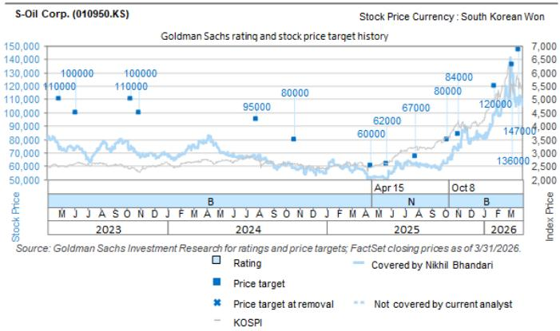  
The price targets shown should be considered in the context of all prior published GS, which may or may not have included price targets, as well as developments relating to the company, its industry and financial markets.

Target price history table(s)
S-Oil Corp. (010950.KS) 

<table><tr><td>Date of report</td><td>Target price (W)</td><td>Closing price (W)</td></tr><tr><td>23-Mar-26</td><td>147,000</td><td>106,000</td></tr><tr><td>08-Mar-26</td><td>136,000</td><td>129,700</td></tr><tr><td>26-Jan-26</td><td>120,000</td><td>98,300</td></tr><tr><td>03-Nov-25</td><td>84,000</td><td>72,300</td></tr><tr><td>08-Oct-25</td><td>80,000</td><td>62,300</td></tr><tr><td>27-Jul-25</td><td>67,000</td><td>62,300</td></tr><tr><td>22-May-25</td><td>62,000</td><td>50,600</td></tr><tr><td>15-Apr-25</td><td>60,000</td><td>51,800</td></tr><tr><td>22-Oct-24</td><td>80,000</td><td>58,700</td></tr><tr><td>26-Jul-24</td><td>95,000</td><td>66,400</td></tr><tr><td>30-Oct-23</td><td>100,000</td><td>69,700</td></tr><tr><td>09-Oct-23</td><td>110,000</td><td>72,900</td></tr><tr><td>06-Jun-23</td><td>100,000</td><td>74,400</td></tr></table>

Price targets shown in table(s) are unadjusted for corporate actions.

# Regulatory disclosures

# Disclosures required by United States laws and regulations

See company-specific regulatory disclosures above for any of the following disclosures required as to companies referred to in this report: manager or co-manager in a pending transaction; 1% or other ownership; compensation for certain services; types of client relationships; managed/co-managed public offerings in prior periods; directorships; for equity securities, market making and/or specialist role. GS trades or may trade as a principal in debt securities (or in related derivatives) of issuers discussed in this report.

The following are additional required disclosures: Ownership and material conflicts of interest: GS policy prohibits its analysts, professionals reporting to analysts and members of their households from owning securities of any company in the analyst's area of coverage. Analyst compensation: Analysts are paid in part based on the profitability of GS, which includes investment banking revenues. Analyst as officer or director: GS policy generally prohibits its analysts, persons reporting to analysts or members of their households from serving as an officer, director or advisor of any company in the analyst's area of coverage. Non-U.S. Analysts: Non-U.S. analysts may not be associated persons of GS & Co. LLC and therefore may not be subject to FINRA Rule 2241 or FINRA Rule 2242 restrictions on communications with a subject

company, public appearances and trading in securities covered by the analysts.

Distribution of ratings: See the distribution of ratings disclosure above. Price chart: See the price chart, with changes of ratings and price targets in prior periods, above, or, if electronic format or if with respect to multiple companies which are the subject of this report, on the GS website at https://www.gs.com/research/hedge.html.

# Additional disclosures required under the laws and regulations of jurisdictions other than the United States

The following disclosures are those required by the jurisdiction indicated, except to the extent already made above pursuant to United States laws and regulations. Australia: GS Australia Pty Ltd and its affiliates are not authorised deposit-taking institutions (as that term is defined in the Banking Act 1959 (Cth)) in Australia and do not provide banking services, nor carry on a banking business, in Australia. This research, and any access to it, is intended only for “wholesale clients” within the meaning of the Australian Corporations Act, unless otherwise agreed by GS. In producing research reports, members of Global Investment Research of GS Australia may attend site visits and other meetings hosted by the companies and other entities which are the subject of its research reports. In some instances the costs of such site visits or meetings may be met in part or in whole by the issuers concerned if GS Australia considers it is appropriate and reasonable in the specific circumstances relating to the site visit or meeting. To the extent that the contents of this document contains any financial product advice, it is general advice only and has been prepared by GS without taking into account a client’s objectives, financial situation or needs. A client should, before acting on any such advice, consider the appropriateness of the advice having regard to the client’s own objectives, financial situation and needs. A copy of certain GS Australia and New Zealand disclosure of interests and a copy of GS’ Australian Sell-Side Research Independence Policy Statement are available at: https://www.goldmansachs.com/disclosures/australia-new-zealand/index.html. Brazil: Disclosure information in relation to CVM Resolution n. 20 is available at https://www.gs.com/worldwide/brazil/area/gir/index.html. Where applicable, the Brazil-registered analyst primarily responsible for the content of this research report, as defined in Article 20 of CVM Resolution n. 20, is the first author named at the beginning of this report, unless indicated otherwise at the end of the text. Canada: This information is being provided to you for information purposes only and is not, and under no circumstances should be construed as, an advertisement, offering or solicitation by GS & Co. LLC for purchasers of securities in Canada to trade in any Canadian security. GS & Co. LLC is not registered as a dealer in any jurisdiction in Canada under applicable Canadian securities laws and generally is not permitted to trade in Canadian securities and may be prohibited from selling certain securities and products in certain jurisdictions in Canada. If you wish to trade in any Canadian securities or other products in Canada please contact GS Canada Inc., an affiliate of The GS Group Inc., or another registered Canadian dealer. Hong Kong: Further information on the securities of covered companies referred to in this research may be obtained on request from GS (Asia) L.L.C. India: Further information on the subject company or companies referred to in this research may be obtained from GS (India) Securities Private Limited, Research Analyst - SEBI Registration Number INH000001493, 10th Floor, Ascent-Worli, Sudam Kalu Ahire Marg, Worli, Mumbai-400 025, India, Corporate Identity Number U74140MH2006FTC160634, Phone +91 22 6616 9000, Fax +91 22 6616 9001. GS may beneficially own 1% or more of the securities (as such term is defined in clause 2 (h) the Indian Securities Contracts (Regulation) Act, 1956) of the subject company or companies referred to in this research report. Investment in securities market are subject to market risks. Read all the related documents carefully before investing. Registration granted by SEBI and certification from NISM in no way guarantee performance of the intermediary or provide any assurance of returns to investors. GS (India) Securities Private Limited compliance officer and investor grievance contact details can be found at: https://www.goldmansachs.com/worldwide/india/documents/Grievance-Redressal-and-Escalation-Matrix.pdf, and a copy of the annual audit compliance report can be found at this link: https://publishing.gs.com/content/site/india-annual-compliance-report.html. Japan: See below. Korea: This research, and any access to it, is intended only for “professional investors” within the meaning of the Financial Services and Capital Markets Act, unless otherwise agreed by GS. Further information on the subject company or companies referred to in this research may be obtained from GS (Asia) L.L.C., Seoul Branch. New Zealand: GS New Zealand Limited and its affiliates are neither “registered banks” nor “deposit takers” (as defined in the Reserve Bank of New Zealand Act 1989) in New Zealand. This research, and any access to it, is intended for “wholesale clients” (as defined in the Financial Advisers Act 2008) unless otherwise agreed by GS. A copy of certain GS Australia and New Zealand disclosure of interests is available at: https://www.goldmansachs.com/disclosures/australia-new-zealand/index.html. Russia: Research reports distributed in the Russian Federation are not advertising as defined in the Russian legislation, but are information and analysis not having product promotion as their main purpose and do not provide appraisal within the meaning of the Russian legislation on appraisal activity. Research reports do not constitute a personalized investment recommendation as defined in Russian laws and regulations, are not addressed to a specific client, and are prepared without analyzing the financial circumstances, investment profiles or risk profiles of clients. GS assumes no responsibility for any investment decisions that may be taken by a client or any other person based on this research report. Singapore: GS (Singapore) Pte. (Company Number: 198602165W), which is regulated by the Monetary Authority of Singapore, accepts legal responsibility for this research, and should be contacted with respect to any matters arising from, or in connection with, this research. Taiwan: This material is for reference only and must not be reprinted without permission. Investors should carefully consider their own investment risk. Investment results are the responsibility of the individual investor. United Kingdom: Persons who would be categorized as retail clients in the United Kingdom, as such term is defined in the rules of the Financial Conduct Authority, should read this research in conjunction with prior GS on the covered companies referred to herein and should refer to the risk warnings that have been sent to them by GS International. A copy of these risks warnings, and a glossary of certain financial terms used in this report, are available from GS International on request.

European Union and United Kingdom: Disclosure information in relation to Article 6 (2) of the European Commission Delegated Regulation (EU) (2016/958) supplementing Regulation (EU) No 596/2014 of the European Parliament and of the Council (including as that Delegated Regulation is implemented into United Kingdom domestic law and regulation following the United Kingdom's departure from the European Union and the European Economic Area) with regard to regulatory technical standards for the technical arrangements for objective presentation of investment recommendations or other information recommending or suggesting an investment strategy and for disclosure of particular interests or indications of conflicts of interest is available at https://www.gs.com/disclosures/europeanpolicy.html which states the European Policy for Managing Conflicts of Interest in Connection with Investment Research.

Japan: GS Japan Co., Ltd. is a Financial Instrument Dealer registered with the Kanto Financial Bureau under registration number Kinsho 69, and a member of Japan Securities Dealers Association, Financial Futures Association of Japan Type II Financial Instruments Firms Association, and Investment Management Association of Japan. Sales and purchase of equities are subject to commission pre-determined with clients plus consumption tax. See company-specific disclosures as to any applicable disclosures required by Japanese stock exchanges, the Japanese Securities Dealers Association or the Japanese Securities Finance Company.

# Ratings, coverage universe and related definitions

Buy (B), Neutral (N), Sell (S) Analysts recommend stocks as Buys or Sells for inclusion on various regional Investment Lists. Being assigned a Buy or Sell on an Investment List is determined by a stock's total return potential relative to its coverage universe. Any stock not assigned as a Buy or a Sell on an Investment List with an active rating (i.e., a stock that is not Rating Suspended, Not Rated, Early-Stage Biotech, Coverage Suspended or Not Covered), is deemed Neutral. Each region manages Regional Conviction Lists, which are selected from Buy rated stocks on the respective region's Investment Lists and represent investment recommendations focused on the size of the total return potential and/or the likelihood of the realization of the return across their respective areas of coverage. The addition or removal of stocks from such Conviction Lists are managed by the Investment Review Committee or other designated committee in each respective region and do not represent a change in the analysts' investment rating for such stocks.

Total return potential represents the upside or downside differential between the current share price and the price target, including all paid or anticipated dividends, expected during the time horizon associated with the price target. Price targets are required for all covered stocks. The total return potential, price target and associated time horizon are stated in each report adding or reiterating an Investment List membership.

Coverage Universe: A list of all stocks in each coverage universe is available by primary analyst, stock and coverage universe at https://www.gs.com/research/hedge.html.

Not Rated (NR). The investment rating, target price and earnings estimates (where relevant) are removed pursuant to GS policy when GS is acting in an advisory capacity in a merger or in a strategic transaction involving this company, when there are legal, regulatory or policy constraints due to GS' involvement in a transaction, and in certain other circumstances. Early-Stage Biotech (ES). An investment rating and a target price are not assigned pursuant to GS policy when this company has neither a drug, treatment or medical device that has passed a Phase II clinical trial nor a license to distribute a post-Phase II drug, treatment or medical device. Rating Suspended (RS). GS has suspended the investment rating and price target for this stock, because there is not a sufficient fundamental basis for determining an investment rating or target price. The previous investment rating and target price, if any, are no longer in effect for this stock and should not be relied upon. Coverage Suspended (CS). GS has suspended coverage of this company. Not Covered (NC). GS does not cover this company.

# Global product; distributing entities

GS Global Investment Research produces and distributes research products for clients of GS on a global basis. Analysts based in GS offices around the world produce research on industries and companies, and research on macroeconomics, currencies, commodities and portfolio strategy. This research is disseminated in Australia by GS Australia Pty Ltd (ABN 21 006 797 897); in Brazil by GS do Brasil Corretora de Títulos e Valores Mobiliários S.A.; Public Communication Channel GS Brazil: 0800 727 5764 and / or contatogoldmanbrasil@gs.com. Available Weekdays (except holidays), from 9am to 6pm. Canal de Comunicação com o Público GS Brasil: 0800 727 5764 e/ou contatogoldmanbrasil@gs.com. Horário de funcionamento: segunda-feira à sexta-feira (exceto feriados), das 9h às 18h; in Canada by GS & Co. LLC; in Hong Kong by GS (Asia) L.L.C.; in India by GS (India) Securities Private Ltd.; in Japan by GS Japan Co., Ltd.; in the Republic of Korea by GS (Asia) L.L.C., Seoul Branch; in New Zealand by GS New Zealand Limited; in Russia by OOO GS; in Singapore by GS (Singapore) Pte. (Company Number: 198602165W); and in the United States of America by GS & Co. LLC. GS International has approved this research in connection with its distribution in the United Kingdom.

GS International (“GSI”), authorised by the Prudential Regulation Authority (“PRA”) and regulated by the Financial Conduct Authority (“FCA”) and the PRA, has approved this research in connection with its distribution in the United Kingdom.

European Economic Area: GS Bank Europe SE (“GSBE”) is a credit institution incorporated in Germany and, within the Single Supervisory Mechanism, subject to direct prudential supervision by the European Central Bank and in other respects supervised by German Federal Financial Supervisory Authority (Bundesanstalt für Finanzdienstleistungsaufsicht, BaFin) and Deutsche Bundesbank and disseminates research within the European Economic Area.

# General disclosures

This research is for our clients only. Other than disclosures relating to GS, this research is based on current public information that we consider reliable, but we do not represent it is accurate or complete, and it should not be relied on as such. The information, opinions, estimates and forecasts contained herein are as of the date hereof and are subject to change without prior notification. We seek to update our research as appropriate, but various regulations may prevent us from doing so. Other than certain industry reports published on a periodic basis, the large majority of reports are published at irregular intervals as appropriate in the analyst's judgment.

GS conducts a global full-service, integrated investment banking, investment management, and brokerage business. We have investment banking and other business relationships with a substantial percentage of the companies covered by Global Investment Research. GS & Co. LLC, the United States broker dealer, is a member of SIPC (https://www.sipc.org).

Our salespeople, traders, and other professionals may provide oral or written market commentary or trading strategies to our clients and principal trading desks that reflect opinions that are contrary to the opinions expressed in this research. Our asset management area, principal trading desks and investing businesses may make investment decisions that are inconsistent with the recommendations or views expressed in this research.

The analysts named in this report may have from time to time discussed with our clients, including GS salespersons and traders, or may discuss in this report, trading strategies that reference catalysts or events that may have a near-term impact on the market price of the equity securities discussed in this report, which impact may be directionally counter to the analyst's published price target expectations for such stocks. Any such trading strategies are distinct from and do not affect the analyst's fundamental equity rating for such stocks, which rating reflects a stock's return potential relative to its coverage universe as described herein.

We and our affiliates, officers, directors, and employees will from time to time have long or short positions in, act as principal in, and buy or sell, the securities or derivatives, if any, referred to in this research, unless otherwise prohibited by regulation or GS policy.

The views attributed to third party presenters at GS arranged conferences, including individuals from other parts of GS, do not necessarily reflect those of Global Investment Research and are not an official view of GS.

Any third party referenced herein, including any salespeople, traders and other professionals or members of their household, may have positions in the products mentioned that are inconsistent with the views expressed by analysts named in this report.

This research is not an offer to sell or the solicitation of an offer to buy any security in any jurisdiction where such an offer or solicitation would be illegal. It does not constitute a personal recommendation or take into account the particular investment objectives, financial situations, or needs of individual clients. Clients should consider whether any advice or recommendation in this research is suitable for their particular circumstances and, if appropriate, seek professional advice, including tax advice. The price and value of investments referred to in this research and the income from them may fluctuate. Past performance is not a guide to future performance, future returns are not guaranteed, and a loss of original capital may occur. Fluctuations in exchange rates could have adverse effects on the value or price of, or income derived from, certain investments.

Certain transactions, including those involving futures, options, and other derivatives, give rise to substantial risk and are not suitable for all investors. Investors should review current options and futures disclosure documents which are available from GS sales representatives or at https://www.theocc.com/about/publications/character-risks.jsp and https://www.goldmansachs.com/disclosures/cftc\_fcm\_disclosures. Transaction costs may be significant in option strategies calling for multiple purchase and sales of options such as spreads. Supporting documentation will be supplied upon request.

Differing Levels of Service provided by Global Investment Research: The level and types of services provided to you by GS Global Investment Research may vary as compared to that provided to internal and other external clients of GS, depending on various factors including your individual preferences as to the frequency and manner of receiving communication, your risk profile and investment focus and perspective (e.g.,

marketwide, sector specific, long term, short term), the size and scope of your overall client relationship with GS, and legal and regulatory constraints. As an example, certain clients may request to receive notifications when research on specific securities is published, and certain clients may request that specific data underlying analysts' fundamental analysis available on our internal client websites be delivered to them electronically through data feeds or otherwise. No change to an analyst's fundamental research views (e.g., ratings, price targets, or material changes to earnings estimates for equity securities), will be communicated to any client prior to inclusion of such information in a research report broadly disseminated through electronic publication to our internal client websites or through other means, as necessary, to all clients who are entitled to receive such reports.

All research reports are disseminated and available to all clients simultaneously through electronic publication to our internal client websites. Not all research content is redistributed to our clients or available to third-party aggregators, nor is GS responsible for the redistribution of our research by third party aggregators. For research, models or other data related to one or more securities, markets or asset classes (including related services) that may be available to you, please contact your GS representative or go to https://research.gs.com.

Disclosure information is also available at https://www.gs.com/research/hedge.html or from Research Compliance, 200 West Street, New York, NY 10282.

# © 2026 GS.

You are permitted to store, display, analyze, modify, reformat, and print the information made available to you via this service only for your own use. You may not resell or reverse engineer this information to calculate or develop any index for disclosure and/or marketing or create any other derivative works or commercial product(s), data or offering(s) without the express written consent of GS. You are not permitted to publish, transmit, or otherwise reproduce this information, in whole or in part, in any format to any third party without the express written consent of GS. This foregoing restriction includes, without limitation, using, extracting, downloading or retrieving this information, in whole or in part, to train or finetune a machine learning or artificial intelligence system, or to provide or reproduce this information, in whole or in part, as a prompt or input to any such system.