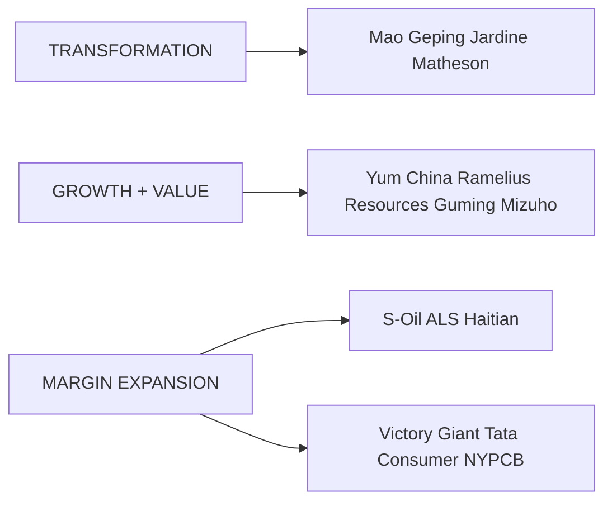
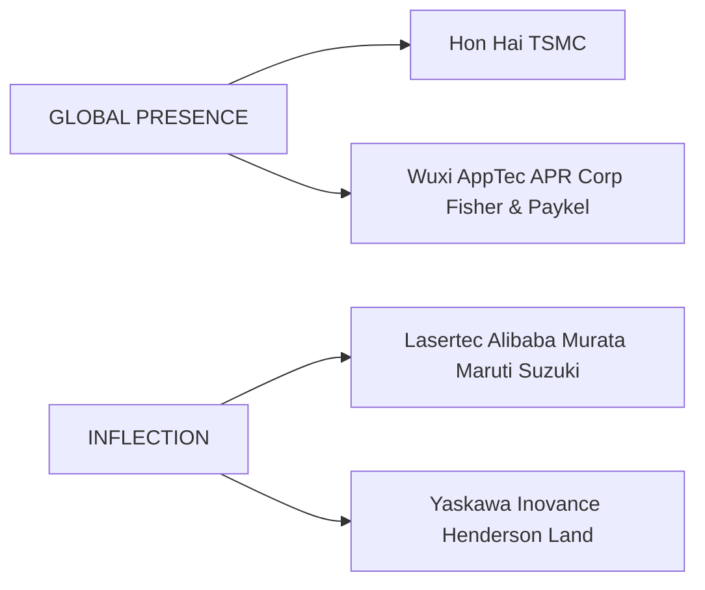

你是闲鱼资料类商品文案编辑，擅长把一份投研/行业/公司研报改写成适合闲鱼发布的商品说明。

【目标】
- 基于下面研报解析内容，生成一份可以复制到闲鱼商品详情里的中文文案。
- 风格参考用户提供的闲鱼对标笔记：标题直给、信息密度高、用途明确、适合人群明确、交付方式清楚。
- 语言要自然，像真实卖家发布，不要像公众号文章、小红书笔记或 AI 摘要。
- 不要使用太夸张的营销词，不要承诺收益，不要说“稳赚”“内幕”“必涨”。
- 可以适度口语化，但不要低俗。

【必须输出结构】
1. `闲鱼标题：` 一行，控制在 30 字以内，适合商品标题。
2. `商品描述：` 正文，适合直接粘贴到闲鱼详情页。
3. `Hashtag：` 一行，给 6-10 个平台可用标签，用 `#` 开头，空格分隔。

【严禁输出】
- 不要输出 `建议价格：`。
- 不要输出 `搜索关键词：`。
- 不要输出“搜索词”“关键词”“搜索关键词”等栏目。
- 不要给具体价格区间、成交承诺或价格建议。

【商品描述写法】
- 第一段：直接说明这是什么报告，页数/语言/主题/公司或行业。如果页数、日期、语言不确定，就不要编。
- 第二段：说明适合谁，比如投研、券商面试、PE/VC、行业研究、学习参考、写报告等。
- 第三段：用 3-5 个亮点 bullet，风格参考：
  ✅ 三大情景框架：DCF、P/ARR、EV/Sales
  ✅ 关键变量分析
  ✅ 估值逻辑、假设、终值占比等核心内容覆盖
  ✅ 适合准备 AI 相关面试、研究 AI 估值的同学
- 第四段：交付说明，参考：`资料为电子版 PDF，拍下后 24 小时内发网盘链接或邮箱。`
- 第五段：虚拟商品说明，参考：`电子类资料一经发货不退不换，有问题可以提前咨询。`
- 可以补一句：`需要其他报告也可以私聊，支持一站式咨询。`

【Hashtag 写法】
- 只输出平台相对安全、偏学习和资料属性的标签。
- 推荐从这些里选择：`#学习资料` `#研究笔记` `#学习笔记` `#行业研究` `#研报资料` `#资料整理` `#报告学习` `#案例研究`。
- 不要输出 `#财经` `#投资` `#股票` `#基金` `#理财` `#暴富` `#内幕` 等敏感标签。

【平台发布合规要求】
- 不要出现“投资建议”“买入”“卖出”“强烈推荐”“稳赚”“保本”“必涨”“抄底”“上车”“内幕”“翻倍”等金融操作或收益承诺表达。
- “投资”相关词尽量改成“投研”“研究”“观察”“学习参考”；如果必须保留，也要保持中性。
- 不要出现“独家”“原版”“内部”“无水印”“全网最低”“最全”“最强”“必看”等高风险或极限词。
- 不要写“关注”“点赞”“求关注”“评论区留言”等直接互动诱导。
- 不要承诺资料一定可用于获利、就业、通过面试或获得收益。

【合规与避坑】
- 默认避免出现具体投行品牌名，比如“GS”“GS”“MS”，统一写作“投行研报”或“投行研报”。
- 不要承诺研究或交易结果。
- 不要伪造页数、日期、作者、公司覆盖范围。研报未给出时就不写。
- 不要输出解释说明，只输出闲鱼文案本身。

【研报解析内容】
"""
APAC CONVICTION LIST - DIRECTORS' CUT

June update - Adding S-Oil

APAC Conviction List - Director's Cut

See the list >

We add S-Oil to the APAC Conviction List in this month's update. In addition, we highlight the upcoming catalysts for all the stocks on our APAC Conviction List, as well as key strategy and sector reports across Agentic Economy, Global Refining, and China Consumer.

S-Oil – Nikhil Bhandari's positive view on S-Oil is based on: 1) Potential strong free cash flow inflection (18% FCF yield in 2027E); 2) Favourable middle distillates exposure (diesel & jet fuel; \~56% of product yield) positioning the company well in a market where product tightness is likely to persist; 3) Consensus earnings upgrade to accelerate; and 4) Attractive valuation with shares discounting a combination of below mid-cycle diesel/jet cracks in 2027E and lower for longer chemical spreads for the upcoming Shaheen project (effectively assuming negative IRR on the new chemical project).

# Michael Snaith

+852-2978-0455

michael.snaith@gs.com

GS (Asia) L.L.C.

# Joy Nguyen

+852-2978-1106 | joy.nguyen@gs.com

GS (Asia) L.L.C.

# Matthew Ross

+61(3)9679-1616

matthew.ross@gs.com

GS Australia Pty Ltd

# Daiki Takayama

+81(3)4587-9870

daiki.takayama@gs.com

GS Japan Co., Ltd.

# Sho Kawano

+81(3)4587-9905 | sho.kawano@gs.com

GS Japan Co., Ltd.

# Caleb Chan

+852-2978-0790 | caleb.chan@gs.com

GS (Asia) L.L.C.

Exhibit 1: APAC Conviction List - Directors' Cut

June 2026: All price targets are for 12 months; prices are in LCY as of May 29, 2026; green shading indicates new additions

<table><tr><td>Ticker</td><td>Company Name</td><td>Market Cap ($, mn)</td><td>Last Close</td><td>Target Price</td><td>Upside to 12m PT</td><td>12m Fwd Div Yield</td><td>Total Return Potential (12m)</td><td>GS vs. Cons*</td><td>Analyst</td><td>Market / Exchange</td></tr><tr><td colspan="11">Consumer</td></tr><tr><td>278470.KS</td><td>APR Corp.</td><td>9,737</td><td>395,500</td><td>460000</td><td>16%</td><td>1%</td><td>17%</td><td>-1%</td><td>Diane Kang</td><td>South Korea</td></tr><tr><td>1364.HK</td><td>Guming Holdings Ltd.</td><td>6,918</td><td>22.80</td><td>36</td><td>58%</td><td>3%</td><td>61%</td><td>4%</td><td>Michelle Cheng</td><td>China H</td></tr><tr><td>3288.HK</td><td>Foshan Haitian Flavouring &amp; Food</td><td>24,356</td><td>32.62</td><td>47.3</td><td>45%</td><td>4%</td><td>49%</td><td>0%</td><td>Leaf Liu</td><td>China H</td></tr><tr><td>1318.HK</td><td>Mao Geping Cosmetics Co.</td><td>3,743</td><td>59.85</td><td>106</td><td>77%</td><td>3%</td><td>80%</td><td>-1%</td><td>Valerie Zhou</td><td>China H</td></tr><tr><td>TACN.BO</td><td>Tata Consumer Products Ltd.</td><td>11,440</td><td>1179.35</td><td>1450</td><td>23%</td><td>1%</td><td>24%</td><td>4%</td><td>Arnab Mitra</td><td>India</td></tr><tr><td>YUMC</td><td>Yum China Holdings</td><td>14,635</td><td>42.43</td><td>58</td><td>37%</td><td>3%</td><td>40%</td><td>-1%</td><td>Michelle Cheng</td><td>China US</td></tr><tr><td colspan="11">Financials</td></tr><tr><td>0012.HK</td><td>Henderson Land</td><td>19,125</td><td>30.96</td><td>41</td><td>32%</td><td>4%</td><td>36%</td><td>7%</td><td>Simon Cheung, CFA</td><td>Hong Kong</td></tr><tr><td>8411.T</td><td>Mizuho FG</td><td>110,215</td><td>7,195</td><td>8140</td><td>13%</td><td>2%</td><td>15%</td><td>0%</td><td>Makoto Kuroda</td><td>Japan</td></tr><tr><td colspan="11">Healthcare</td></tr><tr><td>FPH.AX</td><td>Fisher &amp; Paykel Healthcare Corp.</td><td>13,052</td><td>31.17</td><td>42.3</td><td>36%</td><td>2%</td><td>37%</td><td>3%</td><td>Davin Thillainathan, CFA</td><td>NZ</td></tr><tr><td>2359.HK</td><td>WuXi AppTec Co.</td><td>49,358</td><td>130.30</td><td>169.8</td><td>30%</td><td>2%</td><td>32%</td><td>12%</td><td>Ziyi Chen</td><td>China H</td></tr><tr><td colspan="11">Industrials</td></tr><tr><td>ALQ.AX</td><td>ALS Ltd.</td><td>8,597</td><td>23.59</td><td>28.3</td><td>20%</td><td>2%</td><td>22%</td><td>4%</td><td>Niraj Shah</td><td>Australia</td></tr><tr><td>JARD.SI</td><td>Jardine Matheson</td><td>44,541</td><td>66.38</td><td>95.5</td><td>44%</td><td>4%</td><td>48%</td><td>7%</td><td>Simon Cheung, CFA</td><td>Hong Kong</td></tr><tr><td>300124.SZ</td><td>Shenzhen Inovance Technology Co.</td><td>29,579</td><td>73.96</td><td>86</td><td>16%</td><td>1%</td><td>17%</td><td>-6%</td><td>Jacqueline Du</td><td>China A</td></tr><tr><td>6506.T</td><td>Yaskawa Electric</td><td>11,744</td><td>7,208</td><td>9200</td><td>28%</td><td>1%</td><td>29%</td><td>14%</td><td>Yuichiro Isayama</td><td>Japan</td></tr><tr><td colspan="11">Internet &amp; IT Services</td></tr><tr><td>BABA</td><td>Alibaba Group</td><td>298,136</td><td>124.22</td><td>186</td><td>50%</td><td>2%</td><td>52%</td><td>-23%</td><td>Ronald Keung, CFA</td><td>China US</td></tr><tr><td colspan="11">Mobility</td></tr><tr><td>MRTI.BO</td><td>Maruti Suzuki India</td><td>43,420</td><td>13119.85</td><td>15800</td><td>20%</td><td>1%</td><td>22%</td><td>2%</td><td>Chandramouli Muthiah</td><td>India</td></tr><tr><td colspan="11">Natural Resources</td></tr><tr><td>RMS.AX</td><td>Ramelius Resources</td><td>4,355</td><td>3.22</td><td>5.6</td><td>74%</td><td>2%</td><td>76%</td><td>13%</td><td>Hugo Nicolaci</td><td>Australia</td></tr><tr><td>010950.KS</td><td>S-Oil Corp.</td><td>8,297</td><td>107,400</td><td>147000</td><td>37%</td><td>3%</td><td>40%</td><td>-31%</td><td>Nikhil Bhandari</td><td>South Korea</td></tr><tr><td colspan="11">Technology</td></tr><tr><td>2317.TW</td><td>Hon Hai</td><td>130,703</td><td>289</td><td>400</td><td>38%</td><td>4%</td><td>42%</td><td>9%</td><td>Allen Chang</td><td>Taiwan</td></tr><tr><td>6920.T</td><td>Lasertec</td><td>22,736</td><td>40,130</td><td>55000</td><td>37%</td><td>1%</td><td>38%</td><td>23%</td><td>Shuhei Nakamura</td><td>Japan</td></tr><tr><td>6981.T</td><td>Murata Mfg.</td><td>122,584</td><td>9,625</td><td>5400</td><td>-44%</td><td>1%</td><td>-43%</td><td>7%</td><td>Daiki Takayama</td><td>Japan</td></tr><tr><td>8046.TW</td><td>NYPCB</td><td>17,492</td><td>848</td><td>1115</td><td>31%</td><td>2%</td><td>33%</td><td>61%</td><td>Chao Wang</td><td>Taiwan</td></tr><tr><td>2330.TW</td><td>TSMC</td><td>1,949,404</td><td>2,355</td><td>2750</td><td>17%</td><td>1%</td><td>18%</td><td>1%</td><td>Bruce Lu</td><td>Taiwan</td></tr><tr><td>300476.SZ</td><td>Victory Giant</td><td>47,387</td><td>368.52</td><td>550</td><td>49%</td><td>2%</td><td>51%</td><td>13%</td><td>Allen Chang</td><td>China A</td></tr></table>

\*FY1 EPS: 1364.HK, 3288.HK, 1318.HK, TACN.BO, YUMC, 0012.HK, 8411.T, FPH.AX, 2359.HK, ALQ.AX, 300124.SZ, 6506.T, BABA, RMS.AX, 010950.KS, 2317.TW, 6981.T, 8046.TW, 300476.SZ; FY1 EBITDA: ; FY1 Sales: MRTI.BO; FY2 EPS: 278470.KS, JARD.SI, 2330.TW; FY3 OP: 6920.T

Alibaba-H price target is HK\$180 (May 29 close: HK\$120.9); TSMC ADR price target is \$550 (May 29 close: \$418.45); Wuxi AppTec-A price target is Rmb151.9 (May 29 close: Rmb101.6); Yum China-H price target is HK\$452 (May 29 close: HK\$343)

Source: GS Global Investment Research, Bloomberg

# Our 24 Differentiated Buy Recommendations

The company-specific discussion in the sections below reflects the views of the covering analyst.

Exhibit 2: Anatomy of the List   

flowchart

flowchart

Source: GS Global Investment Research

Exhibit 3: Regional exposure of the APAC Conviction List
Companies by domicile (%)   

pie

| Region | Percentage (%) |
| :--- | :--- |
| China | 33 |
| Greater China | 54 |
| Japan | 17 |
| Taiwan | 13 |
| Hong Kong | 8 |
| ANZ | 13 |
| India | 8 |
| South Korea... | 9 |

Source: Bloomberg, GS Global Investment Research

Exhibit 4: Sector exposure of the APAC Conviction List
Companies by GICS Level 1 Sector (%)   

pie

| Category | Percentage (%) |
| :--- | :--- |
| Information Technology | 25 |
| Consumer Staples | 17 |
| Consumer Disc. | 17 |
| Industrials | 17 |
| Health Care | 8 |
| Financials | 4 |
| Materials | 4 |
| Real Estate | 4 |

Source: Bloomberg, GS Global Investment Research

Exhibit 5: APAC Conviction List - Directors' Cut 

<table><tr><td>Ticker</td><td>Company Name</td><td>Summary</td></tr><tr><td colspan="3">Consumer</td></tr><tr><td>278470.KS</td><td>APR Corp.</td><td>Drivers of sustainable growth materializing</td></tr><tr><td>1364.HK</td><td>Guming Holdings Ltd.</td><td>High growth visibility amid consumption uncertainties</td></tr><tr><td>3288.HK</td><td>Foshan Haitian Flavouring &amp; Food</td><td>Solid growth visibility as the leader pivots to a recovery path</td></tr><tr><td>1318.HK</td><td>Mao Geping Cosmetics Co.</td><td>Monetizing brand strength with category &amp; channel expansion</td></tr><tr><td>TACN.BO</td><td>Tata Consumer Products Ltd.</td><td>Industry leading mid-teens volume growth, margin recovery on track</td></tr><tr><td>YUMC</td><td>Yum China Holdings</td><td>Growth certainty with strong track record navigating market volatility</td></tr><tr><td colspan="3">Financials</td></tr><tr><td>0012.HK</td><td>Henderson Land</td><td>Recovery after prolonged downturn</td></tr><tr><td>8411.T</td><td>Mizuho FG</td><td>Entering new phase of growth investment &amp; shareholder returns</td></tr><tr><td colspan="3">Healthcare</td></tr><tr><td>FPH.AX</td><td>Fisher &amp; Paykel Healthcare Corp.</td><td>Growing portfolio breadth assists market share &amp; pricing power</td></tr><tr><td>2359.HK</td><td>WuXi AppTec Co.</td><td>Favorable product cycle and technology depth in TIDES drive visibility beyond 2026</td></tr><tr><td colspan="3">Industrials</td></tr><tr><td>ALQ.AX</td><td>ALS Ltd.</td><td>Improving commodities momentum continues to drive cyclical leverage</td></tr><tr><td>JARD.SI</td><td>Jardine Matheson</td><td>Strategic change to drive efficiency gains and unlock value</td></tr><tr><td>300124.SZ</td><td>Shenzhen Inovance Technology Co.</td><td>Order momentum, capacity expansion and price hikes drive re-acceleration</td></tr><tr><td>6506.T</td><td>Yaskawa Electric</td><td>AI Capex and Motion Control recovery driving substantial upside</td></tr><tr><td colspan="3">Internet &amp; IT Services</td></tr><tr><td>BABA</td><td>Alibaba Group</td><td>Full-stack AI leader with EPS recovery ahead</td></tr><tr><td colspan="3">Mobility</td></tr><tr><td>MRTI.BO</td><td>Maruti Suzuki India</td><td>Small car elasticity + Product cycle inflection</td></tr><tr><td colspan="3">Natural Resources</td></tr><tr><td>RMS.AX</td><td>Ramelius Resources</td><td>An attractive mix of longer term value and output growth</td></tr><tr><td>010950.KS</td><td>S-Oil Corp.</td><td>Refining supercycle underpinned by structural tightness</td></tr><tr><td colspan="3">Technology</td></tr><tr><td>2317.TW</td><td>Hon Hai</td><td>Growth acceleration from AI servers &amp; smartphones</td></tr><tr><td>6920.T</td><td>Lasertec</td><td>Earnings to accelerate, driven by game-changing new product</td></tr><tr><td>6981.T</td><td>Murata Mfg.</td><td>Tightening MLCC demand/supply driving earnings momentum</td></tr><tr><td>8046.TW</td><td>NYPCB</td><td>Elongated pricing upcycle to drive above consensus growth</td></tr><tr><td>2330.TW</td><td>TSMC</td><td>Easing Concerns on AI demand to drive outperformance</td></tr><tr><td>300476.SZ</td><td>Victory Giant</td><td>AI Server PCB leader riding on specification upgrades and global expansion</td></tr></table>

Source: GS Global Investment Research

# Upcoming Catalysts

We provide a rolling calendar of earnings and non-earnings events our analysts have identified as possible catalysts.

Exhibit 6: Upcoming Non-Earnings Catalysts   
Upcoming Non-Earnings Catalysts 

<table><tr><td>Ticker</td><td>Company Name</td><td>Date</td><td>Event</td></tr><tr><td>1318.HK</td><td>Mao Geping Cosmetics Co.</td><td>May/Jun-2026</td><td>618 shopping festival</td></tr><tr><td>278470.KS</td><td>APR Corp.</td><td>May/Jun-2026</td><td>Emergence of next champion SKU (e.g., sun products targeted for US launch)</td></tr><tr><td>JARD.SI</td><td>Jardine Matheson</td><td>16/06/2026</td><td>Investor Day</td></tr><tr><td>MRTI.BO</td><td>Maruti Suzuki India</td><td>1H 2026</td><td>Potential new Electric Car launch</td></tr><tr><td>JARD.SI</td><td>Jardine Matheson</td><td>1H 2026</td><td>Astra/JC&amp;C strategic review conclusion</td></tr></table>

Source: Company data, GS Global Investment Research

Exhibit 7: Upcoming Earnings Catalysts in the Next 3 Months   
Upcoming Earnings Catalysts 

<table><tr><td>Ticker</td><td>Company Name</td><td>Date</td><td>Event</td></tr><tr><td>6506.T</td><td>Yaskawa Electric</td><td>03/07/2026</td><td>2027 First Quarter Earnings Release</td></tr><tr><td>2330.TW</td><td>TSMC</td><td>17/07/2026</td><td>2026 Second Quarter Earnings Release</td></tr><tr><td>TACN.BO</td><td>Tata Consumer Products Ltd.</td><td>23/07/2026</td><td>2027 First Quarter Earnings Release</td></tr><tr><td>010950.KS</td><td>S-Oil Corp.</td><td>27/07/2026</td><td>2026 Second Quarter Earnings Release</td></tr><tr><td>2359.HK</td><td>WuXi AppTec Co.</td><td>28/07/2026</td><td>2026 Second Quarter Earnings Release</td></tr><tr><td>JARD.SI</td><td>Jardine Matheson</td><td>30/07/2026</td><td>2026 First Half Earnings Release</td></tr><tr><td>8411.T</td><td>Mizuho FG</td><td>31/07/2026</td><td>2027 First Quarter Earnings Release</td></tr><tr><td>MRTI.BO</td><td>Maruti Suzuki India</td><td>31/07/2026</td><td>2027 First Quarter Earnings Release</td></tr><tr><td>6981.T</td><td>Murata Mfg.</td><td>31/07/2026</td><td>2027 First Quarter Earnings Release</td></tr><tr><td>YUMC</td><td>Yum China Holdings</td><td>05/08/2026</td><td>2026 Second Quarter Earnings Release</td></tr><tr><td>8046.TW</td><td>NYPCB</td><td>06/08/2026</td><td>2026 Second Quarter Earnings Release</td></tr><tr><td>278470.KS</td><td>APR Corp.</td><td>06/08/2026</td><td>2026 Second Quarter Earnings Release</td></tr><tr><td>6920.T</td><td>Lasertec</td><td>07/08/2026</td><td>2026 Annual Earnings Release</td></tr><tr><td>2317.TW</td><td>Hon Hai</td><td>12/08/2026</td><td>2026 Second Quarter Earnings Release</td></tr><tr><td>0012.HK</td><td>Henderson Land</td><td>20/08/2026</td><td>2026 First Half Earnings Release</td></tr><tr><td>300124.SZ</td><td>Shenzhen Inovance Technology Co.</td><td>25/08/2026</td><td>2026 Second Quarter Earnings Release</td></tr><tr><td>1364.HK</td><td>Guming Holdings Ltd.</td><td>26/08/2026</td><td>2026 First Half Earnings Release</td></tr><tr><td>300476.SZ</td><td>Victory Giant</td><td>26/08/2026</td><td>2026 Second Quarter Earnings Release</td></tr><tr><td>1318.HK</td><td>Mao Geping Cosmetics Co.</td><td>27/08/2026</td><td>2026 First Half Earnings Release</td></tr><tr><td>BABA</td><td>Alibaba Group</td><td>28/08/2026</td><td>2027 First Quarter Earnings Release</td></tr><tr><td>3288.HK</td><td>Foshan Haitian Flavouring &amp; Food</td><td>28/08/2026</td><td>2026 Second Quarter Earnings Rele

[中间内容因长度限制已省略]

 including individuals from other parts of GS, do not necessarily reflect those of Global Investment Research and are not an official view of GS.

Any third party referenced herein, including any salespeople, traders and other professionals or members of their household, may have positions in the products mentioned that are inconsistent with the views expressed by analysts named in this report.

This research is not an offer to sell or the solicitation of an offer to buy any security in any jurisdiction where such an offer or solicitation would be illegal. It does not constitute a personal recommendation or take into account the particular investment objectives, financial situations, or needs of individual clients. Clients should consider whether any advice or recommendation in this research is suitable for their particular circumstances and, if appropriate, seek professional advice, including tax advice. The price and value of investments referred to in this research and the income from them may fluctuate. Past performance is not a guide to future performance, future returns are not guaranteed, and a loss of original capital may occur. Fluctuations in exchange rates could have adverse effects on the value or price of, or income derived from, certain investments.

Certain transactions, including those involving futures, options, and other derivatives, give rise to substantial risk and are not suitable for all investors. Investors should review current options and futures disclosure documents which are available from GS sales representatives or at https://www.theocc.com/about/publications/character-risks.jsp and https://www.goldmansachs.com/disclosures/cftc\_fcm\_disclosures. Transaction costs may be significant in option strategies calling for multiple purchase and sales of options such as spreads. Supporting documentation will be supplied upon request.

Differing Levels of Service provided by Global Investment Research: The level and types of services provided to you by GS Global Investment Research may vary as compared to that provided to internal and other external clients of GS, depending on various factors including your individual preferences as to the frequency and manner of receiving communication, your risk profile and investment focus and perspective (e.g.,

marketwide, sector specific, long term, short term), the size and scope of your overall client relationship with GS, and legal and regulatory constraints. As an example, certain clients may request to receive notifications when research on specific securities is published, and certain clients may request that specific data underlying analysts' fundamental analysis available on our internal client websites be delivered to them electronically through data feeds or otherwise. No change to an analyst's fundamental research views (e.g., ratings, price targets, or material changes to earnings estimates for equity securities), will be communicated to any client prior to inclusion of such information in a research report broadly disseminated through electronic publication to our internal client websites or through other means, as necessary, to all clients who are entitled to receive such reports.

All research reports are disseminated and available to all clients simultaneously through electronic publication to our internal client websites. Not all research content is redistributed to our clients or available to third-party aggregators, nor is GS responsible for the redistribution of our research by third party aggregators. For research, models or other data related to one or more securities, markets or asset classes (including related services) that may be available to you, please contact your GS representative or go to https://research.gs.com.

Disclosure information is also available at https://www.gs.com/research/hedge.html or from Research Compliance, 200 West Street, New York, NY 10282.

# © 2026 GS.

You are permitted to store, display, analyze, modify, reformat, and print the information made available to you via this service only for your own use. You may not resell or reverse engineer this information to calculate or develop any index for disclosure and/or marketing or create any other derivative works or commercial product(s), data or offering(s) without the express written consent of GS. You are not permitted to publish, transmit, or otherwise reproduce this information, in whole or in part, in any format to any third party without the express written consent of GS. This foregoing restriction includes, without limitation, using, extracting, downloading or retrieving this information, in whole or in part, to train or finetune a machine learning or artificial intelligence system, or to provide or reproduce this information, in whole or in part, as a prompt or input to any such system.
"""
