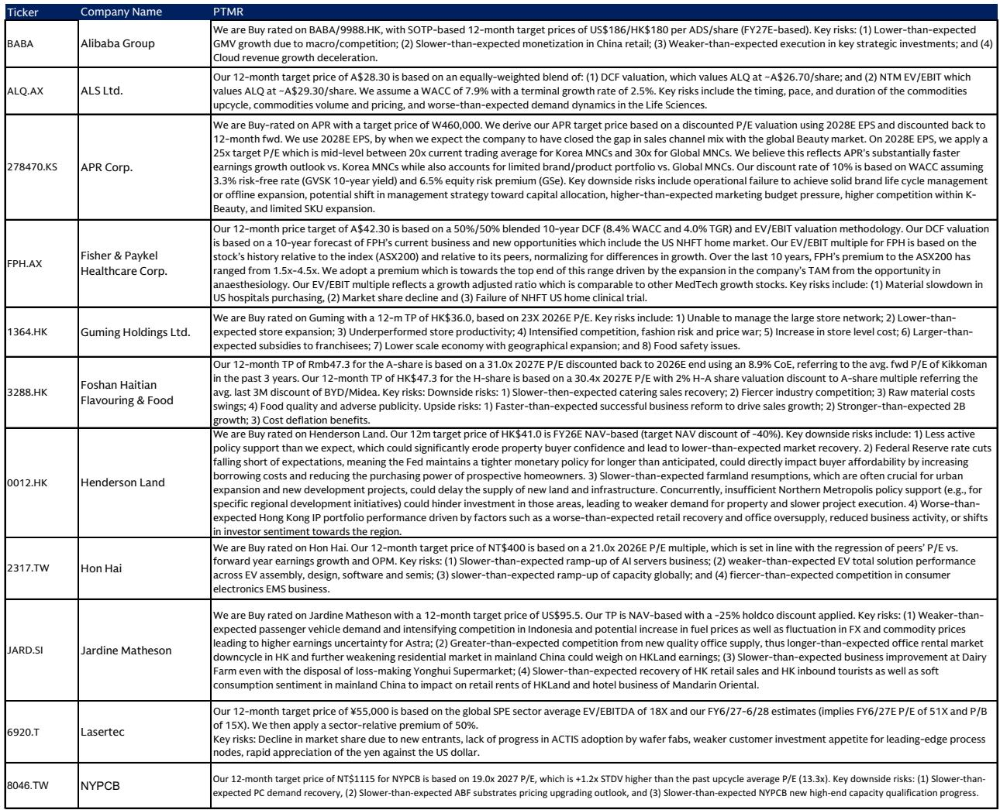
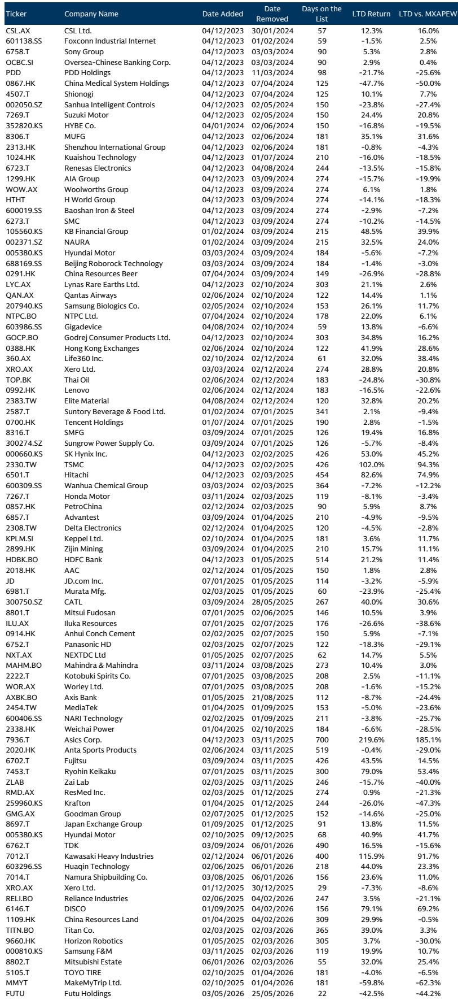
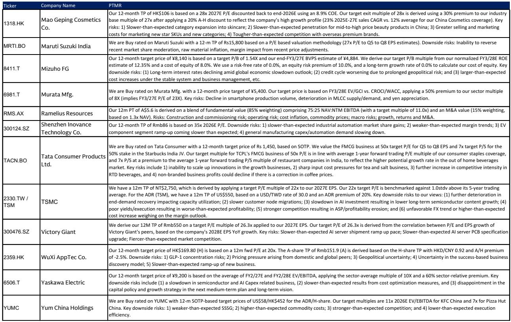

# 市场真正低估的不是油价，而是炼化结构壁垒的重新定价

当多数投资者还在关注原油价格波动对炼化企业的影响时，一份来自某外资投行的亚太精选名单更新，给出了一个值得深思的信号：该机构将一家韩国炼油企业——S-Oil——新增至其“Conviction List”（确信买入名单），并给出了37%的上行空间。

这份报告的核心判断并非关于油价走势，而是关于一个被市场系统性低估的结构性变量：**中间馏分（柴油与航空煤油）的供应紧张正在重塑炼化行业的利润分配格局，而拥有特定产品结构优势的企业，将在这一轮“炼化超级周期”中实现显著的现金流拐点。**

这不是一个短期的交易信号。报告所指向的，是一个可能持续至2027年甚至更长时间的价值重估过程。对于关注亚太权益市场的投资者而言，理解这一判断背后的逻辑，比追逐任何单一标的更为重要。

## 1. 这份名单揭示了一个超越地域和行业的共同主题：从“增长”到“价值实现”的叙事切换

该投行的亚太精选名单覆盖了24只股票，横跨消费、金融、医疗、工业、科技、自然资源等多个板块。表面上看，这是一份分散化的组合推荐。但如果深入分析其构建逻辑，会发现一个清晰的底层框架。

报告将这些股票归入六大主题：转型、增长+价值、利润率扩张、全球布局、拐点。这并非简单的标签分类，而是一种投资哲学的表达。在当前的宏观环境下，纯粹依赖收入增长的叙事正在让位于“如何将规模、技术或品牌优势转化为可持续的现金流和股东回报”。

以新加入的S-Oil为例，其入选理由并非产量增长，而是**自由现金流的急剧拐点**——报告预计其2027年自由现金流收益率将达到18%。同样，名单中的其他公司，如日本的安川电机（Yaskawa Electric）和中国的汇川技术（Inovance），其核心逻辑也是AI资本开支与自动化复苏带来的利润率上行，而非简单的营收扩张。

这意味着，投资者需要调整其评估框架：**在利率环境维持高位、增长稀缺的背景下，市场愿意为“确定性”和“转化效率”支付溢价。** 那些能够证明自己正在从“投入期”进入“收获期”的企业，将获得更积极的估值重估。

## 2. 炼化行业的结构性紧张并非周期性波动，而是供给侧的“硬约束”正在形成

S-Oil的核心投资逻辑，根植于某投行对全球炼化行业的一个深层判断：**中间馏分（柴油和航空煤油）正在成为炼化系统中最关键的瓶颈，且这一瓶颈在中期内难以消除。**

报告指出，S-Oil约56%的产品产出集中在中间馏分，这种产品结构使其在市场中占据有利位置。而这一判断的背景是：全球范围内，新增炼化产能的投产周期漫长且成本高昂，同时，环保法规和能源转型压力正在加速老旧炼厂的退出。这意味着，即便需求增速放缓，供给侧的收缩速度可能更快，从而导致产品价差（crack spread）维持在高于历史均值的水平。

这里需要特别注意的是，报告并未假设需求端的爆发式增长。其逻辑的坚实之处在于：**它押注的是供给端结构性收紧，而非需求端的周期性繁荣。** 这是两种截然不同的投资叙事。前者具有更强的可持续性和可预测性，而后者往往伴随着较大的波动风险。

对于投资者而言，这意味着需要重新审视炼化板块的定价逻辑。如果市场仍然用传统的周期性框架来估值这些公司，那么当自由现金流持续超预期时，估值修复的空间可能相当可观。

## 3. “超级周期”的验证节点在于现金流能否兑现，而不仅仅是利润表

报告对S-Oil最引人注目的预测，是2027年18%的自由现金流收益率。这一数字如果实现，意味着该公司的估值将从当前的周期性低谷，跃升至一个完全不同的水平。

这一判断的关键支撑在于资本开支的显著下降。S-Oil正在完成一项约70亿美元的产能扩张项目，预计于2026年年中完工。资本开支高峰过后，自由现金流将出现“断崖式”改善。这是典型的“投入期结束、收获期开始”的叙事。

然而，这里存在一个需要投资者自行判断的风险点：**新产能——即名为Shaheen的石化项目——的盈利贡献是否如预期那样正面？** 报告坦诚地指出，当前股价已经隐含了市场对Shaheen项目在2027年低于中周期水平的柴油/航空煤油价差以及“更长时间的低化工价差”的预期，实际上是在假设该项目具有负的内部收益率。如果实际情况好于这一极端悲观假设，股价将获得额外上行空间；反之，如果项目盈利持续低于预期，则可能成为拖累。

这正是“超级周期”叙事中最需要持续跟踪的变量。**利润表的修复是第一步，但自由现金流的真正改善，才是估值重估的最终确认。** 投资者需要关注的不仅是季度盈利，更是资本开支节奏、营运资本管理以及股东回报政策（如分红和回购）的实际执行情况。

## 4. 报告尚未完全回答的关键问题：当“炼化超级周期”遭遇“能源转型”的长期叙事

尽管报告对S-Oil的中期前景充满信心，但有一个关键问题并未得到充分展开：**“炼化超级周期”的可持续性，与全球能源转型的长期趋势之间，存在怎样的张力？**

如果能源转型加速推进，电动汽车渗透率提升导致汽油需求见顶，航空业的脱碳努力（如可持续航空燃料SAF）取得突破，那么对传统炼化产品的长期需求将面临结构性下行。报告所依赖的“供给紧张”逻辑，在长期可能被“需求萎缩”所削弱。

当然，报告的隐含假设可能是：转型过程将是渐进的，且中间馏分的需求韧性更强（尤其是在航空和货运领域）。但这一假设的验证，需要更长时间的数据积累。对于投资者而言，这意味着需要将S-Oil的投资视为一个“中期机会”，并密切关注能源政策、技术突破和消费者行为的变化。

**这一未解问题，恰好构成了对报告逻辑边界的有益提醒：任何“超级周期”都有其生命周期，关键在于识别拐点信号。**

## 5. 投资者的观察框架：从“产品结构”和“资本纪律”两个维度筛选机会

基于这份报告的启示，投资者可以建立一个简化的观察框架，用于评估类似的机会：

**第一，产品结构决定利润韧性。** 在炼化行业中，并非所有产品都面临同样的供需格局。中间馏分的结构性紧张意味着，那些产品组合中柴油和航空煤油占比较高的企业，在当前环境下拥有更厚的“安全垫”。相反，以汽油或化工品为主的企业，可能面临更大的价差波动。

**第二，资本纪律决定价值释放。** 自由现金流的拐点，本质上取决于资本开支的纪律性。那些在扩张周期结束后能够严格控制资本支出、并将多余现金返还给股东的企业，更有可能实现估值重估。S-Oil的案例表明，当市场对资本开支高峰后的现金流改善缺乏信心时，往往提供了最大的预期差。

**第三，市场共识的滞后性创造机会。** 报告指出，S-Oil的盈利预期与市场共识之间存在显著差距（GS vs. Cons: -31%），这意味着分析师的观点远高于市场的一致预期。这种分歧往往意味着，如果公司业绩持续超预期，盈利修正本身将成为股价上行的催化剂。

---

这份报告所提供的最有价值的部分，并非具体的投资建议，而是一种思考框架：**在宏观不确定性高企的环境下，寻找那些被市场误读的结构性变化，并理解其背后的供给与需求逻辑。** S-Oil的案例，是这一框架在炼化行业的具体应用。

当然，任何研报都有其视角的局限性。关于Shaheen项目的实际盈利贡献、能源转型对长期需求的潜在冲击、以及韩国国内政策环境的变化，这些都需要投资者结合更多信息进行独立判断。

如果你对完整报告中关于其他23只股票的催化事件、以及该投行对全球炼化行业和AI资本开支的深度分析感兴趣，欢迎来我们的知识星球微信群继续讨论。我们会定期分享研报的完整解读、原始图表以及基于这些信息的实时讨论。在那里，我们可以一起探讨这些未解问题，并持续跟踪关键假设的验证情况。

Personal reading notes and learning share only. Not investment advice.

