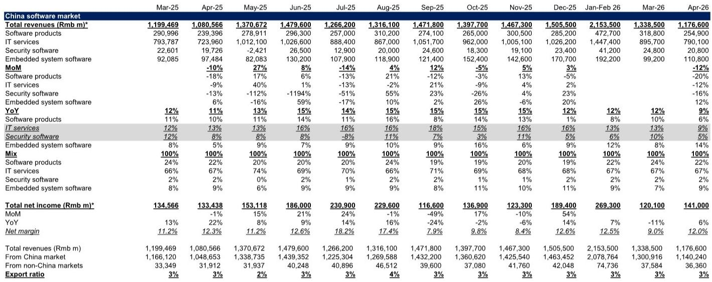
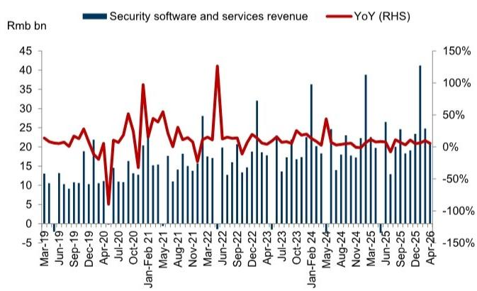
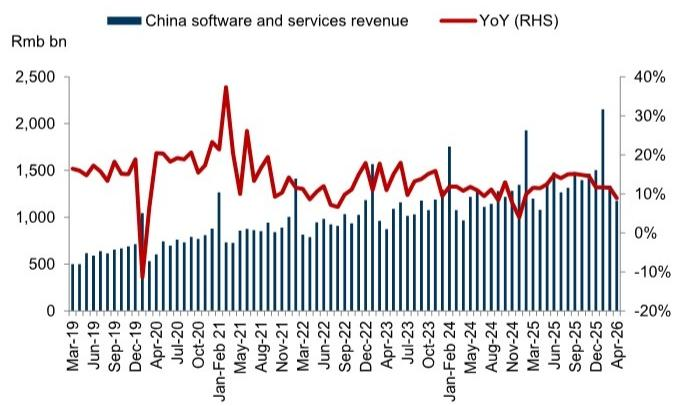

# 中国软件行业4月增速放缓至8.9%，但利润率改善揭示了一个被低估的结构性信号

4月中国软件行业收入同比增长8.9%，较3月的11.6%明显回落。这个数字本身并不意外——季节性波动、PMI走弱、AI基础设施投入对传统软件预算的挤压，都是市场已经讨论过的因素。但这份最新研报真正值得关注的判断，不是增速放缓，而是**利润率的结构性改善和AI Agent商业化路径的加速，正在重塑中国软件行业的价值分配逻辑**。市场目前过度聚焦于总量增速的短期波动，而低估了行业内部“谁在赚钱、靠什么赚钱”的深层变化。

为什么现在这个判断重要？因为4月数据同时出现了两个看似矛盾的信号：收入增速下行，但净利率从3月的9.0%跃升至12.0%，创下近12个月来的相对高位。这不是简单的成本压缩可以解释的。结合研报对AI产品迭代、SMB PMI波动以及重点公司新品发布的跟踪，我们认为，中国软件行业正在经历从“规模驱动”向“效率驱动+AI变现”的换挡期。那些能够将AI能力转化为可定价产品、并优化客户支出结构的公司，正在获得超出行业平均的利润率溢价。

这份报告提供的核心新信号有三个：第一，IT服务仍是收入主力，但其内部结构正在向云计算和大数据倾斜；第二，AI Agent的落地场景从概念验证进入加速变现阶段，尤其是在知识留存和生产流程优化领域；第三，海外收入占比小幅提升至3.1%，虽然绝对值不大，但边际变化值得关注。

以下是我们基于报告数据的深度拆解。

## 1. 4月收入增速放缓并非系统性风险，而是结构性换挡的必经阵痛

4月8.9%的同比增速，叠加4M26累计10.9%的增长，确实低于1Q26的11.6%。但如果我们只看总量，会错过关键信息。从细分领域看，半导体设计软件以18.5%的增速领跑，云计算和大数据紧随其后增长12.3%，而传统软件产品和网络安全分别只有8.0%和7.5%的增长。这意味着，增速放缓的主要拖累来自传统品类，而非AI相关的高增长领域。

同时，4月收入环比下降12%，这符合季节性规律——3月通常有年初集中交付效应，4月回落是常态。真正需要警惕的不是环比波动，而是SMB PMI在5月进一步降至48.5，连续两个月低于荣枯线。这预示着中小企业客户的IT预算可能在未来1-2个季度继续承压。但值得注意的是，研报明确指出“客户软件支出仍偏弱，部分项目转向AI基础模型和定制化AI模型”。也就是说，预算并没有消失，而是在重新分配——从通用软件采购转向AI基础设施和定制化开发。这对传统软件厂商是压力，但对具备AI能力的平台型公司是机会。

所以，这个数据组合的含义是：总量增速放缓正在加速行业分化，那些无法提供AI价值增量的供应商将面临更大的收入压力，而能够承接AI预算的公司反而可能获得更高的客户粘性和定价权。

## 2. 利润率改善的驱动因素比表面数字更值得深挖

4月净利率12.0%，不仅远高于3月的9.0%，也高于4M26的累计均值11.4%。这个改善并非一次性事件。回顾过去12个月的数据，净利率在2025年6月曾低至8%左右，此后呈现震荡上行趋势。2026年1-2月累计净利率达到12.5%，3月回落至9.0%后，4月又迅速反弹。

这种波动背后的结构性因素是什么？我们认为至少有三个值得关注的解释，但报告并未完全展开：

第一，收入结构变化。IT服务占比稳定在67%，但其内部子项——云计算和大数据的增速（12.3%）显著高于整体IT服务（11.9%）。云服务的边际利润率通常高于传统系统集成，这种结构微调可能对整体利润率产生积极影响。

第二，AI产品的商业化落地开始体现为利润贡献。报告提到，AI Agent正在加速变现，应用场景包括“将资深员工的隐性知识留在企业内部”以及“以更高效率分散生产基地”。这些场景的特点是高附加值、定制化，因此定价能力和利润率都优于标准化软件。

第三，成本端的优化。4月利润率提升是否来自一次性因素（如项目验收集中、坏账计提减少）还是持续性改善，报告没有给出明确判断。这一点需要后续月份的数据验证。

对于投资者而言，关键问题是：12%的净利率是可持续的，还是昙花一现？我们的初步判断是，随着AI产品收入占比的提升，行业整体利润率中枢有望从过去的9-10%区间上移至11-12%区间。但这个假设能否成立，取决于AI产品的复购率和客户生命周期价值能否达到预期。

## 3. AI Agent正在从概念验证进入加速变现，但路径分化比预期更快

这是报告中最具前瞻性的部分。研报在“Private Tech Tour”报告中强调，AI Agent的变现正在加速，且应用场景已经从简单的聊天助手扩展到企业核心知识管理和生产流程优化。具体来说，两个场景值得深入讨论：

第一个场景是“知识留存”。很多制造型企业面临资深员工退休或离职导致的技术诀窍流失问题。AI Agent可以通过记录、结构化、检索这些隐性知识，实现“人走知识留”。这不是简单的文档管理，而是将经验转化为可调用的数字资产。这个场景的付费意愿很强，因为解决的是企业最核心的“人才风险”。

第二个场景是“生产站点多样化”。企业将AI Agent部署到多个生产基地，实现标准化操作和远程管理，从而降低对单一工厂或单一管理者的依赖。这本质上是用AI替代部分现场管理职能，直接提升运营效率。

报告提到，美图将在6月17日举办年度产品发布会，聚焦AI Agent和生成式AI产品。广联达也发布了PMLead、PMSmart等AI产品，强调平台化战略以更好地整合数据。这些动作表明，头部公司正在将AI从“功能插件”升级为“平台核心”。

但这里有一个尚未回答的关键问题：AI Agent的变现模式是项目制还是订阅制？如果是项目制，收入确认周期短但利润率波动大；如果是订阅制，前期获客成本高但长期复利效应强。从目前的公开信息看，两种模式并存，但市场尚未对哪种模式占主导形成共识。这决定了相关公司的估值逻辑——是PE估值还是PS估值。

## 4. 报告尚未完全回答的关键问题：AI产品对传统软件预算的替代效应到底有多强

研报提到“客户软件支出仍偏弱，部分项目转向AI基础模型和定制化AI模型”。这句话隐含了一个重要的二阶效应：AI投入正在挤压传统软件预算。但替代效应的大小、持续时间、以及对不同细分行业的影响，报告没有给出量化分析。

我们认为，这是当前最值得跟踪的变量。如果替代效应是短期的（比如6-12个月），那么传统软件厂商只需要熬过这段过渡期，AI带来的增量需求最终会弥补缺口。但如果替代效应是结构性的（比如企业永久性地将20-30%的IT预算从传统软件转向AI），那么很多传统软件公司的增长逻辑需要重新评估。

另一个未解问题是：AI Agent的定制化程度很高，这是否意味着软件行业的规模效应会下降？传统软件的高利润率建立在“一次开发、多次销售”的边际成本递减模型上。如果AI Agent需要大量定制化开发和持续维护，那么单位经济模型可能更接近IT服务而非软件产品。这将直接影响行业的长期利润率天花板。

## 5. 给决策者的观察框架：四个关键指标跟踪行业拐点

基于这份报告的数据和分析，我们建议关注以下四个指标，以判断中国软件行业是否正在进入新的增长周期：

第一，AI产品收入占比的季度变化。目前行业层面没有公开披露这个数据，但可以通过头部公司的财报和产品发布会信息进行推断。当AI收入占比超过15-20%时，可能触发估值体系的重估。

第二，SMB PMI与软件支出的相关性是否在减弱。传统上，PMI是软件支出的领先指标。但如果AI投入成为企业刚需，即使PMI走弱，AI相关支出也可能保持韧性。这将改变行业的周期属性。

第三，净利率的稳定性。4月12%的净利率能否在5月和6月维持，是判断利润率改善是否可持续的关键。如果后续月份净利率回落至10%以下，则说明4月的改善是异常值而非趋势。

第四，海外收入占比的边际变化。目前海外收入占比仅3.1%，但边际提升趋势值得关注。如果中国软件公司能够在AI Agent领域形成差异化竞争力，海外市场可能成为新的增长极。

---

以上分析基于某外资投行2026年4月中国软件行业月度报告。报告还包含更多细分领域的数据拆解、重点公司的产品路线图、以及AI Agent变现的详细案例。例如，半导体设计软件18.5%的增速背后有哪些具体驱动因素？网络安全收入增速持续低迷的原因是什么？AI Agent在不同行业的落地节奏有何差异？这些问题的答案都在完整报告中。

如果您对这些未解问题感兴趣，欢迎来星球微信群里继续讨论。我们会定期组织对报告关键图表的深度解读，并邀请行业专家分享一线观察。

Personal reading notes and learning share only. Not investment advice.

