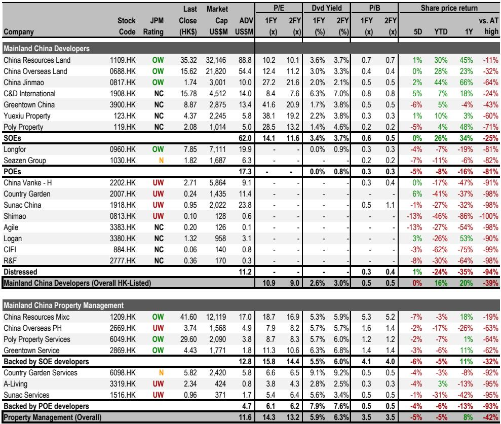
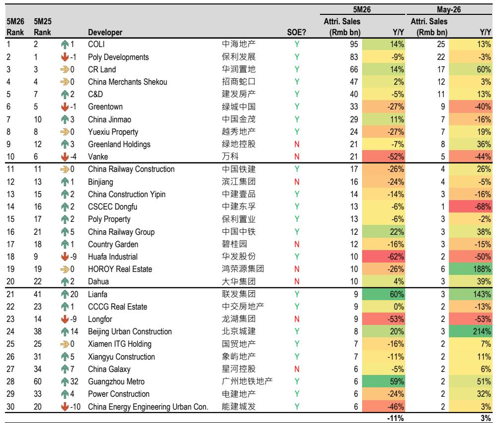
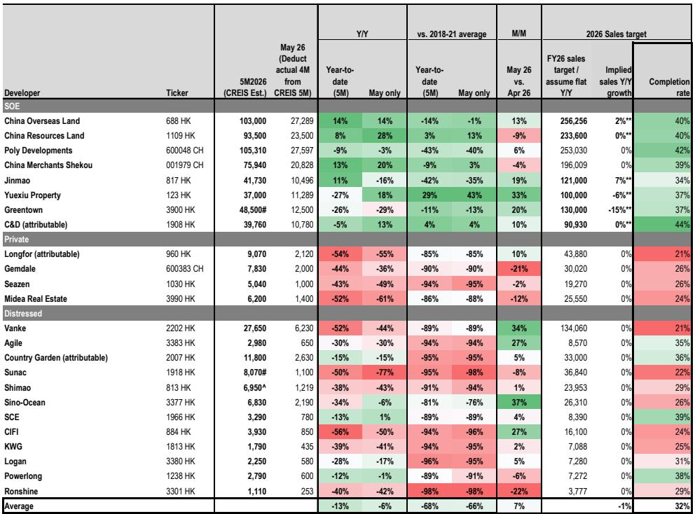

# China Property's Great Divergence: Why the Market Is Stabilizing But Most Developers Are Still Falling Behind

The headline data from China's property sector in May 2026 tells a story of stabilization. The top 100 developers posted a year-over-year sales decline of just 4%, the mildest drop in over a year and broadly in line with April's 5% contraction. Month-over-month, sales rose 11%, driven by typical seasonal strength. A casual observer might conclude the worst is over. That would be a dangerous misreading.

The real story is not about the aggregate. It is about a structural divergence that is reshaping the competitive landscape of Chinese real estate. While the market as a whole hovers at roughly 29% of its 2018-2021 average sales volume, a small cluster of state-owned enterprise (SOE) developers is operating in a completely different reality. In May, SOE developers collectively grew sales 6% year-over-year. Their private-sector and distressed counterparts saw sales fall 50% and 30%, respectively. When measured against the pre-crisis four-year average, the gap is even starker: SOE sales are only 3% below that baseline, while private and distressed developers remain approximately 90% below it.

This is not a cyclical recovery. It is a structural reallocation of market share, capital, and customer trust toward a narrow group of developers with state backing, disciplined balance sheets, and proven execution. For investors, the question is no longer "when will the property market recover?" but rather "which developers will survive to capture the eventual recovery, and at what valuation?"

The May data from a major global investment bank's research report confirms that the market has found a floor, but that floor is not flat. It is tilted steeply in favor of a select few.

## The Urban Renewal Plan Is a Policy Signal, Not a Demand Catalyst

On May 28, the State Council released its 15th five-year plan for urban renewal, and the sector rallied 4% on the day despite no other clear catalyst. Some market participants interpreted this as a new stimulus for housing demand. That interpretation requires careful scrutiny.

The plan targets doubling dilapidated urban housing renovations from 250,000 units under the 14th five-year plan to 500,000 units, alongside renovating 4,000 urban villages. It also allows local governments to issue special bonds to fund these projects. On the surface, this looks like a meaningful expansion of government-led redevelopment.

However, the critical missing piece is cash compensation. In previous cycles, urban village renovation programs that offered cash to relocated residents created a direct pipeline of demand for new residential units. The current plan does not mention cash compensation. Without that mechanism, the impact on primary residential sales is likely to be limited. The policy's stated goal is improving living standards, not stimulating the housing market.

This distinction matters because it reveals something about the government's strategic posture. Beijing is not trying to re-inflate the property bubble. It is trying to manage a controlled descent, ensuring that housing supply gradually adjusts to demographic reality while preventing a disorderly collapse that would threaten financial stability. The urban renewal plan fits that framework: it supports construction activity and local government finances, but it does not create the kind of demand shock that would lift all developers equally.

The market's 4% rally on the news may therefore reflect a hope for more aggressive stimulus rather than a rational assessment of the plan's actual impact. Investors should be careful not to extrapolate policy signals into broad-based demand recovery.

## The SOE Advantage Is No Longer Cyclical; It Is Structural

The most important insight from the May sales data is the persistent and widening gap between SOE developers and everyone else. SOE sales grew 6% year-over-year in May, marking the second consecutive month of positive growth. Private-sector developers saw sales fall 50%, and distressed developers fell 30%.

When measured against the 2018-2021 average, SOE developers have nearly recovered to their pre-crisis baseline, at just 3% below. Private and distressed developers remain approximately 90% below. This is not a temporary divergence that will close as the market normalizes. It reflects a fundamental shift in how the property market operates.

Several structural factors drive this. First, access to financing. SOE developers can borrow at significantly lower costs and with greater certainty than their private counterparts. In a market where pre-sales have collapsed and working capital is scarce, the ability to fund construction is a decisive competitive advantage. Second, customer confidence. Homebuyers in China have become acutely aware of developer credit risk. Purchasing a pre-sale unit from a private developer carries the risk of delayed delivery or non-completion. SOE developers, backed by local or central government, offer a de facto guarantee that the project will be completed. Third, land acquisition. As weaker developers retreat, SOEs are acquiring land at attractive prices in prime locations, further strengthening their competitive position for future sales cycles.

The data supports this narrative. Among the top 30 developers by year-to-date sales, the clear outperformers are all SOEs. China Overseas Land & Investment (COLI) posted 14% year-to-date growth and 14% growth in May alone. CR Land showed 8% year-to-date and an impressive 28% in May. China Jinmao, despite a 16% decline in May due to fewer new launches, has maintained 11% year-to-date growth. China Merchants Shekou posted 2% year-to-date and 20% in May.

These developers are not just surviving. They are gaining market share at an accelerating rate. The question for investors is whether this trend has been fully priced in.

## The Monthly Sales Pattern Reveals a Market That Has Bottomed But Not Recovered

Looking at the monthly sales data in Table 2, a clear pattern emerges. The market has stabilized at a level roughly 70% below the 2018-2021 average, but it is not declining further. Month-over-month movements are largely explained by seasonality. May is typically a stronger month than April, and the 11% sequential increase is consistent with historical patterns.

June is historically the strongest month of the year, as developers push to meet half-year targets. The report forecasts that June will see positive month-over-month growth and broadly flat year-over-year performance. This suggests the market is in a holding pattern: not deteriorating, but not recovering either.

The key risk is that this stabilization is fragile. The primary market (new home sales) remains weak, while recent green shoots in volume and price have been more evident in the secondary (resale) market. This divergence is important. A healthy secondary market can eventually support primary market recovery by providing homeowners with liquidity to trade up. But if secondary market activity is driven by distressed selling rather than genuine demand, it could signal further weakness ahead.

For now, the data supports a cautious interpretation: the market has found a floor, but there is no visible catalyst for a meaningful recovery. Developers that can maintain positive sales momentum in this environment are demonstrating genuine competitive strength, not simply riding a rising tide.

## A Decision Framework for Property Investors: Three Questions to Ask

Given the structural divergence in the market, investors need a clear framework for evaluating property developers. Based on the patterns in the data, three questions are essential.

First, can the developer access low-cost financing? This is the single most important determinant of survival and growth in the current environment. Developers that rely on pre-sales to fund construction are caught in a vicious cycle: weak sales force them to cut prices, which further erodes customer confidence and sales. Developers with access to bank credit or government funding can maintain construction schedules, preserve pricing power, and invest in new land. The data shows that all top performers are SOEs, which have this access. Private developers that lack it are at a structural disadvantage that no cyclical improvement can fully remedy.

Second, is the developer gaining or losing market share? In a shrinking market, market share gains are the most reliable indicator of competitive strength. The year-to-date data shows that only four developers have positive sales growth: COLI (14%), CMSK (13%), Jinmao (11%), and CR Land (8%). All are SOEs. Developers with negative year-to-date growth, even if they are SOEs, warrant scrutiny. Greentown China, for example, has seen year-to-date sales fall 27%, suggesting that SOE status alone is not sufficient.

Third, what is the developer's land bank quality and new launch pipeline? Jinmao's May performance illustrates this point. Its sales fell 16% year-over-year, but this was almost entirely due to having only one new launch in May 2026 versus six in May 2025. The underlying sales momentum, as reflected in year-to-date growth of 11%, remains strong. Investors need to distinguish between temporary launch timing effects and genuine demand weakness. A developer with a high-quality land bank and a disciplined launch schedule is fundamentally different from one that is struggling to sell existing inventory.

These three questions form a simple but powerful screen. Apply them to any developer, and the data will tell you whether the company is building a durable competitive position or simply surviving month to month.

## What the Report Does Not Fully Answer: The Unresolved Questions

The report provides a detailed snapshot of sales performance and a clear view of the SOE-private divergence. However, it leaves several important questions unanswered.

First, what is the trajectory of land prices and margins? The report focuses on sales volume, not profitability. As SOE developers gain market share, are they also maintaining or improving margins? Or are they competing aggressively on price, sacrificing profitability for volume? The answer has major implications for valuation. If market share gains come at the expense of margins, the stock price reaction could be muted even as sales grow.

Second, how sustainable is the secondary market recovery? The report notes that green shoots in volume and price are more evident in the secondary market, but it does not analyze the composition of that activity. Is it driven by genuine end-user demand, or by distressed sales from leveraged homeowners? The answer determines whether secondary market strength is a leading indicator of primary market recovery or a warning sign of further weakness.

Third, what happens when the government's policy support eventually scales down? The current environment is heavily influenced by government-directed lending to SOE developers and local government land sales. If policy priorities shift, the competitive dynamics could change rapidly. Investors need to assess which developers would be most vulnerable to a withdrawal of policy support.

These are not gaps in the report's analysis. They are the natural limits of a data-driven snapshot. The report tells us what is happening now with high precision. The unanswered questions are precisely the ones that require deeper analysis and forward-looking judgment.

## Why This Moment Demands Active Stock Selection, Not Passive Sector Exposure

The property sector has been a value trap for years. Investors who bought the dip in 2022 or 2023 hoping for a broad recovery have been consistently disappointed. The May 2026 data suggests that this pattern will continue, but with an important twist: a narrow group of developers is genuinely outperforming.

The sector's aggregate performance masks the divergence. When the top 100 developers show a 4% year-over-year decline, but SOE developers show 6% growth and private developers show 50% declines, the average is meaningless. An index fund or ETF that tracks the sector will be dragged down by the underperformers, even as the winners deliver strong relative returns.

This is a market that demands active, fundamental analysis. The decision framework outlined above provides a starting point, but it is not a substitute for deep due diligence. Investors need to understand each developer's land bank, cost structure, financing arrangements, and management quality. They need to stress-test assumptions about sales momentum, margin trends, and policy direction.

The full report includes detailed charts and tables that allow investors to conduct this analysis. It shows the sales leaderboard, the year-over-year trends by developer type, and the monthly seasonality patterns. These data points are the raw material for investment decisions, but they require interpretation.

For serious investors who want to go beyond the headlines and build a conviction on which developers will thrive in the new equilibrium, the original research report provides the necessary foundation. The charts and data tables contain nuances that cannot be fully captured in a summary. The relative performance of individual developers, the month-by-month trajectory, and the comparison to historical baselines all tell a richer story than any single data point.

Join the community to read the full report and review the original charts. The analysis will equip you with the tools to make informed decisions in a market where the difference between winners and losers is widening by the month.

*This article is for learning and discussion only and does not constitute investment advice.*

Personal reading notes and learning share only. Not investment advice.

