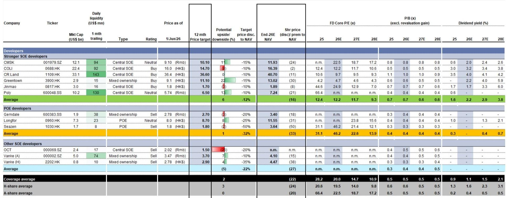
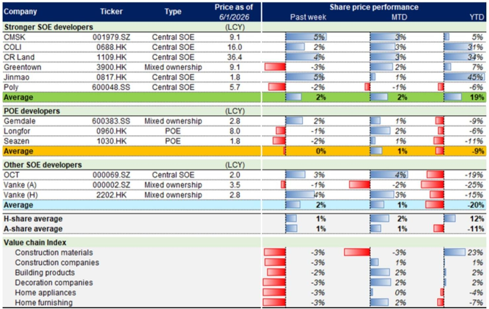
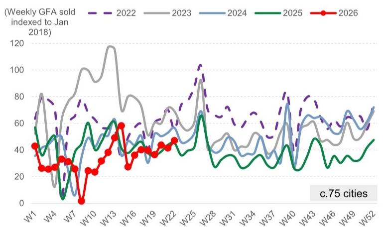

# 市场真正低估的不是需求，而是供给侧的再定价

过去几周，中国房地产市场的讨论焦点大多集中在需求端：政策还能不能更松？居民购房意愿有没有真正回暖？二手房成交量是否可持续？

这些问题的答案，在最新一期某外资投行的中国地产周报中有了初步的、但被市场普遍忽略的指向：**成交量在恢复，但更关键的结构性变化发生在供给侧——库存正在被系统性消化，而市场定价尚未完全反映这一过程。**

这份周报覆盖了截至第22周的数据。新房成交面积周环比上升13%，同比转正至+4%，创下清明假期以来的周度新高。二手房成交虽周环比小幅回落2%，但同比仍高达+26%。更重要的是，库存月数从4月均值29.3个月下降至27.6个月。这不是一个简单的季节性波动。它是一个信号：供给侧的出清正在加速，而市场的定价逻辑仍停留在“需求疲软”的旧框架里。

本文基于这份报告的核心数据与判断，提炼出五个值得产业决策者与投资者关注的层级。它们共同指向一个结论：**当前资产定价的折价，更多反映的是对流动性的恐慌，而非对资产本身价值的理性评估。**

## 1. 新房市场的回升并非脉冲，而是一次有库存基础的修复

第22周新房成交面积环比增长13%，同比转正至+4%，将年初至今的累计同比跌幅收窄至-14%。与2024年和2023年同期相比，这一成交量分别低15%和47%。单看同比数据，似乎并不惊艳。但关键在于趋势的连续性。

报告显示，5月新房成交面积中位数环比上升5%，同比持平。这意味着4月下旬以来的政策放松——包括广州在4月底的全面松绑、5月中旬南沙区的试点——正在转化为实际成交，而非停留在看房阶段。看房活动量周环比持平，说明需求并未出现“脉冲式释放后迅速冷却”的典型特征，而是在稳步释放。

更值得关注的是库存的消化速度。第22周库存总量周环比下降0.5%，较2025年底已下降4.4%。库存月数降至27.6个月，低于4月均值29.3个月。这个数字仍然偏高，但下降的趋势正在形成。如果这一趋势持续，开发商面临的去化压力将从“生死存亡”级别降至“可以承受”级别。

对行业的含义很清晰：**新房市场最危险的时刻——库存高企、成交冻结、现金流断裂——正在成为过去。但市场定价尚未完全计入这一变化。**

## 2. 二手房市场的“量升价稳”正在重塑交易结构，但卖家预期开始分化

二手房市场是这份报告中最值得细读的部分。第22周成交量周环比下降2%，但同比仍高达+26%。年初至今累计成交量同比持平，但较2024年和2023年同期分别高出23%和7%。这说明二手房市场已经完成了从“深度调整”到“新常态”的切换。

报告中的一个关键信号来自两个指数的分化：CSI（经纪人价格预期指数）周环比上升0.2个百分点，同比上升3.7个百分点，仍处于50以上的乐观区间；而CAI（卖家报价指数）周环比下降0.5个百分点，同比下降3.6个百分点，已跌破20。

两者的背离意味着：经纪人仍然看好价格，但卖家开始松口。这通常是市场从“卖方定价”转向“买方定价”的过渡阶段。如果卖家降价意愿增强，成交量有望进一步放大。但这也意味着，价格底部的确认需要更多时间——不是所有人都能等到反弹。

对于投资者而言，**二手房市场的“量先行、价滞后”格局，为判断行业底部提供了更精细的观察窗口。** 当CAI停止下行、CSI维持在50以上，价格的拐点才会真正到来。

## 3. 广州的“全市回购”是一次政策实验，其效果将决定其他城市的跟进速度

报告详细分析了广州的最新政策：在全市范围内推出二手房回购计划，目标为市中心总价低于300万元、面积小于70平方米的房源，收购后转为社会保障性住房和人才住房。同时，广州优化了商业贷款转公积金贷款的通道，将最高贷款成数从70%提升至80%，并扩大了借款人资格范围，包括多套房持有者、此前使用过公积金贷款的借款人，以及大湾区或广州都市圈内的公积金缴存者。

这不是一个孤立的城市行动。报告将其与上海模式对标，暗示这可能是全国性“以旧换新”政策的试点。广州选择的是“回购”而非“补贴”，意味着政府直接参与供给侧出清。如果这一模式在1-2个月内被验证有效——即回购房源能够顺利转化为保障房、且不冲击新房市场——那么其他一二线城市很可能会跟进。

这里的核心问题是：**回购计划的资金从哪里来？** 报告没有展开，但基于公开信息，可能的资金来源包括地方政府专项债、政策性银行贷款以及公积金结余资金。如果资金问题能够解决，这一政策将从根本上改变“二手房卖不掉、新房买不起”的市场僵局。

## 4. 开发商的估值折价已经超过历史底部，但市场仍在用旧框架定价

报告给出了一个令人深思的估值对比：覆盖的离岸开发商目前交易价格较2026年底预期净资产价值（NAV）折价24%，对应0.6倍2026年预期市净率（P/B）。而在2008年下半年、2011年下半年和2014年上半年的历史底部，折价幅度分别为39%、73%和58%，对应P/B分别为0.7倍、0.9倍和0.9倍。

在岸开发商的折价同样显著：较2026年底预期NAV折价20%，对应0.5倍2026年预期P/B，而历史底部的折价分别为67%、64%和61%，对应P/B分别为1.6倍、1.5倍和1.2倍。

**当前的P/B估值已经低于2008年金融危机时的水平，但折价幅度却小于历史底部。** 这意味着市场定价隐含的假设是：资产价值还将继续缩水。但如果供给侧出清加速、库存消化持续，这种假设可能过于悲观。

报告特别指出，覆盖的强信用国企开发商在第22周股价平均上涨2%，其中中国金茂和招商蛇口分别上涨5%。而民营开发商股价持平，其他国企开发商上涨2%。分化依然明显，但强信用国企正在获得市场的重新定价。

## 5. 报告尚未完全回答的关键问题：竣工与新开工的剪刀差意味着什么？

报告通过GSPC（GS地产完工追踪器）给出了一组前瞻性数据：5月竣工面积预计同比下降高十几个百分点，全年预计同比下降1%。新开工面积预计5月同比下降低二十几个百分点。这两个数字都意味着供给侧的进一步收缩。

但报告没有完全回答的问题是：**竣工与新开工之间的剪刀差，是否意味着行业正在从一个“增量扩张”阶段转向“存量运营”阶段？** 如果是，那么开发商的商业模式需要根本性重构——从“拿地-开发-销售”转向“运营-服务-资产管理”。这种转型对估值体系的影响，目前的市场定价几乎没有反映。

此外，报告引用的贝壳找房数据显示，4-5月新房和二手房合计交易额同比增长9%，但新房和二手房的增速分化巨大：新房同比-6%，二手房同比+16%。这种分化的背后，是居民对期房交付风险的持续担忧，还是政策引导下的结构性转移？同样需要更多数据验证。

---

以上五个层级，从市场成交、价格信号、政策实验、估值对比到行业转型，共同构成了一个比市场普遍认知更为积极的图景。但报告中的数据也提示了风险：库存月数仍处于高位，卖家预期仍在走弱，竣工和新开工的持续下滑意味着行业仍在“缩表”。

这些未解问题——回购资金的可持续性、估值折价的合理修复路径、行业商业模式的转型时间表——正是我们希望在后续讨论中深入拆解的方向。如果你对这份报告的完整图表、细分城市数据或开发商的NAV拆解感兴趣，欢迎来星球微信群继续讨论。我们会基于原始报告，每周跟踪这些关键假设的验证或证伪过程。

Personal reading notes and learning share only. Not investment advice.

