June 1, 2026 12:59 AM GMT

# Investor Presentation | Asia Pacific

# China Consumer: Where is consumption trending now?

AlphaWise α

MS ASIA LIMITED+

# Lillian Lou

Equity Analyst

Lillian.Lou@morganstanley.com +852 2848-6502

# Dustin Wei

Equity Analyst

Dustin.Wei@morganstanley.com +852 2239-7823

# Hildy Ling

Equity Analyst

Hildy.Ling@morganstanley.com +852 2239-7834

# Jenny Yu

Research Associate

Jenny.Yu1@morganstanley.com +852 3963-1925

MS TAIWAN LIMITED+

# Terence Cheng

Equity Analyst

Terence.Cheng@morganstanley.com +886 2 2730-2873

# Jenny Ting

Research Associate

Jenny.Ting@morganstanley.com +886 2 2730-2995

MS ASIA LIMITED+

# Carlos Liu, CFA

Research Associate

Carlos.Liu@morganstanley.com +852 2848-5206

# Asia Summer School 2026

MS does and seeks to do business with companies covered in MS. As a result, investors should be aware that the firm may have a conflict of interest that could affect the objectivity of MS. Investors should consider MS as only a single factor in making their investment decision.

# For analyst certification and other important disclosures, refer to the Disclosure Section, located at the end of this report.

+= Analysts employed by non-U.S. affiliates are not registered with FINRA, may not be associated persons of the member and may not be subject to FINRA restrictions on communications with a subject company, public appearances and trading securities held by a research analyst account.

text_image

India Investment Forum 2026

# CHINA/HONG KONG CONSUMER

Asia Pacific

Industry View

In-Line

MS

# Consumption and Macro Drivers

# MS

Key Macro Data Tracker 

<table><tr><td></td><td>Jan-25</td><td>Feb-25</td><td>Mar-25</td><td>Apr-25</td><td>May-25</td><td>Jun-25</td><td>Jul-25</td><td>Aug-25</td><td>Sep-25</td><td>Oct-25</td><td>Nov-25</td><td>Dec-25</td><td>Jan-26</td><td>Feb-26</td><td>Mar-26</td><td>Apr-26</td></tr><tr><td>Retail sales growth</td><td>4.0%</td><td>4.0%</td><td>5.9%</td><td>5.1%</td><td>6.4%</td><td>4.8%</td><td>3.7%</td><td>3.4%</td><td>3.0%</td><td>2.9%</td><td>1.3%</td><td>0.9%</td><td>2.8%</td><td>2.8%</td><td>1.7%</td><td>0.2%</td></tr><tr><td>GDP yoy growth</td><td></td><td>5.4%</td><td></td><td></td><td>5.2%</td><td></td><td></td><td>4.8%</td><td></td><td></td><td>4.5%</td><td></td><td></td><td>5.0%</td><td></td><td></td></tr><tr><td>CPI yoy growth</td><td>0.5%</td><td>-0.7%</td><td>-0.1%</td><td>-0.1%</td><td>-0.1%</td><td>-0.1%</td><td>0.0%</td><td>-0.4%</td><td>-0.3%</td><td>0.2%</td><td>0.7%</td><td>0.8%</td><td>0.2%</td><td>1.3%</td><td>1.0%</td><td>1.2%</td></tr><tr><td>PPI yoy growth</td><td>-2.3%</td><td>-2.2%</td><td>-2.5%</td><td>-2.7%</td><td>-3.3%</td><td>-3.6%</td><td>-3.6%</td><td>-2.9%</td><td>-2.3%</td><td>-2.1%</td><td>-2.2%</td><td>-1.9%</td><td>-1.4%</td><td>-0.9%</td><td>0.5%</td><td>2.8%</td></tr><tr><td>Disposable Income (Urban) yoy growth</td><td></td><td>4.9%</td><td></td><td></td><td>4.4%</td><td></td><td></td><td>3.9%</td><td></td><td></td><td>3.9%</td><td></td><td></td><td>4.2%</td><td></td><td></td></tr><tr><td>Monthly new-econ avg salary yoy growth</td><td>-6%</td><td>-11%</td><td>-4%</td><td>-2%</td><td>-3%</td><td>-4%</td><td>-3%</td><td>6%</td><td>3%</td><td>8%</td><td>6%</td><td>8%</td><td>6%</td><td>13%</td><td>3%</td><td></td></tr><tr><td>Household saving rate</td><td></td><td>33%</td><td></td><td></td><td>33%</td><td></td><td></td><td>33%</td><td></td><td></td><td>34%</td><td></td><td></td><td>34%</td><td></td><td></td></tr><tr><td>PMI Employment - manufacturing</td><td>48.1</td><td>48.6</td><td>48.2</td><td>47.9</td><td>48.1</td><td>47.9</td><td>48.0</td><td>47.9</td><td>48.5</td><td>48.3</td><td>48.4</td><td>48.2</td><td>48.1</td><td>48.0</td><td>48.6</td><td>48.8</td></tr><tr><td>PMI Employment - non manufacturing</td><td>46.7</td><td>46.5</td><td>45.8</td><td>45.5</td><td>45.5</td><td>45.5</td><td>45.6</td><td>45.6</td><td>45.0</td><td>45.2</td><td>45.3</td><td>46.1</td><td>46.1</td><td>46.0</td><td>45.2</td><td>45.5</td></tr><tr><td>Youth unemployment rate</td><td>16%</td><td>17%</td><td>17%</td><td>16%</td><td>15%</td><td>15%</td><td>18%</td><td>19%</td><td>18%</td><td>17%</td><td>17%</td><td>17%</td><td>16%</td><td>16%</td><td>17%</td><td>16%</td></tr><tr><td>Second home price yoy growth</td><td>-12%</td><td>-13%</td><td>-12%</td><td>-12%</td><td>-12%</td><td>-12%</td><td>-12%</td><td>-13%</td><td>-12%</td><td>-13%</td><td>-13%</td><td>-14%</td><td>-14%</td><td>-13%</td><td>-12%</td><td>-12%</td></tr></table>

Source: CEIC, NBS, MS

<table><tr><td colspan="5">Key macro and market drivers for consumption and stocks: we expect stabilization, yet a meaningful pull</td></tr><tr><td>Sequential change in the key factors</td><td>2024</td><td>2025</td><td>2026 Outlook</td><td>Remarks</td></tr><tr><td>Inflation/pricing</td><td>(-)</td><td>(-)</td><td>(=)</td><td>Our China Macro Economics team expects less deflation in 2026 and mild reflation in 2027. Overall pricing remains soft and mixed in underlying pricing trends with selective segments starting to see mild upward pricing revisions.</td></tr><tr><td>Wealth effect (household income, employment, property value, capital gain)</td><td>(-)</td><td>(-)</td><td>(=)</td><td>(=) Household income and employment: muted trends; (-) Property: another two year down cycle in 2026-27 with initial stabilization in 2H27; (=/+) Capital market gain: trends more positively for higher income group.</td></tr><tr><td>Policy direction on consumption</td><td>(-)</td><td>(=)</td><td>(=)</td><td>Focus on investment/infrastructure support; consumption support remains measured with similar or modestly smaller durable goods trade-in budget, likely service consumption support in 2H26 if job market weakens.</td></tr><tr><td>Consensus earnings</td><td>(-)</td><td>(-)</td><td>(=)</td><td>Overall earnings cut starts to ease; mixed direction of earnings changes on individual stock level.</td></tr><tr><td>Market sentiment/fund flows to consumer sector</td><td>(-)</td><td>(-)</td><td>(~)</td><td>Low holding position; sentiment remains fragile and is increasingly sensitive to catalysts, opt for upside surprise.</td></tr></table>

# MS

# Key Macro Data Tracker

GDP and CPI   
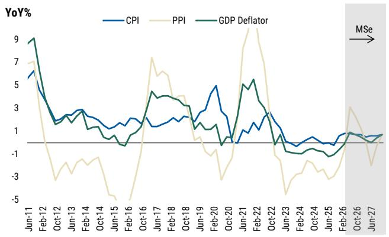

line

| Date    | CPI  | PPI  | GDP Deflator |
|---------|------|------|--------------|
| Jun-11  | 6.0  | 7.0  | 9.0          |
| Feb-12  | 3.0  | -3.0 | 2.0          |
| Oct-12  | 2.0  | -1.0 | 1.0          |
| Feb-13  | 2.5  | -1.5 | 1.5          |
| Oct-13  | 2.0  | -2.0 | 1.0          |
| Feb-14  | 2.5  | -1.0 | 1.5          |
| Oct-14  | 2.0  | -0.5 | 1.0          |
| Feb-15  | 1.5  | -5.0 | 0.5          |
| Oct-15  | 2.0  | -3.0 | 1.0          |
| Feb-16  | 2.5  | -4.0 | 1.5          |
| Oct-16  | 3.0  | -2.0 | 2.0          |
| Feb-17  | 3.5  | -1.0 | 3.0          |
| Oct-17  | 4.0  | 7.0  | 4.0          |
| Feb-18  | 3.5  | 6.0  | 3.5          |
| Oct-18  | 3.0  | 5.0  | 3.0          |
| Feb-19  | 4.0  | 4.0  | 2.0          |
| Oct-19  | 3.5  | 3.0  | 1.5          |
| Feb-20  | 4.5  | -3.0 | 1.0          |
| Oct-20  | 3.0  | -4.0 | 0.5          |
| Feb-21  | 2.5  | -2.0 | -1.0         |
| Oct-21  | 3.0  | -1.0 | -2.0         |
| Feb-22  | 4.0  | -3.0 | -3.0         |
| Oct-22  | 3.5  | -4.0 | -4.0         |
| Feb-23  | 3.0  | -5.0 | -5.0         |
| Oct-23  | 2.5  | -3.0 | -4.0         |
| Feb-24  | 2.0  | -2.0 | -3.0         |
| Oct-24  | 1.5  | -1.0 | -2.0         |
| Feb-25  | 1.0  | -3.0 | -1.0         |
| Oct-25  | 0.5  | -4.0 | -2.0         |
| Feb-26  | 1.0  | -2.0 | -3.0         |
| Oct-26  | 1.5  | -1.0 | -4.0         |
| Jun-27  | 1.0  | -3.0 | -5.0         |

China – new economy: average monthly entry-level salaries   
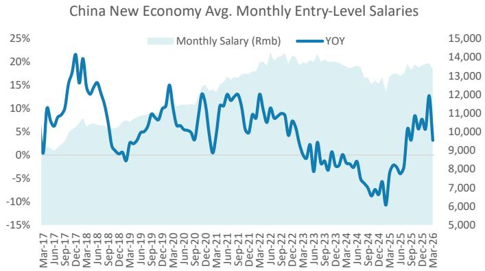

line

| Date    | Monthly Salary (Rmb) | YOY     |
|---------|----------------------|---------|
| Mar-17  | ~5%                  | ~5%     |
| Jun-17  | ~10%                 | ~10%    |
| Sep-17  | ~20%                 | ~20%    |
| Dec-17  | ~15%                 | ~15%    |
| Mar-18  | ~10%                 | ~10%    |
| Jun-18  | ~5%                  | ~5%     |
| Sep-18  | ~0%                  | ~0%     |
| Dec-18  | ~5%                  | ~5%     |
| Mar-19  | ~10%                 | ~10%    |
| Jun-19  | ~15%                 | ~15%    |
| Sep-19  | ~10%                 | ~10%    |
| Dec-19  | ~5%                  | ~5%     |
| Mar-20  | ~0%                  | ~0%     |
| Jun-20  | ~5%                  | ~5%     |
| Sep-20  | ~10%                 | ~10%    |
| Dec-20  | ~5%                  | ~5%     |
| Mar-21  | ~0%                  | ~0%     |
| Jun-21  | ~5%                  | ~5%     |
| Sep-21  | ~10%                 | ~10%    |
| Dec-21  | ~5%                  | ~5%     |
| Mar-22  | ~0%                  | ~0%     |
| Jun-22  | ~5%                  | ~5%     |
| Sep-22  | ~10%                 | ~10%    |
| Dec-22  | ~5%                  | ~5%     |
| Mar-23  | ~0%                  | ~0%     |
| Jun-23  | ~5%                  | ~5%     |
| Sep-23  | ~10%                 | ~10%    |
| Dec-23  | ~5%                  | ~5%     |
| Mar-24  | ~0%                  | ~0%     |
| Jun-24  | ~-5%                 | ~-5%    |
| Sep-24  | ~-10%                | ~-10%   |
| Dec-24  | ~-5%                 | ~-5%    |
| Mar-25  | ~0%                  | ~0%     |
| Jun-25  | ~5%                  | ~5%     |
| Sep-25  | ~10%                 | ~10%    |
| Dec-25  | ~15%                 | ~15%    |
| Mar-26  | ~10%                 | ~10%    |

Wealth Effect from Capital Markets   
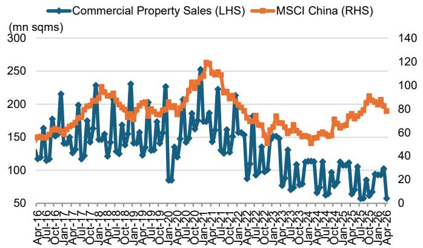

line

| Date     | Commercial Property Sales (LHS) (mn sqms) | MSCI China (RHS) |
|----------|-------------------------------------------|------------------|
| Apr-16   | ~150                                      | ~50              |
| Jul-17   | ~180                                      | ~60              |
| Oct-17   | ~200                                      | ~70              |
| Jan-18   | ~230                                      | ~90              |
| Apr-18   | ~220                                      | ~100             |
| Jul-18   | ~240                                      | ~110             |
| Oct-18   | ~230                                      | ~100             |
| Jan-19   | ~220                                      | ~90              |
| Apr-19   | ~210                                      | ~80              |
| Jul-19   | ~200                                      | ~70              |
| Oct-19   | ~190                                      | ~60              |
| Jan-20   | ~180                                      | ~50              |
| Apr-20   | ~170                                      | ~40              |
| Jul-20   | ~160                                      | ~30              |
| Oct-20   | ~150                                      | ~20              |
| Jan-21   | ~140                                      | ~10              |
| Apr-21   | ~130                                      | ~5               |
| Jul-21   | ~120                                      | ~0               |
| Oct-21   | ~110                                      | ~5               |
| Jan-22   | ~100                                      | ~10              |
| Apr-22   | ~90                                       | ~15              |
| Jul-22   | ~80                                       | ~20              |
| Oct-22   | ~70                                       | ~25              |
| Jan-23   | ~60                                       | ~30              |
| Apr-23   | ~50                                       | ~35              |
| Jul-23   | ~40                                       | ~40              |
| Oct-23   | ~30                                       | ~45              |
| Jan-24   | ~20                                       | ~50              |
| Apr-24   | ~10                                       | ~55              |
| Jul-24   | ~5                                        | ~60              |
| Oct-24   | ~0                                        | ~65              |
| Jan-25   | ~5                                        | ~70              |
| Apr-25   | ~10                                       | ~75              |
| Jul-25   | ~15                                       | ~80              |
| Oct-25   | ~20                                       | ~85              |
| Jan-26   | ~25                                       | ~90              |
| Apr-26   | ~30                                       | ~95              |

Youth unemployment rate   
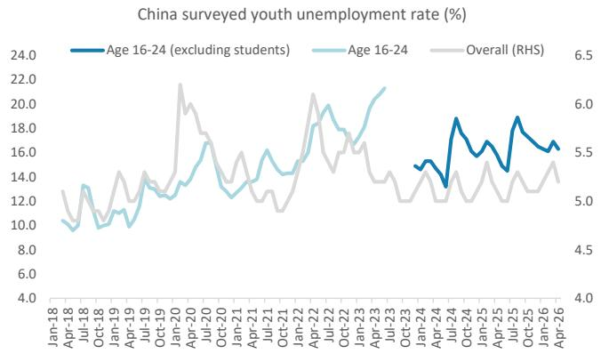

line

| Date    | Age 16-24 (excluding students) | Age 16-24 | Overall (RHS) |
|---------|----------------------------------|-----------|---------------|
| Jan-18  | 10.0                             | 10.0      | 5.0           |
| Apr-18  | 12.0                             | 13.0      | 5.5           |
| Jul-18  | 10.0                             | 10.0      | 5.0           |
| Oct-18  | 12.0                             | 12.0      | 5.5           |
| Jan-19  | 10.0                             | 10.0      | 5.0           |
| Apr-19  | 12.0                             | 12.0      | 5.5           |
| Jul-19  | 14.0                             | 14.0      | 5.0           |
| Oct-19  | 12.0                             | 12.0      | 5.5           |
| Jan-20  | 16.0                             | 16.0      | 6.0           |
| Apr-20  | 18.0                             | 18.0      | 5.5           |
| Jul-20  | 20.0                             | 20.0      | 5.0           |
| Oct-20  | 16.0                             | 16.0      | 5.5           |
| Jan-21  | 14.0                             | 14.0      | 5.0           |
| Apr-21  | 16.0                             | 16.0      | 5.5           |
| Jul-21  | 18.0                             | 18.0      | 5.0           |
| Oct-21  | 20.0                             | 20.0      | 5.5           |
| Jan-22  | 18.0                             | 18.0      | 5.0           |
| Apr-22  | 20.0                             | 20.0      | 5.5           |
| Jul-22  | 18.0                             | 18.0      | 5.0           |
| Oct-22  | 16.0                             | 16.0      | 5.5           |
| Jan-23  | 18.0                             | 18.0      | 5.0           |
| Apr-23  | 20.0                             | 20.0      | 5.5           |
| Jul-23  | 18.0                             | 18.0      | 5.0           |
| Oct-23  | 16.0                             | 16.0      | 5.5           |
| Jan-24  | 14.0                             | 14.0      | 5.0           |
| Apr-24  | 16.0                             | 16.0      | 5.5           |
| Jul-24  | 18.0                             | 18.0      | 5.0           |
| Oct-24  | 20.0                             | 20.0      | 5.5           |
| Jan-25  | 18.0                             | 18.0      | 5.0           |
| Apr-25  | 16.0                             | 16.0      | 5.5           |
| Jul-25  | 18.0                             | 18.0      | 5.0           |
| Oct-25  | 20.0                             | 20.0      | 5.5           |
| Jan-26  | 18.0                             | 18.0      | 5.0           |
| Apr-26  | 16.0                             | 16.0      | 5.5           |

Source: CEIC, Bloomberg, NBS, Wind, Factset, MS

# MS

# Retail Sales Trend

April 26 Retail Sales Trend 

<table><tr><td></td><td colspan="2">Reported YoY Basis</td><td colspan="2">Calculated CAGR vs. 2019</td></tr><tr><td>Categories</td><td>Apr 26</td><td>Mar 26</td><td>Apr 26</td><td>Mar 26</td></tr><tr><td>Overall Retail Sales</td><td>0.2%</td><td>1.7%</td><td>2.9%</td><td>4.0%</td></tr><tr><td>Overall Retail Sales - ex Autos</td><td>1.8%</td><td>3.2%</td><td>3.2%</td><td>4.1%</td></tr><tr><td>Restaurant &amp; Dining</td><td>2.2%</td><td>2.9%</td><td>3.8%</td><td>3.6%</td></tr><tr><td>Enterprises above a designated size</td><td>0.9%</td><td>2.0%</td><td>9.3%</td><td>9.9%</td></tr><tr><td>Retail Sales of Goods</td><td>-0.1%</td><td>1.5%</td><td>2.7%</td><td>4.0%</td></tr><tr><td>Enterprises above a designated size</td><td>-4.9%</td><td>1.2%</td><td>3.0%</td><td>4.9%</td></tr><tr><td>Apparel, Shoes and Textile</td><td>3.6%</td><td>7.0%</td><td>1.5%</td><td>2.6%</td></tr><tr><td>Gold &amp; Jewelry</td><td>-21.3%</td><td>11.7%</td><td>3.0%</td><td>7.3%</td></tr><tr><td>Cosmetics</td><td>4.7%</td><td>8.3%</td><td>6.5%</td><td>7.4%</td></tr><tr><td>Home Furnishing</td><td>-10.4%</td><td>-8.7%</td><td>-0.9%</td><td>-0.8%</td></tr><tr><td>F&amp;B (incl. Alcohol &amp; Tobacco)</td><td>5.4%</td><td>9.0%</td><td>8.4%</td><td>9.4%</td></tr><tr><td>Food, Grain and Oil</td><td>4.1%</td><td>9.5%</td><td>8.5%</td><td>9.6%</td></tr><tr><td>Soft Drinks</td><td>3.6%</td><td>8.2%</td><td>6.9%</td><td>7.7%</td></tr><tr><td>Alcohol &amp; Tobacco</td><td>11.7%</td><td>7.7%</td><td>8.9%</td><td>9.4%</td></tr><tr><td>HPC</td><td>3.5%</td><td>4.6%</td><td>5.8%</td><td>6.9%</td></tr><tr><td>Electronics &amp; Appliances</td><td>-15.1%</td><td>-5.0%</td><td>1.8%</td><td>1.9%</td></tr><tr><td>Sports and Entertainment Equipmen</td><td>-8.0%</td><td>-2.0%</td><td>NA</td><td>NA</td></tr><tr><td>Online Retail Sales</td><td>2.3%</td><td>5.8%</td><td>9.8%</td><td>10.8%</td></tr><tr><td>Commercial Goods</td><td>0.2%</td><td>2.5%</td><td>6.5%</td><td>6.7%</td></tr></table>

Retail Sales YoY Breakdown   
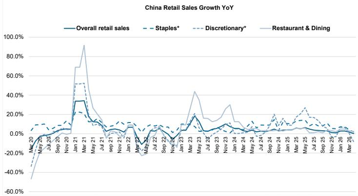

line

| Month   | Overall retail sales | Staples* | Discretionary* | Restaurant & Dining |
|---------|----------------------|----------|----------------|---------------------|
| Mar 20  | -40.0%               | -40.0%   | -40.0%         | -40.0%              |
| May 20  | 0.0%                 | 0.0%     | 0.0%           | 0.0%                |
| Jul 20  | 10.0%                | 10.0%    | 10.0%          | 10.0%               |
| Sep 20  | 15.0%                | 15.0%    | 15.0%          | 15.0%               |
| Nov 20  | 20.0%                | 20.0%    | 20.0%          | 20.0%               |
| Jan 21  | 35.0%                | 35.0%    | 35.0%          | 35.0%               |
| Mar 21  | 90.0%                | 90.0%    | 90.0%          | 90.0%               |
| May 21  | 15.0%                | 15.0%    | 15.0%          | 15.0%               |
| Jul 21  | 10.0%                | 10.0%    | 10.0%          | 10.0%               |
| Sep 21  | 5.0%                 | 5.0%     | 5.0%           | 5.0%                |
| Nov 21  | 10.0%                | 10.0%    | 10.0%          | 10.0%               |
| Jan 22  | -5.0%                | -5.0%    | -5.0%          | -5.0%               |
| Mar 22  | -15.0%               | -15.0%   | -15.0%         | -15.0%              |
| May 22  | -10.0%               | -10.0%   | -10.0%         | -10.0%              |
| Jul 22  | -5.0%                | -5.0%    | -5.0%          | -5.0%               |
| Sep 22  | 5.0%                 | 5.0%     | 5.0%           | 5.0%                |
| Nov 22  | 15.0%                | 15.0%    | 15.0%          | 15.0%               |
| Jan 23  | 25.0%                | 25.0%    | 25.0%          | 25.0%               |
| Mar 23  | 45.0%                | 45.0%    | 45.0%          | 45.0%               |
| May 23  | 25.0%                | 25.0%    | 25.0%          | 25.0%               |
| Jul 23  | 15.0%                | 15.0%    | 15.0%          | 15.0%               |
| Sep 23  | 35.0%                | 35.0%    | 35.0%          | 35.0%               |
| Nov 23  | 35.0%                | 35.0%    | 35.0%          | 35.0%               |
| Jan 24  | 35.0%                | 35.0%    | 35.0%          | 35.0%               |
| Mar 24  | 15.0%                | 15.0%    | 15.0%          | 15.0%               |
| May 24  | 15.0%                | 15.0%    | 15.0%          | 15.0%               |
| Jul 24  | 15.0%                | 15.0%    | 15.0%          | 15.0%               |
| Sep 24  | 25.0%                | 25.0%    | 25.0%          | 25.0%               |
| Nov 24  | 35.0%                | 35.0%    | 35.0%          | 35.0%               |
| Jan 25  | -15.0%               | -15.0%   | -15.0%         | -15.0%              |
| Mar 25  | -15.0%               | -15.0%   | -15.0%         | -15.0%              |
| May 25  | -15.0%               | -15.0%   | -15.0%         | -15.0%              |
| Jul 25  | -15.0%               | -15.0%   | -15.0%         | -15.0%              |
| Sep 25  | -15.0%               | -15.0%   | -15.0%         | -15.0%              |
| Nov 25  | -15.0%               | -15.0%   | -15.0%         | -15.0%              |
| Jan 26  | -15.0%               | -15.0%   | -15.0%         | -15.0%              |
| Mar 26* | -15.0%               | -15.0%   | -15.0%         | -15.0%              |

Source: NBS, MS. \* based on the sales of enterprises above a designated size

Retail Sales YoY Growth   
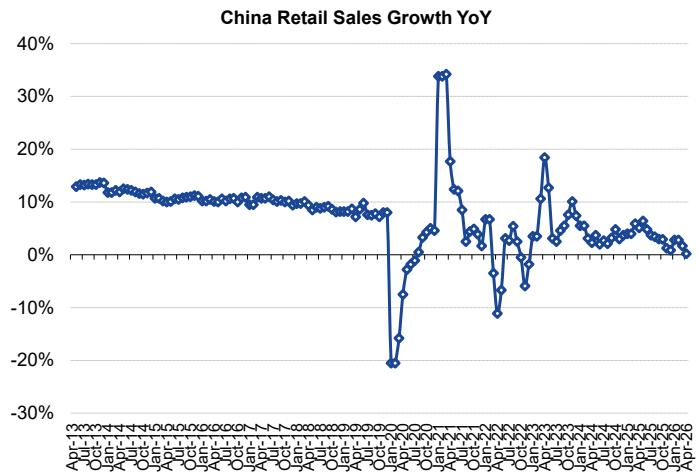

line

| Month-Year | Growth YoY |
| ---------- | ---------- |
| Apr-13     | 13%        |
| Oct-13     | 13%        |
| Jan-14     | 13%        |
| Apr-14     | 13%        |
| Jul-14     | 13%        |
| Oct-14     | 13%        |
| Jan-15     | 13%        |
| Apr-15     | 13%        |
| Jul-15     | 13%        |
| Oct-15     | 13%        |
| Jan-16     | 13%        |
| Apr-16     | 13%        |
| Jul-16     | 13%        |
| Oct-16     | 13%        |
| Jan-17     | 13%        |
| Apr-17     | 13%        |
| Jul-17     | 13%        |
| Oct-17     | 13%        |
| Jan-18     | 13%        |
| Apr-18     | 13%        |
| Jul-18     | 13%        |
| Oct-18     | 13%        |
| Jan-19     | 13%        |
| Apr-19     | 13%        |
| Jul-19     | 13%        |
| Oct-19     | 13%        |
| Jan-20     | 13%        |
| Apr-20     | 13%        |
| Jul-20     | 13%        |
| Oct-20     | -20%       |
| Jan-21     | -20%       |
| Apr-21     | -20%       |
| Jul-21     | -20%       |
| Oct-21     | -20%       |
| Jan-22     | -20%       |
| Apr-22     | -20%       |
| Jul-22     | -20%       |
| Oct-22     | -20%       |
| Jan-23     | -20%       |
| Apr-23     | -20%       |
| Jul-23     | -20%       |
| Oct-23     | -20%       |
| Jan-24     | -20%       |
| Apr-24     | -20%       |
| Jul-24     | -20%       |
| Oct-24     | -20%       |
| Jan-25     | -20%       |
| Apr-25     | -20%       |
| Jul-25     | -20%       |
| Oct-25     | -20%       |
| Jan-26     | -20%       |
| Apr-26     | -20%       |

Retail Sales CAGR vs 2019 Breakdown   
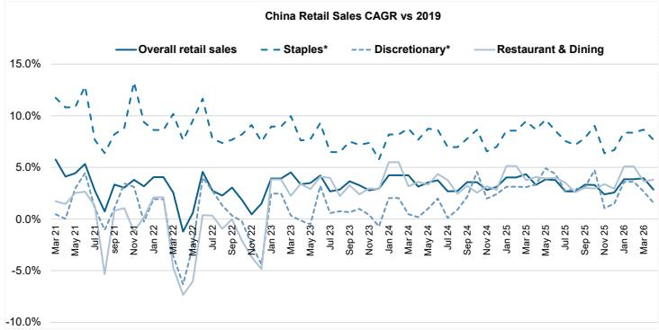

line

| Month    | Overall retail sales | Staples* | Discretionary* | Restaurant & Dining |
|----------|----------------------|----------|----------------|---------------------|
| Mar 21   | ~5.0%                | ~12.0%   | ~0.0%          | ~2.0%               |
| May 21   | ~4.0%                | ~13.0%   | ~0.0%          | ~3.0%               |
| Jul 21   | ~3.0%                | ~7.0%    | ~-5.0%         | ~1.0%               |
| Sep 21   | ~4.0%                | ~13.0%   | ~-2.0%         | ~-1.0%              |
| Nov 21   | ~4.0%                | ~8.0%    | ~-1.0%         | ~2.0%               |
| Jan 22   | ~4.0%                | ~10.0%   | ~-1.0%         | ~2.0%               |
| Mar 22   | ~-1.0%               | ~12.0%   | ~-7.0%         | ~-3.0%              |
| May 22   | ~4.0%                | ~8.0%    | ~-1.0%         | ~-1.0%              |
| Jul 22   | ~3.0%                | ~7.0%    | ~-1.0%         | ~-1.0%              |
| Sep 22   | ~1.0%                | ~9.0%    | ~-1.0%         | ~-1.0%              |
| Nov 22   | ~4.0%                | ~8.0%    | ~-1.0%         | ~-1.0%              |
| Jan 23   | ~4.0%                | ~9.0%    | ~-1.0%         | ~-1.0%              |
| Mar 23   | ~4.0%                | ~8.0%    | ~-1.0%         | ~-1.0%              |
| May 23   | ~4.0%                | ~7.0%    | ~-1.0%         | ~-1.0%              |
| Jul 23   | ~4.0%                | ~6.0%    | ~-1.0%         | ~-1.0%              |
| Sep 23   | ~4.0%                | ~7.0%    | ~-1.0%         | ~-1.0%              |
| Nov 23   | ~4.0%                | ~8.0%    | ~-1.0%         | ~-1.0%              |
| Jan 24   | ~4.0%                | ~9.0%    | ~-1.0%         | ~-1.0%              |
| Mar 24   | ~4.0%                | ~8.0%    | ~-1.0%         | ~-1.0%              |
| May 24   | ~4.0%                | ~7.0%    | ~-1.0%         | ~-1.0%              |
| Jul 24   | ~4.0%                | ~6.0%    | ~-1.0%         | ~-1.0%              |
| Sep 24   | ~4.0%                | ~7.0%    | ~-1.0%         | ~-1.0%              |
| Nov 24   | ~4.0%                | ~8.0%    | ~-1.0%         | ~-1.0%              |
| Jan 25   | ~4.0%                | ~9.0%    | ~-1.0%         | ~-1.0%              |
| Mar 25   | ~4.0%                | ~8.0%    | ~-1.0%         | ~-1.0%              |
| May 25   | ~4.0%                | ~7.0%    | ~-1.0%         | ~-1.0%              |
| Jul 25   | ~4.0%                | ~6.0%    | ~-1.0%         | ~-1.0%              |
| Sep 25   | ~4.0%                | ~7.0%    | ~-1.0%         | ~-1.0%              |
| Nov 25   | ~4.0%                | ~8.0%    | ~-1.0%         | ~-1.0%              |
| Jan 26   | ~4.0%                | ~9.0%    | ~-1.0%         | ~-1.0%              |
| Mar 26   | ~4.0%                | ~8.0%    | ~-1.0%         | ~-1.0%              |

Source: NBS, MS. \* based on the sales of enterprises above a designated size

# MS

# Revenue and Earnings Growth Estimates

China – Consumer Stocks: Average revenue and earnings growth   
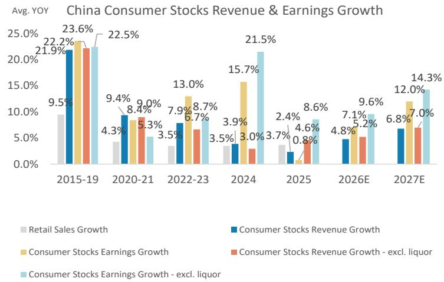

bar

China Consumer Stocks Revenue & Earnings Growth
| Year | Retail Sales Growth (%) | Consumer Stocks Revenue Growth (%) | Consumer Stocks Earnings Growth (%) | Consumer Stocks Revenue Growth - excl. liquor (%) | Consumer Stocks Earnings Growth - excl. liquor (%) |
| :--- | :--- | :--- | :--- | :--- | :--- |
| 2015-19 | 9.5 | 22.2 | 23.6 | 21.9 | 22.5 |
| 2020-21 | 4.3 | 9.4 | 8.4 | 9.0 | 5.3 |
| 2022-23 | 3.5 | 7.9 | 13.0 | 6.7 | 8.7 |
| 2024 | 3.5 | 3.9 | 15.7 | 3.0 | 21.5 |
| 2025 | 3.7 | 2.4 | 0.8 | 4.6 | 8.6 |
| 2026E | 4.8 | 7.1 | 5.2 | 5.2 | 9.6 |
| 2027E | 6.8 | 12.0 | 7.0 | 7.0 | 14.3 |

Consumer Stock (MS coverage) margin changes vs. CPI-PPI spread   
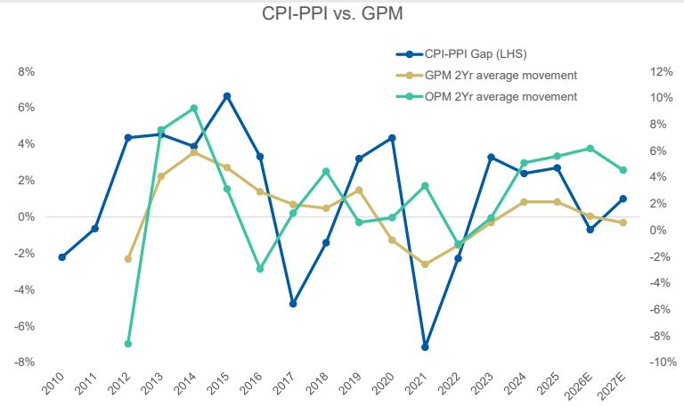

line

| Year   | CPI-PPI Gap (LHS) | GPM 2Yr average movement | OPM 2Yr average movement |
|--------|-------------------|--------------------------|--------------------------|
| 2010   | -2%               | -                        | -                        |
| 2011   | -1%               | -                        | -                        |
| 2012   | 4%                | -2%                      | -7%                      |
| 2013   | 4%                | 2%                       | 5%                       |
| 2014   | 4%                | 3%                       | 6%                       |
| 2015   | 7%                | 3%                       | 1%                       |
| 2016   | 3%                | 1%                       | -3%                      |
| 2017   | -5%               | 0%                       | 0%                       |
| 2018   | -1%               | 0%                       | 3%                       |
| 2019   | 3%                | 1%                       | -1%                      |
| 2020   | 4%                | -1%                      | 0%                       |
| 2021   | -8%               | -3%                      | 2%                       |
| 2022   | -2%               | -1%                      | -1%                      |
| 2023   | 3%                | 0%                       | 0%                       |
| 2024   | 3%                | 1%                       | 4%                       |
| 2025   | 3%                | 1%                       | 5%                       |
| 2026E  | -1%               | 0%                       | 6%                       |
| 2027E  | 1%                | -1%                      | 4%                       |

Source: Company Data, E = MS Estimates

Raw material price trends   
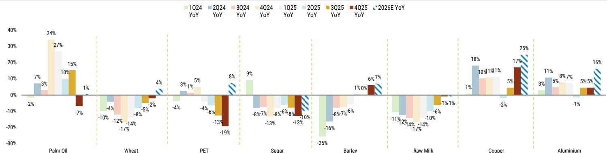

bar

| Commodity | 1Q24 YoY | 2Q24 YoY | 3Q24 YoY | 4Q24 YoY | 1Q25 YoY | 2Q25 YoY | 3Q25 YoY | 4Q25 YoY | 2026E YoY |
|-----------|----------|----------|----------|----------|----------|----------|----------|----------|-----------|
| Palm Oil  | -2%      | 7%       | 3%       | 34%      | 27%      | 10%      | 15%      | -7%      | 1%        |
| Wheat     | -10%     | -4%      | -12%     | -17%     | -8%      | -5%      | -2%      | -2%      | 4%        |
| PET       | -4%      | 3%       | 1%       | 5%       | -4%      | -6%      | -13%     | -19%     | 8%        |
| Sugar     | 9%       | -8%      | -7%      | -8%      | -6%      | -8%      | -8%      | -13%     | -10%      |
| Barley    | -25%     | -16%     | -8%      | -7%      | -6%      | 1%       | 0%       | 6%       | 7%        |
| Raw Milk  | -11%     | -12%     | -14%     | -17%     | -10%     | -6%      | -1%      | -1%      | 1%        |
| Copper    | 1%       | 18%      | 10%      | 11%      | 11%      | -2%      | 5%       | 17%      | 25%       |
| Aluminium | 3%       | 11%      | 5%       | 8%       | 7%       | -1%      | 5%       | 5%       | 16%       |

Source: Bloomberg, MS estimates. Estimates are based on last available prices as of May 29, 2026 and assume they remain unchanged throughout year.

MS

# Consumer Industry Performance and Catalysts

# MS

Timing Segment Fundamental Changes   
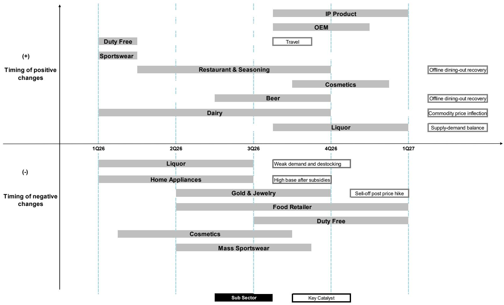

bar

| Category | Sub Sector | Key Catalyst |
| :--- | :--- | :--- |
| IP Product | - | - |
| OEM | - | - |
| Travel | - | - |
| Duty Free | - | - |
| Sportswear | - | - |
| Restaurant & Seasoning | - | - |
| Cosmetics | - | - |
| Beer | - | - |
| Dairy | - | - |
| Liquor | - | - |
| Offline dining-out recovery | - | - |
| Offline dining-out recovery | - | - |
| Commodity price inflection | - | - |
| Supply-demand balance | - | - |
| Liquor | - | - |
| Well demand and destocking | - | - |
| Home Appliances | - | - |
| High base after subsidies | - | - |
| Gold & Jewelry | - | - |
| Sell-off post price hike | - | - |
| Food Retailer | - | - |
| Duty Free | - | - |
| Cosmetics | - | - |
| Mass Sportswear | - | - |
| Sub Sector | - | - |
| Key Catalyst | - | - |

Source: MS.

# MS

# Preferred Consumer Stock List

China Consumer Preferred Stock List for 2Q-3Q26 

<table><tr><td colspan="4">China Consumer Preferred Stocks</td></tr><tr><td></td><td>Segment</td><td>Stock</td><td>Rationale</td></tr><tr><td rowspan="2">Recovery of offline service consumption</td><td rowspan="2">Restuarnt</td><td>YUMC</td><td>Solid excution, pricing and cost leader in the industry, attractive shareholder return</td></tr><tr><td>Haidilao</td><td>Back on growth track with macro tailwinds and a revitalized leadership</td></tr><tr><td>Pricing recovery</td><td>Beer</td><td>CRB</td><td>Continued mix upgrade and market share gain of core premium products</td></tr><tr><td rowspan="2">Supply recalibration</td><td rowspan="2">Dairy</td><td>Mengniu</td><td rowspan="2">Reduced promotion driven by raw milk supply reduction, leading to rational industry environment and OPM improvement</td></tr><tr><td>Yili</td></tr><tr><td rowspan="3">Company sepcific</td><td>Beauty</td><td>Giant Biogene</td><td>Following the sales shortfall in 2H25 brought by externally driven negative publicity and operational imbalances, GB is optimizing its go-to-market and branding strategy while constructing strong product pipeline, improving downside resilience and creating upside drivers.</td></tr><tr><td>IP products</td><td>Pop Mart</td><td>Strong overseas growth driven by new IP launches and channel expansion, in addition to solid operation in China</td></tr><tr><td>Freshly Brewed Tea</td><td>Chagee</td><td>Improvement and turnaround of unit store GMV yoy trend with new product launches, efficiency improvement and disciplined store open; overseas expansion as long-term driver</td></tr></table>

Preferred Chinese Consumer Stocks 

<table><tr><td colspan="2"></td><td>Company</td><td>Rating</td><td>Currency</td><td>Current Price</td><td>PT</td><td>Bull Case</td><td>Bear Case</td><td>Market Cap (USD mn)</td><td>P/E Valuation 2026E</td><td>2027E</td><td>2025-27 EPS</td><td>2026 PEG</td><td>Div. Yield 2026</td><td>2027</td><td>FCF Yield 2026</td><td>2027</td></tr><tr><td colspan="18">Most preferred</td></tr><tr><td>YUMC.N</td><td>YUMC-US</td><td>YUM China</td><td>OW</td><td>USD</td><td>42.4</td><td>60.0</td><td>73.0</td><td>33.0</td><td>14,814</td><td>13.9x</td><td>12.4x</td><td>15%</td><td>0.9x</td><td>10.1%</td><td>6.8%</td><td>7.2%</td><td>8.0%</td></tr><tr><td>6862.HK</td><td>6862-HK</td><td>Haidilao</td><td>OW</td><td>HKD</td><td>12.8</td><td>20.0</td><td>39.0</td><td>10.0</td><td>9,075</td><td>12.2x</td><td>10.3x</td><td>22%</td><td>0.5x</td><td>5.9%</td><td>7.0%</td><td>5.2%</td><td>6.9%</td></tr><tr><td>0291.HK</td><td>291-HK</td><td>CRB</td><td>OW</td><td>HKD</td><td>24.2</td><td>35.0</td><td>41.0</td><td>20.0</td><td>10,017</td><td>11.2x</td><td>10.2x</td><td>9%</td><td>1.3x</td><td>4.9%</td><td>5.9%</td><td>9.1%</td><td>10.2%</td></tr><tr><td>2319.HK</td><td>2319-HK</td><td>Mengniu</td><td>OW</td><td>HKD</td><td>17.0</td><td>20.0</td><td>26.0</td><td>10.4</td><td>8,394</td><td>12.0x</td><td>10.6x</td><td>18%</td><td>0.7x</td><td>3.5%</td><td>4.0%</td><td>4.1%</td><td>7.1%</td></tr><tr><td>600887.SS</td><td>600887-CN</td><td>Yili</td><td>OW</td><td>CNY</td><td>26.9</td><td>33.0</td><td>39.0</td><td>18.0</td><td>25,157</td><td>13.8x</td><td>12.7x</td><td>8%</td><td>1.8x</td><td>5.8%</td><td>6.3%</td><td>7.1%</td><td>8.9%</td></tr><tr><td>2367.HK</td><td>2367-HK</td><td>Giant Biogene</td><td>OW</td><td>HKD</td><td>30.1</td><td>43.0</td><td>59.0</td><td>24.0</td><td>4,072</td><td>14.3x</td><td>12.4x</td><td>9%</td><td>1.5x</td><td>4.2%</td><td>4.8%</td><td>4.7%</td><td>4.3%</td></tr><tr><td>9992.HK</td><td>9992-HK</td><td>Pop Mart</td><td>OW</td><td>HKD</td><td>173.4</td><td>247.0</td><td>361.0</td><td>117.0</td><td>29,670</td><td>15.0x</td><td>12.9x</td><td>11%</td><td>1.3x</td><td>1.6%</td><td>2.0%</td><td>2.9%</td><td>4.4%</td></tr><tr><td>CHA.O</td><td>CHA-US</td><td>Chagee</td><td>OW</td><td>USD</td><td>12.8</td><td>15.5</td><td>19.5</td><td>8.0</td><td>1,601</td><td>9.4x</td><td>8.8x</td><td>27%</td><td>0.4x</td><td>0.0%</td><td>0.0%</td><td>4.5%</td><td>8.3%</td></tr></table>

# MS

# Share Price Performance of Consumer Industry and Key Indices

Price movement of overall Chinese consumer stocks vs. major indices   
Annual price movement of key index and sectors   
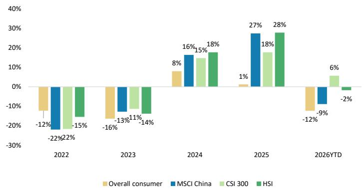

bar

| Year | Overall consumer (%) | MSCI China (%) | CSI 300 (%) | HSI (%) |
|---|---|---|---|---|
| 2022 | -12 | -22 | -22 | -15 |
| 2023 | -16 | -13 | -11 | -14 |
| 2024 | 8 | 16 | 15 | 18 |
| 2025 | 1 | 27 | 18 | 28 |
| 2026YTD | -12 | -9 | 6 | -2 |

CPI-PPI vs. China consumer sector P/E   
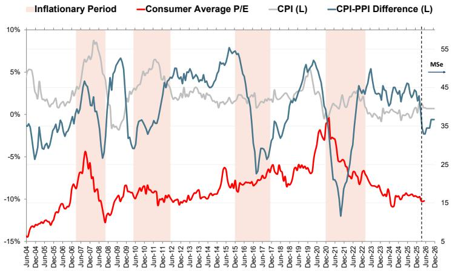

line

| Date     | Consumer Average P/E | CPI (L) | CPI-PPI Difference (L) |
|----------|----------------------|---------|------------------------|
| Jun-04   | -15%                 | ~5%     | ~-5%                   |
| Dec-04   | -14%                 | ~4%     | ~-3%                   |
| Jun-05   | -13%                 | ~3%     | ~-2%                   |
| Dec-05   | -12%                 | ~2%     | ~-1%                   |
| Jun-06   | -11%                 | ~1%     | ~0%                    |
| Dec-06   | -10%                 | ~0%     | ~1%                    |
| Jun-07   | -9%                  | ~1%     | ~2%                    |
| Dec-07   | -8%                  | ~2%     | ~3%                    |
| Jun-08   | -7%                  | ~3%     | ~4%                    |
| Dec-08   | -6%                  | ~4%     | ~5%                    |
| Jun-09   | -5%                  | ~5%     | ~6%                    |
| Dec-09   | -4%                  | ~6%     | ~7%                    |
| Jun-10   | -3%                  | ~7%     | ~8%                    |
| Dec-10   | -2%                  | ~8%     | ~9%                    |
| Jun-11   | -1%                  | ~9%     | ~10%                   |
| Dec-11   | 0%                   | ~10%    | ~11%                   |
| Jun-12   | 1%                   | ~11%    | ~12%                   |
| Dec-12   | 2%                   | ~12%    | ~13%                   |
| Jun-13   | 3%                   | ~13%    | ~14%                   |
| Dec-13   | 4%                   | ~14%    | ~15%                   |
| Jun-14   | 5%                   | ~15%    | ~16%                   |
| Dec-14   | 6%                   | ~16%    | ~17%                   |
| Jun-15   | 7%                   | ~17%    | ~18%                   |
| Dec-15   | 8%                   | ~18%    | ~19%                   |
| Jun-16   | 9%                   | ~19%    | ~20%                   |
| Dec-16   | 10%                  | ~20%    | ~21%                   |
| Jun-17   | 11%                  | ~21%    | ~22%                   |
| Dec-17   | 12%                  | ~22%    | ~23%                   |
| Jun-18   | 13%                  | ~23%    | ~24%                   |
| Dec-18   | 14%                  | ~24%    | ~25%                   |
| Jun-19   | 15%                  | ~25%    | ~26%                   |
| Dec-19   | 16%                  | ~26%    | ~27%                   |
| Jun-20   | 17%                  | ~27%    | ~28%                   |
| Dec-20   | 18%                  | ~28%    | ~29%                   |
| Jun-21   | 19%                  | ~29%    | ~30%                   |
| Dec-21   | 20%                  | ~30%    | ~31%                   |
| Jun-22   | 21%                  | ~31%    | ~32%                   |
| Dec-22   | 22%                  | ~32%    | ~33%                   |
| Jun-23   | 23%                  | ~33%    | ~34%                   |
| Dec-23   | 24%                  | ~34%    | ~35%                   |
| Jun-24   | 25%                  | ~35%    | ~36%                   |
| Dec-24   | 26%                  | ~36%    | ~37%                   |
| Jun-25   | 27%                  | ~37%    | ~38%                   |
| Dec-25   | 28%                  | ~38%    | ~39%                   |
| Jun-26   | 29%                  | ~39%    | ~40%                   |
| Dec-26   | 30%                  | ~40%    | ~41%                   |

Source: Factset, MS. Note: Priced as of May 29, 2026.

China consumer sector P/E valuation premium to MSCI China   
China Consumer PE Premium to MSCI China   
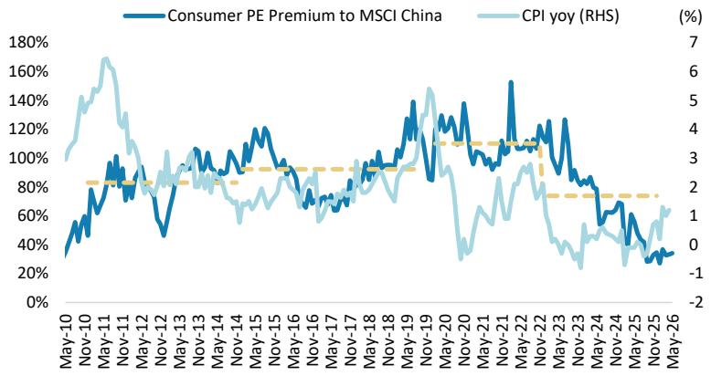

line

| Date    | Consumer PE Premium to MSCI China | CPI yoy (RHS) |
|---------|-----------------------------------|---------------|
| May-10  | ~30%                              | ~1.5%         |
| Nov-10  | ~70%                              | ~3.0%         |
| May-11  | ~90%                              | ~6.0%         |
| Nov-11  | ~80%                              | ~4.0%         |
| May-12  | ~50%                              | ~2.0%         |
| Nov-12  | ~100%                             | ~3.0%         |
| May-13  | ~110%                             | ~2.5%         |
| Nov-13  | ~90%                              | ~2.0%         |
| May-14  | ~100%                             | ~2.5%         |
| Nov-14  | ~110%                             | ~2.0%         |
| May-15  | ~120%                             | ~2.5%         |
| Nov-15  | ~90%                              | ~2.0%         |
| May-16  | ~80%                              | ~2.5%         |
| Nov-16  | ~70%                              | ~2.0%         |
| May-17  | ~80%                              | ~2.5%         |
| Nov-17  | ~90%                              | ~2.0%         |
| May-18  | ~100%                             | ~2.5%         |
| Nov-18  | ~110%                             | ~2.0%         |
| May-19  | ~130%                             | ~2.5%         |
| Nov-19  | ~140%                             | ~3.0%         |
| May-20  | ~120%                             | ~2.5%         |
| Nov-20  | ~100%                             | ~2.0%         |
| May-21  | ~110%                             | ~2.5%         |
| Nov-21  | ~150%                             | ~3.0%         |
| May-22  | ~130%                             | ~2.5%         |
| Nov-22  | ~120%                             | ~2.0%         |
| May-23  | ~130%                             | ~2.5%         |
| Nov-23  | ~110%                             | ~2.0%         |
| May-24  | ~90%                              | ~1.5%         |
| Nov-24  | ~70%                              | ~1.0%         |
| May-25  | ~50%                              | ~0.5%         |
| Nov-25  | ~30%                              | ~0.0%         |
| May-26  | ~30%                              | ~0.5%         |

China consumer sector P/E vs Global peer avg. P/E

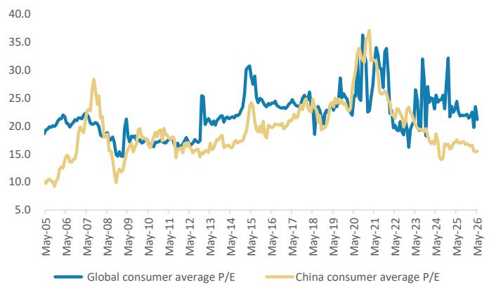

line

| Date   | Global consumer average P/E | China consumer average P/E |
|--------|-----------------------------|----------------------------|
| May-05 | ~19.0                       | ~10.0                      |
| May-06 | ~20.0                       | ~12.0                      |
| May-07 | ~21.0                       | ~18.0                      |
| May-08 | ~18.0                       | ~28.0                      |
| May-09 | ~16.0                       | ~10.0                      |
| May-10 | ~17.0                       | ~18.0                      |
| May-11 | ~17.5                       | ~17.0                      |
| May-12 | ~18.0                       | ~16.0                      |
| May-13 | ~25.0                       | ~17.0                      |
| May-14 | ~22.0                       | ~18.0                      |
| May-15 | ~30.0                       | ~24.0                      |
| May-16 | ~25.0                       | ~20.0                      |
| May-17 | ~24.0                       | ~22.0                      |
| May-18 | ~23.0                       | ~23.0                      |
| May-19 | ~25.0                       | ~24.0                      |
| May-20 | ~35.0                       | ~34.0                      |
| May-21 | ~37.0                       | ~36.0                      |
| May-22 | ~33.0                       | ~28.0                      |
| May-23 | ~28.0                       | ~25.0                      |
| May-24 | ~32.0                       | ~18.0                      |
| May-25 | ~33.0                       | ~16.0                      |
| May-26 | ~22.0                       | ~15.0                      |

# MS

# Valuation and Earnings Estimates

China – consumer stocks: valuation vs. sales and earnings growth   
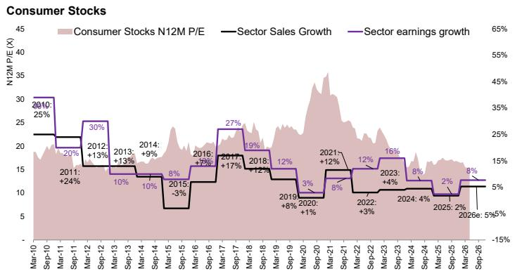

line

| Year | Consumer Stocks N12M P/E | Sector Sales Growth | Sector earnings growth |
|------|--------------------------|---------------------|------------------------|
| 2010 | 25%                      | -                   | 30%                    |
| 2011 | +24%                     | -                   | 20%                    |
| 2012 | +13%                     | -                   | 30%                    |
| 2013 | +13%                     | -                   | 10%                    |
| 2014 | +9%                      | -                   | 8%                     |
| 2015 | -3%                      | -                   | 8%                     |
| 2016 | +7%                      | -                   | 27%                    |
| 2017 | +17%                     | -                   | 19%                    |
| 2018 | +12%                     | -                   | 12%                    |
| 2019 | +8%                      | -                   | 3%                     |
| 2020 | +1%                      | -                   | 8%                     |
| 2021 | +12%                     | -                   | 12%                    |
| 2022 | +3%                      | -                   | 16%                    |
| 2023 | +4%                      | -                   | 8%                     |
| 2024 | +4%                      | -                   | 8%                     |
| 2025 | 2%                       | -                   | 8%                     |
| 2026e| 5%                      | -                   | 8%                     |

Consensus consumer sales vs. P/E   
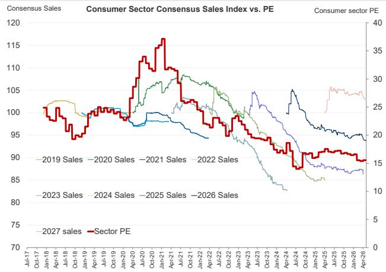  
Source: Factset, MS (e) estimates (2026-27)

China – consumer stocks: valuation vs. ex-liquor   
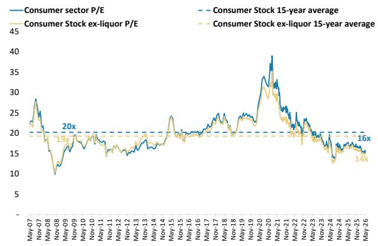

line

| Date    | Consumer sector P/E | Consumer Stock 15-year average | Consumer Stock ex-liquor P/E | Consumer Stock ex-liquor 15-year average |
|---------|---------------------|----------------------------------|-------------------------------|------------------------------------------|
| May-07  | ~28                 | 20x                              | ~22                           | ~20                                      |
| Nov-07  | ~25                 | 20x                              | ~20                           | ~20                                      |
| May-08  | ~10                 | 20x                              | ~15                           | ~20                                      |
| Nov-08  | ~15                 | 20x                              | ~18                           | ~20                                      |
| May-09  | ~18                 | 20x                              | ~20                           | ~20                                      |
| Nov-09  | ~17                 | 20x                              | ~19                           | ~20                                      |
| May-10  | ~16                 | 20x                              | ~18                           | ~20                                      |
| Nov-10  | ~15                 | 20x                              | ~17                           | ~20                                      |
| May-11  | ~16                 | 20x                              | ~18                           | ~20                                      |
| Nov-11  | ~17                 | 20x                              | ~19                           | ~20                                      |
| May-12  | ~18                 | 20x                              | ~20                           | ~20                                      |
| Nov-12  | ~19                 | 20x                              | ~21                           | ~20                                      |
| May-13  | ~20                 | 20x                              | ~22                           | ~20                                      |
| Nov-13  | ~21                 | 20x                              | ~23                           | ~20                                      |
| May-14  | ~22                 | 20x                              | ~24                           | ~20                                      |
| Nov-14  | ~23                 | 20x                              | ~25                           | ~20                                      |
| May-15  | ~24                 | 20x                              | ~26                           | ~20                                      |
| Nov-15  | ~25                 | 20x                              | ~27                           | ~20                                      |
| May-16  | ~26                 | 20x                              | ~28                           | ~20                                      |
| Nov-16  | ~27                 | 20x                              | ~29                           | ~20                                      |
| May-17  | ~28                 | 20x                              | ~30                           | ~20                                      |
| Nov-17  | ~29                 | 20x                              | ~31                           | ~20                                      |
| May-18  | ~30                 | 20x                              | ~32                           | ~20                                      |
| Nov-18  | ~31                 | 20x                              | ~33                           | ~20                                      |
| May-19  | ~32                 | 20x                              | ~34                           | ~20                                      |
| Nov-19  | ~33                 | 20x                              | ~35                           | ~20                                      |
| May-20  | ~34                 | 20x                              | ~36                           | ~20                                      |
| Nov-20  | ~35                 | 20x                              | ~37                           | ~20                                      |
| May-21  | ~36                 | 20x                              | ~38                           | ~20                                      |
| Nov-21  | ~37                 | 20x                              | ~39                           | ~20                                      |
| May-22  | ~38                 | 20x                              | ~40                           | ~20                                      |
| Nov-22  | ~39                 | 20x                              | ~41                           | ~20                                      |
| May-23  | ~40                 | 20x                              | ~42                           | ~20                                      |
| Nov-23  | ~41                 | 20x                              | ~43                           | ~20                                      |
| May-24  | ~42                 | 20x                              | ~44                           | ~20                                      |
| Nov-24  | ~43                 | 20x                              | ~45                           | ~20                                      |
| May-25  | ~44                 | 20x                              | ~46                           | ~20                                      |
| Nov-25  | ~45                 | 16x                              | ~47                           | ~16                                      |
| May-26  | ~46                 | 16x                              | ~48                           | 14                                       |

Consensus consumer earnings vs. P/E

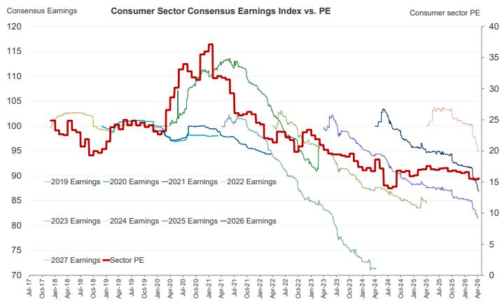

# MS

# Ownership of Consumer Stocks

Average Southbound ownership as % of free float for consumer H-shares   
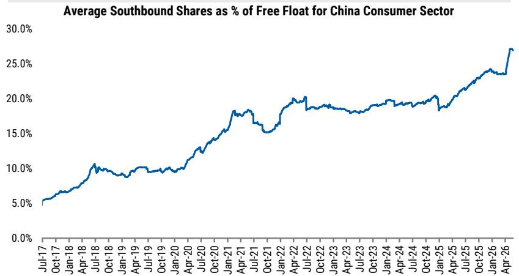

line

| Date    | Average Southbound Shares as % of Free Float |
|---------|---------------------------------------------|
| Apr-26  | 27.0%                                       |

Average institutional ownership as % of free float for consumer companies   
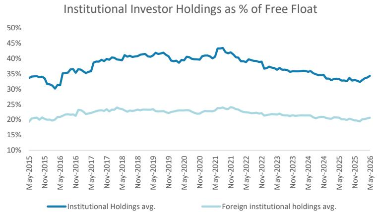

line

| Date       | Institutional Holdings avg. | Foreign institutional Holdings avg. |
| ---------- | ---------------------------- | ----------------------------------- |
| May-2015   | 34%                          | 20%                                 |
| Nov-2015   | 30%                          | 21%                                 |
| May-2016   | 35%                          | 22%                                 |
| Nov-2016   | 37%                          | 23%                                 |
| May-2017   | 39%                          | 24%                                 |
| Nov-2017   | 40%                          | 25%                                 |
| May-2018   | 41%                          | 24%                                 |
| Nov-2018   | 42%                          | 23%                                 |
| May-2019   | 41%                          | 24%                                 |
| Nov-2019   | 40%                          | 23%                                 |
| May-2020   | 39%                          | 24%                                 |
| Nov-2020   | 40%                          | 23%                                 |
| May-2021   | 43%                          | 24%                                 |
| Nov-2021   | 42%                          | 23%                                 |
| May-2022   | 40%                          | 22%                                 |
| Nov-2022   | 38%                          | 21%                                 |
| May-2023   | 37%                          | 20%                                 |
| Nov-2023   | 36%                          | 19%                                 |
| May-2024   | 35%                          | 18%                                 |
| Nov-2024   | 34%                          | 17%                                 |
| May-2025   | 33%                          | 16%                                 |
| Nov-2025   | 32%                          | 15%                                 |
| May-2026   | 34%                          | 16%                                 |

Average institutional ownership as % of free float for consumer companies by categories   
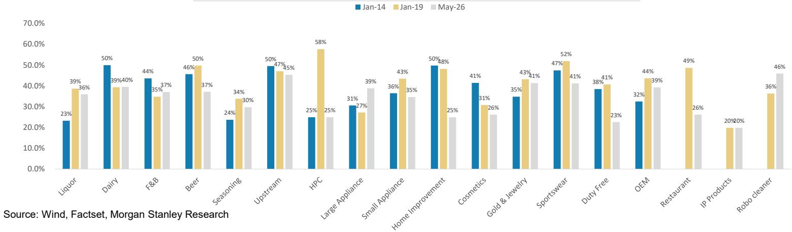

bar

| Category | Jan-14 (%) | Jan-19 (%) | May-26 (%) |
| :--- | :--- | :--- | :--- |
| Liquor | 23 | 39 | 36 |
| Dairy | 50 | 39 | 40 |
| F&B | 44 | 35 | 37 |
| Beer | 46 | 50 | 37 |
| Seasoning | 24 | 34 | 30 |
| Upstream | 50 | 47 | 45 |
| HPC | 25 | 58 | 25 |
| Large Appliance | 31 | 27 | 39 |
| Small Appliance | 36 | 43 | 35 |
| Home Improvement | 50 | 48 | 25 |
| Cosmetics | 41 | 31 | 26 |
| Gold & Jewelry | 35 | 43 | 41 |
| Sportswear | 47 | 52 | 41 |
| Duty Free | 38 | 41 | 23 |
| OEM | 32 | 44 | 39 |
| Restaurant | - | 49 | 26 |
| IP Products | - | 20 | 20 |
| Robo cleaner | - | 36 | 46 |
Source: Wind, Factset, MS

# MS

MSe earnings estimates and vs. consensus estimates   
Earnings Growth by Category   
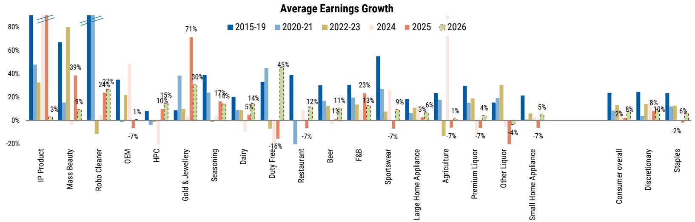

2026 consumer segments: Our net profit estimates vs. consensus   
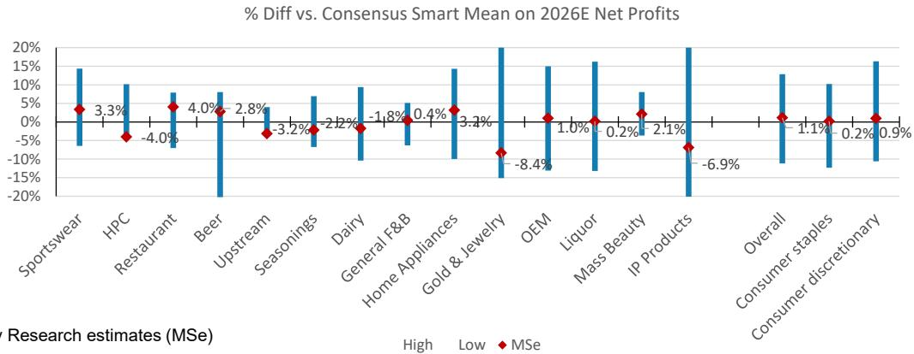

bar

| Category             | High   | Low    | MSe    |
|----------------------|--------|--------|--------|
| Sportswear           | 15%    | -5%    | 3.3%   |
| HPC                  | 10%    | -5%    | -4.0%  |
| Restaurant           | 7%     | -5%    | 4.0%   |
| Beer                 | -20%   | -20%   | 2.8%   |
| Upstream             | 5%     | -5%    | -3.2%  |
| Seasonings           | 7%     | -5%    | -2.2%  |
| Dairy                | 10%    | -10%   | -1.8%  |
| General F&B          | 15%    | -5%    | 0.4%   |
| Home Appliances      | 15%    | -10%   | 3.4%   |
| Gold & Jewelry       | 20%    | -15%   | -8.4%  |
| OEM                  | 15%    | -5%    | 1.0%   |
| Liquor               | 15%    | -10%   | 0.2%   |
| Mass Beauty          | 7%     | -5%    | 2.1%   |
| IP Products          | 20%    | -20%   | -6.9%  |
| Overall              | 15%    | -10%   | 1.1%   |
| Consumer staples     | 10%    | -10%   | 0.2%   |
| Consumer discretionary| 15%    | -10%   | 0.9%   |

Source: Factset, MS estimates (MSe)

# MS

P/E vs. Earnings Growth by Segment   
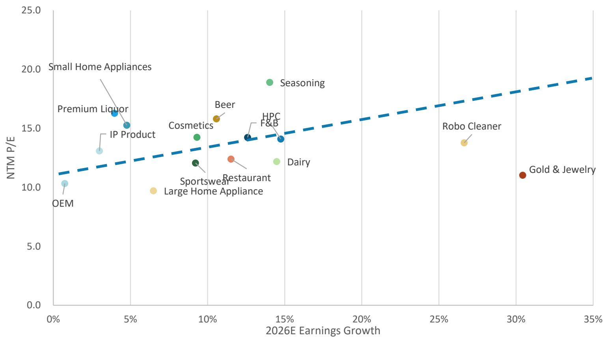

scatter

| Category               | 2026E Earnings Growth | NTM P/E |
| ---------------------- | --------------------- | ------- |
| OEM                    | ~1%                   | ~10.5   |
| Premium Liquor        | ~4%                   | ~16.5   |
| IP Product             | ~4.5%                 | ~15.5   |
| Small Home Appliances  | ~3%                   | ~13.0   |
| Cosmetics              | ~9.5%                 | ~14.0   |
| Beer                   | ~10.5%                | ~15.5   |
| Seasoning              | ~14.0%                | ~18.5   |
| HPC F&B                | ~14.5%                | ~14.0   |
| Sportswear             | ~9.5%                 | ~12.0   |
| Restaurant             | ~11.5%                | ~12.5   |
| Large Home Appliance   | ~6.5%                 | ~9.5    |
| Dairy                  | ~14.5%                | ~12.0   |
| Robo Cleaner           | ~26.5%                | ~13.5   |
| Gold & Jewelry         | ~30.5%                | ~11.0   |

Source: Factset, MS estimates

# MS

Market cap of key consumer sub-sectors   
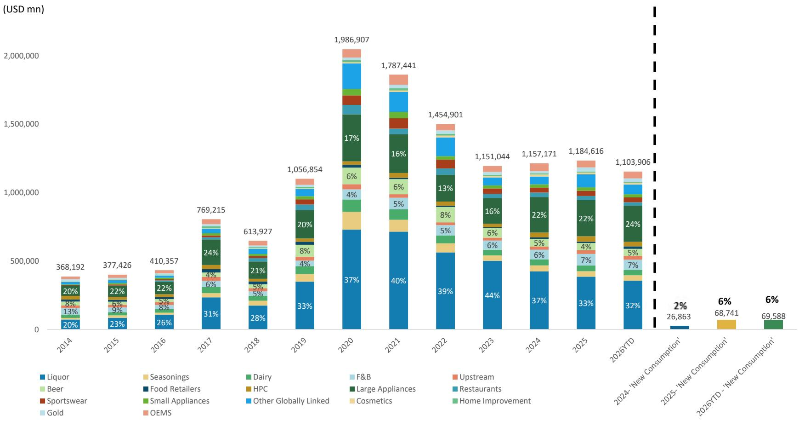  
Source: Factset, MS; Prices as of May 29, 2026. Note: Key New Consumption stocks include Pop Mart, Laopu Gold, Bloks\*, Mixue\*, Guming\*, Giant Biogene, Mao Geping and Busy Ming\*. (\* indicates non-covered stock) Busy Ming was listed in 2026 and other Key New Consumption stocks were listed before 2026.

# MS

Consumer Segment Performance – 2026 YTD   
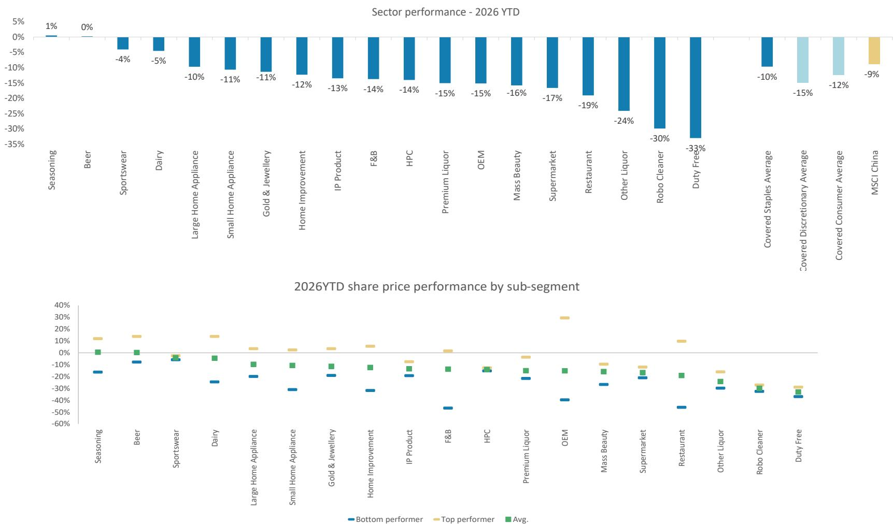

bar

Sector performance - 2026 YTD
| Sub-segment | Sector | Performance (%) |
| :--- | :--- | :--- |
| Seasoning | Seasoning | 1 |
| Beer | Beer | 0 |
| Sportswear | Sportswear | -4 |
| Dairy | Dairy | -5 |
| Large Home Appliance | Large Home Appliance | -10 |
| Small Home Appliance | Small Home Appliance | -11 |
| Gold & Jewellery | Gold & Jewellery | -11 |
| Home Improvement | Home Improvement | -12 |
| IP Product | IP Product | -13 |
| F&B | F&B | -14 |
| HPC | HPC | -14 |
| Premium Liquor | Premium Liquor | -15 |
| OEM | OEM | -15 |
| Mass Beauty | Mass Beauty | -16 |
| Supermarket | Supermarket | -17 |
| Restaurant | Restaurant | -19 |
| Other Liquor | Other Liquor | -24 |
| Robo Cleaner | Robo Cleaner | -30 |
| Duty Free | Duty Free | -33 |
| Covered Staples Average | Covered Staples Average | -10 |
| Covered Discretionary Average | Covered Discretionary Average | -15 |
| Covered Consumer Average | Covered Consumer Average | -12 |
| MSCI China | MSCI China | -9 |
2026YTD share price performance by sub-segment
Bottom performer: -18.0% (Seasoning), Beer: -8.0% (Sportswear), Dairy: -2.0% (Large Home Appliance), Small Home Appliance: -2.0% (Gold & Jewellery), F&B: -4.0% (Large Home Appliance), Gold & Jewellery: -2.0% (Small Home Appliance), Home Improvement: -3.0% (Home Improvement), IP Product: -2.0% (Large Home Appliance), HPC: -2.0% (High Product), Premium Liquor: -2.0% (High Product), OEM: -4.0% (High Product), Mass Beauty: -2.0% (Mass Beauty), Supermarket: -2.0% (Supermarket), Restaurant: -4.0% (Restaurant), Other Liquor: -3.0% (Other Liquor), Robo Cleaner: -3.0% (Robo Cleaner), Duty Free: -3.0% (Duty Free). Top performer: 12.0%, Avg.: 0.0%. Bottom performer: 1.0%, Avg.: 0.0%. Top performer: 14.0%, Avg.: 0.0%. Top performer: 1.0%, Avg.: 0.0%. Top performer: 1.0%, Avg.: 0.0%. Top performer: 1.0%, Avg.: 0.0%. Top performer: 1.0%, Avg.: 0.0%. Top performer: 1.0%, Avg.: 0.0%. Top performer: 1.0%, Avg.: 0.0%. Top performer: 1.0%, Avg.: 0.0%.

Source: Factset, MS. Note: Priced as of the close on May 29, 2026; Past performance is no guarantee of future results.

# MS

Share price movement of major players   
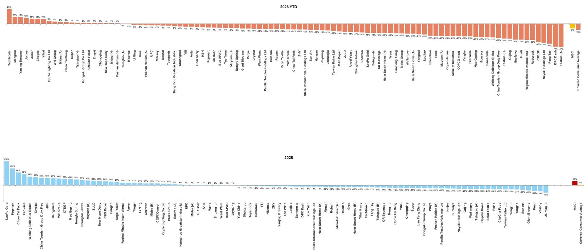

bar

2026 YTD
| Company | YTD (%) |
| :--- | :--- |
| Techntronic | 28 |
| Mengtu | 14 |
| Yanjing Brewery | 14 |
| Joojie | 12 |
| Anker | 10 |
| Chugee | 10 |
| Yihai | 10 |
| Oppie Lighting Co Ltd | 9 |
| WH Group | 7 |
| Midea (A) | 7 |
| Chow Tai Seng | 7 |
| Supor | 7 |
| Talingao (H) | 7 |
| Gongniu Group Co Ltd | 7 |
| ChaCha Food | 7 |
| Tingyi | 7 |
| Chongqing | 7 |
| New Hope Dairy | 7 |
| Midea (R) | 7 |
| Foshan Haitian (H) | 7 |
| Talingao (A) | 7 |
| Hisense | 7 |
| Li Ning | 6 |
| Gree | 6 |
| Foshan Haitian (A) | 6 |
| UPC | 6 |
| Vitasoy | 6 |
| Moutai | 6 |
| Topsports | 6 |
| Hangzhou Greatstar Industrial... | 6 |
| Shanghai | 6 |
| Yili | 6 |
| Ningfu Spring | 6 |
| Giant Biogene | 6 |
| Proya | 6 |
| Crystal | 6 |
| Want Want | 6 |
| Pacific Textiles Holdings Ltd | 6 |
| Haiditao | 6 |
| Robam | 6 |
| Ediat Textile | 6 |
| Yum China | 6 |
| Chow Tai Fook | 6 |
| ZHY | 6 |
| DPC Dash | 6 |
| Sun Art | 6 |
| Hengan | 6 |
| Joyoung | 6 |
| Jumaojiu | 6 |
| Taiwan Pailo Ltd | 6 |
| C&S Paper | 6 |
| ZJLD | 6 |
| Angel Yeast | 6 |
| Shanghai Jahwa | 6 |
| Chervon | 6 |
| LiaoPu Gold | 6 |
| Belingmate | 6 |
| CR Beverage | 6 |
| Hai Smart Home (H) | 6 |
| Wens | 6 |
| Liao Feng Xiang | 6 |
| Bloks Group | 6 |
| Wujiangye | 6 |
| Hai Smart Home (A) | 6 |
| Yonghui | 6 |
| Liaojao | 6 |
| Shenzhenhou | 6 |
| Feihe | 6 |
| Miyuan (A) | 6 |
| Oppeim Home | 6 |
| Makao Industrial | 6 |
| COFCO meat | 6 |
| Yangbe | 6 |
| Fen Wine | 6 |
| Mao Geping | 6 |
| Ecovacs | 6 |
| Shansolite | 6 |
| Weikong Delicious Global... | 6 |
| China Tourism Group Duty Free | 6 |
| Eastroc (H) | 6 |
| Gujing | 6 |
| Suofiya | 6 |
| Huali | 6 |
| Regina Miracle International... | 6 |
| Roborock | 6 |
| CTDGF | 6 |
| Nayuki Holdings Ltd | 6 |
| Feng Tay | 6 |
| DPC Dash | 6 |
| Eastroc (A) | 47 |
| MSCI | -3 |
| Covered Consumer Average | -12 |
| MSCI Covered Consumer Average | -4%

Source: Factset, MS. Price as of May 29, 2026. Note: companies not covered by MS: Jonjee, Anker, Yihai, Opple Lighting, New Hope Dairy, Hisense, Vitasoy, Yihai Kerry, Pacific Textiles, ZHY, Joyoung, JMJ, Paiho, Beingmate, CR Beverage, Wens, LFX, Bloks, Feihe, Oppein Home, COFCO, Suofeiya, Regina Miracle, Nayuki, DPC Dash

MS

# AlphaWise Survey

# MS

# Economic, Household Financial and Spending Outlook

China Economic Outlook   
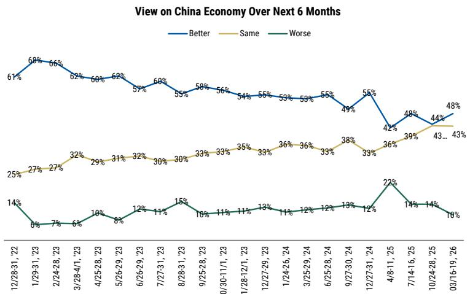

line

| Date       | Better | Same | Worse |
| ---------- | ------ | ---- | ----- |
| 12/28-31 '22 | 61%    | 25%  | 14%   |
| 1/29-31 '23 | 68%    | 27%  | 0%    |
| 2/24-28 '23 | 66%    | 27%  | 7%    |
| 3/28-4-1 '23 | 62%    | 32%  | 6%    |
| 4/25-28 '23 | 60%    | 29%  | 10%   |
| 5/26-29 '23 | 62%    | 31%  | 8%    |
| 6/26-29 '23 | 57%    | 32%  | 12%   |
| 7/27-31 '23 | 60%    | 30%  | 11%   |
| 8/28-31 '23 | 55%    | 30%  | 15%   |
| 9/25-28 '23 | 58%    | 33%  | 10%   |
| 0/30-11-1 '23 | 56%    | 33%  | 11%   |
| 1/28-12-1 '23 | 54%    | 35%  | 11%   |
| 12/27-29 '23 | 55%    | 33%  | 13%   |
| 1/24-26 '24 | 53%    | 36%  | 11%   |
| 3/25-29 '24 | 53%    | 36%  | 12%   |
| 6/25-28 '24 | 55%    | 33%  | 12%   |
| 9/27-30 '24 | 49%    | 38%  | 13%   |
| 12/27-31 '24 | 55%    | 33%  | 12%   |
| 4/8-11 '25 | 42%    | 36%  | 22%   |
| 7/14-16 '25 | 48%    | 39%  | 14%   |
| 10/24-28 '25 | 44%    | 43%  | 14%   |
| 03/16-19 '26 | 48%    | 43%  | 18%   |

Household Income Expectations   
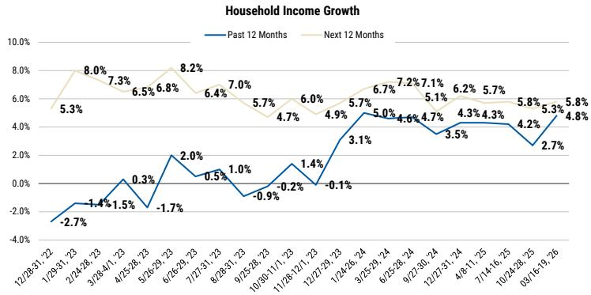

line

| Date       | Past 12 Months | Next 12 Months |
|------------|----------------|----------------|
| 12/28/31 '22 | -2.7%          | 5.3%           |
| 07/28/31 '23 | -1.4%          | 8.0%           |
| 04/28/31 '23 | -1.5%          | 7.3%           |
| 05/28/31 '23 | 0.3%           | 6.5%           |
| 06/28/31 '23 | -1.7%          | 6.8%           |
| 07/28/31 '23 | 2.0%           | 8.2%           |
| 08/28/31 '23 | 0.5%           | 6.4%           |
| 09/28/31 '23 | 1.0%           | 7.0%           |
| 10/28/31 '23 | -0.9%          | 5.7%           |
| 11/28/31 '23 | -0.2%          | 4.7%           |
| 12/28/31 '23 | 1.4%           | 6.0%           |
| 01/29/31 '24 | -0.1%          | 4.9%           |
| 04/29/31 '24 | 3.1%           | 5.7%           |
| 05/29/31 '24 | 5.0%           | 6.7%           |
| 06/29/31 '24 | 4.6%           | 7.2%           |
| 07/29/31 '24 | 4.7%           | 7.1%           |
| 08/29/31 '24 | 3.5%           | 6.2%           |
| 09/29/31 '24 | 4.3%           | 5.7%           |
| 10/29/31 '24 | 4.3%           | 5.8%           |
| 01/29/31 '25 | 4.2%           | 5.8%           |
| 03/16/31 '26 | 2.7%           | 5.3%           |
| 04/16/31 '26 | 4.8%           | 5.8%           |

Household Financial Situation Outlook   
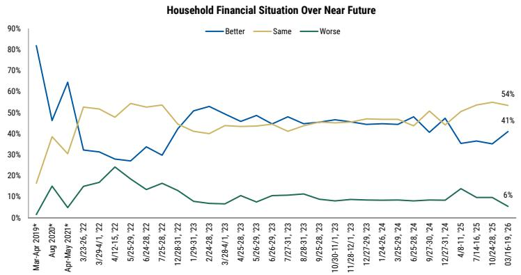

line

| Date       | Better | Same | Worse |
|------------|--------|------|-------|
| Mar-Apr 2019* | 85%    | 15%  | 0%    |
| Aug 2020*   | 45%    | 35%  | 15%   |
| Apr-May 2021*| 65%    | 30%  | 5%    |
| 3/23-26'22  | 35%    | 50%  | 15%   |
| 3/29-4/22   | 30%    | 50%  | 20%   |
| 4/12-15'22  | 25%    | 50%  | 25%   |
| 5/25-29'22  | 30%    | 50%  | 15%   |
| 6/24-28'22  | 35%    | 50%  | 15%   |
| 7/25-28'22  | 30%    | 50%  | 15%   |
| 12/28-31'22 | 45%    | 45%  | 10%   |
| 1/29-31'23  | 50%    | 40%  | 5%    |
| 2/24-28'23  | 55%    | 40%  | 5%    |
| 3/28-4/23   | 50%    | 40%  | 5%    |
| 4/25-28'23  | 45%    | 40%  | 5%    |
| 5/26-29'23  | 45%    | 40%  | 5%    |
| 6/26-29'23  | 45%    | 40%  | 5%    |
| 7/27-31'23  | 45%    | 40%  | 5%    |
| 8/28-31'23  | 45%    | 40%  | 5%    |
| 9/25-28'23  | 45%    | 40%  | 5%    |
| 10/30-11'23 | 45%    | 40%  | 5%    |
| 11/28-12'23 | 45%    | 40%  | 5%    |
| 12/27-29'23 | 45%    | 40%  | 5%    |
| 1/24-26'24  | 45%    | 40%  | 5%    |
| 3/25-29'24  | 45%    | 40%  | 5%    |
| 6/25-28'24  | 45%    | 40%  | 5%    |
| 9/27-30'24  | 40%    | 50%  | 5%    |
| 12/27-31'24 | 40%    | 40%  | 5%    |
| 1/24-31'25  | 35%    | 40%  | 5%    |
| 4/8-11'25   | 35%    | 40%  | 10%   |
| 7/14-16'25  | 35%    | 40%  | 10%   |
| 10/24-28'25 | 35%    | 40%  | 10%   |
| 03/16-19'26 | 40%    | 41%  | 6%    |

Overall spending intentions in next 3 months   
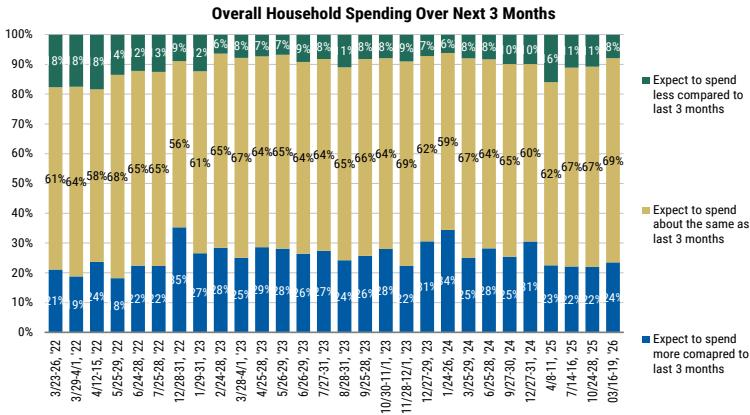

bar_stacked

| Date       | Expect to spend less compared to last 3 months | Expect to spend about the same as last 3 months |
|------------|-----------------------------------------------|------------------------------------------------|
| 3/23/26    | 8%                                            | 21%                                            |
| 3/29-41    | 8%                                            | 9%                                             |
| 4/12/15    | 8%                                            | 24%                                            |
| 5/25/22    | 4%                                            | 8%                                             |
| 6/24/28    | 2%                                            | 2%                                             |
| 7/25/28    | 3%                                            | 2%                                             |
| 12/28/31   | 9%                                            | 35%                                            |
| 1/29-31    | 2%                                            | 27%                                            |
| 2/24/28    | 5%                                            | 28%                                            |
| 3/28-41    | 8%                                            | 25%                                            |
| 4/25/28    | 7%                                            | 29%                                            |
| 5/26-29    | 7%                                            | 28%                                            |
| 6/26-29    | 9%                                            | 26%                                            |
| 7/27-31    | 8%                                            | 27%                                            |
| 8/28-31    | 1%                                            | 24%                                            |
| 9/25-28    | 8%                                            | 26%                                            |
| 10/30-11/1  | 8%                                            | 28%                                            |
| 11/28-12/1  | 9%                                            | 22%                                            |
| 12/27-29   | 7%                                            | 31%                                            |
| 1/24-26    | 5%                                            | 4%                                             |
| 3/25-29    | 8%                                            | 25%                                            |
| 6/25-28    | 8%                                            | 25%                                            |
| 9/27-30    | 0%                                            | 31%                                            |
| 12/27-31   | 0%                                            | 30%                                            |
| 4/8-11     | 6%                                            | 23%                                            |
| 7/14-16    | 1%                                            | 22%                                            |
| 10/24-28   | 1%                                            | 22%                                            |
| 03/16-19   | 8%                                            | 24%                                            |

# MS

# Job Security, Household Income and Spending Outlook by City Tier

Confidence at landing a job over next 6 months   
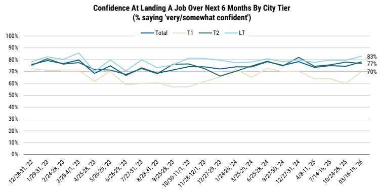

line

| Date       | Total | T1   | T2   |
| ---------- | ----- | ---- | ---- |
| 12/28/31 '22 | 75%   | 70%  | 75%  |
| 1/29/31 '23 | 78%   | 72%  | 78%  |
| 2/24/30 '23 | 76%   | 70%  | 76%  |
| 3/28/31 '23 | 74%   | 68%  | 74%  |
| 4/25/30 '23 | 72%   | 66%  | 72%  |
| 5/26/30 '23 | 70%   | 64%  | 70%  |
| 6/26/30 '23 | 68%   | 62%  | 68%  |
| 7/27/31 '23 | 66%   | 60%  | 66%  |
| 8/28/31 '23 | 68%   | 62%  | 68%  |
| 9/25/30 '23 | 70%   | 64%  | 70%  |
| 10/30/31 '23 | 72%   | 66%  | 72%  |
| 11/28/31 '23 | 74%   | 68%  | 74%  |
| 12/27/31 '23 | 76%   | 70%  | 76%  |
| 1/24/30 '24 | 78%   | 72%  | 78%  |
| 3/25/30 '24 | 80%   | 74%  | 80%  |
| 6/25/30 '24 | 82%   | 76%  | 82%  |
| 9/27/30 '24 | 84%   | 78%  | 84%  |
| 12/27/31 '24 | 86%   | 80%  | 86%  |
| 4/8/31 '25 | 88%   | 82%  | 88%  |
| 7/14/30 '25 | 90%   | 84%  | 90%  |
| 10/24/30 '25 | 92%   | 86%  | 92%  |
| 03/16/31 '26 | 94%   | 88%  | 94%  |
|            |       |      |      |
|            |       |      |      |
|            |       |      |      |
|            |       |      |      |
|            |       |      |      |
|            |       |      |      |
|            |       |      |      |
|            |       |      |      |
|            |       |      |      |
|            |       |      |      |
|            |       |      |      |
|            |       |      |      |

Household Income Expectations   
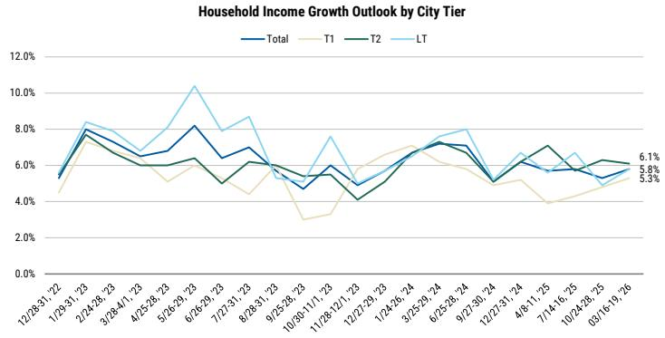

line

| Date       | Total  | T1    | T2    | LT    |
|------------|--------|-------|-------|-------|
| 12/28/31 '22 | 5.5%   | 4.5%  | 5.0%  | 5.5%  |
| 1/29/31 '23  | 7.5%   | 7.0%  | 7.5%  | 8.0%  |
| 2/24/31 '23  | 7.0%   | 6.5%  | 7.0%  | 7.5%  |
| 3/28/31 '23  | 6.5%   | 6.0%  | 6.5%  | 7.0%  |
| 4/25/31 '23  | 6.0%   | 5.5%  | 6.0%  | 6.5%  |
| 5/26/31 '23  | 8.0%   | 6.0%  | 6.5%  | 10.5% |
| 6/26/31 '23  | 7.5%   | 5.5%  | 6.0%  | 8.0%  |
| 7/27/31 '23  | 7.0%   | 5.0%  | 5.5%  | 8.5%  |
| 8/28/31 '23  | 6.5%   | 4.5%  | 5.0%  | 7.0%  |
| 9/28/31 '23  | 6.0%   | 4.0%  | 4.5%  | 6.5%  |
| 10/30/31 '23 | 5.5%   | 3.5%  | 4.0%  | 6.0%  |
| 11/28/31 '23 | 6.0%   | 4.0%  | 4.5%  | 7.5%  |
| 12/27/31 '23 | 5.5%   | 4.5%  | 5.0%  | 6.0%  |
| 1/24/31 '24  | 6.0%   | 5.0%  | 5.5%  | 7.0%  |
| 3/25/31 '24  | 6.5%   | 5.5%  | 6.0%  | 7.5%  |
| 6/25/31 '24  | 7.0%   | 6.0%  | 6.5%  | 8.0%  |
| 9/27/31 '24  | 6.5%   | 5.5%  | 6.0%  | 7.5%  |
| 12/27/31 '24 | 6.0%   | 5.0%  | 5.5%  | 7.0%  |
| 4/8/31 '25   | 6.5%   | 4.5%  | 6.0%  | 6.5%  |
| 7/14/31 '25  | 7.0%   | 4.0%  | 6.5%  | 7.0%  |
| 10/24/31 '25 | 6.5%   | 4.5%  | 6.0%  | 6.5%  |
| 03/16/31 '26 | 6.0%   | 3.3%  | 5.8%  | -     |
| -          | -      | -     | -     | -     |
| -          | -      | -     | -     | -     |
| -          | -      | -     | -     | -     |
| -          | -      | -     | -     | -     |
| -          | -      | -     | -     | -     |
| -          | -      | -     | -     | -     |
| -          | -      | -     | -     | -     |

Source: AlphaWise, MS

Spending intentions in next 3 months   
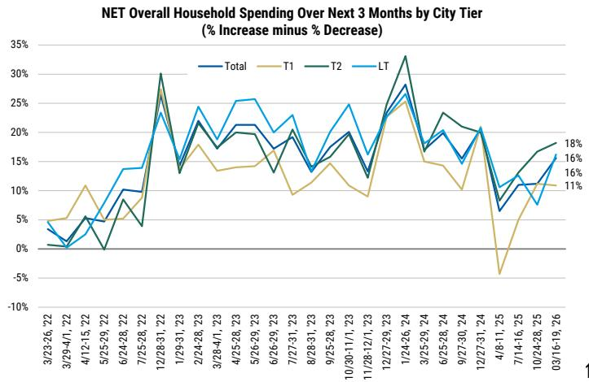

19

# MS

# Job Security, Household Income and Spending Outlook by Income Group

Confidence at landing a job over next 6 months   
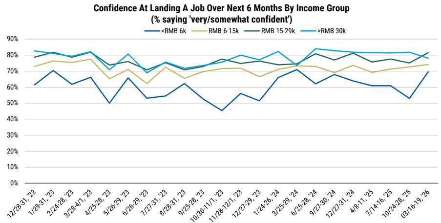

line

| Date       | <RMB 6k | RMB 6-15k | RMB 15-29k | ≥RMB 30k |
|------------|---------|-----------|------------|----------|
| 12/28/31'22 | 60%     | 75%       | 80%        | 82%      |
| 1/29/31'23  | 70%     | 76%       | 81%        | 83%      |
| 2/24/28'23  | 65%     | 77%       | 80%        | 81%      |
| 3/28/4/1'23 | 68%     | 78%       | 81%        | 82%      |
| 4/25/28'23  | 50%     | 65%       | 75%        | 78%      |
| 5/26/29'23  | 65%     | 70%       | 78%        | 80%      |
| 6/25/29'23  | 55%     | 65%       | 75%        | 78%      |
| 7/27/31'23  | 52%     | 70%       | 78%        | 75%      |
| 8/28/31'23  | 60%     | 75%       | 80%        | 78%      |
| 9/25/28'23  | 55%     | 70%       | 75%        | 78%      |
| 10/30/11'23 | 45%     | 65%       | 78%        | 80%      |
| 11/28/12'23 | 55%     | 70%       | 75%        | 78%      |
| 12/27/29'23 | 50%     | 65%       | 78%        | 75%      |
| 1/24/26'24  | 65%     | 70%       | 80%        | 82%      |
| 3/25/29'24  | 70%     | 75%       | 82%        | 78%      |
| 6/25/28'24  | 60%     | 70%       | 80%        | 80%      |
| 9/27/30'24  | 65%     | 75%       | 82%        | 78%      |
| 12/27/31'24 | 60%     | 70%       | 80%        | 75%      |
| 4/8/11'25   | 60%     | 75%       | 82%        | 78%      |
| 7/14/16'25  | 55%     | 70%       | 80%        | 75%      |
| 10/24/28'25 | 50%     | 65%       | 78%        | 78%      |
| 03/16/19'26 | 70%     | 75%       | 80%        | 78%      |

Household Income Expectations   
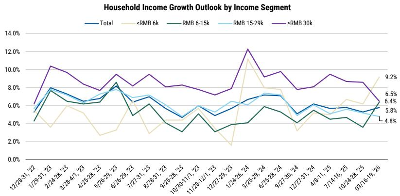  
Source: AlphaWise, MS

Spending intentions in next 3 months   
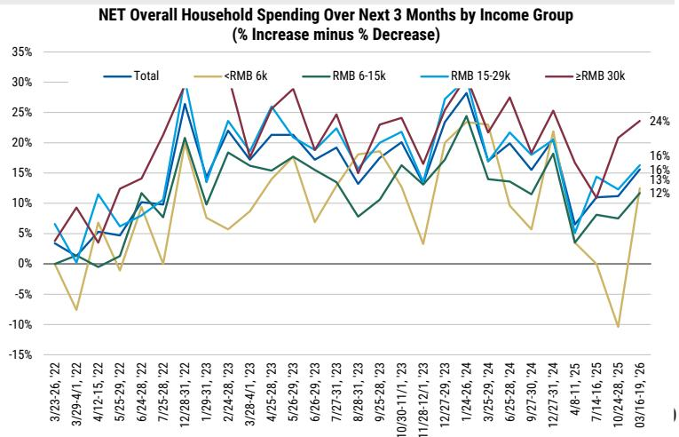

line

| Date       | Total | <RMB 6k | RMB 6-15k | RMB 15-29k | ≥RMB 30k |
|------------|-------|---------|-----------|------------|----------|
| 3/23-26-22 | 5%    | -10%    | 0%        | 5%         | 10%      |
| 3/29-4/1-22 | 10%   | -5%     | 0%        | 10%        | 15%      |
| 4/12-15-22 | 15%   | 0%      | 0%        | 15%        | 20%      |
| 5/25-29-22 | 20%   | 5%      | 5%        | 20%        | 25%      |
| 6/24-28-22 | 25%   | 10%     | 10%       | 25%        | 30%      |
| 7/25-28-22 | 30%   | 15%     | 15%       | 30%        | 35%      |
| 12/28-31-22| 35%   | 20%     | 20%       | 35%        | 40%      |
| 1/29-31-23 | 40%   | 25%     | 25%       | 40%        | 45%      |
| 2/24-31-23 | 45%   | 30%     | 30%       | 45%        | 50%      |
| 3/28-4/1-23 | 50%   | 35%     | 35%       | 50%        | 55%      |
| 4/25-28-23 | 55%   | 40%     | 40%       | 55%        | 60%      |
| 5/26-29-23 | 60%   | 45%     | 45%       | 60%        | 65%      |
| 6/26-29-23 | 65%   | 50%     | 50%       | 65%        | 70%      |
| 7/27-31-23 | 70%   | 55%     | 55%       | 70%        | 75%      |
| 8/28-31-23 | 75%   | 60%     | 60%       | 75%        | 80%      |
| 9/25-28-23 | 80%   | 65%     | 65%       | 80%        | 85%      |
| 10/30-11/1-23| 85%   | 70%     | 70%       | 85%        | 90%      |
| 11/30-12/1-23| 90%   | 75%     | 75%       | 90%        | 95%      |
| 12/27-29-23| 95%   | 80%     | 80%       | 95%        | 100%     |
| 1/24-26-24 | 100%  | 85%     | 85%       | 100%       | 105%     |
| 3/25-29-24 | 105%  | 90%     | 90%       | 105%       | 110%     |
| 6/25-28-24 | 110%  | 95%     | 95%       | 110%       | 115%     |
| 9/27-30-24 | 115%  | 100%    | 100%      | 115%       | 120%     |
| 12/27-31-24| 120%  | 105%    | 105%      | 120%       | 125%     |
| 4/8-11-25   | 125%  | -10%    | -10%      | -10%       | -10%     |
| 7/14-16-25   | -13%   | -15%    | -15%      | -13%       | -13%     |
| 10/24-28-25*| -13.5%| -16.5%   | -16.5%     | -13.5%     | -13.5%   |
| 03/16-19-26*| -13.5%| -16.5%   | -16.5%     | -13.5%     | -13.5%   |

# MS

# Category Spending Trends

Category Spending Next Quarter vs. Last Quarter   
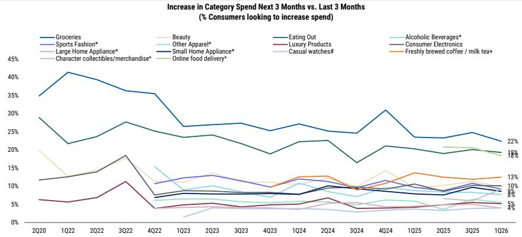

Category Trading Up vs. Down in Last Quarter   
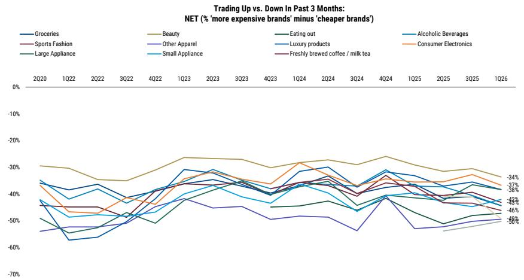

line

| Quarter | Groceries | Beauty | Eating out | Sports Fashion | Other Apparel | Luxury products | Consumer Electronics | Large Appliance | Small Appliance | Freshly brewed coffee / milk tea |
|---------|-----------|--------|------------|----------------|---------------|-----------------|----------------------|-----------------|-----------------|----------------------------------|
| 1Q26    | -34%      | -34%   | -37%       | -38%           | -46%          | -43%            | -46%                 | -50%            | -50%            | -50%                             |

Source: AlphaWise, MS. In Wave 16 (12/28-31, '22), question wording changed by adding an answer choice “no plan to spend” which may affect comparability with previous surveys. Categories with \*, #, + and ^ sign are newly added in Wave 16 (12/28-31, '22), Wave 19 (3/28-4/1, '23), Wave 26 (10/30-11/1, '23) and Wave 35 (7/14-16, '25) respectively.

# MS

# Asset Allocation

% Consumers Investing in Various Assets   
% Consumers Investing in Various Assets This Year   
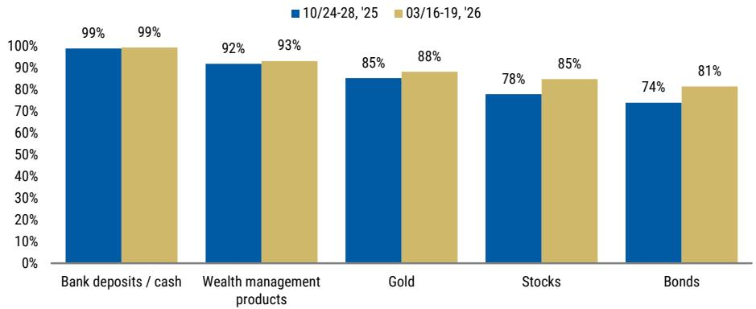

bar

| Category | 10/24-28, '25 (%) | 03/16-19, '26 (%) |
| :--- | :--- | :--- |
| Bank deposits / cash | 99 | 99 |
| Wealth management products | 92 | 93 |
| Gold | 85 | 88 |
| Stocks | 78 | 85 |
| Bonds | 74 | 81 |

Investment in Various Assets by Income

NET Score of Investment in Various Assets This Year by Income (% Increase minus % Decrease) (Among Category Investors)   
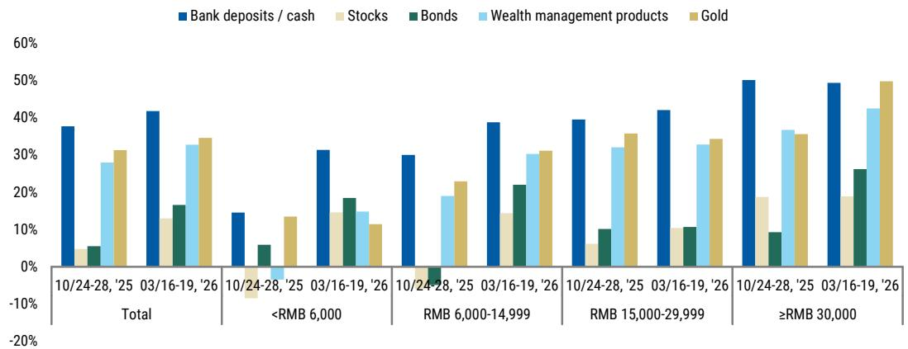

bar

| Category | Bank deposits / cash (%) | Stocks (%) | Bonds (%) | Wealth management products (%) | Gold (%) |
| :--- | :--- | :--- | :--- | :--- | :--- |
| Total | 37 | 5 | 5 | 28 | 31 |
| 10/24-28, '25 | 42 | 13 | 17 | 33 | 35 |
| 03/16-19, '26 | 14 | -8 | 6 | 15 | 13 |
| <RMB 6,000 | 31 | 14 | 18 | 15 | 11 |
| RMB 6,000-14,999 | 30 | -2 | 22 | 30 | 23 |
| RMB 15,000-29,999 | 39 | 6 | 10 | 32 | 36 |
| ≥RMB 30,000 | 50 | 19 | 9 | 37 | 36 |

Source: AlphaWise, MS

MS

# Recent Consumer Data Trends

# MS

# Recent Traffic Data

Traffic Data YoY   
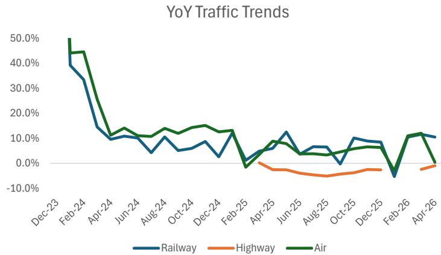

line

| Month    | Railway | Highway | Air   |
| -------- | ------- | ------- | ----- |
| Dec-23   | 40.0%   | 50.0%   | 50.0% |
| Feb-24   | 35.0%   | 45.0%   | 45.0% |
| Apr-24   | 10.0%   | 10.0%   | 10.0% |
| Jun-24   | 10.0%   | 10.0%   | 15.0% |
| Aug-24   | 5.0%    | 10.0%   | 10.0% |
| Oct-24   | 10.0%   | 10.0%   | 15.0% |
| Dec-24   | 5.0%    | 10.0%   | 15.0% |
| Feb-25   | 0.0%    | -5.0%   | -5.0% |
| Apr-25   | 5.0%    | -5.0%   | 5.0%  |
| Jun-25   | 15.0%   | -5.0%   | 5.0%  |
| Aug-25   | 5.0%    | -5.0%   | 5.0%  |
| Oct-25   | 10.0%   | -5.0%   | 5.0%  |
| Dec-25   | 5.0%    | -5.0%   | 5.0%  |
| Feb-26   | -5.0%   | -5.0%   | -5.0% |
| Apr-26   | 10.0%   | -5.0%   | 10.0% |

Source: Wind, MS

Mainland China – RevPAR YoY   
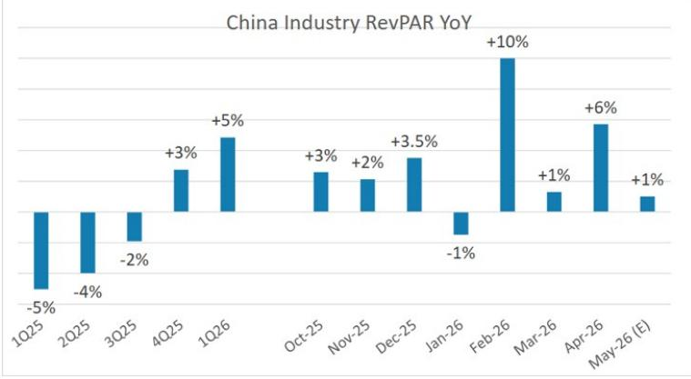

bar

China Industry RevPAR YoY
| Quarter | RevPAR YoY (%) |
|---|---|
| 1Q25 | -5 |
| 2Q25 | -4 |
| 3Q25 | -2 |
| 4Q25 | +3 |
| 1Q26 | +5 |
| Oct-25 | +3 |
| Nov-25 | +2 |
| Dec-25 | +3.5 |
| Jan-26 | -1 |
| Feb-26 | +10 |
| Mar-26 | +1 |
| Apr-26 | +6 |
| May-26 (E) | +1 |

Source: STR, May-26 number estimated by MS.

Mall Traffic   
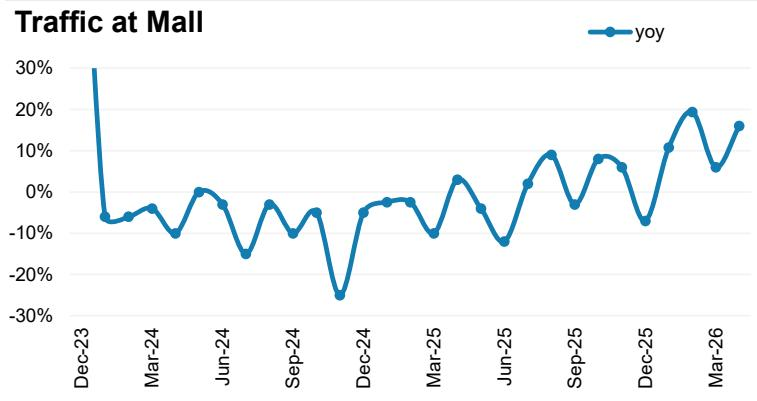

line

| Month   | yoy    |
| ------- | ------ |
| Dec-23  | 30%    |
| Mar-24  | -5%    |
| Jun-24  | -10%   |
| Sep-24  | -5%    |
| Dec-24  | -25%   |
| Mar-25  | -5%    |
| Jun-25  | 5%     |
| Sep-25  | 10%    |
| Dec-25  | -10%   |
| Mar-26  | 20%    |

Source: Sensormatic, MS

China's RevPAR YoY by Chainscale   
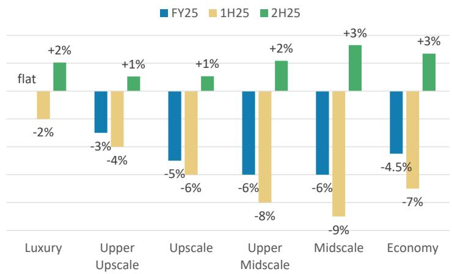

bar

| Category | FY25 (%) | 1H25 (%) | 2H25 (%) |
| :--- | :--- | :--- | :--- |
| Luxury | -3 | -2 | +2 |
| Upper Upscale | -3 | -4 | +1 |
| Upscale | -5 | -6 | +1 |
| Upper Midscale | -6 | -8 | +2 |
| Midscale | -6 | -9 | +3 |
| Economy | -4.5 | -7 | +3 |

Source: STR, MS.

# MS

Holiday Traffic Trend 

<table><tr><td>Total</td><td></td><td>Absolute number</td><td>YoY</td><td>vs. 2019</td></tr><tr><td rowspan="3">2024 CNY (8 Days)</td><td>Pax (mn)</td><td>474</td><td>34.3%</td><td>19.0%</td></tr><tr><td>Travel Revenue (Rmb bn)</td><td>633</td><td>47.3%</td><td>7.7%</td></tr><tr><td>Revenue per pax (Rmb)</td><td>1,335</td><td>-4.3%</td><td>-9.5%</td></tr><tr><td rowspan="3">2024 Qing Ming (3 Days)</td><td>Pax (mn)</td><td>119</td><td></td><td>11.5%</td></tr><tr><td>Travel Revenue (Rmb bn)</td><td>54</td><td></td><td>12.7%</td></tr><tr><td>Revenue per pax (Rmb)</td><td>453</td><td></td><td>1.0%</td></tr><tr><td rowspan="3">2024 Labor Day (5 Days)</td><td>Pax (mn)</td><td>295</td><td>7.7%</td><td>28.2%</td></tr><tr><td>Travel Revenue (Rmb bn)</td><td>167</td><td>12.7%</td><td>13.5%</td></tr><tr><td>Revenue per pax</td><td>566</td><td>4.7%</td><td>-11.5%</td></tr><tr><td rowspan="3">2024 National Day (7 Days)</td><td>Pax (mn)</td><td>765</td><td>5.9%</td><td>10.2%</td></tr><tr><td>Travel Revenue (Rmb bn)</td><td>701</td><td>6.3%</td><td>7.9%</td></tr><tr><td>Revenue per pax</td><td>916</td><td>0.4%</td><td>-2.1%</td></tr><tr><td rowspan="3">2025 CNY (8 Days)</td><td>Pax (mn)</td><td>501</td><td>5.9%</td><td>26.0%</td></tr><tr><td>Travel Revenue (Rmb bn)</td><td>677</td><td>7.0%</td><td>15.2%</td></tr><tr><td>Revenue per pax (Rmb)</td><td>1,351</td><td>1.2%</td><td>-8.4%</td></tr><tr><td rowspan="3">2025 Qing Ming (3 Days)</td><td>Pax (mn)</td><td>126</td><td>6.3%</td><td>12.5%</td></tr><tr><td>Travel Revenue (Rmb bn)</td><td>58</td><td>6.7%</td><td>20.2%</td></tr><tr><td>Revenue per pax (Rmb)</td><td>457</td><td>0.7%</td><td>6.8%</td></tr><tr><td rowspan="3">2025 Labor Day (5 Days)</td><td>Pax (mn)</td><td>314</td><td>6.4%</td><td>28.8%</td></tr><tr><td>Travel Revenue (Rmb bn)</td><td>180</td><td>8.0%</td><td>22.5%</td></tr><tr><td>Revenue per pax</td><td>574</td><td>1.5%</td><td>-10.1%</td></tr><tr><td rowspan="3">2025 National Day (8 Days)</td><td>Pax (mn)</td><td>888</td><td>16.1%</td><td>27.9%</td></tr><tr><td>Travel Revenue (Rmb bn)</td><td>809</td><td>15.4%</td><td>24.6%</td></tr><tr><td>Revenue per pax</td><td>911</td><td>-0.6%</td><td>-2.6%</td></tr><tr><td rowspan="3">2026 CNY (9 Days)</td><td>Pax (mn)</td><td>596</td><td>19.0%</td><td>49.9%</td></tr><tr><td>Travel Revenue (Rmb bn)</td><td>803</td><td>18.7%</td><td>36.8%</td></tr><tr><td>Revenue per pax (Rmb)</td><td>1,348</td><td>-0.2%</td><td>-8.6%</td></tr><tr><td rowspan="3">2026 Qing Ming (3 Days)</td><td>Pax (mn)</td><td>135</td><td>6.8%</td><td>20.5%</td></tr><tr><td>Travel Revenue (Rmb bn)</td><td>61</td><td>6.6%</td><td>28.1%</td></tr><tr><td>Revenue per pax (Rmb)</td><td>455</td><td>-0.5%</td><td>6.3%</td></tr><tr><td rowspan="3">2026 Labor Day (5 Days)</td><td>Pax (mn)</td><td>325</td><td>3.6%</td><td>33.3%</td></tr><tr><td>Travel Revenue (Rmb bn)</td><td>185</td><td>2.9%</td><td>26.1%</td></tr><tr><td>Revenue per pax (Rmb)</td><td>571</td><td>-0.6%</td><td>-10.7%</td></tr></table>

Source: NBS, MS

# MS

# Hainan Travel Retail

Duty-Free Sales   
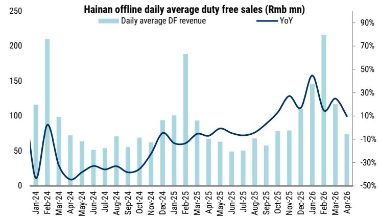

bar_line

Hainan offline daily average duty free sales (Rmb mn)
| Month | Daily average DF revenue (Rmb mn) | YoY (%) |
|---|---|---|
| Jan-24 | 115 | -10 |
| Feb-24 | 210 | 8 |
| Mar-24 | 98 | -30 |
| Apr-24 | 72 | -35 |
| May-24 | 62 | -25 |
| Jun-24 | 50 | -20 |
| Jul-24 | 53 | -25 |
| Aug-24 | 70 | -20 |
| Sep-24 | 55 | -15 |
| Oct-24 | 68 | -10 |
| Nov-24 | 60 | -5 |
| Dec-24 | 92 | 10 |
| Jan-25 | 100 | -10 |
| Feb-25 | 188 | -15 |
| Mar-25 | 92 | -10 |
| Apr-25 | 68 | -10 |
| May-25 | 62 | -10 |
| Jun-25 | 48 | -10 |
| Jul-25 | 48 | -10 |
| Aug-25 | 65 | -10 |
| Sep-25 | 57 | -10 |
| Oct-25 | 77 | 10 |
| Nov-25 | 77 | 30 |
| Dec-25 | 143 | 15 |
| Jan-26 | 218 | 45 |
| Feb-26 | 113 | 10 |
| Mar-26 | 118 | 30 |
| Apr-26 | 73 | 10 |

Source: Haikou Customs, MS

Shoppers   
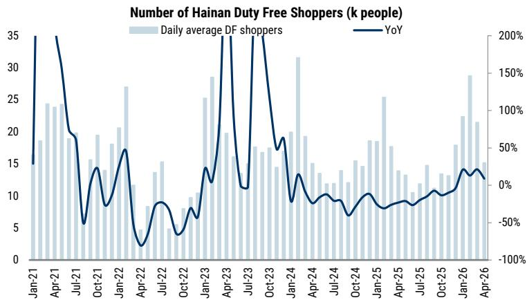

bar_line

| Date   | Daily average DF shoppers (k people) | YoY (%) |
|--------|--------------------------------------|---------|
| Jan-21 | 18                                   | 350     |
| Apr-21 | 24                                   | 350     |
| Jul-21 | 19                                   | 100     |
| Oct-21 | 17                                   | 50      |
| Jan-22 | 27                                   | 150     |
| Apr-22 | 8                                    | -50     |
| Jul-22 | 15                                   | 50      |
| Oct-22 | 10                                   | 0       |
| Jan-23 | 28                                   | 150     |
| Apr-23 | 16                                   | 350     |
| Jul-23 | 17                                   | 100     |
| Oct-23 | 18                                   | 350     |
| Jan-24 | 32                                   | 100     |
| Apr-24 | 19                                   | 50      |
| Jul-24 | 14                                   | 0       |
| Oct-24 | 18                                   | -50     |
| Jan-25 | 25                                   | 0       |
| Apr-25 | 17                                   | -50     |
| Jul-25 | 13                                   | -50     |
| Oct-25 | 18                                   | 0       |
| Jan-26 | 29                                   | 50      |
| Apr-26 | 21                                   | 0       |

Source: Haikou Customs, MS

Purchase Volume Per Shopper & ASP Per Product   
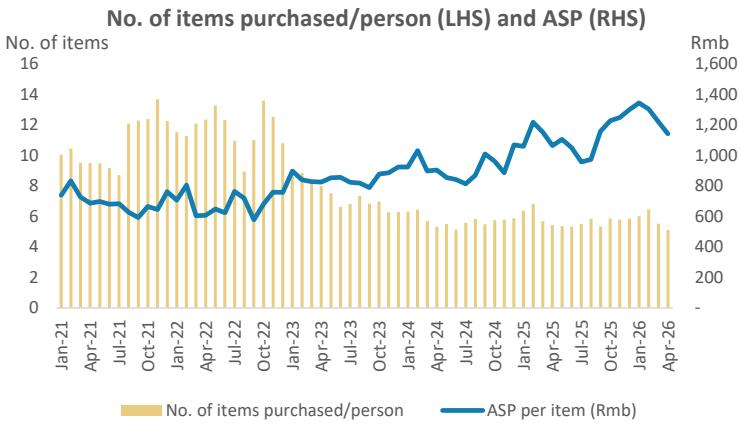

bar_line

| Month    | No. of items purchased/person | ASP per item (Rmb) |
| -------- | ---------------------------- | ------------------ |
| Jan-21   | 10                           | 800                |
| Apr-21   | 9                            | 700                |
| Jul-21   | 12                           | 650                |
| Oct-21   | 14                           | 750                |
| Jan-22   | 13                           | 850                |
| Apr-22   | 12                           | 700                |
| Jul-22   | 13                           | 750                |
| Oct-22   | 14                           | 800                |
| Jan-23   | 11                           | 900                |
| Apr-23   | 8                            | 850                |
| Jul-23   | 7                            | 800                |
| Oct-23   | 7                            | 850                |
| Jan-24   | 6                            | 950                |
| Apr-24   | 6                            | 900                |
| Jul-24   | 6                            | 850                |
| Oct-24   | 6                            | 1000               |
| Jan-25   | 7                            | 1100               |
| Apr-25   | 6                            | 1050               |
| Jul-25   | 6                            | 950                |
| Oct-25   | 6                            | 1150               |
| Jan-26   | 6                            | 1300               |
| Apr-26   | 5                            | 1150               |

Source: Haikou Customs, MS

Overall Hainan Retail Sales By Categories   
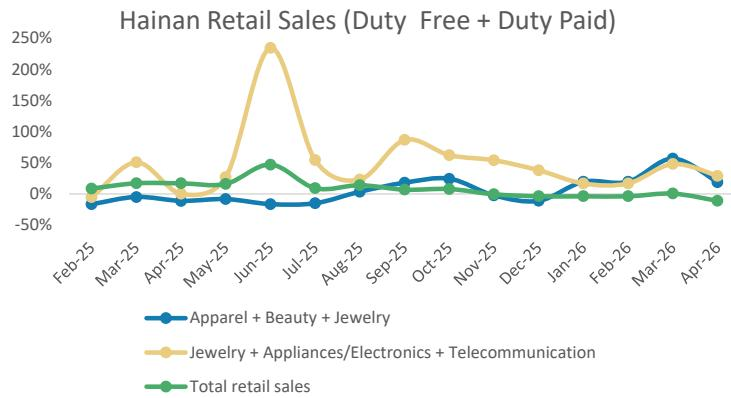

line

| Month    | Apparel + Beauty + Jewelry | Jewelry + Appliances/Electronics + Telecommunication | Total retail sales |
| -------- | --------------------------- | ----------------------------------------------------- | ------------------ |
| Feb-25   | -10%                        | 10%                                                   | 10%                |
| Mar-25   | -5%                         | 50%                                                   | 20%                |
| Apr-25   | -10%                        | 10%                                                   | 15%                |
| May-25   | -5%                         | 30%                                                   | 20%                |
| Jun-25   | -10%                        | 240%                                                  | 40%                |
| Jul-25   | -10%                        | 50%                                                   | 10%                |
| Aug-25   | -5%                         | 20%                                                   | 5%                 |
| Sep-25   | 10%                         | 90%                                                   | 5%                 |
| Oct-25   | 20%                         | 60%                                                   | 5%                 |
| Nov-25   | 10%                         | 50%                                                   | 5%                 |
| Dec-25   | -10%                        | 30%                                                   | 0%                 |
| Jan-26   | 10%                         | 20%                                                   | 0%                 |
| Feb-26   | 10%                         | 10%                                                   | 0%                 |
| Mar-26   | 60%                         | 40%                                                   | 5%                 |
| Apr-26   | 20%                         | 30%                                                   | -10%               |

Source: Government of Hainan Province, MS

# MS

# Gold Jewelry and Luxury Retail Sales

Chow Tai Fook Same-Store-Sales-Growth   
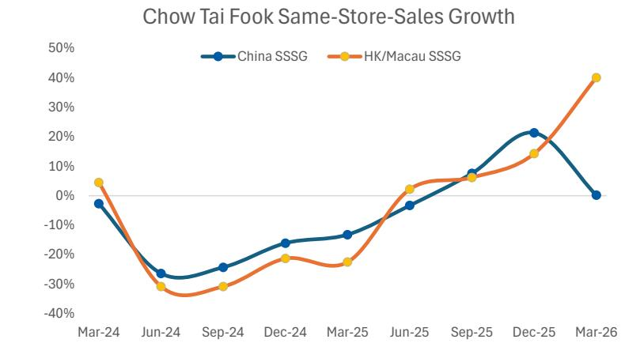

line

| Month   | China SSSG | HK/Macau SSSG |
|---------|------------|---------------|
| Mar-24  | -3%        | 5%            |
| Jun-24  | -25%       | -30%          |
| Sep-24  | -20%       | -28%          |
| Dec-24  | -15%       | -18%          |
| Mar-25  | -10%       | -20%          |
| Jun-25  | -5%        | 5%            |
| Sep-25  | 10%        | 10%           |
| Dec-25  | 20%        | 15%           |
| Mar-26  | 0%         | 40%           |

Source: Company data, MS

Chow Tai Fook Product Mix   
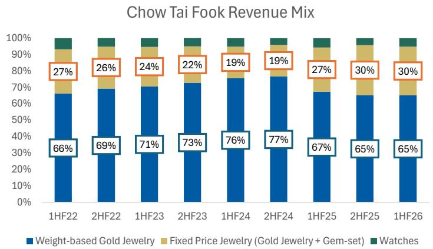

bar_stacked

| Period | Weight-based Gold Jewelry | Fixed Price Jewelry (Gold Jewelry + Gem-set) | Watches |
|--------|---------------------------|---------------------------------------------|---------|
| 1HF22  | 66%                       | 27%                                         | -       |
| 2HF22  | 69%                       | 26%                                         | -       |
| 1HF23  | 71%                       | 24%                                         | -       |
| 2HF23  | 73%                       | 22%                                         | -       |
| 1HF24  | 76%                       | 19%                                         | -       |
| 2HF24  | 77%                       | 19%                                         | -       |
| 1HF25  | 67%                       | 27%                                         | -       |
| 2HF25  | 65%                       | 30%                                         | -       |
| 1HF26  | 65%                       | 30%                                         | -       |

Source: Company data, MS

Hang Lung Properties – Tenant Retail Sales Growth   
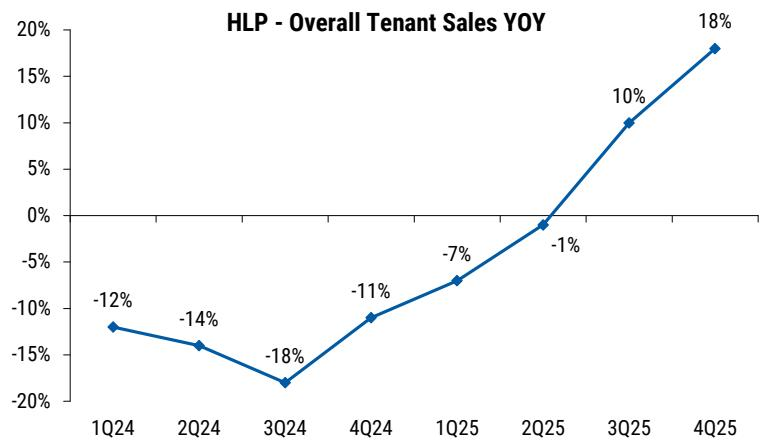

line

| Quarter | YOY Change |
| ------- | ---------- |
| 1Q24    | -12%       |
| 2Q24    | -14%       |
| 3Q24    | -18%       |
| 4Q24    | -11%       |
| 1Q25    | -7%        |
| 2Q25    | -1%        |
| 3Q25    | 10%        |
| 4Q25    | 18%        |

Source: Company data, MS

Swire Properties – Tenant Retail Sales Growth   
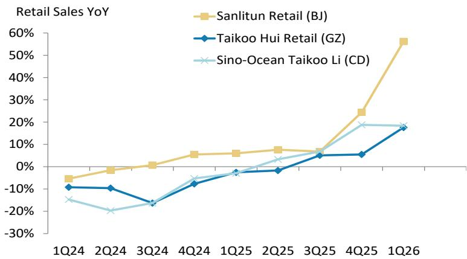

line

| Quarter | Sanlitun Retail (BJ) | Taikoo Hui Retail (GZ) | Sino-Ocean Taikoo Li (CD) |
| ------- | -------------------- | ---------------------- | ------------------------- |
| 1Q24    | -5%                  | -10%                   | -15%                      |
| 2Q24    | -2%                  | -10%                   | -20%                      |
| 3Q24    | 0%                   | -18%                   | -18%                      |
| 4Q24    | 5%                   | -5%                    | -5%                       |
| 1Q25    | 5%                   | -2%                    | -2%                       |
| 2Q25    | 7%                   | -2%                    | 0%                        |
| 3Q25    | 7%                   | 5%                     | 5%                        |
| 4Q25    | 25%                  | 5%                     | 18%                       |
| 1Q26    | 55%                  | 18%                    | 18%                       |

Source: Company data, MS

27

# MS

# Leading Restaurant SSSG Trend

SSSG – YUMC and Brands   
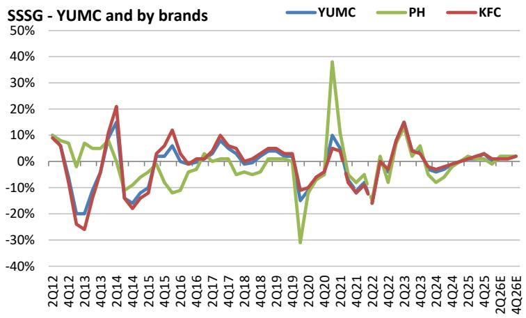

line

| Quarter | YUMC  | PH    | KFC   |
|---------|-------|-------|-------|
| 2Q12    | 10%   | 10%   | 10%   |
| 4Q12    | -20%  | -20%  | -20%  |
| 2Q13    | -20%  | -20%  | -20%  |
| 4Q13    | 10%   | 10%   | 10%   |
| 2Q14    | 15%   | 15%   | 20%   |
| 4Q14    | -15%  | -15%  | -15%  |
| 2Q15    | -10%  | -10%  | -10%  |
| 4Q15    | 5%    | 5%    | 5%    |
| 2Q16    | 0%    | 0%    | 0%    |
| 4Q16    | 5%    | 5%    | 5%    |
| 2Q17    | 10%   | 10%   | 10%   |
| 4Q17    | 5%    | 5%    | 5%    |
| 2Q18    | 0%    | 0%    | 0%    |
| 4Q18    | -5%   | -5%   | -5%   |
| 2Q19    | -5%   | -5%   | -5%   |
| 4Q19    | -10%  | -10%  | -10%  |
| 2Q20    | -30%  | -30%  | -30%  |
| 4Q20    | -5%   | -5%   | -5%   |
| 2Q21    | 10%   | 40%   | 5%    |
| 4Q21    | -5%   | -5%   | -5%   |
| 2Q22    | -10%  | -10%  | -10%  |
| 4Q22    | -5%   | -5%   | -5%   |
| 2Q23    | 0%    | 0%    | 0%    |
| 4Q23    | -5%   | -5%   | -5%   |
| 2Q24    | -5%   | -5%   | -5%   |
| 4Q24    | -5%   | -5%   | -5%   |
| 2Q25    | -5%   | -5%   | -5%   |
| 4Q25    | -5%   | -5%   | -5%   |
| 2Q26E   | -5%   | -5%   | -5%   |
| 4Q26E   | -5%   | -5%   | -5%   |

KFC SSSG Breakdown: Traffic vs. Pricing

KFC - SSSG breakdown, by traffic and ticket avg.   
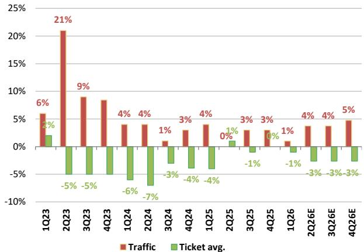

bar

| Quarter | Traffic | Ticket avg. |
| ------- | ------- | ----------- |
| 1Q23    | 6%      | 2%          |
| 2Q23    | 21%     | -5%         |
| 3Q23    | 9%      | -5%         |
| 4Q23    | 8%      | -6%         |
| 1Q24    | 4%      | -7%         |
| 2Q24    | 4%      | -3%         |
| 3Q24    | 1%      | -4%         |
| 4Q24    | 3%      | -4%         |
| 1Q25    | 4%      | -4%         |
| 2Q25    | 0%      | 1%          |
| 3Q25    | 3%      | -1%         |
| 4Q25    | 3%      | -1%         |
| 1Q26    | 1%      | -3%         |
| 2Q26E   | 4%      | -3%         |
| 3Q26E   | 4%      | -3%         |
| 4Q26E   | 5%      | -3%         |

Source: Company data, MS (E) estimates

Haidilao's Table Turn YOY   
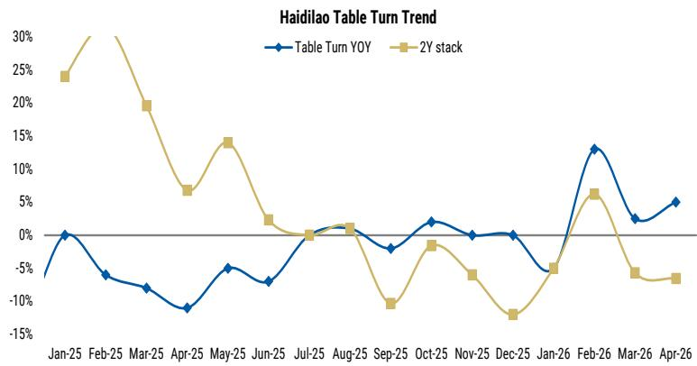

line

| Month    | Table Turn YOY | 2Y stack |
| -------- | -------------- | -------- |
| Jan-25   | -5%            | 25%      |
| Feb-25   | -7%            | 30%      |
| Mar-25   | -8%            | 20%      |
| Apr-25   | -11%           | 7%       |
| May-25   | -5%            | 15%      |
| Jun-25   | -8%            | 3%       |
| Jul-25   | 0%             | 0%       |
| Aug-25   | 1%             | 1%       |
| Sep-25   | -3%            | -10%     |
| Oct-25   | 2%             | -3%      |
| Nov-25   | 0%             | -5%      |
| Dec-25   | -1%            | -13%     |
| Jan-26   | -5%            | -5%      |
| Feb-26   | 14%            | 7%       |
| Mar-26   | 3%             | -5%      |
| Apr-26   | 5%             | -7%      |

PH SSSG Breakdown: Traffic vs. Pricing   
PH - SSSG breakdown, by traffic and ticket avg.   
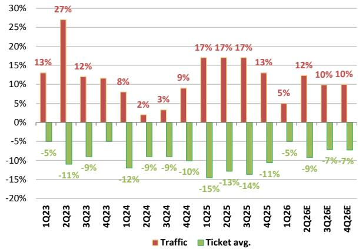

bar

| Quarter | Traffic (%) | Ticket avg. (%) |
| :--- | :--- | :--- |
| 1Q23 | 13 | -5 |
| 2Q23 | 27 | -11 |
| 3Q23 | 12 | -9 |
| 4Q23 | 11.5 | -4 |
| 1Q24 | 8 | -12 |
| 2Q24 | 2 | -9 |
| 3Q24 | 3 | -9 |
| 4Q24 | 9 | -10 |
| 1Q25 | 17 | -15 |
| 2Q25 | 17 | -13 |
| 3Q25 | 17 | -14 |
| 4Q25 | 13 | -11 |
| 1Q26 | 5 | -5 |
| 2Q26E | 12 | -9 |
| 3Q26E | 10 | -7 |
| 4Q26E | 10 | -7 |

# MS

Sportswear: Quarterly Sales Tracker 

<table><tr><td>China Sales yoy growth</td><td>1Q23</td><td>2Q23</td><td>3Q23</td><td>4Q23</td><td>1Q24</td><td>2Q24</td><td>3Q24</td><td>4Q24</td><td>1Q25</td><td>2Q25</td><td>3Q25</td><td>4Q25</td><td>1Q26</td></tr><tr><td colspan="14">Leading Brands</td></tr><tr><td>Nike</td><td>1%</td><td>25%</td><td>12%</td><td>8%</td><td>6%</td><td>7%</td><td>-3%</td><td>-11%</td><td>-15%</td><td>-20%</td><td>-10%</td><td>-16%</td><td></td></tr><tr><td>Adidas</td><td>-9%</td><td>16%</td><td>6%</td><td>37%</td><td>8%</td><td>9%</td><td>9%</td><td>16%</td><td>13%</td><td>2%</td><td>6%</td><td>15%</td><td>17%</td></tr><tr><td>ANTA</td><td>5%</td><td>8%</td><td>7%</td><td>18%</td><td>5%</td><td>8%</td><td>5%</td><td>9%</td><td>7%</td><td>2%</td><td>3%</td><td>0%</td><td>8%</td></tr><tr><td>Li Ning</td><td>4%</td><td>16%</td><td>5%</td><td>22%</td><td>2%</td><td>-3%</td><td>-5%</td><td>7%</td><td>3%</td><td>2%</td><td>-4%</td><td>-3%</td><td>6%</td></tr><tr><td>FILA</td><td>9%</td><td>18%</td><td>11%</td><td>26%</td><td>9%</td><td>6%</td><td>-1%</td><td>9%</td><td>9%</td><td>7%</td><td>3%</td><td>6%</td><td>11%</td></tr><tr><td>Skechers</td><td></td><td></td><td></td><td></td><td>13%</td><td>3%</td><td>-6%</td><td>-11%</td><td>-16%</td><td>-8%</td><td></td><td></td><td></td></tr><tr><td>Pou Sheng</td><td>7%</td><td>17%</td><td>-4%</td><td>9%</td><td>-7%</td><td>-11%</td><td>-11%</td><td>-3%</td><td>-5%</td><td>-12%</td><td>-6%</td><td>-5%</td><td>-1%</td></tr><tr><td colspan="14">Niche/Premium Brands</td></tr><tr><td>Lululemon (Sales)</td><td>79%</td><td>61%</td><td>53%</td><td>75%</td><td>52%</td><td>37%</td><td>36%</td><td>39%</td><td>22%</td><td>24%</td><td>47%</td><td>28%</td><td></td></tr><tr><td>Lululemon (SSSG &amp; E-com)</td><td></td><td></td><td></td><td>60%</td><td>33%</td><td>23%</td><td>24%</td><td>27%</td><td>8%</td><td>16%</td><td>25%</td><td>26%</td><td></td></tr><tr><td>Asics</td><td>35%</td><td>37%</td><td>11%</td><td>9%</td><td>16%</td><td>26%</td><td>15%</td><td>29%</td><td>19%</td><td>21%</td><td>25%</td><td>20%</td><td></td></tr><tr><td>Amer Sports</td><td>58%</td><td>124%</td><td>43%</td><td>45%</td><td>50%</td><td>54%</td><td>56%</td><td>54%</td><td>43%</td><td>42%</td><td>47%</td><td>42%</td><td>45%</td></tr><tr><td>MLB</td><td>40%</td><td>33%</td><td>39%</td><td>77%</td><td>16%</td><td>10%</td><td>-8%</td><td>-3%</td><td>0%</td><td>7%</td><td>9%</td><td>11%</td><td></td></tr><tr><td>Descente</td><td>73%</td><td>67%</td><td>43%</td><td>53%</td><td>20%</td><td>35%</td><td>35%</td><td>46%</td><td>55%</td><td>45%</td><td>30%</td><td>26%</td><td>34%</td></tr><tr><td>Kolon</td><td>100%</td><td>100%</td><td>67%</td><td>67%</td><td>50%</td><td>60%</td><td>65%</td><td>63%</td><td>95%</td><td>75%</td><td>70%</td><td>55%</td><td>54%</td></tr><tr><td>MAIA Active</td><td></td><td></td><td></td><td></td><td></td><td></td><td></td><td></td><td>30%</td><td>30%</td><td>45%</td><td>28%</td><td>32%</td></tr><tr><td>Saucony</td><td></td><td></td><td></td><td></td><td></td><td></td><td></td><td>50%</td><td>&gt;40%</td><td>&gt;20%</td><td>&gt;20%</td><td>&gt;30%</td><td>&gt;20%</td></tr><tr><td colspan="14">Value Brands</td></tr><tr><td>Fast Retailing (Uniqlo)</td><td>5%</td><td>47%</td><td>14%</td><td>21%</td><td>-2%</td><td>-4%</td><td>0%</td><td>-3%</td><td>-2%</td><td>-2%</td><td>-6%</td><td>5%</td><td></td></tr><tr><td>Xtep</td><td>20%</td><td>19%</td><td>18%</td><td>33%</td><td>9%</td><td>10%</td><td>5%</td><td>8%</td><td>MSD%</td><td>LSD%</td><td>LSD%</td><td>Flat</td><td>LSD%</td></tr><tr><td>361 Degrees-Offline Core</td><td colspan="2">Low-teens Low-teens</td><td>15%</td><td>21%</td><td>19%</td><td>10%</td><td>10%</td><td>10%</td><td>10-15%</td><td>10%</td><td>10%</td><td>10%</td><td>10%</td></tr></table>

# MS

# Liquor Pricing Trend

Channel Mark-up   
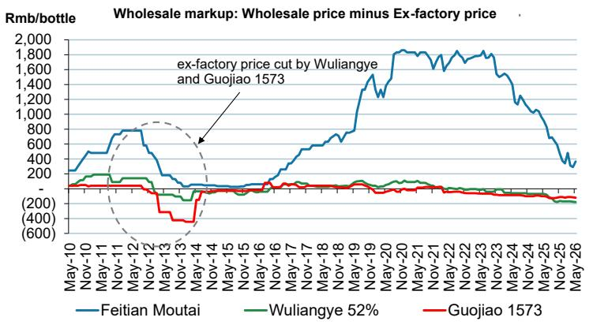

line

| Date    | Feitian Moutai | Wuliangye 52% | Guojiao 1573 |
|---------|----------------|---------------|--------------|
| May-10  | ~200           | ~100          | ~0           |
| Nov-10  | ~400           | ~150          | ~0           |
| May-11  | ~600           | ~200          | ~0           |
| Nov-11  | ~800           | ~250          | ~0           |
| May-12  | ~800           | ~200          | ~0           |
| Nov-12  | ~600           | ~150          | ~0           |
| May-13  | ~400           | ~100          | ~-200        |
| Nov-13  | ~200           | ~50           | ~-400        |
| May-14  | ~100           | ~0            | ~-600        |
| Nov-14  | ~100           | ~0            | ~-600        |
| May-15  | ~100           | ~0            | ~-600        |
| Nov-15  | ~150           | ~50           | ~-600        |
| May-16  | ~200           | ~100          | ~-600        |
| Nov-16  | ~300           | ~150          | ~-600        |
| May-17  | ~400           | ~200          | ~-600        |
| Nov-17  | ~500           | ~250          | ~-600        |
| May-18  | ~600           | ~300          | ~-600        |
| Nov-18  | ~700           | ~350          | ~-600        |
| May-19  | ~800           | ~400          | ~-600        |
| Nov-19  | ~1,400         | ~450          | ~-600        |
| May-20  | ~1,800         | ~500          | ~-600        |
| Nov-20  | ~1,800         | ~550          | ~-600        |
| May-21  | ~1,800         | ~600          | ~-600        |
| Nov-21  | ~1,800         | ~650          | ~-600        |
| May-22  | ~1,800         | ~700          | ~-600        |
| Nov-22  | ~1,800         | ~750          | ~-600        |
| May-23  | ~1,800         | ~800          | ~-600        |
| Nov-23  | ~1,800         | ~850          | ~-600        |
| May-24  | ~1,600         | ~900          | ~-600        |
| Nov-24  | ~1,400         | ~950          | ~-600        |
| May-25  | ~1,200         | ~1,250        | ~-650        |
| Nov-25  | ~900           | ~1,550        | ~-750        |
| May-26  | ~350           | ~1,750        | ~-850        |

Feitian Moutai Price Trend   
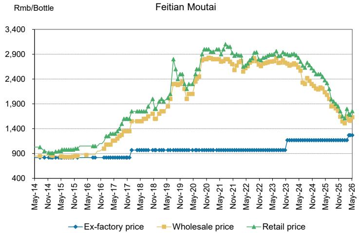

line

| Date    | Ex-factory price | Wholesale price | Retail price |
|---------|------------------|-----------------|--------------|
| May-14  | 850              | 850             | 900          |
| Nov-14  | 850              | 850             | 900          |
| May-15  | 850              | 850             | 900          |
| Nov-15  | 850              | 850             | 900          |
| May-16  | 850              | 850             | 900          |
| Nov-16  | 850              | 850             | 900          |
| May-17  | 850              | 850             | 900          |
| Nov-17  | 850              | 850             | 900          |
| May-18  | 850              | 850             | 900          |
| Nov-18  | 850              | 850             | 900          |
| May-19  | 850              | 850             | 900          |
| Nov-19  | 850              | 850             | 900          |
| May-20  | 850              | 850             | 900          |
| Nov-20  | 850              | 850             | 900          |
| May-21  | 850              | 850             | 900          |
| Nov-21  | 850              | 850             | 900          |
| May-22  | 850              | 850             | 900          |
| Nov-22  | 850              | 850             | 900          |
| May-23  | 850              | 850             | 900          |
| Nov-23  | 850              | 850             | 900          |
| May-24  | 850              | 850             | 900          |
| Nov-24  | 850              | 850             | 900          |
| May-25  | 850              | 850             | 900          |
| Nov-25  | 850              | 850             | 900          |
| May-26  | 850              | 850             | 900          |

Source: MS

Retail Pricing Trend   
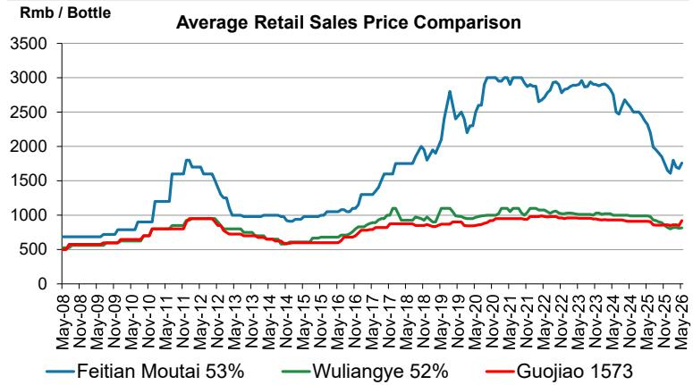

line

| Date   | Feitian Moutai | Wuliangye | Guojiao |
|--------|----------------|-----------|---------|
| May-08 | 600            | 500       | 500     |
| Nov-08 | 650            | 550       | 520     |
| May-09 | 700            | 600       | 550     |
| Nov-09 | 750            | 650       | 580     |
| May-10 | 800            | 700       | 600     |
| Nov-10 | 900            | 750       | 650     |
| May-11 | 1200           | 800       | 700     |
| Nov-11 | 1600           | 850       | 750     |
| May-12 | 1800           | 900       | 800     |
| Nov-12 | 1700           | 850       | 750     |
| May-13 | 1400           | 800       | 700     |
| Nov-13 | 1000           | 750       | 650     |
| May-14 | 950            | 700       | 600     |
| Nov-14 | 900            | 650       | 550     |
| May-15 | 950            | 700       | 600     |
| Nov-15 | 1000           | 750       | 650     |
| May-16 | 1100           | 800       | 700     |
| Nov-16 | 1200           | 850       | 750     |
| May-17 | 1300           | 900       | 800     |
| Nov-17 | 1400           | 950       | 850     |
| May-18 | 1500           | 1000      | 900     |
| Nov-18 | 1600           | 1050      | 950     |
| May-19 | 1800           | 1100      | 1000    |
| Nov-19 | 2200           | 1150      | 1050    |
| May-20 | 2800           | 1200      | 1100    |
| Nov-20 | 3000           | 1250      | 1150    |
| May-21 | 3100           | 1300      | 1200    |
| Nov-21 | 3200           | 1350      | 1250    |
| May-22 | 3300           | 1400      | 1300    |
| Nov-22 | 3400           | 1450      | 1350    |
| May-23 | 3500           | 1500      | 1400    |
| Nov-23 | 3600           | 1550      | 1450    |
| May-24 | 3700           | 1600      | 1500    |
| Nov-24 | 3800           | 1650      | 1550    |
| May-25 | 3900           | 1700      | 1600    |
| Nov-25 | 4000           | 1750      | 1650    |
| May-26 | 4100           | 1800      | 1700    |

Feitian Moutai Ex-factory price hikes 

<table><tr><td>Time</td><td>Feitian Moutai Ex-factory price (Rmb/bottle)</td><td>% of change</td></tr><tr><td>3/31/2026</td><td>1,269</td><td>9%</td></tr><tr><td>11/1/2023</td><td>1,169</td><td>21%</td></tr><tr><td>1/1/2018</td><td>969</td><td>18%</td></tr><tr><td>9/1/2012</td><td>819</td><td>32%</td></tr><tr><td>1/1/2011</td><td>619</td><td>24%</td></tr><tr><td>1/1/2010</td><td>499</td><td>14%</td></tr><tr><td>1/11/2008</td><td>439</td><td>23%</td></tr><tr><td>3/1/2007</td><td>358</td><td>16%</td></tr><tr><td>2/10/2006</td><td>308</td><td>15%</td></tr><tr><td>10/1/2003</td><td>268</td><td>23%</td></tr><tr><td>1/1/2001</td><td>218</td><td>18%</td></tr><tr><td>2000</td><td>185</td><td></td></tr></table>

# Disclosure Section

The information and opinions in MS were prepared or are disseminated by MS Asia Limited (which accepts the responsibility for its contents) and/or MS Asia (Singapore) Pte. (Registration number 199206298Z) and/or MS Asia (Singapore) Securities Pte Ltd (Registration number 200008434H), regulated by the Monetary Authority of Singapore (which accepts legal responsibility for its contents and should be contacted with respect to any matters arising from, or in connection with, MS), and/or MS Taiwan Limited and/or MS & Co International plc, Seoul Branch, and/or MS Australia Limited (A.B.N. 67 003 734 576, holder of Australian financial services license No. 233742, which accepts responsibility for its contents), and/or MS Wealth Management Australia Pty Ltd (A.B.N. 19 009 145 555, holder of Australian financial services license No. 240813, which accepts responsibility for its contents), and/or MS India Company Private Limited having Corporate Identification No (CIN) U22990MH1998PTC115305, regulated by the Securities and Exchange Board of India ("SEBI") and holder of licenses as a Research Analyst (SEBI Registration No. INH000001105); Stock Broker (SEBI Stock Broker Registration No. INZ000244438), Merchant Banker (SEBI Registration No. INM000011203), and depository participant with National Securities Depository Limited (SEBI Registration No. IN-DP-NSDL-567-2021) having registered office at Altimus, Level 39 & 40, Pandurang Budhkar Marg, Worli, Mumbai 400018, India; Telephone no. +91-22-61181000; Compliance Officer Details: Mr. Tejarshi Hardas, Tel. No.: +91-22-61181000 or Email: tejarshi.hardas@morganstanley.com; Grievance officer details: Mr. Tejarshi Hardas, Tel. No.: +91-22-61181000 or Email: msic-compliance@morganstanley.com which accepts the responsibility for its contents and should be contacted with respect to any matters arising from, or in connection with, MS, and their affiliates (collectively, "MS"). MS India Company Private Limited (MSICPL) may use AI tools in providing research services. All recommendations contained herein are made by the duly qualified research analysts.

For important disclosures, stock price charts and equity rating histories regarding companies that are the subject of this report, please see the MS Disclosure Website at www.morganstanley.com/eqr/disclosures/webapp/generalresearch, or contact your investment representative or MS at 1585 Broadway, (Attention: Research Management), New York, NY, 10036 USA.

For valuation methodology and risks associated with any recommendation, rating or price target referenced in this research report, please contact the Client Support Team as follows: US/Canada +1800 303-2495; Hong Kong +852 2848-5999; Latin America +1718 754-5444 (U.S.); London +44 (0)20-7425-8169; Singapore +65 6834-6860; Sydney +61(0)2-9770-1505; Tokyo +81(0)3-6836-9000. Alternatively you may contact your investment representative or MS at 1585 Broadway, (Attention: Research Management), New York, NY 10036 USA.

# Analyst Certification

The following analysts hereby certify that their views about the companies and their securities discussed in this report are accurately expressed and that they have not received and will not receive direct or indirect compensation in exchange for expressing specific recommendations or views in this report: Terence Cheng; Hildy Ling; Lillian Lou; Dustin Wei.

# Global Research Conflict Management Policy

MS has been published in accordance with our conflict management policy, which is available at www.morganstanley.com/institutional/research/conflictpolicies. A Portuguese version of the policy can be found at www.morganstanley.com.br

# Important Regulatory Disclosures on Subject Companies

As of April 30, 2026, MS beneficially owned 1% or more of a class of common equity securities of the following companies covered in MS: Anhui Gujing Distillery Company Limited, Chagee Holdings Ltd, Foshan Haitian Flavouring and Food, Hangzhou Greatstar Industrial Co Ltd, Li Ning, Muyuan Foodstuff Co. Ltd, Samsonite Group.

Within the last 12 months, MS managed or co-managed a public offering (or 144A offering) of securities of Eastroc Beverages, Foshan Haitian Flavouring and Food, Laopu Gold, Muyuan Foodstuff Co. Ltd, WH Group.

Within the last 12 months, MS has received compensation for investment banking services from Eastroc Beverages, Health and Happiness (H&H), Laopu Gold, Midea Group Co Ltd., Muyuan Foodstuff Co. Ltd, Samsonite Group, WH Group. In the next 3 months, MS expects to receive or intends to seek compensation for investment banking services from ANTA Sports Products, Chagee Holdings Ltd, Crystal International Group Ltd., Eastroc Beverages, Foshan Haitian Flavouring and Food, Gongniu Group Co Ltd, Gree Electric Appliances Inc of Zhuhai, Haidilao International Holding Ltd, Haier Smart Home Co Ltd, Health and Happiness (H&H), Hengan International Group, Laopu Gold, Mao Geping Cosmetics Co., Ltd, Midea Group Co Ltd., Muyuan Foodstuff Co. Ltd, Nongfu Spring Co Ltd, Pop Mart International Group, Proya Cosmetics Co. Ltd., Samsonite Group, Sun Art Retail Group Limited, Super Hi, Techtronic Industries Co Ltd, Topsports International Holdings Ltd, Weilong Delicious Global Holdings Ltd, WH Group, Yili Industrial, ZJLD Group.

Within the last 12 months, MS has received compensation for products and services other than investment banking services from ANTA Sports Products, Bosideng International Holdings Limited, Chow Tai Fook Jewellery Group Ltd, Gree Electric Appliances Inc of Zhuhai, Haidilao International Holding Ltd, Haier Smart Home Co Ltd, Health and Happiness (H&H), Midea Group Co Ltd., Pop Mart International Group, Samsonite Group, Stella International Holdings Ltd, Techtronic Industries Co Ltd, Topsports International Holdings Ltd, Uni-President China, WH Group, Yanjing Brewery, Yue Yuen Industrial Hldg, Yum China Holdings Inc..

Within the last 12 months, MS has provided or is providing investment banking services to, or has an investment banking client relationship with, the following company: ANTA Sports Products, Chagee Holdings Ltd, Crystal International Group Ltd., Eastroc Beverages, Foshan Haitian Flavouring and Food, Gongniu Group Co Ltd, Gree Electric Appliances Inc of Zhuhai, Haidilao International Holding Ltd, Haier Smart Home Co Ltd, Health and Happiness (H&H), Hengan International Group, Laopu Gold, Mao Geping Cosmetics Co., Ltd, Midea Group Co Ltd., Muyuan Foodstuff Co. Ltd, Nongfu Spring Co Ltd, Pop Mart International Group, Proya Cosmetics Co. Ltd., Samsonite Group, Sun Art Retail Group Limited, Super Hi, Techtronic Industries Co Ltd, Topsports International Holdings Ltd, Weilong Delicious Global Holdings Ltd, WH Group, Yili Industrial, ZJLD Group.

Within the last 12 months, MS has either provided or is providing non-investment banking, securities-related services to and/or in the past has entered into an agreement to provide services or has a client relationship with the following company: ANTA Sports Products, Bosideng International Holdings Limited, Chow Tai Fook Jewellery Group Ltd, Eastroc Beverages, Gree Electric Appliances Inc of Zhuhai, Haidilao International Holding Ltd, Haier Smart Home Co Ltd, Health and Happiness (H&H), Hengan International Group, Laopu Gold, Midea Group Co Ltd., Nongfu Spring Co Ltd, Pop Mart International Group, Samsonite Group, Stella International Holdings Ltd, Techtronic Industries Co Ltd, Topsports International Holdings Ltd, Uni-President China, WH

Group, Yanjing Brewery, Yue Yuen Industrial Hldg, Yum China Holdings Inc..

MS & Co. LLC makes a market in the securities of Super Hi.

The equity research analysts or strategists principally responsible for the preparation of MS have received compensation based upon various factors, including quality of research, investor client feedback, stock picking, competitive factors, firm revenues and overall investment banking revenues. Equity Research analysts' or strategists' compensation is not linked to investment banking or capital markets transactions performed by MS or the profitability or revenues of particular trading desks.

MS and its affiliates do business that relates to companies/instruments covered in MS, including market making, providing liquidity, fund management, commercial banking, extension of credit, investment services and investment banking. MS sells to and buys from customers the securities/instruments of companies covered in MS on a principal basis. MS may have a position in the debt of the Company or instruments discussed in this report. MS trades or may trade as principal in the debt securities (or in related derivatives) that are the subject of the debt research report.

Certain disclosures listed above are also for compliance with applicable regulations in non-US jurisdictions.

# STOCK RATINGS

MS uses a relative rating system using terms such as Overweight, Equal-weight, Not-Rated or Underweight (see definitions below). MS does not assign ratings of Buy, Hold or Sell to the stocks we cover. Overweight, Equal-weight, Not-Rated and Underweight are not the equivalent of buy, hold and sell. Investors should carefully read the definitions of all ratings used in MS. In addition, since MS contains more complete information concerning the analyst's views, investors should carefully read MS, in its entirety, and not infer the contents from the rating alone. In any case, ratings (or research) should not be used or relied upon as investment advice. An investor's decision to buy or sell a stock should depend on individual circumstances (such as the investor's existing holdings) and other considerations.

# Global Stock Ratings Distribution

(as of May 31, 2026)

The Stock Ratings described below apply to MS's Fundamental Equity Research and do not apply to Debt Research produced by the Firm.

For disclosure purposes only (in accordance with FINRA requirements), we include the category headings of Buy, Hold, and Sell alongside our ratings of Overweight, Equal-weight, Not-Rated and Underweight. MS does not assign ratings of Buy, Hold or Sell to the stocks we cover. Overweight, Equal-weight, Not-Rated and Underweight are not the equivalent of buy, hold, and sell but represent recommended relative weightings (see definitions below). To satisfy regulatory requirements, we correspond Overweight, our most positive stock rating, with a buy recommendation; we correspond Equal-weight and Not-Rated to hold and Underweight to sell recommendations, respectively.

<table><tr><td></td><td colspan="2">Coverage Universe</td><td colspan="3">Investment Banking Clients (IBC)</td><td colspan="2">Other Material Investment Services Clients (MISC)</td></tr><tr><td>Stock Rating Category</td><td>Count</td><td>% of Total</td><td>Count</td><td>% of Total IBC</td><td>% of Rating Category</td><td>Count</td><td>% of Total Other MISC</td></tr><tr><td>Overweight/Buy</td><td>1542</td><td>42%</td><td>465</td><td>51%</td><td>30%</td><td>707</td><td>43%</td></tr><tr><td>Equal-weight/Hold</td><td>1571</td><td>43%</td><td>369</td><td>40%</td><td>23%</td><td>723</td><td>44%</td></tr><tr><td>Not-Rated/Hold</td><td>3</td><td>0%</td><td>0</td><td>0%</td><td>0%</td><td>1</td><td>0%</td></tr><tr><td>Underweight/Sell</td><td>551</td><td>15%</td><td>86</td><td>9%</td><td>16%</td><td>201</td><td>12%</td></tr><tr><td>Total</td><td>3,667</td><td></td><td>920</td><td></td><td></td><td>1632</td><td></td></tr></table>

Data include common stock and ADRs currently assigned ratings. Investment Banking Clients are companies from whom MS received investment banking compensation in the last 12 months. Due to rounding off of decimals, the percentages provided in the "% of total" column may not add up to exactly 100 percent.

# Analyst Stock Ratings

Overweight (O). The stock's total return is expected to exceed the average total return of the analyst's industry (or industry team's) coverage universe, on a risk-adjusted basis, over the next 12-18 months.

Equal-weight (E). The stock's total return is expected to be in line with the average total return of the analyst's industry (or industry team's) coverage universe, on a risk-adjusted basis, over the next 12-18 months.

Not-Rated (NR). Currently the analyst does not have adequate conviction about the stock's total return relative to the average total return of the analyst's industry (or industry team's) coverage universe, on a risk-adjusted basis, over the next 12-18 months.

Underweight (U). The stock's total return is expected to be below the average total return of the analyst's industry (or industry team's) coverage universe, on a risk-adjusted basis, over the next 12-18 months.

Unless otherwise specified, the time frame for price targets included in MS is 12 to 18 months.

# Analyst Industry Views

Attractive (A): The analyst expects the performance of his or her industry coverage universe over the next 12-18 months to be attractive vs. the relevant broad market benchmark, as indicated below.

In-Line (I): The analyst expects the performance of his or her industry coverage universe over the next 12-18 months to be in line with the relevant broad market benchmark, as indicated below.

Cautious (C): The analyst views the performance of his or her industry coverage universe over the next 12-18 months with caution vs. the relevant broad market benchmark, as indicated below.

Benchmarks for each region are as follows: North America - S&P 500; Latin America - relevant MSCI country index or MSCI Latin America Index; Europe - MSCI Europe; Japan - TOPIX; Asia - relevant MSCI country index or MSCI sub-regional index or MSCI AC Asia Pacific ex Japan Index.

# Important Disclosures for MS Smith Barney LLC Customers

Important disclosures regarding any material conflict of interest that can reasonably be expected to have influenced MS Smith Barney LLC's choice of a third-party research provider or the subject company of a third-party research report, are available on the MS Wealth Management disclosure website at www.morganstanley.com/online/researchdisclosures. For MS specific disclosures, you may refer to https://www.morganstanley.com/eqr/disclosures/webapp/generalresearch.

Each MS report is reviewed and approved on behalf of MS Smith Barney LLC. This review and approval is conducted by the same person who reviews the research report on behalf of MS. This could create a conflict of interest.

# Other Important Disclosures

MS policy is to update research reports as and when the Research Analyst and Research Management deem appropriate, based on developments with the issuer, the sector, or the market that may have a material impact on the research views or opinions stated therein. In addition, certain Research publications are intended to be updated on a regular periodic basis (weekly/monthly/quarterly/annual) and will ordinarily be updated with that frequency, unless the Research Analyst and Research Management determine that a different publication schedule is appropriate based on current conditions.

MS is not acting as a municipal advisor and the opinions or views contained herein are not intended to be, and do not constitute, advice within the meaning of Section 975 of the Dodd-Frank Wall Street Reform and Consumer Protection Act. MS produces an equity research product called a "Tactical Idea." Views contained in a "Tactical Idea" on a particular stock may be contrary to the recommendations or views expressed in research on the same stock. This may be the result of differing time horizons, methodologies, market events, or other factors. For all research available on a particular stock, please contact your sales representative or go to Matrix at http://www.morganstanley.com/matrix.

MS is provided to our clients through our proprietary research portal on Matrix and also distributed electronically by MS to clients. Certain, but not all, MS products are also made available to clients through third-party vendors or redistributed to clients through alternate electronic means as a convenience. For access to all available MS, please contact your sales representative or go to Matrix at http://www.morganstanley.com/matrix.Any access and/or use of MS is subject to MS's Terms of Use (http://www.morganstanley.com/terms.html). By accessing and/or using MS, you are indicating that you have read and agree to be bound by our Terms of Use (http://www.morganstanley.com/terms.html). In addition you consent to MS processing your personal data and using cookies in accordance with our Privacy Policy and our Global Cookies Policy (http://www.morganstanley.com/privacy\_pledge.html), including for the purposes of setting your preferences and to collect readership data so that we can deliver better and more personalized service and products to you. To find out more information about how MS processes personal data, how we use cookies and how to reject cookies see our Privacy Policy and our Global Cookies Policy (http://www.morganstanley.com/privacy\_pledge.html). Please use the provided link to review the Terms and Conditions and Most Important Terms and Conditions for MS India Company Private Limited (https://www.morganstanley.com/assets/pdfs/about-us-global-offices/india/Terms\_and\_conditions.pdf) and the following link to review the audit report (https://ny.matrix.ms.com/eqr/research/webapp/researchdocs/MSICPL\_Morgan\_Stanley\_Research\_Audit\_Report.pdf).

If you do not agree to our Terms of Use and/or if you do not wish to provide your consent to MS processing your personal data or using cookies please do not access our research.

MS does not provide individually tailored investment advice. MS has been prepared without regard to the circumstances and objectives of those who receive it. MS recommends that investors independently evaluate particular investments and strategies, and encourages investors to seek the advice of a financial adviser. The appropriateness of an investment or strategy will depend on an investor's circumstances and objectives. The securities, instruments, or strategies discussed in MS may not be suitable for all investors, and certain investors may not be eligible to purchase or participate in some or all of them. MS is not an offer to buy or sell or the solicitation of an offer to buy or sell any security/instrument or to participate in any particular trading strategy. The value of and income from your investments may vary because of changes in interest rates, foreign exchange rates, default rates, prepayment rates, securities/instruments prices, market indexes, operational or financial conditions of companies or other factors. There may be time limitations on the exercise of options or other rights in securities/instruments transactions. Past performance is not necessarily a guide to future performance. Estimates of future performance are based on assumptions that may not be realized. If provided, and unless otherwise stated, the closing price on the cover page is that of the primary exchange for the subject company's securities/instruments.

The fixed income research analysts, strategists or economists principally responsible for the preparation of MS have received compensation based upon various factors, including quality, accuracy and value of research, firm profitability or revenues (which include fixed income trading and capital markets profitability or revenues), client feedback and competitive factors. Fixed Income Research analysts', strategists' or economists' compensation is not linked to investment banking or capital markets transactions performed by MS or the profitability or revenues of particular trading desks.

The "Important Regulatory Disclosures on Subject Companies" section in MS lists all companies mentioned where MS owns 1% or more of a class of common equity securities of the companies. For all other companies mentioned in MS, MS may have an investment of less than 1% in securities/instruments or derivatives of securities/instruments of companies and may trade them in ways different from those discussed in MS. Employees of MS not involved in the preparation of MS may have investments in securities/instruments or derivatives of securities/instruments of companies mentioned and may trade them in ways different from those discussed in MS. Derivatives may be issued by MS or associated persons.

With the exception of information regarding MS, MS is based on public information. MS makes every effort to use reliable, comprehensive information, but we make no representation that it is accurate or complete. We have no obligation to tell you when opinions or information in MS change apart from when we intend to discontinue equity research coverage of a subject company. Facts and views presented in MS have not been reviewed by, and may not reflect information known to, professionals in other MS business areas, including investment banking personnel.

MS personnel may participate in company events such as site visits and are generally prohibited from accepting payment by the company of associated expenses unless pre-approved by authorized members of Research management.

MS may make investment decisions that are inconsistent with the recommendations or views in this report.

To our readers based in Taiwan or trading in Taiwan securities/instruments: Information on securities/instruments that trade in Taiwan is distributed by MS Taiwan Limited ("MSTL"). Such information is for your reference only. The reader should independently evaluate the investment risks and is solely responsible for their investment decisions. MS may not be distributed to the public media or quoted or used by the public media without the express written consent of MS. Any non-customer reader within the scope of Article 7-1 of the Taiwan Stock Exchange Recommendation Regulations accessing and/or receiving MS is not permitted to provide MS to any third party (including but not limited to related parties, affiliated companies and any other third parties) or engage in any activities regarding MS which may create or give the appearance of creating a conflict of interest. Information on securities/instruments that do not trade in Taiwan is for informational purposes only and is not to be construed as a recommendation or a solicitation to trade in such securities/instruments. MSTL may not execute transactions for clients in these securities/instruments.

Certain information in MS was sourced by employees of the Shanghai Representative Office of MS Asia Limited for the use of MS Asia Limited.

MS is not incorporated under PRC law and the research in relation to this report is conducted outside the PRC. MS does not constitute an offer to sell or the solicitation of an offer to buy any securities in the PRC. PRC investors shall have the relevant qualifications to invest in such securities and shall be responsible for obtaining all relevant approvals, licenses, verifications and/or registrations from the relevant governmental authorities themselves. Neither this report nor any part of it is intended as, or shall constitute, provision of any consultancy or advisory service of securities investment as defined under PRC law. Such information is provided for your reference only.

MS is disseminated in Brazil by MS C.T.V.M. S.A. located at Av. Brigadeiro Faria Lima, 3600, 6th floor, São Paulo - SP, Brazil; and is regulated by the Comissão de Valores Mobiliários; in Mexico by MS México, Casa de Bolsa, S.A. de C.V which is regulated by Comision Nacional Bancaria y de Valores. Paseo de los Tamarindos 90, Torre 1, Col. Bosques de las Lomas Floor 29, 05120 Mexico City; in Japan by MS MUFG Securities Co., Ltd. and, for Commodities related research reports only, MS Capital Group Japan Co., Ltd; in Hong Kong by MS Asia Limited (which accepts responsibility for its contents) and by MS Bank Asia Limited; in Singapore by MS Asia (Singapore) Pte. (Registration number 199206298Z) and/or MS Asia (Singapore) Securities Pte Ltd (Registration number 200008434H), regulated by the Monetary Authority of Singapore (which accepts legal responsibility for its contents and should be contacted with respect to any matters arising from, or in connection with, MS) and by MS Bank Asia Limited, Singapore Branch (Registration number T14FC0118); in Australia to "wholesale clients" within the meaning of the Australian Corporations Act by MS Australia Limited A.B.N. 67 003 734 576, holder of Australian financial services license No. 23374-2, which accepts responsibility for its contents; in Australia to "wholesale clients" and "retail clients" within the meaning of the Australian Corporations Act by MS Wealth Management Australia Pty Ltd (A.B.N. 19 009 145 555, holder of Australian financial services license No. 240813, which accepts responsibility for its contents; in Korea by MS & Co International plc, Seoul Branch; in India by MS India Company Private Limited having Corporate Identification No (CIN) U22990MH1998PTC115305, regulated by the Securities and Exchange Board of India ("SEBI") and holder of licenses as a Research Analyst (SEBI Registration No. INH000001105); Stock Broker (SEBI Stock Broker Registration No. INZ000244438), Merchant Banker (SEBI Registration No. INM000011203), and depository participant with National Securities Depository Limited (SEBI Registration No. IN-DP-NSDL-567-2021) having registered office at Altimus, Level 39 & 40, Pandurang Budhkar Marg, Worli, Mumbai 400018, India; Telephone no. +91-22-61181000; Compliance Officer Details: Mr. Tejarshi Hardas, Tel. No.: +91-22-61181000 or Email: tejarshi.hardas@morganstanley.com; Grievance officer details: Mr. Tejarshi Hardas, Tel. No.: +91-22-61181000 or Email: msic-compliance@morganstanley.com. MS India Company Private Limited (MSICPL) may use AI tools in providing research services. All recommendations contained herein are made by the duly qualified research analysts; in Canada by MS Canada Limited; in Germany and the European Economic Area where required by MS Europe S.E., authorised and regulated by Bundesanstalt fuer Finanzdienstleistungsaufsicht (BaFin) under the reference number 149169; in the US by MS & Co. LLC, which accepts responsibility for its contents. MS & Co. International plc, authorized by the Prudential Regulation Authority and regulated by the Financial Conduct Authority and the Prudential Regulation Authority, disseminates in the UK research that it has prepared, and research which has been prepared by any of its affiliates, only to persons who (i) are investment professionals falling within Article 19(5) of the Financial Services and Markets Act 2000 (Financial Promotion) Order 2005 (as amended, the "Order"); (ii) are persons who are high net worth entities falling within Article 49(2)(a) to (d) of the Order; or (iii) are persons to whom an invitation or inducement to engage in investment activity (within the meaning of section 21 of the Financial Services and Markets Act 2000, as amended) may otherwise lawfully be communicated or caused to be communicated. RMB MS Proprietary Limited is a member of the JSE Limited and A2X (Pty) Ltd. RMB MS Proprietary Limited is a joint venture owned equally by MS International Holdings Inc. and RMB Investment Advisory (Proprietary) Limited, which is wholly owned by FirstRand Limited. The information in MS is being disseminated by MS Saudi Arabia, regulated by the Capital Market Authority in the Kingdom of Saudi Arabia, and is directed at Sophisticated investors only.

MS Hong Kong Securities Limited is the liquidity provider/market maker for securities of ANTA Sports Products, Budweiser Brewing Company APAC Ltd, China Mengniu Dairy, China Resources Beer Holdings Co Ltd, China Tourism Group Duty Free, Chow Tai Fook Jewellery Group Ltd, Giant Biogene Holding Co Ltd, Haidilao International Holding Ltd, Laopu Gold, Li Ning, Mao Geping Cosmetics Co., Ltd, Midea Group Co Ltd., Nongfu Spring Co Ltd, Pop Mart International Group, Shenzhou International Group Holdings, Techtronic Industries Co Ltd, Tsingtao Brewery Co Ltd listed on the Stock Exchange of Hong Kong Limited. An updated list can be found on HKEx website: http://www.hkex.com.hk.

The information in MS is being communicated by MS & Co. International plc (DIFC Branch), regulated by the Dubai Financial Services Authority (the DFSA) or by MS & Co. International plc (ADGM Branch), regulated by the Financial Services Regulatory Authority Abu Dhabi (the FSRA), and is directed at Professional Clients only, as defined by the DFSA or the FSRA, respectively. The financial products or financial services to which this research relates will only be made available to a customer who we are satisfied meets the regulatory criteria of a Professional Client. A distribution of the different MS Research ratings or recommendations, in percentage terms for Investments in each sector covered, is available upon request from your sales representative.

The information in MS is being communicated by MS & Co. International plc (QFC Branch), regulated by the Qatar Financial Centre Regulatory Authority (the QFCRA), and is directed at business customers and market counterparties only and is not intended for Retail Customers as defined by the QFCRA.

As required by the Capital Markets Board of Turkey, investment information, comments and recommendations stated here, are not within the scope of investment advisory activity. Investment advisory service is provided exclusively to persons based on their risk and income preferences by the authorized firms. Comments and recommendations stated here are general in nature. These opinions may not fit to your financial status, risk and return preferences. For this reason, to make an investment decision by relying solely to this information stated here may not bring about outcomes that fit your expectations.

The trademarks and service marks contained in MS are the property of their respective owners. Third-party data providers make no warranties or representations relating to the accuracy, completeness, or timeliness of the data they provide and shall not have liability for any damages relating to such data. The Global Industry Classification Standard (GICS) was developed by and is the exclusive property of MSCI and S&P.

MS, or any portion thereof may not be reprinted, sold or redistributed without the written consent of MS.

Indicators and trackers referenced in MS may not be used as, or treated as, a benchmark under Regulation EU 2016/1011, or any other similar framework.

The issuers and/or fixed income products recommended or discussed in certain fixed income research reports may not be continuously followed. Accordingly, investors should regard those fixed income research reports as providing stand-alone analysis and should not expect continuing analysis or additional reports relating to such issuers and/or individual fixed income products.

MS may hold, from time to time, material financial and commercial interests regarding the company subject to the Research report.

Registration granted by SEBI and certification from the National Institute of Securities Markets (NISM) in no way guarantee performance of the intermediary or provide any assurance of returns to investors. Investment in securities market are subject to market risks. Read all the related documents carefully before investing.

Stock Ratings are subject to change. Please see latest research for each company.   
\* Historical prices are not split adjusted.   
INDUSTRY COVERAGE: China/Hong Kong Consumer 

<table><tr><td>COMPANY (TICKER)</td><td>RATING (AS OF)</td><td>PRICE* (05/29/2026)</td></tr><tr><td colspan="3">Dustin Wei</td></tr><tr><td>ANTA Sports Products (2020.HK)</td><td>++</td><td>HK$75.80</td></tr><tr><td>Bosideng International Holdings Limited (3998.HK)</td><td>O (11/27/2024)</td><td>HK$4.25</td></tr><tr><td>C&amp;S Paper Co Ltd (002511.SZ)</td><td>U (09/22/2021)</td><td>Rmb7.25</td></tr><tr><td>Chacha Food Co Ltd (002557.SZ)</td><td>U (02/20/2025)</td><td>Rmb21.95</td></tr><tr><td>Giant Biogene Holding Co Ltd (2367.HK)</td><td>O (08/08/2024)</td><td>HK$30.06</td></tr><tr><td>Health and Happiness (H&amp;H) (1112.HK)</td><td>E (07/12/2021)</td><td>HK$12.19</td></tr><tr><td>Hengan International Group (1044.HK)</td><td>E (05/06/2021)</td><td>HK$24.34</td></tr><tr><td>Li Ning (2331.HK)</td><td>O (10/09/2019)</td><td>HK$18.20</td></tr><tr><td>Mao Geping Cosmetics Co., Ltd (1318.HK)</td><td>O (03/10/2026)</td><td>HK$59.85</td></tr><tr><td>Pop Mart International Group (9992.HK)</td><td>O (05/17/2021)</td><td>HK$173.40</td></tr><tr><td>Proya Cosmetics Co. Ltd. (603605.SS)</td><td>O (10/12/2021)</td><td>Rmb61.81</td></tr><tr><td>Samsonite Group (1910.HK)</td><td>O (06/15/2020)</td><td>HK$14.48</td></tr><tr><td>Shanghai Jahwa United Co. Ltd. (600315.SS)</td><td>U (07/07/2023)</td><td>Rmb18.69</td></tr><tr><td>Sun Art Retail Group Limited (6808.HK)</td><td>E (03/05/2019)</td><td>HK$1.52</td></tr><tr><td>Topsports International Holdings Ltd (6110.HK)</td><td>O (11/13/2019)</td><td>HK$2.80</td></tr><tr><td>Weilong Delicious Global Holdings Ltd (9985.HK)</td><td>O (06/11/2025)</td><td>HK$8.16</td></tr><tr><td>Yonghui Superstores (601933.SS)</td><td>U (05/18/2023)</td><td>Rmb3.70</td></tr><tr><td colspan="3">Hildy Ling</td></tr><tr><td>Angel Yeast Co. Ltd. (600298.SS)</td><td>E (05/21/2026)</td><td>Rmb36.60</td></tr><tr><td>Beijing Roborock Technology Co Ltd (688169.SS)</td><td>O (09/25/2024)</td><td>Rmb102.54</td></tr><tr><td>China Tourism Group Duty Free (1880.HK)</td><td>E (12/13/2023)</td><td>HK$55.95</td></tr><tr><td>China Tourism Group Duty Free (601888.SS)</td><td>E (12/13/2023)</td><td>Rmb59.58</td></tr><tr><td>Chow Tai Fook Jewellery Group Ltd (1929.HK)</td><td>O (03/04/2025)</td><td>HK$10.99</td></tr><tr><td>Chow Tai Seng Jewellery Co Ltd (002867.SZ)</td><td>U (03/04/2025)</td><td>Rmb12.60</td></tr><tr><td>Ecovacs Robotics Co Ltd (603486.SS)</td><td>E (10/30/2023)</td><td>Rmb58.72</td></tr><tr><td>Foshan Haitian Flavouring and Food (603288.SS)</td><td>E (07/28/2025)</td><td>Rmb35.92</td></tr><tr><td>Foshan Haitian Flavouring and Food (3288.HK)</td><td>E (05/21/2026)</td><td>HK$32.62</td></tr><tr><td>Haidilao International Holding Ltd (6862.HK)</td><td>O (05/26/2021)</td><td>HK$12.76</td></tr><tr><td>Hangzhou Robam Appliances Co Ltd (002508.SZ)</td><td>U (02/21/2024)</td><td>Rmb17.31</td></tr><tr><td>Laopu Gold (6181.HK)</td><td>O (10/20/2025)</td><td>HK$504.00</td></tr><tr><td>Super Hi (HDL.O)</td><td>E (01/14/2025)</td><td>US$13.40</td></tr><tr><td>Zhejiang Supor Co. Ltd. (002032.SZ)</td><td>E (01/17/2022)</td><td>Rmb45.15</td></tr><tr><td colspan="3">Lillian Lou</td></tr><tr><td>Anhui Gujing Distillery Company Limited (000596.SZ)</td><td>U (02/13/2026)</td><td>Rmb93.03</td></tr><tr><td>Budweiser Brewing Company APAC Ltd (1876.HK)</td><td>O (11/04/2019)</td><td>HK$6.99</td></tr><tr><td>Chagee Holdings Ltd (CHA.O)</td><td>O (06/02/2025)</td><td>US$12.76</td></tr><tr><td>China Mengniu Dairy (2319.HK)</td><td>O (09/14/2017)</td><td>HK$16.96</td></tr><tr><td>China Resources Beer Holdings Co Ltd (0291.HK)</td><td>O (12/11/2018)</td><td>HK$24.20</td></tr><tr><td>Chongqing Brewery Co. Ltd. (600132.SS)</td><td>U (07/30/2021)</td><td>Rmb52.92</td></tr><tr><td>Eastroc Beverages (605499.SS)</td><td>O (03/12/2026)</td><td>Rmb142.44</td></tr><tr><td>Eastroc Beverages (9980.HK)</td><td>O (03/12/2026)</td><td>HK$132.30</td></tr><tr><td>Gree Electric Appliances Inc of Zhuhai (000651.SZ)</td><td>O (04/14/2020)</td><td>Rmb39.17</td></tr><tr><td>Haier Smart Home Co Ltd (600690.SS)</td><td>E (01/17/2022)</td><td>Rmb20.88</td></tr><tr><td>Haier Smart Home Co Ltd (6690.HK)</td><td>E (01/17/2022)</td><td>HK$19.70</td></tr><tr><td>Kweichow Moutai Company Ltd. (600519.SS)</td><td>O (10/17/2014)</td><td>Rmb1,326.00</td></tr><tr><td>Luzhou Lao Jiao Co. Ltd (000568.SZ)</td><td>E (01/23/2019)</td><td>Rmb91.04</td></tr><tr><td>Midea Group Co Ltd. (0300.HK)</td><td>O (11/01/2024)</td><td>HK$85.75</td></tr><tr><td>Midea Group Co Ltd. (000333.SZ)</td><td>O (01/17/2022)</td><td>Rmb80.85</td></tr><tr><td>Muyuan Foodstuff Co. Ltd (2714.HK)</td><td>O (03/17/2026)</td><td>HK$35.30</td></tr><tr><td>Muyuan Foodstuff Co. Ltd (002714.SZ)</td><td>O (03/17/2026)</td><td>Rmb38.07</td></tr><tr><td>Nongfu Spring Co Ltd (9633.HK)</td><td>E (07/30/2021)</td><td>HK$42.80</td></tr><tr><td>Shanxi Xinghuacun Fen Wine Factory Co. (600809.SS)</td><td>O (10/28/2020)</td><td>Rmb128.30</td></tr><tr><td>Shuanghui Development (000895.SZ)</td><td>U (03/16/2021)</td><td>Rmb25.02</td></tr><tr><td>Tingyi (Cayman Islands) (0322.HK)</td><td>E (07/25/2025)</td><td>HK$11.95</td></tr><tr><td>Tsingtao Brewery Co Ltd (0168.HK)</td><td>E (11/01/2024)</td><td>HK$49.74</td></tr><tr><td>Tsingtao Brewery Co Ltd (600600.SS)</td><td>E (02/28/2024)</td><td>Rmb61.14</td></tr><tr><td>Uni-President China (0220.HK)</td><td>E (07/25/2025)</td><td>HK$7.86</td></tr><tr><td>Want Want China Holdings Ltd (0151.HK)</td><td>E (11/29/2023)</td><td>HK$4.16</td></tr><tr><td>WH Group (0288.HK)</td><td>O (02/24/2025)</td><td>HK$9.05</td></tr><tr><td>Wuliangye Yibin Company Ltd. (000858.SZ)</td><td>E (08/15/2024)</td><td>Rmb84.89</td></tr><tr><td>Yanghe Brewery (002304.SZ)</td><td>U (01/05/2021)</td><td>Rmb45.39</td></tr><tr><td>Yanjing Brewery (000729.SZ)</td><td>U (09/02/2015)</td><td>Rmb12.77</td></tr><tr><td>Yili Industrial (600887.SS)</td><td>O (01/29/2014)</td><td>Rmb26.92</td></tr><tr><td>Yum China Holdings Inc. (YUMC.N)</td><td>O (03/20/2018)</td><td>US$42.43</td></tr><tr><td>ZJLD Group (6979.HK)</td><td>E (02/13/2026)</td><td>HK$7.28</td></tr><tr><td colspan="3">Terence Cheng</td></tr><tr><td>Chervon Holdings Ltd. (2285.HK)</td><td>E (04/12/2024)</td><td>HK$16.18</td></tr><tr><td>Crystal International Group Ltd. (2232.HK)</td><td>E (06/23/2025)</td><td>HK$6.03</td></tr><tr><td>Gongniu Group Co Ltd (603195.SS)</td><td>O (05/08/2023)</td><td>Rmb41.58</td></tr><tr><td>Hangzhou Greatstar Industrial Co Ltd (002444.SZ)</td><td>E (10/26/2022)</td><td>Rmb32.40</td></tr><tr><td>Huali Industrial Group Co (300979.SZ)</td><td>U (02/10/2026)</td><td>Rmb34.18</td></tr><tr><td>Shenzhou International Group Holdings (2313.HK)</td><td>O (07/13/2017)</td><td>HK$46.42</td></tr><tr><td>Stella International Holdings Ltd (1836.HK)</td><td>E (06/23/2025)</td><td>HK$13.21</td></tr><tr><td>Techtronic Industries Co Ltd (0669.HK)</td><td>O (12/05/2019)</td><td>HK$116.30</td></tr><tr><td>Yue Yuen Industrial Hldg (0551.HK)</td><td>E (09/14/2021)</td><td>HK$14.67</td></tr></table>

© 2026 MS