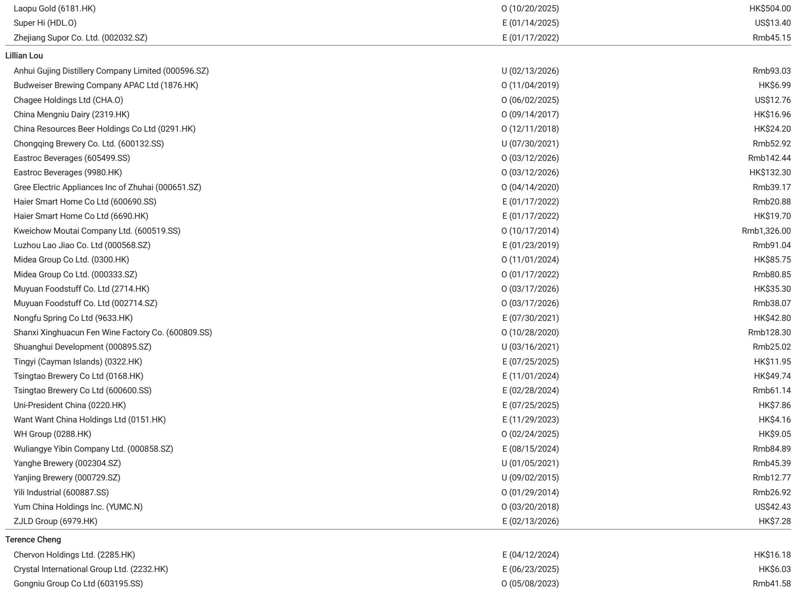
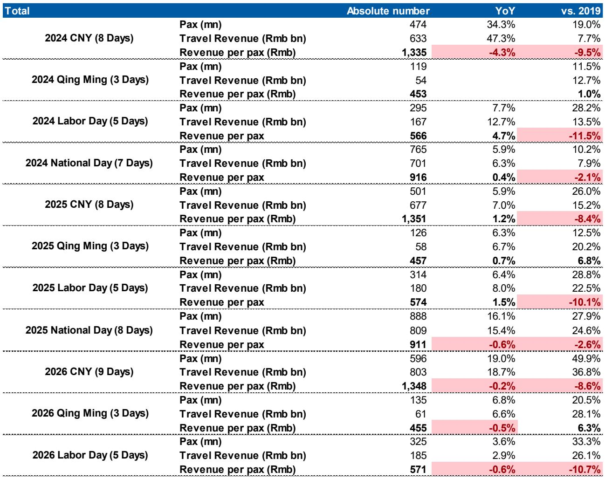
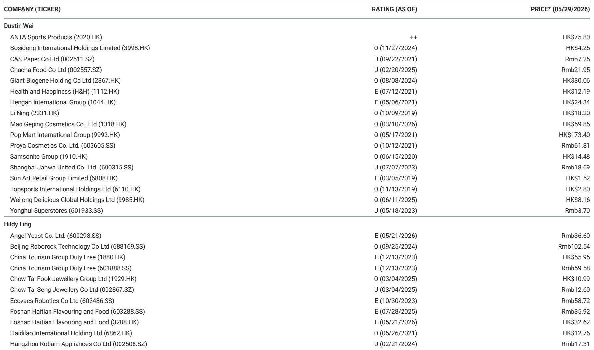

# China’s Consumption Is Not Collapsing — It Is Restructuring, and Investors Must Rethink What “Growth” Means

The headline numbers look alarming. China’s retail sales growth fell to 0.2% year-on-year in April 2026, following a steady deceleration from mid-2025. Macro data show disposable income growth hovering in the low single digits, youth unemployment stuck near 16%, and second-home prices declining by 12% year-on-year. A casual observer would conclude that Chinese consumers are retreating. That conclusion is wrong.

The real story is not one of aggregate collapse, but of deep structural divergence beneath the surface. China’s consumer economy is undergoing a silent but decisive restructuring — one that rewards companies serving compressed demand for essentials, experiences, and value-for-money innovation, while punishing those still chasing the old model of aspirational mass-market spending. The April 2026 retail sales data, when parsed carefully, reveal precisely where the growth is hiding: staples and selective services are holding up, while discretionary goods tied to housing and big-ticket sentiment are falling sharply. This is not a cyclical dip. It is a permanent shift in how Chinese households allocate income.

The strategic question for investors is no longer “when will consumption recover?” It is “which parts of consumption have already recovered, and which will never return to pre-2024 levels?” The answer determines portfolio construction for the next several years.

## The Macro Picture Is Muddled, But the Micro Signals Are Clear: Staples Are Resilient, Durables Are Broken

At first glance, the macro data appear uniformly weak. Retail sales growth decelerated from 5.9% in March 2025 to 0.2% in April 2026. GDP growth has gradually declined from 5.4% in early 2025 to 5.0% in Q1 2026. CPI remains near zero, and PPI — after years of deflation — has only recently turned positive. Household saving rates remain elevated at 34%, suggesting that consumers are still hoarding cash rather than spending.

But these aggregates mask a crucial bifurcation. When we examine the April 2026 retail sales breakdown by category, the pattern is unmistakable. Food, grain, and oil grew 4.1% year-on-year. Alcohol and tobacco grew 11.7%. Food and beverage overall grew 5.4%. Cosmetics grew 4.7%. These are not signs of a consumer in retreat. These are signs of a consumer who is prioritizing immediate, essential, and relatively low-cost gratifications.

By contrast, the discretionary durables categories are in outright contraction. Electronics and appliances fell 15.1% year-on-year. Home furnishing dropped 10.4%. Gold and jewelry plunged 21.3%. Sports and entertainment equipment fell 8.0%. The divergence is not subtle. It is a chasm.

The so-what is this: Chinese households are not spending less overall — they are spending differently. The old model of consumption, which relied on rising housing wealth, easy credit, and aspirational upgrades to cars, appliances, and luxury goods, has been replaced by a new model centered on daily necessities, affordable indulgences, and experiences that do not require large upfront commitments. This is not a recessionary mindset. It is a structural reallocation of the household budget away from assets and durables toward flows and services.

## The Wealth Effect Has Inverted: Housing Weakness Now Depresses Sentiment More Than Capital Market Gains Can Offset

One of the most important insights from the report lies in the interaction between housing, capital markets, and consumer confidence. The data show that second-home prices have been declining at 12-14% year-on-year for several consecutive quarters. At the same time, the MSCI China index has rallied significantly, and capital market gains have improved for higher-income groups.

The conventional assumption would be that rising equity markets offset the negative wealth effect from housing. The report suggests otherwise. The wealth effect from capital markets is concentrated among upper-income households, who are already high savers and less likely to increase marginal consumption from portfolio gains. The housing wealth effect, by contrast, is broad-based and deeply embedded in the psychology of the average Chinese household. When housing prices fall, it does not just reduce net worth — it reduces the willingness to spend across all categories.

This asymmetry has profound implications. It means that even a sustained equity rally will not rekindle the broad-based consumption boom that many investors are hoping for. The housing cycle, which the report expects to remain in decline until at least the second half of 2027, will continue to act as a drag on consumer sentiment for at least another 12 to 18 months. The policy response — measured support for durable goods trade-ins and potential service consumption subsidies — is unlikely to be large enough to reverse this dynamic.

The strategic conclusion is that consumption-driven equities will not benefit from a cyclical recovery in the near term. They will benefit only if they are positioned to serve the new consumption structure. Companies that rely on housing-linked demand — home furnishings, major appliances, premium jewelry — will continue to face headwinds. Companies that serve the staples, food, beverage, and affordable indulgence segments will continue to find pockets of growth.

## Earnings Cuts Are Slowing, But the Composition of Earnings Growth Matters More Than the Direction

The report notes that consensus earnings cuts for consumer stocks have begun to ease. The direction of earnings revisions is no longer uniformly negative. Some individual stocks are starting to see upward revisions. This is a necessary condition for a market bottom, but it is not sufficient.

The more important observation is that the easing of earnings cuts is not occurring evenly across sectors. Companies in the staples and beverages space, particularly those with strong brand positions and pricing power in categories like dairy, beer, and instant beverages, are seeing more stable earnings trajectories. Companies in discretionary durables, apparel, and jewelry are still experiencing downward pressure.

This is consistent with the restructuring thesis. The companies that are seeing earnings stabilization are those that have already adapted to the new consumption environment — where volume growth comes from everyday usage, not from upgrades, and where pricing power comes from value-for-money, not from premiumization. The companies still under pressure are those whose business models depend on the old cycle of housing, credit, and aspirational spending.

The so-what for investors is that the traditional approach of buying the entire consumer sector on the expectation of a macro recovery is no longer valid. Stock selection must be driven by a granular understanding of which consumption categories are expanding and which are contracting. The index-level earnings picture will remain mixed until the housing cycle turns. But within that mixed picture, there are clear winners and clear losers.

## What the Report Does Not Fully Answer: The Role of Youth Unemployment and the “New Economy” Wage Data

One of the most intriguing data points in the report is the trend in “new economy” average entry-level salaries. After declining year-on-year through much of 2024 and early 2025, these salaries turned positive in early 2026 and reached 13% year-on-year growth in February 2026 before moderating. This is a potentially important leading indicator, but the report does not fully explore its implications.

The question is whether the improvement in new-economy wages is broad-based or concentrated in a few sectors such as artificial intelligence, electric vehicles, and clean energy. If it is broad-based, it could signal a turning point for youth income and, eventually, for consumption among the 16-24 age cohort. If it is concentrated, then the headline improvement masks continued weakness elsewhere.

Similarly, the youth unemployment rate remains elevated at 16% in April 2026. The report provides the data but does not fully connect it to consumption patterns. Young consumers are the marginal spenders in categories like cosmetics, beverages, apparel, and entertainment. If their income prospects are improving but their employment remains uncertain, their spending behavior may remain cautious even as their wages rise.

These are open questions that the full report may address in greater depth. For now, investors should treat the new-economy wage data as a promising but incomplete signal. If the trend continues, it could be the first genuine catalyst for a recovery in youth-oriented consumption categories. If it reverses, the consumption restructuring will persist for longer.

## A Decision Framework for Investors: How to Position for the New Consumption Structure

Given the analysis above, investors need a clear framework for navigating China’s consumer sector. The following three-part framework is designed to translate the report’s insights into actionable portfolio decisions.

First, separate consumption categories by their sensitivity to housing and credit. Categories that are directly linked to home purchases — home furnishing, major appliances, and premium jewelry — will remain under pressure until housing prices stabilize. Avoid broad exposure to these sectors until there is clear evidence of a housing trough. Categories that are linked to daily consumption — food, beverages, personal care, and affordable dining — are structurally more resilient. Overweight these sectors, particularly companies with strong distribution networks and pricing discipline.

Second, evaluate companies based on their ability to deliver value-for-volume rather than premiumization. In the old consumption model, companies grew by persuading consumers to trade up to higher-priced products. In the new model, companies grow by offering better quality at accessible prices. Companies that can gain market share through product innovation and efficiency — rather than through brand prestige — will outperform. This is particularly true in beverages, dairy, and packaged foods, where the report shows stable to positive growth.

Third, monitor the new-economy wage data and youth unemployment as leading indicators. If entry-level wages continue to grow and youth unemployment begins to decline, investors can selectively increase exposure to youth-oriented categories such as cosmetics, apparel, and entertainment. If these indicators stall, maintain a defensive posture focused on staples and essential services.

This framework is not a one-size-fits-all solution. It requires continuous monitoring of the macro data and category-level retail sales. But it provides a systematic way to avoid the trap of assuming that all consumption will recover when the macro environment improves. Some parts of consumption have already structurally changed. The sooner investors accept this, the sooner they can identify the genuine growth opportunities.

## Join the Community to Read the Full Report and Review the Original Charts

The analysis above draws on a comprehensive investor presentation by a leading global investment bank, covering macro data, retail sales trends, and stock-level ratings across the China consumer sector. The full report includes detailed charts on GDP and CPI trends, new-economy salary trajectories, wealth effects from capital markets, youth unemployment dynamics, and category-level retail sales performance. It also contains specific stock ratings and price targets across food, beverage, apparel, jewelry, and home appliance companies.

The charts and data tables in the original report provide the granularity needed to validate the structural divergence thesis and to identify the specific companies that are best positioned for the new consumption environment. They also contain the full time series for the key macro indicators, allowing investors to track the trends themselves rather than relying on summary statistics.

Join the community to read the full report and review the original charts. The data is too rich to summarize in a single article, and the stock-level insights require careful examination of the underlying tables and analyst commentary.

*This article is for learning and discussion only and does not constitute investment advice.*

Personal reading notes and learning share only. Not investment advice.

