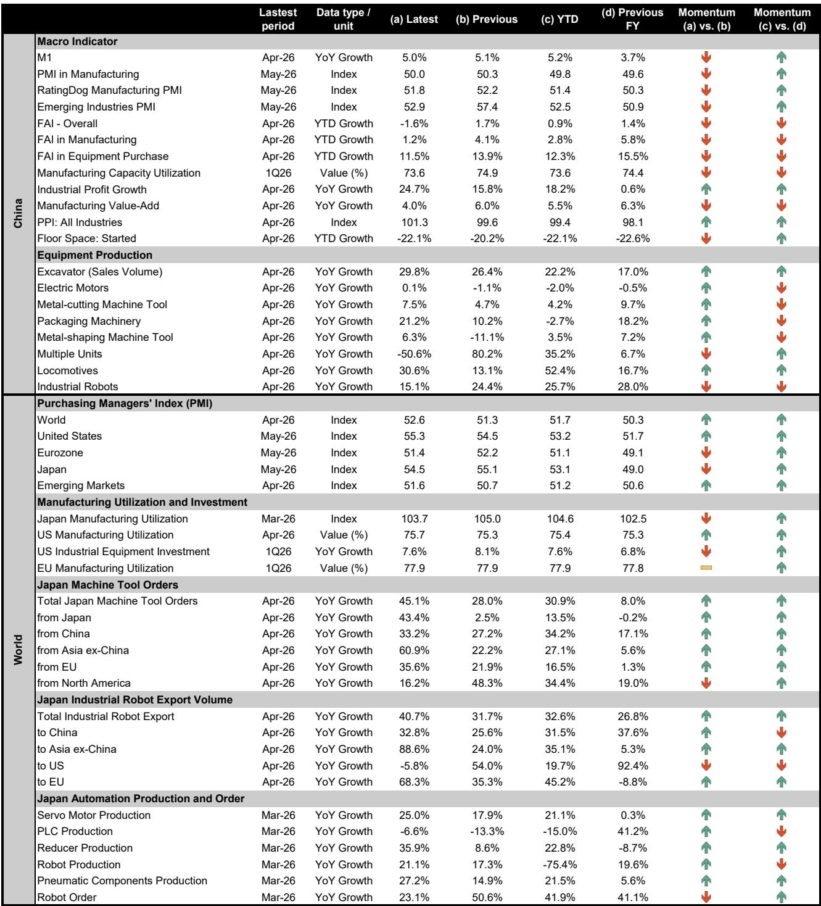
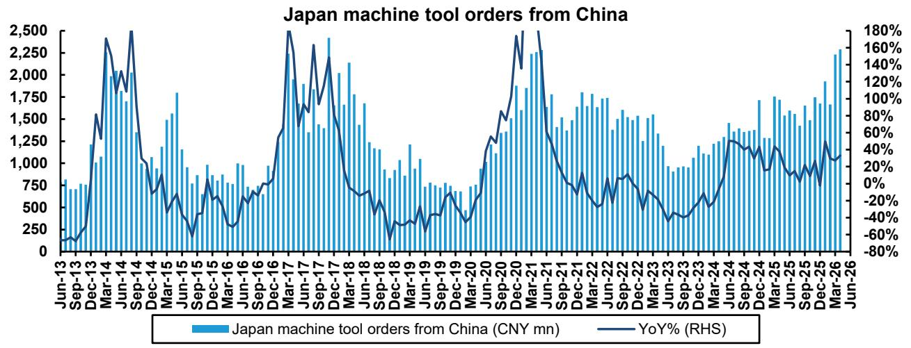
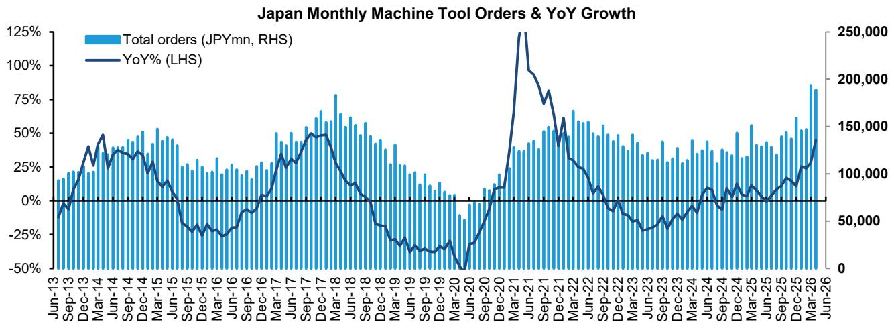

# The Global Factory Automation Cycle Is Not Peaking — It Is Entering a Broader, More Synchronized Phase

The most important signal from the April and May industrial data is not the absolute growth rate, but the pattern of convergence. For months, the narrative around factory automation has been dominated by a single question: Is China's cycle peaking? The data now offers a clear answer. It is not. China's fixed asset investment in equipment purchase grew 11.5% year-to-date through April, and industrial profit growth accelerated to 24.7% year-over-year. Meanwhile, Japan's machine tool orders from China grew 33.2% year-over-year in April, and the "twin peaks" pattern — a hallmark of prior upcycles — is forming again. But the real strategic insight lies elsewhere. The rest of the world is now catching up. Europe, Japan, and Asia ex-China are accelerating at a pace that changes the risk calculus for anyone invested in industrial technology. This is no longer a China-led story. It is a synchronized global recovery in manufacturing investment, and that changes both the duration and the composition of the cycle.

Why now matters. The window between April and June is historically the most informative period for assessing whether a capital expenditure cycle has legs. First-quarter data is often distorted by Lunar New Year effects and budget lags. By April, the trend line becomes visible. What we see is a manufacturing PMI for high-tech and equipment manufacturing in China expanding to 52.9 and 52.1 respectively, even as the headline PMI dipped to 50.0. That divergence — between soft headline indicators and hard production and profit data — is precisely the pattern that precedes sustained capital spending. In the rest of the world, the manufacturing PMIs for the US, Eurozone, and Japan all remain in expansion territory, with the US at 55.3 and Japan at 54.5. The global PMI composite reached 52.6, the highest reading in this cycle. These are not flash signals. They are structural.

The argument of this article is straightforward. The global industrial technology cycle is not peaking. It is broadening. The risk of a sharp deceleration in China is overstated. The opportunity in Europe and Asia ex-China is underappreciated. And the role of Physical AI as a demand accelerator is only beginning to be priced in. Investors who treat this as a late-cycle play are likely to miss the next phase. Those who understand the synchronization and the technology shift will position for a cycle that has more duration and more breadth than consensus expects.

## China's Factory Automation Demand Is Not Weakening — It Is Rotating Toward Higher-Value Segments

The headline data from China can appear contradictory. The official manufacturing PMI dipped to 50.0 in May from 50.3. New orders slipped to 49.9, below the expansion threshold. Fixed asset investment growth in manufacturing slowed to 1.2% year-to-date. On the surface, this looks like a cycle losing steam. But this is a misleading read. The PMI for high-tech manufacturing rose to 52.9. Equipment manufacturing PMI rose to 52.1. Industrial profits grew 24.7% year-over-year in April, driven by both revenue acceleration and margin improvement. In the first four months of 2026, high-end manufacturing profit growth reached 44.8% year-over-year. This is not a peak. This is a rotation.

What is happening is a compositional shift. The broad-based, low-value manufacturing expansion that characterized the early phase of the cycle is giving way to a more targeted, higher-value investment wave. The equipment purchase sub-index of FAI grew 11.5% year-to-date, even as overall manufacturing FAI slowed. That is the signature of a cycle where companies are investing in productivity-enhancing machinery rather than capacity expansion. It is a sign of maturity, not exhaustion. The machine tool order data from Japan confirms this. China's orders grew 33.2% year-over-year in April, accelerating from 27.2% in March. The "twin peaks" pattern — where the first wave of orders is followed by a second, often larger wave — is forming, just as it did in prior cycles. The implication is that the current strength is not a one-off restocking event. It is the beginning of a sustained replacement and upgrade cycle.

The so-what for investors is clear. Companies exposed to high-end automation, precision machinery, and robotics in China are not facing an imminent demand cliff. The risk is not cyclical peak. The risk is a misallocation of exposure toward low-end, capacity-driven segments that are indeed slowing. The differentiation between sub-sectors within China is now the dominant variable, not the aggregate.

## The Rest of the World Is Accelerating Faster Than Consensus Expects, Creating a True Global Cycle

The most underappreciated development in the April and May data is the acceleration outside China. Japan's total machine tool orders grew 45.1% year-over-year in April. Domestic orders surged 43.4%, compared to just 2.5% in March. Orders from Europe grew 35.6%, accelerating from 21.9%. Orders from Asia ex-China grew 60.9%, up from 22.2%. Even North America, which showed a temporary deceleration to 16.2% due to a high base, remains in solid growth territory. This is not a regional story. It is a global one.

The robot export data tells the same story. Japan's total robot export volume grew 40.7% year-over-year in April, accelerating from 31.7% in March. Exports to Europe grew 68.3%, nearly double the prior month's 35.3%. Exports to Asia ex-China grew 88.6%. The US showed a temporary decline of 5.8% due to base effects, but that is a statistical artifact, not a trend reversal. The production data for automation components in Japan is equally striking. Servo motor production grew 25.0% year-over-year in March. Reducer production grew 35.9%. Pneumatic components grew 27.2%. These are not isolated numbers. They form a coherent picture of a global manufacturing sector that is investing in automation at an accelerating pace.

Why does this matter strategically? A single-region cycle is vulnerable to policy shifts, trade disruptions, or demand saturation. A synchronized global cycle has more durability. When the US, Europe, Japan, and emerging Asia are all expanding simultaneously, the demand base is diversified. The risk of a sharp, synchronized downturn is lower. The opportunity for companies with global exposure is higher. Investors who have been focused on China as the sole driver of industrial technology demand need to recalibrate. The center of gravity is shifting, and the next phase of the cycle will be defined by breadth, not depth.

## Physical AI Is Becoming a Tangible Demand Accelerator, Not Just a Narrative

One of the most consequential developments in the current cycle is the role of Physical AI as a demand driver. The report explicitly notes that the strong momentum in Japan's robot orders is driven by both a cyclical upturn and accelerated adoption enabled by Physical AI. This is not a speculative statement. It is grounded in observable data. Robot orders in Japan grew 23.1% year-over-year in March, and robot production grew 21.1%. These are not start-up numbers. They are industrial-scale volumes.

The concept of Physical AI refers to the integration of artificial intelligence into physical systems — robots, machine tools, inspection equipment, and logistics automation. The key difference from previous automation waves is that Physical AI enables machines to adapt to variable conditions, learn from data, and operate with less human intervention. This expands the addressable market for automation beyond repetitive, high-volume tasks into complex, low-volume, high-mix manufacturing. It also accelerates replacement cycles, because the productivity gains from AI-enabled equipment are significantly larger than from conventional automation.

The implication for the cycle is profound. If Physical AI is genuinely accelerating adoption, then the current upcycle is not merely a cyclical recovery from the post-COVID inventory correction. It is a structural shift in the rate of automation adoption. That would imply that peak demand is further out than historical analogs suggest, and that the downside risk from a cyclical slowdown is partially offset by structural tailwinds. The data is not yet conclusive on this point, but the pattern is consistent with the hypothesis. The acceleration in robot exports to Europe and Asia ex-China, the strength in high-end machine tools, and the divergence between high-tech and low-end PMIs in China all point in the same direction.

## What the Report Does Not Fully Answer: The Sustainability of Margin Expansion and the Risk of Capacity Overhang

For all the strength in the data, there are two questions that the current report leaves open. The first is the sustainability of margin expansion. China's industrial profit growth of 24.7% year-over-year in April is impressive, but it is partly driven by base effects from a low prior year. Operating margins improved, but capacity utilization in manufacturing declined to 73.6% in the first quarter of 2026, down from 74.9% in the prior quarter. That is a warning signal. If utilization continues to decline even as profits grow, it suggests that the margin improvement is coming from cost reduction or product mix shifts rather than operating leverage. That is not inherently unsustainable, but it is a different driver than what investors typically assume in an upcycle.

The second open question is the risk of capacity overhang. The report shows that fixed asset investment in equipment purchase is growing at 11.5%, but overall manufacturing FAI is growing at only 1.2%. That means the investment is concentrated in equipment, not in new plants. That is positive for automation suppliers, but it also means that the existing capacity base is not expanding rapidly. If demand slows, the overhang risk is lower. However, the decline in capacity utilization suggests that some sectors are already operating below optimal levels. The risk is that the current investment wave creates excess capacity in specific sub-sectors, particularly in low-end automation components. The data does not yet provide a clear answer on where that risk is concentrated.

These are not reasons to be bearish. They are reasons to be selective. The cycle is real, but it is not uniform. The next phase will require more granular analysis, not just top-down conviction.

## A Decision Framework for Positioning in the Current Cycle

Given the data and the unresolved questions, the most useful framework for investors is a two-dimensional matrix. The first dimension is geographic exposure: China versus rest of world. The second dimension is technology exposure: high-end versus low-end automation. The intersection of these dimensions defines four quadrants, and each quadrant has a different risk-return profile.

The first quadrant is China high-end automation. This includes precision machine tools, advanced robotics, and AI-enabled inspection systems. The data supports continued strength. Profit growth is accelerating, PMIs for high-tech manufacturing are expanding, and the "twin peaks" pattern in machine tool orders suggests further upside. The risk is policy intervention or a sharper-than-expected slowdown in property and construction, which could spill over into industrial sentiment. But the underlying demand from manufacturing upgrade is structural.

The second quadrant is China low-end automation. This includes basic robots, standard servo motors, and general-purpose machine tools. The risk here is higher. Capacity utilization is declining, and the PMI for new orders slipped below 50. The rotation toward high-end means that low-end demand may plateau or even decline. Investors with exposure to this segment should be asking whether their companies have pricing power or differentiation.

The third quadrant is rest of world high-end automation. This is the most attractive quadrant in the current data. Europe and Japan are accelerating, driven by both cyclical recovery and Physical AI adoption. The robot export data to Europe (68.3% growth) and Asia ex-China (88.6% growth) is extraordinary. The base is lower than China, so the growth rates are more volatile, but the direction is clear. This quadrant offers the best combination of growth and valuation, in our view.

The fourth quadrant is rest of world low-end automation. This is the most uncertain. The US manufacturing PMI is strong at 55.3, but the growth in robot imports from Japan declined 5.8% year-over-year in April due to base effects. The low-end segment in developed markets is more exposed to cyclical swings and less to structural automation adoption. This quadrant requires the most caution.

The framework is not a recommendation. It is a lens. The data supports a bias toward high-end automation globally, with a particular emphasis on the rest of world acceleration. The China story is not over, but it is changing. The next phase of the cycle will reward differentiation, not aggregation.

## The Full Picture Requires Reading the Charts

The numbers in this article are drawn from a comprehensive dataset that includes PMIs, machine tool orders, robot exports, production indices, and profit trends across multiple geographies. The patterns are clear in the text, but they are even more revealing in the original charts. The "twin peaks" formation in China machine tool orders, the acceleration in European robot imports, and the divergence between high-tech and low-end PMIs are all visible in the exhibits. These charts are not decorative. They are analytical tools that allow readers to assess the trajectory for themselves.

Join the community to read the full report and review the original charts.

*This article is for learning and discussion only and does not constitute investment advice.*

Personal reading notes and learning share only. Not investment advice.

