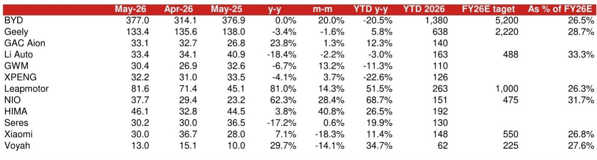
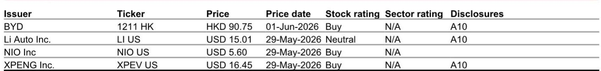
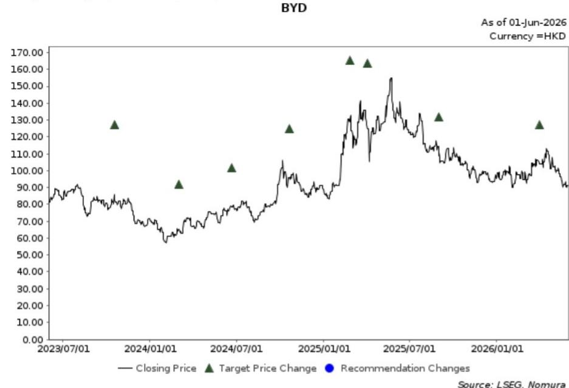

# 中国车市真正的分化不在电动化，而在“谁的海外能扛”

5月的数据，像一面镜子。

北京车展的喧嚣刚落，市场交出的答卷并不令人振奋。某外资投行最新发布的研报指出，5月中国乘用车市场整体批发销量可能再度录得超过20%的同比下滑。这不是一个意外，而是缺乏增量政策刺激下，本地需求持续疲软的延续。

但在这片低迷中，一个结构性的信号值得所有产业决策者关注：新能源汽车的渗透率预计将再次站上60%的高位。电动车企继续显著跑赢燃油车玩家。市场真正在发生的，不是“电动化”与“燃油车”之间的胜负已分，而是电动车企内部，一场围绕“海外增量”与“本地份额”的残酷分化正在加速。

这份报告的真正洞察在于：在一个整体需求缺乏弹性的市场里，只有两类玩家能够获得超额表现——那些海外业务贡献持续扩大的公司，以及那些即便在国内市场，也能凭借技术和产品升级实现份额逆势增长的公司。前者决定了增长的“天花板”，后者决定了生存的“安全垫”。

## 1. 整体市场低迷，但渗透率新高背后是“结构性”而非“周期性”的驱动力

5月的数据再次确认了一个判断：中国乘用车市场的本地需求，已经进入了一个缺乏政策刺激的“存量博弈”阶段。北京车展未能带来实质性的订单转化，CPCA前24天的初步数据也指向了又一个双位数下跌的月份。

然而，电动车渗透率持续维持在60%以上，这并非简单的消费偏好转移。更深层的原因在于，电动车企，尤其是头部玩家，正在通过产品和技术迭代，主动创造需求，而非被动等待市场回暖。这种“供给创造需求”的能力，是燃油车厂商在当前环境下难以复制的。

这意味着，对于投资者和行业观察者而言，关注月度总量已经失去意义。真正的信号，藏在每个玩家的“结构性”变量里：海外占比、技术升级节奏、以及新车型的订单转化效率。

## 2. 比亚迪的“止跌”信号：海外扛起半壁江山，但国内复苏仍需验证

比亚迪5月交付37.7万辆，同比持平，环比增长20%。这是自去年9月以来，比亚迪首次实现同比不下跌。但仔细拆解数据，更能看清真相：海外销量达到16.06万辆，同比增长80%。剔除海外，其国内批发量约为21.63万辆，同比下降25%。虽然相比4月的-39%有所收窄，但国内市场的压力依然巨大。

研报的积极信号在于，比亚迪的“技术牌”开始重新吸引消费者。其超快充车型的市场反馈积极，而5月28日发布的自主研发4nm智能驾驶芯片，也展示了其垂直整合的深度。随着刀片电池产能的进一步爬坡，叠加海外市场的稳健增长，研报判断比亚迪有望在2026年下半年实现国内出货量的同比改善。

这里的关键洞察是：比亚迪的“止跌”并非国内市场的反转，而是海外增量对冲了国内的下行。对于一家市值庞大的公司而言，海外业务的持续高增长，才是其估值获得支撑的核心逻辑。但国内能否真正企稳，仍需后续几个月的订单数据来验证。

## 3. 新势力阵营的分水岭：不是“谁卖得多”，而是“谁在增长”

5月的数据清晰地划出了一条分水岭。零跑汽车以8.16万辆的批发量，同比增长81%，环比增长14.3%，再创历史新高，成为新势力中当之无愧的“增长之王”。蔚来汽车交付3.77万辆，同比增长62.3%，环比增长28.4%，其中主品牌NIO连续7个月销量破万，子品牌乐道和萤火虫也在贡献增量。

而理想汽车交付3.34万辆，同比下滑18.4%，环比下滑2.2%。小鹏汽车交付3.22万辆，同比下滑4.1%，环比微增3.7%。小米和鸿蒙智行（HIMA）则分别维持在3万辆和4.61万辆的水平。

这份数据揭示了一个残酷的事实：在渗透率已经很高的市场里，增长不再是普惠的。零跑和蔚来的高增长，背后是产品定位的精准和订单的持续转化。零跑凭借极致性价比和产品力，正在收割对价格敏感但对技术有要求的用户。蔚来则通过多品牌战略（NIO、乐道、萤火虫）实现了对20万至60万价格带的全面覆盖，ES8的持续热销和ES9的积极反馈，证明了其高端定位的护城河。

理想的下滑则提醒市场：增程路线的红利并非无限。当竞品纷纷推出类似产品，且纯电产品线尚未形成规模时，理想的订单转化能力面临考验。研报也指出，理想需要更多努力来改善L9 Ultra版本的订单情况，而6月的技术发布会和新L8的上市，将是其扭转局面的关键催化剂。

## 4. 报告尚未完全回答的关键问题：海外增长的“质量”与“可持续性”

这份研报反复强调“海外贡献”是区分玩家优劣的关键变量。但一个报告未能完全展开的问题是：海外增长的“质量”究竟如何？

比亚迪的海外销量暴增80%，但其中有多少是真正的终端零售，有多少是渠道库存？不同市场的定价策略和利润贡献如何？更重要的是，欧盟、美国等主要市场的关税和政策风险，是否会在下半年集中释放？这些因素将直接影响海外业务的盈利能力和可持续性。

同样，零跑和蔚来的海外布局尚在早期，其海外销量在总销量中的占比仍然较低。对于这些公司而言，国内市场的增长仍然是其当前估值的核心支撑。海外市场是“第二曲线”，但这条曲线的斜率有多陡，还需要更长时间的数据来验证。

这一未解问题，恰恰是投资者在阅读完这份报告后，最需要深入探讨的议题。它决定了我们对该行业长期增长潜力的判断。

## 5. 给决策者的观察框架：从“销量排名”转向“三个核心指标”

基于以上分析，对于关注中国电动车产业的决策者和投资者，传统的月度销量排名已经失去了参考价值。真正有效的观察框架，应该聚焦于三个核心指标：

**第一，订单转化效率与“在手订单”的可见性。** 研报中反复提及“根据我们的行业渠道调研，订单势头良好”。这意味着，月度交付量是滞后指标，而“订单”是领先指标。关注公司管理层是否提供订单指引，以及第三方渠道的订单追踪数据，比关注已交付数据更具前瞻性。

**第二，海外业务的“量价利”结构。** 不能只看海外销量增速，更要看海外业务的毛利率是否高于国内，以及不同市场的收入结构。能够将海外业务做成“利润中心”而非“销量中心”的公司，才具备穿越周期的能力。

**第三，技术迭代的“变现能力”。** 比亚迪的4nm智驾芯片、蔚来的ES9、零跑的新平台——这些技术发布后，是否真正转化为了订单和市场份额的提升？技术投入如果不能转化为可量化的商业结果，就只是成本。

这三个指标，构成了一个比“月度销量排名”更有深度的分析框架。它帮助我们从“看热闹”转向“看门道”。

---

这份研报提供了一幅清晰的图景：中国电动车市场正在从“规模竞赛”进入“效率竞赛”。那些能够同时管理好国内份额、海外扩张和技术变现三件事的公司，将在下一轮洗牌中占据有利位置。

但正如我们上文所讨论的，海外增长的“质量”和可持续性，是这份报告留下的一扇未完全打开的门。如果你对以下问题感兴趣：不同车企的海外利润率究竟如何？欧盟反补贴调查对具体公司的潜在影响有多大？零跑的海外策略与比亚迪有何本质区别？那么，欢迎来我们的知识星球和微信群继续讨论。我们将基于这份研报的原始数据，结合更多公开信息，深入拆解这些尚未完全解答的议题。

Personal reading notes and learning share only. Not investment advice.

