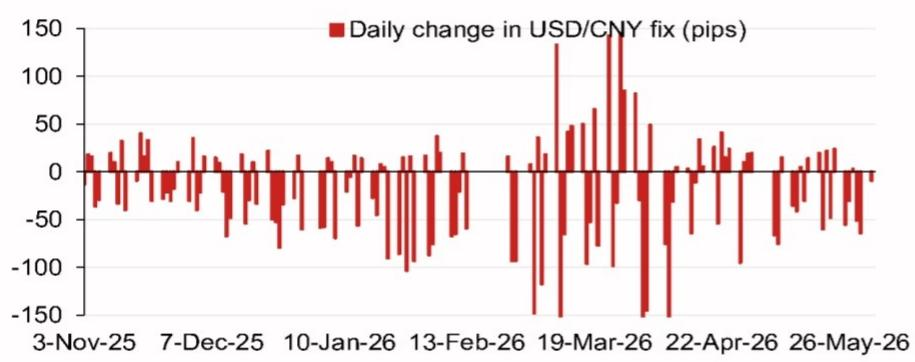
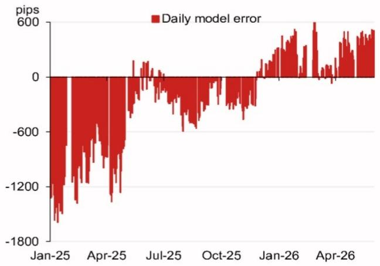

# 人民币中间价模型正在发出一个被忽视的定价信号

市场参与者普遍将人民币汇率走势归因于中美利差、贸易摩擦和央行干预意愿。但某外资投行最新发布的中间价模型预测显示，一个更底层、更技术性的变量正在发生结构性变化，其信号强度可能被当前主流叙事所低估。

这份截至2026年6月2日的模型预测显示，在没有逆周期因子调整的情况下，美元兑人民币中间价模型预测值为6.7762，较前一日6.8167的预测值下降了405个基点。即便计入逆周期因子，模型预测值仍为6.7988，较前一日中间价低179个基点。

这不是一个简单的短期波动。这是模型对一篮子货币权重、隔夜市场波动以及政策干预框架三者之间动态关系的重新定价。理解这个信号，比猜测央行下一步动作更有意义。

## 1. 模型预测的下降幅度本身就是一个需要解释的信号

405个基点的单日模型预测下降，在近一年的数据中并不常见。回顾模型误差的历史走势，2025年初模型曾出现高达1800个基点的负向误差，而进入2026年后，误差范围显著收窄至600个基点以内。这意味着模型的预测能力正在增强，或者说，市场定价与模型隐含的均衡水平之间的偏离正在收敛。

但更重要的是，这次下降并非孤立事件。模型预测的下降建立在隔夜一篮子货币变动的加权贡献之上。根据报告披露的权重数据，韩元、俄罗斯卢布、欧元和澳元是贡献最大的四个币种，分别贡献了27.5、23.2、20.1和8.3个基点。这些币种的集体走强，直接推动了人民币中间价模型预测的下行。

这意味着什么？人民币的定价逻辑正在从单纯的中美双边博弈，回归到更广泛的贸易加权篮子框架。任何忽略这一框架的汇率判断，都可能高估或低估了中间价的真实弹性。

## 2. 逆周期因子的角色正在从“对冲工具”转向“信号放大器”

模型预测值与计入逆周期因子后的预测值之间的差值，是理解政策意图的关键窗口。当前，两者相差226个基点。这个数字本身并不惊人，但结合近期中间价的实际走势来看，逆周期因子的使用频率和幅度正在发生微妙变化。

报告中的日度中间价变动图显示，2025年11月至2026年5月期间，中间价绝大多数时间保持稳定，仅在2026年3月19日出现过约150个基点的调整。这种“长期稳定、偶发调整”的模式，本身就是逆周期因子在发挥作用——它平滑了市场波动，维持了中间价的预期稳定性。

但模型预测的下降幅度明显大于近期中间价的实际调整幅度。这意味着，如果模型预测准确，央行要么需要通过逆周期因子来吸收这部分压力，要么允许中间价向模型预测值靠拢。无论哪种选择，逆周期因子的角色都在从被动的“对冲波动”转向主动的“信号管理”。投资者需要关注的不是逆周期因子是否存在，而是它在什么阈值下被触发，以及触发后的调整幅度是否超出市场预期。

## 3. 模型误差的历史分位数揭示了一个未被充分讨论的风险

报告提供的模型误差历史数据值得深挖。2025年初，模型误差曾达到-1800个基点，这意味着模型大幅高估了中间价。此后误差逐步收窄，但到2026年4月，误差仍维持在-600个基点左右。

误差的收窄本身是好事，但它也意味着模型正在更紧密地跟踪实际中间价。一旦模型预测与实际中间价出现系统性偏离，修复的速度和幅度可能会比过去更快。当前模型预测较前一日下降405个基点，而实际中间价尚未充分反映这一变化。如果误差持续为负，市场可能会面临中间价加速向模型预测靠拢的修正压力。

这里有一个关键问题：模型误差的收窄是否意味着中间价定价效率的提升？如果是，那么未来中间价的波动性可能会增加，因为模型捕捉到的信号将更快地传导至实际定价。如果不是，那么误差的收窄可能只是暂时的，模型与实际之间的差距仍可能重新扩大。报告没有给出明确的结论，但这个问题本身值得持续跟踪。

## 4. 关键事件日历指向一个判断汇率走势的新框架

报告附带的2026年下半年事件日历，为理解汇率走势提供了一个超越技术分析的框架。7月底的政治局会议、11月的APEC会议、以及年底中国领导人访美，构成了三个重要的政策窗口期。

这些事件对汇率的影响路径并非线性。政治局会议可能释放稳增长信号，从而支撑人民币；APEC会议可能涉及贸易议程，影响市场对关税风险的定价；而领导人访美则是最高级别的外交信号，其成果将直接影响市场对中美关系的整体预期。

将这些事件与模型预测结合起来看，一个更完整的判断框架浮出水面：短期来看，模型预测的下行压力需要央行通过逆周期因子或实际中间价调整来消化；中期来看，政策事件将成为决定汇率方向的关键变量；长期来看，人民币汇率的定价权正在从单一的双边博弈，回归到更复杂、更多元的篮子框架和事件驱动逻辑。

## 5. 报告尚未完全回答的关键问题：模型权重是否在动态调整？

这份报告最引人深思的部分，不是它预测了什么，而是它没有回答什么。模型对一篮子货币的权重设定是否稳定？如果权重在动态调整，调整的依据是什么？这些信息在公开报告中并未完全展开。

从逻辑上推断，如果韩元和卢布的权重贡献持续上升，这可能意味着模型正在重新校准对新兴市场货币的敏感度。而如果欧元的权重保持稳定，则说明美元指数篮子依然是核心锚。这些权重的变化，本质上是对全球贸易格局和资本流动结构的隐性映射。

另一个未解问题是：逆周期因子的参数是否在变化？报告给出了计入逆周期因子后的预测值，但没有披露逆周期因子的具体计算方式或参数调整逻辑。这意味着，市场无法独立验证逆周期因子的“真实”影响。对于机构投资者而言，这既是风险，也是信息优势的来源——谁能更准确地拆解逆周期因子的行为模式，谁就能在汇率定价中占据先机。

---

这些未解问题，恰恰是这份报告最有价值的部分。模型预测给出了一个明确的信号，但真正的判断力来自对信号背后机制的理解。如果你对如何拆解逆周期因子的行为模式、如何跟踪模型权重的动态变化、以及如何将这些信号融入实际的汇率风险管理框架感兴趣，欢迎来星球微信群里继续讨论。我们会围绕这份报告的核心假设和未解问题，做更深入的框架推演和情景分析。

Personal reading notes and learning share only. Not investment advice.

