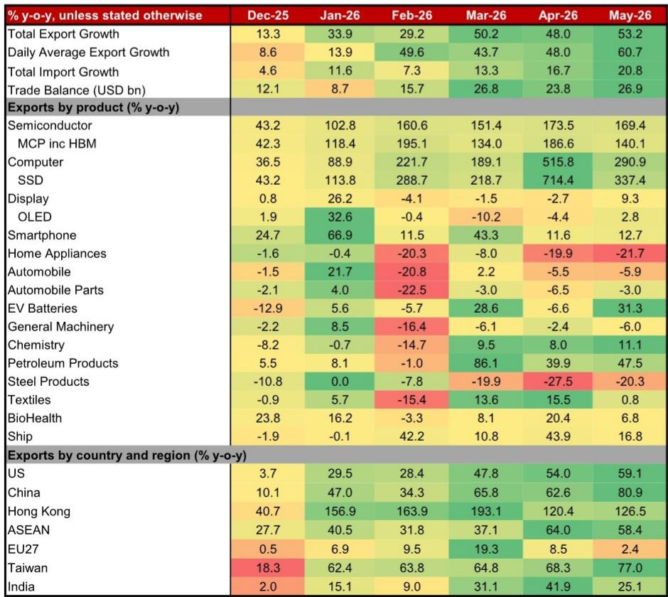
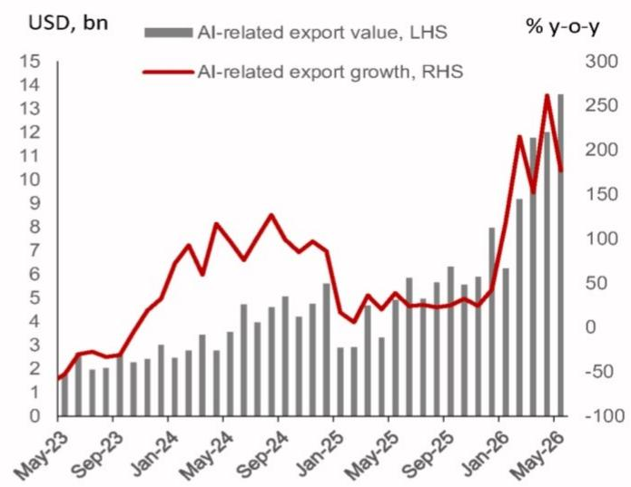
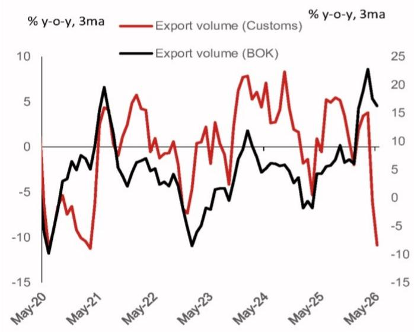

# 韩国出口的真相：AI 推高了价格，但没有推宽复苏

韩国5月出口同比增长53.2%，贸易顺差在2026年前五个月就超过了2017年全年纪录。这组数字表面上看是经济强劲的信号，但某外资投行最新研报揭示了一个更微妙的判断：这场出口繁荣的核心驱动力是AI芯片价格暴涨，而非出口量的普遍扩张。更关键的是，韩国央行使用的价格指数可能高估了实际出口对GDP的拉动作用，这意味着市场对韩国经济复苏的乐观程度可能超出了基本面支撑。

这份报告的核心洞察不在于“韩国出口很好”，而在于“出口好得不够均匀”——AI相关的高价芯片撑起了大部分增长，而汽车、机械、钢铁等传统部门仍在萎缩。这种K型复苏的结构性特征，对理解韩国央行未来的加息路径、以及对全球科技供应链的定价逻辑，都有重要的启示。

## 1. 芯片价格暴涨正在制造“名义繁荣”，但实际出口量已经连续两个月下滑

5月韩国半导体出口同比增长169.4%，创下月度新高。其中DRAM出口增长369.8%，NAND出口增长206.8%。DDR5 16Gb固定价格从2025年5月的4.80美元飙升至2026年5月的37.50美元，涨幅高达682.1%。这些数字看起来像是一场全面的出口爆发，但报告揭示了一个关键的分化：以吨位计算的海关出口量在5月同比下跌18%，连续第二个月出现两位数下滑。

这意味着韩国出口的增长几乎完全由价格驱动，而非数量驱动。对于依赖“量价齐升”逻辑来支撑经济复苏预期的投资者来说，这是一个需要警惕的信号。当芯片价格周期进入平稳或下行阶段，出口增速将面临急剧回落。

报告进一步指出，韩国央行使用的出口价格指数可能未能及时反映近期HBM和AI相关芯片价格的暴涨。由于央行指数基于2020年基准结构，它对新产品、高单价产品的价格变化反应较慢，这可能导致其对实际出口量的估算偏高，进而高估出口对GDP的贡献。这个技术细节对理解韩国央行的政策立场至关重要：如果央行基于被高估的出口数据维持增长乐观，它可能会更早、更鹰派地加息。

## 2. AI相关出口已经占到总出口的42%，但其余部门仍在挣扎

半导体出口在5月占总出口的比重超过42%，加上计算机和SSD（同比分别增长290.7%和337.4%），AI基础设施相关的出口已经成为韩国出口的绝对主力。值得注意的是，SSD出口中很大一部分是面向AI数据中心的企业级产品，这反映出AI投资正在从芯片本身向存储和计算基础设施扩散。

然而，报告清晰地描绘了一幅“冰火两重天”的画面。汽车出口同比下降5.9%，其中内燃机汽车出口下降14.4%，虽然混合动力和电动车有所增长，但整体仍被供应链中断、中东地缘政治、美国关税以及海外生产转移所拖累。石油产品名义出口增长46.6%，但出口量下降23.8%；石化产品名义增长11.1%，出口量下降25.5%。钢铁出口同比下降20.3%，通用机械下降6.0%。

这些数据合在一起意味着：韩国经济的“引擎”是高度集中的。AI芯片及其相关硬件是唯一强劲的发动机，而传统的制造业支柱——汽车、钢铁、机械——要么停滞，要么萎缩。这种结构意味着出口增长对国内就业、工资和消费的传导效应将十分有限。报告对此的表述是“K-shaped exports”，即出口本身也是K型分化。

## 3. 出口价格指数分歧背后，藏着一个对GDP估算的关键误差

报告中最具技术含量、也最可能被市场忽视的洞察，是海关出口量与韩国央行出口量指数之间的显著分歧。自2025年以来，这两个指标开始走向不同方向：海关量指数在2026年5月同比下跌18%，而央行指数仍维持两位数的正增长。

分歧的根源在于价格折算方法的不同。海关基于产品层面的单位价值，而央行使用基于2020年基准结构的出口价格指数进行折算。当芯片价格在短期内出现数倍暴涨时，央行的价格指数因为基准结构滞后，无法充分反映价格变化，导致实际出口量被高估。

这个误差的潜在影响是巨大的。如果出口对GDP的贡献被高估，那么韩国央行基于增长乐观所做出的加息决策可能过于激进。报告维持2026年GDP增长2.4%的预测，低于央行2.6%的预测，并预计央行将从7月开始加息三次，分别在2026年7月、10月和2027年1月各加25个基点，将利率推至3.25%。

对于投资者而言，这意味着需要密切关注韩国央行是否会在后续数据中修正其出口量估算方法。如果央行最终承认出口量增长被高估，市场对加息的预期可能需要重新定价。

## 4. 对华出口的结构性变化：半导体供应链正在重塑贸易格局

5月韩国对华出口同比增长80.9%，连续第七个月增长。半导体是对华出口的主要贡献者，同比增长超过200%。这组数据表面上看是“中国需求复苏”的信号，但报告暗示了更深层的结构性变化：中国正在成为韩国半导体供应链中的“需求方”，而非传统意义上的“组装出口方”。

对美出口中半导体增长651%、计算机增长675%，同样反映出AI基础设施投资对美国市场的拉动。而对东盟出口增长58.4%，创下月度新高，半导体、石油产品、显示器和石化产品全面增长，显示韩国在区域IT和中间品供应链中的枢纽地位正在加强。

这些区域分化背后有一个共同的逻辑：AI投资正在重塑全球半导体贸易流向。韩国作为全球最大的存储芯片出口国，成为这一轮AI资本支出的最大受益者之一。但报告也提示，部分对东盟出口的增长是价格驱动而非数量驱动，石油和石化产品尤其如此。这意味着如果AI投资节奏放缓或芯片价格回落，这些区域的出口增速可能比预期更快地降温。

## 5. 报告尚未完全回答的关键问题：价格繁荣能持续多久？

这份报告清晰地揭示了韩国出口“量缩价涨”的结构性特征，但有一个关键问题没有完全展开：芯片价格的上涨周期还能持续多久？

报告提到DDR5和NAND价格在过去一年分别上涨了682%和807%，但并未分析这些价格水平是否已经接近历史极端值，以及供给端（如三星、SK海力士的产能扩张）何时会对价格形成压力。此外，HBM等高端产品的定价机制与普通DRAM不同，其价格走势是否更独立于周期，报告也没有给出明确的判断框架。

另一个未解的问题是：如果出口量持续下滑，而价格开始松动，韩国央行将如何调整其政策立场？报告假设央行基于增长乐观维持鹰派，但如果出口数据在未来几个月出现更明显的恶化，央行的反应函数可能发生变化。这些不确定性正是理解后续市场走势的关键变量。

上述这些未解的问题，恰恰是深入理解韩国经济和全球半导体周期的核心。欢迎来知识星球的微信群里，与更多产业链和宏观领域的读者一起讨论这些细节。我们会在群内分享完整研报的原始图表和更详细的拆解，帮助你建立自己的判断框架。

Personal reading notes and learning share only. Not investment advice.

