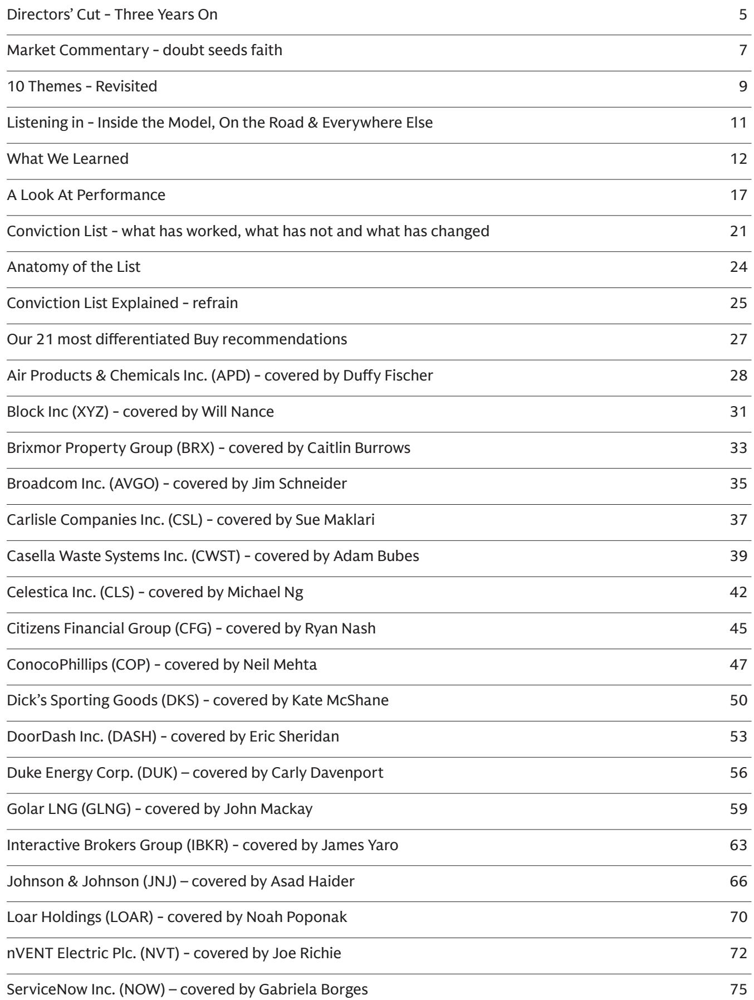
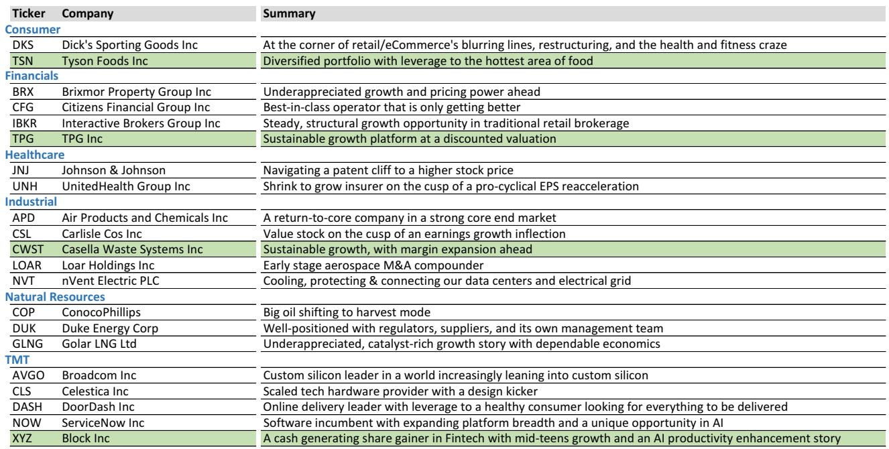
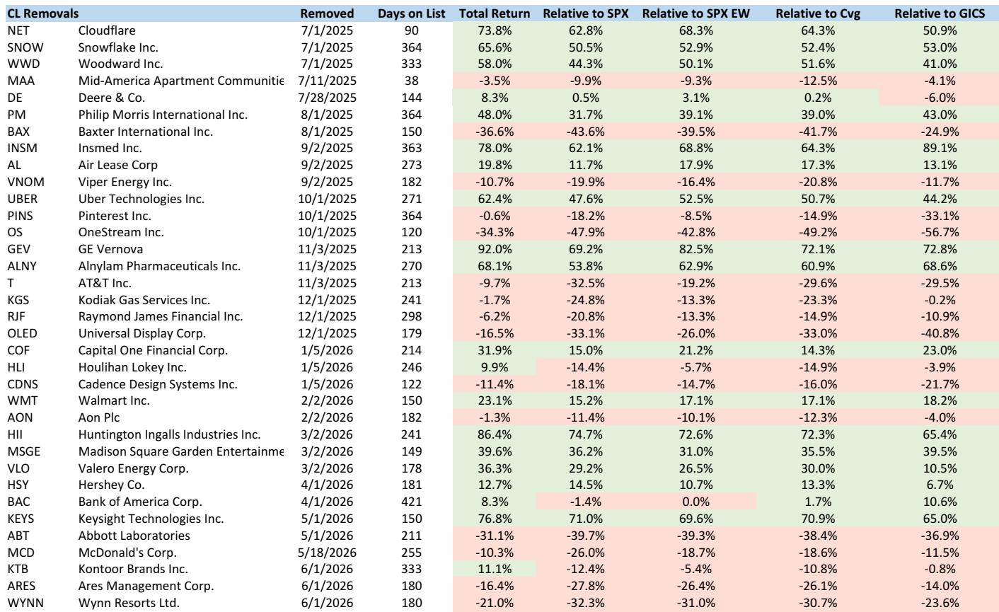

# Earnings Growth Has Fueled 84% of the S&P 500 Rally Since ChatGPT—But the Remaining 16% Requires Faith Investors Must Now Question

The three-year anniversary of a curated US equity conviction list offers more than a performance review. It provides a rare lens into how institutional-grade stock selection has fared in a market dominated by a single narrative: artificial intelligence. Since November 2022, the S&P 500 has risen 84%. Approximately two-thirds of that gain comes from earnings growth, not multiple expansion. The rest is faith. And faith, as the Trappist monk Thomas Merton observed, requires doubt. The question for serious investors is not whether to participate in this market, but whether their portfolio construction reflects an honest assessment of where doubt currently resides.

The report from which this analysis draws—a June 2026 update of a high-conviction stock list—reveals something counterintuitive. Despite the AI-driven rally, the list's equal-weighted return has lagged the cap-weighted S&P 500 by 180 basis points over the trailing twelve months. This is not a failure of stock picking. It is a structural reality of a market where themes have trumped numbers. Nearly 80% of names on the list beat their first-quarter earnings expectations after inclusion. Yet stocks in sectors that served as sources of funds underperformed. The implication is uncomfortable but clear: in a momentum-driven market, fundamental accuracy is necessary but not sufficient.

The report's authors have learned this firsthand. Their best month was February, when broader market participation rewarded idiosyncratic alpha from earnings reports. Their worst was the most recent month, May, when the list's underexposure to technology verticals driving the broader market led to underperformance. This pattern is not noise. It is a signal about the current market regime—one where concentration risk has become the dominant variable in portfolio outcomes.

---

## The Market Has Become One Big Trade, and That Trade Now Faces an Inflection Point in Compute Demand

Investors are looking at the current market as one big trade, according to the report's strategist. This observation is not hyperbolic. The AI infrastructure build-out has created a self-reinforcing cycle where capital expenditure drives earnings, which drives further capital expenditure. But the next leg of this cycle will not look like the first. A cross-sector technology analysis published in early May argues that agentic AI will drive a 24-fold increase in token consumption from current levels. Critically, the semiconductors required to generate these tokens will shift from GPUs to CPUs. This is not a marginal adjustment. It represents a fundamental change in the supply chain architecture that has underpinned the AI trade.

For portfolio construction, the implication is straightforward: the winners of the first phase of AI infrastructure may not be the winners of the second phase. The report identifies this as the key question for investors: where in the supply chain will value accrue? Will it be the enterprise layer, the model layer, the hyperscaler layer, or the chip layer? Each answer leads to a different portfolio. The report's conviction list includes names across this spectrum, but the analytical framework suggests that investors who treat AI as a monolithic theme are likely to be disappointed.

The broader point is that the market's current pricing embeds an assumption that the AI demand surge is structural, not cyclical. Yet the history of technology adoption is littered with examples of demand surges that were mistaken for permanent shifts—iPads, the Metaverse, internet service providers. The report does not argue that AI is another such example. It argues that the burden of proof has shifted. Investors who have ridden the momentum trade must now ask whether the earnings growth they are paying for can be sustained through a shift in the underlying technology architecture.

---

## Earnings Revisions Remain the Most Reliable Signal, But They Are No Longer Sufficient for Outperformance

The report's tracking of its own performance reveals a critical insight: the hit rate on ideas over the trailing twelve months has hovered around 50% against all metrics tracked. This is not a reflection of poor stock selection. It is a reflection of a market where thematic momentum has overwhelmed fundamental differentiation. The list succeeded in identifying names with positive earnings surprises—approximately 80% of names beat their first-quarter expectation after inclusion. Yet in a market where themes have often trumped numbers, stocks in sectors that served as sources of funds underperformed.

This creates a strategic dilemma for active managers. If earnings revisions no longer reliably lead to price appreciation, what does? The report's answer is twofold. First, earnings growth momentum remains the most powerful factor, but it must be combined with exposure to the dominant market theme. Second, stocks with earnings tailwinds and minimal correlation to the AI trade offer a different kind of value: portfolio diversification in a concentrated market.

The conviction list reflects this dual strategy. Names like DoorDash and Broadcom sit alongside Tyson Foods and Casella Waste Systems. The former group benefits from AI tailwinds. The latter group offers earnings growth independent of the AI narrative. This is not a hedge in the traditional sense. It is a recognition that in a market driven by one big trade, the most important portfolio decision is not which stock to buy, but how much exposure to allocate to the dominant theme.

---

## The Report's Most Valuable Contribution Is What It Does Not Fully Answer: How to Value a Market Where Earnings Growth Has Already Been Priced In

The report makes a compelling case that the S&P 500's year-end 2026 target of 8000 requires no P/E multiple expansion—only the realization of the 24% EPS growth rate forecast for this year. This is reassuring, but it raises a deeper question. If earnings growth has already been priced in, what is the source of future returns? The report's strategist notes that forward EPS estimates have risen 52% since November 2022, from $224 to $340 for 2026. This means that nearly two-thirds of the market's gain over the past three and a half years comes from earnings. The remaining third comes from multiple expansion—faith, in the report's framing.

The unresolved question is whether this faith is sustainable. The report points to doubts about AI's impact outside the ecosystem itself. It notes that the key question for investors is where value will accrue in the supply chain. But it does not provide a framework for answering that question. This is not a flaw in the report. It is an honest acknowledgment that the answer depends on developments that are inherently uncertain—the pace of agentic AI adoption, the evolution of semiconductor architecture, the regulatory response to concentration in the AI supply chain.

For readers, this means the report's value lies not in its specific recommendations but in its analytical framework. The conviction list is a set of hypotheses, not a set of predictions. The report's authors acknowledge this explicitly, noting that their process continues to evolve and that they have learned from both successes and failures. This intellectual honesty is rare in investment research. It is also the reason the report is worth reading in full.

---

## A Decision Framework for the Current Regime: Distinguish Between Earnings Momentum and Thematic Exposure, and Build Portfolios That Can Withstand a Regime Change

The report provides the raw material for a decision framework, even if it does not explicitly offer one. Based on its analysis, three principles emerge for portfolio construction in the current market.

First, distinguish between earnings momentum and thematic exposure. The report's data shows that earnings revisions alone are insufficient for outperformance. Stocks must also benefit from the dominant market theme. This means investors should categorize each position based on both its fundamental trajectory and its correlation to the AI trade. A stock with strong earnings growth but no AI exposure is a diversifier, not a return driver. A stock with AI exposure but weak earnings revisions is a momentum bet, not a fundamental investment.

Second, size positions based on conviction in the theme, not conviction in the stock. The report's best month was February, when broader market participation rewarded idiosyncratic alpha. Its worst month was May, when underexposure to technology led to underperformance. This pattern suggests that in the current regime, portfolio outcomes are driven more by thematic allocation than by stock selection. Investors should therefore allocate capital based on their confidence in the AI theme, then select stocks within that theme based on fundamental differentiation.

Third, prepare for a regime change. The report identifies the shift from GPUs to CPUs as a potential inflection point in the AI supply chain. It also notes that the current market is characterized by extreme concentration and momentum. Both factors suggest that the current regime is unlikely to persist indefinitely. Investors should therefore build portfolios that can withstand a shift in the dominant theme. This means maintaining exposure to stocks with earnings growth independent of AI, while being prepared to rotate into new themes as they emerge.

---

## The Full Report Contains the Charts and Data That Make These Insights Actionable

The analysis above draws on a single edition of a monthly conviction list update. The full report contains the charts, performance data, and individual stock write-ups that allow investors to apply these insights to their own portfolios. It includes the performance tracking of every name added to and removed from the list over the past year, the earnings revision data that underlies the hit rate analysis, and the detailed theses for each of the 21 stocks currently on the list.

For investors who want to understand not just what the report recommends, but why it recommends it—and how the process has evolved over three years of a historic market rally—the full document is essential reading. The charts alone are worth the time: they show the relationship between earnings revisions and price performance, the sector-level drivers of list performance, and the dispersion of outcomes across names that worked and names that did not.

Join the community to read the full report and review the original charts.

*This article is for learning and discussion only and does not constitute investment advice.*

Personal reading notes and learning share only. Not investment advice.

