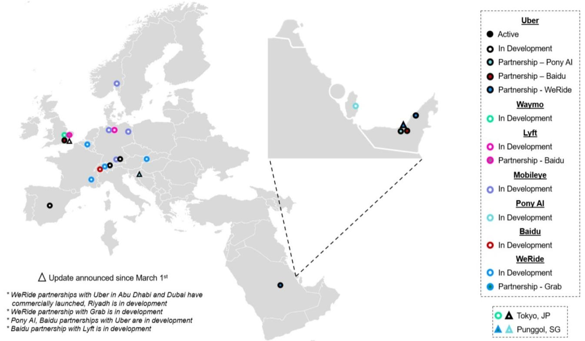
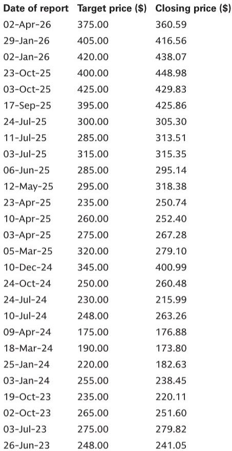
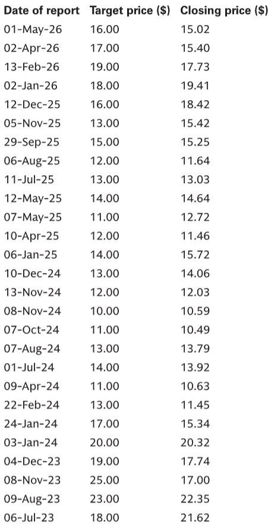

# Robotaxi Safety Data Is Promising, But Fleet Scale Remains the Real Bottleneck in 2026

The autonomous vehicle industry has reached a critical inflection point where safety data is finally becoming statistically meaningful, yet the gap between operational metrics and commercial viability remains stark. According to the latest analysis from a global investment bank, Tesla and Waymo are now generating enough miles to produce credible accident frequency figures, but the numbers reveal a paradox: both companies demonstrate safety records that likely exceed human drivers in key metrics, while their actual commercial footprints remain tiny relative to the rideshare incumbents. The central strategic question for investors is no longer whether robotaxis can be safe enough, but whether the path to scale is linear or will require fundamental breakthroughs in technology, regulation, and business model execution.

The data through mid-April 2026 shows Tesla experiencing an accident every 100,000 to 120,000 miles across its commercial operations, while Waymo records an accident every 150,000 to 175,000 miles. These figures, drawn from NHTSA filings and company disclosures, represent a meaningful dataset for comparison. However, the headline numbers conceal as much as they reveal. Tesla's fleet in Austin is a heterogeneous mix of vehicles operating with and without safety monitors, while Waymo operates commercially across more cities with a fully driverless fleet. The accident data also includes minor incidents that would never be reported by human drivers, such as driving over a curb. This means the raw safety comparison is not apples-to-apples, but the directional conclusion is clear: both systems are operating at a level that demands serious attention from regulators, competitors, and investors.

## Waymo and Tesla Are Demonstrating Compelling Safety Records, But the Data Is Not Yet Directly Comparable

The most striking pattern in the monthly accident data is the volatility. Tesla recorded zero accidents in August, February, and the first half of April, while posting a spike to one accident every 60,000 miles in January. Waymo showed similar variability, ranging from one accident every 100,000 miles in November to one every 405,000 miles in March. This month-to-month fluctuation suggests that small sample sizes still dominate the statistics, and that weather, geographic expansion, and operational changes can dramatically shift the numbers. Investors should resist the temptation to extrapolate from any single month's performance.

The fleet size disparity further complicates interpretation. Waymo's registered fleet stands at approximately 3,800 vehicles, including 577 in Texas, while Tesla's Texas fleet numbers just 42 vehicles. These registration figures likely include test vehicles and vehicles not currently in commercial operation, but the order-of-magnitude difference is undeniable. Waymo is running a real commercial operation across multiple cities; Tesla is running a pilot program with a fleet smaller than many corporate car-sharing services. The safety data from Tesla, while encouraging, comes from a fleet that is essentially a proof of concept, not a commercial rollout.

## User Adoption Metrics Reveal That Robotaxis Have Not Yet Cracked the Habit-Forming Usage Pattern of Traditional Rideshare

The SensorTower data on monthly active users and session frequency tells a story that safety statistics alone cannot capture. Waymo's MAUs have grown significantly, reaching approximately 3.9 percent of Uber's US MAUs in April 2026. This represents substantial growth from the 2.0 percent level in January 2025, and the trajectory is clearly upward. However, the session count data reveals a critical weakness: Waymo users open the app far less frequently than Uber or Lyft users. While Uber and Lyft users average between 19 and 25 sessions per month, Waymo users average between 6 and 12 sessions.

This gap in usage frequency is the single most important metric for understanding the current state of the robotaxi market. It suggests that while consumers are willing to try robotaxis, they have not yet integrated them into their daily transportation routines. Waymo is a novelty or a backup option, not a primary mobility solution. The implications for unit economics are profound. Lower frequency means lower lifetime value per user, higher customer acquisition costs as a percentage of revenue, and a longer path to the density utilization rates that make rideshare profitable. Until robotaxis can match the session frequency of traditional rideshare, the business model remains unproven at scale.

## The Deployment Pipeline Is Expanding Rapidly, But Execution Risk Separates Hype from Reality

The current and announced deployment map shows an industry in aggressive expansion mode. Uber now operates AV trips in eight cities with plans to reach fifteen by year-end, and its AV trips have increased more than tenfold year over year. Waymo provides over 500,000 rides per week across eleven cities and has announced full public access to Nashville, Miami, and Orlando since March. Tesla has expanded driverless service to Dallas and Houston and expects to reach seven metros in the coming months. Rivian announced a partnership with Uber to deploy up to 50,000 robotaxis based on the R2 platform, with initial launch in Miami and San Francisco in 2028.

Yet the operational reality is more nuanced. Waymo suspended robotaxi services on freeways in May to improve performance in construction zones, and paused services across multiple cities due to flooding. Tesla's CEO acknowledged that the next version of FSD, version 15, may be needed to start scaling more meaningfully, with availability targeted for late 2026. Media reports suggest that availability in Tesla's driverless cities remains limited. Mobileye remains on track for deployment in Los Angeles with the VW Group by year-end, but only without a safety driver, and scaling is planned for 2027.

The pattern is clear: every major player is announcing ambitious expansion plans while simultaneously encountering operational hurdles that force course corrections. This is not a sign of failure; it is the normal pattern of technology deployment in a safety-critical industry. But it means that investors should discount announced timelines by a significant margin. The gap between a press release and a reliable commercial service is measured in years, not quarters.

## What the Report Does Not Fully Answer: The Unit Economics of Robotaxi Operations Remain Opaque

The most significant analytical gap in the current data is the absence of meaningful unit economics. The report provides detailed safety metrics, fleet sizes, user adoption figures, and deployment timelines, but it does not disclose the cost per mile, revenue per ride, utilization rates, or capital expenditure requirements for any of the major players. This is not a criticism of the analysis; these figures are simply not publicly available at this stage of the industry's development. But the absence creates a critical uncertainty for investors.

Without unit economics, it is impossible to determine whether the current safety and adoption metrics are sufficient for a viable business. A robotaxi that is safer than a human driver but costs twice as much to operate is not a commercial success. A fleet that generates 500,000 rides per week but requires billions in capital expenditure and decades of depreciation is not necessarily a good investment. The industry is still in the phase where proving technical capability is the priority, but the transition to proving economic viability is the next and perhaps more difficult challenge.

Investors should watch for disclosures around cost per mile, maintenance expenses, remote monitoring costs, and insurance premiums. These figures will determine whether robotaxis are a disruptive technology or a niche service with high operational costs. The report's focus on safety and adoption is necessary, but it is not sufficient for making investment decisions.

## A Decision Framework for Evaluating Robotaxi Investments

For investors trying to navigate this complex landscape, the following framework can help separate signal from noise. First, prioritize fleet scale over safety statistics. Safety data from fleets under 100 vehicles is not statistically meaningful, regardless of how impressive the miles-between-accidents figure appears. Focus on companies that are operating fleets of at least 1,000 vehicles in commercial service without safety drivers. Second, watch user frequency metrics more closely than user acquisition numbers. A robotaxi service that cannot achieve session counts comparable to Uber or Lyft is not solving the right problem. Third, track deployment delays as a leading indicator. Every major robotaxi announcement has been followed by delays. The companies that acknowledge this pattern and build realistic timelines into their guidance are more credible than those that promise aggressive expansion without acknowledging operational risks. Fourth, pay attention to partnership structures. The asset-light model that Uber and Lyft are pursuing, where they serve as third-party marketplaces for AV fleet operators, may prove more capital efficient than vertically integrated approaches. Finally, monitor regulatory developments at the city and state level, as these will determine the pace of geographic expansion more than any technology breakthrough.

## The Full Report Contains Charts That Reveal the Underlying Trends in Safety, Adoption, and Deployment That This Analysis Can Only Describe

The original report includes detailed exhibits that show the month-by-month evolution of miles between accidents for both Waymo and Tesla, the trajectory of Waymo MAUs as a percentage of Uber's US base, and the comparative session frequency across rideshare apps. These charts reveal patterns that text alone cannot capture: the volatility of accident data, the seasonal variations in user adoption, and the gradual but uneven convergence of usage metrics. The deployment maps show the geographic distribution of active and in-development operations, providing context for which cities are likely to see commercial service first. For investors who want to understand the granular data behind the strategic analysis, the full report and its original charts are essential reading.

Join the community to read the full report and review the original charts.

*This article is for learning and discussion only and does not constitute investment advice.*

Personal reading notes and learning share only. Not investment advice.

