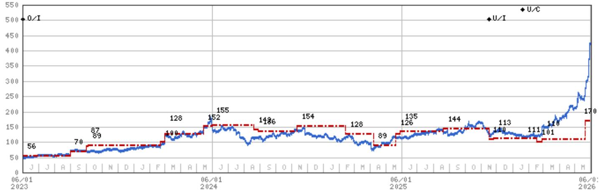
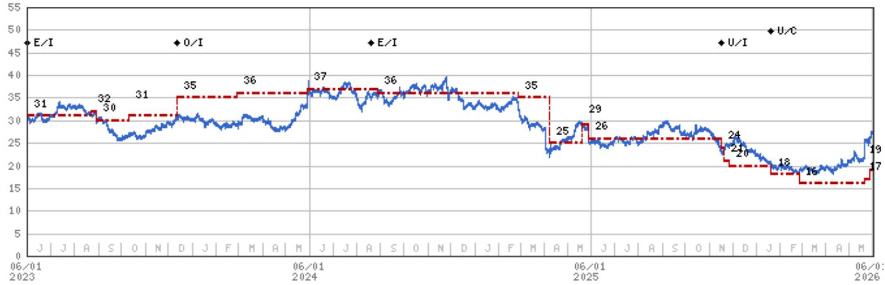
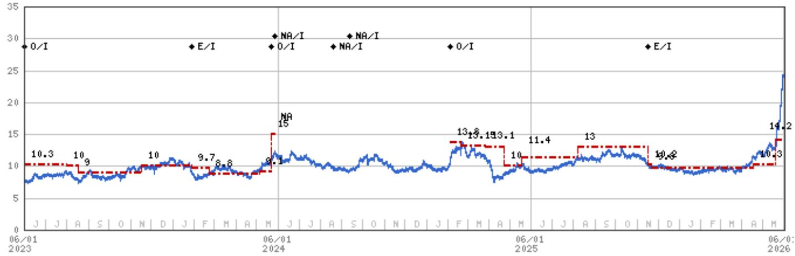

# IT Hardware | North America

# Key Takeaways From Our Taiwan Trip

Meetings in Taiwan reinforce our strong preference for HDDs and the future risk to Hardware demand/margins due to memory pricing, though we need to be more selective in our caution. Servers best positioned vs. PCs most challenged. By OEM, DELL best positioned vs. HPQ most challenged.

# Key Takeaways

Hardware OEMs are broadly getting decent memory supply given favorable margins to memory vendors, but still a gating factor.   
Server demand, led far and away by DELL, is most sustainable (but seeing most pull-fwd) vs. PC demand is deteriorating in real-time with margin risk in 2H/2027.   
■ HDD supply shortage intensifying due to inflecting demand strength, and shortages are now expected into CY29. Pricing could reach 3c/GB by CY28!   
- Vera Rubin on-track for 2H, with DELL an early qualifier. Greater L10 standardization is happening with VR, leaving 3-year OEM AI server forecasts less visible.   
By major OEM, DELL memory supply/pricing most favorable, followed by Lenovo, HPE and then HPQ.

I'd greatly appreciate your support for the MS IT Hardware & EMS team in this year's All-America Extel survey. Thank you so much! Erik

How to vote: To request a ballot, please go to https://www.extelinsights.com/voting and select "All-American Research Team".

2026 EXTEL

ALL-AMERICA
RESEARCH POLL

May 26 – June 12, 2026

We appreciate your support

VOTE HERE

# At a high level, what did we learn last week in Taiwan? (1) General Server

demand is extremely strong in 2026, and is expected to persist through 2027, though nearly the large majority of growth is coming from hyperscalers, primarily benefiting the Taiwanese ODMs, with the exception of Dell, which is gaining share of enterprise and potentially Tier 2 CSP customers. (2) HDD data points only continue to strengthen, with demand significantly inflecting in the last 1-2 months, resulting in a more significant CY26/27/28 under-supply vs. demand and even stronger pricing trends than we alluded to in early April – up to \$30/TB being

MS & CO. LLC

# Erik W Woodring

Equity Analyst

Erik.Woodring@morganstanley.com +1 212 296-8083

# Dylan Liu

Research Associate

Dylan.Liu@morganstanley.com +1 212 761-4519

# Maya C Neuman

Research Associate

Maya.Neuman@morganstanley.com +1 212 761-1946

# Rauf Ural

Research Associate

Rauf.Ural@morganstanley.com +1 212 761-5958

2026 EXTEL

ALL-AMERICA RESEARCH POLL

May 26 – June, 12 2026

VIEW OUR ANALYSTS >

# IT HARDWARE

North America

Industry View

Cautious

MS does and seeks to do business with companies covered in MS. As a result, investors should be aware that the firm may have a conflict of interest that could affect the objectivity of MS. Investors should consider MS as only a single factor in making their investment decision.

For analyst certification and other important disclosures, refer to the Disclosure Section, located at the end of this report.

targeted for mass capacity pricing in CY28. (3) PC demand is softening in real-time – primarily with consumers and SMBs – with enterprises starting to push back on pricing and the risk of channel inventory building into 2H rising (pointing to discounting risk in 2H). (4) Vera Rubin remains on-time in 2H with nearly all of our contact meetings pointing to greater standardization up to L10 AI server assembly, and likely margin pressure for ODMs/OEMs moving from GB300 to VR200 and beyond – it's unclear if this L10 standardization disintermediates AI servers OEMs because time to market still matters, but broad view is that this risk is clearly rising, though timing is uncertain. (5) Hardware OEMs are being prioritized by memory vendors, but are still short on supply. Memory vendors can get a higher price and margin from the hardware OEMs, and therefore don't want to commit to LTAs, but also will give supply to OEMs as a result. Specifically for NAND, Lenovo has the most inventory amongst the OEMs, while most favorable to more challenged pricing appears to be (1) DELL, (2) Lenovo, (3) HPE, and then (4) HPQ.

And how do these takeaways impact our broader industry thesis? The single most important change to our view – in real-time – is that memory supply is less of a risk to Hardware OEMs due to memory vendors prioritizing OEMs for favorable margins. That said, pricing is still going to remain a challenge into CY27, and clearly not all pricing is created equal, with DELL best-positioned (a factor behind our upgrade) and HPQ most challenged. Pricing is having the most negative impact on PCs and Smartphones, while Server demand is more inelastic, and enterprise storage is in-between, for now. Speaking of server strength, none of our meetings pointed to Agentic AI as a clear/material near-term tailwind to OEM server demand, and we're still not seeing an uptick in enterprise AI spending having a material impact on OEMs outside of a few vendors, namely DELL, which is executing extremely strong across general servers, AI servers, and PCs (despite the broad-based and material re-rating across Global Hardware names last week). Our meetings continue to point to the most significant pull-forward in Servers, followed by commercial PCs and Storage. Big picture, we remain concerned about the impact that memory and broader semiconductor inflation will have on hardware demand and margins, but we realize we also need to be more selective than our prior view, with Servers the only market (primarily concentrated with DELL) where there is clearer and more sustainable demand trend within enterprise spending. PCs still feel the most at-risk of demand and margin deterioration in 2H26 and into 2027. Broadly, we see large-scale, enterprise-skewed, diversified hardware OEMs as best positioned (DELL), and smaller, single-product category, more consumer skewed OEMs as most challenged. Please see a full slate of detailed takeaways from our Taiwan meetings below.

# Memory Supply/Demand for Hardware OEMs

\- Memory vendors are generally serving the Hardware OEM market because they: (1) don't need to lock in pricing and can charge higher rates over time (i.e., no multi-year LTAs); and as a result they (2) are capturing better profit margins on Hardware OEMs. That said, shortages are common, and most OEM procurement teams we spoke to are concerned about running out of some memory supply in 2H. But that could depend on consumer HW demand – if consumer demand materially worsens then some of that supply

could be allocated to commercial.

- Memory allocations for Hardware OEMs could be smaller in 2027 and 2028 vs. 2026, which is resulting in some OEMs being reluctant to cut their forecasts in 2026, because if smaller allocations are given now, 2027/2027 allocations could be smaller given strength in hyperscaler bit demand.   
- Dell is getting the best supply of the hardware OEMs due to: (1) strong LT relationships with suppliers (Samsung especially); (2) strength in senior leadership; and (3) broader scale than peers. As one contact said, Dell is "monetizing their memory relationships" right now. One the other hand, we were told HPQ is having more challenges sourcing cost competitive memory, sometimes paying above what other OEMs are currently paying.   
- We were told Lenovo has the most NAND inventory of the OEMs. DELL NAND inventory is "okay" but it will be fine paying higher prices. This specific contact believes HPQ will see lower Q/Q PC operating margins in C2Q due to memory costs, and that this could last into CY27 (though there is some supposition in this comment). HPE NAND inventory is low, but it is doing "okay" with procurement from Kioxia and Samsung. In order of lowest to highest cost per bit for NAND amongst the major OEMs it appears the ranking is (1) DELL, (2) Lenovo, (3) HPE, and then (4) HPQ.   
- Beyond memory, OEMs are seeing the most inflationary semiconductor environment they have been in. Only areas of clear deflation are certain display types and camera modules.

# Traditional / General Purpose Server

- ODMs are seeing strengthening demand in Gen Purpose CPU servers from Agentic Inference workloads, which are more suitable for certain inferencing workloads. META and MSFT CPU server orders are "very strong".   
- Enterprise CPU server orders for certain OEMs were flattish Y/Y to start the year, but there was a material uptick from a customer (DELL) in March, and now this contact sees 20% Y/Y general server growth in CY26 for this OEM customer (DELL). This was reinforced by other contact meetings suggesting Dell 6mo server pipeline is very strong.   
- Overall, enterprise server order momentum is strong due to: (1) pent-up demand from last year; and (2) concern of price hikes and pull-in. Not clear how much Agentic AI is as a tailwind to broader general server demand. One OEM described Agentic AI demand for OEM servers as a "future story" and "maybe next year" while another said "it's not a material tailwind now".   
- While not fully confirmed who, DELL appears to be taking on incremental general-purpose CPU orders from neoclouds as their supply is near-best in the industry.   
- There is pull-forward in enterprise general-purpose servers, but unclear exactly how much that's contributing to order upside in 1H26. Everyone is pricing to protect margins as much as possible right now, with limited pricing competition to gain share amongst the OEMs. It's too early to determine when server pull-forward ceases.   
- Nearly every OEM has reduced repricing window from 60-90 days to 0-15 days. DELL is most aggressive repricing overnight, but not leading to any

customer/share loss. HPE is around 10-15 days.

- Price hikes in General Server market vary greatly by SKU. Some pricing hikes are >100% Y/Y, but HPE is seeing \~20-25% Q/Q Server price hikes in 1Q and 25-30% Q/Q Storage pricing increases. HPE still had low-cost memory inventory in C1Q, which is true for most server OEMs. For HPE specifically, think C2Q margins could be pressured as input costs increase; same with C3Q, but it depends on commodity cost increases Q/Q.   
- DELL is seeing an increasing mix of AMD (vs. INTC) server sales. 2 generations ago it was 85%/15% INTC vs. AMD, now it's trending towards 75%/25%.

# AI Server

- Taiwanese AI server suppliers have a positive outlook on AI Server growth into 2027, but real-time visibility is limited. Neoclouds and sovereigns (Middle East and European) are driving this demand, though enterprise customer base is clearly growing, but just at much lower spend per customer.   
- Generally, most contacts agreed that AI server rack design is becoming more standardized to the L10 level with only a few components likely to be customized in the future, but manufacturing is still incredibly complex and time to market still matters clearly. One contact said this could potentially drive down manufacturing time by 50%, and allows NVDA to add more qualified suppliers. Most OEM contacts and industry experts we spoke with agreed standardization up to L10 would be a net negative for OEMs broadly. Tier 2 CSPs are looking at ODMs for deeper AI server manufacturing relationships, but no changes are being made right now.   
- DELL still targeting close to 12k AI Server racks in CY26/FY27, and should be one of first Vera Rubin customers – targeting 3Q launch but would be in very small volume (one other OEM agreed sample/testing would be in August with first volume deals in early C4Q). HPE AI server rack shipments in CY26 closer to 1-2k (xAI), at a relatively low (not sized) margin. HPE could ship around 25k HGX servers this year, but that's not doubling Y/Y (DELL HGX shipments are doubling this year). OEMs don't have a great 3-year view on AI server orders right now.   
- Not seeing or hearing any material AI server share shift away from SMCI, yet. There might have been a small order shift for xAI to DELL a few weeks ago, but xAI is still very cost sensitive and switching customers takes 2-3 quarters sometimes. SMCI is seeing more compliance tracking from NVDA, which got more stringent after March – 4 people from NVDA on every deal vs. 1 previously. But SMCI is still getting orders from Elon entities and ORCL (covered by Keith Weiss) and could see 2k rack shipments/quarter.   
- Wistron currently sees 2H26 AI Server rack shipments roughly flat H/H with 1H, with an order book that continues to grow.   
- Dell is looking for a second source ODM for Grace Blackwell rack L10 assembly, but hasn't found one. Compal is Dell's HGX ODM partner.

# HDD

- 3 weeks ago we were told HDD industry supply would be 200EB's short of demand in CY26, and 250EB's short of demand in CY27. Now we are hearing that supply is 300EB's short of demand in CY26, 400EB's short of demand in CY27, and 400EB's short of demand in CY28, as AI is driving significant strength in general-purpose server shipments and HDD demand.   
- As a result, it's believed HDD EB demand is growing closer to 40-50% per annum, while current supply (no greenfield additions expected) supports closer to 30% mass-capacity EB growth per annum. Supply growth will be dictated in large part by HAMR ramp/mix – faster mix, faster EB supply growth.   
- HDDs are targeted pricing in CY27/CY28 that is even stronger than we published in early April, with HDD vendors targeting up to \$25/TB (2.5c/GB) in CY27 and \$30/TB (3c/GB) in CY28. Blended mass-capacity price/TB is closer to \$15 today (or 1.5c/GB), implying the potential for nearly 100% pricing growth point-to-point into CY28. Generally, HDD vendors are not getting much pushback from hyperscalers – "they just ask for more supply".   
- "Spot" HDD pricing today is \$30-35/TB, with the channel seeing higher rates (Tier 2 CSPs will buy HDDs from the channel). For contracted (i.e., non-LTA) HDD customers, pricing was recently hiked 30% Q/Q.   
- STX specially should see a strong re-pricing from June to September quarter due to the timing of contracts rolling off/on, including legacy GOOGL contract.   
- There is a general belief amongst the industry that HDD vendors will surpass 60% gross margins in CY27, and could reach >70% in CY28.

# PC

- From 1 ODM: 1H26 notebook demand was stronger than original expectations, but little confidence the momentum will sustain. Seeing a downward trend through the year, with 3Q builds lower than 2Q, and 4Q builds lower than 3Q. Normally notebook builds are 45%/55% for 1H vs. 2H. Right now looking like 60%/40% for 1H26 vs. 2H26.   
- A PC OEM told us that there are real concerns on 2H26 demand, and could see up to 20% Y/Y volume declines. In fact, they are starting to see end demand weakening with double-digit Y/Y declines in consumer and SMB sales in the last 4 weeks, led by EMEA customers (seen through MSFT activations). This could create 2H margin risk due to the need to more heavily promote to clear channel inventory.   
- MacBook Neo is "nailing it" and is very short on supply because of how strong demand is.   
- Another PC OEM told us that they are getting pushback from large enterprises on pricing, and even this level of re-pricing isn't getting OEMs fully back to former enterprise margins.   
- Higher-end PC sales are relatively strong, but that's only because the low-end can't sell any PCs due to it being negative margins with memory prices rising so fast. Desktop demand is very weak, and CPU supply for these

products is tougher to come by.

# Enterprise Storage

\- Overall, enterprise storage demand is not nearly as strong as enterprise server demand, but all storage OEMs are taking significant price, up to 100% + Q/Q. Based purely on NAND procurement trends, NTAP appears to be signaling slower Y/Y demand than peers. DELL and HPE NAND inventory is low, but they are buying a "decent amount". There is a belief DELL is increasingly selling some storage to Tier 2 CSPs.

# Valuation Methodology and Risks

# Lenovo (0992.HK)

Base case, residual income model. Our key assumptions include a cost of equity of 9.3% (beta of 1.1, risk-free rate of 2.0%), a medium-term growth rate of 5.0%, and a terminal growth rate of 3.0%.

# Risks to Upside

■ Faster-than-expected smartphone and data center turnaround   
■ Stronger PC demand recovery in China   
■ Better cost savings and improved product mix   
■ Lower-than-expected increase in memory price

# Risks to Downside

■ Slower-than-expected smartphone and data center turnaround   
■ Weaker PC demand recovery in China   
■ Deterioration in cost savings and product mix   
■ Higher-than-expected increase in memory price

# Dell Technologies Inc. (DELL.N)

Our \$448 PT is based on a 20x P/E multiple on FY28 (CY27) EPS of \$22.40. This is 2x turns above DELL's prior peak valuation (and well-ahead of T5Y average valuation) to account for premium revenue/EPS growth and scarcity value vs. peers that are not executing to the same degree as DELL. We are hesitant to ascribe a meaningfully higher multiple given there are still uncertainties that exist around the magnitude and duration of current growth rates.

# Risks to Upside

■ Enterprise AI spending drives sustainability in the current cycle into FY29.   
■ Edge AI is reinvigorated by NVDA's new workstation launch (halo effect).   
■ Internal opex savings drives consistent opex declines

# Risks to Downside

■ AI Capex cycle slows   
■ Supply scarcity value and pull-forward start to decelerate resulting in NTM EPS rolling over sooner than modeled.   
■ Enterprise IT demand cannibalized by cloud workload migration

# Hewlett Packard Enterprise (HPE.N)

Our \$33 price target assumes a 13x target multiple on FY27e EPS of \$2.55. This implies a 17x multiple on HPE's networking business & an 8x multiple on HPE's traditional HW business. While 13x is a premium vs. T10Y average, we believe it is warranted given a greater mix of high growth and high margin networking following the acquisition of Juniper.

# Risks to Upside

■ Demand rebounds quicker than expected

■ Margin upside from more robust cost savings and share gains   
■ AI benefit to HPC / HPE Compute Business

# Risks to Downside

■ Weak enterprise hardware demand proves more secular than cyclical   
■ Public cloud migration accelerates declines in legacy business   
■ Pricing deteriorates in compute / storage   
■ Juniper integration (and cost synergies) takes longer than expected

# HP Inc. (HPQ.N)

Our \$19 price target is based on a 7x P/E multiple on FY27 EPS of \$2.65. Our 7x P/E multiple implies that HP trades at a 1x turn discount to its trailing 5-year average, which we believe takes into account PC market refresh, offset by secular declines in printing and margin pressures from higher input costs.

# Risks to Upside

■ PC recovery is stronger than expected despite inflationary tariff-driven pricing   
■ Better execution/share gains   
■ Stronger margin expansion through cost cuts   
■ Industry consolidation   
■ Stronger quarterly share repurchases

# Risks to Downside

■ Higher memory-induced prices cannibalize demand   
■ Memory &#39;supercycle&#39; is stronger for longer   
■ PC market share losses   
■ Commercial print volume/usage remains weak   
Dilutive M&A

# Disclosure Section

The information and opinions in MS were prepared by MS & Co. LLC, and/or MS C.T.V.M. S.A., and/or MS Mexico, Casa de Bolsa, S.A. de C.V., and/or MS Canada Limited. As used in this disclosure section, "MS" includes MS & Co. LLC, MS C.T.V.M. S.A., MS Mexico, Casa de Bolsa, S.A. de C.V., MS Canada Limited and their affiliates as necessary.

For important disclosures, stock price charts and equity rating histories regarding companies that are the subject of this report, please see the MS Disclosure Website at www.morganstanley.com/eqr/disclosures/webapp/generalresearch, or contact your investment representative or MS at 1585 Broadway, (Attention: Research Management), New York, NY, 10036 USA.

For valuation methodology and risks associated with any recommendation, rating or price target referenced in this research report, please contact the Client Support Team as follows: US/Canada +1 800 303-2495; Hong Kong +852 2848-5999; Latin America +1 718 754-5444 (U.S.); London +44 (0)20-7425-8169; Singapore +65 6834-6860; Sydney +61 (0)2-9770-1505; Tokyo +81 (0)3-6836-9000. Alternatively you may contact your investment representative or MS at 1585 Broadway, (Attention: Research Management), New York, NY 10036 USA.

# Analyst Certification

The following analysts hereby certify that their views about the companies and their securities discussed in this report are accurately expressed and that they have not received and will not receive direct or indirect compensation in exchange for expressing specific recommendations or views in this report: Erik W Woodring.

# Global Research Conflict Management Policy

MS has been published in accordance with our conflict management policy, which is available at www.morganstanley.com/institutional/research/conflictpolicies. A Portuguese version of the policy can be found at www.morganstanley.com.br

# Important Regulatory Disclosures on Subject Companies

The analyst or strategist (or a household member) identified below owns the following securities (or related derivatives): Maya C Neuman - Apple, Inc.(common or preferred stock). As of April 30, 2026, MS beneficially owned 1% or more of a class of common equity securities of the following companies covered in MS: Apple, Inc., CDW Corporation, Cricut Inc, Dell Technologies Inc., Everpure, Inc., Garmin Ltd, Hewlett Packard Enterprise, HP Inc., IBM, Kornit Digital Ltd., Logitech International SA, NetApp Inc, Resideo Technologies Inc, Seagate Technology, SmartRent, Inc., Sonos Inc., Teradata, Western Digital.

Within the last 12 months, MS managed or co-managed a public offering (or 144A offering) of securities of Dell Technologies Inc., Ingram Micro.

Within the last 12 months, MS has received compensation for investment banking services from CDW Corporation, Dell Technologies Inc., Lenovo, Seagate Technology.

In the next 3 months, MS expects to receive or intends to seek compensation for investment banking services from Apple, Inc., CDW Corporation, Dell Technologies Inc., Everpure, Inc., Garmin Ltd, GoPro Inc, Hewlett Packard Enterprise, HP Inc., IBM, Ingram Micro, Kornit Digital Ltd., Lenovo, Logitech International SA, NetApp Inc, Nutanix Inc, Resideo Technologies Inc, Seagate Technology, SmartRent, Inc., Sonos Inc., Teradata, Western Digital.

Within the last 12 months, MS has received compensation for products and services other than investment banking services from Apple, Inc., CDW Corporation, Dell Technologies Inc., Hewlett Packard Enterprise, HP Inc., IBM, Ingram Micro, Lenovo, NetApp Inc, Seagate Technology.

Within the last 12 months, MS has provided or is providing investment banking services to, or has an investment banking client relationship with, the following company: Apple, Inc., CDW Corporation, Dell Technologies Inc., Everpure, Inc., Garmin Ltd, GoPro Inc, Hewlett Packard Enterprise, HP Inc., IBM, Ingram Micro, Kornit Digital Ltd., Lenovo, Logitech International SA, NetApp Inc, Nutanix Inc, Resideo Technologies Inc, Seagate Technology, SmartRent, Inc., Sonos Inc., Teradata, Western Digital.

Within the last 12 months, MS has either provided or is providing non-investment banking, securities-related services to and/or in the past has entered into an agreement to provide services or has a client relationship with the following company: Apple, Inc., CDW Corporation, Dell Technologies Inc., Everpure, Inc., Garmin Ltd, Hewlett Packard Enterprise, HP Inc., IBM, Ingram Micro, Lenovo, NetApp Inc, Nutanix Inc, Resideo Technologies Inc, Seagate Technology, Sonos Inc..

An employee, director or consultant of MS is a director of HP Inc.. This person is not a research analyst or a member of a research analyst's household.

MS & Co. LLC makes a market in the securities of Garmin Ltd, Resideo Technologies Inc, Sonos Inc., TD Synnex Corporation, Teradata.

The equity research analysts or strategists principally responsible for the preparation of MS have received compensation based upon various factors, including quality of research, investor client feedback, stock picking, competitive factors, firm revenues and overall investment banking revenues. Equity Research analysts' or strategists' compensation is not linked to investment banking or capital markets transactions performed by MS or the profitability or revenues of particular trading desks.

MS and its affiliates do business that relates to companies/instruments covered in MS, including market making, providing liquidity, fund management, commercial banking, extension of credit, investment services and investment banking. MS sells to and buys from customers the securities/instruments of companies covered in MS on a principal basis. MS may have a position in the debt of the Company or instruments discussed in this report. MS trades or may trade as principal in the debt securities (or in related derivatives) that are the subject of the debt research report.

Certain disclosures listed above are also for compliance with applicable regulations in non-US jurisdictions.

# STOCK RATINGS

MS uses a relative rating system using terms such as Overweight, Equal-weight, Not-Rated or Underweight (see definitions below). MS does not assign ratings of Buy, Hold or Sell to the stocks we cover. Overweight, Equal-weight, Not-Rated and Underweight are not the equivalent of buy, hold and sell. Investors should carefully read the definitions of all ratings used in MS. In addition, since MS contains more complete information concerning the analyst's views, investors should carefully read MS, in its entirety, and not infer the contents from the rating alone. In any case, ratings (or research) should not be used or relied upon as investment advice. An investor's decision to buy or sell a stock should depend on individual circumstances (such as the investor's existing holdings) and other considerations.

# Global Stock Ratings Distribution

(as of May 31, 2026)

The Stock Ratings described below apply to MS's Fundamental Equity Research and do not apply to Debt Research produced by the Firm.

For disclosure purposes only (in accordance with FINRA requirements), we include the category headings of Buy, Hold, and Sell alongside our ratings of Overweight, Equal-weight, Not-Rated and Underweight. MS does not assign ratings of Buy, Hold or Sell to the stocks we cover. Overweight, Equal-weight, Not-Rated and Underweight are not the equivalent of buy, hold, and sell but represent recommended relative weightings (see definitions below). To satisfy regulatory requirements, we correspond Overweight, our most positive stock rating, with a buy recommendation; we correspond Equal-weight and Not-Rated to hold and Underweight to sell recommendations, respectively.

<table><tr><td></td><td colspan="2">Coverage Universe</td><td colspan="3">Investment Banking Clients (IBC)</td><td colspan="2">Other Material Investment ServicesClients (MISC)</td></tr><tr><td>Stock RatingCategory</td><td>Count</td><td>% of Total</td><td>Count</td><td>% of Total IBC</td><td>% of RatingCategory</td><td>Count</td><td>% of Total OtherMISC</td></tr><tr><td>Overweight/Buy</td><td>1542</td><td>42%</td><td>465</td><td>51%</td><td>30%</td><td>707</td><td>43%</td></tr><tr><td>Equal-weight/Hold</td><td>1571</td><td>43%</td><td>369</td><td>40%</td><td>23%</td><td>723</td><td>44%</td></tr><tr><td>Not-Rated/Hold</td><td>3</td><td>0%</td><td>0</td><td>0%</td><td>0%</td><td>1</td><td>0%</td></tr><tr><td>Underweight/Sell</td><td>551</td><td>15%</td><td>86</td><td>9%</td><td>16%</td><td>201</td><td>12%</td></tr><tr><td>Total</td><td>3,667</td><td></td><td>920</td><td></td><td></td><td>1632</td><td></td></tr></table>

Data include common stock and ADRs currently assigned ratings. Investment Banking Clients are companies from whom MS received investment banking compensation in the last 12 months. Due to rounding off of decimals, the percentages provided in the "% of total" column may not add up to exactly 100 percent.

# Analyst Stock Ratings

Overweight (O). The stock's total return is expected to exceed the average total return of the analyst's industry (or industry team's) coverage universe, on a risk-adjusted basis, over the next 12-18 months.

Equal-weight (E). The stock's total return is expected to be in line with the average total return of the analyst's industry (or industry team's) coverage universe, on a risk-adjusted basis, over the next 12-18 months.

Not-Rated (NR). Currently the analyst does not have adequate conviction about the stock's total return relative to the average total return of the analyst's industry (or industry team's) coverage universe, on a risk-adjusted basis, over the next 12-18 months.

Underweight (U). The stock's total return is expected to be below the average total return of the analyst's industry (or industry team's) coverage universe, on a risk-adjusted basis, over the next 12-18 months.

Unless otherwise specified, the time frame for price targets included in MS is 12 to 18 months.

# Analyst Industry Views

Attractive (A): The analyst expects the performance of his or her industry coverage universe over the next 12-18 months to be attractive vs. the relevant broad market benchmark, as indicated below.

In-Line (I): The analyst expects the performance of his or her industry coverage universe over the next 12-18 months to be in line with the relevant broad market benchmark, as indicated below. Cautious (C): The analyst views the performance of his or her industry coverage universe over the next 12-18 months with caution vs. the relevant broad market benchmark, as indicated below. Benchmarks for each region are as follows: North America - S&P 500; Latin America - relevant MSCI country index or MSCI Latin America Index; Europe - MSCI Europe; Japan - TOPIX; Asia - relevant MSCI country index or MSCI sub-regional index or MSCI AC Asia Pacific ex Japan Index.

Stock Price, Price Target and Rating History (See Rating Definitions)

Dell Technologies Inc. (DELL.N) - As of 06/01/26 GMT in USD Industry : IT Hardware   

line

| Date       | Value |
| ---------- | ----- |
| 06/01 2023 | 56    |
|            | 70    |
|            | 87    |
|            | 89    |
|            | 100   |
|            | 128   |
|            | 152   |
|            | 155   |
|            | 148   |
|            | 154   |
|            | 128   |
|            | 89    |
|            | 135   |
|            | 126   |
|            | 144   |
|            | 113   |
|            | 110   |
|            | 111   |
|            | 101   |
|            | 170   |

Stock Rating History: 6/1/21 : 0/A; 6/10/21 : 0/I; 10/5/21 : 0/C; 3/30/22 : E/C; 1/18/23 : E/I; 5/1/23 : 0/I; 11/16/25 : U/I; 1/20/26 : U/C   
Price Target History: 5/27/21 : 130; 8/26/21 : 133; 9/23/21 : 126; 11/2/21 : 67; 11/24/21 : 68; 2/25/22 : 66; 3/30/22 : 60;   
5/26/22 : 56; 8/25/22 : 54; 10/17/22 : 45; 2/21/23 : 47; 3/2/23 : 45; 5/1/23 : 55; 6/1/23 : 56; 8/31/23 : 70; 10/2/23 : 87;   
10/5/23 : 89; 2/21/24 : 100; 3/1/24 : 128; 5/14/24 : 152; 5/31/24 : 155; 8/19/24 : 142; 8/28/24 : 136; 11/11/24 : 154; 2/13/25 : 128;   
4/8/25 : 89; 5/20/25 : 126; 5/29/25 : 135; 8/21/25 : 144; 11/16/25 : 110; 11/26/25 : 113; 1/20/26 : 111; 2/17/26 : 101;   
2/27/26 : 110; 5/21/26 : 170   
Source: MS Date Format : MM/DD/YY Price Target No Price Target Assigned (NA)   
Stock Price (Not Covered by Current Analyst) — Stock Price (Covered by Current Analyst)   
Stock and Industry Ratings (abbreviations below) appear as ♦ Stock Rating/Industry View   
Stock Ratings: Overweight (O) Equal-weight (E) Underweight (U) Not-Rated (NR) No Rating Available (NA)   
Industry View: Attractive (A) In-line (I) Cautious (C) No Rating (NR)   
Effective January 13, 2014, the stocks covered by MS Asia Pacific will be rated relative to the analyst's industry (or industry team's) coverage.   
Effective January 13, 2014, the industry view benchmarks for MS Asia Pacific are as follows: relevant MSCI country index or MSCI sub-regional index or MSCI AC Asia Pacific ex Japan Index.

Hewlett Packard Enterprise (HPE.N) - As of 06/01/26 GMT in USD
Industry : IT Hardware   

line

| Date       | Value |
| ---------- | ----- |
| 06/01 2023 | 14    |
| 06/01 2024 | 15    |
| 06/01 2024 | 16    |
| 06/01 2024 | 19    |
| 06/01 2024 | 21    |
| 06/01 2024 | 23    |
| 06/01 2024 | 28    |
| 06/01 2024 | 24    |
| 06/01 2024 | 14    |
| 06/01 2025 | 22    |
| 06/01 2025 | 28    |
| 06/01 2025 | 25    |
| 06/01 2025 | 23    |
| 06/01 2025 | 33    |

Stock Rating History: 6/1/21 : E/A; 6/10/21 : E/I; 10/5/21 : E/C; 4/12/22 : U/C; 1/18/23 : U/I; 11/30/23 : E/I; 12/5/24 : O/I; 4/8/25 : E/I; 8/21/25 : O/I; 11/16/25 : E/I; 1/20/26 : E/C   
Price Target History: 4/7/21 : 17; 6/1/21 : 18; 10/5/21 : 16; 1/19/22 : 17; 4/12/22 : 15; 8/30/22 : 14; 10/11/22 : 12; 11/29/22 : 13;
3/2/23 : 14; 8/29/23 : 15; 11/28/23 : 16; 4/15/24 : 19; 6/4/24 : 21; 11/15/24 : 23; 12/5/24 : 28; 3/6/25 : 24; 4/8/25 : 14;
5/20/25 : 22; 8/21/25 : 28; 11/16/25 : 25; 2/17/26 : 23; 3/10/26 : 25; 5/21/26 : 33   
Source: MS Date Format : MM/DD/YY Price Target No Price Target Assigned (NA)   
Stock Price (Not Covered by Current Analyst) — Stock Price (Covered by Current Analyst)   
Stock and Industry Ratings (abbreviations below) appear as ♦ Stock Rating/Industry View   
Stock Ratings: Overweight (O) Equal-weight (E) Underweight (U) Not-Rated (NR) No Rating Available (NA)   
Industry View: Attractive (A) In-line (I) Cautious (C) No Rating (NR)   
Effective January 13, 2014, the stocks covered by MS Asia Pacific will be rated relative to the analyst's industry (or industry team's) coverage.   
Effective January 13, 2014, the industry view benchmarks for MS Asia Pacific are as follows: relevant MSCI country index or MSCI sub-regional index or MSCI AC Asia Pacific ex Japan Index.

HP Inc. (HPQ.N) - As of 06/01/26 GMT in USD   
Industry : IT Hardware   

line

| Date       | Value |
| ---------- | ----- |
| 06/01 2023 | 31    |
|            | 32    |
|            | 30    |
|            | 31    |
|            | 35    |
|            | 36    |
|            | 37    |
|            | 36    |
|            | 35    |
|            | 25    |
|            | 29    |
|            | 26    |
|            | 24    |
|            | 20    |
|            | 18    |
|            | 16    |
|            | 17    |
|            | 19    |

Stock Rating History: 6/1/21 : 0/A; 6/10/21 : 0/I; 8/26/21 : E/I; 10/5/21 : E/C; 3/30/22 : U/C; 1/18/23 : U/I; 5/1/23 : E/I;   
12/12/23 : 0/I; 8/19/24 : E/I; 11/16/25 : U/I; 1/20/26 : U/C   
Price Target History: 4/15/21 : 40; 8/26/21 : 31; 10/20/21 : 34; 3/30/22 : 31; 8/11/22 : 30; 8/31/22 : 28; 10/17/22 : 24;   
2/21/23 : 28; 5/1/23 : 31; 8/23/23 : 32; 8/29/23 : 30; 10/11/23 : 31; 12/12/23 : 35; 2/28/24 : 36; 5/29/24 : 37; 8/28/24 : 36;   
2/27/25 : 35; 4/8/25 : 25; 5/20/25 : 29; 5/28/25 : 26; 11/16/25 : 24; 11/20/25 : 21; 11/26/25 : 20; 1/20/26 : 18; 2/25/26 : 16;   
5/21/26 : 17; 5/28/26 : 19   
Source: MS Date Format : MM/DD/YY Price Target No Price Target Assigned (NA)   
Stock Price (Not Covered by Current Analyst) — Stock Price (Covered by Current Analyst)   
Stock and Industry Ratings (abbreviations below) appear as ♦ Stock Rating/Industry View   
Stock Ratings: Overweight (O) Equal-weight (E) Underweight (U) Not-Rated (NR) No Rating Available (NA)   
Industry View: Attractive (A) In-line (I) Cautious (C) No Rating (NR)   
Effective January 13, 2014, the stocks covered by MS Asia Pacific will be rated relative to the analyst's industry (or industry team's) coverage.   
Effective January 13, 2014, the industry view benchmarks for MS Asia Pacific are as follows: relevant MSCI country index or MSCI sub-regional index or MSCI AC Asia Pacific ex Japan Index.

Lenovo (0992.HK) - As of 06/01/26 GMT in HKD Industry : Greater China Technology Hardware   

line

| Date       | Value |
| ---------- | ----- |
| 06/01 2023 | 10.3  |
| 06/01 2023 | 10    |
| 06/01 2023 | 9     |
| 06/01 2023 | 10    |
| 06/01 2023 | 10    |
| 06/01 2023 | 9.7   |
| 06/01 2023 | 8.8   |
| 06/01 2023 | 9     |
| 06/01 2023 | NA    |
| 06/01 2023 | 15    |
| 06/01 2023 | NA    |
| 06/01 2023 | NA    |
| 06/01 2023 | NA    |
| 06/01 2023 | NA    |
| 06/01 2023 | NA    |
| 06/01 2023 | NA    |
| 06/01 2023 | NA    |
| Jan 2024   | 13.9  |
| Jan 2024   | 13.1  |
| Jan 2024   | 13.1  |
| Jan 2024   | 13.1  |
| Jan 2024   | 13.1  |
| Jan 2024   | 13.1  |
| Jan 2024   | 13.1  |
| Jan 2024   | 13.1  |
| Mar 2024   | 11.4  |
| Mar 2024   | 11    |
| Mar 2024   | 11    |
| Mar 2024   | 11    |
| Mar 2024   | 11    |
| Mar 2024   | 11    |
| Mar 2024   | 11    |
| Mar 2024   | 11    |
| Mar 2024   | 11    |
|
| Mar 2024   | 11    |
| Mar 2024   | 11    |
| Mar 2024   | 11    |
| Mar 2024   | 11    |
| Mar 2024   | 11    |
| Mar 2024   | 11    |
| Mar 2024   | 11    |
| Jun 2024   | 13    |
| Jun 2024   | 13    |
| Jun 2024   | 13    |
| Jun 2024   | 13    |
| Jun 2024   | 13    |
| Jun 2024   | 13    |
| Jun 2024   | 13    |
| Jun 2024   | 13    |

Stock Rating History: 6/1/21 : E/I; 5/1/23 : 0/I; 1/29/24 : E/I; 5/22/24 : 0/I; 5/28/24 : NA/I; 8/20/24 : NA/I; 9/12/24 : NA/I; 2/5/25 : 0/I; 11/16/25 : E/I   
Price Target History: 2/2/21 : 10.2; 7/23/21 : 8.4; 8/12/21 : 9; 11/5/21 : 9.5; 2/21/22 : 9.8; 3/7/22 : 8.5; 5/24/22 : 7.5;   
7/15/22 : 7.2; 8/10/22 : 7.6; 10/6/22 : 6.6; 11/3/22 : 6.7; 1/18/23 : 6.5; 2/20/23 : 6.4; 5/1/23 : 10.4; 5/25/23 : 10.3; 8/1/23 : 10;   
8/18/23 : 9; 11/17/23 : 10; 1/29/24 : 9.7; 2/23/24 : 8.8; 5/6/24 : 9.1; 5/22/24 : 15; 5/28/24 : NA; 2/5/25 : 13.8; 2/20/25 : 13.15;   
3/27/25 : 13.1; 4/23/25 : 10; 5/19/25 : 11.4; 8/8/25 : 13; 11/16/25 : 10.2; 11/21/25 : 9.8; 4/17/26 : 10.3; 5/19/26 : 14.2   
Source: MS Date Format : MM/DD/YY Price Target No Price Target Assigned (NA)   
Stock Price (Not Covered by Current Analyst) — Stock Price (Covered by Current Analyst)   
Stock and Industry Ratings (abbreviations below) appear as ♦ Stock Rating/Industry View   
Stock Ratings: Overweight (O) Equal-weight (E) Underweight (U) Not-Rated (NR) No Rating Available (NA)   
Industry View: Attractive (A) In-line (I) Cautious (C) No Rating (NR)   
Effective January 13, 2014, the stocks covered by MS Asia Pacific will be rated relative to the analyst's industry (or industry team's) coverage.   
Effective January 13, 2014, the industry view benchmarks for MS Asia Pacific are as follows: relevant MSCI country index or MSCI sub-regional index or MSCI AC Asia Pacific ex Japan Index.

# Important Disclosures for MS Smith Barney LLC Customers

Important disclosures regarding any material conflict of interest that can reasonably be expected to have influenced MS Smith Barney LLC's choice of a third-party research provider or the subject company of a third-party research report, are available on the MS Wealth Management disclosure website at www.morganstanley.com/online/researchdisclosures. For MS specific disclosures, you may refer to https://www.morganstanley.com/eqr/disclosures/webapp/generalresearch.

Each MS report is reviewed and approved on behalf of MS Smith Barney LLC. This review and approval is conducted by the same person who reviews the research report on behalf of MS. This could create a conflict of interest.

# Other Important Disclosures

A member of Research who had or could have had access to the research prior to completion owns securities (or related derivatives) in the Apple, Inc., Western Digital. This person is not a research analyst or a member of research analyst's household.

MS policy is to update research reports as and when the Research Analyst and Research Management deem appropriate, based on developments with the issuer, the sector, or the market that may have a material impact on the research views or opinions stated therein. In addition, certain Research publications are intended to be updated on a regular periodic basis (weekly/monthly/quarterly/annual) and will ordinarily be updated with that frequency, unless the Research Analyst and Research Management determine that a different publication schedule is appropriate based on current conditions.

MS is not acting as a municipal advisor and the opinions or views contained herein are not intended to be, and do not constitute, advice within the meaning of Section 975 of the Dodd-Frank Wall Street Reform and Consumer Protection Act.

MS produces an equity research product called a "Tactical Idea." Views contained in a "Tactical Idea" on a particular stock may be contrary to the recommendations or views expressed in research on the same stock. This may be the result of differing time horizons, methodologies, market events, or other factors. For all research available on a particular stock, please contact your sales representative or go to Matrix at http://www.morganstanley.com/matrix.

MS is provided to our clients through our proprietary research portal on Matrix and also distributed electronically by MS to clients. Certain, but not all, MS products are also made available to clients through third-party vendors or redistributed to clients through alternate electronic means as a convenience. For access to all available MS, please contact your sales representative or go to Matrix at http://www.morganstanley.com/matrix.

Any access and/or use of MS is subject to MS's Terms of Use (http://www.morganstanley.com/terms.html). By accessing and/or using MS, you are indicating that you have read and agree to be bound by our Terms of Use (http://www.morganstanley.com/terms.html). In addition you consent to MS processing your personal data and using cookies in accordance with our Privacy Policy and our Global Cookies Policy (http://www.morganstanley.com/privacy\_pledge.html), including for the purposes of setting your preferences and to collect readership data so that we can deliver better and more personalized service and products to you. To find out more information about how MS processes personal data, how we use cookies and how to reject cookies see our Privacy Policy and our Global Cookies Policy (http://www.morganstanley.com/privacy\_pledge.html). Please use the provided link to review the Terms and Conditions and Most Important Terms and Conditions for MS India Company Private Limited (https://www.morganstanley.com/assets/pdfs/about-us-global-offices/india/Terms\_and\_conditions.pdf) and the following link to review the audit report (https://ny.matrix.ms.com/eqr/research/webapp/researchdocs/

# MSICPL\_Morgan\_Stanley\_Research\_Audit\_Report.pdf).

If you do not agree to our Terms of Use and/or if you do not wish to provide your consent to MS processing your personal data or using cookies please do not access our research. MS does not provide individually tailored investment advice. MS has been prepared without regard to the circumstances and objectives of those who receive it. MS recommends that investors independently evaluate particular investments and strategies, and encourages investors to seek the advice of a financial adviser. The appropriateness of an investment or strategy will depend on an investor's circumstances and objectives. The securities, instruments, or strategies discussed in MS may not be suitable for all investors, and certain investors may not be eligible to purchase or participate in some or all of them. MS is not an offer to buy or sell or the solicitation of an offer to buy or sell any security/instrument or to participate in any particular trading strategy. The value of and income from your investments may vary because of changes in interest rates, foreign exchange rates, default rates, prepayment rates, securities/instruments prices, market indexes, operational or financial conditions of companies or other factors. There may be time limitations on the exercise of options or other rights in securities/instruments transactions. Past performance is not necessarily a guide to future performance. Estimates of future performance are based on assumptions that may not be realized. If provided, and unless otherwise stated, the closing price on the cover page is that of the primary exchange for the subject company's securities/instruments.

The fixed income research analysts, strategists or economists principally responsible for the preparation of MS have received compensation based upon various factors, including quality, accuracy and value of research, firm profitability or revenues (which include fixed income trading and capital markets profitability or revenues), client feedback and competitive factors. Fixed Income Research analysts', strategists' or economists' compensation is not linked to investment banking or capital markets transactions performed by MS or the profitability or revenues of particular trading desks.

The "Important Regulatory Disclosures on Subject Companies" section in MS lists all companies mentioned where MS owns 1% or more of a class of common equity securities of the companies. For all other companies mentioned in MS, MS may have an investment of less than 1% in securities/instruments or derivatives of securities/instruments of companies and may trade them in ways different from those discussed in MS. Employees of MS not involved in the preparation of MS may have investments in securities/instruments or derivatives of securities/instruments of companies mentioned and may trade them in ways different from those discussed in MS. Derivatives may be issued by MS or associated persons.

With the exception of information regarding MS, MS is based on public information. MS makes every effort to use reliable, comprehensive information, but we make no representation that it is accurate or complete. We have no obligation to tell you when opinions or information in MS change apart from when we intend to discontinue equity research coverage of a subject company. Facts and views presented in MS have not been reviewed by, and may not reflect information known to, professionals in other MS business areas, including investment banking personnel.

MS personnel may participate in company events such as site visits and are generally prohibited from accepting payment by the company of associated expenses unless pre-approved by authorized members of Research management.

MS may make investment decisions that are inconsistent with the recommendations or views in this report.

To our readers based in Taiwan or trading in Taiwan securities/instruments: Information on securities/instruments that trade in Taiwan is distributed by MS Taiwan Limited ("MSTL"). Such information is for your reference only. The reader should independently evaluate the investment risks and is solely responsible for their investment decisions. MS may not be distributed to the public media or quoted or used by the public media without the express written consent of MS. Any non-customer reader within the scope of Article 7-1 of the Taiwan Stock Exchange Recommendation Regulations accessing and/or receiving MS is not permitted to provide MS to any third party (including but not limited to related parties, affiliated companies and any other third parties) or engage in any activities regarding MS which may create or give the appearance of creating a conflict of interest. Information on securities/instruments that do not trade in Taiwan is for informational purposes only and is not to be construed as a recommendation or a solicitation to trade in such securities/instruments. MSTL may not execute transactions for clients in these securities/instruments.

MS is not incorporated under PRC law and the research in relation to this report is conducted outside the PRC. MS does not constitute an offer to sell or the solicitation of an offer to buy any securities in the PRC. PRC investors shall have the relevant qualifications to invest in such securities and shall be responsible for obtaining all relevant approvals, licenses, verifications and/or registrations from the relevant governmental authorities themselves. Neither this report nor any part of it is intended as, or shall constitute, provision of any consultancy or advisory service of securities investment as defined under PRC law. Such information is provided for your reference only.

MS is disseminated in Brazil by MS C.T.V.M. S.A. located at Av. Brigadeiro Faria Lima, 3600, 6th floor, São Paulo - SP, Brazil; and is regulated by the Comissão de Valores Mobiliários; in Mexico by MS México, Casa de Bolsa, S.A. de C.V which is regulated by Comision Nacional Bancaria y de Valores. Paseo de los Tamarindos 90, Torre 1, Col. Bosques de las Lomas Floor 29, 05120 Mexico City; in Japan by MS MUFG Securities Co., Ltd. and, for Commodities related research reports only, MS Capital Group Japan Co., Ltd; in Hong Kong by MS Asia Limited (which accepts responsibility for its contents) and by MS Bank Asia Limited; in Singapore by MS Asia (Singapore) Pte. (Registration number 199206298Z) and/or MS Asia (Singapore) Securities Pte Ltd (Registration number 200008434H), regulated by the Monetary Authority of Singapore (which accepts legal responsibility for its contents and should be contacted with respect to any matters arising from, or in connection with, MS) and by MS Bank Asia Limited, Singapore Branch (Registration number T14FC0118J); in Australia to "wholesale clients" within the meaning of the Australian Corporations Act by MS Australia Limited A.B.N. 67 003 734 576, holder of Australian financial services license No. 233742, which accepts responsibility for its contents; in Australia to "wholesale clients" and "retail clients" within the meaning of the Australian Corporations Act by MS Wealth Management Australia Pty Ltd (A.B.N. 19 009 145 555, holder of Australian financial services license No. 240813, which accepts responsibility for its contents; in Korea by MS & Co International plc, Seoul Branch; in India by MS India Company Private Limited having Corporate Identification No (CIN) U22990MH1998PTC115305, regulated by the Securities and Exchange Board of India ("SEBI") and holder of licenses as a Research Analyst (SEBI Registration No. INH000001105); Stock Broker (SEBI Stock Broker Registration No. INZ000244438), Merchant Banker (SEBI Registration No. INM000011203), and depository participant with National Securities Depository Limited (SEBI Registration No. IN-DP-NSDL-567-2021) having registered office at Altimus, Level 39 & 40, Pandurang Budhkar Marg, Worli, Mumbai 400018, India; Telephone no. +91-22-61181000; Compliance Officer Details: Mr. Tejarshi Hardas, Tel. No.: +91-22-61181000 or Email: tejarshi.hardas@morganstanley.com; Grievance officer details: Mr. Tejarshi Hardas, Tel. No.: +91-22-61181000 or Email: msic-compliance@morganstanley.com. MS India Company Private Limited (MSICPL) may use AI tools in providing research services. All recommendations contained herein are made by the duly qualified research analysts; in Canada by MS Canada Limited; in Germany and the European Economic Area where required by MS Europe S.E., authorised and regulated by Bundesanstalt fuer Finanzdienstleistungsaufsicht (BaFin) under the reference number 149169; in the US by MS & Co. LLC, which accepts responsibility for its contents. MS & Co. International plc, authorized by the Prudential Regulation Authority and regulated by the Financial Conduct Authority and the Prudential Regulation Authority, disseminates in the UK research that it has prepared, and research which has been prepared by any of its affiliates, only to persons who (i) are investment professionals falling within Article 19(5) of the Financial Services and Markets Act 2000 (Financial Promotion) Order 2005 (as amended, the "Order"); (ii) are persons who are high net worth entities falling within Article 49(2)(a) to (d) of the Order; or (iii) are persons to whom an invitation or inducement to engage in investment activity (within the meaning of section 21 of the Financial Services and Markets Act 2000, as amended) may otherwise lawfully be communicated or caused to be communicated. RMB MS Proprietary Limited is a member of the JSE Limited and A2X (Pty) Ltd. RMB MS Proprietary Limited is a joint venture owned equally by MS International Holdings Inc. and RMB Investment Advisory (Proprietary) Limited, which is wholly owned by FirstRand Limited. The information in MS is being disseminated by MS Saudi Arabia, regulated by the Capital Market Authority in the Kingdom of Saudi Arabia, and is directed at Sophisticated investors only.

MS Hong Kong Securities Limited is the liquidity provider/market maker for securities of Lenovo listed on the Stock Exchange of Hong Kong Limited. An updated list can be found on HKEx website: http://www.hkex.com.hk.

The information in MS is being communicated by MS & Co. International plc (DIFC Branch), regulated by the Dubai Financial Services Authority (the DFSA) or by MS & Co. International plc (ADGM Branch), regulated by the Financial Services Regulatory Authority Abu Dhabi (the FSRA), and is directed at Professional Clients only, as defined by the DFSA or the FSRA, respectively. The financial products or financial services to which this research relates will only be made available to a customer who we are satisfied meets the regulatory criteria of a Professional Client. A distribution of the different MS Research ratings or recommendations, in percentage terms for Investments in each sector covered, is available upon request from your sales representative.

The information in MS is being communicated by MS & Co. International plc (QFC Branch), regulated by the Qatar Financial Centre Regulatory Authority (the QFCRA), and is directed at business customers and market counterparties only and is not intended for Retail Customers as defined by the QFCRA.

As required by the Capital Markets Board of Turkey, investment information, comments and recommendations stated here, are not within the scope of investment advisory activity. Investment advisory service is provided exclusively to persons based on their risk and income preferences by the authorized firms. Comments and recommendations stated here are general in nature. These opinions may not fit to your financial status, risk and return preferences. For this reason, to make an investment decision by relying solely to this information stated here may not bring about outcomes that fit your expectations.

The trademarks and service marks contained in MS are the property of their respective owners. Third-party data providers make no warranties or representations relating to the accuracy, completeness, or timeliness of the data they provide and shall not have liability for any damages relating to such data. The Global Industry Classification Standard (GICS) was developed by and is the exclusive property of MSCI and S&P.

MS, or any portion thereof may not be reprinted, sold or redistributed without the written consent of MS.

Indicators and trackers referenced in MS may not be used as, or treated as, a benchmark under Regulation EU 2016/1011, or any other similar framework.

The issuers and/or fixed income products recommended or discussed in certain fixed income research reports may not be continuously followed. Accordingly, investors should regard those fixed income research reports as providing stand-alone analysis and should not expect continuing analysis or additional reports relating to such issuers and/or individual fixed income products. MS may hold, from time to time, material financial and commercial interests regarding the company subject to the Research report.

Registration granted by SEBI and certification from the National Institute of Securities Markets (NISM) in no way guarantee performance of the intermediary or provide any assurance of returns to investors. Investment in securities market are subject to market risks. Read all the related documents carefully before investing.

INDUSTRY COVERAGE: IT Hardware 

<table><tr><td>COMPANY (TICKER)</td><td>RATING (AS OF)</td><td>PRICE* (05/29/2026)</td></tr><tr><td colspan="3">Erik W Woodring</td></tr><tr><td>Apple, Inc. (AAPL.O)</td><td>O (05/26/2009)</td><td>$312.06</td></tr><tr><td>CDW Corporation (CDW.O)</td><td>E (01/20/2026)</td><td>$125.45</td></tr><tr><td>Cricut Inc (CRCT.O)</td><td>U (08/12/2021)</td><td>$4.15</td></tr><tr><td>Dell Technologies Inc. (DELL.N)</td><td>U (11/16/2025)</td><td>$420.91</td></tr><tr><td>Everpure, Inc. (P.N)</td><td>E (06/11/2024)</td><td>$79.51</td></tr><tr><td>Garmin Ltd (GRMN.N)</td><td>E (02/18/2026)</td><td>$233.92</td></tr><tr><td>GoPro Inc (GPRO.O)</td><td>U (12/12/2023)</td><td>$1.25</td></tr><tr><td>Hewlett Packard Enterprise (HPE.N)</td><td>E (11/16/2025)</td><td>$43.04</td></tr><tr><td>HP Inc. (HPQ.N)</td><td>U (11/16/2025)</td><td>$27.04</td></tr><tr><td>IBM (IBM.N)</td><td>E (01/18/2023)</td><td>$297.80</td></tr><tr><td>Ingram Micro (INGM.N)</td><td>E (06/11/2025)</td><td>$28.25</td></tr><tr><td>Kornit Digital Ltd. (KRNT.O)</td><td>E (11/06/2025)</td><td>$16.13</td></tr><tr><td>Logitech International SA (LOGI.O)</td><td>U (01/20/2026)</td><td>$121.87</td></tr><tr><td>NetApp Inc (NTAP.O)</td><td>U (01/20/2026)</td><td>$174.29</td></tr><tr><td>Resideo Technologies Inc (REZI.N)</td><td>O (08/11/2025)</td><td>$31.27</td></tr><tr><td>Seagate Technology (STX.O)</td><td>O (03/26/2024)</td><td>$879.80</td></tr><tr><td>SmartRent, Inc. (SMRT.N)</td><td>++</td><td>$1.26</td></tr><tr><td>Sonos Inc. (SONO.O)</td><td>E (11/06/2025)</td><td>$15.78</td></tr><tr><td>TD Synnex Corporation (SNX.N)</td><td>O (06/11/2025)</td><td>$261.28</td></tr><tr><td>Teradata (TDC.N)</td><td>O (04/08/2025)</td><td>$34.05</td></tr><tr><td>Western Digital (WDC.O)</td><td>O (04/16/2025)</td><td>$531.21</td></tr><tr><td colspan="3">Sanjit K Singh</td></tr><tr><td>Nutanix Inc (NTNX.O)</td><td>E (01/12/2026)</td><td>$52.07</td></tr></table>

Stock Ratings are subject to change. Please see latest research for each company.   
\* Historical prices are not split adjusted.

© 2026 MS